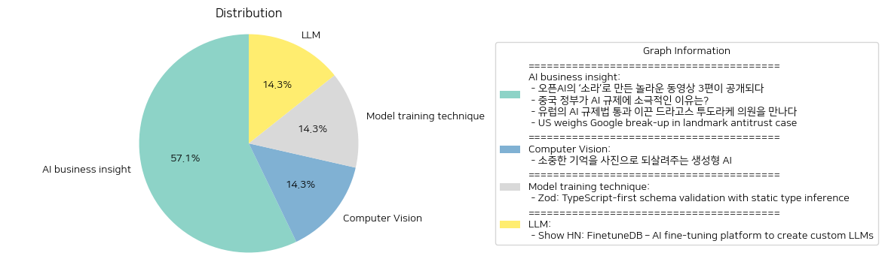

# Daily Artificial Intelligence Insights : News

## 🌅 AI business insight

**요약:**

**주요 테마**:
최근 기술 발전과 관련된 주요 테마는 인공지능(AI)과 그 규제에 관한 것이다. 오픈AI의 새로운 AI 모델 소라를 활용한 영화 제작, 중국의 AI 규제 정책, 유럽의 새로운 AI 규제법, 그리고 미국의 구글 반독점 관련 사건이 다각도로 기술 산업 및 규제에 미치는 영향을 조명하고 있다.

**주요 사건**:
1. 오픈AI의 ‘소라’를 이용해 제작된 세 편의 동영상이 공개되었다. 소라는 새로운 영상 생성 모델로서, 영상 크리에이터들에게 새로운 창작 기회를 제공한다.
2. 중국 정부는 AI 규제에 대해 상대적으로 느슨한 태도를 유지하고 있으며, 이는 자국의 AI 산업 성장을 염두에 둔 전략적 접근으로 보인다.
3. 유럽에서는 드라고스 투도라케 의원의 주도로 AI 규제법이 통과되었으며, 이 법은 AI 산업을 보다 나은 방향으로 개선할 수 있는 챙기가 될 것으로 기대된다.
4. 미국에서는 구글에 대한 반독점 소송이 주요 이슈로 부각되고 있으며, 이 경우가 구글의 분사를 초래할 가능성도 제기되고 있다.

**영향 분석**:
- **경제**: AI 기술의 발전은 다양한 산업에서 생산성을 향상시킬 수 있는 잠재력을 가지고 있으며, 새로운 시장 창출도 기대된다. 그러나 이와 함께 규제에 따른 비용 및 기술 독점에 대한 우려도 커지고 있다.
- **정치**: 각국 정부는 기술 발전을 지원하면서도 이에 대한 적절한 규제를 통해 통제력을 유지하려 하고 있다. 특히 유럽의 규제 강화는 글로벌 AI 규제의 기준점을 설정할 가능성이 있다.
- **사회**: 영상 생성 및 AI 기술은 콘텐츠 제작 가능성을 확장하고 있으나, 동시에 윤리적 문제 및 오남용 가능성에 대한 논의가 필요할 것으로 보인다.

**최종 요약**:
기술 발전과 이에 대한 규제는 계속해서 중요한 이슈로 남을 것이다. 오픈AI의 소라, 중국과 유럽의 대조적인 AI 정책 접근법, 그리고 미국의 antitrust case 등이 각국 및 기업 간의 기술 발전 전략에 중요한 영향을 미치고 있다. 이러한 흐름을 잘 이해하고 예의 주시한다면, 기술 발전과 규제의 균형을 찾는 데 중요한 역할을 할 수 있을 것이다. 앞으로 기술과 관련된 글로벌 정책 변화와 그에 따른 시장 반응을 계속해서 주목해야 할 것이다.

**출처:**

 - 오픈AI의 ‘소라’로 만든 놀라운 동영상 3편이 공개되다 (https://www.technologyreview.kr/%ec%98%81%ec%83%81-%ec%83%9d%ec%84%b1-%eb%aa%a8%eb%8d%b8-%ec%86%8c%eb%9d%bc%eb%a1%9c-%eb%a7%8c%eb%93%a0-%eb%86%80%eb%9d%bc%ec%9a%b4-%ec%98%81%ed%99%94-3%ed%8e%b8%ec%9d%b4-%ea%b3%b5%ea%b0%9c%eb%90%98/)
 - 중국 정부가 AI 규제에 소극적인 이유는? (https://www.technologyreview.kr/%ec%a4%91%ea%b5%ad-%ec%a0%95%eb%b6%80%ea%b0%80-%ed%98%84%ec%9e%ac%eb%a1%9c%ec%84%9c%eb%8a%94-ai-%eb%b6%84%ec%95%bc%eb%a5%bc-%ea%b0%80%ed%98%b9%ed%95%98%ea%b2%8c-%ea%b7%9c%ec%a0%9c%ed%95%98%ec%a7%80/)
 - 유럽의 AI 규제법 통과 이끈 드라고스 투도라케 의원을 만나다 (https://www.technologyreview.kr/ai-%ea%b7%9c%ec%a0%9c%eb%b2%95-%ed%86%b5%ea%b3%bc-%ec%9d%b4%eb%81%88-%eb%93%9c%eb%9d%bc%ea%b3%a0%ec%8a%a4-%ed%88%ac%eb%8f%84%eb%9d%bc%ec%bc%80-%ec%9d%98%ec%9b%90%ec%9d%84-%eb%a7%8c%eb%82%98%eb%8b%a4/)
 - US weighs Google break-up in landmark antitrust case (https://www.ft.com/content/f6e84608-e0e5-48c5-a0eb-dde7675fb608)

## 🚀 Computer Vision

**요약:**

1. **주요 테마**:
   - 생성형 AI 기술 활용
   - 개인과 가족의 추억 복원
   - 디지털 기술의 사회적 응용

2. **주요 사건**:
   - '합성 기억' 프로젝트가 생성형 AI를 통해서 잊혀진 추억을 이미지로 재현하는 새로운 사업을 추진하고 있다.
   - 이 프로젝트는 특히 다양한 가족이 그동안 기억 속에만 남겨져 있던 과거의 소중한 순간을 되찾을 수 있는 기회를 제공하고 있다.

3. **영향 분석**:
   - **사회적 영향**: 생성형 AI의 적극적인 응용을 통해 개인의 과거 경험과 감정적 연결을 유지하는 데 기여할 가능성이 크다. 이는 사회 전반에 걸쳐 긍정적인 심리적 영향을 미칠 수 있다.
   - **경제적 영향**: 이러한 기술에 대한 수요 증가는 관련 업계에 새로운 사업 기회를 제공할 것으로 예상되며, 관련 AI 기술 개발과 서비스 확장에 따른 경제적 파급 효과가 클 것으로 전망된다.
   - **기술적 발전**: 생성형 AI의 정교화와 관련 기술의 발전은 디지털 혁신을 가속화하며, 다양한 분야에서의 연계 응용 가능성을 높일 수 있다.

4. **최종 요약**:
   - ‘합성 기억’ 프로젝트는 AI 기술의 새로운 응용 사례로 주목받고 있으며, 이를 통해 여러 사회적, 경제적 분야에서 긍정적인 변화를 이끌어낼 잠재력을 보이고 있다. 이러한 geliş은 향후 기억 보존 기술의 향상 및 관련 시장의 성장을 촉진할 가능성이 있다. 앞으로 디지털 기술이 인간의 정서적 필요를 충족하는 방향으로 어떻게 발전해 나갈지 주목할 필요가 있다.

**출처:**

 - 소중한 기억을 사진으로 되살려주는 생성형 AI (https://www.technologyreview.kr/%ec%83%9d%ec%84%b1%ed%98%95-ai%eb%a1%9c-%ea%b0%80%ec%9e%a5-%ec%86%8c%ec%a4%91%ed%95%9c-%ea%b8%b0%ec%96%b5%ec%9d%84-%ec%82%ac%ec%a7%84%ec%9c%bc%eb%a1%9c-%eb%a7%8c%eb%93%a0%eb%8b%a4/)

## 🌅 Model training technique

**요약:**

1. **주요 주제**:
   이번 뉴스 기사에서는 주로 소프트웨어 개발, 특히 TypeScript를 중심으로 한 스키마 선언과 검증에 대한 양상이 다뤄졌습니다. 개발자 친화적 기능의 중요성, 데이터 구조의 복잡성을 처리하는 방법 등이 반복적으로 나타나는 주제입니다. 

2. **주요 사건**:
   Zod는 TypeScript를 위한 스키마 선언 및 검증 라이브러리로, 중복 타입 선언을 제거하고 개발자가 복잡한 데이터 구조를 조합하는 기능을 제공하는 주요 사건으로 소개되고 있습니다. 문자열 검증, 열거형 검증, 함수 스키마 검증 등을 지원하며, 함수의 입력 및 출력을 검증하는 데 사용됩니다.

3. **영향 분석**:
   이와 같은 기술의 발전은 소프트웨어 개발의 효율성을 크게 향상시킬 수 있습니다. 특히, 코드의 중복을 줄이고 오류 가능성을 낮추어 개발 비용 절감과 생산성 향상에 기여할 수 있습니다. 이는 IT 산업 및 관련기술업체에서 긍정적인 경제적 파급효과를 가져올 것으로 예상됩니다.

4. **최종 요약**:
   전체적인 분석 결과, TypeScript 및 관련 스키마 검증 도구들의 발전은 개발자들 사이에서 중요한 트렌드로 자리잡고 있습니다. 이 기술들은 점점 더 복잡해지는 데이터 구조를 관리하는 데 필수적인 역할을 하게 될 것이며, 앞으로의 소프트웨어 개발 패러다임에 중요한 영향을 미칠 것입니다. 지속적인 기술 발전을 통해 더욱 자동화되고 효율적인 개발 환경이 조성될 것으로 기대됩니다.

**출처:**

 - Zod: TypeScript-first schema validation with static type inference (https://zod.dev/)

## 🎇 LLM

**요약:**

**종합 요약 보고서**

1. **핵심 주제**:
    - AI 및 머신러닝 기술 발전: 기사 제목과 요약에서 드러나는 주요 주제는 AI 모델 최적화 및 맞춤형 대규모 언어 모델(LLM) 생성의 중요성입니다. 
    - 데이터 관리 및 통합: 데이터 캡처 및 비동기적 전송, 통합 기능 및 실행 추적 API의 중요성이 강조됩니다.

2. **주요 이벤트**:
    - FinetuneDB 플랫폼의 출시: FinetuneDB는 AI 모델을 맞춤화하기 위한 플랫폼으로, 프로덕션 데이터를 캡처하고 제어할 수 있는 기능을 제공합니다. 또한, 다양한 시스템과의 통합을 위한 SDK 및 API도 제시하여 사용자에게 맞춤화된 데이터 통합 경험을 제공합니다.

3. **영향 분석**:
    - 경제적 영향: AI 및 머신러닝 모델의 맞춤화 향상은 기업들이 데이터 기반의 비즈니스 전략을 더욱 정교하게 구축할 수 있게 하여 경쟁력을 높일 것으로 기대됩니다.
    - 사회적 영향: AI 기술의 발전은 다양한 산업에서 혁신을 가속화하고, 사용자 경험의 개선을 통해 사회적 편익을 증대시킬 가능성이 있습니다.

4. **최종 요약**:
    - FinetuneDB와 같은 플랫폼은 AI와 데이터 기술 분야에서 점점 중요해지고 있습니다. 이와 같은 기술 발전은 데이터 통합 및 맞춤화에 있어서 새로운 기준을 설정하며, 향후 다양한 산업 분야에서 AI의 활용도를 높일 것입니다. 앞으로 관련 기술의 발전이 어떠한 방식으로 기존의 AI 생태계에 변화를 가져올지, 그리고 이는 경제와 사회에 어떤 영향을 미칠지 지속적으로 주목할 필요가 있습니다.

**출처:**

 - Show HN: FinetuneDB – AI fine-tuning platform to create custom LLMs (https://finetunedb.com)

