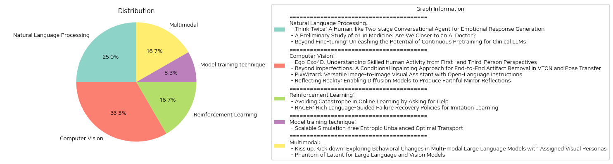

# Daily Artificial Intelligence Insights : Papers

## 💙 Natural Language Processing

**요약:**

### 종합 요약 보고서

1. **핵심 주제 및 테마 추출**:
   - 감성 대화 시스템과 인간 수준의 대화 에이전트 개발
   - 인공지능과 대형 언어 모델(LLM)의 의학 분야 적용 가능성
   - 임상 분야에서 LLM의 성능 최적화를 위한 새로운 방법론

2. **공통 키워드, 트렌드 및 패턴 식별**:
   - 대형 언어 모델(LLM)
   - 감정 생성 및 공감 이론
   - 임상 데이터와 실험
   - 연속적 사전 훈련 및 미세 튜닝

3. **주요 사건 및 중요한 정보 요약**:
   - **'Think Twice: A Human-like Two-stage Conversational Agent for Emotional Response Generation'**: 인간과 유사한 감정 대화 생성 시스템을 개발하기 위해 두 단계 대화 에이전트를 제안. 감정 주석이 없는 대화 모델을 먼저 사용하여 기본 응답을 생성한 후, 컨트롤 가능한 감정 보정기로 응답을 수정. 실험 결과 DailyDialog와 EmpatheticDialogues 데이터 세트에서 뛰어난 성능을 보임.
   
   - **'A Preliminary Study of o1 in Medicine: Are We Closer to an AI Doctor?'**: OpenAI의 o1 모델을 활용하여 의학 시나리오에서 LLM의 이해, 추론, 다국어 활용 측면을 평가. 이 모델은 NEJM 및 The Lancet에서 나온 전문 의료 퀴즈를 포함하여 37개의 의료 데이터 세트를 통해 특히 복잡한 QA 시나리오에서 뛰어난 성능을 보임. GPT-4를 능가하는 정확도를 보이지만, 환상(hallucination) 및 불일치된 다국어 능력과 같은 문제도 발견됨.
   
   - **'Beyond Fine-tuning: Unleashing the Potential of Continuous Pretraining for Clinical LLMs'**: 임상 응용에서 LLM의 성능을 향상시키기 위한 네 가지 방법론, 연속 사전 훈련, 인스트럭트 미세 튜닝, NEFTune, 프로프트 엔지니어링을 연구. 특히, NEFTune은 예상 외의 추가적인 성능 향상을 제공하며, 복잡한 프로ンプ트 엔지니어링이 전체적인 성능을 강화.

4. **이벤트가 다양한 분야에 미치는 영향 분석**:
   - 감정 대화 시스템은 고객 서비스, 교육 및 심리 상담 어플리케이션에 변화를 가져올 수 있음.
   - 의학 분야에서 LLM의 발전은 의료 진단 및 치료 계획 수립에서 혁신적인 변화를 촉발할 여지가 있으며, 임상 의사결정을 보조할 수 있음.
   - 임상 LLM의 지속적인 발전은 의료 정보 제공 및 환자 관리 효율화를 지원할 수 있음.

5. **결론 및 미래 발전 가능성**:
   - 인간과 유사한 대화 에이전트는 점차적으로 효율성과 감성 인식을 향상시키고 있으며, 응용 분야가 확장될 가능성이 큼.
   - o1 모델과 같은 AI 도구는 더 안전하고 정확한 의료 서비스를 지원하기 위해 진화하고 있지만, 모델의 한계를 지속적으로 검토하고 개선해야 함.
   - 임상 LLM의 지속적인 사전 훈련 및 정교한 튜닝 전략은 향후 의료 AI 솔루션이 더 다양한 임상 문제에 적응할 수 있는 기회를 제공할 것임. 

위의 연구들은 LLM과 AI 기술의 발전을 통해 다양한 분야에서 큰 변화를 초래할 수 있으며, 향후 지속적인 연구와 개선이 중요함을 강조함.

**출처:**

 - Think Twice: A Human-like Two-stage Conversational Agent for Emotional Response Generation (https://deeplearn.org/arxiv/532279/think-twice:-a-human-like-two-stage-conversational-agent-for-emotional-response-generation)
 - A Preliminary Study of o1 in Medicine: Are We Closer to an AI Doctor? (http://arxiv.org/abs/2409.15277v1)
 - Beyond Fine-tuning: Unleashing the Potential of Continuous Pretraining for Clinical LLMs (http://arxiv.org/abs/2409.14988v1)

## 🐱 Computer Vision

**요약:**

1. 각 논문의 제목과 요약에서 주요 주제와 테마를 추출하였습니다.

   - 'Ego-Exo4D' 논문은 고급 인간 활동을 1인칭과 3인칭 시점으로 이해하기 위한 대규모 멀티모달 데이터셋과 그 활용에 관한 것입니다. 이 논문은 다채로운 장르의 활동(예: 스포츠, 음악, 춤, 자전거 수리)을 다루며, 관련 연구를 촉진하기 위해 오픈 소스로 자원을 제공하는 점에서 중요합니다.

   - 'Beyond Imperfections' 논문은 VTON(Virtual Try-On)과 포즈 전송 애플리케이션의 시각적 결함을 제거하기 위한 조건부 인페인팅 기법을 제안합니다. 이 연구는 이러한 문제를 해결하는 엔드 투 엔드 프레임워크를 개발하였고 이미지 처리 분야의 새로운 벤치마크를 제시합니다.

   - 'PixWizard' 논문은 이미지-이미지 비주얼 어시스턴트를 제안하며 자유로운 언어 명령을 기반으로 이미지 생성, 변환, 조작을 가능하게 합니다. 이 어시스턴트는 다양한 해상도의 이미지를 동적으로 처리하고 미디어 일반화 능력을 발휘합니다.

   - 'Reflecting Reality' 논문은 거울반사를 사실적으로 생성하기 위한 확산 기반 모델을 연구합니다. SynMirror 데이터셋을 활용하여 거울 영역을 제시하는 입력 이미지와 마스크를 기반으로 한 깊이 조건부 인페인팅 방법을 제안합니다.

2. 공통적으로 강조된 키워드와 패턴은 다음과 같습니다.

   - 대규모, 멀티모달 데이터셋 구축과 활용
   - 이미지 처리 및 생성 기술의 고도화
   - 사용자 경험 개선을 위한 인공 지능 활용
   - 지시-응답 성능을 높이기 위한 자연어 처리 기술 접목

3. 각 논문의 주요 사건과 중요한 정보를 요약하였습니다.

   - 'Ego-Exo4D'는 인간 활동의 세부적인 이해를 위한 벤치마크와 다중 시점 데이터셋을 제공하여 관련 분야의 연구를 촉진합니다.
   - 'Beyond Imperfections'는 혁신적인 인페인팅 기법을 통해 VTON 및 포즈 전송의 시각적 결함을 대폭 줄이고, 이미지 품질을 향상하는 새로운 기준을 제시합니다.
   - 'PixWizard'는 다양한 비저널 처리 작업을 통합 프레임워크로 처리하여 여러 태스크에 대한 일반화 능력을 증명합니다.
   - 'Reflecting Reality'는 사실적이고 제어가 가능한 거울반사를 생성하여 이미지 편집과 증강 현실의 신뢰도를 높입니다.

4. 이러한 사건들이 영향을 미친다고 할 수 있는 분야는 크게 다음과 같습니다.

   - 컴퓨터 비전 및 영상 처리
   - 인공지능 기반 사용자 경험 개선
   - 증강 현실(AR) 및 가상 현실(VR) 등 차세대 미디어 기술 발전
   - 자연어 처리와 이미지 생성의 융합 연구

5. 종합적인 결론과 향후 주요 발전 가능성에 대한 통합 요약은 다음과 같습니다.

   각 연구는 해당 분야의 한계를 넘어선 솔루션을 제공하며, 인공지능 기술을 통해 사용자 경험을 향상시키고 있습니다. 활동 이해, 이미지 처리 및 생성, 자연어 인터페이스 분야에서의 혁신적 진보는 AR/VR 및 다양한 미디어 응용 분야에서 중요한 역할을 할 것입니다. 앞으로는 이러한 기술들이 더욱 나은 인간-컴퓨터 상호작용을 가능하게 하고, 실시간으로 사용자 맞춤형 경험을 제공하는 방향으로 발전할 것으로 보입니다. 영문 논문들이 제시하는 많은 리소스가 오픈 소스로 제공되어 연구의 확장이 기대됩니다.

**출처:**

 - Ego-Exo4D: Understanding Skilled Human Activity from First- and Third-Person Perspectives (https://deeplearn.org/arxiv/531092/ego-exo4d:-understanding-skilled-human-activity-from-first--and-third-person-perspectives)
 - Beyond Imperfections: A Conditional Inpainting Approach for End-to-End Artifact Removal in VTON and Pose Transfer (https://deeplearn.org/arxiv/534386/beyond-imperfections:-a-conditional-inpainting-approach-for-end-to-end-artifact-removal-in-vton-and-pose-transfer)
 - PixWizard: Versatile Image-to-Image Visual Assistant with Open-Language Instructions (http://arxiv.org/abs/2409.15278v2)
 - Reflecting Reality: Enabling Diffusion Models to Produce Faithful Mirror Reflections (http://arxiv.org/abs/2409.14677v1)

## 🎠 Reinforcement Learning

**요약:**

요약 보고서:

1. 핵심 주제 및 테마 추출:
   - 'Avoiding Catastrophe in Online Learning by Asking for Help': 이 논문은 온라인 학습에서 돌이킬 수 없는 실수를 피하기 위한 방법에 중점을 두고 있으며, 멘토에게 도움을 요청하는 제한된 쿼리를 통해 재난 발생 가능성을 최소화하는 문제를 제안합니다. 핵심 주제는 '재난 회피', '멘토의 도움 요청', '후회 보장'입니다.
   - 'RACER: Rich Language-Guided Failure Recovery Policies for Imitation Learning': 이 논문은 로봇 조작에서 실패 복구 메커니즘을 개발하는 데 중점을 두고 있으며, 확장 가능한 데이터 생성 파이프라인을 통해 전문 시연과 실패 복구 궤적 및 언어 주석을 결합해 강화된 로봇 제어를 이끌어내는 방법을 제안합니다. 주요 주제는 '언어 주도', '실패 복구', '로봇 제어'입니다.

2. 공통 키워드, 트렌드, 패턴 식별:
   - 공통 키워드: '실수', '실패 복구', '언어 지시', '학습 알고리즘'
   - 트렌드: 두 논문 모두 '실수 방지 및 복구'에 초점을 맞추고 있으며, 알고리즘 개선을 통해 시스템의 신뢰성과 효과성을 높이고자 합니다.

3. 주요 사건 및 핵심 정보 요약:
   - 온라인 학습에서 발생할 수 있는 재난을 피하기 위해 멘토의 도움을 활용하는 방법이 제안되었습니다. 이는 재난의 위험을 줄이는 동시에 알고리즘의 학습 능력을 향상시키는 데 기여합니다.
   - RACER는 로봇 조작 중 실패를 회복할 수 있는 풍부한 언어 지침을 활용하여 복구 정책을 개발했습니다. 이는 복잡한 작업, 목표의 변경, 새로운 작업을 처리하는 데 더욱 강력한 성능을 제공합니다.

4. 이러한 사건이 다양한 분야에 미치는 영향:
   - 교육 및 학습 분야: 온라인 학습에서의 실수 방지와 멘토링의 중요성을 강조하며, 교육 시스템의 안전성과 효율성을 높이는 데 기여할 수 있습니다.
   - 로봇 공학 분야: 로봇의 자율성과 대응 능력을 강화함으로써, 산업 자동화 및 다양한 작업 환경에서 로봇의 유용성을 확대할 수 있습니다.

5. 결론 및 미래 개발 관찰:
   - 결론적으로, 온라인 학습 및 로봇 제어 분야에서 실수 및 실패 관리의 중요성이 부각되고 있으며, 이는 관련 기술의 발전에 직접적인 영향을 미칠 것으로 보입니다.
   - 미래 개발에서는 '지능적이고 안전한 학습 알고리즘'과 '언어 기반 로봇 실패 복구 시스템'을 더욱 발전시키기 위한 연구가 지속될 것입니다. 이러한 기술은 교육과 산업 현장 모두에서 효율성과 안전성을 높이는 데 기여할 것으로 기대됩니다.

**출처:**

 - Avoiding Catastrophe in Online Learning by Asking for Help (https://deeplearn.org/arxiv/533114/avoiding-catastrophe-in-online-learning-by-asking-for-help)
 - RACER: Rich Language-Guided Failure Recovery Policies for Imitation Learning (http://arxiv.org/abs/2409.14674v1)

## 🎉 Model training technique

**요약:**

보고서 요약:

1. 주요 주제와 테마 추출:
   - 논문 제목에서 확인할 수 있는 주요 주제는 '시뮬레이션 프리 엔트로픽 불균형 최적 수송(Entropic Unbalanced Optimal Transport)'입니다.
   - 논문 요약에서 확인할 수 있는 주요 주제는 '최적 수송 문제', '엔트로피', '불균형', '시뮬레이션 프리 알고리즘' 등이 있습니다.

2. 공통 키워드, 트렌드, 패턴 식별:
   - 공통 키워드: 최적 수송(Optimal Transport), 엔트로픽 불균형(Entropic Unbalanced), 시뮬레이션 프리(Simulation-free), 일반화, 슈뢰딩거 브리지(Schrodinger Bridge), 생성적 모델링(Generative Modeling), 이미지-이미지 변환(Image-to-Image Translation).
   - 트렌드 및 패턴: 기존의 슈뢰딩거 브리지 모델들은 높은 시뮬레이션 비용을 요구하는 반면, 본 연구는 시뮬레이션 없이 단일 단계로 훈련하고 결과를 생성할 수 있는 알고리즘을 개발하여 효율성을 높이고자 함.

3. 주요 사건 및 중요 정보 요약:
   - 최적 수송 문제는 두 분포를 주어진 비용 함수를 최소화하며 연결하는 전송 맵을 조사함.
   - 본 논문에서는 '엔트로픽 불균형 최적 수송(EUOT)' 문제를 해결하기 위한 확장 가능하고 시뮬레이션이 필요 없는 접근법을 소개함.
   - '슈뢰딩거 브리지(SB)' 문제의 일반화된 형태로서의 EUOT 문제의 동태적 형태를 도출함.
   - '확률 최적 제어' 해석으로부터 EUOT 문제의 이중화 및 최적성 조건을 도출하며 이를 통해 시뮬레이션이 필요 없는 알고리즘, '시뮬레이션 프리 EUOT(SF-EUOT)'를 제안함.
   - 본 알고리즘은 생성적 모델링과 이미지-이미지 변환 과제에서 기존 SB 방법들에 비해 현저히 개선된 확장성을 보여줌.

4. 이러한 사건의 다양한 부문에 대한 영향 분석:
   - 기계 학습 부문에서는 생성적 모델링 및 이미지-이미지 변환 작업이 보다 효율적으로 수행될 수 있어, 적은 계산 비용으로 더 높은 성능을 기대할 수 있음.
   - 데이터 과학 및 프로세스 자동화 분야에서는 시뮬레이션 비용 절감과 효율성 증대로 인해 다양한 응용 분야에서의 동적 모델링에 대한 접근성을 더욱 증대시킬 것으로 보임.

5. 최종 통합 요약 및 결론:
   - 본 연구에서 제안된 시뮬레이션 프리 EUOT 접근법은 최적 수송 문제를 해결하는 데 있어 상당한 발전을 의미하며, 주요 응용 분야인 생성적 모델링 및 이미지-이미지 변환에서의 성능 개선을 기대할 수 있음.
   - 앞으로의 발전은 이러한 모델이 실제 산업과 과학 연구에서 다양한 데이터 집합 및 시나리오에 어떻게 적용될 수 있는지를 확인하는 데 중점을 둘 필요가 있을 것으로 보임. 또한, 이 접근법을 다른 최적화 문제나 대규모 데이터 처리 문제에 확장 가능성을 탐색할 가치가 있음.

**출처:**

 - Scalable Simulation-free Entropic Unbalanced Optimal Transport (https://deeplearn.org/arxiv/532714/scalable-simulation-free-entropic-unbalanced-optimal-transport)

## 🎇 Multimodal

**요약:**

**요약 보고서: 다중모달 대형 언어 모델 및 비전 모델의 행동 변화 연구**

**1. 주요 주제 및 테마 추출:**

첫 번째 논문, 'Kiss up, Kick down: Exploring Behavioral Changes in Multi-modal Large Language Models with Assigned Visual Personas'는 시각적 페르소나가 할당된 다중모달 대형 언어 모델(LLMs)의 행동 변화를 최초로 탐구하고 있습니다. 여기서는 시각적 속성이 언어 모델의 협상 행동에 미치는 영향을 분석하여 특히 공격성에 중점을 두었습니다.

두 번째 논문, 'Phantom of Latent for Large Language and Vision Models'는 가시화 기법을 활용한 시각 및 언어 모델(LLVMs)의 성장과 성능 향상에 관한 연구입니다. 모델의 크기를 증가시키는 대신, 효율성을 높인 Phantom이라는 새로운 LLVM 패밀리를 소개하여 제한된 구조 내에서 학습 능력을 향상시킵니다.

**2. 공통 키워드, 트렌드 및 패턴 식별:**

두 논문 모두 다중모달 모델의 성능 및 행동 최적화에 중점을 두고 있으며, 시각적 요소와 언어 이해를 융합하여 결과적으로 더 나은 성능 및 응용 가능성을 탐구하고 있습니다. 또한, 모델 크기의 증가와 효율성이라는 공통의 과제가 논의되었다는 점에서 유사성을 보입니다.

**3. 주요 사건 및 중요한 정보 요약:**

- **시각적 페르소나와 행동 변화:** 첫 번째 연구에서는 시각적 페르소나의 공격성이 모델의 협상 행동에 직접적인 영향을 미치는 것으로 나타났으며, 인간이 이미지를 통해 느끼는 공격성을 모델 역시 인지할 수 있는 능력이 있다는 사실을 확인했습니다.

- **모델의 효율성 및 성능:** 두 번째 연구는 Phantom 패밀리를 통해 기존보다 작은 모델 규모로 성능을 향상시키는 방법을 제시합니다. 이를 통해, 더 작은 시스템에서도 대형 모델 수준의 성능 달성이 가능하게 하였습니다.

**4. 이벤트의 다양한 분야에 대한 영향 분석:**

이러한 연구는 인공지능의 언어 이해 및 시각적 처리 능력을 증대시킴으로써, 대화형 AI, 자동화된 고객 서비스, 협상 보조 시스템 등 다양한 분야에서 큰 혁신을 가져올 수 있을 것입니다. 특히 두 논문의 연구는 AI 기반 소프트웨어의 효율성을 더욱 높여 기업 및 개인 사용자들에게 이점을 제공할 것입니다.

**5. 결론 및 향후 발전 가능성:**

이 연구들은 AI 시스템의 모델 크기를 늘리지 않고도 성능을 극대화할 수 있는 가능성을 열어주고 있습니다. 시각적 정보를 통해 행동을 최적화하는 연구는 향후 더욱 정교한 AI 행동 예측 및 조절 시스템 개발에 기여할 수 있습니다. 따라서, 효율적 학습 알고리즘 개선 및 시각-언어 통합 모델이 향후 AI 발전에 중요한 이정표가 될 것입니다.

**출처:**

 - Kiss up, Kick down: Exploring Behavioral Changes in Multi-modal Large Language Models with Assigned Visual Personas (https://deeplearn.org/arxiv/533364/kiss-up,-kick-down:-exploring-behavioral-changes-in-multi-modal-large-language-models-with-assigned-visual-personas)
 - Phantom of Latent for Large Language and Vision Models (http://arxiv.org/abs/2409.14713v1)

