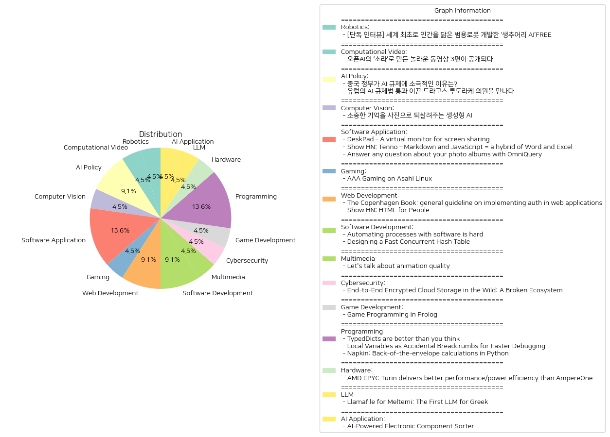

# Daily Artificial Intelligence Insights : News

## 🌞 Robotics

**요약:**

1. **주요 테마**:
   - 인공지능(AI) 발전: AI 기술의 혁신과 그 영향을 중심으로 한 뉴스가 두드러짐.
   - 로봇 공학의 발전: 인간을 닮은 범용 로봇 개발과 이를 통한 일상생활의 변화 가능성이 강조됨.
   - 미래 기술 예측: 기술 발전이 미래 사회 및 산업에 미칠 영향에 대한 논의가 지속되고 있음.

2. **중요한 사건**:
   - 캐나다 AI 로봇 전문 기업 생추어리 AI가 세계 최초로 인간을 닮은 범용 로봇을 개발했다는 소식이 전해짐.
   - 생추어리 AI의 대표 조르디 로즈가 미래의 로봇에 대해 비전을 공유하며 향후 기술 발전 방향에 대해 논의함.

3. **영향 분석**:
   - 경제: 인공지능과 로봇 공학의 발전은 일자리 구조에 변화를 가져올 가능성이 높고, 새로운 산업과 시장의 성장 동력을 제공할 수 있을 것으로 전망됨.
   - 사회: 인간과 로봇의 상호작용이 증가하면서 윤리적 문제와 사회적 관계의 변화가 예상됨. 특히, AI 기술을 일상에 어떻게 통합할 것인지가 중요한 사회적 논의의 주제가 될 것임.

4. **최종 요약**:
   최근 AI와 로봇 공학의 발전은 기술 혁신의 중심에 서 있으며, 이러한 발전은 경제와 사회 전반에 걸쳐 큰 변화를 일으킬 잠재력을 가지고 있음. 생추어리 AI의 범용 로봇 개발은 이러한 변화를 가속화할 중요한 첫걸음으로 평가됨. 앞으로 로봇과 AI가 인간 생활에 융합될 때 발생할 윤리적, 경제적, 사회적 영향에 대한 대비가 필요하며, 이에 대한 논의가 지속적으로 이루어질 것으로 예상됨. 향후 기술 발전이 어떻게 현실화될지, 그리고 이로 인한 사회 구조의 변화가 얼마나 클지를 주목할 필요가 있음.

**출처:**

 - [단독 인터뷰] 세계 최초로 인간을 닮은 범용로봇 개발한 ‘생추어리 AI’FREE (https://www.technologyreview.kr/%ec%9d%b8%ed%84%b0%eb%b7%b0-%ec%83%9d%ec%b6%94%ec%96%b4%eb%a6%ac-ai%ea%b0%80-%ea%b7%b8%eb%a6%ac%eb%8a%94-%eb%af%b8%eb%9e%98%ec%9d%98-%eb%a1%9c%eb%b4%87%ec%9d%80-%ec%8b%a4%ec%b2%b4%ed%99%94/)

## 🤩 Computational Video

**요약:**

1. **주요 테마**:
   - 동영상 생성 기술의 발전: 오픈AI의 신기술 ‘소라’로 동영상을 제작하는 동영상 생성 모델의 혁신.
   - 인공지능과 창의성의 접목: 기술과 예술의 경계 허물기, 크리에이터들이 인공지능을 활용하여 새로운 형태의 콘텐츠 창출.
   
2. **주요 사건**:
   - 오픈AI의 ‘소라’ 모델로 제작된 3편의 동영상이 공개되다: 이 사건은 새로운 제작 기법을 탐구하는 크리에이터들의 참여와 함께 이루어졌으며, 기술의 용도와 목적에 대한 심도 있는 논의가 이루어짐.

3. **영향 분석**:
   - 경제적 영향: 동영상 제작 산업의 새로운 패러다임을 제공하여 시장의 변화 가능성 증가, 독립 크리에이터들에게 새로운 기회 제공.
   - 사회적 영향: 일반 대중의 미디어 소비 방식에 변화 예견, AI와 인간의 협업이 일상화됨에 따라 창작 활동의 민주화 촉진.

4. **최종 요약**:
   - 오픈AI의 ‘소라’로 제작된 동영상들은 동영상 제작의 미래 가능성을 크게 보여준다. 이 새로운 AI 기술의 도입은 크리에이티브 산업 전반에 걸쳐 혁신을 가져올 것으로 예상되며, 특히 동영상 콘텐츠의 제작 방식에 획기적인 변화를 가져올 가능성이 크다. 앞으로의 개발 및 적용 과정에서 창출될 다양한 영향과 그로 인한 사회적, 경제적 변화에 주목할 필요가 있다. AI 기술이 창의성과 결합할 때 어떤 새로운 형태의 미디어가 나타날지 기대된다.

**출처:**

 - 오픈AI의 ‘소라’로 만든 놀라운 동영상 3편이 공개되다 (https://www.technologyreview.kr/%ec%98%81%ec%83%81-%ec%83%9d%ec%84%b1-%eb%aa%a8%eb%8d%b8-%ec%86%8c%eb%9d%bc%eb%a1%9c-%eb%a7%8c%eb%93%a0-%eb%86%80%eb%9d%bc%ec%9a%b4-%ec%98%81%ed%99%94-3%ed%8e%b8%ec%9d%b4-%ea%b3%b5%ea%b0%9c%eb%90%98/)

## 🎉 AI Policy

**요약:**

1. **주요 테마**:
   - AI(인공지능) 규제와 관련된 정책 및 입법 활동이 국가별로 다양하게 진행되고 있다는 점.
   - 각국 정부의 규제 접근 방식이 그들의 산업 성장 전략 및 경제적 목표에 따라 다르다는 점.

2. **주요 사건**:
   - 중국 정부는 AI 기술 발전을 장려하기 위해 규제를 느슨하게 하고 있는 반면, 소비자 기술 플랫폼에는 강경한 규제를 유지하고 있다.
   - 유럽에서는 드라고스 투도라케 의원이 역사적인 AI 규제법 제정을 이끌어내며, 이를 통해 AI 산업의 책임성과 품질을 향상시키고자 한다.

3. **영향 분석**:
   - 경제적 영향: 중국의 느슨한 AI 규제 정책은 국내 AI 산업의 획기적인 발전을 촉진시킬 수 있지만, 국제 사회에서는 데이터 안전성과 윤리적 기준에 대한 우려가 존재할 수 있다. 반면, 유럽의 엄격한 AI 규제법 채택은 산업의 책임감 있는 발전과 소비자 보호를 강화하는 방향으로 나아갈 것이다.
   - 정치적 영향: 기술 규제는 각국의 정치적 입장과 국제 협력에도 영향을 미치며, AI의 규제와 혁신 사이에서 균형점을 찾는 것이 새로운 국제적 과제로 떠오르고 있다.

4. **최종 요약**:
   - 현재 AI 기술 규제와 관련하여 각국은 다양한 방식을 취하고 있으며, 이는 해당 국가의 경제적 및 정치적 목표에 따라 이루어지고 있다. 중국은 AI 산업의 급속한 성장을 장려하기 위해 규제를 상대적으로 완화하고 있으며, 반면 유럽은 공공 안전과 혁신의 책임성을 중시하는 규제법을 마련함으로써 AI 산업의 올바른 방향성을 제시하고자 한다. 이러한 규제품의 차이는 나중에 국제 협력 및 상호 작용에도 영향을 미칠 가능성이 있으며, 미래에는 각국의 규제 정책이 서로 어떻게 조화롭게 추진될지 관찰할 필요가 있다.

**출처:**

 - 중국 정부가 AI 규제에 소극적인 이유는? (https://www.technologyreview.kr/%ec%a4%91%ea%b5%ad-%ec%a0%95%eb%b6%80%ea%b0%80-%ed%98%84%ec%9e%ac%eb%a1%9c%ec%84%9c%eb%8a%94-ai-%eb%b6%84%ec%95%bc%eb%a5%bc-%ea%b0%80%ed%98%b9%ed%95%98%ea%b2%8c-%ea%b7%9c%ec%a0%9c%ed%95%98%ec%a7%80/)
 - 유럽의 AI 규제법 통과 이끈 드라고스 투도라케 의원을 만나다 (https://www.technologyreview.kr/ai-%ea%b7%9c%ec%a0%9c%eb%b2%95-%ed%86%b5%ea%b3%bc-%ec%9d%b4%eb%81%88-%eb%93%9c%eb%9d%bc%ea%b3%a0%ec%8a%a4-%ed%88%ac%eb%8f%84%eb%9d%bc%ec%bc%80-%ec%9d%98%ec%9b%90%ec%9d%84-%eb%a7%8c%eb%82%98%eb%8b%a4/)

## 🎇 Computer Vision

**요약:**

1. **주요 테마**:
   - 생성형 AI 기술의 발전: 생성형 AI를 통해 과거의 기억을 사진으로 재현하는 기술이 주목받고 있습니다. 기술 발전이 사회 전반에 미치는 영향이 주요 테마로 부각됩니다.

2. **주요 사건**:
   - '합성 기억' 프로젝트 추진: 현재 '합성 기억' 프로젝트가 실행되고 있으며, 이를 통해 다양한 가족이 과거의 소중한 추억을 되살릴 수 있는 기회가 제공되고 있습니다. 이 프로젝트는 카메라에 담지 못한 기억을 이미지로 변환하는데 중점을 두고 있습니다.

3. **영향 분석**:
   - 사회적 영향: 생성형 AI를 통한 과거 기억의 재생성은 개인과 가족 단위에서 감정적 치유와 연결 강화를 도모할 수 있으며, 사회 전반에 걸쳐 기억 문화의 변화를 가져올 가능성이 있습니다.
   - 경제적 영향: 새로운 기술의 적용 범위가 확대됨에 따라 관련 산업의 발전과 시장 성장의 기회가 열릴 수 있으며, 기술 개발 및 투자 촉진의 요인이 될 수 있습니다.

4. **최종 요약**:
   - 생성형 AI 기술을 활용한 이미지 생성이 개인과 가족의 기억을 되살리는 새로운 방식을 제시하고 있습니다. 이는 기술이 개인의 감정적 요구를 충족시키면서도 새로운 경제적 기회를 창출할 수 있음을 보여줍니다. 앞으로 AI 기반의 기술 발전이 사회와 경제에 어떤 영향을 미칠지 주목할 필요가 있으며, '합성 기억' 프로젝트와 같은 이니셔티브가 어떻게 확대되고 발전할지 지속적인 관심이 요구됩니다.

**출처:**

 - 소중한 기억을 사진으로 되살려주는 생성형 AI (https://www.technologyreview.kr/%ec%83%9d%ec%84%b1%ed%98%95-ai%eb%a1%9c-%ea%b0%80%ec%9e%a5-%ec%86%8c%ec%a4%91%ed%95%9c-%ea%b8%b0%ec%96%b5%ec%9d%84-%ec%82%ac%ec%a7%84%ec%9c%bc%eb%a1%9c-%eb%a7%8c%eb%93%a0%eb%8b%a4/)

## 🌿 Software Application

**요약:**

1. **주요 테마**:
   - 이 세 가지 기사에서 공통적으로 나타나는 테마는 기술 혁신과 소프트웨어의 발전입니다. 각 기사는 새로운 애플리케이션이나 기술 시스템이 사용자 경험을 어떻게 개선하는지 설명합니다.
   - 연대기 생성, 데이터 증강 및 가상 모니터링과 같은 참신한 소프트웨어 기능들이 주된 주제로 다뤄집니다.

2. **주요 사건 요약**:
   - 'DeskPad': 이 응용 프로그램은 가상 모니터 역할을 통해 화면 공유 기능을 개선하는 솔루션을 제시합니다. 시스템 환경설정에 따라 창과 해상도를 조정하는 기능을 가지고 있습니다.
   - 'Tenno': 이 애플리케이션은 워드, 엑셀, 그리고 자바스크립트를 결합하여 사용자에게 동적인 문서를 제공하는 하이브리드 소프트웨어입니다. 실시간 업데이트가 가능한 공식 작성, 차트 생성, API 호출 등의 기능을 제공합니다.
   - 'OmniQuery': 이 소프트웨어는 개인 사진 앨범에 대한 복잡한 질문에 답변을 제공하는 도구입니다. 대형 언어 모델을 사용하여 필요한 메모리를 검색하고 답변을 생성하는 레트리벌 증강 생성(RAG) 및 분류 기반의 데이터 증강 방법을 사용합니다.

3. **영향 분석**:
   - 경제적으로, 이러한 혁신적인 소프트웨어는 생산성과 효율성을 향상시킬 것으로 예상됩니다. 개인 사용자 뿐만 아니라 비즈니스 환경에서도 활용도가 높아질 것입니다.
   - 사회적으로, 기술 발전에 따라 보다 사용자 중심의 경험이 강화될 것이며, 다양한 데이터 및 정보 이용이 더욱 쉬워질 것입니다.

4. **최종 요약**:
   - 이 소프트웨어 혁신들은 개인 및 비즈니스 사용자에게 새로운 가능성을 제시하며, 기술의 통합과 사용자의 필요를 충족시키는 경험 중심의 솔루션을 제공합니다. 
   - 미래에는 이러한 기술이 더욱 발전하면서 사용자 정의 기능 및 인공지능의 융합도가 높아질 가능성이 큽니다. 
   - 특히, 데이터 처리 및 비주얼라이제이션 분야에서의 혁신이 지속적으로 강화될 것으로 보입니다. 계속해서 기술의 발전 방향과 사용자 피드백을 주목해야 할 것입니다.

**출처:**

 - DeskPad – A virtual monitor for screen sharing (https://github.com/Stengo/DeskPad)
 - Show HN: Tenno – Markdown and JavaScript = a hybrid of Word and Excel (https://tenno.app)
 - Answer any question about your photo albums with OmniQuery (https://jiahaoli.net/omniquery/)

## 💙 Gaming

**요약:**

1. **주요 테마**:
   - 기술 발전 및 게임 산업 혁신
   - Apple M1 사용자를 위한 지원 확대 및 소프트웨어 호환성
   - 오픈 소스 소프트웨어의 진보 및 활용

2. **주요 사건**:
   - Asahi Linux가 Apple M1 사용자들을 위한 게임 툴킷의 알파 버전을 출시했다. 이 툴킷은 Vulkan 1.3 드라이버, x86 에뮬레이션, 그리고 Windows 호환성을 통해 Control, Fallout 4와 같은 게임 플레이를 가능하게 한다.

3. **영향 분석**:
   - 경제 분야에서는 M1 사용자에 대한 게임 호환성 확대가 새 하드웨어 판매 및 소프트웨어 시장 확장에 기여할 수 있다.
   - 기술 산업 및 소프트웨어 개발에서는 오픈 소스 소프트웨어가 제공하는 새로운 가능성을 열어 창작 및 혁신을 촉진할 것으로 예상된다.
   - 사회적으로는 사용자의 접근성과 선택 옵션 확대를 통해 고급 기술 활용의 민주화를 촉진할 수 있다.

4. **최종 요약**:
   Asahi Linux의 새로운 툴킷 출시는 기술 혁신과 사용자 경험의 향상에 중점을 두고 있으며, M1 하드웨어 소유자의 게임 환경을 크게 개선시키고 있다. 이는 오픈 소스 소프트웨어의 역할을 다시 한번 부각시키고 있으며, 앞으로도 이러한 소프트웨어 솔루션이 다양한 플랫폼에서의 호환성을 계속해서 확대해 나갈 가능성이 높다. 이에 따라 앞으로의 발전 동향을 주시하면서 관련 기술의 발전과 사용자 환경의 변화에 민첩하게 대응하는 것이 중요하다.

**출처:**

 - AAA Gaming on Asahi Linux (https://rosenzweig.io/blog/aaa-gaming-on-m1.html)

## ❄️ Web Development

**요약:**

1. **주요 테마**:
   두 기사 모두 교육과 기술에 초점을 맞추고 있습니다. "코펜하겐 책"은 웹 애플리케이션에서 인증 구현에 관한 가이드라인을 제공하며, "HTML for People"은 HTML을 쉽게 이해할 수 있도록 설명하는 교육적 리소스를 제공합니다. 두 주제 모두 기술 지식을 보다 친근하고 접근하기 쉽게 만드는 데 중점을 두고 있습니다.

2. **주요 사건**:
   - 'The Copenhagen Book'는 웹 애플리케이션 인증 구현에 대한 일반적인 가이드라인을 제공하며, 오픈 소스와 커뮤니티 유지로 무료로 제공됩니다. 이는 온라인 리소스에서의 공백을 채울 수 있는 역할을 하며, OWASP Cheat Sheet Series와 함께 사용되는 것이 권장됩니다.
   - 'HTML for People'는 Blake Watson이 HTML을 기술 전문가뿐만 아니라 모든 사람에게 친근하고 접근 가능한 방식으로 가르치는 내용입니다. 이전 경험 없이도 웹사이트를 제작하는 데 필요한 모든 내용을 다루고 있습니다.

3. **영향 분석**:
   - 기술 및 교육 섹터: 두 자료는 기술 교육의 접근성을 높여 더 많은 사람들이 웹 개발과 IT 보안 영역에 접근할 수 있도록 도와줍니다. 이는 장기적으로 개발자 커뮤니티의 확대와 더 나은 보안 지식의 확산을 예상할 수 있습니다.
   - 사회적 영향: 기술 지식을 가진 인구가 증가함에 따라, 디지털 격차가 줄어들고 전반적인 기술적 이해도가 향상될 것으로 보입니다.

4. **최종 요약**:
   두 교육자료는 기술 분야에 대한 이해도를 높이고 접근성을 개선하는 데 기여합니다. 이러한 움직임은 점차 많은 사람들이 개발자 커뮤니티에 참여하고, 더 나은 보안 인식이 확산되며, 디지털 세상에 더 잘 준비될 수 있도록 합니다. 앞으로 이러한 트렌드는 더욱 강해질 것으로 예상되며, 다양한 온라인 리소스 개발과 대중화를 주의 깊게 살펴볼 필요가 있습니다.

**출처:**

 - The Copenhagen Book: general guideline on implementing auth in web applications (https://thecopenhagenbook.com/)
 - Show HN: HTML for People (https://htmlforpeople.com)

## ❄️ Software Development

**요약:**

1. **주요 테마**:
    - 자동화의 복잡성과 그것의 실행에서의 어려움.
    - 고성능과 확장성을 우선시하는 기술 디자인, 특히 동시 작업과 관련된 기술.

2. **주요 사건**:
    - 첫 번째 기사에서는 자동화를 실행하는 것이 사람들의 기대보다 복잡할 수 있음을 설명하고 있다. 자동화를 구현할 때 시스템의 입력을 이해하고 예외를 처리하는 방식을 중점으로 해야 한다고 강조한다.
    - 두 번째 기사에서는 빠른 동시 해시 테이블인 Papaya의 구현을 설명하고 있다. 이 시스템은 읽기 무거운 작업 부하에 적합하며 예측 가능한 지연 시간을 제공하도록 설계되었다. 샤딩, 락 프리 디자인 및 원자적 운영을 통해 높은 성능과 확장성을 달성하고 있다는 내용을 담고 있다.

3. **영향 분석**:
    - **경제**: 자동화가 노동 효율성을 높일 수 있지만 시행 오류는 경제적 손실로 이어질 수 있으며, 고도로 설계된 시스템은 기업의 기술 인프라를 혁신하여 경제적 성과를 향상시킬 수 있다.
    - **정치**: 개인정보 보호 및 데이터 관리 문제로 인해 자동화 및 기술 시스템 디자인은 규제 감독의 대상이 될 수 있다.
    - **사회**: 자동화의 점진적인 증가는 일자리의 변화를 초래할 수 있으며, 기술에 대한 접근 및 교육이 요구된다.

4. **최종 요약**:
    최근 기술 분야에서는 자동화 및 고성능 시스템 디자인이 중요한 주제로 논의되고 있다. 현재 자동화를 효과적으로 구현하는 데 있어 입력의 명확한 이해와 예외 처리가 강조되고 있으며, Papaya와 같은 시스템들은 기술적 혁신의 경로를 보여주고 있다. 이러한 기술 발전은 경제 및 사회 전반에 걸쳐 일자리 변화, 효율성 향상, 데이터 관리 등 다양한 영향을 미칠 것으로 예상된다. 앞으로도 기술 발전과 관련된 효과적인 규제 및 시스템 설계 개선이 중요한 쟁점이 될 것이다.

**출처:**

 - Automating processes with software is hard (https://hardcoresoftware.learningbyshipping.com/p/222-automating-processes-with-software)
 - Designing a Fast Concurrent Hash Table (https://ibraheem.ca/posts/designing-papaya/)

## 🌅 Multimedia

**요약:**

**키 테마**:
- 애니메이션 품질의 중요성
- 높은 시간 해상도와 수치 정확도의 필요성
- 공공 데이터 세트의 한계와 문제점
- 애니메이션 데이터의 체계적 오류, 노이즈 및 인위적 요소

**주요 사건**:
- 사용자는 애니메이션 데이터의 품질이 중요한 이유와 이를 달성하기 위한 어려움을 논의
- 최소 60 Hz의 고해상도 및 최소 5-6 소수점의 수치 정확성이 필요한 이유 설명
- AMASS와 같은 공개적으로 이용 가능한 데이터 세트의 체계적 오류, 노이즈, 및 인위적 요소의 문제가 있다는 점을 강조

**영향 분석**:
- **경제**: 고품질 애니메이션 제작 요구는 시간과 비용 증가를 수반할 수 있으며, 관련 소프트웨어나 하드웨어 산업에 긍정적 영향을 미칠 수 있음.
- **사회**: 애니메이션 자체의 품질 향상은 시청자에게 더 나은 시각적 경험을 제공하고, 교육 및 엔터테인먼트 분야에도 긍정적인 영향을 미칠 수 있음.
- **기술**: 애니메이션 품질 개선을 통해 시뮬레이션, 가상현실 등 다양한 분야에서 애니메이션 기술 활용의 범위가 확대될 가능성이 있음.

**최종 요약**:
애니메이션 품질의 중요성과 이를 달성하기 위한 기술적인 요구사항이 주목받고 있는 가운데, 공공 데이터 세트의 한계는 여전히 해결해야 할 문제로 남아 있다. 향후 애니메이션 기술의 발전은 보다 높은 품질의 데이터 세트 개발과 함께, 다양한 산업에 긍정적인 영향을 미칠 것으로 예상된다. 이러한 발전을 통해 기술의 발전과 함께 경제, 사회, 기술 등 여러 분야에서 새롭고 창의적인 대안이 나올 가능성이 높다. 앞으로의 동향을 주의 깊게 관찰할 필요가 있다.

**출처:**

 - Let's talk about animation quality (https://theorangeduck.com/page/animation-quality)

## 🌞 Cybersecurity

**요약:**

**1. 주요 테마**:
   - 클라우드 저장소의 암호화 취약성
   - 엔드 투 엔드 암호화(E2EE) 보안 문제
   - 악의적인 서버 설정에서의 보안 위협

**2. 주요 사건**:
   - 다섯 주요 엔드 투 엔드 암호화 클라우드 저장소 제공업체(Sync, pCloud, Seafile, Icedrive, Tresorit)에서 암호화 취약성이 발견됨.
   - 이러한 취약성으로 인해 악의적인 서버가 파일을 주입하고, 콘텐츠를 변조하며 기밀성을 해칠 수 있는 가능성이 나타남.
   - 발견된 암호화 취약성은 매우 현실적인 E2EE 클라우드 저장소의 적대적 모델 내에서 식별됨.

**3. 영향 분석**:
   - **경제**: 데이터 보안 문제가 대두됨에 따라, 클라우드 스토리지 시장의 신뢰도 하락 가능성이 있음. 기업의 정보 보안 비용 증가 및 클라우드 서비스의 재조정 필요성이 대두될 수 있음.
   - **사회**: 사용자 개인 데이터의 안전성에 대한 불안이 증가할 수 있으며, 클라우드 스토리지의 보안성에 대한 사용자 의식이 높아질 가능성이 있음. 
   - **기술**: 클라우드 공급업체가 암호화 기술을 개선하고 새로운 보안 시스템을 연구 개발하는 계기가 될 수 있음.

**4. 최종 요약**:
   최근 연구를 통해, 다수의 인기 있는 엔드 투 엔드 암호화 기반 클라우드 저장소 서비스에서 심각한 보안 취약성이 발견되었습니다. 이러한 문제는 클라우드 저장소 사용자 및 제공업체 모두에게 큰 영향을 미치며, 보안 대책 강화가 시급합니다. 산업 전반의 보안 기술 향상이 요청되며, 향후에는 보안성 및 신뢰성을 강화하는 기술 혁신이 계속해서 주목받을 것입니다. 클라우드 서비스 공급업체들은 이러한 취약성을 해결하고, 사용자의 데이터를 안전하게 보호하기 위한 노력이 필요할 것입니다. 향후에는 개선된 보안 프로토콜과 새로운 암호화 방법론의 개발이 주요 이슈로 떠오를 것입니다.

**출처:**

 - End-to-End Encrypted Cloud Storage in the Wild: A Broken Ecosystem (https://brokencloudstorage.info/)

## 🪐 Game Development

**요약:**

1. **주요 테마**:
   - 뉴스 제목과 요약을 통해 드러나는 주요 테마는 '비전통적인 프로그래밍 패러다임'과 'Prolog를 이용한 게임 프로그래밍'입니다. 이 기사에서는 특히 LISP와 Prolog와 같은 언어를 통해 고급 시스템을 개발하는 방법을 탐구합니다.

2. **주요 사건**:
   - 기사는 사용자가 Prolog를 활용해 게임 메커니즘을 정의하는 방법을 설명합니다. 여기에는 배우의 특성 및 관계 설정이 포함되며, 차후에는 동적 게임 루프를 논의할 계획입니다.

3. **영향 분석**:
   - 비전통적인 프로그래밍 언어의 사용은 게임 개발 방식에 새로운 변화를 줄 수 있습니다. 이는 프로그래머들 사이에서 창의성 및 문제 해결 능력을 강화시킬 수 있으며, 결과적으로 게임 산업에 혁신적인 아이디어를 도입할 수 있습니다. 이러한 움직임은 게임 디자인의 복잡성 증가와 같은 사회적, 경제적 파급 효과를 미칠 수 있습니다.

4. **최종 요약**:
   - 결론적으로, 비전통적인 프로그래밍 패러다임, 특히 Prolog와 LISP의 사용이 게임 프로그래밍 분야에서 흥미로운 개발 방향으로 떠오르고 있습니다. 복잡한 시스템을 개발하기 위해 이러한 언어를 활용하는 방법은 독창성과 혁신성을 제공할 수 있으며, 향후 이와 같은 방향으로의 기술 발전이 기대됩니다. 더 나아가 이러한 방향은 게임 산업 뿐만 아니라 다른 소프트웨어 개발 분야에도 영향을 미칠 수 있을 것입니다. 앞으로의 Prolog와 LISP를 사용한 프로그래밍 개발의 진전을 주목할 필요가 있습니다.

**출처:**

 - Game Programming in Prolog (https://thingspool.net/morsels/page-10.html)

## ⭐ Programming

**요약:**

**요약 보고서**

1. **주요 테마**:
   세 가지 기사에서 공통적으로 나타나는 주요 주제는 프로그래밍 언어의 기능적 이점과 효율적인 개발 방법론입니다. 첫 번째 기사는 TypedDict의 유연성과 표현력, 두 번째 기사는 로컬 변수의 중요성, 세 번째 기사는 파이썬에서의 계산 도구에 관해 다루고 있습니다.

2. **주요 사건**:
   - 첫 번째 기사는 TypedDict가 데이터 클래스를 대신하여 기록형 데이터를 표현하는 데 있어 일부 필드가 누락되거나 선택적인 경우에 특히 유리하다는 점을 강조하였습니다. 또한, TypedDict의 유연성 및 PEP-655, PEP-692와 같은 기능적 측면도 언급되었습니다.
   - 두 번째 기사에서는 로컬 변수가 디버깅에 중요한 역할을 하며 코드 작성 방식에 따라 그 품질이 좌우될 수 있음을 논의하였습니다. 복잡한 클래스나 인라인 코드보다 간단한 함수와 명시적인 로컬 변수를 우선시하라고 제안하였습니다.
   - 세 번째 기사는 파이썬 라이브러리 Napkin에 대해 설명하며, 이 도구가 코드 내 계산 및 대체 작업을 수행하고 지연 시간 추정 및 SLO 계산을 위한 기본 기능을 제공하는 점을 부각하였습니다.

3. **영향 분석**:
   - **TypedDict**는 개발자들이 더 효율적으로 데이터를 처리할 수 있게 하여 소프트웨어 개발의 품질을 향상시킬 수 있습니다. 이는 데이터 관리 측면에서 효율성을 높이고 코드 유지보수를 용이하게 합니다.
   - **디버깅 기법**의 개선은 개발 시간 단축과 코드의 오류 감소로 이어질 수 있으며, 코드 품질을 높이고 개발 환경을 개선할 수 있습니다.
   - **Napkin 라이브러리**의 사용은 빠르고 정확한 계산을 통해 개발자들이 복잡한 문제를 간단하게 해결하고 최적화할 수 있도록 도와주는 도구로서의 가치를 제공합니다.

4. **최종 요약**:
   최근 프로그래밍 언어 및 개발 기법의 향상은 개발 과정에서의 효율성을 극대화하고 오류를 최소화하는 데 중점을 두고 있습니다. TypedDict와 같은 새로운 툴의 도입은 적절한 데이터 관리와 유지보수성 향상에 크게 기여할 수 있으며, 로컬 변수의 활용을 통한 디버깅 방법론은 개발 환경의 전반적 개선에 영향을 미칠 수 있습니다. 이러한 도구와 기술은 계속해서 발전할 것이며, 더 나은 개발 경험을 제공하기 위한 기능적 개선과 트렌드로 이어질 가능성이 높습니다. 앞서 언급한 발전이 앞으로 소프트웨어 개발에 어떤 방식으로 영향을 미칠지 주목할 필요가 있습니다.

**출처:**

 - TypedDicts are better than you think (https://blog.changs.co.uk/typeddicts-are-better-than-you-think.html)
 - Local Variables as Accidental Breadcrumbs for Faster Debugging (https://www.bugsink.com/blog/local-variables-as-accidental-breadcrumbs/)
 - Napkin: Back-of-the-envelope calculations in Python (https://github.com/rescrv/napkin)

## 🪸 Hardware

**요약:**

**Key Themes:**

1. 고성능 컴퓨팅(HPC)과의 연관성 - AMD의 EPYC와 Ampere의 AmpereOne 사이의 경쟁에서 HPC 벤치마크가 강조되었습니다.  
2. 기술적 우위 - EPYC 9965가 메모리 대역폭과 Zen 5 기술의 이점으로 성능 면에서 강점을 보임.
3. 발전 및 효율성 - 성능 및 전력 효율성 측면에서 한 제품이 현저히 우세함.

**Major Events:**

- AMD의 최신 서버용 프로세서 EPYC 9965가 Ampere의 AmpereOne A192-32X를 HPC 벤치마크에서 대부분 앞섰다는 발표.
- EPYC 9965는 LULESH 유체역학 및 다른 HPC 벤치마크에서 말미암은 성능을 통해 우위를 보였습니다. 다만, DDR5 메모리 스로틀링에는 한계가 있었습니다.

**Impact Analysis:**

- **경제적 영향:** 고성능 컴퓨팅(HPC)이 주로 기업 환경에서의 연산 처리 속도를 향상시켜 산업 효율성을 크게 증대시킬 것으로 기대됩니다. 이는 기업들이 더 빠르고 효율적인 데이터 처리 및 분석을 추구할 수 있게 하여 경쟁력이 강화될 수 있습니다.
  
- **기술적 발전:** AMD의 EPYC 9965와 같은 고성능 CPU의 발전은 더 강력한 연산 능력을 제공하여 데이터 집약적 작업 및 인공지능(AI) 개발에 대한 지원을 강화합니다. 이는 기술 산업 전반에 걸쳐 혁신을 촉진할 수 있습니다.

**Final Summary:**

최근 발표된 AMD EPYC 9965 프로세서는 고성능 컴퓨팅(HPC) 분야에서 터닝 포인트가 될 수 있는 성능과 효율성을 제공하며 AmpereOne을 능가하는 것으로 보입니다. 이로 인해 연산 속도와 효율성이 크게 향상되어 기업과 연구 기관에 광범위하게 활용될 것입니다. DDR5 메모리의 한계성은 지속적인 기술 성장이 필요함을 시사하지만, AMD의 기술적 우위는 시장 내 경쟁을 더욱 부추길 것입니다. 이러한 발전은 기술 산업 전반에서 더 높은 수준의 혁신과 경쟁을 촉진할 가능성이 높으며, 미래에는 더 나은 메모리 솔루션을 기반으로 더욱 가속하는 추세가 예상됩니다.

**출처:**

 - AMD EPYC Turin delivers better performance/power efficiency than AmpereOne (https://www.phoronix.com/review/amd-epyc-9965-ampereone/3)

## 🌅 LLM

**요약:**

### 요약 보고서

1. **핵심 주제**:
   - 그리스어 대형 언어 모델(LLM)의 개발 및 배포
   - 열린 소스 커뮤니티에서의 기술 발전 및 도구 제공
   - 기술과의 인터페이스 옵션(웹 서버 API, CLI, 채팅 웹 애플리케이션) 제공

2. **주요 사건**:
   - '멜테미'라는 그리스어 대형 언어 모델(LLM) 출시. 이 모델은 HuggingFace 레포지토리에 Meltemi 7B Instruct v1.5라는 이름으로 공개됨.
   - 이 모델은 "llamafile" 형식으로 제공되며, 이는 실행 파일로서의 특징을 가짐.
   - 사용자에게 웹 서버 API, CLI(명령줄 인터페이스), 채팅 웹 애플리케이션 등을 통해 상호작용할 수 있는 다양한 옵션 제공.

3. **영향 분석**:
   - **경제적 측면**: 그리스어로 특화된 LLM의 출시는 기술 스타트업과 기업들이 자연어 처리 기술을 그리스 시장에 맞추어 적용하는데 도움을 줄 것으로 예상됨.
   - **사회적 측면**: 그리스어 사용자들에게 맞춘 언어 모델은 사용자 경험을 향상시키고, 그리스어로의 디지털 콘텐츠 접근성을 높임.
   - **기술적 측면**: 실행 파일 형태로 제공된다는 점에서 프로그래머와 개발자들에게 보다 쉬운 접근성과 배포의 용이성을 제공, 자연어 처리 기술의 발전을 가속화함.

4. **최종 요약**:
   - '멜테미' 그리스어 대형 언어 모델의 출시는 기술 발전의 중요한 이정표이며, 이는 언어 기술의 지역화와 접근성 증대에 기여함.
   - 이러한 발전이 그리스 시장에서의 자연어 처리 애플리케이션의 성장과 사용을 촉진할 것으로 예상되며, 향후 이러한 기술이 다른 지역 언어로도 확장이 이루어질 가능성이 있음.
   - 계속해서 기술의 발전과 그에 따른 산업적, 사회적 효과를 주목할 필요가 있음.

**출처:**

 - Llamafile for Meltemi: The First LLM for Greek (https://tselai.com/meltemi-llamafile)

## 🌿 AI Application

**요약:**

**요약 보고서**

1. **주요 주제**:
   - 인공지능과 머신러닝의 응용: 전자 부품 식별 및 분류 자동화
   - 자동화를 통한 효율성 및 정확성 향상
   - 데이터시트 검색 및 자동 정렬 시스템 확장 가능성

2. **주요 사건**:
   `AI 기반 전자 부품 분류기`: AI와 머신러닝을 활용하여 전자 부품을 7가지 카테고리로 자동 식별 및 분류하는 프로젝트가 진행 중이다. 이 프로젝트는 인간의 실수를 줄이고 프로세스를 더 안전하고 신뢰 가능하게 만드는 것을 목표로 한다. 또한, 이 프로젝트는 데이터시트 검색 및 자동 정렬 시스템과 같은 기능으로 확장될 수 있다.

3. **영향 분석**:
   - **경제적 측면**: 이 프로젝트는 자동화 공정의 효율성을 향상시켜 생산 비용을 절감하고, 전자 부품 제조 및 분류 산업의 경쟁력을 강화한다. 이는 또한 관련 산업의 일자리 형태 변화를 초래할 수 있다.
   - **사회적 측면**: 인간의 오류 감소 및 작업 안전성 강화로 인한 부품 관리에서의 신뢰성을 증대시킨다. 이는 결과적으로 전자 제품의 품질 향상에 기여할 수 있다.

4. **최종 요약**:
   AI 기반 전자 부품 분류기 프로젝트는 기술의 진보가 제조 및 분류에서의 자동화와 효율성을 어떻게 향상시킬 수 있는지를 보여주는 대표적인 사례이다. 이는 경제적 비용 절감과 사회적 안전성 증가라는 두 가지 측면에서 긍정적인 영향을 미칠 것으로 보인다. 이러한 자동화 기술의 발전은 향후 제조업 및 기타 산업에서 더욱 많은 변화를 가져올 수 있을 것이며, 이러한 기술 발전에 따르는 일자리 변화에 대한 준비가 필요할 것이다. 앞으로 데이터시트 검색 및 자동 정렬 시스템의 확장은 더욱 주목할 만한 발전이라고 할 수 있다.

**출처:**

 - AI-Powered Electronic Component Sorter (https://github.com/Vanguard-s/Electronic-Component-Sorter)

