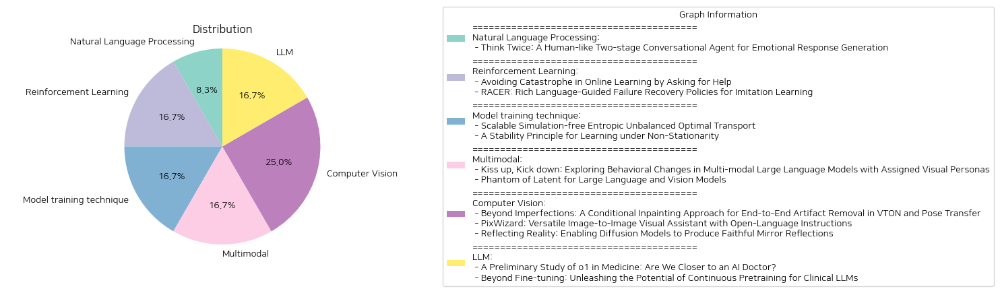

# Daily Artificial Intelligence Insights : Papers

## 🪸 Natural Language Processing

**요약:**

보고서:

1. 주요 주제 및 테마 추출:
   - 인간과 유사한 감정적 대응을 생성하는 대화 시스템 개발
   - 감정과 의미를 통합적으로 모델링하는 신경망 도입
   - '두 번 생각하기' 행동을 모방하여 두 단계로 감정 대화를 생성

2. 공통 키워드, 트렌드, 패턴 식별:
   - 감정 생성, 의미 성능 유지, 감정을 수반한 인간적 대화
   - 대화 모델의 프로토타입 생성, 감정 정제 단계
   - 모델 개선 및 비교 모델과의 성능 비교 분석

3. 주요 사건 및 중요한 정보 요약:
   - 기존의 감정적 대화 접근법은 감정과 의미의 상호 제약으로 인해 안전한 대응을 생성하는 경향
   - 감정 주석이 포함된 대화 말뭉치가 필요하다는 문제
   - 제안된 모델은 두 단계로 나뉘며, 첫 단계는 내재된 의미를 따라 프로토타입 발화를 생성
   - 두 번째 단계에서는 공감 가설을 통한 감정 정제로 수정

4. 해당 사건의 다양한 부문에 대한 영향 분석:
   - 인간과 유사한 감정적 응답 생성이 가능해짐에 따라 고객 서비스, 소셜 인터랙션, 헬스케어 분야에서 향상된 상호 작용 가능
   - 자연어 처리(NLP) 분야에서 감정 및 의미 분석의 중요성 증가
   - 감성 컴퓨팅 및 인공 지능 분야에서의 응용 확장과 연구 발전 촉발

5. 최종 통합 요약과 향후 주목할 발전 방향:
   - 제안된 두 단계 대화 에이전트는 기존 모델 대비 감정 생성 능력이 뛰어나고 의미를 유지하는 성능을 확보
   - 감정 및 상호작용 모델을 통해 보다 개인화되고 공감 능력이 뛰어난 대화 시스템으로 발전할 가능성
   - 감정 인식 및 표현의 정교화가 다가오는 AI 대화 시스템의 주요 발전 영역으로 주목될 전망
   - 더 광범위하고 복잡한 대화 말뭉치 적용 연구 필요

종합적으로, 이 종이에서 제시된 접근법은 차세대 대화 시스템의 핵심 발전 방향을 제시하며, 여러 분야에서의 활용 가능성을 넓히는 데 기여할 것으로 예상됩니다.

**출처:**

 - Think Twice: A Human-like Two-stage Conversational Agent for Emotional Response Generation (https://deeplearn.org/arxiv/532279/think-twice:-a-human-like-two-stage-conversational-agent-for-emotional-response-generation)

## 🫧 Reinforcement Learning

**요약:**

**요약 보고서: 온라인 학습과 로봇 모방 학습에서 실패 방지 및 복구 전략**

**주요 주제 및 테마 추출:**

1. **온라인 학습의 재앙 회피**: 이 연구는 온라인 학습에서 재앙적 실패를 피하는 접근법을 제안합니다. 일반적인 학습 알고리즘은 모든 행동을 시도하며 후회를 최소화하려고 하지만, 일부 실수가 돌이킬 수 없는 재앙을 초래할 때 이 방식은 문제가 됩니다. 이 논문은 각 라운드의 보상이 재앙을 피할 기회를 나타내며, 멘토에게 제한적으로 문의할 수 있는 경우 이 기회를 최대화하는 알고리즘을 제안합니다.

2. **로봇 모방 학습에서의 실패 복구**: RACER는 로봇 조작에서 실패 복구 메커니즘의 부족과 단순한 언어 지시의 제한성을 극복하기 위해 제안된 시스템입니다. RACER는 비전-언어 모델(VLM)을 통해 로봇의 오류 수정과 작업 수행을 위한 언어 지침을 제공합니다. 이는 실험적으로 주어진 다양한 상황에서 로봇 제어 성능을 개선함을 보여줍니다.

**공통 키워드, 트렌드 및 패턴:**

- **재앙 회피 및 실패 복구**: 두 논문 모두 학습 과정에서의 오류와 실수를 피하거나 수정하는 데 중점을 두고 있습니다.
- **멘토링 및 슈퍼비전**: 온라인 학습에서는 멘토의 역할이 중요하며, 로봇 학습에서는 비전-언어 모델을 통한 감독이 중요합니다.
- **언어의 활용**: 언어 기반 지령과 설명을 통해 복잡한 환경에서의 제어 및 학습을 강화합니다.

**주요 사건 및 핵심 정보 요약:**

- **온라인 학습에서의 새로운 접근**: 멘토와의 상호작용을 통한 재앙 방지를 목표로 하는 새로운 학습 문제 설정 제안.
- **RACER의 개발 및 성능**: 해당 시스템은 비전과 언어 모델을 통합하여 로봇의 오류 복구를 최적화하며, 기존 기술보다 뛰어난 성과를 보입니다.

**이벤트의 다양한 부문에 대한 영향 분석:**

- **교육 및 학습 기술**: 새로운 알고리즘은 재앙적 실패를 방지함으로써 교육 및 학습의 안정성을 높일 수 있습니다.
- **로봇 공학**: RACER의 성과는 로봇 공학 분야에서의 효율성을 극대화하고, 나아가 복잡한 작업의 자동화를 지원합니다.

**최종 통합 요약과 미래 발전 방향:**

이 두 연구는 온라인 학습과 로봇 모방 학습에서 실수를 최소화하기 위한 혁신적인 방법을 제시합니다. 각각의 연구는 언어 기술을 통합하여 실수를 예방하거나 복구하는 시스템을 발전시켰습니다. 이러한 접근은 모든 학습 및 자동화 시스템에 있어서 향후 발전할 수 있는 귀중한 통찰력을 제공합니다. 앞으로 인공지능 학습과 로봇 제어에서의 오류 방지 및 복구 메커니즘의 발전을 주목해야 합니다.

**출처:**

 - Avoiding Catastrophe in Online Learning by Asking for Help (https://deeplearn.org/arxiv/533114/avoiding-catastrophe-in-online-learning-by-asking-for-help)
 - RACER: Rich Language-Guided Failure Recovery Policies for Imitation Learning (http://arxiv.org/abs/2409.14674v1)

## 💚 Model training technique

**요약:**

보고서 요약:

1. 주요 주제 및 테마 추출:
   - "Scalable Simulation-free Entropic Unbalanced Optimal Transport": 이 논문은 엔트로피 기반의 불균형 최적 수송 문제(EUOT)를 다루며, 스케일 확장성과 시뮬레이션 없는 접근 방식을 강조합니다. 주로 머신러닝 분야의 생성 모델링과 이미지 전환에서 활용됩니다.
   - "A Stability Principle for Learning under Non-Stationarity": 이 논문은 비정상 환경에서의 통계적 학습에 대한 안정성 원칙을 제시하며, 과거 데이터를 최대한 활용하는 동시에 누적 편향을 수용 가능한 범위로 유지합니다.

2. 공통 키워드, 경향 및 패턴:
   - 두 논문 모두 데이터 처리를 효율적으로 개선하는 방법에 대한 아이디어를 공유합니다.
   - "최적 수송", "비정상 데이터 학습", "생성 모델링", "통계적 학습", "안정성", "적응력" 등의 키워드가 반복됩니다.
   - 데이터 활용의 효율성 증대와 비용 절감이 중요하게 논의됩니다.

3. 주요 사건 및 중요한 정보 요약:
   - 첫 번째 논문은 시뮬레이션 없는 EUOT 문제 해결을 위해 새로운 알고리즘을 제안하며, 이는 기존의 쉬뢰딩거 브릿지(SB) 모델보다 생성 모델링 및 이미지 전환에서 더 효율적임을 보여줍니다.
   - 두 번째 논문은 비정상 환경에서의 학습에서 누적 편향과 통계적 오류를 균형 있게 조절하는 안정성 원칙을 탐구하며, 비정상 데이터를 준정상적으로 나누는 세분화 기법을 소개합니다.

4. 이러한 사건의 다양한 분야에 대한 영향 분석:
   - 엔트로피 기반 최적 수송의 새로운 접근법은 머신러닝과 특히 생성적 적대 신경망(GAN) 모델 개발에 큰 영향을 미칠 것입니다. 이는 훈련 비용을 줄이면서도 성능을 향상시키는 데 기여할 수 있습니다.
   - 비정상 데이터 학습에서의 안정성 원칙은 빅데이터 분석, 금융 데이터 처리, 기후 변화 모델링 등 다양한 분야에서 데이터의 불확실성을 다루는 데 유용하게 활용될 것입니다.

5. 최종 통합 요약과 결론:
   - 두 논문은 각각의 분야에서 효율성을 높이기 위한 혁신적 접근법을 제시하며, 이는 데이터 처리의 정확성과 비용 절감에서 중요한 발전을 도모할 것입니다.
   - 향후, 이러한 방법론들이 실제 데이터 세트에서 어떻게 더 광범위하게 적용될 수 있는지, 그리고 다른 알고리즘 및 모델과의 통합 가능성이 연구될 필요가 있습니다. 데이터 활용의 효율성과 정확도를 개선하는 이러한 발전은 추후 머신러닝과 데이터 처리의 주요 동력이 될 것으로 예상됩니다.

**출처:**

 - Scalable Simulation-free Entropic Unbalanced Optimal Transport (https://deeplearn.org/arxiv/532714/scalable-simulation-free-entropic-unbalanced-optimal-transport)
 - A Stability Principle for Learning under Non-Stationarity (https://deeplearn.org/arxiv/534502/a-stability-principle-for-learning-under-non-stationarity)

## 🥳 Multimodal

**요약:**

보고서 요약:

1. 주요 주제 및 테마 추출:
   - 첫 번째 논문은 '멀티 모달 대형 언어 모델(LLMs)'이 시각적 캐릭터에 따라 행동을 조정할 수 있는지를 탐구합니다. 이를 통해 기존 문헌에서 주로 텍스트 기반의 캐릭터에 집중했던 격차를 메우고자 합니다.
   - 두 번째 논문은 '대형 언어 및 비전 모델(LLVMs)'의 비전-언어 기술을 강화하기 위한 모델의 효과적인 크기 조절 및 성능 최적화에 대해 다룹니다.

2. 공통 키워드, 트렌드 및 패턴:
   - 두 논문 모두 "대형 언어 모델(LLMs)"와 "시각적 요소"에 초점을 맞추고 있습니다.
   - LLVMs의 효율적인 성능 향상과 관련된 기술 최적화 및 효과적인 자원 사용이 강조됩니다.

3. 각 논문에서 주요 사건 및 중요한 정보 요약:
   - 'Kiss up, Kick down' 논문은 약 5,000개의 픽션 아바타 이미지 데이터셋을 생성하여 LLMs이 시각적 캐릭터의 공격성을 어떻게 평가하고 행동하는지를 분석했습니다. 특히, 모델은 시각적 프롬프트에 따라 공격적인 협상 행동을 더 강하게 나타냈습니다.
   - 'Phantom of Latent' 논문에서는 효율적인 LLVMs의 설계를 통해 성능을 크게 향상시키면서도 물리적 모델 크기를 줄일 수 있음을 보여줍니다. Phantom 모델은 Latent Hidden Dimension을 일시적으로 늘려 데이터 학습의 잠재력을 향상시키며, Phantom Optimization 과정을 통해 고효율을 달성했습니다.

4. 이 사건들의 다양한 부문에 대한 영향 분석:
   - 멀티 모달 LLMs의 행동 변화 연구는 인공지능의 인간과의 상호작용에서 더 현실적이고 인간적인 요소를 도입할 수 있는 가능성을 열었습니다.
   - 효율적인 LLVMs의 개발은 특히 하드웨어 리소스 제한이 있는 응용 프로그램에 중요한 경제적 및 기술적 혜택을 제공할 것입니다.

5. 최종 결론 및 미래 개발 전망:
   - 멀티 모달 대형 언어 모델의 시각적 요소와의 통합은 AI의 잠재적 활용 범위를 더욱 넓힐 것입니다.
   - Phantom과 같은 효율적인 모델은 앞으로 더 많은 AI 시스템이 적은 자원으로 더 높은 성능을 구현하는 방향으로 나아갈 가능성에 대한 기회를 제시합니다.

**출처:**

 - Kiss up, Kick down: Exploring Behavioral Changes in Multi-modal Large Language Models with Assigned Visual Personas (https://deeplearn.org/arxiv/533364/kiss-up,-kick-down:-exploring-behavioral-changes-in-multi-modal-large-language-models-with-assigned-visual-personas)
 - Phantom of Latent for Large Language and Vision Models (http://arxiv.org/abs/2409.14713v1)

## 🪄 Computer Vision

**요약:**

**종합 요약 보고서: 가상 시착(VTON), 이미지 기반 모델, 거울 반사 생성**

1. **주요 주제 및 테마 추출:**
   - **인공지능과 컴퓨터 비전의 발전**: 모든 연구는 인공지능 기술을 활용하여 컴퓨터 비전 문제를 해결하는 것에 중점을 두고 있습니다.
   - **이미지 복원 및 처리 기술**: 각 연구는 이미지의 왜곡을 줄이고 시각적 품질을 향상시키기 위한 다양한 기술을 소개합니다.
   - **새로운 데이터셋의 개발**: 각 연구는 특정한 비전 문제를 해결하기 위해 새로운 데이터셋을 구축하여 보다 정교한 모델 개발을 가능하게 합니다.

2. **공통 키워드, 트렌드 및 패턴 식별:**
   - **조건부 인페인팅**: 'Beyond Imperfections' 연구는 VTON과 포즈 전이에서 아티팩트를 제거하기 위한 조건부 인페인팅 기술을 소개합니다.
   - **다양한 시각 작업 통합**: 'PixWizard'는 텍스트에서 이미지로의 생성, 이미지 복원 및 예측 등의 다양한 시각 작업을 하나의 통합된 프레임워크로 제공합니다.
   - **거울 반사의 정밀 생성**: 'Reflecting Reality'는 거울에 비친 정확하고 사실적인 반사를 생성하는 문제를 다룹니다.

3. **각 논문의 주요 사건 및 중요 정보 요약:**
   - 'Beyond Imperfections' 논문에서는 가상 시착과 포즈 전이에서 왜곡을 감지하고 제거하는 혁신적인 조건부 인페인팅 기법을 통해 이미지의 시각적 품질을 향상시켰습니다. 이는 컴퓨터 비전 및 이미지 처리의 새로운 기준을 제시했습니다.
   - 'PixWizard' 논문은 이미지 생성, 조작 및 번역을 유연한 자연어 지침에 기반하여 수행할 수 있는 범용 시각 보조 장치를 소개했습니다. Diffusion Transformer를 기반으로 하여 모든 해상도에 대응할 수 있는 메커니즘을 통합했습니다.
   - 'Reflecting Reality' 논문에서는 SynMirror라는 대규모 데이터셋을 기반으로 거울 반사를 사실적으로 생성하는 MirrorFusion 기법을 개발했습니다. 이는 증강 현실 및 이미지 편집 응용 분야에 새로운 가능성을 제공합니다.

4. **이 사건들의 다양한 분야에 대한 영향 분석:**
   - **가상 현실 및 증강 현실**: 향상된 이미지 처리 기술은 보다 몰입적인 가상 및 증강 현실 경험을 제공합니다.
   - **패션 및 온라인 쇼핑 플랫폼**: VTON의 시각적 품질 향상은 온라인 쇼핑의 사용자 경험을 크게 개선시킬 수 있습니다.
   - **이미지 편집업계**: PixWizard와 같은 도구는 이미지 편집의 자동화와 효율성을 높일 수 있습니다.

5. **결론 및 주목할 만한 미래 발전:**
   - 인공지능을 활용한 이미지 처리 기술은 계속해서 발전하며, 사용자 경험 개선과 다양한 실생활 응용 분야에 중요한 역할을 할 것입니다.
   - 데이터셋의 확장과 개선은 모델의 성능 향상에 기여하며, 더 현실감 있는 이미지 생성과 처리 기술이 가능해질 것입니다.
   - 이런 기술의 발전은 특히 가상 현실, 증강 현실, 온라인 콘텐츠 생성 분야에서 큰 혁신을 가져올 것입니다. 

이 보고서는 2023년 현재까지의 관련 연구 및 기술 발전을 종합적으로 다루고 있으며, 향후 이러한 발전이 가질 수 있는 영향을 예측하고 있습니다.

**출처:**

 - Beyond Imperfections: A Conditional Inpainting Approach for End-to-End Artifact Removal in VTON and Pose Transfer (https://deeplearn.org/arxiv/534386/beyond-imperfections:-a-conditional-inpainting-approach-for-end-to-end-artifact-removal-in-vton-and-pose-transfer)
 - PixWizard: Versatile Image-to-Image Visual Assistant with Open-Language Instructions (http://arxiv.org/abs/2409.15278v2)
 - Reflecting Reality: Enabling Diffusion Models to Produce Faithful Mirror Reflections (http://arxiv.org/abs/2409.14677v1)

## 🧸 LLM

**요약:**

보고서 요약:
1. 핵심 주제 및 테마:
   - 첫 번째 논문은 OpenAI의 o1 모델을 중점으로 대형 언어 모델(LLM)의 의료 분야 응용 가능성을 탐구합니다. 주된 관심사는 이해, 추론, 다국어 능력입니다.
   - 두 번째 논문은 임상용 LLM을 위한 다양한 적응 기법의 효과를 조사하고 있습니다. 핵심 기법으로는 연속적 사전 학습, 지시 미세 조정, NEFTune, 프롬프트 엔지니어링이 포함됩니다.

2. 공통 키워드, 트렌드 및 패턴:
   - 두 논문 모두 LLM의 임상 응용 가능성을 탐구하며, 모델의 성능을 향상시키기 위한 다양한 기법을 제안합니다. 
   - 의료 분야의 실용적 유용성을 확보하기 위해 데이터 세트의 임상적 관련성을 강조합니다.

3. 주요 사건 및 중요 정보 요약:
   - o1 모델은 37개의 의료 데이터 세트를 사용하여 6개의 작업을 평가했으며, 기존 GPT-4 모델에 비해 6.2%에서 6.6%까지 정확도를 향상시켰습니다. 하지만 몇 가지 약점으로 환각, 일관되지 않은 다국어 능력, 평가 메트릭의 불일치가 식별되었습니다.
   - 임상 LLM에 있어, 연속적 사전 학습은 지시 미세 조정을 위한 강력한 기초를 마련하며, NEFTune과 프롬프트 엔지니어링은 성능을 추가로 향상시킵니다.

4. 이러한 사건의 다양한 분야에 대한 영향 분석:
   - 모델의 개선된 추론 능력은 복잡한 임상 시나리오에서 실질적인 문제 해결 능력을 제공합니다.
   - 연속적 사전 학습과 NEFTune 등의 기술은 임상 응용 프로그램에서 더욱 적응적이고 강력한 LLM의 발전을 도모할 수 있습니다.

5. 최종 요약과 결론:
   - LLM의 임상 적응은 그 자체로 많은 잠재력을 지니고 있으며, o1과 같은 새로운 모델과 다양한 미세 조정 기법을 통해 더 실현 가능해질 수 있습니다.
   - LLM의 성능 최적화를 위한 혁신적인 접근법과 숙고된 조정 전략이 중요합니다. 앞으로의 연구 방향은 평가 프로토콜의 개선 및 모델의 언어 간 일관성 보장이 될 것입니다.

**출처:**

 - A Preliminary Study of o1 in Medicine: Are We Closer to an AI Doctor? (http://arxiv.org/abs/2409.15277v1)
 - Beyond Fine-tuning: Unleashing the Potential of Continuous Pretraining for Clinical LLMs (http://arxiv.org/abs/2409.14988v1)

