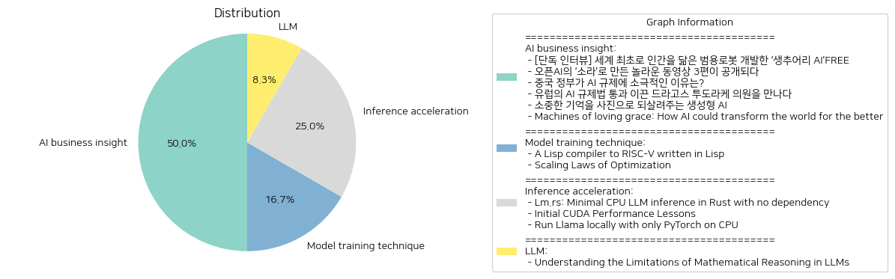

# Daily Artificial Intelligence Insights : News

## ✈️ AI business insight

**요약:**

1. **주요 주제**:
   전체 기사에서 나타난 주요 주제는 AI 기술 개발과 그 사회적 효용성, 규제와 정책 대응, 그리고 AI가 사회와 산업에 미칠 긍정적 및 부정적 영향입니다. AI를 활용한 신기술과 프로젝트, 각국의 AI 관련 정책, 그리고 AI의 사회적 통합 방법들이 반복적으로 언급되었습니다.

2. **주요 사건**:
   - 생추어리 AI는 인간과 유사한 범용 로봇을 개발하는 혁신적인 시도를 하고 있습니다.
   - 오픈AI는 새로운 동영상 생성 모델인 '소라'를 통해 크리에이터들이 놀라운 동영상을 제작할 수 있게 했습니다.
   - 중국 정부는 AI 규제를 느슨하게 유지하여 산업 발전을 촉진하고자 합니다.
   - 유럽은 드라고스 투도라케 의원의 주도 하에 AI 규제법을 통과시켰습니다.
   - 생성형 AI는 과거의 기억을 이미지로 되살리는 프로젝트를 통해 사람들에게 새로운 경험을 제공합니다.
   - Anthropic의 CEO는 AI가 생명공학 및 정신 건강 분야에 큰 진전을 가져와 인류의 삶을 개선할 수 있음을 강조했습니다.

3. **영향 분석**:
   - 경제: AI 기술이 다양한 산업에 도입됨에 따라 생산성 향상 및 경제 성장에 기여할 것으로 예상됩니다. 특히 영상 제작과 의료 분야에서 AI 도구의 활용이 증가하고 있습니다.
   - 정치: 각국의 AI 규제 정책 차이가 기술 발전에 영향을 미치고 있습니다. 중국과 유럽의 상반된 접근 방식은 각 지역의 산업과 혁신 발전에 차별적인 영향을 끼칠 수 있습니다.
   - 사회: AI의 발전은 개인화된 경험 제공, 질병 치료 발전 등으로 사회적 혜택을 확대할 수 있습니다. 그러나 규제와 윤리적 문제에 대한 대응은 사회적 과제가 될 것입니다.

4. **최종 요약**:
   전반적으로 AI 기술의 발전은 다양한 분야에서 긍정적인 변화를 예고하고 있으며, 이를 위한 혁신적인 시도와 프로젝트가 진행 중입니다. 동시에 각국의 AI 규제와 정책은 기술 발전에 중요한 변수로 작용하고 있으며, 이에 따른 국제적 경쟁과 협력이 예상됩니다. 향후 AI 기술의 사회적 통합과 윤리적 활용 방안에 대한 논의가 더욱 중요해질 것입니다. 지속적인 연구와 정책 개선 노력이 필요하며, AI가 인류의 삶에 긍정적인 영향을 미치기 위한 방향으로 나아가는 것이 요구됩니다.

**출처:**

 - [단독 인터뷰] 세계 최초로 인간을 닮은 범용로봇 개발한 ‘생추어리 AI’FREE (https://www.technologyreview.kr/%ec%9d%b8%ed%84%b0%eb%b7%b0-%ec%83%9d%ec%b6%94%ec%96%b4%eb%a6%ac-ai%ea%b0%80-%ea%b7%b8%eb%a6%ac%eb%8a%94-%eb%af%b8%eb%9e%98%ec%9d%98-%eb%a1%9c%eb%b4%87%ec%9d%80-%ec%8b%a4%ec%b2%b4%ed%99%94/)
 - 오픈AI의 ‘소라’로 만든 놀라운 동영상 3편이 공개되다 (https://www.technologyreview.kr/%ec%98%81%ec%83%81-%ec%83%9d%ec%84%b1-%eb%aa%a8%eb%8d%b8-%ec%86%8c%eb%9d%bc%eb%a1%9c-%eb%a7%8c%eb%93%a0-%eb%86%80%eb%9d%bc%ec%9a%b4-%ec%98%81%ed%99%94-3%ed%8e%b8%ec%9d%b4-%ea%b3%b5%ea%b0%9c%eb%90%98/)
 - 중국 정부가 AI 규제에 소극적인 이유는? (https://www.technologyreview.kr/%ec%a4%91%ea%b5%ad-%ec%a0%95%eb%b6%80%ea%b0%80-%ed%98%84%ec%9e%ac%eb%a1%9c%ec%84%9c%eb%8a%94-ai-%eb%b6%84%ec%95%bc%eb%a5%bc-%ea%b0%80%ed%98%b9%ed%95%98%ea%b2%8c-%ea%b7%9c%ec%a0%9c%ed%95%98%ec%a7%80/)
 - 유럽의 AI 규제법 통과 이끈 드라고스 투도라케 의원을 만나다 (https://www.technologyreview.kr/ai-%ea%b7%9c%ec%a0%9c%eb%b2%95-%ed%86%b5%ea%b3%bc-%ec%9d%b4%eb%81%88-%eb%93%9c%eb%9d%bc%ea%b3%a0%ec%8a%a4-%ed%88%ac%eb%8f%84%eb%9d%bc%ec%bc%80-%ec%9d%98%ec%9b%90%ec%9d%84-%eb%a7%8c%eb%82%98%eb%8b%a4/)
 - 소중한 기억을 사진으로 되살려주는 생성형 AI (https://www.technologyreview.kr/%ec%83%9d%ec%84%b1%ed%98%95-ai%eb%a1%9c-%ea%b0%80%ec%9e%a5-%ec%86%8c%ec%a4%91%ed%95%9c-%ea%b8%b0%ec%96%b5%ec%9d%84-%ec%82%ac%ec%a7%84%ec%9c%bc%eb%a1%9c-%eb%a7%8c%eb%93%a0%eb%8b%a4/)
 - Machines of loving grace: How AI could transform the world for the better (https://darioamodei.com/machines-of-loving-grace)

## 🪐 Model training technique

**요약:**

### 종합 요약 보고서

1. **주요 주제**:
   - 해당 뉴스 기사에서 다루는 주요 주제는 기술 발전과 그 응용에 관한 것입니다. 특히 프로그래밍 언어와 컴파일러 개발, 그리고 최적화 법칙에 관한 이론적 분석 등의 주제를 강조하고 있습니다.
   - 공통적인 경향으로는 컴퓨터 과학 분야의 혁신적 방법론과 이론적 발전, 그리고 이를 실제적인 응용 분야에 적용하려는 시도가 두드러집니다.

2. **주요 사건**:
   - **Lisp 컴파일러 개발**: uLisp로 작성된 Lisp 컴파일러가 Raspberry Pi Pico 2에서 실행될 수 있도록 Lisp 함수를 RISC-V 기계 코드로 컴파일합니다. 이 컴파일러는 Common Lisp의 부분 집합을 사용하며, 꼬리 호출 최적화, 재귀 함수 호출, 불리언 연산을 지원합니다.
   - **최적화의 스케일링 법칙**: 최적화 기법의 수렴 속도를 평가하는 스케일링 법칙은 응용 수학 및 컴퓨터 과학 분야의 주요 성과 중 하나입니다. 특히 지도 학습과 통계 분야에서 이러한 법칙은 문제의 예측 가능한 매개 변수에 기반한 성능 평가를 가능케 합니다.

3. **영향 분석**:
   - **경제적 영향**: 컴파일러와 최적화 기법의 발전은 소프트웨어 산업의 효율성을 높여 경제에 긍정적 영향을 미칠 수 있습니다. 더 빠르고 최적화된 코드가 하드웨어 비용을 줄이고 처리 능력을 향상시킴에 따라 상품과 서비스의 질이 향상될 가능성이 있습니다.
   - **기술 발전**: 프로그래밍 언어와 컴파일러 기술의 발전은 기술 생태계 전반에 지속적인 혁신을 촉발할 수 있습니다. 이는 학문적 연구뿐만 아니라 실무적 응용을 통해 사회 전반에 걸쳐 큰 변화를 불러일으킬 수 있습니다.

4. **최종 요약**:
   - 최근 뉴스 기사들이 공통적으로 강조하는 점은 컴퓨터 과학 분야의 이론적 발전과 이를 기반으로 한 실무적 응용입니다. 이러한 발전은 소프트웨어 산업의 효율성을 높일 뿐만 아니라 학문적 연구의 새로운 방향성을 제시할 수 있습니다. 앞으로 주의 깊게 살펴봐야 할 개발은 이론적 연구 성과가 실제 산업 및 경제 분야에 어떻게 활용될 수 있는지, 그리고 이러한 기술적 진보가 사회 전반에 미치는 영향을 지속적으로 모니터링하는 것입니다.

**출처:**

 - A Lisp compiler to RISC-V written in Lisp (http://www.ulisp.com/show?4Y20)
 - Scaling Laws of Optimization (https://francisbach.com/scaling-laws-of-optimization/)

## ☀️ Inference acceleration

**요약:**

1. **주요 테마**:
   모든 뉴스 기사에서 공통적으로 나타나는 주요 테마는 '컴퓨팅 성능 최적화'와 '최소한의 의존성으로의 AI 모델 실행'입니다. 이는 최신 프로세싱 기술과 AI 모델의 효율적인 실행에 초점을 맞추고 있습니다.

2. **주요 사건**:
   - 첫 번째 기사에서는 Rust로 작성된 최소한의 CPU 전용 언어 모델(LM) 추론 코드를 소개합니다. 또한 Llama 3.2 모델을 지원하며, 벤치마크, 모델 및 토크나이저 다운로드 링크, 설치 및 변환 지침도 제공하고 있습니다.
   - 두 번째 기사에서는 CUDA 코드를 최적화하기 위한 방법으로 메모리 통합과 텐서 코어와 같은 특수 하드웨어의 활용을 제안합니다. CUDA는 병렬 처리와 공유 메모리, 레지스터 사용을 강조하여 동기화 오버헤드를 줄이는 방법에 대한 접근이 필요하다고 설명합니다.
   - 세 번째 기사에서는 PyTorch만으로 CPU에서 Llama 모델을 로컬 실행하는 방법을 소개합니다. CPU와 GPU(mps) 간의 성능 차이와 시퀀스 길이가 메모리 사용량에 미치는 영향을 논의합니다.

3. **영향 분석**:
   - 경제적 측면에서, 이러한 연구와 코드 제공은 작은 기업과 독립 개발자들이 AI 모델을 더욱 비용 효율적으로 활용할 수 있게 해 줄 것입니다. 또한, 하드웨어 및 소프트웨어 최적화는 전력 소비 감소로 이어질 수 있어 효율성을 높일 수 있습니다.
   - 사회적으로는, AI 모델을 탐색하고 실행하는 기술이 보다 접근 가능해짐으로써 개발자 커뮤니티의 성장과 혁신이 촉진될 것입니다. 나아가, 더 많은 인원이 AI 기술을 개발하고 적용하여 다양한 산업에의 긍정적인 영향을 끼칠 수 있습니다.

4. **최종 요약**:
   최근 뉴스 기사들은 AI 모델의 성능 최적화 및 실행 효율성을 높이는 최신 개발 동향을 보여줍니다. 이러한 발전은 AI 기술의 접근성을 높이고, 다양한 분야의 개발자들이 이러한 기술을 채택할 수 있도록 돕습니다. 앞으로 신규 CPU와 GPU의 활용 및 최적화 기술이 더욱 발전할 것이 예상되며, 이러한 움직임에 따라 에너지 효율이나 비용 측면에서의 최적화를 지속적으로 모니터링해야 할 것입니다.

**출처:**

 - Lm.rs: Minimal CPU LLM inference in Rust with no dependency (https://github.com/samuel-vitorino/lm.rs)
 - Initial CUDA Performance Lessons (https://probablydance.com/2024/10/07/initial-cuda-performance-lessons/)
 - Run Llama locally with only PyTorch on CPU (https://github.com/anordin95/run-llama-locally)

## 🎠 LLM

**요약:**

1. **핵심 주제**:
   채택된 연구는 대형 언어 모델(LLMs)의 수학적 추론 능력의 한계를 탐구합니다. 특히 GSM-Symbolic라는 새로운 기준을 통해 LLMs가 질문이 조금만 변형되거나 더 많은 절이 추가되면 성능이 저하된다는 점을 발견했습니다. 이는 LLMs가 실제 논리적 추론을 수행하기보다는 추론 단계를 복제하는 경향이 있다는 것을 시사합니다.

2. **중요 사건**:
   연구자들은 LLMs의 수학적 추론 한계를 명확히 하기 위해 새로운 벤치마크인 GSM-Symbolic을 도입했습니다. 이 연구는 언어 모델이 질문이 약간의 변칙적 변형이나 추가적인 절을 포함할 때 성능이 떨어진다는 것을 보여주었습니다. 이는 LLMs의 추론 성공이 실제 논리적 처리라기보다, 이미 학습한 표현의 복제일 수 있음을 나타냅니다.

3. **영향 분석**:
   이러한 연구 결과는 인공지능의 적용과 한계에 대한 지식에 큰 영향을 미칩니다. LLMs가 실제 논리적 추론 능력이 부족하다는 점은 인공지능을 신뢰할 수 있는 의사결정 도구로 활용하는 데 장애물이 될 수 있습니다. 특히 이들은 복잡한 문제 해결에는 적합하지 않을 수 있으며, 이는 경제, 사회 등의 다양한 분야에서 중요한 고려사항이 됩니다.

4. **최종 요약**:
   대형 언어 모델의 수학적 추론 능력에 대한 연구는 이들이 보여주는 추론 과정이 실제 논리적인 것이 아닌, 학습된 표현의 복제라는 점을 드러냅니다. 이는 LLMs를 다양한 분야에서 활용할 때 그 한계를 명확히 인식해야 한다는 것을 시사합니다. 향후 LLMs의 개선과 이를 보완하기 위한 다른 접근이 필요할 것으로 보입니다. 이 연구는 인공지능의 보다 심오한 이해와 한계 인식을 통한 발전 가능성을 강조합니다.

**출처:**

 - Understanding the Limitations of Mathematical Reasoning in LLMs (https://arxiv.org/abs/2410.05229)

