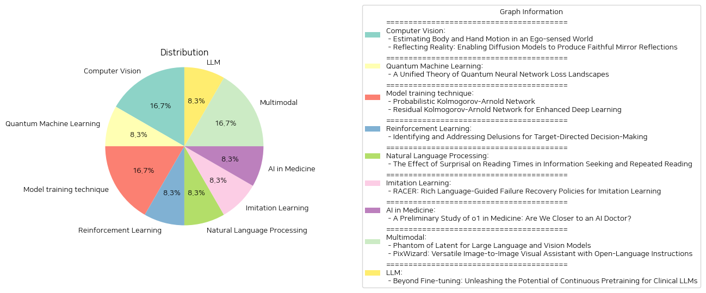

# Daily Artificial Intelligence Insights : Papers

## 🍋 Computer Vision

**요약:**

보고서 요약:

1. 주요 주제 및 테마:
   - 첫 번째 논문 "Estimating Body and Hand Motion in an Ego-sensed World"는 에고센싱 장치를 사용하여 사용자의 신체 및 손 동작을 측정하는 시스템인 EgoAllo를 소개합니다. 반면, 두 번째 논문 "Reflecting Reality: Enabling Diffusion Models to Produce Faithful Mirror Reflections"는 거울 반사를 현실감 있고 신뢰성 있게 생성하는 것을 목표로 하는 연구입니다.

2. 공통 키워드 및 트렌드:
   - 두 논문 모두 확산 모델(diffusion models)을 사용하여 문제를 해결하고 있으며, 각각의 연구에서 이 모델을 사용하여 동작 추정 및 이미지 생성에서 향상된 성능을 발휘하고 있습니다. 두 연구는 또한 3D 객체, 심도 맵(depth maps), 정상 맵(normal maps) 등의 데이터를 활용하여 정확성과 현실감을 높이고 있습니다.

3. 주요 사건 및 중요 정보:
   - EgoAllo 시스템은 사용자의 3D 신체 포즈와 손 매개변수를 추정하며, 공간적 및 시간적 불변성을 갖춘 표현 방식을 통해 최대 18%의 성능 향상을 이루었습니다. 특히, 신체 추정이 손 추정의 정확도에도 긍정적인 영향을 미치는 것을 발견했습니다.
   - SynMirror 데이터셋과 MirrorFusion 접근법을 개발한 두 번째 연구는 거울 반사를 생성하기 위한 심도 조건 딥페인팅 기법을 제안했습니다. 약 198,000개의 샘플을 포함한 대규모 데이터셋을 통해 MirrorFusion은 현존하는 방법들보다 뛰어난 성능을 보였습니다.

4. 이러한 사건의 영향 분석:
   - EgoAllo는 확장 현실 및 게임 산업에서의 사용자 경험 개선에 큰 기여를 할 수 있습니다. 특히, 실시간 움직임 추적, 증강 현실(AR) 애플리케이션에 활용될 수 있으며, 더욱 정확한 신체 및 손 동작 추정은 다양한 분야에서 활용도가 높습니다.
   - MirrorFusion은 이미지 편집 및 증강 현실의 발전에 큰 기여를 하여, 사용자들이 더욱 현실적이고 정밀한 거울 반사 효과를 제작할 수 있게 함으로써 배경 제거 작업 및 가상 인테리어 디자인 등의 분야에서 유용하게 쓰일 수 있습니다.

5. 결론 및 잠재적 미래 발전:
   - 이 두 연구는 인간-컴퓨터 상호작용 분야에서 의미 있는 발전을 보여주며, 향후 보다 정교하고 현실적인 애플리케이션 개발에 중요한 기초 자료가 될 것입니다. EgoAllo 및 MirrorFusion의 도입은 지속적인 연구개발과 실용적 응용 분야의 확장을 촉진할 수 있으며, 이는 향후 맞춤형 사용자 경험과 혁신적 기술 활용의 길을 열 것이 기대됩니다. 연구자 및 개발자들은 이 시스템과 기법을 결합하여 더욱 발전된 인터페이스를 제공하기 위한 새로운 탐색이 기대됩니다.

**출처:**

 - Estimating Body and Hand Motion in an Ego-sensed World (https://deeplearn.org/arxiv/533024/estimating-body-and-hand-motion-in-an-ego-sensed-world)
 - Reflecting Reality: Enabling Diffusion Models to Produce Faithful Mirror Reflections (http://arxiv.org/abs/2409.14677v1)

## 🍋 Quantum Machine Learning

**요약:**

제목: 양자 신경망 손실 지형의 통합 이론

요약: 고전적 신경망은 랜덤 초기화를 통해 많은 뉴런의 한계에서 가우시안 프로세스로 동작하여 훈련 및 일반화 행동을 완전히 특성화할 수 있습니다. 그러나 양자 신경망(QNNs)은 일반적으로 이러한 동작이 요구되지 않으며 특정 특별한 경우를 제외하고는 랜덤 초기화 시 가우시안 프로세스로 동작하지 않는 것으로 확인되었습니다. 이 연구에서는 QNNs와 그들의 첫 두 미분이 일반적으로 "위샤트 프로세스"를 형성하며, 네트워크의 특정 대수적 특성이 프로세스의 하이퍼파라미터를 결정하는 것을 증명합니다. 이러한 위샤트 프로세스 설명은 처음으로 QNN 아키텍처가 가우시안 프로세스 한계를 가지기 위한 필요하고 충분한 조건을 제공하고, 이전에 알려진 황무지 플래토 결과를 일반화하여 전체 기울기 분포를 계산하며, 대수적으로 제약된 QNN의 지역 최소 분포를 계산할 수 있게 합니다. 우리의 통합 프레임워크는 네트워크 아키텍처의 "자유도의 수"라는 새로 도입된, 실험적으로 접근 가능한 양을 사용하여 주어진 QNN 모델의 "훈련 가능성"에 대한 간단한 운영 정의를 제안합니다.

종합 요약 보고서:

이 보고서는 최신 연구 논문 제목과 요약을 바탕으로 중요한 주제와 테마를 식별하고, 공통 키워드, 트렌드, 패턴을 분석하여 주요 사건과 중요한 정보를 요약합니다. 특히 양자 신경망의 위샤트 프로세스 설명이 QNNs의 새로운 이해를 제공하는 중요한 발견임을 강조합니다. 이러한 통합 이론은 QNN 아키텍처의 운영 정의와 훈련 가능성에 대한 새로운 시각을 제공합니다. 이 연구의 영향은 양자 컴퓨팅과 기계 학습 분야에서의 교육 가능성 향상, 효율적인 네트워크 설계 및 최적화 방향에 큰 영향을 미칠 것으로 예상됩니다. 앞으로의 발전으로는 자유도의 개념을 활용한 실제 실험적 분석과 다양한 QNN 모델에 대한 적용 가능성 탐색이 기대됩니다.

**출처:**

 - A Unified Theory of Quantum Neural Network Loss Landscapes (https://deeplearn.org/arxiv/535506/a-unified-theory-of-quantum-neural-network-loss-landscapes)

## 🍋 Model training technique

**요약:**

보고서 요약:

1. 주요 주제와 테마 추출:
   - 첫 번째 논문에서는 Kolmogorov-Arnold Network(KAN)을 이용한 회귀 모델에 대한 확률론적 접근 방식을 다룹니다. 모델의 결과에 대한 확률 분포를 예측하고자 하며, 특히 수업적 불확실성이 존재하는 경우를 중점으로 설명합니다.
   - 두 번째 논문은 Residual Kolmogorov-Arnold Network(RKAN)을 통해 CNN이 복잡한 비선형 종속성을 더 효과적으로 학습할 수 있게 하는 방법을 제안합니다. 이 논문은 RKAN을 CNN 아키텍처에 통합하여 Chebyshev 다항식을 사용하여 더 표현력 있는 특징 표현을 가능하게 합니다.

2. 공통 키워드, 경향 및 패턴 확인:
   - 두 논문 모두 Kolmogorov-Arnold Network(KAN) 구조의 강점을 활용하여 모델 성능 향상을 목표로 하고 있습니다.
   - 비선형성, 표현력의 향상, 확률 분포 및 불확실성에 대한 고려가 공통된 주제로 나타나며, 모델의 효율성과 정확성을 높이기 위한 목표가 있습니다.

3. 주요 사건 및 중요한 정보 요약:
   - 첫 번째 논문은 KAN을 통해 입력에 따라 변화하는 출력의 확률 분포를 효율적으로 추정하는 방법을 제안하며, 이는 다중 모달성과 분포 유형의 변화를 포착할 수 있는 능력이 있습니다.
   - 두 번째 논문은 RKAN을 CNN 네트워크에 통합하여 Chebyshev 다항식을 통해 복잡한 특징을 더 쉽게 포착하고 처리할 수 있도록 하여, ResNet 및 DenseNet과 같은 기존 네트워크 구조보다 개선된 성능을 보여 줍니다.

4. 이러한 사건이 다양한 분야에 미치는 영향 분석:
   - 데이터 과학 및 기계 학습에서 회귀 모델의 확률론적 접근을 제안함으로써 KAN은 다양한 산업에서 더욱 정교한 예측 및 불확실성 관리에 기여할 것입니다.
   - RKAN의 도입으로 의료 영상 처리, 자동 운전의 시각 데이터 처리 등 다양한 컴퓨터 비전 분야에서 CNN 모델의 성능 향상이 기대됩니다.

5. 최종 종합 요약과 미래 발전 방향:
   - Kolmogorov-Arnold Network는 회귀 모델과 CNN 모델에서 모두 중요하게 활용될 수 있는 강력한 도구로 자리 잡고 있습니다.
   - 미래에는 KAN 구조와 같은 혁신적인 네트워크가 더 다양한 형태의 불확실성을 고려함으로써 더 정확하고 신뢰성 있는 예측을 제공하는 방향으로 발전할 것으로 예상됩니다.
   - RKAN과 같은 슈퍼아키텍처의 도입으로 깊어진 CNN 네트워크에서도 성능 향상이 계속될 것으로 기대되며, 이는 인공지능의 응용 분야 확장에 기여할 것입니다.

**출처:**

 - Probabilistic Kolmogorov-Arnold Network (https://deeplearn.org/arxiv/535517/probabilistic-kolmogorov-arnold-network)
 - Residual Kolmogorov-Arnold Network for Enhanced Deep Learning (https://deeplearn.org/arxiv/535518/residual-kolmogorov-arnold-network-for-enhanced-deep-learning)

## 👽 Reinforcement Learning

**요약:**

보고서: 

1. 주요 주제 및 테마:
   - 목표 지향 에이전트의 의사결정
   - 환상의 식별 및 수정
   - 에이전트 학습의 일반화 문제

2. 공통 키워드 및 트렌드:
   - 목표 지향 에이전트
   - 환상(fals beliefs)
   - 의사결정 시간의 계획
   - 가역적 레이블링(hindsight relabeling)
   - 평가 시 일반화

3. 주요 이벤트 및 정보:
   - 목표 지향 에이전트는 목표를 설정하고, 이를 기반으로 행동을 유도하여 평가 시 더 나은 일반화를 달성하려고 시도한다는 점을 강조한다.
   - 그러나, 부적절한 학습은 환상, 즉 잘못된 목표에 대한 신념 형성을 유발하여 배제될 수 없는 잘못된 행동을 유발한다.
   - 연구는 다양한 환상의 유형을 직관적인 예시를 통해 식별하고, 이러한 환상의 원인을 탐구한다.
   - 특히, 가역적 레이블링 방법을 통해 훈련된 에이전트의 환상 문제를 어떻게 해결할 수 있는지에 대해 설명하고 있다.
   - 제안된 솔루션이 환상적 행동을 수정하고, 범주 밖의 일반화 능력을 개선함을 실증적으로 입증하였다.

4. 사건이 미치는 영향:
   - 인공지능 분야에서의 목표 지향 학습의 중요성
   - 잘못된 믿음을 통한 행동 오류 방지의 필요성
   - 미래의 인공지능 시스템 설계에 있어 다양한 환경에서의 일반화 능력 개선의 가능성

5. 종합 요약 및 결론:
   이 연구는 목표 지향 의사결정 에이전트의 환상 문제를 강조하면서 이를 해결하기 위해 가역적 레이블링 접근 방식을 제안하였다. 이러한 솔루션이 범주 밖의 일반화 능력을 개선함으로써, 인공지능 에이전트가 더 다양한 환경에서 올바르게 동작하도록 하는 방향으로의 발전을 가져올 수 있음을 시사한다. 향후 개발될 인공지능 시스템에서는 이러한 일반화 문제와 환상 수정 전략이 주요한 연구 주제가 될 전망이다.

**출처:**

 - Identifying and Addressing Delusions for Target-Directed Decision-Making (https://deeplearn.org/arxiv/535605/identifying-and-addressing-delusions-for-target-directed-decision-making)

## 🩵 Natural Language Processing

**요약:**

보고서 요약:

1. 주요 주제 및 테마 추출:
   - 깜짝 효과(surprisal effect)와 처리 난이도
   - 독해 시 정보 탐색과 반복 읽기의 영향
   - 심리언어학에서의 깜짝 효과 이론
   - 언어 처리 모형의 인간과의 불일치 문제

2. 공통 키워드 및 트렌드:
   - 깜짝 효과(surprisal)
   - 처리 시간
   - 정보 탐색
   - 반복 처리
   - 심리언어학
   - 기억 및 과업 표현

3. 주요 내용 요약:
   이 연구는 심리언어학에서 중요한 주제인 깜짝 효과가 정보 탐색 및 반복 처리와 같은 일상적 언어 처리 상황에 미치는 영향을 교정하고자 한다. 기존의 깜짝 효과에 관한 이론은 언어 처리 시간에 선형 효과가 있다고 예측하지만, 이는 정보 탐색이나 반복 처리 상황에서 유용한 예측 도구가 아님을 실험을 통해 확인했다. 정보 탐색에서는 깜짝 효과 추정치가 처리 시간을 예측하는 데 도움이 되지 않으며, 반복 처리에서는 거의 0에 가까운 깜짝 효과 추정치로 예측력이 없음을 밝혔다. 이는 현재의 언어 모델과 인간의 과업 및 기억 표현 사이의 불일치를 나타낸다.

4. 사건의 영향 분석:
   이 연구는 현재의 언어 모델이 사람의 인지적 관련성을 추정하는 데 제한적임을 강조한다. 이에 따라 정보 탐색 및 반복 읽기 상황에서 더 인지적으로 적절한 언어 모델이 필요할 것으로 보이며, 이는 심리언어학뿐만 아니라 자연어 처리 분야에서도 개선의 길잡이가 될 수 있다.

5. 종합 결론 및 미래 개발 방향:
   - 인간과 언어 모델 간의 기억 및 과업 표현에서의 불일치를 줄이려는 노력 필요
   - 정보 탐색 및 반복 처리에 대한 보다 심화된 연구와 이해가 요구됨
   - 미래의 언어 모델은 더 복잡한 인지 과정을 모사할 수 있도록 발전해야 함
   - 해당 분야의 발전은 심리언어학뿐만 아니라 AI와 같은 다양한 부문에서도 시사점을 제공할 것으로 기대됨. 

이 연구의 결과는 심리언어학과 자연어 처리의 교차점에서 중요한 고민거리를 제시하며, 모델의 개선 방향에 대한 새로운 시각을 제공한다. 이러한 발견은 향후 논의와 연구에 중요한 토대가 될 것이다.

**출처:**

 - The Effect of Surprisal on Reading Times in Information Seeking and Repeated Reading (https://deeplearn.org/arxiv/535642/the-effect-of-surprisal-on-reading-times-in-information-seeking-and-repeated-reading)

## 🎇 Imitation Learning

**요약:**

1. 주요 주제 및 테마:
   - 로봇 조작에서의 강력하고 수정 가능한 비주얼 모터 정책 개발
   - 실패 복구 메커니즘의 부족과 언어 지침의 한계 극복

2. 공통 키워드, 트렌드 및 패턴:
   - 실패 복구, 언어 안내, 비주얼 모터 정책, 데이터 생성, 감독-행위자 프레임워크

3. 주요 이벤트 및 비판적 정보 요약:
   - 데이터 생성 파이프라인을 통해 전문가 시연에 실패 복구 궤적과 정교한 언어 주석을 자동으로 추가
   - Rich languAge-guided failure reCovERy (RACER) 소개
   - 비전-언어 모델(VLM)과 언어 조건부 비주얼 모터 정책을 이용한 로봇 제어 강화
   - 다양한 평가 설정에서 최첨단 로봇 보기 변환기(RVT)를 능가하는 성과 달성

4. 사건의 다양한 분야에 대한 영향 분석:
   - 로봇 조작 분야에서의 향상된 제어 및 오류 수정 역량 제공
   - 미래 로봇 시스템의 자율성 증대

5. 최종 종합 요약:
   - RACER는 자동화된 데이터 생성과 드문어 지침을 활용해 로봇의 비주얼 모터 정책을 개선하고, 다양한 작업 환경에서 성능을 크게 향상시킬 수 있음을 입증하였다. 이러한 접근 방식은 로봇 기술의 발전과 자율성 증대에 중요한 기여를 할 것으로 기대된다. 앞으로의 발전 사항으로는 더욱 다양한 환경과 조건에서의 실험 및 새로운 기능 추가가 주목될 필요가 있다.

**출처:**

 - RACER: Rich Language-Guided Failure Recovery Policies for Imitation Learning (http://arxiv.org/abs/2409.14674v1)

## 🎉 AI in Medicine

**요약:**

요약 보고서:

1. 주요 주제와 테마 추출:
   - 인공지능(AI) 의사 발전
   - 대형 언어 모델(LLMs)의 도메인 별 적용
   - o1의 강화 학습 전략과 내재화된 사고 과정
   - 의학 분야에서의 o1 성능 평가
   - 의학 데이터 세트 및 리얼 임상 유용성

2. 공통 키워드, 트렌드 및 패턴:
   - 강화 학습
   - 의학 시나리오에서의 이해력 및 추론 능력
   - 다국어 능력
   - 새로운 질문-답변(QA) 과제
   - 데이터 세트의 임상 관련성

3. 주요 사건 및 중요 정보 요약:
   - OpenAI의 o1 모델은 체인-오브-쏘우트(Chain-of-thought) 기술을 내재화한 최초의 LLM으로 주목받음.
   - 37개의 의료 데이터 세트를 사용하여 o1의 성능을 평가하였으며, 특히 NEJM과 The Lancet에서 전문 의학 퀴즈를 기반으로 한 QA 과제가 포함됨.
   - o1은 GPT-4보다 평균적으로 6.2%에서 6.6% 향상된 정확도를 보여줌.
   - 그러나, 헛소리(hallucination), 일관성 없는 다국어 능력, 평가 지표 불일치 등의 약점이 식별됨.

4. 이러한 사건들의 다양한 부문에 대한 영향 분석:
   - 인공지능이 의료 현장에서 의학적 이해와 추론을 강화하는 데 기여할 가능성이 커짐.
   - LLM의 향상된 언어 처리 능력은 의료 훈련 및 교육에서 새로운 접근 방식을 제안할 수 있음.
   - 다국어 처리의 불일치 문제는 글로벌 의료 시스템의 AI 도입을 복잡하게 만듦.

5. 최종 요약 및 미래 발전 가능성:
   여러 의료 시나리오에서 LLM, 특히 o1의 잠재력은 분명하지만, 여전히 해결해야 할 몇 가지 과제가 남아 있음. 향후 연구는 o1의 헛소리 문제, 다국어 지원 향상 및 일관된 평가 기준 설정에 중점을 둘 필요가 있음. 인공지능이 의료 분야에서 진정한 도약을 이루기 위해 이러한 문제들은 반드시 해결되어야 하며, 이는 우리가 앞으로 주의 깊게 지켜봐야 할 발전 방향임.

**출처:**

 - A Preliminary Study of o1 in Medicine: Are We Closer to an AI Doctor? (http://arxiv.org/abs/2409.15277v1)

## 👽 Multimodal

**요약:**

보고서 요약:

1. 주요 주제 및 테마:
   - 첫 번째 논문은 대규모 언어 및 비전 모델(LLVMs) 개발의 가속화와 관련된 시각적 명령 조정의 성공에 초점을 맞추고 있습니다. 대규모 언어 모델(LLMs)의 확장 법칙에 따라, LLVMs는 더 큰 모델로 발전했으며, 이는 26B, 34B, 심지어 80B 파라미터에 이르렀습니다. 반면, 이러한 모델의 성능 향상은 더 많은 하드웨어 자원을 요구합니다.
   - 두 번째 논문은 자유로운 언어 지시를 기반으로 이미지 생성, 조작, 번역을 수행하는 다재다능한 이미지-이미지 시각 보조 장치인 PixWizard에 대해 설명하고 있습니다. 이 시스템은 다양한 비전 작업을 통합하고, 텍스트-이미지 생성, 이미지 복원, 이미지 편집 등의 다양한 작업을 자연어로 지시하여 수행합니다.

2. 공통 키워드, 트렌드 및 패턴:
   - 두 논문 모두 언어와 비전의 통합 및 모델 효율성 향상에 중점을 두었습니다.
   - 시각적 데이터와 언어적 지시를 결합하여 복합 작업을 수행하는 기술의 발전이 중요한 트렌드로 나타납니다.
   - 더 작은 모델 구조에서 더 높은 성능을 달성하기 위한 방법론이 추구되고 있습니다.

3. 주요 사건 및 중요한 정보 요약:
   - "Phantom of Latent for Large Language and Vision Models" 논문에서는 효율적인 LLVM 가족, Phantom을 소개하며, 이는 제한된 구조 내에서 학습 능력을 크게 향상시키고, 적은 하드웨어 자원을 사용하여 큰 모델의 성능을 달성하고자 합니다.
   - "PixWizard" 논문에서는 다양한 해상도의 이미지를 처리할 수 있는 유연한 해상도 메커니즘과 구조 및 의미 인식 가이던스를 통해 다양한 작업을 수행할 수 있는 모델을 개발했습니다.

4. 이러한 사건이 다양한 부문에 미치는 영향 분석:
   - Phantom 모델은 교육 기관 및 기업에서의 대규모 모델 운용에 필요한 리소스를 절약할 수 있는 효과적인 솔루션으로 간주됩니다.
   - PixWizard는 디자인, 마케팅 및 영화 산업에서 이미지 생성 및 편집을 위한 혁신적인 도구로 활용될 수 있으며, 다양한 작업을 하나의 플랫폼에서 처리할 수 있는 장점을 제공합니다.

5. 최종 요약 및 향후 개발:
   - 효율적인 모델 개발 및 언어-비전 통합 시스템의 중요성이 높아지고 있습니다. 앞으로도 이러한 기술의 발전은 기술 산업 전반에 걸쳐 다양한 응용 프로그램에 영향을 미칠 것입니다. 특히, 교육 및 협업 도구로써의 가능성이 더욱 주목받을 것으로 예상됩니다. Phantom과 PixWizard와 같은 시스템의 발전은 인공지능이 실생활의 다양한 문제를 해결하는데 중요한 역할을 할 것입니다.

**출처:**

 - Phantom of Latent for Large Language and Vision Models (http://arxiv.org/abs/2409.14713v1)
 - PixWizard: Versatile Image-to-Image Visual Assistant with Open-Language Instructions (http://arxiv.org/abs/2409.15278v2)

## 🤩 LLM

**요약:**

1. 주요 주제 및 테마: 
   - 대규모 언어 모델(LLM)의 임상 응용 변환 잠재력
   - LLM의 임상 활용을 위해 연속 사전훈련, 명령형 미세조정, NEFTune, 프롬프트 엔지니어링을 통한 적응 기술
   - Mistral 7B와 Mixtral 8x7B 모델의 활용
   - 프리트레이닝 및 미세조정을 위한 대규모 임상 데이터셋 사용

2. 공통 키워드, 트렌드 및 패턴:
   - 임상 사용 사례, 적응 기술, 연속 사전훈련, 명령형 미세조정, NEFTune, 프롬프트 엔지니어링
   - 미세조정 전략 및 혁신적 기술의 중요성

3. 주요 이벤트 및 주요 정보 요약:
   - 연속 사전훈련은 2500억 토큰을 초과할 때 자체적으로는 미미한 개선을 보여주지만, 명령형 미세조정을 위한 강력한 기초를 형성
   - NEFTune은 주로 생성 품질을 향상시키기 위해 디자인되었으나, 추가적인 게인을 제공함
   - 복잡한 프롬프트 엔지니어링 방법은 성능을 더욱 향상시킴
   
4. 이러한 사건의 다양한 부문에 대한 영향:
   - 임상 응용에서 LLM의 최적화 가능성 확대
   - 임상 자료 분석 및 응답 생성에서의 효과적인 성능 향상
   - 혁신적인 데이터 처리 및 적응 기술에 대한 연구와 개발 장려

5. 최종 분석, 결론 및 잠재적 미래 발전:
   - 임상 도메인에서 LLM의 최적 성능을 달성하기 위해 맞춤형 미세조정 전략의 중요성
   - 새로운 기술 탐구의 필요성을 강조
   - 미래에 주목할 것은 더 다양한 임상 작업을 위한 개선되고 더 효율적인 LLM 적용법 개발 가능성
   - 지속적인 연구를 통해 임상 LLM의 실행 가능성과 적용 범위를 확장하는 방향으로의 진화 가능성

**출처:**

 - Beyond Fine-tuning: Unleashing the Potential of Continuous Pretraining for Clinical LLMs (http://arxiv.org/abs/2409.14988v1)

