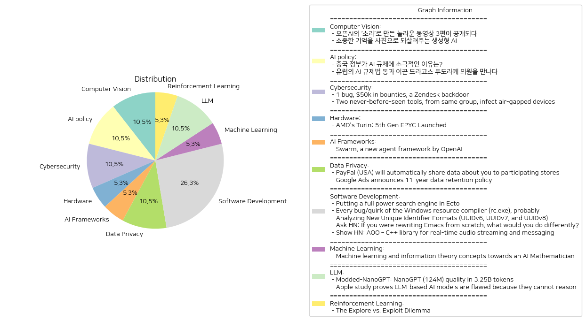

# Daily Artificial Intelligence Insights : News

## 🩵 Computer Vision

**요약:**

1. **주요 테마**:
   두 기사에서 나타나는 주요 테마는 생성 AI 기술의 발전과 그 사회적 응용입니다. 첫 번째 기사는 오픈AI의 새로운 동영상 생성 모델 소라(Sora)에 대한 내용이며, 두 번째 기사는 생성형 AI를 활용한 기억의 합성 프로젝트에 관한 것입니다. 두 기사 모두 창작 및 복원을 통해 사람들의 경험과 기억을 새롭게 표현할 수 있는 생성 AI 기술의 가능성을 강조하고 있습니다.

2. **주요 사건**:
   첫 번째 기사에서는 오픈AI가 새로운 동영상 생성 모델 소라를 발표하고, 이를 활용한 3편의 동영상을 공개한 사건을 다루고 있습니다. 이는 영상 제작 분야에 혁신을 가져올 가능성을 시사합니다. 두 번째 기사에서는 생성형 AI 기술을 통해 소중한 기억을 이미지로 재현하는 '합성 기억' 프로젝트가 추진되고 있으며, 이는 다양한 가족이 과거 추억을 되살릴 수 있게 돕고 있는 것을 강조하고 있습니다.

3. **영향 분석**:
   - **경제**: 생성 AI 기술의 발전은 미디어 및 콘텐츠 제작 산업에 새로운 기회를 제공하며, 창의적인 작업을 개별 사용자에게도 가능하게 만들어 경제적 변화를 일으킬 수 있습니다.
   - **사회**: 기억과 경험을 새롭게 표현할 수 있는 기술은 개인의 정체성과 사회적 연결에 강화된 영향을 끼칠 수 있으며, 사람들이 과거를 다른 방식으로 기억하고 경험하는 데 기여할 것입니다.

4. **최종 요약**:
   이 기사를 통해 보여지는 생성 AI 기술의 발전은 콘텐츠 생성 및 인간 경험의 복원에 있어 새로운 지평을 여는 중요한 변화를 나타냅니다. 오픈AI의 소라 모델을 통한 동영상 제작은 향후 AI 기반 콘텐츠 제작의 잠재력을 보여주며, 기억을 이미지로 변환하는 프로젝트는 사람들의 추억과 감정적 경험을 재구성할 새로운 방법을 제시합니다. 앞으로 생성 AI 기술이 미디어, 예술 및 사회적 상호 작용의 다양한 측면에서 어떤 영향을 미칠지 주목할 필요가 있습니다.

**출처:**

 - 오픈AI의 ‘소라’로 만든 놀라운 동영상 3편이 공개되다 (https://www.technologyreview.kr/%ec%98%81%ec%83%81-%ec%83%9d%ec%84%b1-%eb%aa%a8%eb%8d%b8-%ec%86%8c%eb%9d%bc%eb%a1%9c-%eb%a7%8c%eb%93%a0-%eb%86%80%eb%9d%bc%ec%9a%b4-%ec%98%81%ed%99%94-3%ed%8e%b8%ec%9d%b4-%ea%b3%b5%ea%b0%9c%eb%90%98/)
 - 소중한 기억을 사진으로 되살려주는 생성형 AI (https://www.technologyreview.kr/%ec%83%9d%ec%84%b1%ed%98%95-ai%eb%a1%9c-%ea%b0%80%ec%9e%a5-%ec%86%8c%ec%a4%91%ed%95%9c-%ea%b8%b0%ec%96%b5%ec%9d%84-%ec%82%ac%ec%a7%84%ec%9c%bc%eb%a1%9c-%eb%a7%8c%eb%93%a0%eb%8b%a4/)

## 🩵 AI policy

**요약:**

1. **주요 주제**:
   뉴스 기사들에서 나타나는 주요 주제는 "AI(인공지능) 규제"입니다. 같은 AI 규제에 대해 각 국가의 서로 다른 접근 방식을 다루고 있습니다. 중국은 AI 규제에 대해 비교적 느슨한 태도를 유지하고 있는 반면, 유럽은 보다 엄격한 규제법을 통과시켰습니다.

2. **주요 사건**:
   - 중국 정부는 소비자 기술 플랫폼에 대해 강경한 입장을 보이는 것과 달리, AI 규제에 대해서는 자국 산업 보호 및 성장을 위해 의도적으로 완화된 규제를 유지하고 있습니다.
   - 드라고스 투도라케 의원은 유럽의회에서 AI 규제법 통과를 주도하여 AI 산업 개선을 목표로 한 법안의 추진과 통과에 기여했습니다.

3. **영향 분석**:
   - 경제: 중국의 AI 규제 완화는 자국 산업 발전에 있어 긍정적인 요인이 될 수 있으며, 글로벌 경제에서 경쟁 우위를 점할 가능성이 있습니다. 반면, 유럽의 AI 규제법은 새로운 법적 기준을 설정함으로써 AI 기업들에 다양한 적응과 변화를 요구할 것입니다.
   - 정치: 각국의 AI 규제 접근 방식은 내부 정책의 주요 이슈가 될 수 있으며, 국제 사회에서의 기술 정책 논의에 영향을 줄 것입니다.
   - 사회: AI 규제는 개인정보 보호와 기술 윤리가 중요해지는 현대 사회에서 큰 화두로 작용할 것입니다. 이로 인해 사회는 AI 기술 발전이 개인과 공동체에 미치는 영향을 면밀히 검토하게 될 것입니다.

4. **최종 요약**:
   두 뉴스 기사는 현재 AI 기술의 규제에 대한 전 세계적 흐름을 이해할 수 있는 중요한 관점을 제공합니다. 중국과 유럽의 상반된 규제 접근 방식은 각국의 경제적, 정치적 목표에 달려 있으며, 이는 결국 세계 AI 시장의 향방을 크게 좌우할 수 있습니다. 앞으로 각국의 규제 변화에 따라 글로벌 기술 시장은 지속적인 논의와 교류가 필요할 것으로 보입니다. 향후 AI 산업의 발전 추이에 따라 규제의 수준과 방식에도 큰 변화가 예상되며, 이는 AI 기술이 사회와 경제에 미치는 영향을 더욱 평가하게 할 것입니다.

**출처:**

 - 중국 정부가 AI 규제에 소극적인 이유는? (https://www.technologyreview.kr/%ec%a4%91%ea%b5%ad-%ec%a0%95%eb%b6%80%ea%b0%80-%ed%98%84%ec%9e%ac%eb%a1%9c%ec%84%9c%eb%8a%94-ai-%eb%b6%84%ec%95%bc%eb%a5%bc-%ea%b0%80%ed%98%b9%ed%95%98%ea%b2%8c-%ea%b7%9c%ec%a0%9c%ed%95%98%ec%a7%80/)
 - 유럽의 AI 규제법 통과 이끈 드라고스 투도라케 의원을 만나다 (https://www.technologyreview.kr/ai-%ea%b7%9c%ec%a0%9c%eb%b2%95-%ed%86%b5%ea%b3%bc-%ec%9d%b4%eb%81%88-%eb%93%9c%eb%9d%bc%ea%b3%a0%ec%8a%a4-%ed%88%ac%eb%8f%84%eb%9d%bc%ec%bc%80-%ec%9d%98%ec%9b%90%ec%9d%84-%eb%a7%8c%eb%82%98%eb%8b%a4/)

## 🎈 Cybersecurity

**요약:**

1. **주요 주제**:
   두 뉴스 기사 모두 사이버 보안과 관련된 심각한 위협을 다루고 있습니다. 첫 번째 기사는 소프트웨어 취약점을 악용한 사례를 다루고 있으며, 두 번째 기사는 공기 격리된 기기를 감염시키는 신종 악성 도구 세트를 밝히고 있습니다. 두 기사 모두 고급 해킹 기법과 관련된 정보보안의 중요성을 강조하고 있습니다.

2. **주요 사건**:
   - 첫 번째 기사에서는 Zendesk 시스템에 뒷문(backdoor)이 존재하여 소프트웨어 오류(bug)를 통해 약 5만 달러의 포상금이 지급되었다는 사건이 언급되었습니다.
   - 두 번째 기사는 ESET 연구진이 러시아 국적의 해커 그룹으로 의심되는 GoldenJackal이 두 가지 새로운 도구를 사용해 공기 격리된 기기에서 데이터를 탈취한 사건을 밝혀냈습니다. 이 그룹은 유럽 및 중동 국가의 기관을 타겟으로 복잡한 모듈러 형태의 악성코드를 사용하고 있습니다.

3. **영향 분석**:
   - **경제**: 사이버 보안 위협은 기업과 국가 경제에 심각한 위험 요소로 작용할 수 있습니다. Zendesk 케이스에서 보듯이, 취약점을 악용하려는 시도로 인해 손실이 발생할 수 있으며, 이는 기업의 평판과 경제적 손실을 초래할 수 있습니다.
   - **정치**: 국가 주도의 해킹 사건은 국제 정치적 갈등을 증폭시키고, 국가 간의 신뢰를 저하시킬 수 있습니다. 특히, 두 번째 기사에서 언급된 국가 차원의 해킹 시도는 표적 국가와의 외교 관계에 부정적 영향을 미칠 가능성이 큽니다.
   - **사회**: 개인정보 및 데이터 보안에 대한 우려가 증가하며, 이는 시민들의 온라인 활동에 대한 불안감으로 이어질 수 있습니다. 정보 유출 사건은 개인의 사생활 침해뿐 아니라 사회 전체의 신뢰도를 저하시키는 결과를 초래할 수 있습니다.

4. **최종 요약**:
   이번 뉴스 기사들에서는 사이버 보안의 중요성과 그에 따른 위협을 심도 있게 다루고 있습니다. 급변하는 디지털 환경에서 보안 취약점은 빠르게 탐지되고 대처해야 하며, 특히 국가급 해킹 시도에 대한 대응이 필요합니다. 향후 데이터 보호와 새로운 위협에 대한 예방 조치가 강화되어야 하며, 이를 통해 경제, 정치, 사회 전반에 긍정적 영향을 미치도록 해야 합니다. 앞으로 이러한 위협이 어떻게 전개될지 주시하며 적절한 대처 방안을 마련해 나갈 필요가 있습니다.

**출처:**

 - 1 bug, $50k in bounties, a Zendesk backdoor (https://gist.github.com/hackermondev/68ec8ed145fcee49d2f5e2b9d2cf2e52)
 - Two never-before-seen tools, from same group, infect air-gapped devices (https://arstechnica.com/security/2024/10/two-never-before-seen-tools-from-same-group-infect-air-gapped-devices/)

## 🍋 Hardware

**요약:**

1. **핵심 주제**:
   - AMD의 새로운 5세대 EPYC 프로세서인 'Turin'의 출시
   - 메모리 시스템의 성능 향상 및 대역폭 증가

2. **주요 사건**:
   - AMD는 Turin이라는 이름의 새로운 5세대 EPYC 프로세서를 발표했습니다.
   - 이 프로세서는 메모리 시스템의 변화로 인해 메모리 대역폭이 증가하고 메모리 속도가 빨라졌습니다.
   - 이 제품은 이론적 메모리 대역폭의 약 99%에 도달하며, 시스템 로드 상태와 관계없이 유사한 메모리 지연 시간을 보여줍니다.

3. **영향 분석**:
   - **경제적 영향**: 새로운 프로세서의 출시는 서버 및 데이터 센터 산업에 긍정적인 영향을 미칠 것으로 예상됩니다. 특히, 향상된 성능은 기업의 효율성을 높이고, 제품 경쟁력을 강화시킬 수 있습니다.
   - **기술 혁신**: AMD의 강화된 기술은 경쟁사들에게도 영향을 줄 수 있으며, 향후 경쟁이 더욱 치열해질 가능성이 있습니다. 기술 발전은 IT 산업 전반에 촉매 역할을 할 것입니다.
   - **사회적 영향**: 더 빠르고 효율적인 데이터 처리능력은 소비자들이 더욱 나은 디지털 경험을 제공받게 하며, 관련 산업의 발전을 초래할 수 있습니다.

4. **최종 요약**:
   AMD의 5세대 EPYC 프로세서 발표는 메모리 성능을 대폭 개선하여 데이터 처리효율을 극대화하는 중요한 기술 진보로 평가됩니다. 이러한 변화는 서버 및 데이터 센터 도메인에서의 경쟁을 촉진할 가능성이 있으며, 경제적으로도 긍정적 효과를 미칠 것으로 보입니다. 향후 IT 산업에서 기술 발전의 속도와 규모는 더욱 가속화될 수 있으며, 소비자 및 기업들에게 새로운 기회를 제공할 것입니다. 앞으로 AMD의 행보와 이에 대한 시장의 반응을 주목할 필요가 있습니다.

**출처:**

 - AMD's Turin: 5th Gen EPYC Launched (https://chipsandcheese.com/p/amds-turin-5th-gen-epyc-launched)

## 🐱 AI Frameworks

**요약:**

**1. 주요 주제:**

- 다중 에이전트 시스템의 실험적 프레임워크 소개
- 교육 목적을 중심으로 한 사용자 친화적인 인터페이스
- Chat Completions API를 사용한 핸드오프와 루틴 패턴 강조

**2. 주요 사건:**

- OpenAI에서 새롭게 발표한 'Swarm'이라는 에이전트 프레임워크는 다중 에이전트 시스템 디자인을 위한 실험적 도구로, 주로 교육적 목적으로 설계되었다.
- 이 프레임워크는 사용자가 다양한 에이전트 간의 상호작용을 보다 쉽게 관리하고 시연할 수 있도록 돕는 사용자 친화적 인터페이스를 제공한다.
- Swarm은 특히 Chat Completions API를 사용하여 에이전트 간의 핸드오프 및 루틴 패턴을 구현하는 방식에 중점을 두고 있다.

**3. 영향 분석:**

- **경제:** Swarm과 같은 프레임워크로 인해 교육과 연구 목적으로 AI 에이전트를 설계하고 사용하는 비용이 절감될 가능성이 크다. 또한 기업들은 이를 활용하여 자체 다중 에이전트 시스템을 보다 효율적으로 구축할 수 있다.
- **사회:** 교육 분야에서의 영향이 클 것으로 예상된다. Swarm은 사용자들에게 복잡한 에이전트 시스템의 이해와 활용도를 높일 수 있는 기회를 제공하여 인공지능 분야에 대한 관심과 교육을 촉진할 수 있다.
- **기술:** Swarm은 새로운 인터페이스 및 API 활용 방식의 기준을 제시함으로써, 향후 AI 에이전트 설계 및 구현 방식의 변화를 불러올 수 있다.

**4. 최종 요약:**

Swarm의 발표는 OpenAI가 다중 에이전트 시스템의 교육적 잠재력을 극대화하고자 하는 시도를 보여준다. 사용자 친화적인 인터페이스와 Chat Completions API의 활용은 교육자와 연구자에게 특히 유용할 것으로 보인다. 경제적 이점 외에도, 사회적으로는 인공지능 기술에 대한 이해도와 관심을 확대시키는 계기가 될 수 있다. 앞으로 Swarm이 AI 개발 및 교육 분야에서 어떤 변화를 불러일으킬지 주목할 필요가 있으며, 더 많은 응용 사례 및 사용 경험이 축적될수록 그 영향력은 두드러질 것이다.

**출처:**

 - Swarm, a new agent framework by OpenAI (https://github.com/openai/swarm)

## 🪐 Data Privacy

**요약:**

1. **주요 주제**:
   현재 뉴스 기사들에서 반복적으로 나타나는 주요 주제는 데이터 프라이버시 및 관리 정책의 변화입니다. PayPal과 Google Ads 모두 사용자 데이터 관리에 관련된 새로운 정책을 발표하면서 개인 정보 공유와 데이터 보존에 대한 우려를 불러일으키고 있습니다.

2. **주요 사건**:
   - *PayPal*: PayPal은 사용자 동의 계약과 정책을 업데이트하여 사용자의 개인정보가 제휴 상점과 공유된다는 내용의 새로운 개인정보 보호 진술을 도입합니다. 이 변화는 2024년 11월 27일과 2025년 1월 13일부터 적용되며, 사용자는 이 변화를 원하지 않을 경우 계정을 해지할 수 있습니다.
   - *Google Ads*: Google Ads는 새로운 데이터 보존 정책을 통해 역사적 데이터 접근을 11년으로 제한할 것이라고 발표했습니다. 이는 장기적인 트렌드 분석과 광고 보고에 영향을 미칠 수 있습니다. 이 정책 변화는 데이터 프라이버시에 대한 증가하는 우려에 대응하는 조치로 볼 수 있습니다.

3. **영향 분석**:
   - *경제적 영향*: PayPal의 정책 변화로 인해 각종 상거래 플랫폼과의 개인화된 쇼핑 경험이 가능해지는 반면, 사용자들은 개인정보 노출에 대한 추가적인 주의를 요구받을 것입니다. Google Ads의 새로운 데이터 보존 정책은 광고주에게 장기적인 데이터 분석 제한을 가할 수 있어 광고 전략에 변화를 초래할 수 있습니다.
   - *사회적 영향*: 두 회사의 정책 변화는 사용자들에게 기업의 데이터 관리 방식에 대해 더 많은 주의를 요구하며, 개인정보 보호에 대한 경각심을 일깨울 수 있습니다.

4. **최종 요약**:
   전반적으로 최근의 뉴스들은 기술 기업들이 데이터 프라이버시와 관리에 대한 정책을 강화하는 방향으로 나아가고 있음을 시사합니다. 개인정보 보호에 대한 소비자들의 요구가 증가함에 따라 기업들은 데이터를 어떻게 취급하고 보관할 것인지에 대해 재정립하고 있습니다. 향후 이러한 변화들이 사용자 행동에 미칠 영향과 다른 기술 기업들이 비슷한 조치를 따를지에 대한 관찰이 필요합니다.

**출처:**

 - PayPal (USA) will automatically share data about you to participating stores (https://www.paypal.com/us/legalhub/upcoming-policies-full)
 - Google Ads announces 11-year data retention policy (https://searchengineland.com/google-ads-11-year-data-retention-policy-447465)

## 🩵 Software Development

**요약:**

**주요 주제**:

이번 뉴스 기사에서 공통적으로 발견된 주제는 기술 혁신과 개발입니다. 이를 세부적으로 살펴보면, 새로운 기술 도구 및 접근 방식의 도입, 기존 시스템의 개선, 그리고 독창적인 소프트웨어 솔루션 개발 등이 주요한 흐름으로 나타나고 있습니다.

**주요 사건**:

1. **Ecto에 강력한 검색 엔진을 도입하기**:
   - Postgres Full Text Search와 Apache Solr, Elasticsearch 같은 검색 엔진을 포함한 다양한 텍스트 검색 접근 방식이 논의되었습니다. ParadeDB라는 Postgres 확장을 이용하여 Tantivy를 검색 및 분석용으로 사용했습니다.

2. **Windows 자원 컴파일러(rc.exe)의 결함 및 쿼크 분석**:
   - Zig 언어로 만든 Windows 자원 컴파일러인 'resinator'가 Microsoft의 RC 컴파일러에서 다양한 결함과 버그를 발견했습니다. 이는 사용자 정의 유형, 비-ASCII 숫자와 관련된 문제를 포함하며, 15개의 버그 및 쿼크를 자세히 다루었습니다.

3. **새로운 고유 식별자 형식 분석(UUIDv6, UUIDv7, UUIDv8)**:
   - 새로운 IETF 문서 초안이 기존의 UUID 사양의 단점을 해결하기 위해 새로운 버전(v6, v7, v8)을 제안하였습니다. 이 버전들은 성능 및 보안 기능을 개선하였습니다.

4. **Emacs를 처음부터 다시 작성한다면 어떻게 할 것인가**:
   - 사용자는 Emacs의 가상 개편을 제안하면서 리더 키와 더 예쁜 타이포그래피, 더 친숙한 UI를 강조했습니다. Common Lisp 대신 Scheme을 선호하며 모듈형 아키텍처의 사용을 제안합니다.

5. **실시간 오디오 스트리밍 및 메시징을 위한 C++ 라이브러리 AOO 소개**:
   - 가볍고 유연한 피어투피어 방식의 오디오 스트리밍 및 메시징 라이브러리입니다.

**영향 분석**:

1. **경제**:
   - 새로운 기술 및 라이브러리의 도입은 소프트웨어 개발 분야에서의 생산성 향상과 비용 절감을 기대할 수 있습니다.

2. **정치와 사회**:
   - UUID 사양의 개선은 보안 강화 측면에서 중요한 역할을 할 수 있으며, 이는 사회적 신뢰성 확보에도 기여할 수 있습니다.

3. **기술 및 개발 커뮤니티**:
   - Emacs와 같은 인기 있는 개발 도구의 개선 및 혁신적 제안은 개발자 커뮤니티의 역량을 강화하고 기술적 발전을 촉진할 수 있습니다.

**최종 요약**:

이 뉴스 기사들은 주로 소프트웨어 및 기술 혁신에 초점을 맞추고 있으며, 특히 새로운 도구와 접근 방식의 도입과 기존 시스템의 개선을 중심으로 전개되고 있습니다. 이러한 발전은 기술 산업의 역동성을 견인하고 있으며, 사용자들이 더욱 효율적이고 안전한 시스템을 활용할 수 있도록 기여할 것으로 기대됩니다. 앞으로는 개선된 보안 및 성능 기능을 중심으로 하는 신기술 도입과, 소프트웨어 아키텍처의 모듈화 및 효율화 방안에 주목할 필요가 있습니다.

**출처:**

 - Putting a full power search engine in Ecto (https://moosie.us/parade_db_ecto)
 - Every bug/quirk of the Windows resource compiler (rc.exe), probably (https://www.ryanliptak.com/blog/every-rc-exe-bug-quirk-probably/)
 - Analyzing New Unique Identifier Formats (UUIDv6, UUIDv7, and UUIDv8) (https://blog.scaledcode.com/blog/analyzing-new-unique-id/)
 - Ask HN: If you were rewriting Emacs from scratch, what would you do differently? (https://news.ycombinator.com/item?id=41821545)
 - Show HN: AOO – C++ library for real-time audio streaming and messaging (https://aoo.iem.sh/)

## 🎇 Machine Learning

**요약:**

1. **주요 주제**:
   - 인공지능(AI)의 수학적 추론 능력 향상
   - 정보 이론과 기계 학습을 통한 AI 혁신
   - 수학자들의 사고 방식 이해와 새로운 추측 발견을 위한 AI 개발

2. **주요 사건**:
   - 현재 AI는 언어 처리와 같은 시스템 1 능력에서는 우수성을 보이고 있으나, 수학적 추론과 같은 시스템 2 능력에서는 한계를 보이고 있음
   - 연구자들은 이러한 격차를 줄이기 위해 수학자들이 생각하는 방식을 이해하고, 새로운 수학적 추측을 발견할 수 있는 AI를 개발하려고 노력 중임

3. **영향 분석**:
   - 경제: 수학적 추론을 가진 AI의 발전은 금융 모델링, 데이터 분석 등의 경제 분야에 혁신적인 변화를 불러올 수 있음
   - 정치: AI의 발전은 정책 결정에 보다 복잡하고 정확한 예측을 가능하게 하여, 정책 수립 과정에서의 효율성이 증대될 수 있음
   - 사회: 수학적 능력이 강화된 AI는 교육 분야에서 새로운 학습 모델을 제시할 수 있으며, 이는 교육의 질 향상에 기여할 수 있음

4. **최종 요약**:
   - 최근 AI 연구는 수학적 추론 능력의 격차를 해소하는 방향으로 집중되고 있으며, 이는 AI가 단순한 데이터 처리 능력을 넘어 창의적이고 복잡한 문제 해결에 기여할 수 있는 가능성을 열어 줌.
   - 이러한 AI의 발전은 각종 산업 분야에서 혁신을 이끌어낼 수 있으며, 특히 경제, 사회, 교육 등의 분야에서 중요한 영향을 미칠 것으로 예상됨.
   - 앞으로 수학적 추론 능력을 가진 AI의 진보 추세를 주목할 필요가 있으며, 이와 관련된 기술 개발이 계속될 것임.

**출처:**

 - Machine learning and information theory concepts towards an AI Mathematician (https://arxiv.org/abs/2403.04571)

## 🚀 LLM

**요약:**

**주요 주제**:

1. 효율성 향상: 'Modded-NanoGPT'는 PyTorch 기반의 변형된 트레이너를 활용하여 더 적은 토큰으로 동일한 검증 손실을 달성함으로써 효율성을 극대화하는 방법에 대해 논의하고 있습니다.
2. AI 모델의 한계: Apple의 연구에서는 대형 언어 모델이 기본적인 추론 능력이 부족하다는 결론을 내리고, 이러한 모델의 신뢰성에 대해 의문을 제기하고 있습니다.

**주요 사건**:

1. 'Modded-NanoGPT': 이 프로젝트는 3.15B개의 토큰을 사용하여 10B 토큰을 사용한 기존 방법과 동일한 수준의 결과를 도출하는 데 성공하였으며, 이는 커스텀 옵티마이저와 코드 단순화로 인해 트레이닝 속도가 개선되었음을 시사합니다.
   
2. Apple의 연구: Apple의 인공지능 과학자들은 대형 언어 모델이 텍스트의 작은 변경이나 불필요한 정보 추가에 따라 성능이 저하된다는 점을 발견하였고, 이를 통해 대형 언어 모델의 추론 능력을 평가하는 새로운 벤치마크의 필요성을 제안했습니다.

**영향 분석**:

1. 경제 및 산업: 'Modded-NanoGPT'의 발전은 자연어 처리(NLP) 분야에서 모델 트레이닝의 시간과 자원을 절감하여 경제적 측면에서 큰 이점을 제공할 수 있습니다. 이는 AI 및 머신러닝 산업 전반에 걸쳐 효율성과 혁신을 촉진할 가능성이 있습니다.
   
2. 기술 및 사회: Apple의 연구는 대형 언어 모델의 한계를 부각시키며, AI 기반 서비스와 기술의 신뢰성에 관한 사회적 우려를 불러일으킬 수 있습니다. 이는 AI 연구의 방향성과 정책 결정에 중요한 영향을 미칠 수 있습니다.

**최종 요약**:

이번 뉴스는 AI 모델의 효율성과 한계에 대한 새로운 통찰력을 제공합니다. 'Modded-NanoGPT'의 성공은 AI 트레이닝의 효율성 증대를 시사하며, Apple의 연구는 대형 언어 모델에 대한 신뢰성과 추론 능력의 중요성을 강조합니다. 앞으로 AI 모델의 효율성 개선과 추론 능력 평가에 대한 발전과 논의가 기대되며, 이는 관련 산업 및 사회적 이해 관계자에게 중요한 영향을 미칠 것입니다. AI 기술의 발전은 지속적으로 관찰하며, 이러한 추세가 정책 및 산업 전략에 어떻게 반영될지에 주목해야 합니다.

**출처:**

 - Modded-NanoGPT: NanoGPT (124M) quality in 3.25B tokens (https://github.com/KellerJordan/modded-nanogpt)
 - Apple study proves LLM-based AI models are flawed because they cannot reason (https://appleinsider.com/articles/24/10/12/apples-study-proves-that-llm-based-ai-models-are-flawed-because-they-cannot-reason)

## 🥳 Reinforcement Learning

**요약:**

1. **주요 테마**:
   - 'The Explore vs. Exploit Dilemma' 기사에서는 탐색-착취 문제라는 주제가 중요하게 다루어지고 있습니다. 이는 의사 결정 과정에서 탐색과 착취 사이의 균형을 맞추는 방법에 관한 것입니다.

2. **주요 사건**:
   - 이 기사는 실제 세계에서의 의사 결정 과정과 머신러닝에서의 탐색-착취 문제를 유사하게 설명합니다. 주요 사건은 특정 결정이 잠재적인 보상을 제공할 수 있다는 맥락에서 탐색과 착취 사이의 선택에 대한 설명입니다.

3. **영향 분석**:
   - 경제적 측면에서는, 이러한 의사 결정 프레임워크가 기업의 전략적 계획에 영향을 미칠 수 있습니다. 특히, 자원 배분과 혁신 추구 과정에서 기업이 탐색(새로운 기회를 찾기)과 착취(기존 자원의 효율적 활용) 사이의 균형을 어떻게 맞추는지가 중요해질 수 있습니다.
   - 사회적인 측면에서는 개별 개인이나 조직의 결정이 전체 경제 및 기술 발전에 영향을 미칠 수 있다는 점에서, 보다 광범위한 현상을 이해하는 데 기여할 수 있습니다.

4. **최종 요약**:
   - 'The Explore vs. Exploit Dilemma' 기사는 의사 결정 이론과 실질적인 문제 해결 방식에 대한 통찰을 제공합니다. 탐색과 착취 사이의 균형을 맞추는 것이 중요하며, 이는 기업이나 개인의 전략적인 의사 결정 과정에서 중요한 역할을 할 수 있습니다. 앞으로 이러한 개념이 다양한 산업에서 의사 결정 및 혁신 촉진에 중대한 역할을 할 것으로 기대됩니다. 머신러닝 및 데이터 과학 분야와의 연계도 지속적으로 주목해야 할 사항입니다.

**출처:**

 - The Explore vs. Exploit Dilemma (https://nathanzhao.cc/explore-exploit)

