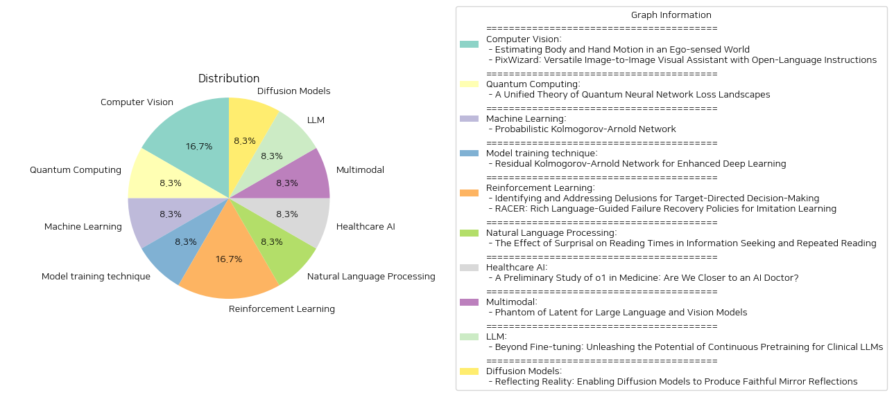

# Daily Artificial Intelligence Insights : Papers

## 🥳 Computer Vision

**요약:**

이 보고서는 두 개의 논문에서 다룬 주요 주제와 문제를 종합하여 요약합니다. 각 논문은 특정 주제에 초점을 맞추고 있으며, 해당 주제의 중요성과 그에 따른 영향을 분석합니다.

1. 주요 주제 및 테마 추출:

   - 첫 번째 논문 'Estimating Body and Hand Motion in an Ego-sensed World'에서는 머리에 장착된 장치에서 얻은 정보로 사람의 신체와 손동작을 추정하는 시스템, EgoAllo를 소개하고 있습니다. 이 시스템은 주변 환경의 3D 신체 자세, 높이 및 손의 파라미터를 추정합니다.
   
   - 두 번째 논문 'PixWizard: Versatile Image-to-Image Visual Assistant with Open-Language Instructions'은 이미지 생성, 조작 및 번역을 수행하는 다채로운 이미지-이미지 비주얼 어시스턴트를 설명합니다. 이 논문은 언어 지시와 어우러진 다양한 비전 작업을 통합하여 하나의 프레임워크로 가져옵니다.

2. 주요 키워드, 트렌드 및 패턴 식별:

   - 두 논문 모두 최신 기술을 활용하여 체계적으로 문제를 해결하고 있으며, 증가하는 데이터 처리 능력과 영상 인식의 중요성을 강조합니다.
   - Diffusion 모델과 Transformer 모델의 활용이 두 논문 모두에서 중요하게 다루어지며, 이는 현재 인공지능과 머신러닝 분야의 중요한 트렌드로 볼 수 있습니다.

3. 주요 사건 및 정보 요약:

   - 'EgoAllo' 시스템은, 머리 동작 조건화 매개변수를 도입하여 추정 정확도를 최대 18% 향상시키는 방법론을 제시하며, 손 추정의 정확도를 40% 이상 개선합니다.
   
   - 'PixWizard'는 다양한 해상도의 이미지에 대해 인간과 유사한 방식으로 정보를 처리할 수 있는 능력을 보여주며, 이는 보지 못한 작업과 인간 지시에 대한 일반화 능력을 입증합니다.

4. 이러한 사건들의 다양한 부문에 대한 영향 분석:

   - 'EgoAllo'의 연구는 가상현실 및 증강현실 분야에서 더욱 현실감 있는 사용자 인터페이스를 개발하는 데 기여할 수 있습니다.
   
   - 'PixWizard'의 발전은 이미지 처리, 특히 디지털 미디어와 광고 산업에서 창의적인 콘텐츠 제작에 많은 영향을 미칠 것으로 예상됩니다.

5. 최종 요약 및 결론:

이 두 논문은 각각 인공지능을 통해 시각적 데이터 처리와 사람의 신체 운동 인식을 향상시키는 방법을 제안하며, 이는 향후 기술 발전에 큰 영향을 미칠 것입니다. 특히, 데이터 기반의 문제 해결 전략과 모델 최적화 기술은 다양한 산업 분야에서 적용 가능성이 큽니다. 향후, 이 기술들이 현실 세계의 문제를 해결하는 데 어떻게 활용될지가 주목됩니다.

**출처:**

 - Estimating Body and Hand Motion in an Ego-sensed World (https://deeplearn.org/arxiv/533024/estimating-body-and-hand-motion-in-an-ego-sensed-world)
 - PixWizard: Versatile Image-to-Image Visual Assistant with Open-Language Instructions (http://arxiv.org/abs/2409.15278v2)

## 🍊 Quantum Computing

**요약:**

### 종합 보고서: 양자 신경망 손실 지형의 통일 이론

#### 1. 핵심 주제와 테마
- **양자 신경망(QNN)의 행동 분석**: 랜덤 초기화를 통해 QNN이 가진 고유한 특성을 분석하며, 고전적인 신경망과의 차이를 강조.
- **Wishart 과정**: QNN의 행동을 설명하기 위한 새로운 수학적 개념으로, 네트워크의 특정 대수적 속성이 이 과정을 결정함.
- **훈련 가능성 평가**: QNN의 구조가 가우시안 프로세스의 한계를 갖는 조건 제시 및 네트워크 구조의 '자유도'라는 새로운 개념을 도입하여 QNN의 훈련 가능성을 평가하는 방법 개발.

#### 2. 공통 키워드, 트렌드 및 패턴
- **랜덤 초기화**: QNN의 초기값이 결과에 미치는 영향에 대한 깊은 연구.
- **수학적 모델링**: QNN의 행동을 설명하기 위해 수학적 구조와 모델을 활용.
- **훈련과 일반화 동작**: 네트워크의 훈련 및 일반화 메커니즘 이해에 대한 강조.

#### 3. 주요 이벤트 및 중요 정보 요약
- QNN의 행동 분석을 통해 고전 신경망이 가우시안 과정과 같은 행동을 보이는 경우와 다르게, QNN은 일반적으로 "Wishart 과정"을 따른다는 것.
- QNN의 자유도라는 새로운 개념을 도입하여, 실험적으로 접근 가능한 방법을 통해 네트워크 훈련 가능성을 정의.
- 특정한 QNN 구조가 가우시안 프로세스 한계를 가지는 상황을 위한 필요한 조건과 충분한 조건을 최초로 제시.

#### 4. 이러한 이벤트의 다양한 부문에 대한 영향 분석
- **딥러닝 연구 분야**: 양자 컴퓨팅이 신경망 훈련에 미칠 수 있는 영향 범위를 넓히며 새로운 연구 방향 제시.
- **AI 및 양자 기술 융합**: 양자 프로세스를 활용한 신경망의 훈련 가능성 개선 방안 제시.
- **수학적 이론 발전**: 새로운 수학적 도구가 QNN 분석에 적용될 수 있는 가능성 탐색.

#### 5. 종합 결론 및 미래 개발 전망
- 본 연구는 양자 신경망의 구조와 행동에 대한 새로운 통찰을 제공하고, QNN의 더 나은 훈련 가능성을 위한 지침을 제시.
- 앞으로의 연구는 특정 네트워크 구조에 대한 Wishart 과정의 적용성과 실험적 검증에 초점을 맞출 필요.
- 양자 컴퓨팅의 발전과 함께 AI 분야에서 양자 기술의 채택이 가속화될 전망. 이를 통해 새로운 유형의 신경망 아키텍처와 알고리즘 개발이 기대됨.

**출처:**

 - A Unified Theory of Quantum Neural Network Loss Landscapes (https://deeplearn.org/arxiv/535506/a-unified-theory-of-quantum-neural-network-loss-landscapes)

## 🎠 Machine Learning

**요약:**

요약 보고서:

1. 핵심 주제 및 테마 추출:
   - 이 논문에서는 Kolmogorov-Arnold 네트워크(KAN)를 활용한 회귀 모델을 제안합니다.
   - 실험적으로 얻은 데이터셋에는 종종 무시할 수 없는 불확실성이 존재하며, 본 논문은 이러한 불확실성 중 특히 우연적 불확실성을 다룹니다.
   - 확률 분포 추정 방법을 제안하며, 이는 입력에 따라 변화하는 출력의 확률 분포를 모델링합니다.

2. 공통 키워드, 트렌드, 패턴 식별:
   - Kolmogorov-Arnold 네트워크, 우연적 불확실성, 확률 분포, 입력 의존성, 다중 양상(multi-modality), 회귀 모델, 확률 분포 추정.

3. 주요 사건 및 중요한 정보 요약:
   - 기존 회귀 모델의 신뢰 구간을 넘어서, 출력의 확률적 분포를 추정하여 보다 자세한 데이터 불확실성을 모델링합니다.
   - KANs의 구조로 인해, 제안된 방법은 계산 효율성을 확보하며, 입력에 따라 변화하는 다양한 분포 유형을 포착할 수 있습니다.
   - 소스 코드는 온라인에서 제공됩니다.

4. 이러한 사건이 다양한 분야에 미치는 영향 분석:
   - 데이터 분석 및 머신 러닝 분야에서 정밀도가 필요한 회귀 모델링에 크게 기여할 수 있습니다.
   - 불확실한 환경에서의 의사결정 및 예측 정확성을 높이는 데 유용합니다.

5. 최종 종합 요약 및 결론:
   - 이 논문은 새로운 회귀 분석 방법을 제시하여 복잡한 다중 양상과 분포 변화를 처리할 수 있는 가능성을 열어줍니다.
   - 앞으로 데이터 과학 및 기계 학습 분야에서 보다 정교한 분석을 위한 중요한 도구로 자리매김할 것으로 예상됩니다. 추가 연구 및 개발을 통해 이 접근법의 실질적 적용 범위가 넓어질 것으로 기대됩니다.

**출처:**

 - Probabilistic Kolmogorov-Arnold Network (https://deeplearn.org/arxiv/535517/probabilistic-kolmogorov-arnold-network)

## 🎠 Model training technique

**요약:**

요약 보고서:

1. 주요 주제 및 테마:
   - 본 논문은 딥러닝의 효율성을 한층 강화하기 위해 소개된 'Residual Kolmogorov-Arnold Network (RKAN)'에 대해 다룬다.
   - 기존 컨볼루션 신경망(CNN)이 종종 깊은 계층에서 장거리, 비선형 종속성을 효과적으로 포착하는 데 어려움을 겪는다는 문제를 해결하고자 한다.
   - Chebyshev 다항식을 기반으로 KAN 컨볼루션을 CNN에 잔여 구성요소로 통합시켜 정확성을 높이고 계산 효율성을 유지한다.

2. 공통적인 키워드, 트렌드 및 패턴:
   - 장거리 비선형 종속성, Chebyshev 다항식, Kolmogorov-Arnold Network, Residual 구성요소
   - Residual 블록의 활용과 CNN의 성능 개선
   - ResNet 및 DenseNet 같은 기존 구조에의 통합을 통한 개선

3. 주요 이벤트 및 중요한 정보:
   - RKAN 블록이 기존 ResNet 및 DenseNet 아키텍처에 통합된 경우 다양한 벤치마크에서 일관된 성능 향상을 보여주었다는 점
   - 개선된 CNN이 시각적 데이터를 처리하는 데 있어 더 큰 잠재력을 발휘할 수 있음을 입증하였다.

4. 이러한 이벤트가 다양한 분야에 미치는 영향:
   - 컴퓨터 비전 분야에서의 발전: 더욱 향상된 CNN의 도입으로 향후 이미지 및 비디오 분석의 정확성과 효과성이 크게 개선될 것으로 예상된다.
   - 인공지능 및 딥러닝의 연구 방향에 새로운 경로를 개척하며, 이를 통해 다양한 응용 분야에서 혁신과 효율성을 높이는 역할을 할 것이다.

5. 최종 통합 요약 및 향후 주목할 발전 방향:
   - Residual Kolmogorov-Arnold Network는 딥러닝 특히 CNN에서의 성능 향상을 위한 유망한 접근임을 확립했다.
   - 향후 연구에서는 이 기법을 확장하여 더욱 복잡하고 다양한 데이터셋을 처리할 수 있는 가능성을 탐색할 필요가 있다.
   - RKAN의 적용 범위를 확대하여 다양한 인공지능 및 기계 학습 응용 프로그램의 정밀도를 높이고, 비선형성 등의 복잡성을 효과적으로 다뤄야 할 것이다.

**출처:**

 - Residual Kolmogorov-Arnold Network for Enhanced Deep Learning (https://deeplearn.org/arxiv/535518/residual-kolmogorov-arnold-network-for-enhanced-deep-learning)

## 🎈 Reinforcement Learning

**요약:**

요약 보고서:

1. 주요 주제 및 테마 추출:
   - 첫 번째 논문 'Identifying and Addressing Delusions for Target-Directed Decision-Making'에서는 객체 지향적 에이전트의 훈련 문제와 그로 인한 망상 발생을 다루고 있으며, 잘못된 훈련으로 에이전트가 잘못된 신념을 가짐으로써 비정상적인 행동과 일반화 실패로 이어질 수 있는 부분을 중점적으로 분석하고 있습니다.
   - 두 번째 논문 'RACER: Rich Language-Guided Failure Recovery Policies for Imitation Learning'은 로봇 매니퓰레이션에서의 비주얼 모터 정책의 견고함을 개선하고 자가 회복 메커니즘을 보강하기 위한 새로운 접근 방식을 제안하고 있습니다. 이를 위해 전문가 시연을 데이터로 활용하여 언어 주도 오류 복구 모델인 RACER를 통해 로봇의 제어 능력을 향상시키고자 합니다.

2. 공통 키워드, 트렌드 및 패턴 식별:
   - 두 논문 모두 인공지능(AI) 에이전트의 학습 및 제어 개선을 주제로 하고 있으며, 언어를 통한 행동 가이드 및 복구 메커니즘의 활용을 강조하고 있습니다.
   - 또한 불완전한 학습 시스템 내에서 발생할 수 있는 오류를 식별하고 그에 대한 솔루션을 제시함으로써 더 나은 일반화 및 성능 향상을 추구합니다.

3. 각 논문의 주요 사건 및 핵심 정보 요약:
   - 첫 번째 논문에서는 에이전트의 망상을 식별 및 해결하는 방법을 개발하여 외부 분포 일반화 성능을 개선합니다. 망상은 대체 라벨링을 통해 훈련된 목표 지향 강화 학습(RL) 에이전트에서 발생할 수 있으며, 제안된 솔루션의 효과가 실험적으로 검증되었습니다.
   - 두 번째 논문에서는 RACER 프레임워크를 도입하여 자동화된 데이터 생성 파이프라인을 통해 로봇의 오류 복구 능력을 강화합니다. 이 프레임워크는 온라인 감독자로서의 비전-언어 모델(VLM)을 이용하여 로봇이 작업 실행 시 세부적인 언어 지침을 받을 수 있도록 하며, 둘러보기를 통해 상위 성능을 발휘하도록 합니다.

4. 이러한 사건이 다양한 부문에 미치는 영향 분석:
   - 인공지능 에이전트와 로봇 공학 분야는 이러한 연구를 통해 에이전트의 신뢰성과 정확성을 높이며, 실제 응용 가능성을 확대할 수 있습니다.
   - 나아가 비정상적인 행동 및 오류에 대한 자동 조정 메커니즘은 다양한 산업 분야에서 자율 시스템의 적용을 가속화할 수 있습니다.

5. 종합 결론 및 향후 주목할 발전 사항:
   - AI 및 로봇 시스템의 에이전트 훈련 및 오류 복구 메커니즘의 개선은 보다 현명하고 확장 가능한 애플리케이션 구현을 가능하게 할 것입니다.
   - 추후 연구 방향으로는 복잡한 환경에서의 적용 확대 및 다른 형태의 인간-로봇 상호작용 개선에 대한 추가적인 연구가 요구될 것으로 보입니다.

**출처:**

 - Identifying and Addressing Delusions for Target-Directed Decision-Making (https://deeplearn.org/arxiv/535605/identifying-and-addressing-delusions-for-target-directed-decision-making)
 - RACER: Rich Language-Guided Failure Recovery Policies for Imitation Learning (http://arxiv.org/abs/2409.14674v1)

## 💚 Natural Language Processing

**요약:**

보고서 요약:

1. 핵심 주제 및 테마 추출:
- 이 논문은 정보 탐색과 반복 읽기에서의 놀라움(surprisal)이 읽기 시간에 미치는 효과를 연구한다.
- 정신언어학에서 놀라움이 처리 난이도에 미치는 영향은 중요한 연구 분야이다.
- 세 가지 언어 처리 방식(정보 탐색, 반복 처리, 두 가지의 조합)에 대한 분석이 수행되었다.

2. 공통 키워드, 트렌드 및 패턴 식별:
- '놀라움', '읽기 시간', '정보 탐색', '반복 처리', '예측 능력', '인지 관련 수치'
- 놀라움이 처리 시간에 미치는 선형적 영향은 특정 언어 처리 방식에서도 관찰된다.

3. 주요 사건 및 중요 정보 요약:
- 표준 놀라움 추정치를 사용할 때, 놀라움 이론에 따른 선형적 효과가 정보 탐색과 반복 읽기에도 적용된다.
- 인간에게 특화된 상황에 따른 놀라움 추정치는 정보 탐색에서 처리 시간 예측 능력을 개선하지 못한다.
- 반복 읽기에서는 이러한 상황별 놀라움 추정치가 처리 시간 예측에서 거의 효과가 없다.
- 인간과 현재 언어 모델 간의 과제 및 기억 표현의 불일치가 드러났다.

4. 여러 분야에 미치는 영향 분석:
- 정신언어학: 언어 모델의 예측 능력과 인간의 인지적 과정을 재평가할 필요성.
- 정보 학습 및 처리: 정보 탐색에서의 모델 정확성에 대한 의문 제기.
- 인공지능과 언어 모델: 인간과의 정렬 문제, 이론적 도전 과제 대두.

5. 결론 및 향후 주목할 발전 가능성:
- 현재 언어 모델이 정신언어학적 측정치의 예측에 얼마나 사용될 수 있는지에 대한 의문.
- 인간의 인지적 처리 과정을 정확하게 모사할 수 있는 혁신적 접근법 필요.
- 과제 및 기억 표현 정렬을 개선하기 위한 차세대 언어 모델 개발 가능성 검토. 

이번 연구는 심리 언어학과 관련된 이론적 도전 과제를 제시하며, 정보 처리와 모델 예측의 정밀함을 높이기 위한 다양한 학문적 노력이 중요함을 시사한다.

**출처:**

 - The Effect of Surprisal on Reading Times in Information Seeking and Repeated Reading (https://deeplearn.org/arxiv/535642/the-effect-of-surprisal-on-reading-times-in-information-seeking-and-repeated-reading)

## ⭐ Healthcare AI

**요약:**

보고서 요약:

1. 핵심 주제 및 주제 추출:
   - AI의 발전과 의료 분야에서의 적용 가능성
   - OpenAI의 o1 모델 소개: 내재된 사고의 연쇄 기법과 강화 학습 전략 사용
   - o1 모델이 다양한 일반 언어 과제에서 보인 강력한 성능과, 특히 의료 분야에서의 성능 평가 필요성

2. 공통 키워드, 트렌드, 패턴 식별:
   - 대규모 언어 모델(LLM)과 강화 학습
   - 의료 분야 적용 시 필요한 이해력, 추론 능력, 다국어 능력
   - NEJM, Lancet 등의 전문 의학 퀴즈를 기반으로 한 새로운 복잡한 QA 태스크

3. 주요 사건과 중요한 정보 요약:
   - o1 모델은 기존 GPT-4 모델보다 6.2% 및 6.6% 더 높은 정확도를 보임
   - 두 개의 새롭게 구성된 복잡한 QA 시나리오 포함
   - 19개의 데이터세트 전반에서 뛰어난 성능을 나타냄
   - 모델의 약점: 환각, 일관되지 않은 다국어 능력, 불일치하는 평가 기준

4. 이러한 사건의 다양한 분야에 대한 영향 분석:
   - AI의 의료 분야 적용 가능성 증대
   - 전문적인 의료 상황에서 LLM의 응용 가능성 확대
   - 정확도 개선으로 인한 임상적 유용성 증대 가능성

5. 최종 요약 및 결론:
   - o1 모델의 강화된 추론 능력이 복잡한 임상 시나리오에서의 이해력 증대에 기여함
   - 모델의 한계를 보완하기 위한 추가 연구 필요성 강조
   - 데이터 및 모델 출력 공개: 추후 연구를 위한 자료 제공
   - AI 의사로의 진일보 가능성, 미래 발전에 대한 기대감

이 보고서는 AI가 의료 분야에 미칠 수 있는 영향과 가능성을 제시하며, 향후 연구 및 개발의 방향성을 고려한 종합적인 시사점을 제공합니다.

**출처:**

 - A Preliminary Study of o1 in Medicine: Are We Closer to an AI Doctor? (http://arxiv.org/abs/2409.15277v1)

## 🎇 Multimodal

**요약:**

1. 주요 주제 및 테마 추출:
   - 대규모 언어 및 비전 모델(LLVM)의 발전
   - 비주얼 지시 조정 및 모델 규모의 확대
   - 효율적인 LLVM의 필요성과 Phantom 모델 개발
   - 잠재 히든 차원을 일시적으로 증가시키는 방법

2. 공통 키워드, 트렌드, 패턴:
   - 모델 크기 증가: 26B, 34B, 80B 매개변수
   - 효율성 개선 요구: 성능은 유지하면서 모델 크기 축소
   - Phantom Optimization(PO) 기술 설정
   - 멀티 헤드 자기 주의(MHSA) 활용

3. 주요 사건 및 핵심 정보 요약:
   - 대규모 언어 및 비전 모델의 크기가 늘어나면서 성능이 향상됨에 따라, 훈련 및 추론에 더 많은 하드웨어 자원이 요구됨.
   - 이러한 문제점을 해결하기 위해 Phantom이라는 효율적인 LLVM 패밀리가 제안됨. 모델 크기는 0.5B, 1.8B, 3.8B 및 7B로 줄어들었으나 학습 능력은 크게 향상됨.
   - 멀티 헤드 자기 주의(MHSA) 동안 잠재 히든 차원을 일시적으로 늘려서 더 많은 비전-언어 지식을 준비할 수 있게 함.
   - Phantom Optimization(PO)는 자동회귀 감독 미세 조정(SFT) 및 직접 선호 최적화(DPO)-유사 개념을 사용하여 효율성을 극대화함.

4. 이러한 사건이 다양한 부문에 미치는 영향 분석:
   - 효율적인 모델이 개발됨으로써, 대규모 모델 운용의 비용 절감 가능성.
   - 더 작은 모델로도 높은 성능을 유지할 수 있게 되어, 자원이 한정된 환경에서도 다수의 응용 프로그램에서 탑재 가능성이 증가.
   - Phantom 모델의 성능 향상으로 인해 교육, 산업 응용 분야 등에 긍정적인 파급 효과가 기대됨.

5. 최종 요약 및 미래 발전 가능성:
   - Phantom 모델은 기존의 대규모 언어 및 비전 모델의 문제점을 해결하면서도 높은 성능을 유지하는 효율적인 솔루션으로 자리 잡고 있음.
   - 앞으로 이러한 경량화된 모델들이 다양한 분야에 채택되며, 더 많은 연구와 발전이 이루어질 가능성이 높음.
   - 미래에 더 많은 혁신적인 최적화 방법이 개발되어 모델의 효율성을 더욱 높이고자 하는 경향이 지속될 것임.

**출처:**

 - Phantom of Latent for Large Language and Vision Models (http://arxiv.org/abs/2409.14713v1)

## ☀️ LLM

**요약:**

**종합 보고서: 임상 LLM을 위한 연속적 사전 훈련의 잠재력**

1. **주제 및 테마 추출:**
   - 대형 언어 모델(LLM)의 임상 응용 분야에서의 변혁 잠재력
   - 연속적 사전 훈련, 지침 세분화 튜닝, NEFTune, 프롬프트 엔지니어링과 같은 적응 기법
   - Mistral 7B 및 Mixtral 8x7B 모델의 임상 훈련 및 평가 과정

2. **공통 키워드, 트렌드 및 패턴:**
   - 임상용 대형 데이터 세트(500억 토큰)와 지침 세분화 데이터 세트(5억 토큰) 사용
   - 연속적 사전 훈련 및 세분화 튜닝의 결합 활용
   - 동시성을 높이기 위한 NEFTune의 혁신적 사용
   - 성능 향상을 위한 복잡한 프롬프트 엔지니어링

3. **주요 사건 및 핵심 정보 요약:**
   - 250억 토큰을 초과하는 연속 사전 훈련은 자체적으로는 미약한 개선을 보였으나, 이는 지침 세분화 튜닝의 강력한 기초를 구축
   - NEFTune은 주로 생성 품질을 향상시키기 위해 설계되었으나, 벤치마크에서 추가적인 이점을 입증
   - 복잡한 프롬프트 엔지니어링이 성능을 더욱 향상

4. **이벤트가 다양한 부문에 미치는 영향 분석:**
   - 연속 사전 훈련과 세분화 튜닝의 결합은 임상 도메인에서 LLM 성능 최적화에 중요한 전략이 될 가능성
   - NEFTune과 프롬프트 엔지니어링이 임상 입력 해석 및 진단 추천의 정확성을 증가시킬 수 있는 잠재력
   - 최적화된 LLM을 통해 의료 부문에서 효율적인 데이터 처리와 임상 의사결정의 개선 혜택 예상

5. **결론 및 미래 발전:**
   - 임상 LLM 성능 극대화를 위해 맞춤형 세분화 전략과 혁신적인 기술 탐구의 중요성 다시 강조됨
   - LLM 기술이 임상 의학의 다양한 측면에서 지속적으로 채택될 가능성
   - 향후 연구를 통해 임상적 상호 작용의 정확도 및 효율성을 더욱 개선할 수 있는 방법을 연구할 필요성

이 연구는 임상 LLM의 성능 최적화를 위한 다양한 접근 방식을 보여주며, 이를 기반으로 한 미래 개발의 기회를 제시합니다. 이는 특히 의학적 의사결정 및 데이터 분석에서 중요한 발전을 의미할 수 있습니다.

**출처:**

 - Beyond Fine-tuning: Unleashing the Potential of Continuous Pretraining for Clinical LLMs (http://arxiv.org/abs/2409.14988v1)

## 🍊 Diffusion Models

**요약:**

제목: '현실 반영: 확산 모델을 통해 정확한 거울 반사를 생성하는 방법'

요약: 이 연구는 확산 기반 생성 모델을 사용하여 매우 사실적이고 그럴듯한 거울 반사를 생성하는 문제를 다루고 있습니다. 이 문제를 이미지 인페인팅 작업으로 구성하여 거울 배치에 대한 사용자 제어를 더 허용합니다. 이를 위해, SynMirror라는 대규모 데이터셋을 생성했으며, 이는 거울 앞에 배치된 다양한 합성 장면으로 구성되어 있습니다. SynMirror는 약 198K 샘플로 66K개의 독특한 3D 객체로부터 렌더링된 샘플과 관련된 깊이 지도, 일반 지도, 인스턴스별 세분화 마스크가 포함되어 있어 장면의 중요한 기하적 특성을 포착합니다. 이 데이터셋을 사용하여, 입력 이미지와 거울 영역을 나타내는 마스크가 주어졌을 때 고품질의 기하적으로 일관된 사진실감 거울 반사를 생성하는 새로운 깊이 조건 인페인팅 방법인 MirrorFusion을 제안합니다. MirrorFusion은 SynMirror에서 광범위한 정량적 및 정성적 분석을 통해 최첨단 방법을 능가합니다. 우리의 인식으로는, 확산 기반 모델을 사용하여 장면 속 객체의 제어 가능하고 충실한 거울 반사를 생성하는 어려운 문제를 성공적으로 해결한 것은 우리가 처음입니다. SynMirror와 MirrorFusion은 실무자 및 연구자 모두에게 이미지 편집 및 증강 현실 응용 프로그램에 대한 새로운 가능성을 열어줍니다.

---

본 연구는 이미지 생성 및 편집 분야에서 확산 모델을 사용하여 거울 반사를 더욱 사실적으로 표현하는 새로운 방법론을 소개했습니다. SynMirror 데이터셋과 MirrorFusion 모델의 개발은 장면의 기하학적 특성을 정확하게 반영하며, 이미지 인페인팅 작업에서 탁월한 성능을 보였습니다. 이러한 발전은 이미지 편집의 새로운 가능성을 열었으며, 특히 증강 현실 분야에서의 활용 가능성이 크게 주목받고 있습니다. 앞으로의 연구에서는 거울 반사가 요구되는 다양한 응용 분야에서의 적용 가능성을 더 탐색할 필요가 있습니다.

**출처:**

 - Reflecting Reality: Enabling Diffusion Models to Produce Faithful Mirror Reflections (http://arxiv.org/abs/2409.14677v1)

