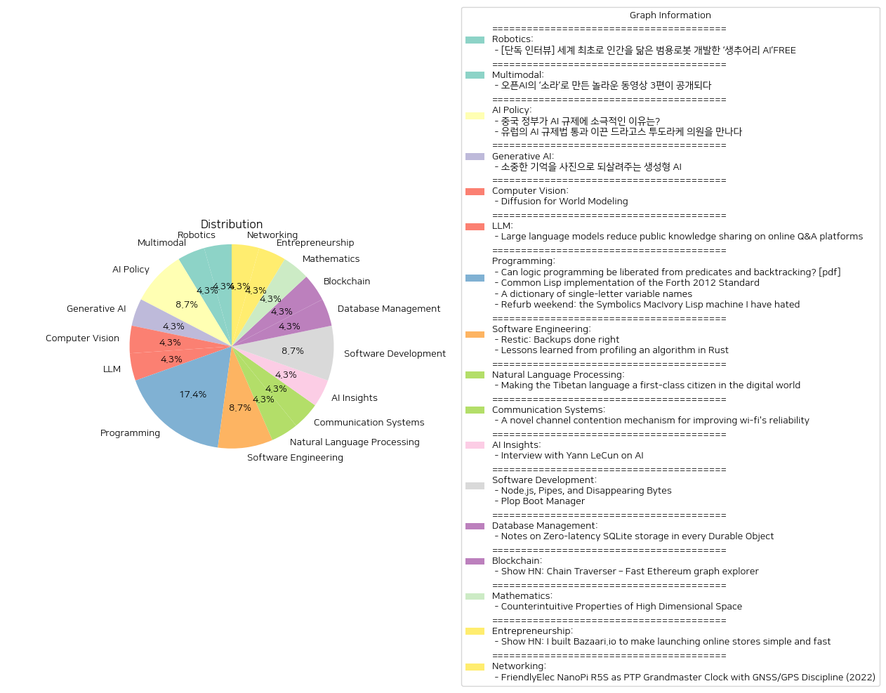

# Daily Artificial Intelligence Insights : News

## 💚 Robotics

**요약:**

1. **주요 테마**:
   - 로봇과 인공지능(AI)의 발전
   - 인간을 닮은 범용 로봇 개발의 의미와 기술적 진보
   - AI와 로봇이 미래 사회에 미칠 영향

2. **주요 사건**:
   - 캐나다 AI 로봇 전문기업 생추어리 AI(Sanctuary AI)는 인간을 닮은 범용 로봇을 세계 최초로 개발했다는 소식을 발표했다.
   - 조르디 로즈 CEO와의 인터뷰를 통해 이 로봇이 일상의 복잡한 상황에 유연하게 대응할 수 있도록 설계되었다고 강조하였다.
  
3. **영향 분석**:
   - 경제: 이러한 로봇의 개발은 로봇 산업 및 관련 AI 기술의 상용화와 시장 확장을 촉진할 것으로 보인다. 노동 시장의 변화와 새로운 직종의 생성 가능성을 암시한다.
   - 사회: 인간과 유사한 로봇의 등장으로 인해 대중의 삶의 질이 향상될 수 있으며, 일상적인 업무와 가사 노동에서 해방될 가능성이 있다. 그러나 이는 인간의 일자리에 대한 잠재적 위협도 내포할 수 있다.
   - 정치: AI와 로봇의 발전은 데이터 윤리와 개인정보 보호 등 법적 및 규제상의 쟁점을 재조명하게 할 것이다.

4. **최종 요약**:
   - 생추어리 AI의 기술적 진보는 AI와 로봇공학의 시대를 열어가고 있는 중요한 이정표로 평가된다. 이러한 기술들은 우리가 살아가는 방식을 근본적으로 변화시킬 잠재력을 지니고 있으며, 로봇의 상용화는 장기적으로 경제와 사회에 큰 영향을 미칠 것이다. 미래 발전상황을 주시해야 할 필요가 있으며, 특히 사회적 영향에 대한 대비책을 고민해야 할 시점이다.

**출처:**

 - [단독 인터뷰] 세계 최초로 인간을 닮은 범용로봇 개발한 ‘생추어리 AI’FREE (https://www.technologyreview.kr/%ec%9d%b8%ed%84%b0%eb%b7%b0-%ec%83%9d%ec%b6%94%ec%96%b4%eb%a6%ac-ai%ea%b0%80-%ea%b7%b8%eb%a6%ac%eb%8a%94-%eb%af%b8%eb%9e%98%ec%9d%98-%eb%a1%9c%eb%b4%87%ec%9d%80-%ec%8b%a4%ec%b2%b4%ed%99%94/)

## 🎠 Multimodal

**요약:**

**1. 주요 주제:**
- 오픈AI의 신기술 소라(Sora)에 대한 관심: 최신 동영상 생성 모델 소라가 주목받고 있으며, 이를 활용한 다양한 창작물들이 등장하고 있음.
- 혁신적인 제작 방법 및 목적: 영상 크리에이터들이 소라를 이용해 창작하는 과정 및 그 목적에 대한 탐색.

**2. 주요 사건:**
- 오픈AI가 동영상 생성 모델 소라를 공개하고 이를 활용하여 제작된 3편의 놀라운 동영상을 선보임.
- 영상 제작에 참여한 크리에이터들이 소라를 활용한 창작 과정에서의 기술 및 제작 목적을 설명함.

**3. 영향 분석:**
- 경제적 영향: 소라와 같은 혁신적인 기술은 영상 미디어 산업에 큰 변화를 가져올 수 있으며, 새로운 시장 기회 창출과 동시에 기존 제작 방식의 변화를 촉발할 수 있음.
- 사회적 영향: 창작의 민주화가 이루어짐에 따라 더 많은 사람들이 우수한 창작물을 만들어내는 것이 가능해져 콘텐츠 다양성이 증가할 수 있음.
- 기술적 발전: AI 및 머신러닝 기술의 발전을 통해 창작물의 질과 창의성이 높아질 가능성이 있음.

**4. 최종 요약:**
최근 동영상 생성 모델인 소라(Sora)를 통해 오픈AI가 창출한 혁신적인 영상들이 발표되면서 AI가 미디어 산업에 미치는 영향을 보여주고 있다. 이는 콘텐츠 제작의 새로운 지평을 여는 동시에, 영상 제작의 방식과 시장에 영향을 미칠 것으로 예상된다. 앞으로 AI 기반 콘텐츠 제작 기술이 어떻게 발전하고, 사회와 경제에 어떤 영향을 미칠지 주목할 필요가 있다. 오래된 제작 방식의 변화가 필연적이며, 이 과정에서 경제적으로는 새로운 비즈니스 기회와 사회적으로는 콘텐츠 다양성 증가를 기대할 수 있다.

**출처:**

 - 오픈AI의 ‘소라’로 만든 놀라운 동영상 3편이 공개되다 (https://www.technologyreview.kr/%ec%98%81%ec%83%81-%ec%83%9d%ec%84%b1-%eb%aa%a8%eb%8d%b8-%ec%86%8c%eb%9d%bc%eb%a1%9c-%eb%a7%8c%eb%93%a0-%eb%86%80%eb%9d%bc%ec%9a%b4-%ec%98%81%ed%99%94-3%ed%8e%b8%ec%9d%b4-%ea%b3%b5%ea%b0%9c%eb%90%98/)

## 🌞 AI Policy

**요약:**

1. **주요 테마**:
   - AI(인공지능) 규제의 차별화된 접근 방식: 각국 정부의 AI 규제 접근 방식의 차이를 드러냄.
   - AI 산업에 대한 규제 정책의 중요성: AI 규제가 산업에 미치는 영향을 중점적으로 다룸.

2. **주요 사건**:
   - 중국 정부는 AI 산업의 성장을 위해 느슨한 규제를 유지: 중국은 AI 규제를 강력하게 시행하지 않고, 오히려 산업의 성장을 돕기 위한 방안을 모색 중이라는 점이 강조됨.
   - 유럽연합 AI 규제법 통과: 드라고스 투도라케 의원이 핵심 역할을 했으며, 법이 통과되었을 때 AI 산업의 개선 가능성에 대한 긍정적 의견이 소개됨.

3. **영향 분석**:
   - 경제적 영향: 중국의 경우 AI 산업의 발전을 통해 경제 성장을 도모할 가능성이 높으며, 유럽의 경우 규제를 통해 AI 기술의 윤리적 발전과 기업의 책임성을 증진시키려 함.
   - 정치적 영향: 각국의 규제 정책은 해당 지역 내 산업 정책 방향을 결정짓는 중요한 요소로 작용하고 있으며, 정치적 논의의 중심이 되고 있음.
   - 사회적 영향: AI 규제는 기술 발전의 속도조절 및 사회 안정화에 기여할 수 있는 반면, 과도한 규제는 산업 혁신을 저해할 수 있음.

4. **최종 요약**:
   - 전 세계적으로 AI 기술의 발전 속도에 발맞춰 다양한 규제가 논의되고 있으며, 각국의 정책 방향에 따라 경제 및 사회에 미칠 영향 또한 상이하다. 중국의 경우 산업 중심의 느슨한 규제를 통해 경제 성장을 목표로 하고 있는 반면, 유럽은 규제 강화를 통해 책임 있는 기술 발전을 도모하고 있다. 이러한 규제의 방향성은 앞으로 각국의 AI 산업 발전에 중요한 변수가 될 것이며, 지속적 관찰이 필요하다. 앞으로 기술 발전과 규제 균형을 어떻게 잡느냐가 핵심 과제가 될 전망이다.

**출처:**

 - 중국 정부가 AI 규제에 소극적인 이유는? (https://www.technologyreview.kr/%ec%a4%91%ea%b5%ad-%ec%a0%95%eb%b6%80%ea%b0%80-%ed%98%84%ec%9e%ac%eb%a1%9c%ec%84%9c%eb%8a%94-ai-%eb%b6%84%ec%95%bc%eb%a5%bc-%ea%b0%80%ed%98%b9%ed%95%98%ea%b2%8c-%ea%b7%9c%ec%a0%9c%ed%95%98%ec%a7%80/)
 - 유럽의 AI 규제법 통과 이끈 드라고스 투도라케 의원을 만나다 (https://www.technologyreview.kr/ai-%ea%b7%9c%ec%a0%9c%eb%b2%95-%ed%86%b5%ea%b3%bc-%ec%9d%b4%eb%81%88-%eb%93%9c%eb%9d%bc%ea%b3%a0%ec%8a%a4-%ed%88%ac%eb%8f%84%eb%9d%bc%ec%bc%80-%ec%9d%98%ec%9b%90%ec%9d%84-%eb%a7%8c%eb%82%98%eb%8b%a4/)

## 🚀 Generative AI

**요약:**

1. **주요 테마**:
   - 생성형 AI 기술의 활용
   - 사진 및 이미지를 통한 기억 복원
   - 가족과 과거 추억에 대한 가치 회복

2. **주요 사건**:
   - '합성 기억' 프로젝트는 생성형 AI를 활용하여 잊혀진 기억을 이미지로 재생산하는 기술을 개발 중이다. 이는 개인들이 카메라에 담지 못했던 과거의 소중한 순간들을 다시 되살릴 수 있도록 돕고 있다.

3. **영향 분석**:
   - **사회적 영향**: 이러한 기술은 많은 사람들에게 감정적 충족감을 줄 수 있으며, 가족 간의 유대를 강화하는 데 기여할 수 있다. 잊혀졌던 역사를 되찾는 점에서 개인의 정체성을 회복하는 데도 중요한 역할을 한다.
   - **기술적 영향**: 사진 복원 및 생성형 AI 분야에서의 기술적 진보를 보여주며, 이는 AI 기술의 응용 범위를 확대시키고 다양한 분야에서 활용 가능성을 제시한다.
   - **경제적 영향**: 그러한 서비스와 기술이 상용화된다면, 새로운 시장을 창출하고 관련 산업의 성장을 촉진할 수 있다.

4. **최종 요약**:
   생성형 AI를 활용한 '합성 기억' 프로젝트는 개인과 가족의 추억을 되살리고 재현하는 데 중점을 두고 있으며, 이는 큰 사회적, 감정적 반향을 일으킬 수 있다. 또한, 기술적 혁신이 지속되면서 경제적 가치 창출의 가능성을 보여주고 있어, 앞으로 이와 관련한 시장의 발전과 기술 도입을 유심히 지켜볼 필요가 있다. 사회적 가치와 경제적 이익을 동시에 겨냥하는 프로젝트로, 범위를 점차 확장해 나갈 것으로 기대된다.

**출처:**

 - 소중한 기억을 사진으로 되살려주는 생성형 AI (https://www.technologyreview.kr/%ec%83%9d%ec%84%b1%ed%98%95-ai%eb%a1%9c-%ea%b0%80%ec%9e%a5-%ec%86%8c%ec%a4%91%ed%95%9c-%ea%b8%b0%ec%96%b5%ec%9d%84-%ec%82%ac%ec%a7%84%ec%9c%bc%eb%a1%9c-%eb%a7%8c%eb%93%a0%eb%8b%a4/)

## ⭐ Computer Vision

**요약:**

1. **주요 테마**:
   - 인공지능과 기계 학습의 발전.
   - 게임 산업에서의 혁신적인 기술 적용.
   - 인공지능 모델의 성능 향상 및 인간 능력과의 비교.

2. **주요 사건**:
   - 연구자들이 게임 환경에서의 반응을 시뮬레이션하기 위해 디퓨전 모델을 훈련시켜 게임 프레임을 예측하게 됨.
   - DIAMOND라는 세계 모델을 적용해 아타리 100k 게임에서 인간보다 46% 더 나은 점수를 기록함. 인간 표준화 점수 기준 평균 1.46을 달성함.

3. **영향 분석**:
   - **경제**: AI의 발전으로 게임 산업은 생산성을 높이며 새로운 경제적 기회를 창출할 수 있음. 이는 AI 기반 게임 개발의 투자 증가로 이어질 수 있음.
   - **사회**: 게임 산업의 발전으로 인해 새로운 트렌드와 문화가 형성될 수 있으며, 인간의 게임 플레이 방식 및 취향에 변화를 초래할 가능성이 있음.
   - **기술**: AI 기술의 발전으로 다른 산업에도 혁신적인 영향을 미칠 가능성이 있으며, 특히 기계 학습과 AI 응용 분야에서 새로운 성과를 기대할 수 있음.

4. **최종 요약**:
   최근 연구에서 AI 기반의 디퓨전 모델이 게임 환경에서 사람보다 더 나은 성능을 보임으로써 AI의 잠재력을 다시금 입증하였습니다. 이는 게임뿐만 아니라 다양한 산업 분야에서 AI의 활용 가능성을 높이며, 경제적, 사회적 혁신을 촉진할 수 있습니다. 앞으로도 AI의 기술적 향상과 새로운 응용 분야의 발굴이 지속될 것으로 예상되며, 관련된 연구 및 시장 동향을 계속 주시할 필요가 있습니다.

**출처:**

 - Diffusion for World Modeling (https://diamond-wm.github.io/)

## 🪐 LLM

**요약:**

**종합 보고서**

1. **주요 주제**:
   - '대형 언어 모델의 등장과 온라인 지식 공유 플랫폼의 영향'이 주요 주제로 나타났습니다. 이러한 기술 발전이 기존 온라인 콘텐츠 생성 및 공유 방식에 미치는 영향을 살펴볼 수 있습니다.

2. **주요 사건**:
   - 연구에 따르면 ChatGPT의 출시는 프로그래머를 위한 Q&A 플랫폼인 Stack Overflow에서 활동이 25% 감소하는 결과를 초래했습니다. 이 감소는 모든 사용자 경험 수준에서 관찰되었으며, 이는 ChatGPT가 단순히 저품질 콘텐츠를 대체하는 역할에 그치지 않음을 시사합니다.

3. **영향 분석**:
   - **경제적 측면**: ChatGPT와 같은 대형 언어 모델의 활용이 증가하면서 채용 시장에서 기술 인력의 수요와 공급에 변화가 있을 것으로 예상됩니다. 자동화된 질의 응답 기능의 효율성이 높아지면서 일부 직무는 인력이 줄어들 수 있습니다.
   - **사회적 측면**: 지식 공유의 방식과 플랫폼 사용 경향이 바뀌면서, 사용자 간의 상호작용이 줄어들고 개개인이 지식을 얻는 방식이 변할 가능성이 큽니다. 이는 전통적인 온라인 커뮤니티의 역할 변화로 이어질 수 있습니다.
   - **정치적 측면**: 공공 지식의 폐쇄가 심화될 경우 정보의 독점 및 비대칭성이 증가할 수 있습니다. 이는 정보 접근의 형평성 문제를 야기할 수 있습니다.

4. **최종 요약**:
   - ChatGPT와 같은 대형 언어 모델의 출현은 온라인 커뮤니티와 정보 공유의 판도를 변화시키고 있습니다. 이러한 기술이 사용자의 온라인 행동에 미치는 영향을 지속적으로 관찰할 필요가 있으며, 특히 정보의 접근성과 질을 유지하는 방안에 대한 논의가 필요합니다. 앞으로 상호작용 플랫폼의 사용 패턴 변화와 기술 발전이 가져올 추가적인 경제 및 사회적 영향에 주목해야 합니다.

**출처:**

 - Large language models reduce public knowledge sharing on online Q&A platforms (https://academic.oup.com/pnasnexus/article/3/9/pgae400/7754871)

## 🪐 Programming

**요약:**

1. **주요 주제**:
   네 개의 기사에서 반복되는 주요 주제는 프로그래밍 언어와 기술입니다. 논리 프로그래밍의 한계를 극복하려는 시도, CL-Forth의 구현, Haskell의 타입 시스템, 그리고 고전적인 Symbolics MacIvory Lisp 머신의 복구에 관한 내용이 주를 이룹니다.

2. **주요 사건**:
   - **논리 프로그래밍**: 논리 프로그래밍의 전통적인 기법인 백트래킹을 개선하기 위해 Curry와 같은 함수형 논리 언어를 활용하여 무한 탐색 공간 문제를 해결할 수 있는 방안이 논의되고 있습니다.
   - **CL-Forth 구현**: CL-Forth가 SBCL 2.1.0 이상을 지원하며, Linux의 최신 커널에서 구동된다는 사실이 강조됩니다. 또한 포린 함수 인터페이스를 통해 Lisp 코드 정의가 가능해진다는 점이 중요합니다.
   - **Haskell 변수명 사전**: Haskell의 타입 시스템이 단일 문자 변수명의 의미를 전달하면서 함수의 다형성을 높일 수 있음을 설명하며, 일반적인 문자 변수의 의미를 제공하는 사전을 소개합니다.
   - **Symbolics MacIvory Lisp 머신 리퍼브**: 2015년에 구입한 희귀한 Symbolics MacIvory III Lisp 머신을 추가 부품을 통해 성능을 향상시키려는 시도가 기술되었습니다.

3. **영향 분석**:
   - **경제적 측면**: 프로그래밍 언어와 기술의 발전은 소프트웨어 개발 산업에 직간접적으로 긍정적인 영향을 미칠 수 있으며, 기술 투자와 관련된 경제 활동을 촉진할 수 있습니다.
   - **사회적 측면**: 고전적인 기술의 리퍼브 및 현대화는 향수를 자극하며, 기술의 역사 및 발전 과정을 이해하는 데 기여할 수 있습니다. 또한, 새로운 언어 및 기법의 도입은 교육과 학습 과정에 도전과 기회를 동시에 제공합니다.

4. **최종 요약**:
   전반적으로, 이번 뉴스는 프로그래밍 언어 및 기술에 관한 혁신적 시도와 전통적인 기기의 복구 시도를 다루고 있습니다. 향후 프로그래밍 언어의 추가적인 발전과 이러한 기술의 활용 가능성에 주목할 필요가 있습니다. 특히, Haskell과 같은 타입 시스템 및 새로운 언어 구현을 통한 학습 및 교육 방법의 변화 가능성도 주요 관점이 될 것입니다. 또한 고전 기기의 복구 및 개선은 테크놀로지 문화의 다양성을 추가로 증대시킬 것으로 보입니다.

**출처:**

 - Can logic programming be liberated from predicates and backtracking? [pdf] (https://www-ps.informatik.uni-kiel.de/~mh/papers/WLP24.pdf)
 - Common Lisp implementation of the Forth 2012 Standard (https://github.com/gmpalter/cl-forth)
 - A dictionary of single-letter variable names (http://jackkelly.name/blog/archives/2024/10/12/a_dictionary_of_single-letter_variable_names/)
 - Refurb weekend: the Symbolics MacIvory Lisp machine I have hated (https://oldvcr.blogspot.com/2024/10/refurb-weekend-symbolics-macivory-lisp.html)

## ✈️ Software Engineering

**요약:**

**요약 보고서**

1. **주요 주제**:
   - 데이터 백업 및 소프트웨어 개발 프로세스의 효율성 개선이 주된 주제입니다.
   - Rust 언어의 사용 및 성능 최적화가 반복되는 트렌드로 나타납니다.

2. **주요 사건**:
   - 첫 번째 기사는 백업 솔루션인 'Restic'의 소개로, 서버나 복잡한 설정 없이도 간편하게 백업을 할 수 있는 단일 실행 파일이라는 점이 강조되고 있습니다. 또한, 리버스 컴패티빌리티를 위한 시맨틱 버저닝 준수 및 BSD 2-Clause 라이선스에 따른 오픈 소스 소프트웨어로 개발되었다는 점이 주요 내용으로 다루어집니다.
   - 두 번째 기사는 Rust를 이용한 알고리즘 구현에 대한 경험을 공유하며, SIMD를 활용한 알고리즘의 성능 개선, 알제브라 라이브러리 개선 및 다양한 함수 최적화 과정이 설명되어 있습니다. 또한, 프로파일링, 벤치마킹, 디버깅으로의 접근법을 소개하고 있으며, samply, Criterion, GodBolt와 같은 도구 사용이 언급되고 있습니다.

3. **영향 분석**:
   - **경제**: Restic과 같은 효율적인 백업 솔루션은 데이터 관리 및 보안 비용의 절감에 기여할 수 있습니다. 이는 관련 소프트웨어 산업에 긍정적인 영향을 미칠 것입니다.
   - **기술**: Rust 언어의 활용 증가와 성능 최적화 기술의 발전은 소프트웨어 개발 업계에서 더 안전하고 빠른 프로그램 개발에 기여할 것입니다. 또한, 개발자들 사이에서의 소프트웨어 개발 효율성에 대한 새로운 기준을 설정할 수 있습니다.
   - **사회**: 원활하고 신뢰할 수 있는 데이터 백업 솔루션은 개인 및 기업의 데이터 보호 수준을 높일 것으로 기대됩니다.

4. **최종 요약**:
   - 최근의 개발 동향은 데이터 관리의 간소화와 소프트웨어 성능 최적화에 집중하고 있습니다. Restic의 간편한 백업 솔루션은 이러한 추세를 반영하며, Rust를 통해 구현된 알고리즘 최적화 경험 또한 개발자들에게 러스트 및 최적화 도구 사용의 중요성을 재인식시켰습니다. 앞으로 Rust 언어의 활용과 최적화 기술의 발전을 주목할 필요가 있으며, 이는 장기적으로 소프트웨어 개발의 패러다임을 전환할 수 있는 잠재력을 가지고 있습니다.

**출처:**

 - Restic: Backups done right (https://restic.net/)
 - Lessons learned from profiling an algorithm in Rust (https://blog.mapotofu.org/blogs/rabitq-bench/)

## 💙 Natural Language Processing

**요약:**

**종합 요약 보고서**

1. **주요 주제**:
   - 디지털 세계에서의 언어 보존과 발전
   - 자유롭고 오픈 소스 소프트웨어의 역할
   - 언어 기술 발전을 통한 문화적 접근성 증대

2. **주요 사건**:
   - 티베트 언어의 디지털 환경에서의 지위 향상을 목표로 하는 BDRC의 임무가 중요한 성과를 이루었습니다. LibreOffice 소프트웨어에서 이제 장문 티베트어의 지원을 시작하여, 이로 인해 이전에 소프트웨어의 제한으로 인해 어려웠던 티베트어 텍스트의 자유로운 편집이 가능해졌습니다.

3. **영향 분석**:
   - *경제*: 소프트웨어 발전은 경제적으로 중소 규모의 기업과 오픈소스 공동체에 새로운 기회를 제공할 수 있습니다. 티베트어 콘텐츠 제작에 있어 비용 효율성을 높일 수 있습니다.
   - *정치*: 언어 접근성이 개선됨에 따라 문화적 소수 그룹의 표현과 권리 보호에 긍정적인 영향을 미칠 것으로 보입니다. 이는 티베트인들이 더 나은 사회적, 정치적 인식을 구축하는 데 기여할 것입니다.
   - *사회*: 디지털 환경에서의 티베트어 접근성 향상은 교육과 문화 보존에서 중요한 진전을 제공합니다. 장기적으로 티베트 문화 및 역사의 기록이 온라인에서 지속됨을 보장할 수 있습니다.

4. **최종 요약**:
   - 티베트어의 디지털 사용성 개선은 소수 언어의 생명력 유지와 문화 보존에 있어 큰 진전입니다. LibreOffice와 같은 오픈소스 소프트웨어의 지원은 비용 문제를 극복하고 다양한 사용자에게 자유로운 접근성을 제공합니다. 앞으로 기술 발전과 지역 사회의 참여로 인해 더욱 다양한 언어와 문화가 디지털 세계에서 평등하게 자리잡게 될 것입니다. 앞으로도 다른 소수의 언어에 대한 디지털 지원이 어떻게 발전할지에 대해 주목할 필요가 있습니다.

**출처:**

 - Making the Tibetan language a first-class citizen in the digital world (https://www.bdrc.io/blog/2024/10/10/tech-innovations-to-make-the-tibetan-language-a-first-class-citizen-in-the-digital-world/)

## 🥳 Communication Systems

**요약:**

1. **주요 테마**:
   - Wi-Fi의 신뢰성을 개선하기 위한 채널 경쟁 메커니즘
   - 새로운 Wi-Fi 8 기술 도입 및 네트워크 성능 향상
   - "It's Your Turn" (IYT) 시스템을 통한 통신 질서화

2. **주요 사건**:
   - Wi-Fi 8의 새로운 채널 경쟁 메커니즘 "It's Your Turn" (IYT)이 도입되었다.
   - IYT는 기존의 분산 조정 기능(Distributed Coordination Function, DCF)을 개선하여 기기 간의 전송 순서를 제어하고 채널 접근 지연을 줄이는 방식을 취하고 있다.

3. **영향 분석**:
   - **경제적 영향**: IYT의 도입으로 네트워크 효율성이 향상되어, 기업과 소비자 모두 데이터 전송에 드는 비용을 절감할 수 있다. 더 안정적인 연결은 IoT 장치나 스마트 홈 기술 같은 신산업 분야에서 잠재적 성장을 촉진할 수 있다.
   - **사회적 영향**: 네트워크의 신뢰성 증가로 디지털 격차 해소에 기여할 수 있으며, 특히 재택근무 및 원격 학습 환경에서 안정적인 인터넷이 필요한 사회적 요구에 부응할 수 있다.

4. **최종 요약**:
   - "It’s Your Turn" (IYT) 메커니즘을 통해 Wi-Fi 8의 신뢰성을 높이는 방향으로 기술적 개선이 이루어졌다. 이로 인해 채널 접근 효율성이 증대되어, 보다 신뢰할 수 있는 인터넷 연결이 구현될 예정이다. 이는 경제적 비용 감소와 새로운 디지털 응용 분야 성장을 이끌 것으로 예상된다. 향후 IYT 시스템의 실행 및 확산 과정을 모니터링 하며 기술 발전이 사회에 미치는 긍정적 효과를 주목해야 할 것이다.

**출처:**

 - A novel channel contention mechanism for improving wi-fi's reliability (https://arxiv.org/abs/2410.07874)

## 🪐 AI Insights

**요약:**

**1. 주요 주제:**
이 뉴스 제목 'Interview with Yann LeCun on AI'(야닉 르쿤과의 인공지능 인터뷰)는 최근 인공지능(AI)의 발전과 관련된 내용을 중심으로 다루고 있습니다. 인공지능 분야는 기술적 진보, 윤리적 문제, 사회적 영향 등 다양한 측면에서 중요한 주제입니다.

**2. 주요 이벤트:**
야닉 르쿤은 세계적인 인공지능 연구자이자 선구자로, 이 인터뷰는 그의 통찰 및 업계에 대한 전망을 다루고 있을 가능성이 높습니다. 그의 의견은 특히 기계 학습 및 뉴럴 네트워크의 발전 방향, 그리고 인공지능이 앞으로 어떻게 사회를 변화시킬지에 대한 논의를 포함할 수 있습니다.

**3. 영향 분석:**
- **경제:** 인공지능 기술의 발전은 산업 자동화, 신산업 성장 등을 통해 경제에 긍정적인 영향을 미칠 수 있습니다. 그러나 동시에, 일자리 감소 및 불평등 심화에 대한 우려도 계속해서 제기되고 있습니다.
- **정치:** 인공지능의 발전은 국가 간 기술 경쟁을 심화시킬 수 있으며, 데이터 보안 및 프라이버시와 관련된 새로운 법적 문제를 야기할 수 있습니다.
- **사회:** 사회 전반에 걸쳐 인공지능의 보급은 교육 방식 변화, 윤리적 쟁점, 그리고 사회적 수용성 등의 문제를 제기합니다.

**4. 최종 요약:**
이 콘텐츠는 인공지능의 발전이 경제적, 정치적, 사회적 분야에 걸쳐 미치는 다양한 영향력을 다루고 있으며, 야닉 르쿤과의 인터뷰는 특히 기술의 미래 전망에 대해 심층적인 통찰을 제공할 것입니다. 앞으로 고속으로 발전하는 AI 기술이 각 부문에 어떤 식으로 통합되고 적용될지, 그리고 이에 따른 법적, 윤리적 기준의 정립이 어떻게 이루어질지 지속적으로 주시할 필요가 있습니다.

**출처:**

 - Interview with Yann LeCun on AI (https://www.wsj.com/tech/ai/yann-lecun-ai-meta-aa59e2f5)

## ✈️ Software Development

**요약:**

**1. 주요 주제**:
   - 기술적 문제 해결 및 소프트웨어 도구 발전
   - 운영체제 및 부팅 관리에 대한 혁신적 접근

**2. 주요 사건**:
   - 첫 번째 기사에서 다뤄진 사건은 Node.js 사용자가 파이프의 용량 제한으로 인해 출력이 소실되는 문제였습니다. 이 문제는 파이프가 꽉 찼을 때 이벤트 루프가 차단되는 것을 비동기로 처리함으로써 해결되었습니다.
   - 두 번째 기사에서는 플롭 부트 매니저라는 작은 프로그램에 대해 다루고 있으며, 이 프로그램은 여러 장치에서 바이오스 도움 없이 다양한 운영체제를 부팅할 수 있도록 지원합니다. USB, CD/DVD, 플로피, 네트워크 부팅을 지원하며 하드 디스크에 설치하거나 플로피나 CD에서 실행할 수 있습니다.

**3. 영향 분석**:
   - 첫 번째 기사의 경우, 개발자들이 파이프의 용량 문제를 해결하여 더 안정적이고 효율적인 데이터 처리 작업을 수행할 수 있게 되었으며, 이는 소프트웨어 개발 및 배포 과정에서 신뢰성을 높이는 데 도움을 줄 수 있습니다.
   - 두 번째 기사의 플롭 부트 매니저는 다양한 운영체제 및 부팅 옵션에 대한 접근성을 높여, 사용자들이 더 다양한 환경에서 시스템을 사용할 수 있도록 하여, 특히 구형 PC나 제약된 하드웨어를 사용하는 환경에서 매우 유용할 수 있습니다.

**4. 최종 요약**:
   - 두 기사 모두 기술적인 문제 해결과 운영 체제 접근 방식의 혁신이 중심 주제입니다. Node.js의 비동기 처리는 효율성을 개선했으며, 플롭 부트 매니저는 사용자의 운영체제 부팅 선택지를 확장시킵니다. 이러한 발전은 IT 및 개발 분야에서 중요한 역할을 하며, 앞으로 이러한 기술적 혁신이 사용자 경험을 더욱 향상시키고, 다양한 하드웨어 플랫폼에서 능동적으로 운영 체제를 활용할 수 있도록 할 가능성이 큽니다.

**출처:**

 - Node.js, Pipes, and Disappearing Bytes (https://sxlijin.github.io/2024-10-09-node-stdout-disappearing-bytes)
 - Plop Boot Manager (https://www.plop.at/en/bootmanager/full.html)

## ❄️ Database Management

**요약:**

1. **핵심 주제**:
   - 여러 뉴스 기사들의 주된 주제로는 기술 혁신, 데이터 처리의 효율성, 일관성과 내구성을 갖춘 데이터 저장 솔루션 등이 있습니다. Cloudflare의 Durable Object 플랫폼에서 제로 대기시간 SQLite 저장소 등이 중심적으로 다루어졌습니다.

2. **주요 사건**:
   - Cloudflare의 Durable Object 플랫폼은 SQLite를 활용한 관계형 저장소 솔루션을 제공하며, 코드와 데이터를 동일 위치에 배치하여 빠른 성능을 구현하고자 합니다. 이는 트래픽을 처리하기 위해 각각 고유의 SQLite 데이터베이스를 가진 여러 개체를 생성하는 방식이며, 내구성과 회복을 위해 Storage Relay Service를 이용합니다.

3. **영향 분석**:
   - **경제**: 이러한 기술은 데이터 처리 속도 향상으로 인한 효율성 개선을 통해 기업의 운영 비용 절감을 가능하게 합니다. 
   - **사회**: 데이터 접근성과 속도의 개선은 사용자 경험 향상에 기여할 수 있으며, 이는 궁극적으로 다양한 서비스 품질을 높일 수 있습니다.
   - **기술**: 지속 가능한 데이터 관리와 고가용성을 보장하는 솔루션의 도입은 기술 발전을 촉진하고 혁신적인 솔루션에 대한 수요를 증가시킬 것입니다.

4. **최종 요약**:
   - Cloudflare가 제공하는 Durable Object 플랫폼의 제로 대기시간 SQLite 저장소는 데이터 처리의 효율성과 일관성을 크게 향상시킬 것으로 기대됩니다. 이 기술은 특히 뛰어난 성능과 안정성을 바탕으로 지속 가능한 데이터 처리를 추구하며, 경제적 이점과 함께 사용자 경험을 증진시킬 것으로 보입니다. 향후, 이러한 기술적 발전은 더 많은 산업 분야에서 혁신적 기술의 채택을 자극할 가능성이 큽니다. 이러한 변화가 가져올 잠재적 효과를 주의 깊게 모니터링하는 것이 중요합니다.

**출처:**

 - Notes on Zero-latency SQLite storage in every Durable Object (https://simonwillison.net/2024/Oct/13/zero-latency-sqlite-storage-in-every-durable-object/)

## 🎉 Blockchain

**요약:**

1. **주요 테마**:
   - 이번 뉴스의 주요 테마는 '블록체인'과 '이더리움 탐색'입니다. 특정 사이버 사건을 조사하는 도구로 이더리움의 그래프를 탐색하는 기능이 중심입니다. 블록체인을 통한 사이버 보안 사건 조사와 이더리움의 탐색을 위한 기술 발전이 최근의 주요 주제로 보입니다.

2. **주요 사건**:
   - 기사에서는 이더리움을 탐색하고 블록체인 사이버 사건을 조사할 수 있는 'Chain Traverser'라는 새로운 도구의 소개가 주요 사건으로 다루어졌습니다. 이 도구는 이더리움의 특정 거래나 데이터 지점을 빠르게 탐색하여 사용자에게 정보를 제공할 수 있는 기능을 강조하고 있습니다.

3. **영향 분석**:
   - 경제적 측면에서는 이런 도구들이 암호화폐 시장의 투명성을 높이고, 블록체인 기술의 신뢰성을 강화함으로써 블록체인 관련 산업의 성장을 촉진할 수 있습니다. 사회적으로는 이러한 도구를 통해 사이버 범죄에 대한 대응 능력이 개선되며, 이는 보다 안전한 디지털 환경 구축의 기초가 될 수 있습니다. 정치적으로는 블록체인 기술의 이해도를 향상시켜 규제와 정책의 발전을 촉진할 수 있습니다.

4. **최종 요약**:
   - 최근 이더리움 및 블록체인 기술의 발전은 사이버 사건 및 거래 분석 도구의 출현으로 이어지고 있으며, 이는 암호화폐 시장의 투명성 강화와 기술 수용을 촉진하고 있습니다. 향후 암호화폐 및 블록체인 기술에 대한 규제 환경 변화 및 기술 혁신을 모니터링하며 그 발전 방향을 지켜볼 필요가 있습니다. 이와 같은 도구들은 블록체인 기술의 신뢰도를 개선할 잠재력을 가지고 있으며, 더 안전하고 효율적인 거래 및 데이터 분석을 가능하게 할 것입니다.

**출처:**

 - Show HN: Chain Traverser – Fast Ethereum graph explorer (https://dictynna.com/)

## 💚 Mathematics

**요약:**

**주요 테마**:
- 고차원 공간 및 그 특성: 본 뉴스 기사에서는 고차원 공간의 역설적인 특성을 다루고 있습니다. 이는 고차원에서 구와 같은 도형들이 예상치 못한 방식으로 상호작용하며, 차원이 높아질수록 구의 부피가 급격히 감소한다는 점을 강조합니다.

**주요 사건**:
- 고차원 구의 특성 이해: 고차원에서 공간 내 구의 부피가 급격히 줄어들며, 거의 부피를 차지하지 않게 되는 점이 주요 포인트입니다. 이러한 특성은 고차원 데이터 분석, 기계 학습 등의 분야에서 중요한 고려사항이 될 수 있습니다.

**영향 분석**:
- 과학 및 공학: 고차원 공간의 특성은 데이터 과학, 기계 학습, 물리학 등의 분야에 큰 영향을 미칠 수 있습니다. 특히, 고차원 데이터를 다룰 때의 복잡성과 예측되지 않는 행동들을 이해하는 데 중요한 기초를 제공합니다.
- 수학 연구: 고차원 기하학의 이런 특성은 특정 수학적 문제를 해결하는 데 새로운 접근 방식을 제시할 수 있으며, 더 나아가 이론 수학의 발전을 이끌 수 있습니다.

**최종 요약**:
- 본 기사는 고차원 공간의 놀라운 특성과 이에 따른 수학적, 과학적 함의를 탐구하고 있습니다. 구와 같은 도형이 고차원에서 보여주는 비직관적인 특성은 고차원 데이터 처리 및 해석의 중요성을 부각시키며, 이러한 연구는 기존의 과학적 가설 및 응용을 재평가하게 할 수 있습니다. 미래에는 이러한 연구가 데이터 과학 및 기계 학습 분야에서 더 많이 활용되고, 고차원 기하학의 이해가 더욱 깊어질 것으로 보입니다.

**출처:**

 - Counterintuitive Properties of High Dimensional Space (https://people.eecs.berkeley.edu/~jrs/highd/)

## ⭐ Entrepreneurship

**요약:**

**Key Themes**:
이번 뉴스 기사에서 주요 테마는 전자상거래 분야에서의 기술 발전과 혁신입니다. 특히, 비즈니스 소유자와 소상공인들에게 기술적인 지식이 없어도 손쉽고 빠르게 온라인 상점을 구축할 수 있는 플랫폼 제공이 강조됩니다. Bazaari.io는 사용자가 쉽게 웹 페이지를 맞춤화하고 SEO 최적화 및 분석 기능을 활용하여 자신의 온라인 비즈니스를 효과적으로 성장시킬 수 있도록 돕습니다.

**Major Events**:
Bazaari.io의 출시는 기술적 지식이 별로 없는 개인이나 작은 기업이 본인의 온라인 상점을 손쉽게 시작할 수 있도록 하는 중요한 사건입니다. 이 플랫폼은 사용자 친화적인 인터페이스를 통해 별도의 강좌 없이도 쉽게 온라인 상점을 시작할 수 있는 기회를 제공합니다. 주요 기능으로는 맞춤형 웹 페이지 생성, SEO 최적화, 그리고 사용자 방문 분석 기능이 포함됩니다.

**Impact Analysis**:
경제 측면에서, Bazaari.io와 같은 플랫폼은 소기업 및 개인 상인들이 더 쉽게 온라인 시장에 진입하여 경쟁할 수 있는 기회를 제공함으로써 전자상거래의 장벽을 낮추고 더 많은 이들에게 경제적 기회를 창출합니다. 또한, 기술적 장벽을 낮춤으로써 더 많은 상인이 디지털 경제에 참여할 수 있어 전반적인 경제 성장과 고용 창출에도 긍정적 영향을 미칠 수 있습니다.

**Final Summary**:
Bazaari.io의 출시와 같은 기술 플랫폼은 많은 기업과 개인이 전자상거래 시장에 더 쉽게 접근할 수 있도록 도와주는 중요한 역할을 합니다. 이러한 혁신은 경제적 기회를 창출하고 디지털화된 비즈니스 환경에서의 경쟁력을 강화하는 데 기여할 수 있습니다. 향후에는 사용자 맞춤형 기능과 AI 기반의 상점 운영 지원 등 더욱 발전된 기능의 도입으로 더욱 다양한 소비자와 기업의 요구를 충족할 가능성이 높습니다.

**출처:**

 - Show HN: I built Bazaari.io to make launching online stores simple and fast (https://bazaari.io/)

## 🪐 Networking

**요약:**

**Key Themes**:
- PTP(Precision Time Protocol) 및 IEEE 1588 표준의 중요성
- 오픈 소스와 저비용 시스템의 개발 및 활용
- GPS 수신기 및 네트워크와의 통합
- 리눅스 시스템에서의 기술적 구현 가능성

**Major Events**:
- PTP 그랜드마스터 클럭을 위한 저비용의 오픈 소스 리눅스 시스템 구축 시도
- IEEE 1588 기술과 GPS 수신기를 통한 정확한 시간 동기화 구현
- FriendlyElec NanoPi R5S와 같은 하드웨어의 활용

**Impact Analysis**:
- **경제적 측면**: PTP 그랜드마스터 클럭의 저비용 구현은 중소기업에 효율적인 시간 동기화 솔루션을 제공할 수 있으며, 이는 네트워크 인프라 비용 절감을 도모할 수 있음.
- **기술적 측면**: 이러한 프로젝트는 오픈 소스 커뮤니티에서의 리눅스 드라이버 및 네트워크 기술의 발전을 촉진시키며, 산업 전반에서 오픈 소스 솔루션 채택 가능성을 높임.
- **사회적 측면**: 저비용 시스템의 도입은 교육 및 연구에서 접근성을 높이고, 보다 많은 개발자와 연구자들에게 해당 기술을 탐색할 기회를 제공함.

**Final Summary**:
소개된 기술은 저비용 오픈 소스 구현의 잠재력을 보여주며, 이는 기업과 개인 개발자에게 새로운 솔루션을 모색할 수 있는 길을 열어줍니다. 이런 발전은 네트워크 동기화 기술의 향상과 오픈 소스 생태계의 확장을 도울 것입니다. 앞으로 GPS와 같은 기술과의 통합 방식, 보다 직관적이고 효율적인 구현 사례들이 많아질 것으로 예상됩니다. 또한, 이러한 프로젝트는 중소기업이 보다 경제적인 방법으로 정밀한 시간을 관리하고, 혁신적 네트워크 솔루션 개발에 기여할 것입니다.

**출처:**

 - FriendlyElec NanoPi R5S as PTP Grandmaster Clock with GNSS/GPS Discipline (2022) (https://blog.kylemanna.com/hardware/nanopi-r5s-as-ptp-grandmaster-clock-with-gnss-gps-discipline/)

