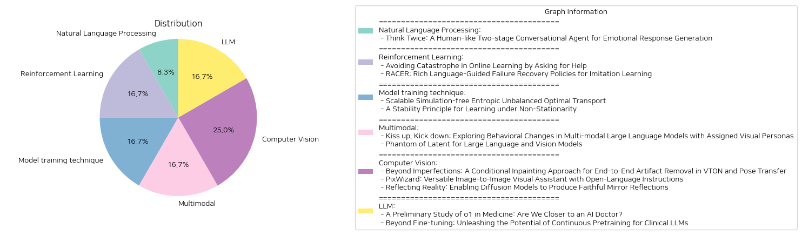

# Daily Artificial Intelligence Insights : Papers

## 🧸 Natural Language Processing

**요약:**

보고서 요약:

1. 주요 주제 및 테마:
   - 인간과 유사한 감정 기반 대화 시스템 개발
   - 감정과 의미를 통합적으로 모델링하기 위한 접근 방안
   - 감정 주석이 포함된 대화 말뭉치의 필요성 감소

2. 공통 키워드, 트렌드 및 패턴:
   - 인간과 유사한 대화
   - 감정과 의미의 통합
   - 두 단계 대화 모델
   - 컨텍스트 의미와 감정 조정

3. 주요 사건 및 핵심 정보:
   - 현재의 감정 대화 모델은 감정과 의미의 상호 제약으로 안전한 응답을 생성하는 경향이 있음
   - '두 번 생각하기' 행동에서 영감을 받아 두 단계 대화 에이전트 개발
   - 첫 번째 단계에서는 감정 주석이 없는 말뭉치로 훈련된 대화 모델이 맥락적 의미를 충족하는 원형 응답 생성
   - 두 번째 단계에서는 공감 가설이 적용된 감정 조정기가 첫 번째 원형 응답을 변경
   - DailyDialog와 EmpatheticDialogues 데이터세트를 기반으로 한 실험 결과, 제안된 대화 모델이 감정 생성에서 우수한 성능을 보임

4. 이러한 사건이 여러 부문에 미치는 영향:
   - 인간과 유사한 감정 대화 시스템은 사용자 경험을 개선하고, 더 자연스러운 상호작용을 제공할 수 있음
   - 감정 주석이 포함된 데이터의 필요성이 감소하면, 더 적은 리소스로 고성능 대화 에이전트를 개발 가능

5. 결론 및 미래 발전 관측:
   - 두 단계 대화 모델은 감정 생성과 의미 유지에서 유망한 결과를 보이며, 감정 기반 대화 시스템 개발의 중요한 진전
   - 향후 더 다양한 데이터세트를 통해 모델의 강건성을 검증하고, 더 다양한 언어 및 문화적 맥락에 적용 가능성 탐색 필요
   - 공감 및 감정적 인식을 더 강화한 대화 시스템의 발전을 통해 더욱 인간적인 대화 모델이 기대됨

이 보고서는 최종적으로 인간과 기계를 연결하는 더욱 자연스럽고 인간적인 대화 시스템의 개발을 위한 실행 가능한 접근 방식을 제안하고 있습니다.

**출처:**

 - Think Twice: A Human-like Two-stage Conversational Agent for Emotional Response Generation (https://deeplearn.org/arxiv/532279/think-twice:-a-human-like-two-stage-conversational-agent-for-emotional-response-generation)

## 🌿 Reinforcement Learning

**요약:**

### 종합 요약 보고서

#### 주요 주제와 테마
1. **온라인 학습에서 재앙 회피**:
   - 학습 알고리즘의 오류(특히, 재해와 같은 회복 불가능한 오류)를 최소화하는 방법.
   - 멘토에게 제한된 도움을 받아 재앙을 피할 수 있는 기회를 극대화하는 온라인 학습 문제 제안.

2. **모방 학습을 위한 언어 기반 오류 복구 정책 (RACER)**:
   - 로봇 조작에서 실패를 자가 회복하는 메커니즘 부족 및 단순한 언어 지침의 한계 문제 해결.
   - 전문 지침과 실패 회복 궤적을 사용하는 데이터 생성 파이프라인 제안.
   - 비전-언어 모델과 언어 조건화된 시각-운동 정책을 결합한 프레임워크 소개.

#### 공통 키워드, 경향, 패턴
- 학습과 복구: 학습 알고리즘과 복구 메커니즘에서 발생하는 오류 예방 및 해결.
- 언어 활용: 언어 지침을 통한 문제 해결 및 과제 수행 향상.
- 알고리즘 개선: 반사 오류를 줄이기 위한 프로세스 강화.

#### 주요 사건 및 중요한 정보
- **온라인 학습**: 비극적 오류를 피하는 기회를 늘리기 위한 알고리즘 개발. 특정한 멘토의 도움으로 학습 과정 향상.
- **RACER**: 로봇 조작의 오류 회복을 위한 향상된 언어 기반 접근 방식. 실험 결과, 기존의 로봇학습 모델보다 우수한 성능을 발휘함.

#### 이러한 사건의 영향 분석
- **교육 부문**: 멘토와의 상호작용을 통한 학습 과정 최적화와 안정성 향상.
- **로봇 공학 및 인공지능**: 향상된 로봇 자율성과 복잡한 작업 수행 능력 증대.
- **산업 적용 가능성**: 실세계 시뮬레이션을 통해 새로운 기술의 실제 환경 적용 가능성 확인.

#### 결론 및 향후 발전 전망
이 논문들은 온라인 학습 및 로봇 조작에서의 오류 예방과 해결을 위한 혁신적인 방법론을 제안함으로써, 교육 및 로봇 산업에서의 새로운 가능성을 보여줍니다. 향후 개발 방향으로는 다음이 포함됩니다:
- 다양한 환경에서의 알고리즘 적용 연구.
- 언어 기반 모델의 더욱 세분화된 제어 가능성 탐색.
- 인공지능의 실세계 적용에서의 성능 안정성 증대.

이러한 발전은 학습 효율성을 극대화하고 실세계에서의 AI 적용을 주도할 수 있는 잠재력을 가지고 있습니다.

**출처:**

 - Avoiding Catastrophe in Online Learning by Asking for Help (https://deeplearn.org/arxiv/533114/avoiding-catastrophe-in-online-learning-by-asking-for-help)
 - RACER: Rich Language-Guided Failure Recovery Policies for Imitation Learning (http://arxiv.org/abs/2409.14674v1)

## ☀️ Model training technique

**요약:**

보고서 요약:

1. 주요 주제 및 테마 추출:
   - 두 논문의 주제를 바탕으로 추출된 주요 테마는 "최적 운송 문제", "무질서 최적 운송", "비정상 환경에서의 학습", 및 "안정성 원칙" 등으로 다양합니다.

2. 공통 키워드, 트렌드, 패턴 식별:
   - 두 논문 모두 머신러닝 분야에서의 최적화 문제를 다루고 있으며, 비정상 조건 하에서 효과적인 학습 및 최적화 방법론을 연구하고 있습니다. "무질서", "최적 운송", "안정성", "적응성" 등이 공통된 키워드로 나타나며, 새로운 알고리즘 또는 프레임워크를 제안하여 기존 방법들의 한계를 극복하려는 패턴이 관찰됩니다.

3. 주요 사건 및 중요 정보 요약:
   - 첫 번째 논문에서는 "시뮬레이션 없는 무질서 최적 운송" 방법을 제안하며, 이는 중요한 촉매역할을 하는 균형 유지의 중요성을 논의했습니다. 기존의 슈뢰딩거 브릿지(SB) 문제점을 일반화하여 EUOT 문제를 해결하는 알고리즘을 제안하고, 시뮬레이션 비용을 현저히 줄이는 방법을 개발했습니다.
   - 두 번째 논문에서는 "비정상적 환경 하에서의 학습용 안정성 원칙"을 개발했습니다. 과거 데이터 활용을 극대화하면서도 오차와 편견을 관리하는 새로운 안정성 원칙을 제안했고, 비정상 데이터 세트를 준정상적 조각으로 나누는 분할 기법과 유사성 측정 방법을 제시했습니다.

4. 이러한 사건들의 다양한 분야에 미치는 영향 분석:
   - 이러한 연구는 머신러닝 관련 산업 전반에 걸쳐 새로운 모델 개발 과정에서의 비용 절감과 학습의 적응력 향상에 큰 기여를 할 것이라고 예상됩니다. 비정상적인 환경에서도 강력한 성능을 발휘할 수 있는 알고리즘의 발전은 금융, 의료, 이미지 처리 등 다양한 분야에서 활용될 가능성이 높습니다.

5. 최종 통합 요약 및 결론 및 주목할 미래 발전 가능성:
   - 두 논문은 각기 다른 관점에서 머신러닝 최적화 문제를 다루면서도 대신할 수 없는 새로운 방법들을 제시하며, 더 효율적이고 적응력 있는 솔루션을 향한 중요한 발걸음을 내디뎠습니다. 미래에는 이러한 기법의 실제 적용 가능성 및 범위가 확대되며, 특히 비정상적 조건을 다룰 수 있는 더욱 강력한 머신러닝 모델 개발이 추진될 것으로 보입니다. 이러한 발전은 데이터 기반 의사 결정의 혁신을 촉진할 수 있을 것입니다.

**출처:**

 - Scalable Simulation-free Entropic Unbalanced Optimal Transport (https://deeplearn.org/arxiv/532714/scalable-simulation-free-entropic-unbalanced-optimal-transport)
 - A Stability Principle for Learning under Non-Stationarity (https://deeplearn.org/arxiv/534502/a-stability-principle-for-learning-under-non-stationarity)

## 🌅 Multimodal

**요약:**

보고서 요약:

1. 주요 주제 및 테마 추출:
   - 첫 번째 논문은 다중 모달 대규모 언어 모델(LLM)이 시각적 페르소나와 어떻게 행동을 일치시킬 수 있는지를 탐구하며, 텍스트 기반 페르소나에 초점을 맞춘 기존 문헌의 공백을 메우고자 시도합니다. 시각적 페르소나로 LLM에 할당된 5천 개의 가상 아바타 이미지 데이터셋을 개발하고, 이미지의 시각적 특성을 기반으로 한 협상 행동을 분석했습니다.
   - 두 번째 논문은 효율적인 대규모 언어 및 비전 모델(LLVM)에 대한 발전을 가속화시키는 시각적 지침 튜닝의 성공을 다루며, '팬텀'이라는 효율적인 모델 군을 소개합니다. 팬텀 모델은 자원 소모를 줄이면서도 성능 유지와 학습 능력의 극대화를 목표로 합니다.

2. 공통 키워드, 트렌드, 패턴 식별:
   - 두 논문 모두 대규모 모델, 효율성, 학습 능력의 향상, 시각적 요소의 통합이라는 공통 주제를 다루며, 모델의 성능과 인공지능의 행동 변화에 관한 연구를 진행합니다.

3. 주요 사건 및 중요 정보 요약:
   - 첫 번째 논문은 시각적 페르소나에 따라 LLM의 협상 행동이 변화하며, 특히 공격적 이미지를 보면 LLM도 더욱 공격적인 협상 행동을 보인다는 결과를 도출합니다.
   - 두 번째 논문에서는 제한된 자원 내에서도 높은 성능을 유지할 수 있는 팬텀 모델이 보다 큰 오픈 및 폐쇄 소스 LLVM보다 우수하다는 연구 결과를 제시합니다.

4. 이벤트의 여러 부문에 대한 영향 분석:
   - 시각적 페르소나에 따른 행동 변화 연구는 인간 컴퓨터 상호작용의 새로운 가능성을 제시하며, LLM의 적용 분야를 확장할 수 있는 잠재력을 보입니다.
   - 팬텀 모델의 개발은 자원 효율성을 강조하며 실제 어플리케이션에서의 비용 절감과 성능 최적화에 기여할 것으로 보입니다.

5. 종합 요약 및 결론:
   - 이 두 논문은 기술적 진보와 학습 접근 방식의 변화를 통해 LLM 및 LLVM의 효율성과 성능 향상을 위한 새로운 방법을 제시하고 있습니다. 향후 연구에서는 이러한 기술의 실질적 적용과 인공지능 행동의 윤리적 측면에 대한 검토가 필요할 것입니다. 시각적 요소 통합과 효율적인 모델 개발은 인공지능 분야에서의 지속적인 주요 트렌드가 될 것입니다.

**출처:**

 - Kiss up, Kick down: Exploring Behavioral Changes in Multi-modal Large Language Models with Assigned Visual Personas (https://deeplearn.org/arxiv/533364/kiss-up,-kick-down:-exploring-behavioral-changes-in-multi-modal-large-language-models-with-assigned-visual-personas)
 - Phantom of Latent for Large Language and Vision Models (http://arxiv.org/abs/2409.14713v1)

## 🩵 Computer Vision

**요약:**

보고서 요약:

1. **핵심 주제 및 테마 추출:**
   - 논문 'Beyond Imperfections'에서는 가상 착의(VTON)와 포즈 전환 애플리케이션에서 발생하는 아티팩트를 제거하기 위한 조건부 인페인팅 기법을 소개합니다.
   - 'PixWizard'는 다양한 이미지 생성, 변형, 번역 기능을 제공하는 이미지 간 시각 보조 장치로 자유로운 언어 지시를 기반으로 작동합니다.
   - 'Reflecting Reality'는 멋진 거울 반사를 생성하기 위해 확산 기반 생성 모델을 적용한 연구입니다.

2. **공통 키워드, 트렌드, 패턴:**
   - 세 논문 모두 인공지능 기술을 활용하여 시각적 품질을 개선함에 중점을 두고 있으며, 이미지 처리 및 생성의 정확성과 현실감을 향상시키고자 합니다.
   - '인페인팅', '확산 모델', '데이터세트' 등과 같은 용어들이 자주 언급되었습니다.

3. **주요 이벤트 및 핵심 정보 요약:**
   - 첫 번째 논문에서는 VTON 및 포즈 전환의 아티팩트를 제거하는 새로운 데이터세트를 개발하고, 이미지의 시각적 품질을 높이는 기술적 진전을 이루었습니다.
   - 두 번째 논문에서는 다양한 비전 태스크를 아우르는 통합 이미지-텍스트-이미지 생성 프레임워크를 제안하며, 자연어 지시를 통해 이미지 생성의 유연성을 강조했습니다.
   - 세 번째 논문은 거울 반사를 사실감 있게 재현하기 위해 SynMirror라는 데이터세트를 이용하여, 거울 반사 생성의 새로운 기준을 설정했습니다.

4. **이벤트의 영향 분석:**
   - 이러한 기술들은 컴퓨터 비전과 이미지 처리 분야의 새로운 기준을 세우며, 실질적인 이미지 편집 및 증강 현실 애플리케이션의 발전에 기여할 것입니다.
   - 사용자 경험의 향상을 통한 다양한 산업 분야, 특히 전자상거래, 엔터테인먼트, 교육, 디자인 등에서의 활용 가능성이 높습니다.

5. **최종 종합 요약 및 미래 전개 전망:**
   - 논문들은 이미지 처리 개선을 위한 다양한 접근 방식을 제시하며, 이는 향후 컴퓨터 비전 기술의 발전에 크게 기여할 것입니다.
   - 인공지능 기반의 이미지 생성 및 편집 기술은 계속해서 진화하여, 더욱 복잡한 작업을 다루고, 다양한 사용자 요구사항을 충족할 것으로 기대됩니다. 특히 현실적이고 정밀한 비전 애플리케이션을 위한 기초 자료로서, 이러한 연구들은 중요한 역할을 할 것입니다. 앞으로 인공지능의 이미지 처리 능력이 보다 다층적이고 정교해질 것으로 예상됩니다.

**출처:**

 - Beyond Imperfections: A Conditional Inpainting Approach for End-to-End Artifact Removal in VTON and Pose Transfer (https://deeplearn.org/arxiv/534386/beyond-imperfections:-a-conditional-inpainting-approach-for-end-to-end-artifact-removal-in-vton-and-pose-transfer)
 - PixWizard: Versatile Image-to-Image Visual Assistant with Open-Language Instructions (http://arxiv.org/abs/2409.15278v2)
 - Reflecting Reality: Enabling Diffusion Models to Produce Faithful Mirror Reflections (http://arxiv.org/abs/2409.14677v1)

## 🤩 LLM

**요약:**

요약 보고서:

1. 주요 주제와 테마 추출:
   - 첫 번째 논문은 OpenAI의 최신 대형 언어 모델(o1)이 의학 분야에서의 적용 가능성을 탐구하며, 주로 이해력, 추론 능력, 다국어 지원 측면에서 성능을 평가합니다.
   - 두 번째 논문은 의학 분야의 대형 언어 모델의 지속적 사전 훈련 및 테크닉 최적화를 통해 임상 애플리케이션을 개선하는 방법을 연구합니다.

2. 공통 키워드, 경향 및 패턴 식별:
   - AI와 의학의 접목, 대형 언어 모델(LLM)의 중요성, 지속적 사전 훈련, Fine-tuning, 모델 최적화를 위한 다양한 전략.
   - 각각의 논문에서 LLM의 이해 및 추론 능력과 같은 고급 적용 가능성이 중심 주제임.

3. 주요 사건과 정보 요약:
   - 첫 번째 논문은 o1 모델이 의학 분야의 다양한 시나리오에서 강력한 이해력과 추론 능력을 보이며, 기존의 GPT-4를 정확도 면에서 뛰어넘었다고 평가합니다. 그러나 다국어 지원 능력과 평가 프로토콜의 결점도 발견되었습니다.
   - 두 번째 논문은 LLM의 임상 적용을 위해 4가지 기술(지속적 사전 훈련, 지시 Fine-tuning, NEFTune, 프롬프트 엔지니어링)의 효과를 조사하고, 이들이 임상 작업에서 각기 다른 효과를 보였음을 밝힙니다. 특히 NEFTune은 예기치 않은 성과를 보여줬습니다.

4. 이러한 이벤트의 다양한 부문에 대한 영향 분석:
   - 의료 부문에서 AI가 더 정교한 진단 및 치료 계획을 제공할 가능성이 높아짐. 동시에, 모델의 정확성 및 일관성을 보장하기 위한 추가 연구가 요구됩니다.
   - 지속적 사전 훈련 및 새로운 fine-tuning 전략들은 의학 LLM에서 더 높은 성능과 맞춤형 애플리케이션을 가능하게 함.

5. 최종 통합된 요약과 결론 및 향후 발전:
   - 현재 LLM은 의학 분야의 특정 작업에서 유망한 성과를 보여, 떠오르는 AI 기술과 의학의 접목 가능성을 높이고 있습니다. 그러나 모델의 일관성, 다국어 지원, 평가 기준 등의 부분에서 해결해야 할 과제들이 남아 있습니다.
   - 미래에는 LLM의 능력 향상을 위한 지속적 연구와 더 나은 데이터 세트, 최적화된 평가 프로토콜 등의 발전이 예상됩니다. 이러한 발전은 AI 기반 의료 진단과 환자 관리의 새로운 패러다임으로 자리잡을 가능성이 큽니다.

**출처:**

 - A Preliminary Study of o1 in Medicine: Are We Closer to an AI Doctor? (http://arxiv.org/abs/2409.15277v1)
 - Beyond Fine-tuning: Unleashing the Potential of Continuous Pretraining for Clinical LLMs (http://arxiv.org/abs/2409.14988v1)

