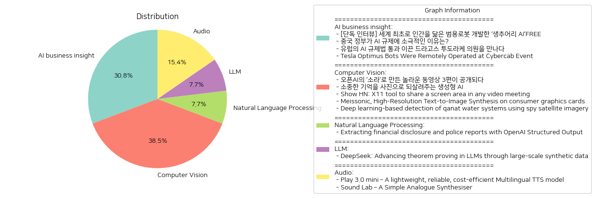

# Daily Artificial Intelligence Insights : News

## 🪐 AI business insight

**요약:**

**주요 주제들**:
1. 인공지능(AI) 개발 및 규제 - AI 기술의 발전과 그에 따른 규제의 필요성이 주요 주제로 다뤄지고 있으며, 세계 각국의 AI 개발 동향 및 규제 정책이 논의되고 있다.
2. 범용 로봇 개발 - 인간과 비슷한 범용 로봇의 개발에 대한 연구 및 발전이 화제가 되고 있다.
3. 글로벌 정책 차이 - 국가별로 AI 기술과 관련한 규제 접근 방식의 차이점을 분석하고 있다.

**주요 사건들**:
1. 생추어리 AI의 조르디 로즈 CEO 인터뷰 - 캐나다의 AI 로봇 전문기업 생추어리 AI가 인간을 닮은 범용 로봇 개발을 추구하고 있으며, 그 노력과 방향성이 소개되었다.
2. 중국 정부의 AI 규제 정책 - 중국은 소비자 기술에는 강경하지만 AI 규제에는 자국 산업 발전을 위해 여유로운 태도를 취하고 있다는 점이 강조되었다.
3. 유럽의 AI 규제법 통과 - 드라고스 투도라케 의원이 중심이 되어 유럽 의회에서 AI 규제법의 통과를 이끌어내었으며, 이는 AI 산업의 개선을 목표로 하고 있다.
4. 테슬라의 옵티머스 로봇 시연 - 테슬라는 캘리포니아 인근에서 열린 행사에서 옵티머스 로봇 프로토타입을 원격 조작하여 시연하였다.

**영향 분석**:
1. **경제적 영향**: AI 개발 및 범용 로봇 기술이 경제에 미치는 긍정적 효과와 산업 발전 가능성이 크다. 각국의 규제는 이들 기술의 산업적 확장을 좌우할 수 있다.
2. **정치적 영향**: AI 규제는 국가별 기술 정책의 차이로 그 중요성이 커지고 있으며, 이는 글로벌 기술 경쟁과 국가 간 정책 협력에 영향을 줄 수 있다.
3. **사회적 영향**: AI와 로봇 기술은 일상 생활에 대한 변화를 가져올 가능성이 있으며, 그에 따른 사회적 논의 및 정책적 준비가 필요하다.

**최종 요약**:
전 세계에서 AI와 로봇 기술은 혁신적 발전을 이루고 있으며, 이러한 기술의 발전은 각국의 규제 정책에 의해 다르게 영향을 받고 있다. 생추어리 AI의 범용 로봇 개발은 인간과 로봇의 조화로운 공존을 추구하는 방향으로 볼 수 있으며, 중국과 유럽의 서로 다른 규제 접근은 AI 기술의 글로벌 확산에 중요한 변수가 되고 있다. 향후 AI와 로봇 기술은 지속적인 발전과 규제의 균형 속에 산업과 사회 전반에 큰 변화를 불러일으킬 것으로 예상된다. 이러한 동향을 지속적으로 모니터링하여 미래의 기술 발전 방향성을 평가하는 것이 중요하다.

**출처:**

 - [단독 인터뷰] 세계 최초로 인간을 닮은 범용로봇 개발한 ‘생추어리 AI’FREE (https://www.technologyreview.kr/%ec%9d%b8%ed%84%b0%eb%b7%b0-%ec%83%9d%ec%b6%94%ec%96%b4%eb%a6%ac-ai%ea%b0%80-%ea%b7%b8%eb%a6%ac%eb%8a%94-%eb%af%b8%eb%9e%98%ec%9d%98-%eb%a1%9c%eb%b4%87%ec%9d%80-%ec%8b%a4%ec%b2%b4%ed%99%94/)
 - 중국 정부가 AI 규제에 소극적인 이유는? (https://www.technologyreview.kr/%ec%a4%91%ea%b5%ad-%ec%a0%95%eb%b6%80%ea%b0%80-%ed%98%84%ec%9e%ac%eb%a1%9c%ec%84%9c%eb%8a%94-ai-%eb%b6%84%ec%95%bc%eb%a5%bc-%ea%b0%80%ed%98%b9%ed%95%98%ea%b2%8c-%ea%b7%9c%ec%a0%9c%ed%95%98%ec%a7%80/)
 - 유럽의 AI 규제법 통과 이끈 드라고스 투도라케 의원을 만나다 (https://www.technologyreview.kr/ai-%ea%b7%9c%ec%a0%9c%eb%b2%95-%ed%86%b5%ea%b3%bc-%ec%9d%b4%eb%81%88-%eb%93%9c%eb%9d%bc%ea%b3%a0%ec%8a%a4-%ed%88%ac%eb%8f%84%eb%9d%bc%ec%bc%80-%ec%9d%98%ec%9b%90%ec%9d%84-%eb%a7%8c%eb%82%98%eb%8b%a4/)
 - Tesla Optimus Bots Were Remotely Operated at Cybercab Event (https://www.bloomberg.com/news/articles/2024-10-14/tesla-s-optimus-robots-were-remotely-operated-at-cybercab-event)

## 🪐 Computer Vision

**요약:**

1. **주요 주제**:
   모든 뉴스 기사에서 주요 주제로는 생성형 AI 기술의 발전, 영상 및 이미지 생성과 관련된 혁신, 그리고 새로운 소프트웨어 및 도구의 개발이 있습니다. 특히 생성형 AI 기술을 이용한 기억 재생 및 이미지 생성의 혁신적 시도와 고해상도 텍스트-이미지 변환 모델의 중요성이 두드러집니다.

2. **주요 사건**:
   - 오픈AI는 새로운 동영상 생성 모델 소라를 통해 영상 크리에이터들이 제작한 세 편의 영상을 공개하였습니다. 새로운 콘텐츠 제작 방법론과 혁신적인 제작 기법을 소개하였습니다.
   - 생성형 AI를 사용하여 기억을 사진으로 전환해주는 '합성 기억' 프로젝트가 추진되고 있으며, 이는 전 세계 가족들이 잃어버린 과거의 기억을 사진으로 되살릴 수 있도록 돕고 있습니다.
   - Clipscreen이라는 새로운 X11 도구가 화면의 특정 부분을 집중적으로 공유할 수 있는 기능을 제공하며, 이는 비디오 회의에서 특정 윈도우를 공유할 때 유용합니다.
   - Meissonic이라는 고해상도 텍스트-이미지 변환 모델이 기존 모델의 성능을 능가하며 소비자 그래픽 카드에서도 우수한 효율성을 보이고 있습니다.

3. **영향 분석**:
   - **경제**: AI 기술의 발전은 창작 산업을 포함한 다양한 분야의 경제 활동에 긍정적인 영향을 미치며, 새로운 콘텐츠 및 서비스 개발에 기여할 것입니다.
   - **사회**: '합성 기억' 프로젝트는 개인의 삶 속에서 잃어버린 추억을 되살릴 수 있게 하여 개인의 정서적 건강에도 긍정적인 영향을 미칠 것입니다.
   - **기술 및 혁신**: Meissonic과 같은 기술적 발전은 보다 효율적이고 질 높은 이미지 생성 가능성을 제공하며, 다양한 산업에서 활용될 수 있을 것입니다.

4. **최종 요약**:
   이번 뉴스 기사에서는 생성형 AI 기술의 급진적 발전이 주요한 트렌드임을 보여주고 있으며, 이는 영상 및 이미지 제작 분야뿐만 아니라 개인의 기억 복원에도 적용되고 있습니다. 또한, 고해상도 텍스트-이미지 모델의 발전은 기존 기술의 한계를 넘어서고 있으며, 추후 다양한 산업에 걸쳐 기술의 응용이 확대될 가능성이 큽니다. 이러한 발전을 통해 AI의 사회적·경제적 영향력이 더욱 강화될 것으로 예상되며, 미래의 발전을 주의 깊게 지켜볼 필요가 있습니다.

**출처:**

 - 오픈AI의 ‘소라’로 만든 놀라운 동영상 3편이 공개되다 (https://www.technologyreview.kr/%ec%98%81%ec%83%81-%ec%83%9d%ec%84%b1-%eb%aa%a8%eb%8d%b8-%ec%86%8c%eb%9d%bc%eb%a1%9c-%eb%a7%8c%eb%93%a0-%eb%86%80%eb%9d%bc%ec%9a%b4-%ec%98%81%ed%99%94-3%ed%8e%b8%ec%9d%b4-%ea%b3%b5%ea%b0%9c%eb%90%98/)
 - 소중한 기억을 사진으로 되살려주는 생성형 AI (https://www.technologyreview.kr/%ec%83%9d%ec%84%b1%ed%98%95-ai%eb%a1%9c-%ea%b0%80%ec%9e%a5-%ec%86%8c%ec%a4%91%ed%95%9c-%ea%b8%b0%ec%96%b5%ec%9d%84-%ec%82%ac%ec%a7%84%ec%9c%bc%eb%a1%9c-%eb%a7%8c%eb%93%a0%eb%8b%a4/)
 - Show HN: X11 tool to share a screen area in any video meeting (https://github.com/splitbrain/clipscreen)
 - Meissonic, High-Resolution Text-to-Image Synthesis on consumer graphics cards (https://arxiv.org/abs/2410.08261)
 - Deep learning-based detection of qanat water systems using spy satellite imagery (https://www.sciencedirect.com/science/article/pii/S0305440324001213)

## 🍊 Natural Language Processing

**요약:**

### 종합 요약 보고서

1. **주요 주제**:
   - 금융 공개 및 경찰 보고서에 대한 데이터 추출이 주요 주제로 등장합니다. 이는 특히 OpenAI의 구조화된 출력 기능을 활용하여 정보 수집 및 분석을 향상시키려는 시도와 관련이 있습니다.

2. **주요 이벤트**:
   - 금융 공개 및 경찰 보고서의 데이터를 효율적으로 추출하기 위한 OpenAI의 새로운 기능이 출시되었습니다. 이는 금융 및 법 집행 분야의 정확한 정보 수집과 신속한 분석을 가능하게 하는 의미 있는 발전으로 평가됩니다.

3. **영향 분석**:
   - **경제:** 금융 보고서의 효율적인 분석은 투자자와 기업이 빠르고 정확한 결정을 내리는 데 도움을 주어 시장의 변동성을 줄일 수 있습니다.
   - **사회:** 경찰 보고서의 데이터 추출은 법 집행 기관의 효율성을 높이고, 범죄 트렌드를 파악하여 사전 대처 전략을 강화하는 데 기여할 수 있습니다.
   - **정치:** 정부 및 정책 입안자들에게 정확한 데이터 기반의 정보를 제공함으로써 투명성과 책임성 강화에 기여할 수 있습니다.

4. **최종 요약**:
   - OpenAI의 새로운 구조화 출력 기능은 금융 및 법 집행 분야의 데이터를 더 쉽게 접근하고 활용할 수 있게 하여 관련 기관과 사회 전반에 걸쳐 긍정적인 영향을 미칠 것으로 기대됩니다. 특히, 데이터 정확성과 분석 속도 향상은 효율성 증대와 더불어 정보 투명성을 향상시킬 수 있는 중요한 발전으로 주목받고 있습니다. 앞으로 이러한 기술이 더욱 발전함에 따라 더 많은 분야에서 데이터 활용이 최적화될 가능성을 엿볼 수 있습니다. 이러한 동향을 지속적으로 주목할 필요가 있습니다.

**출처:**

 - Extracting financial disclosure and police reports with OpenAI Structured Output (https://gist.github.com/dannguyen/faaa56cebf30ad51108a9fe4f8db36d8)

## 🥳 LLM

**요약:**

1. **주요 주제**:
   - 대규모 합성 데이터의 활용
   - 대형 언어 모델(LLM)의 발전
   - 형식 정리를 위한 자동화 및 정리 증명 기술

2. **주요 사건**:
   - 'DeepSeek'라는 연구팀이 대규모 합성 데이터셋을 활용하여 Lean 4 증명 문장을 작성하고, 이를 통해 공식 정리 증명에서 대형 언어 모델을 향상시킴.
   - 연구팀의 모델이 GPT-4와 나무 탐색 방법을 초과하는 증명 생성 정확도를 달성.
   - FIMO 벤치마크 문제 148개 중 5개 증명에 성공.

3. **영향 분석**:
   - **경제**: 대형 언어 모델의 발전은 기술산업의 혁신과 더불어, 새로운 형태의 자동화된 프로젝트에 영향을 미쳐 관련 산업 발전에 긍정적인 영향을 미칠 수 있음.
   - **기술**: 합성 데이터를 통한 대규모 모델 학습이 기술 발전에 더욱 중요한 역할을 하게 되며, 이는 보다 정교한 데이터 및 모델링 기법의 필요성을 촉진할 것임.
   - **사회**: 복잡한 수학 문제와 과학 기술 문제 해결에 새로운 길을 제시함으로써 교육 및 연구의 방향성을 변화시킬 수 있는 가능성을 보임.

4. **최종 요약**:
   전체적으로 대규모 합성 데이터를 활용한 연구가 대형 언어 모델의 정확성과 효율성을 높이는 데 성공한 사례임. 특히 복잡한 문제 해법에서 인공지능이 더욱 큰 역할을 할 수 있는 가능성을 보임. 향후 이러한 기술발전은 자동화된 문제해결이 다양한 학문분야와 산업분야에 긍정적인 영향을 미칠 것으로 전망되며, 이러한 방향성에 기반한 혁신의 잠재력을 주의 깊게 살펴볼 필요가 있음.

**출처:**

 - DeepSeek: Advancing theorem proving in LLMs through large-scale synthetic data (https://arxiv.org/abs/2405.14333)

## 🎉 Audio

**요약:**

**요약 보고서**

1. **주요 테마**:
   - 이 뉴스 기사들의 주요 테마는 기술 혁신과 제품 개발입니다. 두 기사 모두 새로운 기술 제품의 출시와 관련된 내용을 다루고 있으며, 각자의 독특하고 다양한 기능을 강조하고 있습니다.

2. **주요 사건**:
   - 'Play 3.0 mini': 다국어 TTS 모델 'Play 3.0 mini'가 출시되었습니다. 이 모델은 30개 이상의 언어를 지원하며, 실시간 애플리케이션을 위한 고품질의 자연스러운 음성을 제공합니다. 이는 텍스트 입력 스트리밍과 HTTP REST API나 SDK를 통한 오디오 출력 스트리밍을 지원합니다.
   - 'Sound Lab': 아날로그 신디사이저인 'Sound Lab'이 소개되었습니다. 이 모델은 다양한 사운드를 만드는 데 사용할 수 있는 여섯 개의 모듈을 포함하고 있으며, 158 x 96 x 27mm 크기이며, 9V 전원 어댑터나 9V PP3 배터리로 전원을 공급받을 수 있습니다.

3. **영향 분석**:
   - 기술 산업: 이 두 제품은 기술 분야에서의 혁신적인 발전을 보여줍니다. 'Play 3.0 mini'는 다국어를 실시간으로 처리할 수 있는 기능을 제공하여 글로벌 커뮤니케이션과 AI 기반 서비스에 중요한 역할을 할 수 있습니다. 'Sound Lab'은 크리에이티브 음악 산업에 있어 아날로그 사운드의 다양성을 확대하며, 전문가와 아마추어 뮤지션들에게 새로운 창작의 기회를 제공합니다.
   - 사회적 영향: 이러한 기술 발전은 사용자의 장벽을 낮추고 사용자 경험을 개선시키는 방향으로 발전하고 있습니다. 특히, 다국어 지원 기능은 문화적 다각성의 확대에 기여할 수 있습니다.

4. **최종 요약**:
   - 이 기사들은 현재 기술 혁신이 어떻게 다양한 분야에 걸쳐 이루어지고 있는지를 보여줍니다. 특히, 음성 처리 기술과 아날로그 사운드의 발전이 주목할 만한 변화로 보입니다. 기술 시장은 계속해서 다국어 지원 및 창의적 도구 개발에 집중할 가능성이 높으며, 이러한 발전은 글로벌 커뮤니케이션을 촉진하고, 문화적 경계를 허무는 데 기여할 것입니다. 앞으로 이러한 기술들이 어떤 방식으로 우리 사회에 영향을 미칠지 계속 주목할 필요가 있습니다.

**출처:**

 - Play 3.0 mini – A lightweight, reliable, cost-efficient Multilingual TTS model (https://play.ht/news/introducing-play-3-0-mini/)
 - Sound Lab – A Simple Analogue Synthesiser (http://www.technoblogy.com/show?4MGW)

