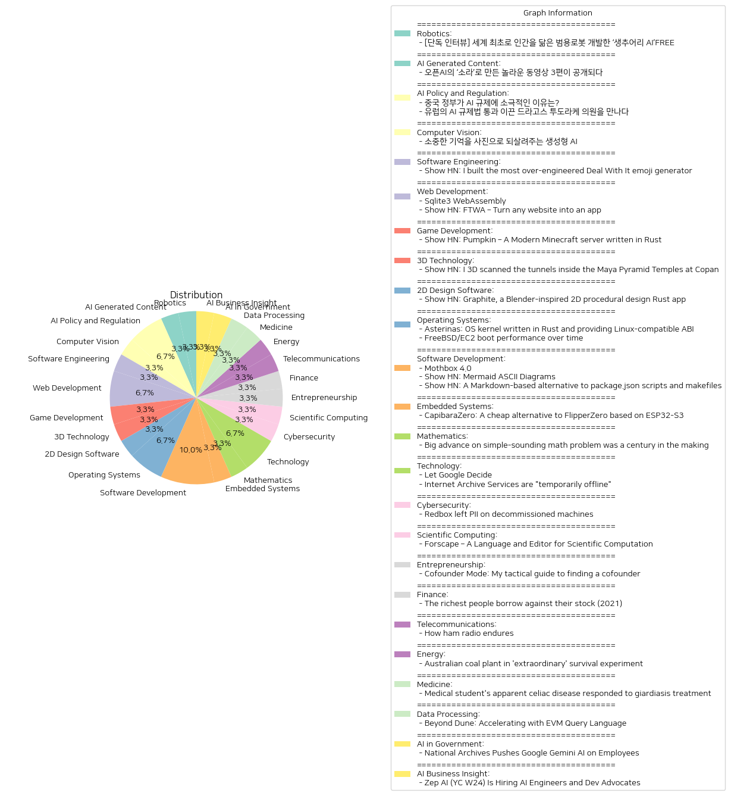

# Daily Artificial Intelligence Insights : News

## 🎈 Robotics

**요약:**

**종합 요약 보고서**

1. **주요 테마**:
   - 인공지능(AI)와 로봇 공학 발전
   - 인간과 유사한 특성을 지닌 범용 로봇 개발
   - 미래 기술에 관한 비전과 가능성

2. **주요 사건**:
   - 캐나다의 AI 로봇 전문기업인 생추어리 AI가 세계 최초로 인간을 닮은 범용 로봇을 개발.
   - CEO 조르디 로즈가 로봇이 일상 속 복잡한 상황에 유연하게 대응할 수 있는 기술 개발의 중요성을 강조하고, 미래의 로봇에 대한 견해를 인터뷰를 통해 공유.

3. **영향 분석**:
   - 경제: 범용 로봇의 발전은 다양한 산업 분야에서 생산성과 효율성을 극대화할 가능성이 있으며, 새로운 시장 기회를 창출할 수 있음.
   - 사회: 일상 생활 속에서 로봇의 사용 증가로 인해 사람들의 생활 방식이 변화할 수 있으며, 로봇과의 상호작용이 중요해질 전망.
   - 환경: 로봇 기술이 발전함에 따라 자원 사용 효율이 높아져 환경 보호에 기여할 수 있음.

4. **최종 요약**:
   생추어리 AI의 인간을 닮은 범용 로봇 개발은 AI와 로봇 공학 분야에서 중요한 전환점을 의미한다. 이러한 기술 혁신은 경제적, 사회적, 환경적 측면에서 광범위한 영향을 미칠 것으로 보인다. 앞으로 이러한 로봇이 실생활에 어떻게 적용되고, 어떤 추가적인 기술적 발전이 이루어질지 주목할 필요가 있다. 이는 앞으로의 기술 개발과 사회 구조 변화에 중요한 시사점을 제공할 것으로 예상된다.

**출처:**

 - [단독 인터뷰] 세계 최초로 인간을 닮은 범용로봇 개발한 ‘생추어리 AI’FREE (https://www.technologyreview.kr/%ec%9d%b8%ed%84%b0%eb%b7%b0-%ec%83%9d%ec%b6%94%ec%96%b4%eb%a6%ac-ai%ea%b0%80-%ea%b7%b8%eb%a6%ac%eb%8a%94-%eb%af%b8%eb%9e%98%ec%9d%98-%eb%a1%9c%eb%b4%87%ec%9d%80-%ec%8b%a4%ec%b2%b4%ed%99%94/)

## 💙 AI Generated Content

**요약:**

1. **주요 주제**:
   모든 기사에서 나타난 주요 주제는 인공지능 기술 혁신과 관련된 내용입니다. 특히, 생성 AI 모델인 오픈AI의 '소라'를 통한 콘텐츠 생성 및 그 활용이 중점을 이루고 있습니다. 또한, 이러한 신기술이 영상 크리에이터를 비롯한 다양한 창작 분야에 미치고 있는 영향이 주요 논점으로 등장하고 있습니다.

2. **주요 사건**:
   오픈AI는 2월 중순 새로운 동영상 생성 모델 '소라'를 공개하여 주목을 받았습니다. 최근에 오픈AI는 이 '소라'를 활용하여 제작된 3편의 동영상을 공개했습니다. 이 동영상들은 다양한 콘텐츠 제작자들에 의해 만들어졌으며, 이들은 제작 목적과 기법에 대해 설명했습니다.

3. **영향 분석**:
   - **경제**: '소라'와 같은 생성 AI 도구는 콘텐츠 제작 비용을 절감하고 생산성을 높여 동영상 제작 산업에 긍정적인 영향을 끼칠 수 있습니다. 또한, 새로운 AI 도구의 등장은 기술 스타트업 및 관련 기업의 성장을 촉진할 수 있습니다.
   - **정치**: AI 기술 발전이 법률 및 정책에 미칠 영향을 고려해야 합니다. AI의 윤리 문제, 개인정보 보호, 그리고 가짜 뉴스 생성 가능성에 대한 대응 방안 마련이 필요합니다.
   - **사회**: AI 기반 콘텐츠 생성은 사회 전반에 걸쳐 새로운 형태의 표현과 창작의 기회를 제공할 수 있습니다. 그러나, 창작자의 정체성이 AI로 대체되고 있지 않은지에 대한 논의가 예상됩니다.

4. **최종 요약**:
   이번 뉴스는 오픈AI의 '소라'가 새로운 AI 콘텐츠 생성 시대를 열었다는 점에서 중요합니다. 주요 비즈니스 및 기술 분야에서 AI의 활용 사례가 증가하고 있으며, 이는 경제에 긍정적 변화를 가져올 가능성을 제시합니다. 다만, AI 기술의 빠른 발전이 사회적, 정치적 측면에서 초래할 수 있는 도전과제를 주의 깊게 살펴볼 필요가 있습니다. 앞으로 AI와 인간 창작자의 상호작용과 관련된 사회적 논의 및 기술 발전에 대한 지속적인 관심이 요구됩니다.

**출처:**

 - 오픈AI의 ‘소라’로 만든 놀라운 동영상 3편이 공개되다 (https://www.technologyreview.kr/%ec%98%81%ec%83%81-%ec%83%9d%ec%84%b1-%eb%aa%a8%eb%8d%b8-%ec%86%8c%eb%9d%bc%eb%a1%9c-%eb%a7%8c%eb%93%a0-%eb%86%80%eb%9d%bc%ec%9a%b4-%ec%98%81%ed%99%94-3%ed%8e%b8%ec%9d%b4-%ea%b3%b5%ea%b0%9c%eb%90%98/)

## 🥳 AI Policy and Regulation

**요약:**

1. **주요 주제**:
   - 인공지능(AI) 규제 및 정책
   - 중국과 유럽의 규제 접근 방식 비교
   - 기술 발전과 정부의 규제 간의 균형

2. **주요 사건**:
   - 중국 정부는 AI 규제에서 비교적 자유로운 태도를 취하고 있으며, 이는 자국 AI 산업의 성장을 도모하기 위한 전략적인 결정으로 분석된다.
   - 유럽에서는 드라고스 투도라케 의원의 주도로 역사적인 AI 규제법이 유럽의회를 통해 통과되었다. 이 규제법은 AI 산업을 개선하고 소비자 보호를 강화하기 위한 목적을 가지고 있다.

3. **영향 분석**:
   - 경제: 중국의 느슨한 AI 규제는 AI 산업의 급속한 발전을 촉진시킬 수 있지만, 장기적으로는 기술적 책임과 윤리에 대한 논의가 필요할 수 있다. 유럽의 엄격한 규제는 기술 발전에 대한 강력한 견제책으로 작용하여 새로운 산업 표준을 만들어 낼 것으로 예상된다.
   - 정치: 국가별 규제 접근 방식의 차이는 국제적인 기술 경쟁 구도에서 각각의 정책적, 경제적 이익을 방어하기 위한 전략적 선택으로 볼 수 있다.
   - 사회: AI 기술의 잠재적인 오용에 대한 우려가 증가함에 따라, 규제는 사회적 윤리 기준을 높이고 책임성을 강화하는 역할을 할 것이다.

4. **최종 요약**:
   중국의 느슨한 규제와 유럽의 강력한 규제는 AI 발전과 관련하여 서로 다른 전략을 나타낸다. 중국은 산업 성장과 경쟁력 확보를 우선시 하고 있으며, 유럽은 소비자 보호와 기술 윤리를 중요시하고 있다. 이 두 접근 방식은 향후 글로벌 AI 산업의 발전 방향에 큰 영향을 미칠 것이다. 앞으로의 중요한 개발로는 중국의 규제 변화 여부, 유럽 규제법의 구체적 시행 효과, 그리고 이에 따른 글로벌 AI 정책 변화가 있을 것이다. AI 규제에 대한 논의는 각국의 경제 및 정치적 전략을 반영하면서도, 사회적 윤리 기준의 중요성을 지속적으로 강조할 것으로 보인다.

**출처:**

 - 중국 정부가 AI 규제에 소극적인 이유는? (https://www.technologyreview.kr/%ec%a4%91%ea%b5%ad-%ec%a0%95%eb%b6%80%ea%b0%80-%ed%98%84%ec%9e%ac%eb%a1%9c%ec%84%9c%eb%8a%94-ai-%eb%b6%84%ec%95%bc%eb%a5%bc-%ea%b0%80%ed%98%b9%ed%95%98%ea%b2%8c-%ea%b7%9c%ec%a0%9c%ed%95%98%ec%a7%80/)
 - 유럽의 AI 규제법 통과 이끈 드라고스 투도라케 의원을 만나다 (https://www.technologyreview.kr/ai-%ea%b7%9c%ec%a0%9c%eb%b2%95-%ed%86%b5%ea%b3%bc-%ec%9d%b4%eb%81%88-%eb%93%9c%eb%9d%bc%ea%b3%a0%ec%8a%a4-%ed%88%ac%eb%8f%84%eb%9d%bc%ec%bc%80-%ec%9d%98%ec%9b%90%ec%9d%84-%eb%a7%8c%eb%82%98%eb%8b%a4/)

## 🧸 Computer Vision

**요약:**

### 종합 요약 보고서

1. **주요 주제**:
   - 생성형 AI의 활용 및 발전
   - 합성 기억 프로젝트
   - 과거의 추억 복원

2. **주요 이벤트**:
   - 생성형 AI를 활용한 '합성 기억' 프로젝트 추진 중
   - 프로젝트의 목적은 전 세계 가족들이 카메라에 담지 못했던 과거의 소중한 추억을 이미지로 재현하여 다시 경험할 수 있도록 돕는 것

3. **영향 분석**:
   - **사회적 영향**: 합성 기억 프로젝트는 가족들이 잃어버린 과거의 추억을 재생산하는 데 도움을 주어, 정서적인 연결과 개인의 삶에 큰 영향을 미칠 수 있다. 이는 사람들 간의 연결을 강화하고, 과거의 경험을 재해석하는 새로운 문화를 조성할 수도 있다.
   - **기술적 영향**: 생성형 AI가 기억을 이미지로 전환하는 기술의 발전은 디지털 기술의 새로운 활용 방안을 제시하며, 향후 다양한 분야에서 AI 적용 가능성을 증대시킬 것이다.

4. **최종 요약**:
   - 이 보고서의 데이터는 생성형 AI 기술이 발전함에 따라 '합성 기억' 프로젝트 같은 혁신적인 활용 사례가 등장하고 있음을 보여준다. 이는 개인의 과거 경험을 재구성하는 데 기술이 기여할 수 있다는 점에서 큰 의미가 있으며, 사회적으로도 큰 감수성과 연결을 창출할 잠재력을 갖고 있다. 앞으로 이 기술이 더 발전하여 다양한 개인적, 상업적 용도로 확대될 가능성이 있으므로, 관련 동향을 주시할 필요가 있다.

**출처:**

 - 소중한 기억을 사진으로 되살려주는 생성형 AI (https://www.technologyreview.kr/%ec%83%9d%ec%84%b1%ed%98%95-ai%eb%a1%9c-%ea%b0%80%ec%9e%a5-%ec%86%8c%ec%a4%91%ed%95%9c-%ea%b8%b0%ec%96%b5%ec%9d%84-%ec%82%ac%ec%a7%84%ec%9c%bc%eb%a1%9c-%eb%a7%8c%eb%93%a0%eb%8b%a4/)

## 🐱 Software Engineering

**요약:**

1. **주요 주제**:
   - 이번 뉴스 기사의 주제는 '과잉 엔지니어링'과 '이모티콘 생성기'입니다. 기술을 활용하여 독창적이고 복잡한 방법으로 특정 기능(여기서는 'Deal With It' 이모티콘 생성)을 수행하는 프로젝트의 이야기입니다.

2. **주요 사건**:
   - 기사에서 다루고 있는 가장 중요한 사건은 매우 복잡하고 정교한 방법으로 'Deal With It' 이모티콘 생성기를 만든 개발자의 프로젝트 발표입니다. 이는 개인 개발자의 창의적 시도와 기술적 도전의 한 예로 볼 수 있습니다.

3. **영향 분석**:
   - 이와 같은 기술적 프로젝트는 창의성과 기술 발전의 예를 제시하며, 다른 개발자에게 영감을 줄 수 있습니다. 사회적으로는 유머러스하고 경쾌한 콘텐츠가 온라인에서의 사회적 상호작용에 긍정적인 영향을 미칠 수 있습니다. 경제적 영향은 직접적이지 않으나, 기술적 접근 방식의 다양화에 대한 인식을 높이는 계기가 될 수 있습니다.

4. **최종 요약**:
   - 전체적으로 이번 뉴스는 기술 및 창의적인 시도가 개인 프로젝트를 통해 어떻게 구현될 수 있는지 보여주는 사례입니다. 이러한 과잉 엔지니어링 프로젝트는 기술 커뮤니티 내부에서 특히 주목받을 수 있으며, 비슷한 프로젝트에 대한 영감을 주어 다양한 창의적 도전의 출발점이 될 수 있습니다. 앞으로도 이런 혁신적인 접근 방식을 통해 기술 커뮤니티가 어떻게 발전하는지 관찰할 필요가 있습니다.

**출처:**

 - Show HN: I built the most over-engineered Deal With It emoji generator (https://emoji.build/deal-with-it-generator/)

## 🌞 Web Development

**요약:**

**주요 테마:**

1. 웹 기술 향상: 두 기사 모두 웹 기술의 향상에 관한 내용을 다루고 있습니다. SQLite의 WebAssembly 및 JavaScript API의 등장과 웹사이트를 앱으로 변환하는 기술은 모두 웹 상호작용의 새로운 가능성을 열어주고 있습니다.

2. 사용자 경험 개선: 사용자들이 더욱 유연하고 효율적으로 웹 콘텐츠를 접근하고 사용할 수 있도록 돕는 기술적 발전이 강조되고 있습니다. API의 안정성과 앱 변환 기능은 사용자 경험을 직접적으로 향상시키고자 합니다.

**주요 사건:**

1. **SQLite의 WebAssembly 및 JavaScript API 개발:** SQLite는 웹 브라우저에서 SQLite 데이터베이스를 사용할 수 있도록 WebAssembly와 JavaScript API를 제공하기 시작했습니다. 이는 최신 버전 3.41을 기반으로 하며 API 안전성이 보장되어 있습니다. 다만, 커뮤니티의 피드백을 기다리고 있습니다.

2. **웹사이트를 애플리케이션으로 변환하는 기술:** 'FTWA'라는 도구가 소개되었으며, 이를 통해 웹사이트를 몇 초 만에 독립적인 앱처럼 사용할 수 있습니다. 이 기술은 브라우저의 프레임 제한을 벗어나 사용자가 보다 직관적으로 웹 서비스를 이용하게끔 합니다.

**영향 분석:**

1. **경제적 영향:** SQLite의 웹 통합은 웹 애플리케이션 개발에서 데이터베이스 사용의 용이성을 높이고, 사업자에게 더 많은 기회를 제공할 수 있습니다. 또한, 웹사이트의 앱화는 전반적인 사용자 접근성을 향상시키며, 이는 관련 기업과 개발자에게 더 많은 시장을 개척할 기회를 제공합니다.

2. **사회적 영향:** 이러한 기술 발전은 궁극적으로 사용자들이 웹 기반 데이터와 애플리케이션을 더욱 자유롭고 유연하게 사용할 수 있는 환경을 조성합니다. 이로 인해 사회 전반의 디지털 라이프스타일이 개선될 가능성이 있습니다.

**최종 요약:**

SQLite의 WebAssembly 및 JavaScript API의 기술적 진화와 웹사이트를 애플리케이션으로 전환하는 'FTWA' 기술은 웹 및 어플리케이션 개발의 새로운 장을 열고 있습니다. 이러한 발전은 경제적 기회 창출과 함께 사용자 경험을 극대화할 수 있는 가능성을 보여줍니다. 앞으로 커뮤니티의 피드백을 바탕으로 이러한 기술들이 어떻게 발전해 나갈지, 그리고 어떤 산업적, 사회적 변화를 불러올지 주목할 필요가 있습니다.

**출처:**

 - Sqlite3 WebAssembly (https://sqlite.org/wasm/doc/trunk/index.md)
 - Show HN: FTWA – Turn any website into an app (https://ftwa.mathix.dev/)

## 🐱 Game Development

**요약:**

1. **주요 테마**:
   - '팬데믹' 주제가 두드러지게 드러남, 특히 게임 산업과 디지털 기술의 발전.
   - 현대 기술을 활용한 새로운 소프트웨어 개발.

2. **주요 사건**:
   - 새로운 'Pumpkin' 서버 출시: Rust 언어로 작성된 Minecraft 서버로, 빠르고 사용자 맞춤형의 경험을 제공. Discord와 GitHub를 통해 커뮤니티 연결 및 프로젝트 지원 가능.

3. **영향 분석**:
   - **경제**: 'Pumpkin' 서버와 같은 프로젝트는 게임 산업의 활력을 불어넣고 관련 일자리 창출에 기여할 가능성이 있음.
   - **사회**: 커뮤니티 기반 참여 증가, 정보 공유와 협업의 기회 제공.
   - **기술**: Rust라는 상대적으로 새로운 프로그래밍 언어의 활용 증대 및 관련 생태계의 성장 촉진.

4. **최종 요약**:
   'Pumpkin' 서버의 출시는 게임 산업에서의 혁신적 발전을 보여주는 사례로, 디지털 시대의 사용자 경험을 향상시키는 데 중점을 두고 있습니다. 이러한 기술 발전은 경제 및 사회적 측면에서 긍정적인 영향을 미칠 가능성이 큽니다. Rust를 활용한 소프트웨어가 점점 많아짐에 따라, 해당 언어 및 생태계의 향후 발전을 주시할 필요가 있습니다.

**출처:**

 - Show HN: Pumpkin – A Modern Minecraft server written in Rust (https://github.com/Snowiiii/Pumpkin)

## 💙 3D Technology

**요약:**

**1. 주요 주제:**
- 마야 피라미드 사원 터널 3D 스캔 프로젝트
- 고고학적 발굴 및 보존
- 디지털화 및 보존 계획
- 기후 변화, 방문객 관리, 붕괴 위험 해결

**2. 주요 사건:**
- 1930년대 이후 코판 대아크로폴리스에서 발굴 작업이 진행되어 초기 석비, 석고 파사드, 무덤 등을 발견함.
- 하버드 주도의 보존 계획에 따라 코판 유적을 디지털 3D 모델로 보존함.
- 유적지의 기후 변화 및 방문객에 의한 붕괴 리스크를 디지털화로 해결하려는 노력.

**3. 영향 분석:**
- **경제:** 디지털 3D 모델을 통한 보존은 관광 산업에 긍정적인 영향을 미칩니다. 정확한 데이터가 제공되어 관광객 증가와 이에 따른 경제적 수익이 예상됩니다.
- **정치:** 보존 계획은 국제적 협력 가능성을 높이며, 문화유산 보호 관리 정책 강화에 기여합니다.
- **환경:** 기후 변화로부터 유적지를 보호하기 위한 대비책 마련은 향후 유사한 문화재 보존 모델로 확대 적용될 수 있습니다.
- **사회:** 고고학적 발견과 디지털화된 모델은 교육적 자료로 활용되어 역사적 인식을 높일 것으로 예상됩니다.

**4. 최종 요약:**
코판의 마야 피라미드 사원 안의 터널을 3D로 스캔하는 프로젝트는 고대 문화 재산의 보존과 현대 기술의 접목을 성공적으로 보여주는 사례입니다. 하버드 주도의 보존 계획은 유적지를 디지털 3D 모델로 보존하여 기후 변화 및 방문객 증가에 따른 붕괴 위험을 감소시키는데 기여하고 있습니다. 이는 환경 변화에 대비하며, 관람객의 관리 및 문화유산의 보호를 위한 혁신적인 접근 방법을 제시합니다. 이로 인해 경제적, 정치적, 환경적 및 사회적으로 긍정적인 영향을 미치고 있으며, 이러한 사례는 다른 문화재 보존에도 적용될 가능성이 큽니다. 앞으로 이러한 디지털 보존 프로젝트가 세계 문화유산 보호의 새로운 표준이 될 것으로 기대됩니다.

**출처:**

 - Show HN: I 3D scanned the tunnels inside the Maya Pyramid Temples at Copan (https://mused.com/guided/158/temple-26-and-excavation-tunnels-copan-ruinas/)

## 🧸 2D Design Software

**요약:**

1. **주요 테마**:
   - 기술 혁신: Graphite는 독특한 기능을 통해 2D 절차적 디자인을 가능하게 하는 벡터 에디터로서 발전하고 있습니다.
   - 오픈소스 및 웹 기반 애플리케이션: Graphite는 무료 웹 기반 애플리케이션으로 제공되며, 2024년에 데스크탑 버전도 출시될 예정입니다.
   - 사용자 인터페이스 및 편집 경험 개선: Node graph 코어를 활용한 비파괴 편집 기능을 강조하고 있습니다.

2. **주요 사건**:
   - 'Graphite'는 새로운 2D 절차적 디자인을 지원하는 벡터 편집기로서 개발되고 있으며, 기존 Blender의 인터페이스 및 디자인 시스템에서 영감을 받아 제작되었습니다.
   - 이 애플리케이션은 웹 기반으로 운영되며, 향후에는 데스크톱 버전도 출시되어 사용자의 다양한 플랫폼에서의 접근성을 높일 예정입니다.

3. **영향 분석**:
   - 경제적 영향: Graphite의 개발은 그래픽 디자인 툴 시장에서의 경쟁을 촉진할 수 있으며, 특히 무료 웹 기반 에디터 시장에 변화를 가져올 것입니다.
   - 사회적 영향: 디자이너와 그래픽 아티스트들이 더욱 창의적이고 효율적으로 작업할 수 있는 도구를 제공하여 사용자 경험을 향상시킬 수 있습니다.
   - 기술적 발전: Graphite의 node graph 코어와 같은 비파괴 편집 기능은 디자인 및 그래픽 툴의 기술적 발전을 대표적입니다.

4. **최종 요약**:
   - Graphite는 벡터 편집의 패러다임을 바꾸며, 디자인에 대한 접근 방식을 혁신하고 있습니다. 웹 기반의 편의성과 무료 제공이라는 가치가 시장의 주목을 받고 있으며, 향후 데스크탑 버전의 출시로 더욱 광범위한 사용자층의 확보가 예상됩니다.
   - 앞으로 디자인 툴의 비파괴 편집 및 사용자 인터페이스 혁신 분야에서 Graphite와 같은 소프트웨어의 발전을 주목할 필요가 있습니다. 기술의 발전과 함께 시장 경쟁이 치열해질 가능성이 있으며, 이러한 변화가 디자이너들에게 어떤 새로운 기회를 제공할지에 대한 관찰이 요구됩니다.

**출처:**

 - Show HN: Graphite, a Blender-inspired 2D procedural design Rust app (https://graphite.rs/)

## 🌅 Operating Systems

**요약:**

1. **주요 주제**:
   - 두 기사에서 공통적으로 나타나는 주제는 운영 체제(OS) 및 기술 혁신입니다. 구체적으로는 루스트(Rust)를 사용한 메모리 안전성 강화, 리눅스와의 호환성 및 OS 성능 측정에 중점을 두고 있습니다.

2. **주요 사건 요약**:
   - 첫 번째 기사에서는, Asterinas라는 운영 체제 커널이 소개됩니다. 이 커널은 루스트를 사용하여 메모리 안전성을 강화하고 리눅스와 호환되는 ABI(Application Binary Interface)를 제공합니다. 또한 OSDK 및 MPL을 통해 개발자에게 친화적인 환경을 조성하는 것을 목표로 하고 있습니다.
   - 두 번째 기사에서는 FreeBSD/EC2 부팅 성능을 시간에 걸쳐 측정한 결과가 소개됩니다. 이 측정은 EC2 인스턴스가 "대기" 상태에서 "실행" 상태로 전환된 후 tcp/22 포트가 열리기까지 걸리는 시간을 계산한 것입니다.

3. **영향 분석**:
   - **경제적 영향**: Asterinas는 보안과 효율성을 높은 우선 순위로 두고 개발되었으며, 이는 기술 산업에서 리눅스를 대체하거나 보완할 수 있는 새로운 시장 기회를 창출할 수 있습니다. FreeBSD/EC2의 부팅 성능 개선은 클라우드 서비스의 효율성을 높이며, 기업의 클라우드 컴퓨팅 비용 절감에 기여할 수 있습니다.
   - **사회적 영향**: 새로운 OS 커널과 기술적 성능 향상은 개발자들에게 더 많은 도구와 옵션을 제공합니다. 이는 개발자 커뮤니티의 혁신을 촉진하고 새로운 기술 생태계를 형성하는 데 긍정적인 영향을 미칠 수 있습니다.

4. **최종 요약**:
   - 최근 기술 뉴스에서는 운영 체제 커널의 안전성과 효율성 향상을 위한 노력이 두드러지고 있습니다. Asterinas는 메모리 안전성을 강화하고, 리눅스와의 호환성을 유지하는 새로운 가능성을 제시합니다. 동시에, FreeBSD/EC2의 성능 분석은 클라우드 환경에서의 성능 최적화가 지속적으로 이루어지고 있음을 보여줍니다. 앞으로는 이러한 기술 발전이 클라우드 서비스와 보안 솔루션 분야에 미칠 영향에 주목해야 할 것입니다.

**출처:**

 - Asterinas: OS kernel written in Rust and providing Linux-compatible ABI (https://github.com/asterinas/asterinas)
 - FreeBSD/EC2 boot performance over time (https://www.daemonology.net/freebsd-ec2-boot-performance/)

## 🌅 Software Development

**요약:**

1. **주요 주제**:
   뉴스 기사 전반에 걸쳐 주목할 만한 주요 주제는 기술 개발과 혁신입니다. 자동화된 디자인과 인공지능(AI) 스크립트를 기반으로 한 생물 다양성 연구, 대체 데이터 시각화 및 스크립트 실행 도구 등이 두드러지는 주제입니다.

2. **주요 사건**:
   - 'Mothbox 4.0': 저비용, 고성능의 곤충 모니터인 Mothbox는 UV 빛을 활용하여 곤충을 유인하고 사진을 찍어 AI를 통해 종을 식별함으로써 환경 건강에 대한 초고해상도 데이터를 제공하는 자동화된 디자인과 오픈 소스 AI 스크립트를 소개합니다.
   - 'Mermaid ASCII Diagrams': Git 저장소를 통해 ASCII 형태로 Mermaid 다이어그램을 생성하는 대체 방법이 소개됩니다.
   - 'Markdown 기반 대안 도구': Markdown 파일에서 구문 강조와 함께 코드를 실행할 수 있는 CLI 도구인 x.md가 소개되며, 'x generate-password'와 같은 명령어로 무작위 비밀번호 생성을 포함한 다양한 기능을 지원합니다.

3. **영향 분석**:
   - **환경**: Mothbox의 자동화된 디자인과 AI 기능은 생물 다양성 연구와 환경 모니터링에 대한 새로운 가능성을 개척하며, 더 정밀한 데이터를 통해 환경 보호 및 정책 개발에 기여할 수 있습니다.
   - **사회**: Git 기반의 Mermaid ASCII 다이어그램 생성은 정보 전달과 협업 방법에 대한 변화를 가져올 수 있으며, Markdown 도구는 개발자와 콘텐츠 제작자들에게 더 나은 작업 흐름을 제공할 수 있습니다.

4. **최종 요약**:
   이번에 수집된 뉴스는 인공지능과 자동화 기술의 활용이 환경 및 정보 기술 분야에서 지속적으로 발전하고 있음을 보여줍니다. Mothbox는 환경 모니터링에 대한 새로운 접근 방식을 제시하고 있으며, ASCII 다이어그램과 Markdown 도구는 개발자 환경에 혁신적인 변화를 제공하고 있습니다. 이러한 기술들은 향후 다양한 산업 분야에서 응용될 가능성이 높으며, 지속적인 기술 진화와 환경 모니터링에 대한 수요 증가에 따른 발전을 주시할 필요가 있습니다.

**출처:**

 - Mothbox 4.0 (https://digital-naturalism-laboratories.github.io/Mothbox/)
 - Show HN: Mermaid ASCII Diagrams (https://mermaid-ascii.art/)
 - Show HN: A Markdown-based alternative to package.json scripts and makefiles (https://github.com/tzador/x.md)

## 🎉 Embedded Systems

**요약:**

1. **주요 테마**:
   - 'CapibaraZero': ESP32-S3 기반으로 개발된 저가형 FlipperZero 대체품
   - 저렴한 가격 및 대체 기술 보급

2. **주요 사건**:
   - 'CapibaraZero'는 FlipperZero의 대안을 제공하기 위해 Espressif 보드를 기반으로 개발된 저렴한 디바이스로 소개되고 있다.

3. **영향 분석**:
   - **경제적 측면**: 저가형 디바이스의 등장은 사용자들에게 더 많은 가격 선택권을 제공하며, 이와 같은 기술 혁신은 소비자 시장의 경쟁을 촉진할 가능성이 있다.
   - **기술 발전**: Espressif 보드를 활용함으로써 기술적으로 접근이 용이해지고, 향후 개발자들이 이 플랫폼을 활용해 다양한 프로젝트에 응용할 가능성이 크다.

4. **최종 요약**:
   - 'CapibaraZero'의 등장은 기술 혁신과 경제적 이점을 결합하여 시장에 새로운 흐름을 제시하고 있다. 이러한 대체품의 발전은 향후 저가형 기술 제품의 수요를 증가시킬 수 있을 것이며, 기술의 민주화를 촉진할 수 있다. 앞으로 이와 같은 저가형 디바이스들이 시장에 얼마나 영향을 미칠지 주목할 필요가 있다.

**출처:**

 - CapibaraZero: A cheap alternative to FlipperZero based on ESP32-S3 (https://capibarazero.github.io/docs/)

## 🪄 Mathematics

**요약:**

**요약 보고서**

1. **핵심 주제**:
   - 이번 기사에서 가장 두드러지는 주제는 수학의 발전과 혁신입니다. 특히 엘립틱 곡선과 모듈러 형식을 이용하여 오래된 수학 문제를 해결한 사례가 주목받고 있습니다. 이는 수학적 발견이 시간이 지남에 따라 새로운 기법과 방법론으로 계속 발전할 수 있음을 보여줍니다.

2. **주요 사건**:
   - 주요 사건은 Hector Pasten이라는 수학자가 100년 동안 풀리지 않았던 수학 문제를 새로운 기법을 사용하여 해결한 것입니다. 이 문제는 특정 수열의 가장 큰 소인수가 이전에 예상했던 것보다 훨씬 빠르게 성장한다는 것을 보여주는 결과를 가지고 있습니다.

3. **영향 분석**:
   - **학문적 영향**: 이번 발견은 수학계에서 특히 이론 수학 분야에 중대한 영향을 미칠 것입니다. 새로운 기법이 개발됨에 따라 다른 오래된 문제들에도 적용될 가능성이 높으며, 이는 수학 연구의 새로운 장을 열 수 있습니다.
   - **사회적 영향**: 이 발견 자체가 직접적인 사회적 변화를 일으키지는 않겠지만, 교육 및 학문 연구 분야에서는 이와 같은 혁신이 장기적으로 영향을 끼칠 수 있습니다. 이는 젊은 수학자들에게 새로운 연구 기회를 제공할 수 있습니다.

4. **최종 요약**:
   - 이번 기사를 통해 우리는 수학의 지속적인 진보 가능성과 몇 세대에 걸쳐 쌓인 문제들이 현대의 새로운 접근법에 의해 해결될 수 있음을 배웠습니다. Hector Pasten의 성공은 수학적 추론이 지속적으로 발전하고 있다는 증거이며, 이는 미래에 더 많은 수학적 발견과 혁신이 일어날 가능성을 제시합니다. 앞으로 수학계를 중심으로 이러한 기법이 다른 분야에도 응용될지 주목할 필요가 있습니다.

**출처:**

 - Big advance on simple-sounding math problem was a century in the making (https://www.quantamagazine.org/big-advance-on-simple-sounding-math-problem-was-a-century-in-the-making-20241014/)

## 🤩 Technology

**요약:**

**1. 주요 테마:**
- 디지털 인프라와 관련된 도전과 문제
- 온라인 서비스의 신뢰성과 접근성 문제
- 현대 사회에서 디지털 서비스의 필요성과 영향

**2. 주요 사건:**
- 구글 지도에 의해 주소 인식에 문제가 생긴 사례: 한 가족이 저렴한 임대료를 찾아 새로운 주로 이사했으나, 그들의 시골 도로 주소가 구글 지도에 인식되지 않아 은행, 전화 서비스, DMV 등에서 어려움을 겪고 있음.
- 인터넷 아카이브 서비스 일시 중단: 인터넷 아카이브가 "임시 중단" 상태에 있으며, 이와 관련한 최신 정보는 공식 트위터/X, 블루스카이, 마스토돈 계정에서 확인할 수 있음.

**3. 영향 분석:**
- 경제: 디지털 주소 시스템의 오류는 은행 등의 금융 서비스 이용에 차질을 빚게 하여 경제 활동에 지장을 줄 수 있음.
- 사회: 디지털 서비스 의존도가 높아지면서, 기술적 문제로 인해 사회 구성원의 일상과 업무에 직접적인 영향을 미침.
- 기술: 불완전한 디지털 인프라는 사용자들에게 불편을 초래하며, 이는 ICT (정보 통신 기술) 발전과 개선의 필요성을 더욱 부각시킴.

**4. 최종 요약:**
최근 뉴스는 디지털 인프라와 서비스의 신뢰성과 접근성 문제를 강조하고 있습니다. 특히, 주소 인식 문제가 금융 및 공공 서비스 접근에 장애를 일으키며, 인터넷 아카이브의 임시 중단은 온라인 정보 접근의 신뢰성에 대한 의문을 제기합니다. 앞으로 디지털 서비스의 개선과 안정성을 강화하는 노력이 필요하며, 이는 현대 사회의 필수적인 인프라로서의 역할을 다하는 데 중요합니다. 추가로, 이러한 문제들은 새로운 디지털 규범과 표준의 필요성을 제기하고 있습니다.

**출처:**

 - Let Google Decide (https://cupofsquid.com/post/not-real/)
 - Internet Archive Services are "temporarily offline" (https://archive.org/)

## 🫧 Cybersecurity

**요약:**

**1. 주요 주제**:
   - 레드박스의 보안 관행 문제
   - 개인 식별 정보(PII)의 안전하지 않은 처리
   - 맞춤형 멀티태스킹 프로그래밍 언어의 사용

**2. 주요 사건**:
   레드박스가 서비스를 중단한 기기에서 개인 식별 정보를 평문으로 저장하고, 하드코딩된 암호화 키를 사용하는 등 보안 관행이 부족하다는 점이 밝혀졌다. 더불어, 불필요해 보이는 맞춤형 멀티태스킹 프로그래밍 언어를 실행한 것이 드러났다.

**3. 영향 분석**:
   - **경제**: 보안 침해에 대한 우려로 인해 레드박스와 관련된 주식이나 비즈니스 기회에 부정적 영향을 미칠 수 있다.
   - **정치**: 데이터 보안 법규 강화나 기업 처벌에 대한 정치적 논의가 촉발될 수 있다.
   - **사회**: 사용자들의 개인정보 보안에 대한 불안감이 증대될 수 있으며, 다른 기업들의 유사한 보안 문제에 대한 경각심을 일깨울 수 있다.

**4. 최종 요약**:
   이 사건은 기업들이 정보 보안에 있어 어느 정도로 취약한지를 여실히 보여주며, 특히 개인 식별 정보를 평문으로 저장하는 관행이 얼마나 심각한 위험을 초래할 수 있는지 경각심을 일깨운다. 향후 데이터 보안과 관련된 규제 강화, 기업의 보안 자정 능력 증대를 위한 노력이 요구될 것이다. 특히, 맞춤형 프로그래밍 언어 사용이 어떤 실질적인 이점을 제공하는지에 대한 검토가 필요할 것이다. 데이터 보안의 중요성이 점점 더욱 강조될 것으로 예상되며, 이러한 사건들이 발생하지 않도록 예방 조치가 강화될 것으로 보인다.

**출처:**

 - Redbox left PII on decommissioned machines (https://digipres.club/@foone/113313955144323780)

## 🥳 Scientific Computing

**요약:**

1. **주요 주제**:
   이 뉴스 기사는 과학적 계산을 위한 프로그래밍 언어와 편집기 'Forscape'에 중점을 두고 있습니다. 주요 주제로는 공학 문제 해결, 저비용 추상화, 안전성 검사, 직관적인 사용자 경험 등이 포함됩니다.

2. **주요 이벤트**:
   'Forscape'는 매트릭스 연산을 지원하고, 매트릭스에 대한 구문 강조 기능과 컴파일 시간 치수 검사를 제공합니다. 이를 통해 사용자는 보다 효율적으로 과학적 계산 문제를 해결할 수 있습니다.

3. **영향 분석**:
   - **경제**: Forscape의 도입은 연구 개발 비용을 절감하고, 엔지니어링 및 과학 연구 분야의 생산성을 향상시킬 수 있습니다.
   - **정치**: 정부 및 연구 기관에서는 이러한 도구를 통해 새로운 과학적 발견을 가속화할 수 있는 정책을 마련할 수 있을 것입니다.
   - **사회**: Forscape 같은 도구는 교육 분야에서도 활용될 수 있어, 학생들이 복잡한 수학적 개념을 보다 쉽게 이해할 수 있도록 도울 수 있습니다.

4. **최종 요약**:
   Forscape는 엔지니어링과 과학적 계산 분야에서 혁신적인 도구로 자리 잡을 가능성이 높습니다. 이 도구는 특히 연구 및 개발 분야의 효율성을 높일 수 있는 잠재력을 가지고 있습니다. 향후 Forscape의 발전과 관련된 기술적 진보가 기대되며, 이는 경제 및 교육 분야에 걸친 긍정적인 영향을 미칠 것으로 보입니다. 추가적인 개발과 사용 사례가 새롭게 나타날 가능성이 있으며, 그것이 기존의 워크플로우를 어떻게 변화시킬지 주목할 필요가 있습니다.

**출처:**

 - Forscape – A Language and Editor for Scientific Computation (https://github.com/JohnDTill/Forscape)

## ⭐ Entrepreneurship

**요약:**

**요약 보고서**

1. **주요 주제**:
   - 공통적으로 나타난 주요 주제는 '공동 창업자 찾기'와 '효과적인 팀 구성'입니다. 공동 창업자를 찾는 과정에서의 전략적인 접근과 주의할 점에 대한 내용을 다루고 있습니다.

2. **주요 사건**:
   - '공동 창업자 모드: 공동 창업자를 찾기 위한 전술 안내서'에서는 이상적인 공동 창업자 프로필(ICP)을 설정하는 중요성과 First Round Capital의 질문지를 활용하는 방법을 다룹니다. 네트워크, 공동 창업자 관련 앱, 행사, 해커톤을 통해 사람들을 만나고 프로젝트를 통해 그들의 기술과 업무 스타일을 테스트하는 과정을 설명합니다.

3. **영향 분석**:
   - 이러한 접근은 주로 **경제**와 **사회** 분야에 영향을 미칠 것으로 보입니다. 올바른 공동 창업자를 찾는 것은 스타트업의 성공 가능성을 높이고, 혁신적인 아이디어가 시장에 도입될 수 있는 발판이 됩니다. 또한 사회적으로는 네트워크와 커뮤니티의 중요성이 대두되며, 더 많은 사람들이 이러한 방법을 통해 창업의 꿈을 실현할 수 있는 계기가 될 것입니다.

4. **최종 요약**:
   - 이번 뉴스에서 얻은 주요 결론은 효과적인 공동 창업자 찾기의 필요성과 이를 지원하는 다양한 도구 및 전략의 중요성입니다. 이러한 접근은 스타트업 생태계에 긍정적인 변화를 가져오고, 미래의 혁신적인 기업 탄생에 기여할 것입니다. 앞으로도 창업자들이 어떤 방식으로 공동 창업자를 찾고 파트너십을 성공적으로 지속할지에 대한 발전을 주목해야 할 것입니다.

**출처:**

 - Cofounder Mode: My tactical guide to finding a cofounder (https://repromptai.com/blog/cofounder-mode-tactical-guide-finding-cofounder)

## 🤩 Finance

**요약:**

**Key Themes**:
이 기사에서 주요 테마는 주식 담보 대출을 통해 부유한 개인들이 세금을 회피하는 방법에 대한 것이다. 주식 부자들이 주식을 판매하지 않고 현금을 확보하기 위해 지분을 담보로 제공하여 자금을 조달하는 전략이 강조되고 있다. 

**Major Events**:
이 기사에서 언급된 주요 사건은 엘론 머스크가 자신의 테슬라 주식의 36%에 해당하는 88.3백만 주를 담보로 제공하여 현금을 조달한 사례이다. 이외에도 래리 엘리슨, 스티븐 슈워츠만과 같은 억만장자들이 유사한 방식으로 주식을 담보로 자금을 조달하며 세금을 피하는 사례가 있다.

**Impact Analysis**:
이러한 사건들은 경제적 측면에서 큰 영향을 미치고 있다. 억만장자들이 주식을 담보로 대출을 받아 현금을 확보함으로써 주식 가격 변동에 직접적으로 영향을 미칠 수 있다. 또한, 이들을 위한 세금 회피 전략이 일반 대중에게는 사회적 불평등과 세제의 공정성에 대한 논란을 일으킬 수 있다. 이러한 전략이 계속될 경우, 정치 및 경제 정책에도 영향을 미칠 가능성이 있다.

**Final Summary**:
종합하자면, 부유한 개인들이 주식을 담보로 대출을 받아 자금을 조달하는 전략은 세금 회피 방법으로 주목받고 있다. 이는 경제적 불평등과 세제 공정성에 대한 사회적 논쟁을 불러일으킬 가능성이 크다. 앞으로 정책 입안자들과 규제 당국이 이러한 현상에 대해 어떻게 대응할지 주목할 필요가 있다. 이러한 트렌드가 경제와 사회에 미칠 장기적인 영향을 감시하고, 가능한 대응책을 마련하는 것이 필요하다.

**출처:**

 - The richest people borrow against their stock (2021) (https://www.forbes.com/sites/johnhyatt/2021/11/11/how-americas-richest-people-larry-ellison-elon-musk-can-access-billions-without-selling-their-stock/)

## ⭐ Telecommunications

**요약:**

**Key Themes**:  
1. 재난 시 필수적인 역할을 하는 아마추어 무선 통신.  
2. 훈련과 표준화된 절차를 통한 효율적인 메시지 전달.  
3. 피해자와 사랑하는 사람들을 연결하며 구호 노력을 조율하는 커뮤니케이션 서비스.  

**Major Events**:  
아마추어 무선 통신운영자들은 재난 발생 시 중요한 커뮤니케이션 통로를 제공하며, 구호 활동을 조율하고 피해자와 그들의 사랑하는 사람들을 연결하는 역할을 한다. 이들은 훈련을 받고, 효율적인 메시지 전달을 위해 표준화된 절차를 사용한다.  

**Impact Analysis**:  
- **사회적 영향**: 아마추어 무선 통신은 자연 재해, 인재 또는 기타 비상사태 시 커뮤니케이션이 단절될 때 꼭 필요한 서비스를 제공한다. 이는 구호 활동의 원활한 진행을 돕고, 피해자들이 가족 및 친구와 연락할 수 있게 해 주어 심리적 안정감을 제공한다.  
- **기술적 영향**: 통신 기술의 표준화 및 지속적인 훈련은 긴급 상황에서 빠르고 정확한 정보 전달을 가능하게 한다.  
- **정책 분야**: 정부와 비영리 단체가 이러한 커뮤니케이션 서비스의 중요성을 인식하고 지원을 확대할 수 있다.  

**Final Summary**:  
아마추어 무선 통신은 재난 상황에서 중요한 커뮤니케이션 서비스를 제공하며, 훈련을 통해 메시지를 효율적으로 전달할 수 있는 능력을 갖추고 있다. 이는 구호 활동과 피해자 지원에서 중요한 역할을 하며, 사회적 안정을 도모하는 데 기여한다. 미래에는 이러한 아마추어 무선 통신 네트워크의 중요성이 더욱 부각될 수 있으며, 관련 훈련 프로그램과 지원의 필요성이 증가할 것이다. 게다가, 이러한 기술의 발전은 비슷한 위기 상황에서의 사용 확장으로 이어질 수 있다.   

**출처:**

 - How ham radio endures (https://www.zdnet.com/home-and-office/networking/how-ham-radio-endures-and-remains-a-disaster-lifeline-in-the-iphone-era/)

## 🌿 Energy

**요약:**

**1. 주요 주제:**

이 뉴스 기사에서 주요 주제는 호주의 석탄 발전소가 재생 에너지 사용에 적응하기 위한 유연한 운영을 도입하는 것이며, 이에 따른 금융적 도전과 환경적인 우려입니다. 여기서 주목할 만한 추세는 재생 에너지로의 전환과 이로 인한 전통적인 에너지 산업의 변화입니다.

**2. 주요 사건:**

호주의 석탄 화력 발전소들이 재생 에너지 사용 증가에 대응하기 위해 두 교대 근무와 같은 유연한 운영 방식 채택을 실험하고 있다는 점이 중요한 사건입니다. 하지만 이들은 환경에 대한 우려와 은행의 지원 감소로 인해 재정적인 어려움을 겪고 있습니다.

**3. 영향 분석:**

- **경제적 영향:** 재생 에너지로의 전환은 전통 에너지 산업, 특히 석탄 산업에 금융적 압박을 주고 있습니다. 이는 석탄 산업에 의존했던 지역 경제에 부정적인 영향을 미칠 수 있습니다.
  
- **정치적 영향:** 환경 보호에 대한 강화된 규제와 지원이 필요할 것이며, 이는 정부 정책 변화로 이어질 수 있습니다. 신재생 에너지와 관련된 정책의 중요성이 부각될 수 있습니다.
  
- **환경적 영향:** 재생 에너지 사용 증가로 인해 환경에 긍정적인 영향을 미칠 전망입니다. 이는 탄소 배출 감소와 기후 변화 완화에 기여할 수 있습니다.

- **사회적 영향:** 에너지 전환으로 인해서 일자리의 변화가 예상됩니다. 에너지 분야의 일자리가 재생 에너지 쪽으로 옮겨가면서 노동 시장에도 변화를 요구할 것입니다.

**4. 최종 요약:**

최근 호주의 석탄 화력 발전소는 재생 에너지의 확산에 동참하기 위해 운영 방식을 유연하게 변화시키고 있습니다. 그러나 이러한 변화는 기존 석탄 산업이 심각한 재정적 어려움에 직면하고 있음을 드러냅니다. 경제적으로는 석탄 산업의 약화가 지역 경제에 부정적인 영향을 줄 수 있으며, 이는 정치적으로 환경 규제와 재생 에너지 지원 정책의 중요성을 부각시킵니다. 이러한 변화는 환경적으로 긍정적이며, 사회적으로 노동 시장의 재구성을 요구할 수 있습니다. 앞으로 신재생 에너지 확산에 따른 정책 변화와 금융 지원의 흐름을 주의 깊게 지켜볼 필요가 있습니다.

**출처:**

 - Australian coal plant in 'extraordinary' survival experiment (https://www.abc.net.au/news/2024-10-13/australian-coal-plant-in-extraordinary-survival-experiment/104461504)

## 🫧 Medicine

**요약:**

1. **주요 주제**:
   - 의료 오진과 자가 진단의 중요성
   - 만성 건강 문제와 그 진단 과정의 복잡성

2. **주요 사건**:
   'Anders Johnson'이라는 의대생이 설명되지 않는 증상(체중 감소 및 두뇌 혼란)을 겪다가, 처음에는 글루텐 프리 식단으로 호전되는 듯 했으나, 실제 원인은 만성 'Giardiasis'(기아르디아증)로 드러났다. 그는 현미경을 사용해 스스로 진단했고, 항생제 치료 후 증상이 완화되었다.

3. **영향 분석**:
   - **사회적 영향**: 이 사례는 자가 진단 및 심층적인 병인 분석의 중요성을 부각시키며, 잘못된 의료진단이 환자의 삶에 어떤 영향을 끼칠 수 있는지를 잘 보여준다. 더불어, 환자 개개인의 자가 학습과 탐구가 때로는 혁신적인 결과를 불러일으킬 수 있음을 나타낸다.
   - **의료 산업**: 이러한 사례는 보다 정확한 진단 도구 및 절차 개발의 필요성을 강조한다. 또한, 의료 전문가들이 새로운 증거와 과학적 발견에 개방적이어야 함을 시사한다.

4. **최종 요약**:
   최근의 이 사례는 의료 분야에서 오진이 발생할 수 있음을 다시 한 번 상기시키며, 환자들이 건강 문제를 해결하기 위해 어떻게 더 깊이 참여하는지가 중요할 수 있음을 보여준다. 콘텐츠의 결론으로는 의학계에서의 오진 예방을 위한 혁신과 교육의 필요성이 강조되며, 앞으로 새로운 진단 기술 및 방법론 개발에 지속적인 관심이 필요할 것이다. 또한, 개개인의 건강 관리에 대한 주체적인 참여가 더 많은 인정을 받을 것으로 예상된다. 앞으로의 발전사항으로는 자가 진단 기술의 발전 및 환자 참여형 의료 시스템을 볼 수 있을 것이다.

**출처:**

 - Medical student's apparent celiac disease responded to giardiasis treatment (https://www.backpacker.com/skills/outdoor-first-aid/are-those-stomach-troubles-celiac-or-giardia/)

## 🫧 Data Processing

**요약:**

**요약 보고서**

1. **주요 주제**:
   - 이번에 다루는 주요 주제는 블록체인 데이터 쿼리에 관련된 플랫폼의 발전과 경쟁입니다. 이와 관련된 기술 발전과 플랫폼의 비교가 중심입니다.

2. **주요 사건**:
   - EQL과 Dune이라는 두 플랫폼의 특징과 장점을 비교하는 내용이 주요 기사로 다뤄지며, EQL은 EVM 체인에 최적화되어 있으며 간단한 SQL 유사 문법을 사용하여 거래 조회 및 계정 상태 쿼리에 능하다는 점이 강조됩니다.
   - 반면 Dune은 방대한 데이터 처리와 여러 블록체인에 걸친 복잡한 쿼리를 수행하는 데 강점이 있다는 점이 언급됩니다.

3. **영향 분석**:
   - 이러한 발전은 블록체인 기술의 활용과 데이터 분석에 영향을 미치며, 금융 및 데이터 분석 분야에서의 효율성을 높이는 데 기여할 것으로 예상됩니다. 특히, 블록체인 기술의 가치와 데이터 시각화 기술 발전이 경제와 사회의 다양한 부문에서 긍정적인 영향을 미칠 것입니다.

4. **최종 요약**:
   - 전반적으로, 블록체인 데이터 쿼리 플랫폼 간의 기술적 비교는 관련된 전문가들의 관심을 끌고 있으며, EVM 체인에서의 실질적인 활용성 증대가 집중적으로 논의되고 있습니다. 이번 발전은 데이터 처리 능력과 효율성을 극대화하는 데 중요한 기여를 할 것으로 보이며, 향후 EQL과 Dune의 발전 방향 및 새로운 플랫폼과의 경쟁 구도를 주목해야 할 것입니다.

**출처:**

 - Beyond Dune: Accelerating with EVM Query Language (https://www.eql.sh/blog/how-is-it-different-from-dune)

## 🧸 AI in Government

**요약:**

1. **주요 테마**:
   뉴스 기사 전반에 걸쳐 반복적으로 등장하는 주요 테마는 인공지능(AI)에 대한 활용과 그에 따른 우려입니다. 특히, 조직의 생산성을 높이기 위해 AI 도구를 도입하려는 움직임과 그로 인한 데이터 보안, 정확도, 저작권 문제에 대한 직원들의 우려가 강조되고 있습니다.

2. **주요 사건**:
   - 미국 국립 기록 보관소(National Archives)는 Google의 Gemini와 Microsoft의 Copilot과 같은 AI 도구를 사용하여 기록 접근성을 높이고 생산성을 향상시키려는 계획을 발표했습니다.
   - 이와 관련하여 직원들은 AI의 정확성, 데이터 보안 문제, 잠재적인 저작권 침해 문제에 대해 걱정을 표명하고 있습니다.

3. **영향 분석**:
   - **경제적 영향**: AI 도구의 도입은 생산성 향상으로 이어질 가능성이 있지만, 동시에 데이터 보안 문제와 저작권 분쟁이 발생할 경우 비용 증가 및 예기치 않은 지출에 대한 우려가 있습니다.
   - **사회적 영향**: AI 도구의 도입은 인간의 업무에 대한 의존도를 줄이고, 새로운 기술에 대한 적응을 요구합니다. 이는 교육 및 재훈련 필요성을 증가시킬 수 있습니다.
   - **정치적/법적 영향**: AI 사용과 관련한 법적 규제가 미비하거나 명확하지 않다면, 저작권 문제나 데이터 프라이버시 침해와 관련된 법적 분쟁이 증가할 수 있습니다.

4. **최종 요약**:
   이 뉴스는 정부 기관이 AI 기술을 활용하여 업무 효율성을 높이려는 시도를 보여줍니다. 그러나, 이런 기술 도입은 관련 직원과 조직에 있어서 기술적, 법적, 윤리적 과제를 제기할 수 있습니다. 앞으로의 주요 발전 사항은 AI 도입에 따른 법적 규제 강화 여부, 내부 데이터 보안 체제의 발전, AI 정확성 향상 등이 될 것입니다. 또한, 직원들이 이러한 변화에 어떻게 적응할지, 그리고 AI가 인간 업무를 어떻게 보완하고 협력할 수 있을지에 대해 지속적인 관심이 필요합니다.

**출처:**

 - National Archives Pushes Google Gemini AI on Employees (https://www.404media.co/ai-mazing-tech-venture-national-archives-pushes-google-gemini-ai-on-employees/)

## 🐱 AI Business Insight

**요약:**

1. **주요 테마**:
   - 인공지능(AI) 기술의 발전과 그 활용.
   - 데이터 프라이버시와 규정 준수의 중요성.
   - 오픈 소스 커뮤니티와의 협력.

2. **주요 사건**:
   - Zep AI가 AI 엔지니어와 개발자 옹호자를 채용하고 있으며, 이들의 비전은 AI가 일상적인 작업을 처리하여 사회에 이익을 주는 세상을 만드는 것이다.
   - 이 회사는 복잡한 작업 실행을 위한 지속적으로 학습하는 AI 메모리 계층을 개발 중이다.

3. **영향 분석**:
   - **경제**: AI 기술의 발전은 생산성 향상과 새로운 일자리 창출로 이어질 수 있다. Zep AI의 채용은 기술 혁신 기업의 성장을 반영하며, AI 분야의 인재 수요가 증가하고 있음을 보여준다.
   - **사회**: AI가 일상적인 작업을 처리할 경우, 사람들은 보다 창의적이고 전략적인 작업에 집중할 수 있는 시간을 얻을 수 있다. 이는 업무 효율성의 증가와 삶의 질 향상으로 이어질 수 있다.
   - **정치 및 규제**: 데이터 프라이버시와 규정 준수는 AI 기술 활용의 필수 요소로 자리잡고 있으며, 회사들이 이를 준수함으로써 법적 문제를 피하고 사회적 신뢰를 얻고자 한다.

4. **최종 요약**:
   Zep AI의 채용과 AI 메모리 기술 개발은 AI 기술의 미래 가능성을 보여준다. AI가 일상적인 작업을 수행함으로써 생산성을 높이고 사회적 이익을 증진시키려는 목적이 강조된다. 이러한 기술 발전은 향후 산업 전반에 걸쳐 긍정적 영향을 미치며 더욱 효율적인 사회로 나아갈 가능성을 보인다. 향후 AI 기술의 발전과 규정 준수 문제에 대한 지속적인 관심과 논의가 필요하다.

**출처:**

 - Zep AI (YC W24) Is Hiring AI Engineers and Dev Advocates (https://www.ycombinator.com/companies/zep-ai/jobs)

