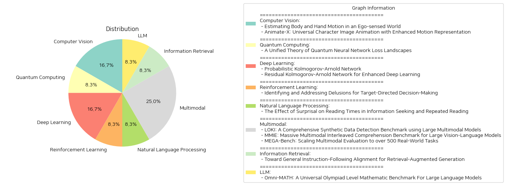

# Daily Artificial Intelligence Insights : Papers

## 💚 Computer Vision

**요약:**

요약 보고서:

1. 주요 주제 및 테마 추출:
   - "Estimating Body and Hand Motion in an Ego-sensed World" 논문은 머리에 장착된 장치로부터 인간의 움직임을 추정하는 시스템인 EgoAllo를 소개하고 있다. 공간적 및 시간적 불변성을 통해 모델 성능을 개선하는 것이 주요 주제이다.
   - "Animate-X: Universal Character Image Animation with Enhanced Motion Representation" 논문은 참조 이미지와 목표 자세 시퀀스로부터 고품질 비디오를 생성하는 캐릭터 이미지 애니메이션에 대한 이야기며, 특히 인간 이외의 여러 캐릭터 유형에 적용 가능한 새로운 애니메이션 프레임워크인 Animate-X를 제안한다. 

2. 공통 키워드, 트렌드 및 패턴 식별:
   - 두 논문 모두 "운동 표현 개선"과 "모션 추정"에 관련된 기술을 다루고 있다.
   - "EgoCentric SLAM 포즈", "조건부 확산 모델", "Pose Indicator", "LDM" 등과 같은 기술적 용어가 사용된다.
   - 두 연구는 머신러닝 및 딥러닝 기법을 활용하여 모션을 더 정확히 추정하고 애니메이션 품질을 개선하려고 한다.

3. 주요 이벤트 및 핵심 정보 요약:
   - "EgoAllo" 시스템은 주변 장면의 할로 중심 좌표계에서 착용자의 행동을 포착하기 위해 3D 신체 자세, 높이, 손 매개 변수를 추정한다. 혁신적인 표현법 도입을 통해 최대 18%의 개선을 달성했다.
   - "Animate-X"는 다양한 캐릭터에 보편적으로 적용 가능한 애니메이션을 위해 포즈 인디케이터를 소개하며, 이는 비디오의 움직임 패턴을 보다 포괄적으로 포착하도록 설계되었다. 

4. 이벤트의 부문별 영향 분석:
   - EgoAllo는 증강현실, 인간-컴퓨터 상호작용 분야에서 인간의 움직임을 보다 정확히 인식하는 데 기여할 수 있다.
   - Animate-X는 게임 및 엔터테인먼트 산업에서 다양한 캐릭터의 애니메이션 품질을 크게 향상시킬 가능성이 있다.

5. 최종 통합 요약 및 결론:
   - 두 논문은 모션 추정 및 애니메이션 기술의 발전을 목표로 하며, 공간적, 시간적 정보의 활용을 개선하고자 한다.
   - 향후에는 이러한 기술들이 보다 일반화되어 다양한 실세계 애플리케이션에 적용될 가능성이 높고, 관련 분야의 기술 발전을 주도할 중요한 요소가 될 것이다.

**출처:**

 - Estimating Body and Hand Motion in an Ego-sensed World (https://deeplearn.org/arxiv/533024/estimating-body-and-hand-motion-in-an-ego-sensed-world)
 - Animate-X: Universal Character Image Animation with Enhanced Motion Representation (http://arxiv.org/abs/2410.10306v1)

## ❄️ Quantum Computing

**요약:**

보고서: 

1. 주요 주제 및 테마 추출:
   - 양자 신경망(QNNs)의 손실 풍경 설명
   - Wishart 프로세스로 양자 신경망의 행동 특성화
   - Gaussian 프로세스 한계 조건 및 기울기 분포 계산
   - QNN 모델의 "훈련 가능성" 정의

2. 공통 키워드, 동향 및 패턴 식별:
   - 양자 신경망, Gaussian 프로세스, Wishart 프로세스, 기울기 분포, 훈련 가능성

3. 각 논문의 주요 사건 및 중요한 정보 요약:
   - 제목: '양자 신경망 손실 풍경의 통합 이론'
   - 요약: 무작위로 초기화된 양자 신경망이 일반적으로 Gaussian 프로세스로 행동하지 않음을 설명하면서, 이러한 네트워크가 Wishart 프로세스라는 새로운 틀에서 행동한다고 주장함. QNN이 Gaussian 프로세스 한계를 가지기 위한 필요충분조건 및 기울기 분포를 계산함으로써 양자 신경망의 훈련 및 일반화 행동을 예측하는 새로운 방법을 제시함.

4. 이러한 사건의 다양한 부문에 대한 영향 분석:
   - 양자 신경망의 이해 및 훈련 방법 개발에 큰 영향을 미침.
   - QNNs의 훈련 가능성을 측정하는 새로운 지표 제공으로, 양자 컴퓨팅 및 머신러닝 연구 분야에 기여.

5. 최종 종합 요약 및 주목할 만한 미래 개발:
   - 양자 신경망의 손실 풍경에 대한 통합 이론을 통해, QNN 모델의 효율적인 설계 및 훈련 가능성 평가가 가능해짐.
   - 이러한 연구는 양자 기계 학습의 발전을 가속화하고, 실용적인 양자 컴퓨팅 응용 프로그램 개발에 기여할 것으로 예상.
   - 앞으로 QNN 모델의 다양한 응용 분야에서 이론의 실질적인 적용 가능성을 모색할 필요가 있음.

**출처:**

 - A Unified Theory of Quantum Neural Network Loss Landscapes (https://deeplearn.org/arxiv/535506/a-unified-theory-of-quantum-neural-network-loss-landscapes)

## 🪐 Deep Learning

**요약:**

보고서 요약:

1. **핵심 주제 및 테마 추출**:
   - 두 논문 모두 Kolmogorov-Arnold Network (KAN)에 중점을 두고 있으며, 이는 복잡한 함수의 회귀 모델 및 네트워크 성능 향상을 위한 방법론을 탐구합니다.
   - 첫 번째 논문은 KAN을 사용하여 불확실성이 존재하는 데이터셋에서 출력의 확률 분포를 추정하는 방법론을 제안합니다.
   - 두 번째 논문은 KAN과 잔여 신경망(Residual Network)을 결합하여 깊은 신경망에서 비선형 종속성을 보다 효율적으로 캡처하는 새로운 접근 방식을 소개합니다.

2. **공통 키워드, 트렌드 및 패턴 식별**:
   - KAN의 활용, 불확실성 처리, 잔여 구조 통합, Chebyshev 다항식 사용, 깊은 학습 구조에서의 개선 등이 두 논문에서 공통적으로 언급되었습니다.

3. **중요한 이벤트 및 주요 정보 요약**:
   - 첫 번째 논문은 Aleatoric 불확실성이 존재하는 실험 환경에서 KAN을 활용하여 출력 확률 분포를 모델링하는 방법을 설명합니다. 이 접근법은 입력에 따라 다중 양태성을 포착할 수 있습니다.
   - 두 번째 논문은 RKAN을 통해 CNN의 복잡한 비선형 종속성을 개선하며, ResNet 및 DenseNet에 통합하여 컴퓨터 비전 작업에서 일관된 성능 향상을 보였습니다.

4. **이벤트의 영향 분석**:
   - KAN 기반의 접근 방식은 다양한 데이터 불확실성을 다룰 수 있는 잠재력을 보여주며, 이는 인공지능 및 데이터 분석 분야에서의 활용도를 높입니다.
   - RKAN의 통합은 CNN 구조의 성능을 향상시켜, 비전 데이터 처리의 효율성과 정확성을 증가시킬 수 있습니다.

5. **최종 요약 및 향후 개발 사항**:
   - Kolmogorov-Arnold Network는 AI 모델의 불확실성 처리 능력과 신경망 구조의 깊이에서 복잡성을 다룰 수 있는 강력한 도구로 자리 잡고 있습니다.
   - 향후 개발 방향은 KAN과 다른 딥러닝 구조의 융합 가능성을 탐구하고, 다양한 도메인에서의 적용 사례를 확대하는 방향으로 나아갈 것으로 보입니다. 또한, Aleatoric 불확실성을 처리하는 모델링 기법의 성능 향상 및 컴퓨팅 효율성 증가가 기대됩니다.

**출처:**

 - Probabilistic Kolmogorov-Arnold Network (https://deeplearn.org/arxiv/535517/probabilistic-kolmogorov-arnold-network)
 - Residual Kolmogorov-Arnold Network for Enhanced Deep Learning (https://deeplearn.org/arxiv/535518/residual-kolmogorov-arnold-network-for-enhanced-deep-learning)

## ⭐ Reinforcement Learning

**요약:**

보고서 요약:

1. 주요 주제 추출:
   - 목표 지향적 의사 결정
   - 잘못된 훈련으로 인한 착각
   - 실험적 환경에서 착각 원인 조사
   - 착각 문제 해결 방법 제시
   - 후향적 라벨링을 통한 강화 학습

2. 공통 키워드, 경향, 패턴 식별:
   - 목표 지향성
   - 잘못된 신념 및 행동
   - 일반화 및 분배기의 외부 원리 
   - 후향적 라벨링 방법

3. 주요 사건 및 중요한 정보 요약:
   - 목표 지향적 에이전트를 훈련하는 과정에서 잘못된 교육으로 인한 착각 현상이 발생할 수 있음.
   - 에이전트가 목표에 대해 잘못된 신념을 가지게 될 경우, 평가 시 불필요한 행동이 초래되며 일반화 능력이 떨어질 수 있음.
   - 다양한 환경에서 착각의 유형들을 식별하고 그 원인을 파악함.
   - 착각을 해결하기 위해 일반적으로 사용되는 후향적 라벨링 방법을 바탕으로 한 해결책을 제안하고 이에 대한 실효성을 검증함.

4. 이러한 사건들이 다양한 부문에 미치는 영향 분석:
   - 인공지능 및 머신러닝 분야의 훈련 방식에 대한 개선의 중요성을 강조함.
   - 자동화 시스템에서의 일반화 및 적응 능력 향상에 기여.
   - 잘못된 신념 체계를 조기에 식별하고 해결하는 메커니즘을 마련함으로써 과대 일반화 문제를 완화.

5. 결론 및 향후 주의해야 할 발전 사항:
   - 목표 지향적 에이전트의 훈련에서 착각의 위험을 줄이기 위한 지속적 연구 필요.
   - 후향적 라벨링 외에 더 효과적인 방법론 개발 가능성 탐색.
   - 인공지능 시스템의 활용 폭이 넓어짐에 따라 다양한 환경에서의 높은 일반화 능력을 확보하는 것이 중요함.
   - 착각 경향을 초기에 파악할 수 있는 진단 도구 발전이 기대됨.

**출처:**

 - Identifying and Addressing Delusions for Target-Directed Decision-Making (https://deeplearn.org/arxiv/535605/identifying-and-addressing-delusions-for-target-directed-decision-making)

## 🤩 Natural Language Processing

**요약:**

**요약 보고서: 서프라이즈 영향과 언어 처리**

1. **주요 주제 및 테마**
   - 서프라이즈(예상 외 요소)가 정보 탐색과 반복 읽기에서의 읽기 시간에 미치는 영향
   - 심리언어학에서의 정보 처리 난이도와 서프라이즈의 관계
   - 사람들의 일상생활에서의 언어 처리 방식: 정보 탐색, 반복 처리, 두 방식의 결합

2. **공통 키워드 및 패턴**
   - 서프라이즈 이론과 처리 시간의 선형 효과
   - 리듬별 컨텍스트와 인류의 태스크와의 부조화
   - 언어 모델의 인지적 추정 능력에 대한 의문점

3. **주요 이벤트 및 핵심 정보 요약**
   - 서프라이즈가 다양한 언어 처리 레짐(해석 조건)에서 처리 시간에 미치는 영향을 아이트래킹 데이터로 조사
   - 일반적인 서프라이즈 추정치를 사용해 선형효과의 예측을 확장
   - 정보 탐색에서 레짐 기반 추정치는 일반 서프라이즈 대비 처리 시간 예측력 개선에 실패
   - 반복 읽기에서는 레짐 기반 추정치가 처리 시간 예측력에 거의 영향을 미치지 않음

4. **다양한 분야에 대한 영향 분석**
   - 언어 처리 모델과 인간의 기억 표현 방식 사이의 불일치로, 현재 모델의 인지적 추정치 사용에 대한 신뢰도 저하
   - 이론적인 난제를 제기하며, 언어 모델의 실제적 활용 가능성에 대한 재검토 필요

5. **결론 및 미래 개발 방향**
   - 서프라이즈 이론은 특정 컨텍스트에 대한 예측력에 제한점을 가질 수 있음
   - 미래 연구에서는 인간의 언어 처리와 기억 시스템의 정교한 모델링이 필요
   - 서프라이즈와 인지적 처리 기제 간의 관계를 재검토, 보다 효과적인 언어 처리 모델 개발을 목표로

이 연구는 언어 처리 모델과 인간의 실제 언어 처리 경험 간의 격차를 보여주며, 향후 인간의 인지 체계에 더 부합하는 모델 개발의 필요성을 환기시킵니다.

**출처:**

 - The Effect of Surprisal on Reading Times in Information Seeking and Repeated Reading (https://deeplearn.org/arxiv/535642/the-effect-of-surprisal-on-reading-times-in-information-seeking-and-repeated-reading)

## 🤩 Multimodal

**요약:**

### 종합 요약 보고서

#### 주요 주제 및 테마 추출

1. **AI 생성 콘텐츠와 데이터 검출의 중요성**: 인터넷의 발전과 함께 AI가 생성한 콘텐츠가 증가하고 있으며, 이에 따라 적합하고 신뢰할 수 있는 데이터를 구별하는 것이 중요해지고 있습니다.
2. **대규모 멀티모달 모델(LMMs)의 역할과 분석**: LMMs는 여러 모달리티에서 합성 데이터를 탐지하는 데 중요한 역할을 하며, 이에 대한 성과와 한계가 계속해서 연구되고 있습니다.
3. **대규모 비전-언어 모델(LVLMs)의 이해력 및 생성 능력 평가**: LVLMs가 이미지와 텍스트를 임의의 순서로 생성하고 이해할 수 있는 능력을 평가하는 것이 중요한 연구 주제로 떠오르고 있습니다.
4. **실제 응용과 다양한 태스크에 대한 종합적 평가 실시**: 다양한 실제 문제를 해결하기 위해 멀티모달 테스크 평가가 중요시되고, 이를 위한 고품질 데이터 샘플 및 다양한 평가 지표 개발이 강조되고 있습니다.

#### 공통 키워드, 트렌드 및 패턴 식별

- **합성 데이터 탐지**: 최근 AI가 생성한 콘텐츠로 인해 합성 데이터를 구별하는 것이 중요해짐.
- **대규모 멀티모달 및 비전-언어 모델**: 이들 모델의 발전과 평가가 주요 연구 주제로 등장.
- **대규모 벤치마크 개발**: 모델의 성능을 종합적으로 평가하기 위한 대규모 벤치마크의 필요성이 강조됨.
- **자동화된 평가 메트릭의 도입**: 평가의 정확성과 편향성을 개선하기 위한 자동화된 평가 메트릭의 개발 필요성 대두.

#### 각 논문의 주요 이벤트 및 핵심 정보 요약

1. **LOKI 벤치마크 개발**: LOKI는 멀티모달 모델이 합성 데이터를 인식하는 능력을 평가하기 위한 새로운 기준을 제시하여, 다양한 모달리티에서의 데이터 탐지 성능을 측정합니다.
2. **MMIE 벤치마크 소개**: MMIE는 대규모 비전-언어 모델의 상호 이해력과 생성력을 평가하며, 새로운 자동화된 평가 지표를 통해 신뢰성 있는 성능 평가를 목표로 합니다.
3. **MEGA-Bench의 역할**: MEGA-Bench는 500개 이상의 실제 과제를 포함하여 다양한 멀티모달 태스크를 평가하기 위한 포괄적이고 비용 효율적인 평가 도구를 제공합니다.

#### 이러한 사건들이 여러 부문에 미치는 영향 분석

- **데이터 신뢰성**: 정교한 AI 모델에 의해 생성된 합성 콘텐츠의 증가는 데이터 신뢰성을 위협할 수 있으며, 이에 대한 정확한 평가 도구의 필요성이 증가합니다.
- **모델 발전 촉진**: 새로운 벤치마크와 평가 도구는 모델 성능 평가와 개선 방향을 제시하여, 더 발전된 모델 개발을 촉진할 것입니다.
- **산업 및 교육 부문**: 다방면의 태스크 해결 능력이 향상됨에 따라 산업 및 교육 부문의 응용 범위가 넓어질 것입니다.

#### 종합 결론 및 미래 개발 주의사항

이 종합 보고서는 AI 모델의 합성 데이터 탐지 및 멀티모달 능력 평가의 중요성을 강조하며, 이러한 발전들이 가져올 데이터 신뢰성 문제의 사회적 및 기술적 해결을 위한 기회를 제공합니다. 미래에는 더 정교하고 편향성이 적은 자동화 평가 메트릭을 개발하고, 다양하고 복잡한 실제 문제에 적합한 모델을 육성하는 데 집중해야 할 것입니다. 새로 개발된 벤치마크들이 연구자들로 하여금 모델 성능을 심층적으로 분석하고 최적화할 수 있도록 이끌 것입니다.

**출처:**

 - LOKI: A Comprehensive Synthetic Data Detection Benchmark using Large Multimodal Models (http://arxiv.org/abs/2410.09732v1)
 - MMIE: Massive Multimodal Interleaved Comprehension Benchmark for Large Vision-Language Models (http://arxiv.org/abs/2410.10139v1)
 - MEGA-Bench: Scaling Multimodal Evaluation to over 500 Real-World Tasks (http://arxiv.org/abs/2410.10563v1)

## ✈️ Information Retrieval

**요약:**

요약 보고서:

1. 주요 주제 및 테마:
- 일반적인 지시를 따르는 행동: Retrieval-Augmented Generation (RAG) 시스템의 효과적인 응용을 위한 지시 따라하기 중요성 강조.
- 대형 언어 모델(LLM)의 발전과 함께 지시 따라하기(IF) 정렬의 연구 필요성.
- VIF-RAG이라는 자동화되고 검증 가능한 합성 파이프라인 제안으로 RAG 시스템에서 지시 따라하기 정렬을 향상시키기 위한 연구.

2. 공통된 키워드, 트렌드 및 패턴:
- 지시 따라하기(IF) 정렬 향상
- 대형 언어 모델(LLM)의 활용
- 자동화된 데이터셋 생성 및 평가 벤치마크(FollowRAG 벤치마크)

3. 주요 사건 및 주요 정보:
- 연구진은 최소한의 기초 지시 세트를 수작업으로 제작하고 조합 규칙을 개발하여 복잡한 지시를 합성 및 검증하는 방법론 제안.
- Python 실행기를 통해 지시의 품질을 자동으로 검증하는 시스템을 구축.
- VIF-RAG-QA라는 고품질 데이터셋을 자동화된 프로세스를 통해 확장, 그 크기가 100k 이상에 이름.
- FollowRAG 벤치마크를 도입하여 대략 3,000개의 테스트 샘플 포함, 다양한 지시 제한과 지식 집약적인 QA 데이터셋 포함.

4. 이러한 사건들의 영향 분석:
- VIF-RAG 시스템은 LLM의 성능을 일반적인 지시 제한에 따라 현저하게 향상시키고 RAG 시나리오에서의 능력을 효과적으로 활용.
- RAG 시스템의 지시 따라하기 자동 평가를 위해 FollowRAG 벤치마크 적용 가능성 시연.
- 다양한 IF 및 기초 능력 벤치마크와의 통합으로 RAG 벤치마크와의 연계성 강화.

5. 최종 요약 및 잠재적 미래 개발:
- VIF-RAG은 RAG 시스템 내에서의 지시 따라하기 정렬을 획기적으로 개선 가능성을 보여줌.
- 다양한 RAG 벤치마크와의 원활한 통합 가능성 제안, 실용적인 통찰 제공.
- 본 연구는 향후 LLM 기반 RAG 시스템의 성능 극대화를 위한 중요한 기초 자료를 제공하며, 코드와 데이터셋은 공개되어 산업 및 학계의 추가 연구와 발전에 기여할 가능성이 있음. 

앞으로는 이러한 기법이 더 많은 영역에 적용되어 인공지능 시스템의 효율성과 정확성을 높이는 방향으로 발전할 것으로 예측된다.

**출처:**

 - Toward General Instruction-Following Alignment for Retrieval-Augmented Generation (http://arxiv.org/abs/2410.09584v1)

## 🎉 LLM

**요약:**

보고서 요약:

1. 주요 주제와 테마 추출:
   - 대규모 언어 모델(LLM)의 수학적 추론 성능 향상.
   - 기존 벤치마크의 한계와 새로운 도전 과제 필요성.
   - 오림피아드 수준의 수학 벤치마크 'Omni-MATH' 개발.

2. 공통 키워드, 트렌드, 패턴 식별:
   - 오림피아드 수학 문제 해결.
   - 모델 성능 평가 및 개발 필요성.
   - 다양한 난이도의 문제 및 세부 영역(서브 도메인) 포함.

3. 주요 사건과 중요한 정보 요약:
   - 기존 수학 벤치마크들(GSM8K, MATH 등)은 최신 언어 모델들에게 도전 과제로 부족.
   - 'Omni-MATH'는 총 4428개의 수학 경연문제를 포함하며, 이는 인간 전문가들에 의해 철저하게 주석화되어 있음.
   - 문제가 33개 이상의 서브 도메인과 10개 이상의 난이도 레벨로 구분되어 모델의 올림피아드 수준 수학적 추론 능력을 포괄적으로 평가 가능.
   - 실험 결과, OpenAI의 최신 모델(OpenAI o1-mini 및 OpenAI o1-preview)조차도 올림피아드 수준 문제에서는 각각 60.54%와 52.55% 정확도로 어려움을 겪음.

4. 이러한 사건들이 다양한 분야에 미치는 영향 분석:
   - 교육 및 경연 문제 설계 분야에서의 도전 과제 및 기회 증가.
   - 수학적 사고를 지원하는 AI 기술 개발의 필요성 대두.
   - 차세대 언어 모델의 성능 평가 기준 재정립 필요.

5. 최종 요약 및 결론, 미래 개발 가능성:
   - Omni-MATH는 LLM의 수학적 추론 능력을 엄격하게 평가할 수 있는 중요한 도구로 기능할 것으로 예상됨.
   - 언어 모델이 더 심층적인 수학적 문제 해결 능력을 갖출 수 있도록 추가 연구 및 개발이 필요.
   - 향후 AI 모델의 발전은 보다 복잡한 문제 해결 및 다양한 분야의 교육 도구로서의 활용이 예상됨.

**출처:**

 - Omni-MATH: A Universal Olympiad Level Mathematic Benchmark For Large Language Models (http://arxiv.org/abs/2410.07985v2)

