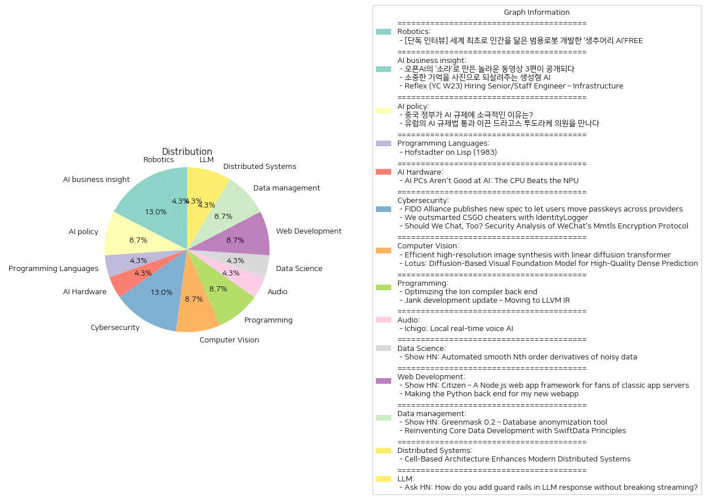

# Daily Artificial Intelligence Insights : News

## 🪄 Robotics

**요약:**

**종합 요약 보고서**

1. **주요 주제**:
   - 인간을 닮은 범용 로봇 개발: 인간과 유사한 범용 로봇 개발의 혁신적인 움직임이 주목을 받고 있습니다. 캐나다의 AI 로봇 전문기업 생추어리 AI가 이를 주도하고 있습니다.

2. **주요 사건**:
   - 생추어리 AI의 혁신: 생추어리 AI의 조르디 로즈 CEO는 AI로 복잡한 일상 상황에 유연하게 대응할 수 있는 범용 로봇 개발을 목표로 하고 있으며, 이를 통해 미래 로봇 기술의 방향성을 제시했습니다.

3. **영향 분석**:
   - 경제적 영향: 로봇 공학의 발전은 제조업을 비롯한 다양한 산업 분야에서 자동화를 촉진시켜 생산성을 높이고, 장기적으로 경제 성장에 긍정적인 영향을 미칠 가능성이 큽니다.
   - 사회적 영향: 인간형 로봇의 개발은 다양한 사회적 변화와 논의를 불러일으킬 수 있습니다. 예를 들어, 노동시장에서의 직업 재분배와 같은 문제들이 대두될 수 있습니다.
   - 혁신의 가능성: 인간과 상호작용이 가능한 범용 로봇은 의료, 교육, 서비스 등 여러 분야에서의 혁신적인 해결책을 제공할 수 있습니다.

4. **최종 요약**:
   - 현재 인공지능과 로봇 기술의 발전은 전례 없는 속도로 진행되고 있으며, 생추어리 AI와 같은 기업들이 향후 이 기술의 선도적인 역할을 할 것으로 보입니다. 이러한 움직임은 경제적 측면에서 기회 창출뿐만 아니라, 사회적, 윤리적 측면에서의 논의와 도전 과제를 동반할 것입니다.
   - 향후 로봇 공학의 사회적 수용성, 법적 제도화, 윤리적 기준 정립 등의 발전을 주목해야 할 필요성이 있습니다. 이는 기술 발전이 인류 전체에 긍정적인 영향을 미칠 수 있는 방향으로 이루어지도록 하는 중요한 요소가 될 것입니다.

**출처:**

 - [단독 인터뷰] 세계 최초로 인간을 닮은 범용로봇 개발한 ‘생추어리 AI’FREE (https://www.technologyreview.kr/%ec%9d%b8%ed%84%b0%eb%b7%b0-%ec%83%9d%ec%b6%94%ec%96%b4%eb%a6%ac-ai%ea%b0%80-%ea%b7%b8%eb%a6%ac%eb%8a%94-%eb%af%b8%eb%9e%98%ec%9d%98-%eb%a1%9c%eb%b4%87%ec%9d%80-%ec%8b%a4%ec%b2%b4%ed%99%94/)

## 🍊 AI business insight

**요약:**

1. **주요 주제**:
   - 생성형 인공지능(AI) 기술의 발전
   - AI를 활용한 혁신적인 콘텐츠 제작 및 복원
   - 기술 발전에 따른 인력 채용 필요성

2. **주요 이벤트**:
   - 오픈AI의 새로운 동영상 생성 모델 '소라'를 통해 제작된 3편의 영상이 공개되었다. 특히, 제작에 참여한 크리에이터들의 다양한 목적과 기법이 강조되었다.
   - '합성 기억' 프로젝트로, 생성형 AI를 이용해 촬영되지 않았던 과거의 추억을 이미지로 재현하는 시도가 이루어지고 있다. 이 프로젝트는 전 세계적으로 여러 가족들에게 과거의 소중한 기억을 되찾을 기회를 제공한다.
   - Reflex(YC W23)가 인프라 엔지니어를 채용 중이며, 규모에 맞는 신뢰성, 속도, 보안을 중시하여 소프트웨어 개발을 주도할 인재를 찾고 있다.

3. **영향 분석**:
   - 경제: 생성형 AI 기술의 발전은 관련 산업(예: 콘텐츠 제작, IT 인프라)을 더욱 활성화시키고 있으며, 이에 따라 AI 전문 인력 수요가 증가하고 있다.
   - 사회: '합성 기억' 프로젝트는 AI 기술의 사회적 가치와 긍정적 영향을 보여주며, 개인의 감성적 요구를 충족시키는 방향으로 기술이 활용될 가능성을 열어주고 있다.
   - 기술: 새로운 AI 모델과 프로젝트의 발전은 기술적 혁신의 지속을 암시하며, 향후 다양한 분야에 응용될 가능성을 가지고 있다.

4. **최종 요약**:
   이번 뉴스에서 강조된 생성형 AI의 발전은 콘텐츠 제작과 과거 추억의 복원 등 다양한 영역에서의 혁신을 가능케 하고 있다. 이는 경제적, 사회적 분야에 긍정적인 영향을 미치며, AI 전문 인력이 필수적이라는 점에서 인력 채용의 중요성이 대두되고 있다. 앞으로 기술의 파급효과를 다각적으로 모니터링하고, 기술 활용의 사회적 가치를 높이는 방안도 고려해야 할 것이다.

**출처:**

 - 오픈AI의 ‘소라’로 만든 놀라운 동영상 3편이 공개되다 (https://www.technologyreview.kr/%ec%98%81%ec%83%81-%ec%83%9d%ec%84%b1-%eb%aa%a8%eb%8d%b8-%ec%86%8c%eb%9d%bc%eb%a1%9c-%eb%a7%8c%eb%93%a0-%eb%86%80%eb%9d%bc%ec%9a%b4-%ec%98%81%ed%99%94-3%ed%8e%b8%ec%9d%b4-%ea%b3%b5%ea%b0%9c%eb%90%98/)
 - 소중한 기억을 사진으로 되살려주는 생성형 AI (https://www.technologyreview.kr/%ec%83%9d%ec%84%b1%ed%98%95-ai%eb%a1%9c-%ea%b0%80%ec%9e%a5-%ec%86%8c%ec%a4%91%ed%95%9c-%ea%b8%b0%ec%96%b5%ec%9d%84-%ec%82%ac%ec%a7%84%ec%9c%bc%eb%a1%9c-%eb%a7%8c%eb%93%a0%eb%8b%a4/)
 - Reflex (YC W23) Hiring Senior/Staff Engineer – Infrastructure (https://www.ycombinator.com/companies/reflex/jobs/uBt9ZNP-senior-staff-engineer-infrastructure)

## 🍊 AI policy

**요약:**

**주요 주제**:
두 기사 모두 인공지능(AI) 규제라는 주제를 다루고 있으며, 국가별로 AI에 대한 규제 접근 방식의 차이에 초점을 맞추고 있다. 중국과 유럽의 규제 정책이 대비되며, 각각의 규제 접근 방식이 그들의 산업 성장에 미치는 영향을 조명한다.

**주요 사건**:
1. 중국 정부는 자국 AI 산업의 성장을 촉진하기 위해 AI 규제에 대해 느슨한 태도를 유지하고 있다. 이는 소비자 기술 플랫폼에 강경한 입장을 취한 것과 대조된다.
2. 드라고스 투도라케 의원은 유럽에서 AI 규제법이 통과되도록 주요 역할을 했으며, 이 법이 AI 산업의 책임성을 강화하고 개선할 것이라고 믿는다.

**영향 분석**:
- **경제**: 중국의 느슨한 AI 규제는 단기적으로 AI 산업의 빠른 성장을 가능하게 할 수 있지만, 장기적으로는 혁신 및 윤리적 측면에서 문제를 초래할 위험이 있다. 한편, 유럽의 엄격한 규제는 산업의 투명성과 책임성을 제고함으로써 장기적으로는 AI 기술의 신뢰를 높일 수 있다.
- **정치**: 두 지역 모두 AI 규제와 관련된 정치적 논의가 활발하며, 이는 각 국의 국제적 기술 리더십에 영향을 미칠 수 있다. 중국은 빠른 발전을 통해 기술 주도권을 확대하려 하고, 유럽은 규제와 윤리를 통해 기술 리더십을 구축하려 한다.
- **사회**: AI 규제는 데이터 사용 및 프라이버시 권리에 직접적인 영향을 미칠 수 있다. 엄격한 규제가 데이터 보호를 강화할 수 있으며, 이는 사회적 신뢰로 이어질 수 있다.

**최종 요약**:
이번 뉴스는 AI 규제에 대한 각국의 상반된 접근 방식을 부각시키며, 중국과 유럽 사례를 통해 규제가 산업 및 사회에 미치는 잠재적 영향을 조망한다. 중국의 규제 완화는 산업 성장을 목표로 하지만, 장기적인 윤리적 문제를 야기할 가능성이 있다. 반면, 유럽의 규제 강화는 책임과 투명성을 통해 신뢰할 수 있는 AI 환경을 조성하려고 하며, 이는 장기적 안정성에 기여할 수 있다. 미래의 관점에서는 각국의 AI 정책 변화와 이에 따른 산업의 글로벌 방향성에 대해 주시할 필요가 있다.

**출처:**

 - 중국 정부가 AI 규제에 소극적인 이유는? (https://www.technologyreview.kr/%ec%a4%91%ea%b5%ad-%ec%a0%95%eb%b6%80%ea%b0%80-%ed%98%84%ec%9e%ac%eb%a1%9c%ec%84%9c%eb%8a%94-ai-%eb%b6%84%ec%95%bc%eb%a5%bc-%ea%b0%80%ed%98%b9%ed%95%98%ea%b2%8c-%ea%b7%9c%ec%a0%9c%ed%95%98%ec%a7%80/)
 - 유럽의 AI 규제법 통과 이끈 드라고스 투도라케 의원을 만나다 (https://www.technologyreview.kr/ai-%ea%b7%9c%ec%a0%9c%eb%b2%95-%ed%86%b5%ea%b3%bc-%ec%9d%b4%eb%81%88-%eb%93%9c%eb%9d%bc%ea%b3%a0%ec%8a%a4-%ed%88%ac%eb%8f%84%eb%9d%bc%ec%bc%80-%ec%9d%98%ec%9b%90%ec%9d%84-%eb%a7%8c%eb%82%98%eb%8b%a4/)

## 🚀 Programming Languages

**요약:**

입력 기사 목록에 제공된 정보가 충분하지 않아 단일 기사의 요약만 제공할 수 있습니다. 그러나 요청에 따라 일반적인 요약 형식과 구조를 제안할 수 있습니다.

1. **주요 테마**:
   - 제공된 제목 'Hofstadter on Lisp (1983)'으로부터 프로그래밍 언어 중 하나인 Lisp에 대한 논의가 주된 주제일 가능성이 높습니다. 
   - 1983년이라는 시점은 컴퓨터 과학 및 인공지능 연구가 활발해진 시기 중 하나로, 당시의 Lisp 언어의 중요성과 관련된 내용이 포함될 수 있습니다.

2. **주요 사건**:
   - 이 기사에서는 Douglas Hofstadter의 Lisp에 대한 통찰이나 견해를 다루었을 가능성이 큽니다. 
   - Lisp 언어의 기술적 특징, 그 역사적 발전, 그리고 당시 연구 및 학계에서의 이용 사례 등이 논의될 수 있습니다.

3. **영향 분석**:
   - **경제적 영향**: Lisp는 인공지능 연구의 발전에 중요한 역할을 했으며, 이는 장기적으로 기술 분야와 그에 따른 경제적 성장에 기여했을 가능성이 있습니다.
   - **정치적 영향**: 과학 기술 발전과 관련해 정책 수립에 영향을 미쳤을 수 있지만, 직접적인 정치적 영향은 미미할 수 있습니다.
   - **사회적 영향**: 컴퓨터와 프로그램 이해의 발전을 통해 보다 나은 교육과 기술 확산이 이루어졌을 가능성이 있습니다.

4. **최종 요약**:
   - 'Hofstadter on Lisp (1983)' 기사는 Lisp 언어의 중요성과 영향력을 조명하며, 특히 인공지능과 프로그래밍 언어의 발전에 초점을 맞추고 있을 것입니다.
   - 이와 관련된 내용은 현재 및 미래의 기술 발전 방향에 대한 통찰을 제공할 수 있으며, Lisp가 현대 프로그래밍 언어의 토대 역할을 한 점을 보여줄 수 있습니다.
   - 앞으로 주목할 점은 이러한 프로그래밍 언어가 어떻게 지속적으로 변화하는 기술 환경에 적응하고 혁신에 기여할 것인지에 달려 있습니다.

이 요약 형식은 다른 뉴스 제목과 요약을 추가할 때도 적용될 수 있습니다. 추가적인 정보를 제공해 주시면 보다 구체적이고 상세한 요약을 작성할 수 있습니다.

**출처:**

 - Hofstadter on Lisp (1983) (https://gist.github.com/jackrusher/5139396)

## 🧸 AI Hardware

**요약:**

1. **주요 주제**:
   - 기사에서 다루고 있는 주제는 인공지능 PC의 성능과 관련된 것입니다. 특히, 퀄컴의 NPU(신경처리장치)가 발표된 성능 대비 실질적으로 얼마나 유효한지를 평가하는 것에 중점을 두고 있습니다.  
  
2. **주요 사건**:
   - 퀄컴의 NPU는 윈도우 AI PC에서 45 Teraops/s의 성능을 주장했으나, 실제 성능은 그 중 1.3%에 불과했습니다. 이 벤치마크 실험에서 NPU의 성능이 CPU보다 낮았지만 에너지 효율성이나 지속적인 성능 면에서의 가능성을 제공했습니다.

3. **영향 분석**:
   - *경제적 측면*: NPU와 같은 새로운 기술이 실제 성능이 발표된 성능에 미치지 못할 경우, 기술에 대한 신뢰도 문제로 인해 투자 회수나 새로운 제품 개발에 부정적인 영향을 미칠 수 있습니다. 향후 기술 개발 방향에도 영향을 줄 수 있습니다.
   - *사회적 측면*: AI 기술의 성능이 실제 사용 환경에서 기대요법에 미치지 못하면, 소비자들은 기대하는 수준의 효율이나 생산성을 달성하지 못할 수 있으며, 이는 AI 기술에 대한 전반적인 인식에도 영향을 줄 수 있습니다.

4. **최종 요약 및 전망**:
   - 본 기사에서 다룬 AI PC의 NPU 성능 문제는 첨단 기술의 발전 과정에서 종종 발생하는 '마케팅 VS 실제 성능'의 괴리 문제를 명확히 보여줍니다. 향후 기술 개발에서는 이러한 성능 차이를 최소화하고, 실제 사용 시의 효율성을 높이는 방향으로 발전해야 할 필요가 있습니다. 또한, 에너지 효율성이나 장기적인 성능 개선 가능성에 초점을 맞춘 응용 방법도 중요할 것입니다. 이러한 점에서 신경처리장치(NPU)의 활발한 연구는 계속 되어야 하며, 향후 개선된 성능을 보일 수 있을지 주목해야 합니다.

**출처:**

 - AI PCs Aren't Good at AI: The CPU Beats the NPU (https://github.com/usefulsensors/qc_npu_benchmark)

## 🧸 Cybersecurity

**요약:**

1. **주요 주제**:
   - 전 세계 보안 관련 발전: 사용자 보안 인증 및 신용 교환을 위한 표준화를 지향하는 움직임과 온라인 플랫폼의 보안 개선이 주요 테마로 등장.
   - 부정 행위 방지 기술의 발전: 게임 플랫폼에서의 부정 행위 방지를 위한 새로운 기술 적용.
   - 온라인 플랫폼의 보안 분석: 주로 보안 취약점 연구와 이를 활용한 개선 방안 모색.

2. **중요 사건 요약**:
   - FIDO Alliance는 사용자들이 다양한 공급자 간에 보안 자격증명을 전송할 수 있도록 하는 새로운 초안을 발표하였다. 이 초안은 표준화를 통해 사용자 선택의 폭을 넓히고, 공급자 간 전환의 용이성을 제공한다.
   - Invex Gaming은 IdentityLogger라는 시스템을 개발하여 CSGO 커뮤니티 서버에서의 부정 행위를 줄였다. 이 시스템은 IP 주소, Steam ID, 그리고 쿠키에 저장된 추적 ID를 사용하여 부정 행위자들을 식별하고 차단하였다.
   - 연구자들은 WeChat의 MMTLS 암호화 프로토콜을 분석하여 암호학적 약점을 발견하였다. 그들은 이후 연구를 위한 도구와 문서를 릴리스하여 WeChat의 보안을 공부하는 데 도움이 되도록 하였다.

3. **영향 분석**:
   - **경제**: FIDO Alliance의 새로운 사양 발표는 IT 기업들 간의 경쟁을 촉진하고, 사용자들을 위한 보다 편리한 보안 솔루션을 제공함으로써 디지털 경제 생태계에 긍정적인 영향을 줄 것으로 예상된다.
   - **사회**: Invex Gaming의 IdentityLogger 시스템은 e스포츠 및 게이밍 커뮤니티에 있어 더 공정한 환경을 조성하는 데 기여하고 있으며, 이러한 기술은 다른 게임 플랫폼으로도 확장될 가능성이 있다.
   - **정치/보안**: WeChat의 보안 취약점 분석은 사용자 개인 정보 보호에 대한 관심을 증대시키며, 향후 기업들이 플랫폼 보안을 강화하는 계기가 될 수 있다.

4. **최종 요약**:
   이번 주의 뉴스는 디지털 보안과 사용자 인증, 온라인 게임 커뮤니티의 공정성 향상, 소셜 미디어 보안 분석이라는 세 가지 주제를 중심으로 전개되었다. 새로운 기술과 표준 규격의 등장은 보안 수준을 높이고 사용자 경험을 향상시키는 방향으로 나아가고 있다. 앞으로 공급자 간 보안 표준화의 발전을 주목해야 하며, 온라인 보안 분야에서의 지속적인 연구와 대응이 필요하다. 이러한 변화는 글로벌 디지털 환경에 큰 영향을 미칠 것으로 보인다.

**출처:**

 - FIDO Alliance publishes new spec to let users move passkeys across providers (https://fidoalliance.org/fido-alliance-publishes-new-specifications-to-promote-user-choice-and-enhanced-ux-for-passkeys/)
 - We outsmarted CSGO cheaters with IdentityLogger (https://mobeigi.com/blog/gaming/how-we-outsmarted-csgo-cheaters-with-identitylogger/)
 - Should We Chat, Too? Security Analysis of WeChat's Mmtls Encryption Protocol (https://citizenlab.ca/2024/10/should-we-chat-too-security-analysis-of-wechats-mmtls-encryption-protocol/)

## ☀️ Computer Vision

**요약:**

1. **주요 테마**:
   두 기사 모두 이미지 생성과 관련된 새로운 기술 발전을 다루고 있습니다. 특히, 고해상도 이미지를 빠른 속도로 생성하는 기술과, 밀집 예측 작업에서 일반화를 개선하는 기술이 강조되고 있습니다.

2. **주요 사건**:
   - 첫 번째 기사에서는 Sana 라는 텍스트-이미지 프레임워크가 소개됩니다. 이 프레임워크는 범용 노트북 GPU에서 실행 가능하며, 대형 모델과 견줄 만한 성능을 내면서도 크기는 20배 작고, 처리속도는 100배 이상 빠릅니다.
   - 두 번째 기사에서는 Lotus라는 모델이 언급됩니다. 이 모델은 고품질의 밀집 예측 작업을 위한 시각적 기초 모델로, 이전에 훈련된 텍스트-이미지 확산 모델의 시각적 선험 지식을 활용합니다. 기존 방법들이 밀집 예측과 이미지 생성의 근본적인 차이로 인해 최적화에 문제를 겪는 반면, 새로운 접근법을 제시하고 있습니다.

3. **영향 분석**:
   - 경제: 고성능 이미지 생성 기술의 발전은 그래픽 디자인, 영화, 게임 산업 등 다양한 분야에서 생산성 향상과 비용 절감을 가져올 수 있습니다.
   - 사회: 빠르고 효율적인 이미지 생성 솔루션은 예술 문화를 촉진하고, 다양한 창작 활동을 지원할 수 있습니다.
   - 기술: 이러한 발전은 인공지능 기술의 발전 속도를 가속화하며, 새로운 응용 가능성을 열어주는 데 기여할 것입니다.

4. **최종 요약**:
   이 기사들을 통해 우리는 이미지 생성 및 밀집 예측 분야에서의 혁신적인 기술 발전을 목격할 수 있습니다. 특히, 모델의 크기와 처리 시간을 획기적으로 줄이면서도 성능을 유지하는 것은 주목할 만합니다. 이러한 발전은 관련 산업의 효율성을 향상시키고, 더 다양하고 혁신적인 AI 응용 프로그램을 가능하게 할 것입니다. 앞으로 이러한 기술이 현실 세계의 다양한 문제를 해결하는 데 어떻게 기여할 수 있을지 주목할 필요가 있습니다.

**출처:**

 - Efficient high-resolution image synthesis with linear diffusion transformer (https://nvlabs.github.io/Sana/)
 - Lotus: Diffusion-Based Visual Foundation Model for High-Quality Dense Prediction (https://lotus3d.github.io/)

## 🎉 Programming

**요약:**

**요약 보고서**

1. **주요 주제**:
   두 기사 모두 소프트웨어 최적화 및 성능 개선과 관련된 주제가 중심에 있습니다. 첫 번째 기사는 Firefox의 WebAssembly 컴파일러 최적화에 대한 내용이며, 두 번째 기사는 Clojure 방언의 성능 향상 및 코드 생성을 다룹니다. 이 두 주제는 모두 컴파일러 최적화 및 코드 생성 기술의 발전을 중심으로 합니다.

2. **주요 사건**:
   - 첫 번째 기사에서는 Mozilla 엔지니어들이 Firefox 성능 향상을 위해 Ion 컴파일러의 최적화를 이루어냈습니다. 이 과정에서 느린 레지스터 할당자와 메모리 소모가 큰 dominator tree 구축 패스 문제를 해결했습니다.
   - 두 번째 기사에서는 jank 프로젝트가 예외 처리, 시작 시간 최적화 등에서 성과를 내었고, LLVM IR 코드 생성으로의 전환 가능성을 염두에 두고 있음을 보였습니다. 또한, C API를 구축하여 C ABI 런타임 라이브러리와의 상호운용성이 가능해졌고, 커뮤니티의 지지와 기여가 증가하고 있습니다.

3. **영향 분석**:
   - **경제**: 컴파일러 최적화는 소프트웨어 개발 비용 절감, 성능 향상 등 경제적 이점을 가져올 수 있습니다. 특히 웹 브라우저와 같은 대중적인 소프트웨어의 성능 개선은 사용자 경험을 크게 향상시킬 수 있습니다.
   - **사회**: 기술 커뮤니티의 성장과 오픈 소스 프로젝트의 발전은 지식 공유와 협업 문화에 긍정적인 영향을 미칩니다. 특히 jank 프로젝트의 경우, 여러 기여자들의 참여로 더 많은 혁신을 기대할 수 있습니다.

4. **최종 요약**:
   최근 소프트웨어 개발 및 최적화 분야에서의 주요 발전은 Firefox의 WebAssembly 컴파일러 최적화 및 jank 프로젝트의 성능 개선입니다. 이러한 발전은 소프트웨어 성능과 사용자 경험을 크게 향상시킬 수 있는 잠재력을 가지고 있습니다. 향후 LLVM IR 전환이나 커뮤니티 참여 증가와 같은 요소들이 더욱 발전할 가능성이 있으며, 소프트웨어 개발의 효율성을 높이고 혁신을 지속적으로 확대하는 데 기여할 것입니다.

**출처:**

 - Optimizing the Ion compiler back end (https://spidermonkey.dev/blog/2024/10/16/75x-faster-optimizing-the-ion-compiler-backend.html)
 - Jank development update – Moving to LLVM IR (https://jank-lang.org/blog/2024-10-14-llvm-ir/)

## 🫧 Audio

**요약:**

1. **주요 주제**:
   - 인공지능(AI) 및 음성 인식 기술의 발전: Ichigo 프로젝트가 Siri와 유사하게 본래의 청취 능력을 갖춘 LLM(대형 언어 모델)로 확장되고 있음을 나타냅니다.
   - 텍스트 기반 LLM에서 음성 기반 인터페이스로의 전환: Ichigo는 개선된 MMLU(멀티 태스크 학습 유틸리티) 점수를 달성하여 향상된 언어 이해 및 지시 따르기 능력을 보여줍니다.

2. **주요 사건**:
   - Ichigo 프로젝트는 실시간 지역 음성 인공지능을 개발하는 공개 연구 프로젝트로, 텍스트 기반 대형 언어 모델의 청취 능력을 강화하고 있습니다.
   - 이 프로젝트는 본래의 청취와 지시를 따르는 능력을 향상시키며 MMLU 점수 63.79의 성과를 이루었습니다.

3. **영향 분석**:
   - 경제: 프로젝트가 성공적으로 구현될 경우, 음성 인식 기술 시장의 확장을 이끌 수 있으며 다양한 사업 분야에서 새로운 솔루션 출시가 가능해질 것으로 보입니다.
   - 정치와 사회: 인공지능의 발전은 개인정보보호와 보안 문제를 포함한 여러 사회적 이슈를 야기할 수 있습니다. 기술이 점점 더 많은 분야에 통합되면서 이에 대한 규제와 정책 수립의 필요성도 커질 것입니다.

4. **최종 요약**:
   Ichigo 프로젝트는 음성 인식 AI 기술의 새로운 가능성을 보여주고 있으며, MMLU 점수의 향상은 그 기술적 진보를 시사합니다. 이러한 개발은 경제적 측면에서는 음성 기술의 지평을 넓히면서 다양한 산업에 적용될 가능성을 제공하지만, 동시에 사회와 정치적 측면에서도 규제 및 윤리적 고려가 필요하게 될 것입니다. 앞으로 이 기술이 다른 산업에 어떻게 활용될 것인지와 관련 정책 및 규제가 어떻게 발전할지를 주목할 필요가 있습니다.

**출처:**

 - Ichigo: Local real-time voice AI (https://github.com/homebrewltd/ichigo)

## 🎈 Data Science

**요약:**

1. **주요 테마**:
   - 기술 발전: 비정상적으로 샘플링된 시계열 데이터의 고차수 도함수 추정을 자동화하는 새로운 Python 라이브러리 개발.
   - 데이터 분석 개선: 노이즈가 존재하더라도 고정확도로 데이터의 도함수를 추정할 수 있는 새로운 방법 제시.

2. **주요 사건**:
   - kalmangrad 패키지는 Python 라이브러리로, 베이시안 필터링을 사용하여 전통적인 수치미분 방법보다 정확한 도함수 추정을 가능하게 함.
   - 고차수의 도함수를 추정할 수 있으며, 노이즈가 있는 데이터 환경에서도 사용이 적합함을 강조함.

3. **영향 분석**:
   - 경제 분야: 데이터 분석 및 기술의 향상은 많은 기업에서 더 정확한 예측과 판단을 가능하게 하여, 비용 절감 및 효율성 증대를 가져올 수 있음.
   - 사회적 영향: 데이터 기반의 의사 결정이 보다 정확해짐에 따라 다양한 분야에서의 연구 및 개발이 가속화될 가능성이 있음.
   - 기술적 발전: 전통적인 수치미분의 한계를 극복하며, 머신러닝이나 데이터 작업에 새로운 가능성을 열어줌.

4. **최종 요약**:
   - 현재 kalmangrad 패키지를 비롯한 신기술의 발전은 데이터 분석의 정확성과 효율성을 크게 향상시키고 있음. 이러한 변화는 경제적, 사회적 여러 분야에서 긍정적인 영향을 미칠 것이며, 특히 데이터 기반 의사결정의 정확성이 중요한 산업에서 상당한 변화를 가져올 것으로 예상됨. 앞으로 이와 같은 기술이 더욱 발전하고 적용 범위가 확장됨에 따라, 관련 분야의 혁신과 발전을 지속적으로 주목할 필요가 있음.

**출처:**

 - Show HN: Automated smooth Nth order derivatives of noisy data (https://github.com/hugohadfield/kalmangrad)

## 👽 Web Development

**요약:**

**종합 요약 보고서**

1. **주요 테마**:
   발표된 뉴스 기사에서 공통적으로 드러나는 주요 테마는 웹 애플리케이션 개발과 현대적인 소프트웨어 개발 프레임워크의 활용입니다. Node.js와 Python을 기반으로 한 고성능과 확장성을 중시하는 웹 앱 개발 트렌드, 그리고 최신 기술과 도구를 활용한 개발 프로세스의 향상이 주된 주제입니다.

2. **주요 사건**:
   - **Citizen 웹 앱 프레임워크**:
     새로운 Node.js 웹 애플리케이션 프레임워크 'Citizen'이 소개되었습니다. 이는 빠르고 확장 가능한 웹사이트 구축을 위한 프레임워크로, 캐싱, 라우팅, 오류 처리를 포함한 다양한 기능을 제공합니다. 모듈화된 아키텍처를 통해 전통적인 서버 기반 웹 애플리케이션, 단일 페이지 응용 프로그램, RESTful API를 구축할 수 있습니다.

   - **FastAPI를 활용한 Python 백엔드 개발**:
     새로운 웹앱을 위한 FastAPI 기반의 Python 백엔드 개발 프로젝트가 소개되었습니다. 이 프로젝트는 OpenAI의 LLM을 활용하여 YouTube 비디오로부터 정확하고 효율적인 문서 및 퀴즈 작성을 지원하며, NextJS는 프론트엔드, Claude3.5 Sonnet은 디버깅 및 코드 생성 도구로 사용되었습니다.

3. **영향 분석**:
   - **경제적 영향**:
     이러한 웹 애플리케이션 프레임워크와 개발 도구의 발전은 기술 산업 전반에 걸쳐 소프트웨어 개발을 더 효율적이고 비용 효과적으로 만듭니다. 개발자들은 더욱 복잡하고 사용자 맞춤형 애플리케이션을 만들기 위해 이러한 도구들을 활용할 수 있으며, 이는 소프트웨어 개발 시장의 경쟁력을 더욱 강화합니다.

   - **사회적/정치적 영향**:
     기술의 발전은 더 나은 사용자 경험을 제공하고 접근성을 확대함으로써 사회전체에 긍정적인 영향을 미칠 수 있습니다. 또한, 데이터 기반 의사 결정과 교육 컨텐츠 생성의 효율성을 높여 다양한 분야에서의 적용 가능성을 보여줍니다.

4. **최종 요약**:
   이번 뉴스 기사들은 현대적인 웹 애플리케이션 개발에서 사용되는 다양한 프레임워크와 도구의 능력을 조명하며, 이러한 기술들이 소프트웨어 개발 과정의 효율성을 크게 향상시키고 있음을 보여줍니다. 이는 뿐만 아니라 새로운 시장 기회를 창출할 수 있는 가능성을 지니고 있습니다. 앞으로 이러한 기술들은 더욱 발전할 것이며, 이를 주시하며 각 분야에서의 응용 가능성을 탐색하는 것이 필요합니다.

**출처:**

 - Show HN: Citizen – A Node.js web app framework for fans of classic app servers (https://github.com/jaysylvester/citizen)
 - Making the Python back end for my new webapp (https://youtubetranscriptoptimizer.com/blog/02_what_i_learned_making_the_python_backend_for_yto)

## 🌅 Data management

**요약:**

### 종합 요약 보고서

1. **주요 주제**:
   - 모든 뉴스 기사에서 공통적으로 다루는 주요 주제는 데이터 관리 및 최적화 기술입니다. 데이터베이스 익명화 도구와 데이터 개발 원칙의 현대화 방안을 통한 성능 개선이 두드러집니다.

2. **주요 사건**:
   - **Greenmask 0.2**: 데이터베이스 익명화 도구인 Greenmask 0.2는 PostgreSQL과 호환되며, 데이터의 백업, 익명화, 복원 기능을 제공합니다. 오픈 소스로 개발되어 다양한 저장 옵션과 병렬 실행을 지원함으로써, 데이터 관리의 효율성과 기능적 의존성 해결을 돕습니다.
   - **SwiftData 원칙을 통한 Core Data 재구성**: SwiftData의 현대적 접근 방식을 Core Data에 적용하여 데이터 모델링과 동시 프로그래밍을 개선하는 방법을 제안합니다. 이를 통해 성능과 안정성을 한층 더 높인 데이터 관리 솔루션을 제공합니다.

3. **영향 분석**:
   - **경제**: 데이터베이스 관리의 효율성이 크게 개선됨에 따라, 기업들은 데이터 처리 비용을 줄이고 보다 신속한 의사결정을 할 수 있습니다. 이는 경제 전반에 걸쳐 생산성 향상으로 이어질 가능성이 큽니다.
   - **사회**: 데이터 익명화 도구의 발전으로 개인 정보 보호 수준이 높아져, 사용자의 신뢰가 증대될 것입니다. 더불어 개발자 커뮤니티에서는 새로운 데이터 관리 기술의 도입과 학습을 통해 전문성을 강화할 수 있습니다.

4. **최종 요약**:
   - 두 기사는 모두 데이터 관리의 현대화와 최적화를 다루고 있으며, 이는 기술 환경의 발전을 강조합니다. Greenmask 0.2는 오픈 소스 환경의 데이터 익명화 도구로서 포괄적인 기능을 제공하며, SwiftData 원칙을 적용한 Core Data는 성능과 안정성을 높이는 새로운 접근법을 제시합니다. 이러한 발전이 데이터 중심 사회에 미칠 영향은 긍정적일 것으로 예측되며, 앞으로도 이러한 데이터 관리 기술의 진화를 주목해야 할 것입니다.

**출처:**

 - Show HN: Greenmask 0.2 – Database anonymization tool (https://github.com/GreenmaskIO/greenmask)
 - Reinventing Core Data Development with SwiftData Principles (https://fatbobman.com/en/posts/reinventing-core-data-development-with-swiftdata-principles/)

## 🌿 Distributed Systems

**요약:**

**1. 주요 테마:**

'Cell-Based Architecture Enhances Modern Distributed Systems' 기사에서의 주요 테마는 셀 기반 아키텍처의 장점과 중요성입니다. 셀 기반 아키텍처는 현대 분산 시스템에서 실패를 특정 사용자가나 고객에게 격리시킴으로써 시스템의 탄력성과 확장성을 높이고 문제 발생 시 영향을 줄이는 방법론으로 설명되고 있습니다. 이는 크게 개선된 복원력, 향상된 확장성, 비용 절감 등의 이점을 제공한다는 점이 강조됩니다. 그러나, 이를 구현하고 관리하기 위해서는 상당한 투자와 노력이 필요합니다.

**2. 주요 사건:**

기사에서 강조된 핵심적인 사항은 셀 기반 구조의 도입을 통해 분산 시스템이 보다 안전하고 효율적으로 변모할 수 있다는 점입니다. 특히, 문제가 발생하더라도 그 영향을 국한시킴으로써 시스템 전체의 안정성을 높이는 것이 주요 사건으로 보고됩니다.

**3. 영향 분석:**

이 기술적 발전이 갖는 영향력은 여러 분야에 걸쳐 있을 수 있습니다. 경제 분야에서는 시스템의 효율성과 안정성을 높임으로써 IT 인프라 관리에 드는 비용을 절감할 수 있으며, 이는 기업에 큰 이점을 제공합니다. 사회적으로는 사용자들이 보다 신뢰성 있는 서비스에 접근할 수 있게 되어 사용자 경험이 향상될 수 있습니다. 정치적인 면에서 직접적인 영향은 크지 않겠지만, 해당 기술을 사용하는 공공 시스템들이 개선된다면 효율적인 정책 집행 및 국가 시스템 관리에도 긍정적인 영향을 미칠 수 있습니다.

**4. 결론:**

전체적으로, 셀 기반 아키텍처는 현대 분산 시스템 설계에서 중요한 기술적 발전으로 자리잡고 있으며, 그 활용이 확대될 가능성이 큽니다. 특히 기업과 사회 모두에 걸쳐 시스템 안정성과 효율성을 동시에 향상시킬 수 있는 점에서 유망한 솔루션으로 판단됩니다. 앞으로 기술 도입 시 초기 투자와 관리 비용을 어떻게 최적화할 것인지가 관건이 될 것이며, 이를 통해 더욱 널리 보급될 가능성이 있습니다. 또한, 변화하는 IT 환경에 맞춰 지속적인 발전과 함께 통합 관리 솔루션 개발도 기대됩니다.

**출처:**

 - Cell-Based Architecture Enhances Modern Distributed Systems (https://www.infoq.com/articles/cell-based-architecture-distributed-systems/)

## 💙 LLM

**요약:**

**종합 요약 보고서**

1. **주요 주제**:
   - LLM(대규모 언어 모델) 응답에 관한 보호책 설정의 필요성
   - 시스템 프롬프트 조정의 한계와 수작업 검증의 문제점
   - 스트리밍 중단 없이 응답 검증을 수행하는 방법에 대한 논의

2. **주요 사건**:
   - LLM 봇 구축 후 응답이 적절한 보호장치 하에 있도록 설정하려는 시도
   - 시스템 프롬프트 조정으로는 충분치 않아 수동 검증을 시도했으나, 이로 인해 스트리밍 속도가 저하되는 문제 발생
   - 이러한 문제를 해결하기 위해 다른 사람들이 취하고 있는 방법에 대한 의문과 탐구

3. **영향 분석**:
   - **기술 부문**: LLM의 응답 품질과 효율성 문제가 지속적인 기술적 과제로 부각. 보호장치의 필요성이 높아지면서 오픈 소스 및 상용 솔루션 개발에 영향.
   - **사회적 영향**: 정확하고 안전한 LLM 응답 중요성이 커지면서 사용자 신뢰도 및 기술 채택률에 영향을 미침.
   - **경제적 영향**: 개선된 LLM 솔루션이 더 많은 비즈니스 응용 프로그램에서 도입될 것이므로 관련 기술 시장에서의 경쟁 강화 예상.

4. **최종 요약**:
   - LLM 응답 제약 및 스트리밍 성능 유지를 위한 새로운 방법론 개발이 시급한 상태.
   - 이 문제는 사용자 경험, 신뢰성과 연결되며, 향후 기술 발전의 주요 초점이 될 것으로 예상.
   - 미래에는 더 정교하고 효율적인 검증 방법론이 등장할 가능성이 있으며, 이는 LLM 기술의 전반적 발전에 기여할 것이다. 이러한 발전을 통해 보호장치가 향상되면 LLM의 다양한 응용 분야가 더욱 확대될 전망.

**출처:**

 - Ask HN: How do you add guard rails in LLM response without breaking streaming? (https://news.ycombinator.com/item?id=41845256)

