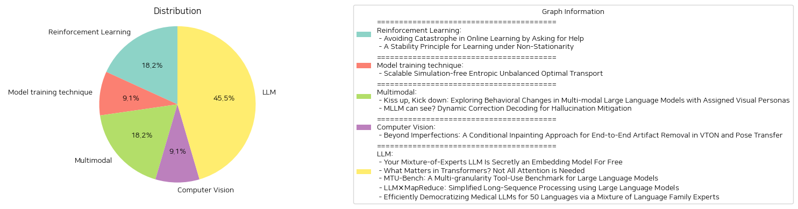

# Daily Artificial Intelligence Insights : Papers

## 🌿 Reinforcement Learning

**요약:**

1. 핵심 주제 및 테마 추출:
   - 첫 번째 논문: 온라인 학습에서 비극적인 실수를 피하기 위해 도움을 요청하는 방법에 중점을 둡니다. 즉, 온라인 학습 과정에서 비복구 실수를 최소화하고 멘토에게 도움을 요청하여 이러한 위험을 피하는 방법을 제안합니다.
   - 두 번째 논문: 비정상적인 환경에서의 학습을 위해 안정성 원칙을 적용하는 것을 다룹니다. 과거 데이터를 최대한 활용하여 누적 편향을 줄이는 방법을 개발합니다.
   
2. 공통 키워드 및 트렌드:
   - "온라인 학습", "비극적 위험", "안정성", "비정상성", "학습 알고리즘", "멘토", "기대 손해(후회)", "최적화", "데이터 활용" 등이 각 논문에서 반복적으로 등장합니다.
   
3. 주요 사건 및 정보 요약:
   - 첫 번째 논문에서는 온라인 학습에서 비극적 실수를 피하기 위해 멘토에게 도움을 요청하는 새로운 문제 설정을 제안합니다. 결과적으로, 멘토의 정책 클래스가 학습 가능하다면 비극적 위험이 있는 경우에도 학습이 가능하다는 것을 보여줍니다.
   - 두 번째 논문에서는 비정상적인 학습 환경에서도 최적의 학습을 유지하기 위한 프레임워크를 개발하고, 과거 데이터를 활용하면서도 누적 편향을 효과적으로 관리하는 방법을 제안합니다.
   
4. 이러한 사건들이 각 부문에 미치는 영향 분석:
   - 교육 분야에서는 비극적 실수를 피하기 위한 전략이 학습 효율성을 증대시키는데 도입될 수 있습니다. 이는 학습자들이 보다 안전한 환경에서 학습 가능한 시스템 설계를 가능하게 할 수 있습니다.
   - 기술 및 데이터 과학에서는 비정상적 데이터 환경에서도 안정적인 분석 결과를 제공할 수 있는 프레임워크가 도움이 될 것입니다. 이는 예측 모델의 정확성을 높이는 데 기여할 수 있습니다.
   
5. 결론 및 잠재적 미래 개발:
   - 전반적으로 비정상적 환경이나 비복구 실수의 위험이 존재하는 상황에서 학습 능력을 향상시키는 전략들이 제안되고 있습니다. 이는 향후 다양한 데이터 환경에서의 학습 알고리즘 개발에 중요할 수 있으며, 더 안전하고 효율적인 학습 시스템을 개발하는 기초가 될 수 있습니다. 이를 통해 지속 가능한 인공지능 및 기계 학습 시스템의 발전이 기대됩니다.

**출처:**

 - Avoiding Catastrophe in Online Learning by Asking for Help (https://deeplearn.org/arxiv/533114/avoiding-catastrophe-in-online-learning-by-asking-for-help)
 - A Stability Principle for Learning under Non-Stationarity (https://deeplearn.org/arxiv/534502/a-stability-principle-for-learning-under-non-stationarity)

## 🎈 Model training technique

**요약:**

보고서 요약:

1. 주요 주제 및 테마:
   - 논문에서는 최적 수송 문제에서 두 분포 간의 수송 맵을 최적화하여 주어진 비용 함수를 최소화하는 문제를 다룹니다.
   - 엔트로피가 조정된 불균형 최적 수송(EUOT) 문제를 해결하는 새로운 방법을 제시합니다.
   - 이 방법은 머신러닝의 생성 모델링 및 이미지 간 변환과 같은 다방면에 응용이 가능합니다.

2. 공통 키워드, 트렌드 및 패턴:
   - "최적 수송," "엔트로피," "생성 모델링," "이미지 변환," "시뮬레이션-프리," "확장성"
   - 실제 시뮬레이션 없이 문제를 해결하는 확장성이 높은 알고리즘의 지속적인 발전.

3. 주요 이벤트 및 중요 정보 요약:
   - 새로운 시뮬레이션-프리 알고리즘 SF-EUOT는 기존의 비용이 비싼 시뮬레이션을 사용하지 않고 최적 수송 문제를 해결합니다.
   - EUOT 문제의 동적 형태를 도출하고, 이를 통해 확률적 최적 제어 해석에서의 최적 조건을 얻었습니다.
   - 이 방법은 기존의 슈뢰딩거 브리지(SB) 방법보다 생성 모델링 및 이미지 간 변환에서 뛰어난 확장성을 보여줍니다.

4. 이러한 이벤트의 다양한 분야에 미치는 영향 분석:
   - 머신러닝 분야에서 비용 및 시간 절감 효과로 인해 생성 모델링의 효율성이 증대될 것입니다.
   - 다양한 응용 분야에서 이미지 간 변환의 정확도와 효율성이 향상될 것입니다.
   - 데이터 과학 및 컴퓨터 비전 분야에서 엔트로피 기반 수학적 모델링의 발전 가능성을 보입니다.

5. 최종 통합 요약 및 결론, 미래의 발전 가능성:
   - 본 연구는 엔트로피가 조정된 최적 수송 문제의 실용적인 해결책을 제공하며, 기존 방법과 비교했을 때 훈련 시간이 줄어들고 확장성이 향상됩니다.
   - 미래의 연구는 이러한 방법을 사용하여 더욱 다양한 데이터 세트와 복잡한 시나리오에 적용하여 활용할 것으로 기대됩니다.
   - 특히, 머신러닝과 인공지능 분야에서 시뮬레이션 비용을 줄이고, 효율성을 높이기 위한 연구가 지속될 전망입니다.

**출처:**

 - Scalable Simulation-free Entropic Unbalanced Optimal Transport (https://deeplearn.org/arxiv/532714/scalable-simulation-free-entropic-unbalanced-optimal-transport)

## 🌿 Multimodal

**요약:**

요약 보고서:

1. 주요 주제 및 테마 추출:
   - 첫 번째 논문은 다중모달 대형 언어 모델(MLLMs)이 시각적 페르소나에 따라 행동을 조정할 수 있는지를 탐구합니다. 특히 공격성에 중점을 두어, 시각적 페르소나가 언어 모델의 협상 행동에 미치는 영향을 분석합니다.
   - 두 번째 논문은 MLLMs의 환각 현상을 줄이기 위한 동적 수정 디코딩 방법을 제안합니다. 시각적 객체를 인식하는 초기 레이어에서는 정확한 반면, 최종 출력에서 오류가 발생하는 문제를 다루고 있습니다.

2. 공통 키워드, 트렌드, 패턴 식별:
   - 다중모달 대형 언어 모델(MLLMs)의 적용 및 그에 따른 행동 변이
   - 시각적 정보와 텍스트 정보의 통합 및 그로 인한 환각 현상
   - 새로운 데이터셋과 분석 기법을 통한 실험적 접근

3. 주요 이벤트 및 중요한 정보 요약:
   - 첫 번째 논문에서는 5천 개의 가상 아바타 이미지를 활용하여 시각적 페르소나와 MLLMs의 협상 행동 간의 관계를 연구하였습니다. 연구 결과에 따르면, MLLMs는 이미지의 공격성을 사람과 유사하게 평가하고, 자기보다 덜 공격적인 상대의 경우 더 공격적인 협상 행동을 보이는 반면, 상대가 더 공격적일 경우 덜 공격적인 행동을 보였습니다.
   - 두 번째 논문에서는 MLLMs의 환각 문제를 해결하기 위한 동적 수정 디코딩 방법(DeCo)을 제안하였습니다. 이를 통해 각종 벤치마크에서 환각률이 크게 감소함을 검증하였습니다.

4. 이러한 사건들의 영향 분석:
   - 시각적 페르소나와의 상호작용은 MLLMs의 협상 행동 및 의사결정의 복합성을 높이며, 다양한 상황에서의 모델 동작을 더욱 이해하게 합니다.
   - DeCo는 MLLMs의 신뢰성을 높이고, 다양한 응용 분야에서 환각 문제를 해결하는 데 기여할 수 있는 가능성을 보여줍니다.

5. 결론 및 미래 발전 전망:
   - 다중모달 대형 언어 모델의 지속적인 발전은 시각적 요소와 텍스트 기반 의사 결정 간의 상호작용을 심화시킬 것입니다.
   - 환각을 줄이기 위한 새로운 기술들은 언어 모델의 정확성과 신뢰성을 크게 향상시킬 것입니다.
   - 이러한 연구는 MLLMs가 상호작용하는 다양한 환경에서 효율적으로 작동할 수 있도록 하는 데 필수적인 기반을 제공합니다. 앞으로는 더 다양한 시각적 요소와의 결합 및 이에 따른 행동 패턴의 분석이 중요해질 것입니다.

**출처:**

 - Kiss up, Kick down: Exploring Behavioral Changes in Multi-modal Large Language Models with Assigned Visual Personas (https://deeplearn.org/arxiv/533364/kiss-up,-kick-down:-exploring-behavioral-changes-in-multi-modal-large-language-models-with-assigned-visual-personas)
 - MLLM can see? Dynamic Correction Decoding for Hallucination Mitigation (http://arxiv.org/abs/2410.11779v1)

## 🎠 Computer Vision

**요약:**

요약 보고서:

1. 주요 주제 및 테마 추출:
   - 논문의 주요 주제는 '조건부 인페인팅 기법을 이용한 생성된 이미지의 결함 제거'입니다.
   - 가상 착의(VTON) 및 자세 변환 응용 프로그램에서 발생하는 인공물 문제를 강조하고 있습니다.
   - 이미지 처리 및 컴퓨터 비전 분야에서의 새로운 표준 설정을 목표로 합니다.

2. 공통 키워드, 트렌드, 패턴 파악:
   - 조작적 인공물, 이미지 품질 저하, 사용자 경험 영향, 조건부 인페인팅, 데이터세트 생성 등이 반복적으로 나타나는 키워드입니다.
   - 인공지능을 활용한 특정 문제 해결 및 일반화된 프레임워크 개발이 주된 연구 동향으로 보입니다.

3. 각 논문의 주요 이벤트 및 핵심 정보 요약:
   - VTON 및 자세 변환 작업에서 시각적 인공물로 인해 사용자 경험이 저하됨을 지적했습니다.
   - 새로운 조건부 인페인팅 기술을 도입하여 이러한 결함을 인식하고 제거하는 방법을 개발했습니다.
   - 전용 데이터세트를 구축하여 결함을 강조하는 마스크가 포함된 데이터와 함께 제공했습니다.
   - 실험 결과, 이 방법이 인공물을 효과적으로 제거하고 최종 이미지의 시각적 품질을 크게 향상시켜 새로운 컴퓨터 비전 및 이미지 처리 기준을 세웠습니다.

4. 이러한 사건들이 다양한 분야에 미치는 영향 분석:
   - 가상 착의 및 자세 변환 기술의 품질 향상은 사용자 충족도를 높이고, 이로 인해 전자상거래 및 디지털 패션 산업에서 응용 가능성이 증가합니다.
   - 이미지 처리 기술 향상은 다양한 디지털 미디어 및 그래픽 디자인 분야에서도 긍정적인 영향을 미칠 것입니다.

5. 결론 및 장래 발전 사항:
   - 이 연구는 향후 인공 지능 기반 이미지 처리 기술 발전에 있어 중요한 기틀을 마련했습니다.
   - 조건부 접근 방식을 계속 확장하여 다양한 이미지 왜곡 문제에 대한 해결책을 제공할 가능성이 있습니다.
   - 향후 발전 가능성으로는 기술의 고도화와 실시간 처리 능력의 향상이 기대됩니다.

**출처:**

 - Beyond Imperfections: A Conditional Inpainting Approach for End-to-End Artifact Removal in VTON and Pose Transfer (https://deeplearn.org/arxiv/534386/beyond-imperfections:-a-conditional-inpainting-approach-for-end-to-end-artifact-removal-in-vton-and-pose-transfer)

## 🍊 LLM

**요약:**

종합 보고서:

1. **주요 주제 및 테마의 추출**
   - `Embedding Models`와 `Mixture-of-Experts (MoE)`: 대형 언어 모델(LLM)의 잠재력과 MoE LLM이 임베딩 모델로서 어떻게 추가적인 미세 조정 없이 다양한 임베딩 중심 과제에서 유망한 성능을 발휘할 수 있는지에 대한 연구.
   - `Redundancy in Transformers`: 트랜스포머 기반 대형 모델에서의 중복성 문제와 이를 해결하기 위한 주의(attention)층 및 MLP층의 가지치기 전략.
   - `Tool-Use Benchmark`: LLM의 도구 사용 능력을 평가하기 위한 다중 그레인툭(Multi-granularity) 벤치마크의 개발.
   - `Long-Sequence Processing`: 긴 텍스트를 효과적으로 처리하기 위한 프레임워크, LLM×MapReduce의 소개 및 실험적 검증.
   - `Multilingual Medical LLMs`: 다국어를 지원하는 의료용 대형 언어 모델을 개발하기 위한 MoE 라우팅 방법 및 언어 가족 전문가를 활용한 접근법.

2. **공통 키워드, 경향, 패턴 식별**
   - `효율성`과 `모듈성`은 여러 논문에서 중심적인 주제로 다루어지며, 특히 모델의 성능 향상 및 중복성 문제 해결에 초점을 맞추고 있음.
   - `다언어 지원`은 글로벌 응용 프로그램을 대상으로 LLM의 현지 적응성을 높이는 중요 요소로 다뤄짐.
   - `무엇이 중요한가?`라는 질문을 통해 LLM 및 트랜스포머 아키텍처의 비효율적인 부분 식별 및 개선 방법 모색.

3. **주요 사건 및 중요 정보 요약**
   - `MoE LLMs`: MoE LLM의 전문가 라우터가 기존 임베딩 모델로 사용될 수 있으며, RW와 HS의 결합이 보다 효과적임이 실험적으로 입증됨.
   - `Transformer Redundancy`: 트랜스포머의 주의층에서 중복성을 제거함으로써 성능 손실 없이 모델의 속도를 크게 향상할 수 있음을 입증.
   - `MTU-Bench`: 도구 사용 평가 기준의 다양성을 확장하여 LLM의 실제 응용에 더 가까운 환경을 시뮬레이션.
   - `LLM×MapReduce`: 긴 텍스트의 문맥적 이해를 위한 프레임워크로, 문서 분할 및 결과 종합을 통해 정보 손실을 최소화하는 전략 제공.
   - `Medical LLMs`: 다언어 지원을 강화하기 위해 언어 특정 전문가 및 언어 가족 전문가를 활용한 루팅 방법으로 다국적 모델의 확장 가능성 탐색.

4. **이벤트의 영향 분석**
   - 기술적 발전: 각 논문은 특정 기술적 문제를 개선하는 방법론을 제안하며, 이는 임베딩, 트랜스포머 아키텍처, 도구 사용 평가, 장문 텍스트 처리, 다국어 의료 모델 등 다양한 분야에서의 효율성 향상으로 이어짐.
   - 언어 및 문화적 다변성: 다국어 지원 확장은 글로벌 시장에서 의료 및 기타 서비스 접근성을 높이는 중요 요인으로 작용.

5. **최종 통합 요약, 결론 및 미래 개발 전망**
   - 종합적으로, 다양한 연구들은 LLM의 효율성, 확장 가능성, 그리고 실질적 응용을 위한 유연성 개선에 주목하고 있음.
   - 이러한 개선은 데이터 중복성 관리, 다중 언어 지원 및 도구 사용 적합성 확대 등을 포함하여, 미래의 LLM이 보다 포괄적이고 접근 가능한 솔루션을 제공할 수 있도록 기여할 것으로 예상됨.
   - 미래 개발 방향으로는 기술을 넘어 사용자 경험을 극대화하고 다양한 문화적 맥락에서의 응용 가능성을 지속적으로 탐색하는 것이 필요.

**출처:**

 - Your Mixture-of-Experts LLM Is Secretly an Embedding Model For Free (http://arxiv.org/abs/2410.10814v2)
 - What Matters in Transformers? Not All Attention is Needed (http://arxiv.org/abs/2406.15786v5)
 - MTU-Bench: A Multi-granularity Tool-Use Benchmark for Large Language Models (http://arxiv.org/abs/2410.11710v1)
 - LLM$\times$MapReduce: Simplified Long-Sequence Processing using Large Language Models (http://arxiv.org/abs/2410.09342v1)
 - Efficiently Democratizing Medical LLMs for 50 Languages via a Mixture of Language Family Experts (http://arxiv.org/abs/2410.10626v1)

