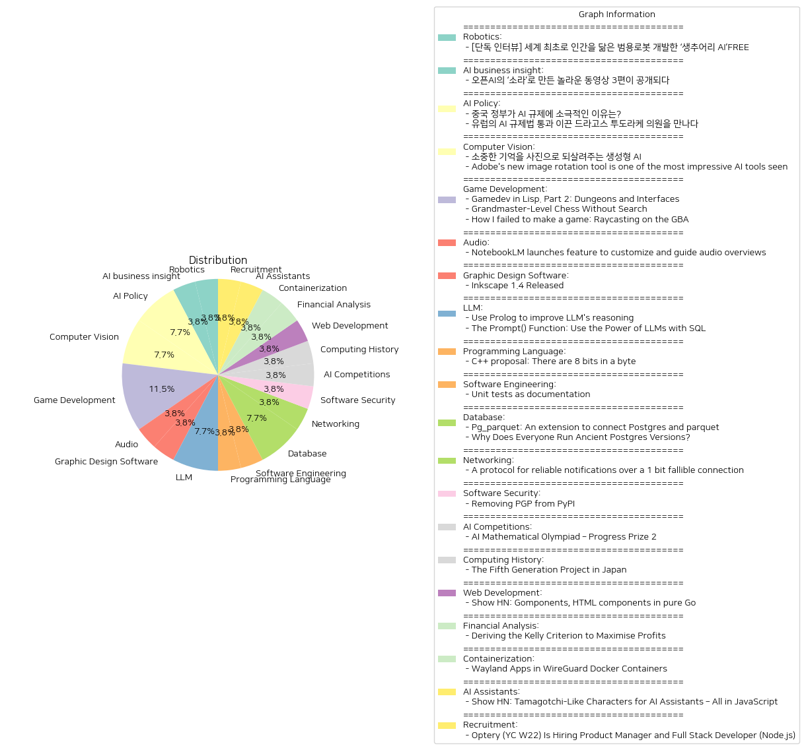

# Daily Artificial Intelligence Insights : News

## ☀️ Robotics

**요약:**

1. **핵심 주제**:
   - 인간을 닮은 범용 로봇 개발
   - AI와 로봇 기술 발전
   - 기술의 사회적 및 일상 생활 속 응용

2. **주요 사건**:
   - 캐나다 AI 로봇 전문기업 생추어리 AI는 인간과 유사한 범용 로봇을 개발하고 있으며, 복잡하고 다양한 일상 속 상황에 유연하게 대응할 수 있는 로봇을 만드는 것을 목표로 하고 있다.
   - 조르디 로즈 CEO는 미래의 로봇에 대한 비전을 인터뷰를 통해 공개하였다.

3. **영향 분석**:
   - **경제적 측면**: 인간과 유사한 범용 로봇의 개발은 노동 시장에 큰 변화를 가져올 수 있으며, 특히 다양한 산업 분야에서의 자동화가 가속화될 가능성이 있다.
   - **사회적 측면**: 이러한 로봇의 등장은 일상 생활에서의 인간 활동을 보조하거나 대체할 수 있어 사회적 및 윤리적 논의가 필요하게 된다.
   - **기술적 측면**: AI와 로봇 기술의 발전은 다른 분야의 기술 혁신에도 기여할 수 있으며, 인공지능 활용 사례가 증가할 것으로 보인다.

4. **최종 요약**:
   세계 최초로 인간을 닮은 범용 로봇을 개발한 캐나다의 생추어리 AI는 AI 기술을 활용하여 로봇이 복잡하고 빠르게 변화하는 일상 상황에 대응할 수 있도록 함으로써 로봇 공학 분야의 새로운 지평을 열고 있다. 이런 기술의 발전은 경제, 사회 및 기술 분야에 걸쳐 중요한 변화를 가져올 것이며, 이에 따른 자동화의 가속화와 노동 시장의 변화, 윤리적 논의가 주요 과제로 대두될 것이다. 미래에는 이러한 로봇이 다양한 산업과 일상 생활에 더욱 깊이 관여하게 될 것으로 예상되며, 이에 대한 지속적인 연구와 논의가 필요할 것이다.

**출처:**

 - [단독 인터뷰] 세계 최초로 인간을 닮은 범용로봇 개발한 ‘생추어리 AI’FREE (https://www.technologyreview.kr/%ec%9d%b8%ed%84%b0%eb%b7%b0-%ec%83%9d%ec%b6%94%ec%96%b4%eb%a6%ac-ai%ea%b0%80-%ea%b7%b8%eb%a6%ac%eb%8a%94-%eb%af%b8%eb%9e%98%ec%9d%98-%eb%a1%9c%eb%b4%87%ec%9d%80-%ec%8b%a4%ec%b2%b4%ed%99%94/)

## 💙 AI business insight

**요약:**

**1. 주요 테마**:
    - AI 기술과 창의성: 오픈AI의 새로운 동영상 생성 모델 '소라'를 통해 창의적으로 제작된 3편의 동영상이 주목을 받고 있음.
    - 협력과 제작 과정: 크리에이터들이 소라를 활용하여 어떻게 제작했는지에 관한 이야기들이 강조됨.

**2. 주요 사건**:
    - 오픈AI는 2월 중순에 새로운 동영상 생성 모델 '소라'를 출시.
    - 여러 영상 크리에이터들이 소라를 이용하여 3편의 동영상을 제작하여 공개.
    - 크리에이터들은 영상 제작 목적과 기법에 대해 다양한 인사이트를 공유.

**3. 영향 분석**:
    - **경제**: 창의적인 콘텐츠 제작에 AI의 참여가 산업에서 새로운 기술 발전을 촉진하고 창작의 비용 및 시간을 줄일 가능성을 제시.
    - **사회**: AI를 통한 새로운 예술 표현 방식이 각광받으며, 기술과 예술의 융합에 대한 사회적 인식이 확대될 것으로 전망.
    - **기술**: AI 모델의 발전이 인간 크리에이터의 작업 방식을 어떻게 보완하거나 혁신할 수 있을지에 대한 논의가 활발히 진행될 것.

**4. 최종 요약**:
    오픈AI의 '소라'는 AI 기술의 뛰어난 창의성 발휘를 보여주며 영상 창작 분야에서 중요한 혁신을 일으키고 있다. 이러한 기술의 도입은 경제와 사회 전반에 걸쳐 기존의 창작 방식을 변화시키며 새롭게 발전할 가능성을 가진다. 추후 더 많은 분야에서 AI의 창의적인 활용이 나타날 가능성이 크며, 이로 인해 사회적 논의가 활발히 이루어질 것으로 예상된다. 앞으로 AI와 인간의 협력적 창작 과정이 어떻게 발전할지에 주목해야 할 것이다.

**출처:**

 - 오픈AI의 ‘소라’로 만든 놀라운 동영상 3편이 공개되다 (https://www.technologyreview.kr/%ec%98%81%ec%83%81-%ec%83%9d%ec%84%b1-%eb%aa%a8%eb%8d%b8-%ec%86%8c%eb%9d%bc%eb%a1%9c-%eb%a7%8c%eb%93%a0-%eb%86%80%eb%9d%bc%ec%9a%b4-%ec%98%81%ed%99%94-3%ed%8e%b8%ec%9d%b4-%ea%b3%b5%ea%b0%9c%eb%90%98/)

## 🍋 AI Policy

**요약:**

1. **주요 주제**:
   두 기사 모두 AI(인공지능)에 관한 규제로 집중되고 있다. 첫 번째 기사는 중국의 AI 규제에 대한 입장을 다루고 있으며, 두 번째 기사는 유럽연합(EU)의 AI 규제법 통과에 관한 내용을 중점으로 하고 있다. AI 기술 발전에 따른 각 국가 및 지역별 규제 접근 방식이 주요 주제로 나타나고 있다.

2. **주요 사건**:
   - 중국 정부는 소비자 기술 플랫폼에 비해 AI 규제에 있어 비교적 느슨한 태도를 유지하고 있으며, 이는 자국 AI 산업의 성장을 장려하기 위한 의도적인 방침으로 보인다.
   - 드라고스 투도라케 의원은 유럽의회에서 AI 규제법의 통과를 이끈 주요 인물 중 하나이며, 이 규제법은 AI 산업의 개선과 안전성을 강화할 수 있는 기초를 마련하는 것을 목표로 한다.

3. **영향 분석**:
   - 경제: 중국의 느슨한 규제 태도는 AI 산업의 급속한 발전과 경쟁력을 높일 수 있는 환경을 조성할 수 있다. 반면, 엄격한 규제는 산업 발전의 속도를 늦출 가능성도 존재한다.
   - 정치: 유럽의 AI 규제법 통과는 EU의 기술 정책 방향성을 명확히 할 뿐만 아니라, 다른 지역의 규제 전략에 영향을 미칠 수 있다. 이는 글로벌 AI 규제 프레임워크 형성에 중요한 역할을 할 수 있다.
   - 사회: AI 기술의 규제는 사회적 안전과 윤리적 사용에 대한 기준을 마련하고, 기술 발전에 따른 잠재적 위험을 감소시키는 데 기여할 수 있다.

4. **최종 요약**:
   요약하면, AI 기술 발전에 따라 각 지역의 규제 접근 방식이 다르게 나타나고 있으며, 이는 경제와 사회, 정치 전반에 걸쳐 다양한 영향을 미치고 있다. 중국은 AI 규제를 느슨하게 하여 기술 산업 발전에 집중하고 있으며, EU는 엄격한 규제를 통해 AI 기술의 안전성과 윤리적 사용을 보장하려고 한다. 앞으로 각국의 AI 규제 정책이 글로벌 기술 경쟁과 사회 전반에 미칠 영향에 대해 주시할 필요가 있다. 이는 국제적 협력과 조화된 규제가 더욱 중요해질 가능성을 시사한다.

**출처:**

 - 중국 정부가 AI 규제에 소극적인 이유는? (https://www.technologyreview.kr/%ec%a4%91%ea%b5%ad-%ec%a0%95%eb%b6%80%ea%b0%80-%ed%98%84%ec%9e%ac%eb%a1%9c%ec%84%9c%eb%8a%94-ai-%eb%b6%84%ec%95%bc%eb%a5%bc-%ea%b0%80%ed%98%b9%ed%95%98%ea%b2%8c-%ea%b7%9c%ec%a0%9c%ed%95%98%ec%a7%80/)
 - 유럽의 AI 규제법 통과 이끈 드라고스 투도라케 의원을 만나다 (https://www.technologyreview.kr/ai-%ea%b7%9c%ec%a0%9c%eb%b2%95-%ed%86%b5%ea%b3%bc-%ec%9d%b4%eb%81%88-%eb%93%9c%eb%9d%bc%ea%b3%a0%ec%8a%a4-%ed%88%ac%eb%8f%84%eb%9d%bc%ec%bc%80-%ec%9d%98%ec%9b%90%ec%9d%84-%eb%a7%8c%eb%82%98%eb%8b%a4/)

## 🧸 Computer Vision

**요약:**

1. **핵심 테마**:
   - 두 기사에서 공통으로 다루고 있는 주요 테마는 생성형 AI와 그 응용 기술에 관한 것이다. 각각의 프로젝트에서 AI가 창의적이고 혁신적인 방식으로 사용되고 있다. '합성 기억' 프로젝트와 Adobe의 새로운 이미지 회전 도구는 모두 AI를 활용하여 이미지를 생성하고 보강하는 기술을 선보이고 있다.

2. **주요 이벤트**:
   - 첫 번째 기사에서는 생성형 AI를 사용하여 사람들이 카메라에 담지 못했던 과거의 추억을 이미지로 변환해주는 '합성 기억' 프로젝트가 진행되고 있다는 점을 강조하고 있다. 이 프로젝트는 개인과 가족이 잊고 있던 중요한 순간을 시각적으로 되살리는 데 중점을 두고 있다.
   - 두 번째 기사에서는 Adobe가 MAX 행사에서 공개한 Project Turntable에 대해 설명한다. 이 도구는 2D 벡터 아트를 3D로 회전시키면서 원래 형태를 유지할 수 있도록 돕는 기능을 가지고 있으며, AI 기술을 활용해 빈틈을 메워준다.

3. **영향 분석**:
   - 사회적 측면에서는 '합성 기억' 프로젝트가 개인의 기억과 감정을 시각화함으로써 가족 및 공동체의 결속을 강화할 수 있는 긍정적인 효과를 가져올 수 있다.
   - 경제적 측면에서는 Adobe의 Project Turntable과 같은 AI 도구는 그래픽 디자인 및 창의적인 산업 내 워크플로우를 크게 개선할 수 있어 생산성 향상을 가져올 가능성이 크다. 이는 아티스트 및 디자이너들의 작업 효율성을 높이며, 전반적인 시장의 경쟁력을 강화할 수 있다.

4. **최종 요약**:
   - 종합적으로 보면 생성형 AI 기술의 발전이 다양한 분야에 걸쳐 창의성과 효율성을 촉진하고 있음을 알 수 있다. '합성 기억'과 Adobe의 Project Turntable 모두 A.I. 기술을 사용하여 사용자 경험을 향상시키는 데 중점을 두고 있다. 앞으로 AI의 발전이 개인 생활, 사회적 상호작용, 상업적 디자인 분야에서 어떤 새로운 가능성을 열어줄지 주목할 필요가 있다. 이 기술들이 보다 광범위하게 채택됨에 따라, 개인화된 경험과 혁신적인 디자인 도구의 발전을 통해 삶의 질이 향상될 것으로 예상된다.

**출처:**

 - 소중한 기억을 사진으로 되살려주는 생성형 AI (https://www.technologyreview.kr/%ec%83%9d%ec%84%b1%ed%98%95-ai%eb%a1%9c-%ea%b0%80%ec%9e%a5-%ec%86%8c%ec%a4%91%ed%95%9c-%ea%b8%b0%ec%96%b5%ec%9d%84-%ec%82%ac%ec%a7%84%ec%9c%bc%eb%a1%9c-%eb%a7%8c%eb%93%a0%eb%8b%a4/)
 - Adobe's new image rotation tool is one of the most impressive AI tools seen (https://www.creativebloq.com/design/adobes-new-image-rotation-tool-is-one-of-the-most-impressive-ai-concepts-weve-seen)

## 🚀 Game Development

**요약:**

**주요 주제**:

1. **게임 개발**: Lisp를 이용한 게임 개발, 특히 Entity-Component-System(ECS) 마이크로프레임워크를 중심으로 한 시스템 개발의 중요성을 다루고 있습니다.
2. **인공지능과 체스**: 거대 언어 모델을 이용한 체스 플레이에서 인간 수준을 넘어서는 성과를 보고, AI와 기존 체스 알고리즘의 경쟁력 비교가 주요 테마로 흥미로운 결과를 제시합니다.
3. **기술적 도전과 실패**: GBA 플랫폼에서 레이캐스팅 엔진 개발을 시도한 경험을 통해 도전과 실패의 현실, 그리고 이와 관련된 기술적 배움의 공유를 강조하고 있습니다.

**주요 이벤트**:

1. **ECS 마이크로프레임워크**: 간단하면서도 강력한 속도의 ECS 시스템이 개발되어 게임 개발자들에게 중요한 리소스로 제공됩니다.
2. **AI 체스 모델의 발전**: 2억 7천만 개 파라미터를 가진 변환기 모델이 별도의 검색 알고리즘 없이도 높은 수준의 체스 능력을 발휘함으로써, 인공지능의 새로운 가능성과 방향성을 제시합니다.
3. **GBA 레이캐스팅 엔진의 실패**: Raycasting 기술을 GameBoy Advance에서 구현하려던 프로젝트가 물리적 제한과 소진으로 인한 포기로 끝난 과정을 통해 기술적 도전의 어려움을 조명합니다.

**영향 분석**:

1. **경제**: 게임 개발 분야에서 효율적 시스템의 등장은 개발 비용 절감과 효율성 향상에 기여할 수 있습니다.
2. **사회와 기술**: AI가 체스와 같은 복잡한 영역에서 인간을 능가하는 능력을 보이면서, AI의 활용 분야가 더욱 넓어지고 그 중요성이 확대될 것입니다.
3. **개발 커뮤니티**: 실패한 프로젝트 사례는 새로운 도전을 위한 학습의 기회를 제공하고, 개발자들 간의 정보 및 기술 공유의 필요성을 부각시킵니다.

**최종 요약**:

이번 뉴스에서는 게임 개발의 효율성을 높이는 기술적 혁신과 AI 체스 모델의 뛰어난 성과, 그리고 기술적 도전과 실패로부터의 학습이 주된 관심사였습니다. 이러한 발전은 게임 개발 환경의 변화와 AI 기술의 혁신을 통해 경제와 사회 전반에 긍정적인 영향을 미칠 것으로 보입니다. AI의 지속적인 발전과 새로운 게임 개발 툴의 등장은 미래 개발자들에게 여러 가지 기회를 제공할 것으로 전망됩니다. 이런 발전 추세는 앞으로도 더욱 더 주목할 필요가 있으며, AI와 게임 개발 기술의 융합이 가져올 새 시대를 준비할 필요가 있을 것입니다.

**출처:**

 - Gamedev in Lisp. Part 2: Dungeons and Interfaces (https://gitlab.com/lockie/cl-fast-ecs/-/wikis/tutorial-2)
 - Grandmaster-Level Chess Without Search (https://github.com/google-deepmind/searchless_chess)
 - How I failed to make a game: Raycasting on the GBA (https://mcejp.github.io/2024/10/16/gba-raycasting.html)

## 👽 Audio

**요약:**

1. **주요 테마**:
   - 기술 혁신: NotebookLM의 새로운 기능 출시를 통해 복잡한 정보를 보다 효과적으로 이해할 수 있도록 돕는 기술적 진보가 이루어지고 있다.
   - 비즈니스 강화: NotebookLM Business 버전 출시를 통해 기업과 조직에 특화된 고급 기능을 제공하며 비즈니스 분야에서의 활용성이 강조된다.

2. **주요 이벤트**:
   - NotebookLM은 고급 기능인 대화 가이드 및 백그라운드 리스닝 기능을 추가하여 사용자 경험을 향상시키고 있다.
   - NotebookLM Business는 곧 출시될 예정이며, 파일럿 프로그램을 통해 초기 접근이 가능하다. 이는 기업 및 조직에 특화된 기능을 제공할 예정이다.

3. **영향 분석**:
   - 경제적 측면: 새로운 기능 출시를 통해 NotebookLM의 사용자 기반이 넓어지며, 이는 소프트웨어 판매 및 관련 경제 활동 증가에 긍정적 영향을 미칠 수 있다.
   - 사회적 측면: 보다 효율적인 정보 이해 기술이 제공됨에 따라 다양한 분야에서 사용자의 생산성 개선 및 지식 확대가 기대된다.
   - 비즈니스 분야: 기업 및 조직에 맞춤형 기능을 제공함으로써 비즈니스 환경에서의 복잡한 정보 관리가 보다 쉬워지고, 업무 효율성과 협업이 증대될 것이다.

4. **최종 요약**:
   NotebookLM의 기능 확장은 기술 혁신의 좋은 사례를 보여주며, 사용자가 정보를 더 잘 이해하고 활용할 수 있도록 돕는다. 비즈니스 버전의 출시는 특히 기업과 조직에서의 실질적 활용도를 높여줄 가능성을 내포하고 있다. 이러한 기술 발전은 미래의 정보 관리 및 활용 방법에 대한 청사진을 제시하며, 향후 발전 방향으로는 추가 기능의 지속적 업데이트 및 사용자 경험의 극대화가 될 것이다. 또한, 이러한 변화는 AI 기반의 업무 지원 도구의 지속적 확장 가능성을 시사한다.

**출처:**

 - NotebookLM launches feature to customize and guide audio overviews (https://blog.google/technology/ai/notebooklm-update-october-2024/)

## 🍋 Graphic Design Software

**요약:**

1. **주요 주제**:
   Inkscape의 새로운 버전 출시라는 주제를 중심으로 사용자 경험 향상, 사용자 지정 옵션 강화, 접근성 개선 등이 반복적으로 드러납니다.

2. **주요 이벤트**:
   Inkscape가 버전 1.4를 출시하며, 사용자 맞춤형 기능과 접근성 향상을 위한 새로운 기능들을 선보였습니다. 주요 업데이트로는 필터 갤러리, 개선된 그리드 선택기, 사용자 지정 가능한 폰트 브라우저 미리 보기가 포함됩니다.

3. **영향 분석**:
   이와 같은 소프트웨어 업그레이드는 그래픽 디자인 분야에 직접적인 영향을 미칩니다. 특히, 전문 디자이너와 아마추어 사용자 모두에게 향상된 기능 제공으로 인해 사용자 경험이 크게 개선될 것입니다. 또한, 접근성 강화로 다양한 사용자 층의 이용 가능성을 증대시킬 수 있습니다. 이러한 변화는 오픈 소스 그래픽 도구의 가치와 인지도를 높이고, 관련 업계의 경제적 활성화에 긍정적인 영향을 미칠 것으로 예상됩니다.

4. **최종 요약**:
   Inkscape 1.4의 출시는 그래픽 디자인 소프트웨어의 사용자별 맞춤형 기능과 접근성 향상에 중점을 두고 있습니다. 필터 갤러리 및 폰트 브라우저 미리보기와 같은 기능 추가는 향후 사용자 경험을 더욱 풍부하게 할 가능성이 있습니다. 이러한 발전이 그래픽 디자인 업계에 미치는 긍정적인 성과는 앞으로 오픈 소스 소프트웨어의 지속적인 성장을 기대하게 합니다. 앞으로 사용자가 어떤 혁신적인 방식으로 이 새로운 버전을 활용할지, 그리고 경쟁 소프트웨어가 어떻게 대응할지가 주목됩니다.

**출처:**

 - Inkscape 1.4 Released (https://inkscape.org/news/2024/10/13/inkscape-launches-version-14-powerful-new-accessib/)

## 🪄 LLM

**요약:**

**주요 테마**:
모든 뉴스 기사를 관통하는 주요 테마는 '언어 모델의 향상과 통합 방식'입니다. 특히, 고급 추론 능력 향상과 데이터 프로세싱 통합을 위한 새로운 언어와 함수의 활용을 강조하고 있습니다. 반복적으로 언급되는 트렌드는 기계 학습 언어 모델과 전통적인 컴퓨팅 언어 간의 협력입니다.

**주요 사건**:
1. **Prolog을 활용한 LLM 추론 향상**: LLM의 구조적 한계, 특히 반복이나 조건 사용의 한계로 인해 개선의 필요성이 대두됩니다. 이에 대한 해결책으로, Prolog 같은 기호적 추론을 수행할 수 있는 중간 언어를 도입하여 추론 능력을 강화하는 방법이 제시되었습니다.
   
2. **SQL과 LLM 통합을 위한 Prompt() 함수 도입**: MotherDuck은 SQL 내에 소형 언어 모델을 통합할 수 있는 prompt() 함수를 소개하였습니다. 이는 GPT-4o-mini 및 GPT-4o 모델을 지원하며, 텍스트 생성 및 데이터 추출을 단순화하여 구조화된 출력을 제공합니다.

**영향 분석**:
- **경제적 영향**: LLM과의 통합은 데이터 분석 및 추출의 효율성을 높여 기업 및 서비스 제공업체들에게 비용 절감과 경쟁력 강화에 기여할 것입니다.
- **사회적 영향**: 언어 모델과 기호 논리의 결합은 교육, 콘텐츠 생성 및 정보 접근성을 향상시켜 사회 전반에 긍정적인 영향을 미칠 수 있습니다.

**최종 요약**:
이번 뉴스는 언어 모델의 진보와 그것의 새로운 활용 방안을 중심으로 한 혁신적인 발전을 보여줍니다. 특히, Prolog와 같은 고전적 접근 방식의 재통합이 주목되며, SQL과의 결합은 언어 모델의 실용성을 더욱 강화합니다. 향후에는 이러한 기술의 융합이 데이터 과학과 인공지능 분야에 더욱 깊이 침투하여, 실질적인 혁신과 효율성을 제공할 가능성을 지켜볼 필요가 있습니다.

**출처:**

 - Use Prolog to improve LLM's reasoning (https://shchegrikovich.substack.com/p/use-prolog-to-improve-llms-reasoning)
 - The Prompt() Function: Use the Power of LLMs with SQL (https://motherduck.com/blog/sql-llm-prompt-function-gpt-models/)

## 🩵 Programming Language

**요약:**

1. **주요 테마**:
   - 최신 하드웨어 및 소프트웨어 플랫폼과의 일치를 목표로 C++ 언어에서 바이트의 비트 수를 8비트로 공식화하려는 제안이 있습니다.
   - 이러한 제안은 언어와 라이브러리를 간소화하고 호환성을 높여 사용 편의성을 높이려는 데 중점을 두고 있습니다.

2. **주요 이벤트**:
   - C++ 언어 커뮤니티에서 바이트의 정의를 8비트로 확정하려는 공식 제안이 제출되었습니다. 이는 C++ 표준을 최신 하드웨어 및 소프트웨어 플랫폼과 통일하려는 노력의 일환입니다.

3. **영향 분석**:
   - **경제**: 소프트웨어 개발자의 생산성을 높이고, 개발 과정에서 호환성 문제를 줄여 기업의 비용 절감에 도움이 될 수 있습니다.
   - **기술**: 프로그래밍 언어의 간소화는 새로운 개발자를 유인할 수 있으며, 이는 기술 혁신을 가속화하고 새로운 소프트웨어 솔루션의 개발을 촉진할 수 있습니다.
   - **사회**: 이러한 변경은 기술 교육의 표준화를 촉진하여 프로그래밍 기술을 배우는 학생과 신입 개발자의 학습을 더 쉽게 할 수 있습니다.

4. **최종 요약**:
   - C++ 언어에서 바이트의 비트 수를 8비트로 공식화하려는 제안은 소프트웨어 개발의 효율성을 높이고 기술 표준을 현대화하기 위한 중요한 단계입니다. 이는 언어의 호환성을 높이고 사용 편의성을 증대시켜 장기적으로 소프트웨어 산업에 긍정적인 영향을 미칠 수 있습니다. 향후 이러한 표준화가 다른 프로그래밍 언어 및 컴퓨팅 플랫폼에서도 유사한 트렌드를 유발할 수 있는 가능성도 주목할 필요가 있습니다.

**출처:**

 - C++ proposal: There are 8 bits in a byte (https://www.open-std.org/jtc1/sc22/wg21/docs/papers/2024/p3477r0.html)

## 🪸 Software Engineering

**요약:**

1. **주요 주제**:
   - 모든 뉴스 기사에서 반복적으로 등장하는 주제들은 코드 문서화, 소프트웨어 개발 실천 방법, 그리고 테스팅 기법에 크게 관련되어 있습니다. 특히 유닛 테스트의 중요성과 그것이 어떻게 코드의 행동을 설명하며 문서화에 기여하는지에 대한 논의가 눈에 띕니다.

2. **주요 사건**:
   - 유닛 테스트가 코드베이스를 문서화하는 강력한 도구로 작용한다는 것이 강조되고 있습니다. 이러한 테스트는 코드와 항상 동기화되어 있으며, 엣지 케이스까지 다룬다는 점에서 귀중한 역할을 합니다. 효과 최대화를 위해 설명적인 테스트 이름, 원자적 테스트, 간단한 테스트, 독립적인 테스트 같은 모범 사례를 따르는 것이 중요시 되고 있습니다.

3. **영향 분석**:
   - 소프트웨어 개발의 효율성과 신뢰성을 높이는 데 큰 영향을 미칠 수 있습니다. 특히 개발자들이 코드의 유지보수성과 가독성을 강화할 수 있는 방법으로서 유닛 테스트에 의존함으로써, 개발 프로세스의 안정성이 향상되고 오류의 가능성을 줄일 수 있습니다. 이는 기업의 소프트웨어 개발 비용 절감과 개발 트렌드의 긍정적 발전에 기여할 수 있습니다.

4. **최종 요약**:
   - 전반적인 뉴스는 유닛 테스트가 코드를 설명하고 문서화하는 데 있어 필수적이라는 점을 강조하고 있습니다. 이는 소프트웨어 개발의 모범 사례로 자리잡고 있으며, 개발자들이 최적의 결과를 얻기 위해 이러한 테스트 기법을 어떻게 활용해야 하는지에 대한 중요성을 나타내고 있습니다. 향후에는 이러한 모범 사례들이 새로운 소프트웨어 개발 패러다임과 도구의 등장에 어떠한 영향을 미칠지 주목할 필요가 있습니다.

**출처:**

 - Unit tests as documentation (https://www.thecoder.cafe/p/unit-tests-as-documentation)

## ☀️ Database

**요약:**

1. **주요 테마**:
   - PostgreSQL와 관련된 기능 확장성 및 버전 관리가 주요 테마로 확인됨.
   - 데이터 관리 효율성과 관련된 기술적 발전, 특별히 Parquet 파일을 다루는 방법이 강조됨.

2. **주요 사건**:
   - 첫 번째 기사에서는 PostgreSQL 확장 pg_parquet가 PostgreSQL에서 Parquet 파일을 읽고 쓰는 기능을 제공한다는 점이 강조됨. 이로 인해 로컬 디스크나 S3의 Parquet 파일과의 효율적인 데이터 전송 및 분석이 가능해짐.
   - 두 번째 기사에서는 PostgreSQL 구 버전을 사용하는 이유로 업그레이드의 어려움이 지적됨. 새로운 버전으로 업그레이드하는 데 상당한 시간과 자원이 소요되지만, 구 버전을 유지할 경우 성능 개선과 호환성 문제를 놓칠 수 있음.

3. **영향 분석**:
   - **경제적 측면**: PostgreSQL의 기능 확장으로 인한 데이터 처리 효율성 향상은 기업의 운영 비용 절감 및 데이터 분석 역량 강화에 기여할 수 있음.
   - **기술적 측면**: PostgreSQL 사용자들이 고성능과 호환성 정책에 대한 선택을 강요받음으로써 관련 기술 시장에 영향을 줄 것으로 예상됨. 오래된 소프트웨어의 사용은 기술 채택 속도를 늦출 수 있음.
   - **사회적 측면**: 데이터 처리 효율성 증대는 다양한 산업 분야의 혁신과 경쟁력 제고에 기여할 수 있음.

4. **최종 요약**:
   - PostgreSQL 사용자들은 기능 확장을 통해 데이터 분석 및 전송의 효율성을 증대시키고자 함. 단, 업그레이드의 복잡성과 자원 소모로 인해 구버전을 사용하는 관행이 지속되고 있음을 알 수 있음.
   - 향후 PostgreSQL의 기술 발전과 관련한 동향을 주시할 필요가 있으며, 특히 Parquet 파일과의 통합을 통한 데이터 처리 혁신에 관심을 가져야 함.
   - PostgreSQL 업그레이드와 관련한 장애를 극복할 수 있는 방안이 마련된다면, 구버전 사용의 감소와 함께 보다 혁신적인 기능 채택이 활성화될 것으로 기대됨.

**출처:**

 - Pg_parquet: An extension to connect Postgres and parquet (https://www.crunchydata.com/blog/pg_parquet-an-extension-to-connect-postgres-and-parquet)
 - Why Does Everyone Run Ancient Postgres Versions? (https://neon.tech/blog/why-does-everyone-run-ancient-postgres-versions)

## 🎉 Networking

**요약:**

**종합 요약 보고서**

1. **주요 주제**:
   이 뉴스 기사의 주요 주제는 정보 통신 기술 개발과 신뢰성 있는 알림 시스템의 설계입니다. 특히, 제한적인 데이터를 사용하여 효과적인 통신을 가능하게 하는 프로토콜에 중점을 두고 있습니다.

2. **주요 이벤트**:
   기사에서는 클라이언트와 서버 간의 1비트 토큰을 활용한 통신 프로토콜을 설명합니다. 클라이언트는 서버로 1비트 토큰을 전송하고, 서버는 새 메시지가 있는 경우 부정된 토큰으로 응답합니다. 클라이언트는 받은 토큰이 보낸 토큰과 다를 경우, 부가적인 채널을 통해 메시지를 검색합니다.

3. **영향 분석**:
   이런 통신 프로토콜의 발전은 정보 기술 분야에 있어 파급력이 클 수 있으며, 특히 사물인터넷(IoT) 기기나 제한적인 대역폭 환경에서 활용될 수 있습니다. 이를 통해 데이터 전송의 효율성과 안정성이 향상됨에 따라 다양한 IT 서비스와 비용 절감 효과를 가져올 수 있습니다. 사회적으로는 이러한 기술 진보가 새로운 혁신을 촉진하고, 사용자 경험을 향상시키며, 정보 접근성을 높일 수 있습니다.

4. **최종 요약**:
   전체적으로 연구의 핵심은 제한된 데이터와 리소스를 활용하면서 신뢰성 있는 알림을 제공하는 데 중점을 두고 있으며, 이는 앞으로의 정보 통신 기술 발전 방향에 중요한 기준점을 제시합니다. 추후 개발 동향으로는 이러한 방식의 프로토콜이 실제 응용 프로그램 및 서비스에 통합되는 것을 주의 깊게 관찰할 필요가 있습니다. 새로운 기술 표준으로 자리 잡을 가능성이 있고, 데이터 전송의 신뢰성과 효율성을 추구하는 분야에서 지속적인 연구와 발전이 기대됩니다.

**출처:**

 - A protocol for reliable notifications over a 1 bit fallible connection (https://paper.wf/binarycat/a-protocol-for-reliable-notifications-over-a-1-bit-fallible-connection)

## 🤩 Software Security

**요약:**

1. **주요 테마**:
   이번 뉴스에서는 PyPI의 PGP 서명 지원 중단이 주요 테마로 다뤄졌습니다. 이는 디지털 보안 및 소프트웨어 패키지 관리와 관련되어 있으며, 신뢰성과 유지 비용이라는 두 가지 큰 흐름이 관찰됩니다.

2. **주요 사건**:
   PyPI는 PGP 서명 지원을 중단하기로 결정했습니다. 이 결정의 주된 이유는 비교적 낮은 검증률과 높은 유지 비용입니다. 전체 키의 36%만이 의미 있는 검증이 가능했으며, 서명 업로드를 계속 지원할 타당성이 부족하다는 점이 큰 포인트로 작용하고 있습니다.

3. **영향 분석**:
   - **경제적 영향**: PyPI의 결정은 주로 소프트웨어 개발자와 관련 기업에 영향을 미칩니다. 개발자들이 새로운 서명 및 검증 방식에 적응해야 하므로 초기 혼란이 예상되지만, 장기적으로는 유지 비용 절감으로 이어질 수 있습니다.
   - **사회적 영향**: 소프트웨어 보안에 대한 일반적인 신뢰도가 단기적으로 하락할 가능성이 있습니다. 사용자들은 새로운 검증 방식을 익히고 이에 적응해야 할 것입니다.
   - **기술적 영향**: 새로운 보안 방법론의 도입이 불가피해 보이며, 장기적으로는 보다 효율적이고 경제적인 솔루션이 채택될 가능성이 높습니다.

4. **최종 요약**:
   PyPI의 PGP 서명 지원 중단은 디지털 서명 방법론에 대한 새로운 전환점을 제공하고 있습니다. 이는 장기적으로 비용 절감 및 효율적인 검증 체계 확대를 위한 기회가 될 수 있습니다. 그러나, 사용자의 적응 과정에서 단기적으로는 혼란과 보안에 대한 신뢰도 저하가 있을 수 있습니다. 앞으로 PyPI와 비슷한 플랫폼들이 이러한 변화를 어떻게 받아들이고 적용할지 주목할 필요가 있습니다. 이러한 결정이 소프트웨어 산업 전반에 새로운 보안 표준을 제시하는 계기가 될 수도 있습니다.

**출처:**

 - Removing PGP from PyPI (https://blog.pypi.org/posts/2023-05-23-removing-pgp/)

## 🪄 AI Competitions

**요약:**

1. **주요 주제**:
   - AI의 발전, 특히 수학적 추론 능력을 향상시키기 위한 노력이 강조되며, 교육 분야와 기술 발전이 주요 키워드로 나타남.
   - 기술 경진대회를 통한 인공지능 연구의 동향과 발전 방향 제시.

2. **주요 이벤트**:
   - 'AI Mathematical Olympiad Progress Prize 2' 대회가 AI 모델의 수학적 추론 능력을 발전시키기 위해 $1000만의 상금과 더불어 110개의 수학 문제(대수, 조합론, 기하학, 정수론 포함)를 제시.
   - AIMO는 인공지능의 수학 능력 향상을 목표로 하는 경쟁의 일환으로 수행되고 있으며, 이는 인공지능과 알고리즘 발전에 있어 중요한 전환점이 될 것으로 기대됨.

3. **영향 분석**:
   - **경제적 측면**: AI 기술 발전으로 인해 관련 산업의 경제 활동이 활발해지고, AI 기반 솔루션 개발 및 채용 증가가 예상됨. 특히, 수학적 능력을 갖춘 인공지능의 개발은 금융, 연구, 데이터 분석 등 다양한 분야에 파급 효과를 미칠 것으로 보임.
   - **사회적 측면**: 인공지능이 교육 및 연구 분야에 미칠 긍정적인 영향 기대. 향후 교육 시스템에 AI 기반 교구 도입 가능성으로 학습 방법의 혁신 촉진.
   - **기술적 측면**: AI의 수학적 추론 능력 강화는 보다 복잡한 문제 해결을 가능하게 하여, 다양한 분야에서 혁신을 촉진하고, 고차원적인 문제 해결을 요구하는 기술 개발을 가속화할 것으로 예상됨.

4. **최종 요약**:
   - AI Mathematical Olympiad Progress Prize 2는 인공지능의 수학적 능력 향상에 중점을 둔 주요 이벤트로, 관련 분야의 경진대회를 통해 기술적 진보와 경제적 가치 창출을 도모하고 있음. 이러한 이벤트들은 AI 연구의 방향성을 제시하고, 향후 AI가 사회 전반에 미칠 잠재적 영향력을 보여주는 중요한 지표로 작용할 것으로 보임. 미래에는 AI의 발전이 교육 과정에 통합될 가능성이 높고, 이는 장기적으로 더 복잡한 문제 해결 능력을 필요로 하는 기술 발전의 기반을 마련할 것으로 예상됨. 지속적인 연구와 대회가 AI의 능력 확장에 기여할 것으로 기대되며, 이에 대한 모니터링이 필요함.

**출처:**

 - AI Mathematical Olympiad – Progress Prize 2 (https://www.kaggle.com/competitions/ai-mathematical-olympiad-progress-prize-2)

## 🐱 Computing History

**요약:**

1. **주요 테마**:
   - 일본의 컴퓨터 기술 개발 노력
   - 인공지능 운영 체계의 발전
   - 기술 예측과 산업 변화에 대한 일본의 도전

2. **주요 사건**:
   - 일본의 '제5세대 프로젝트'는 4억 달러를 투자하여 새로운 컴퓨터 기술 및 AI 운영 체제를 개발하려 했으나 목표 달성에 실패

3. **영향 분석**:
   - **경제**: 막대한 예산 투입에도 불구하고 성공적인 결과를 얻지 못함에 따라 국가 자원의 비효율적 사용 사례로 이어짐.
   - **정치/사회**: 정부 주도의 프로젝트 실패는 일본의 기술 혁신 역량에 대한 의문 제기 및 기술 예측 능력의 한계를 강조.
   - **기술/산업**: 급변하는 기술 산업 환경에 대한 적응력이 부족함을 드러내며 향후 기술 전략 수립에 대한 교훈 제공.

4. **최종 요약**:
   '제5세대 프로젝트'는 일본의 야심 찬 기술 개발 시도로, 인공지능 및 컴퓨터 기술 분야의 선두 자리를 선점하려는 목적이 있었으나, 성공을 거두지 못해 경제적 손실과 함께 기술 변화에 대한 적응력 부족을 부각시켰다. 이러한 실패는 미래 기술 예측과 신속한 산업 변화에의 대응 능력을 강화해야 할 필요성을 일깨우며, 향후 일본이 보다 실질적이고 미래지향적인 기술 개발 전략을 수립하는 방향으로 나아갈 것이 필요함을 시사한다.

**출처:**

 - The Fifth Generation Project in Japan (https://www.sjsu.edu/faculty/watkins/5thgen.htm)

## ✈️ Web Development

**요약:**

1. **주요 테마**:
   - 뉴스 기사에서 도출된 주요 테마는 기술 혁신과 소프트웨어 개발입니다. 'Gomponents'는 순수한 Go 언어로 구현된 HTML 컴포넌트를 소개하며, 이로 인해 소프트웨어 개발 분야에서 효율성과 생산성 향상이 기대됩니다. 코드의 타입 안전성, 자동 완성 및 형식이 잘 갖춰져 있다는 점이 강조됩니다.

2. **주요 사건**:
   - 'Gomponents'라는 새로운 HTML 컴포넌트 라이브러리가 발표되었습니다. 이 라이브러리는 Go 언어로 작성되어 HTML5를 위한 재사용 가능한 컴포넌트를 제공합니다. 개발자에게는 타입 안전성과 자동 완성 기능뿐만 아니라 깔끔한 코드 포맷팅을 지원합니다.

3. **영향 분석**:
   - 기술적으로 보면, 'Gomponents'는 개발자들이 더 안전하고 빠르게 웹 애플리케이션을 구축할 수 있는 도구를 제공합니다. 이로 인해 소프트웨어 개발의 생산성과 질이 향상될 가능성이 큽니다.
   - 경제적인 측면에서는, 이러한 혁신은 개발 시간과 비용을 절감시키고 보다 혁신적인 솔루션을 시장에 빠르게 제공할 수 있는 가능성을 확대합니다. 이는 IT 산업의 전반적인 효율성을 증대시킬 수 있습니다.
   - 사회적 관점에서는, 개발자 커뮤니티에 새로운 기술 도입과 함께 협업과 지식 공유가 증가할 것입니다. 

4. **최종 요약**:
   - 'Gomponents'는 소프트웨어 개발 분야에서 Go 언어를 이용하여 웹 개발을 단순화하고 견고하게 만드는 중요한 발전을 나타냅니다. 이러한 기술 발전은 개발자 생산성을 높이고, 경제적으로 기술 비용을 절감할 수 있는 잠재력을 갖추고 있습니다. 앞으로 개발자 커뮤니티 내에서 이러한 도구의 수용과 활용도가 증가할 것으로 예상되며, 이는 다양한 분야에서 웹 개발의 혁신 및 효율성을 촉진할 것입니다. 이를 통해 IT 산업 전반에서 새로운 도구와 기술의 발전을 계속 주목할 필요가 있습니다.

**출처:**

 - Show HN: Gomponents, HTML components in pure Go (https://www.gomponents.com)

## 🎇 Financial Analysis

**요약:**

1. **주요 주제**:
   - 뉴스 제목과 요약에서 추출된 주요 주제는 투자 전략과 자산 관리에 대한 것입니다. 또한, '켈리 기준'이라는 수식을 통해 도박이나 투자를 할 때 자산의 최적 분배를 계산하여 수익을 최대화하려는 접근 방법이 강조되었습니다.

2. **중요 사건**:
   - '켈리 기준'이라는 수식이 언급된 기사는 최적의 부의 배분을 통해 성장률을 극대화하는 방법론을 다루고 있습니다. 이 수식은 이길 확률과 베팅의 배당에 기반하여 계산됩니다.

3. **영향 분석**:
   - 경제 분야에서는 이러한 투자 기준이 개인 및 기관 투자자들에게 포트폴리오 관리 및 투자를 위한 효율적인 전략 수립에 도움이 될 수 있습니다. 정치 및 사회적 측면에서는 개인과 기업이 보다 과학적이고 수치 기반의 접근 방식을 채택할 가능성을 높입니다.

4. **최종 요약**:
   - '켈리 기준'은 현명한 투자 결정을 내리기 위한 수학적 방법론으로 꾸준히 주목받고 있습니다. 이는 개인 및 기관 투자자들에게 위험을 최소화하면서 수익을 최대화할 수 있는 가능성을 제시합니다. 미래에는 이러한 자산 관리 전략의 중요성이 더욱 강조될 것이며, 보다 많은 투자자들이 이를 포트폴리오 전략에 적용하게 될 것입니다. 따라서, 관련 연구 및 실험의 발전을 주목할 필요가 있습니다.

**출처:**

 - Deriving the Kelly Criterion to Maximise Profits (https://obrhubr.org/kelly-criterion)

## 🥳 Containerization

**요약:**

1. **주요 테마**:
   이번 뉴스 기사의 주요 테마는 네트워크 보안과 가상화된 작업 환경입니다. WireGuard를 사용하여 네트워크를 격리하고 Docker를 통해 애플리케이션을 관리하는 것에 초점이 맞춰져 있습니다. 또한, 흩어진 서버에 간편하게 접근하기 위한 GUI 응용 프로그램 설정도 포함됩니다.

2. **주요 사건**:
   - 사용자가 WireGuard 네트워크를 Docker 컨테이너 내에서 설정하여 시스템의 나머지 부분으로부터 네트워크를 격리했습니다.
   - Docker Compose를 이용해 Docker 컨테이너를 관리하며, 격리된 WireGuard 네트워크를 통해 Remmina와 Firefox 같은 GUI 애플리케이션을 설정하고, 원격 서버에 접속했습니다.

3. **영향 분석**:
   - **경제적 측면**: 네트워크 안전성과 효율성이 향상되면서, 기업들이 원격근무 환경을 보다 안전하게 접목시킬 가능성이 높아졌습니다. 이는 경비 절감과 운영 효율의 증대 효과를 가져올 수 있습니다.
   - **정치적 측면**: 네트워크 보안 강화는 국가 안보와도 직결되며, 정부와 기업 간의 협력 증대가 예상됩니다.
   - **사회적 측면**: 정보 접근성이 용이해지는 한편, 사용자 프라이버시와 관련된 새로운 논의가 필요할 수 있습니다.

4. **최종 요약**:
   이번 뉴스를 통해 네트워크 보안과 관리의 중요성을 다시금 인식하게 되었습니다. WireGuard와 Docker를 결합한 네트워크 관리 방식은 디지털화와 원격근무 확산 추세에 있어 중요한 발전을 보여줍니다. 이러한 발전은 기업의 효율성을 높이고 유지보수의 비용을 낮출 수 있는 잠재력이 있으며, 향후 더욱 다양한 분야에서의 응용이 기대됩니다. 앞으로는 강화된 보안과 사용자 편의성 사이의 균형을 맞추는 것이 중요한 과제로 대두될 것입니다.

**출처:**

 - Wayland Apps in WireGuard Docker Containers (https://www.procustodibus.com/blog/2024/10/wayland-wireguard-containers/)

## 🤩 AI Assistants

**요약:**

**요약 보고서**

1. **주요 주제**: 
   위 기사의 주요 주제는 '가상 캐릭터와 AI 보조의 융합'으로, 이는 기존의 다마고치 장난감에서 영감을 받았으며, 특히 최신 기술(예: JavaScript)과의 통합을 통해 새로운 형태의 상호작용을 창출하고 있다는 점이 강조됩니다. 

2. **주요 사건**: 
   이번 프로젝트는 JavaScript로 그려진 가상 캐릭터를 중심으로 이루어졌으며, 사용자가 버튼을 통해 캐릭터를 제어하거나 AI 보조와의 상호작용을 통해 동적으로 변화할 수 있는 기능을 제공합니다. 이는 클래식 다마고치의 디지털적인 진화를 나타냅니다. 

3. **영향 분석**: 
   이러한 기술은 'AI 및 인터랙티브 소프트웨어 개발' 분야에서 혁신적인 접근 방식을 제시할 가능성이 있으며, 다음과 같은 영향이 예상됩니다:
   - **경제**: 소프트웨어 및 엔터테인먼트 산업의 새로운 수익 모델 출현 가능성.
   - **사회**: AI와의 상호작용이 일상생활에서 더욱 친숙해지면서 사용자 경험과 디지털 교육의 접점을 넓히는 역할을 할 수 있음.
   - **기술**: 프런트엔드 개발 기술의 발전과 함께, 더욱 정교한 사용자 상호작용을 위한 기술적 토대 제공.

4. **최종 요약**: 
   본 프로젝트는 과거의 인기 장난감을 현대의 기술과 통합하여, 새로운 형태의 사용자와 AI 간의 상호작용을 가능케 하고 있습니다. 이러한 발전은 앞으로 다양한 산업에서 더 많은 응용이 기대되며, 기술적 진보와 사회적 수용성이 높은 수준에서 조화를 이루는 방향으로 발전할 가능성이 높습니다. 향후 이러한 기술이 실제 상용화되었을 때의 사용자 반응과 시장 수요에 주목할 필요가 있습니다.

**출처:**

 - Show HN: Tamagotchi-Like Characters for AI Assistants – All in JavaScript (https://github.com/Barqawiz/Tamagotchi)

## 🤩 Recruitment

**요약:**

1. **주요 테마**:
   - 개인정보 보호 및 데이터 보안
   - 자동화 소프트웨어의 발전
   - 최신 기술 트렌드 및 IT 산업의 고용 동향

2. **주요 이벤트**:
   - Optery는 개인 정보 보호를 위해 자동화된 옵트 아웃 소프트웨어를 제공하며, 이는 데이터 브로커로부터 개인 정보를 제거하여 신원 도용 및 괴롭힘 등의 위협을 방지합니다.
   - Optery는 개인과 기업을 위한 무료 보고서 및 셀프 서비스 플랫폼을 제공하며, SOC 2 보안 인증을 통해 보안성을 입증하고 있습니다.
   - Y콤비네이터의 지원을 받는 스타트업이자 $600만의 시드 펀딩을 확보했습니다.

3. **영향 분석**:
   - **경제적 영향**: Optery와 같은 기술 스타트업의 성장은 IT 직종 채용 증가로 이어질 수 있으며, 이는 기술 분야 경제 활성화에 기여할 수 있습니다.
   - **사회적 영향**: 개인정보 보호가 강화됨에 따라 시민의 프라이버시 의식이 향상될 것으로 예상됩니다. 특히, 데이터 유출 피해 우려가 높은 상황에서 신뢰성 있는 보안 서비스를 제공하는 기업의 가치는 더 높아질 것입니다.

4. **최종 요약**:
   개인정보 보호와 데이터 보안이 현 시대의 중요한 이슈로 자리 잡고 있으며, Optery와 같은 기술적 혁신은 개인 및 기업의 보안을 강화합니다. 이러한 서비스의 발전은 데이터 처리 및 보호에 대한 신뢰성을 높이며, 이는 향후 더욱 중요하게 자리잡을 것입니다. IT 산업의 지속적인 확장은 경제적 발전뿐만 아니라 사회적 안전망을 강화하는데도 기여할 것으로 예상됩니다. 미래에는 개인정보 보호 기술이 더욱 발전하고 그 수요는 계속 증가할 것입니다.

**출처:**

 - Optery (YC W22) Is Hiring Product Manager and Full Stack Developer (Node.js) (https://www.ycombinator.com/companies/optery/jobs)

