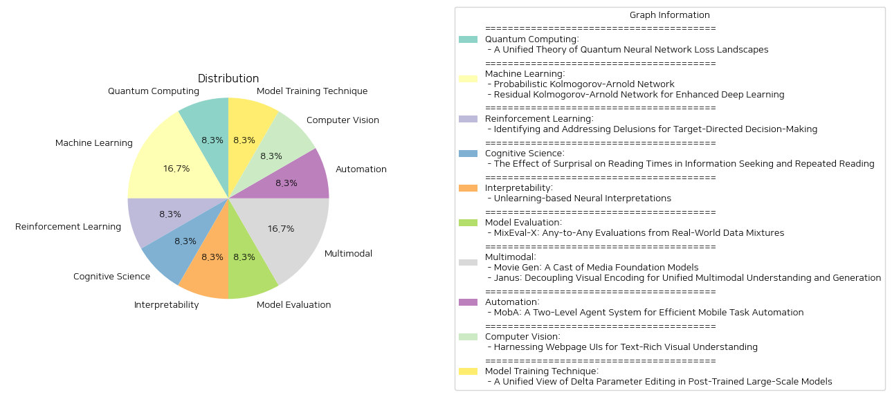

# Daily Artificial Intelligence Insights : Papers

## 🎠 Quantum Computing

**요약:**

제목: '양자 신경망 손실 지형의 단일 이론'

주요 주제 및 테마:
이 논문은 양자 신경망(QNN)의 훈련 및 일반화 동작을 설명하는 새로운 이론적 틀을 제시합니다. 기존의 고전적 신경망은 많은 뉴런이 있는 경우 가우시안 프로세스로 행동하지만, 양자 신경망의 경우 이러한 일반적 이해가 부족합니다. 저자들은 QNN과 그 파생물이 "위샤트 프로세스"로 행동한다는 것을 증명하며, 네트워크의 대수적 특성이 프로세스의 초매개변수를 결정한다고 설명합니다.

주요 사건 및 비판적 정보:
- QNN의 아키텍처가 가우시안 프로세스 한계를 가지기 위한 필요충분 조건이 제시됩니다.
- QNN의 완전한 그래디언트 분포가 계산되어, 이전에 알려진 불모의 고원 결과를 일반화합니다.
- 대수적으로 제한된 QNN의 지역 최솟값 분포를 계산합니다.

이벤트의 영향:
이 연구는 QNN의 훈련 가능성을 측정하는 새로운 양, 즉 네트워크 아키텍처의 "자유도"를 도입하여 이를 실험적으로 활용할 수 있게 합니다. 이는 QNN의 설계 및 훈련에서 중요한 길잡이 역할을 할 수 있으며, 양자 컴퓨팅 및 머신러닝 분야에서의 훈련 가이드라인을 제공하는 데 영향력을 미칠 수 있습니다.

결론 및 향후 개발 관점:
이 통합 프레임워크는 QNN의 설계 및 최적화에 중요한 통찰력을 제공하며, QNN의 가우시안 프로세스 한계와 훈련 가능성에 대한 더 깊은 이해를 가능하게 합니다. 향후 연구는 이 이론적 틀을 기반으로 한 다양한 QNN 모델의 실험적 검증 및 새로운 응용 가능성을 탐색하는 방향으로 나아갈 것으로 보입니다.

**출처:**

 - A Unified Theory of Quantum Neural Network Loss Landscapes (https://deeplearn.org/arxiv/535506/a-unified-theory-of-quantum-neural-network-loss-landscapes)

## 🧸 Machine Learning

**요약:**

**요약 보고서: Kolmogorov-Arnold 네트워크 및 응용 분야**

1. **핵심 주제 및 테마 추출:**
   - Kolmogorov-Arnold Network (KAN)는 다변수 함수의 회귀 모델.
   - Aleatoric 불확실성을 고려한 출력 확률 분포 추정 방법 제안.
   - 깊은 신경망(CNN)에서의 비선형 종속성 캡처 향상 및 효율성 제고.

2. **공통 키워드, 트렌드 및 패턴:**
   - KAN은 함수의 단일 변수 구성으로 복잡한 회귀 문제 해결.
   - Residual KAN(RKAN)은 CNN에 Kolmogorov-Arnold Network를 레지듀얼 컴포넌트로 구현, 보다 표현력 있는 기능을 제공.
   - Chebyshev 다항식을 사용해 적응형 기능 표현을 가능하게 함.
   - CNN과의 조합을 통한 성능 향상, 효율적 모델 구성.

3. **주요 사건 및 중요 정보 요약:**
   - 기존 회귀 모델의 불확실성에 수반되는 한계를 극복하기 위해 KAN을 기반으로 한 확률 분포 추정 방식을 제안.
   - RKAN은 ResNet 및 DenseNet과 같은 기존 아키텍처에 통합되어 이전보다 성능 향상을 보이며, 다양한 벤치마크에서 입증.

4. **이벤트가 다양한 부문에 미치는 영향 분석:**
   - Kolmogorov-Arnold 네트워크를 활용한 회귀 모델은 예측 정확성을 보장하면서 계산 효율성을 제공하여 다양한 산업 분야에서 유용함.
   - 심층 신경망에서의 Residual KAN 구조는 비디오 및 이미지 처리 분야에서 강력한 성능 향상, 컴퓨터 비전 작업의 범위 확장에 기여.

5. **최종 요약 및 향후 주목할 발전 가능성:**
   - Kolmogorov-Arnold 네트워크는 학계 및 산업계에서의 회귀 문제와 딥러닝의 성능을 증가시키려는 시도에 있어 중요한 기반을 제공함.
   - Aleatoric 불확실성을 다루면서도 효율적인 계산을 제공하는 방법이 다른 분야에도 적용될 수 있을 것으로 기대됨.
   - 향후 연구는 KAN의 구조적 특성을 활용한 다양한 분야로의 응용 및 RKAN을 통한 보다 다양한 신경망 구조 향상 방안 모색을 주시할 필요가 있음.

**출처:**

 - Probabilistic Kolmogorov-Arnold Network (https://deeplearn.org/arxiv/535517/probabilistic-kolmogorov-arnold-network)
 - Residual Kolmogorov-Arnold Network for Enhanced Deep Learning (https://deeplearn.org/arxiv/535518/residual-kolmogorov-arnold-network-for-enhanced-deep-learning)

## 🪄 Reinforcement Learning

**요약:**

제목: '목표 지향적 결정에 대한 망상의 식별과 해결'

요약: 본 논문은 결정 시점 계획에서 목표를 생성하여 행동을 지시하고 평가 도중 더 나은 일반화를 달성하려는 목표 지향적 에이전트에 대해 다룹니다. 이러한 에이전트의 부적절한 훈련은 망상을 초래할 수 있습니다. 즉, 에이전트가 목표에 대한 잘못된 믿음을 가지게 되어, 그것들을 적절히 거부하지 못하고 원치 않는 행동과 분포 외 일반화를 손상시킵니다. 우리는 직관적인 예시를 사용하여 여러 유형의 망상을 식별하고, 그 원인을 조사합니다. 또한, 이러한 망상을 해결하기 위해 주류 접근법인 hindsight relabeling으로 훈련된 에이전트에서 망상을 해결하는 방법을 시연합니다. 망상적 행동을 교정하고 분포 외 일반화를 향상시키기 위한 제안된 솔루션의 효과를 실증적으로 검증합니다.

---

이 논문의 핵심 주제는 목표 지향적 에이전트의 훈련에서 나타날 수 있는 망상의 문제와 그것의 해결 방법입니다. 여러 논문에서 반영되는 공통 키워드는 '목표 지향적', '망상', '일반화', '훈련 방법' 등이 있습니다. 연구에서는 에이전트가 목표에 대한 잘못된 믿음을 가지게 되는 다양한 유형의 망상을 식별하고, 이를 해결하기 위한 방법론을 개발하는 데 중점을 두었습니다. 이들은 hindsight relabeling을 사용해 에이전트를 훈련할 때 망상을 교정하고 일반화 능력을 향상시키는 방법을 제공합니다.

이러한 연구는 강화학습(RL) 분야에 중요한 영향을 미치며, 특히 에이전트의 효율성을 높이고 다양한 환경에 대한 적응력을 강화하는 데 기여할 수 있습니다. 미래 발전으로는 더욱 정교한 에이전트 훈련 기법의 개발과 함께, 에이전트가 보다 복잡한 환경에서도 정확한 목표 인식과 일반화를 수행할 수 있는 방법론이 기대됩니다. 이러한 발전은 인공지능 시스템의 신뢰성과 효용성을 크게 증가시킬 것으로 예상됩니다.

**출처:**

 - Identifying and Addressing Delusions for Target-Directed Decision-Making (https://deeplearn.org/arxiv/535605/identifying-and-addressing-delusions-for-target-directed-decision-making)

## 🍊 Cognitive Science

**요약:**

보고서 요약:

1. 주요 주제 및 테마:
   - '정보 탐색과 반복 읽기에서의 놀라움이 읽기 시간에 미치는 영향' 연구는 심리언어학의 중심 주제인 놀라움이 처리 난이도에 미치는 영향을 조사합니다. 
   - 일상에서 흔히 발생하는 정보 탐색, 반복 처리 및 이 둘의 결합이라는 세 가지 언어 처리 체계의 분석이 포함되어 있습니다.

2. 공통 키워드 및 경향:
   - 놀라움(surprisal), 처리 시간(processing times), 정보 탐색(information seeking), 반복 읽기(repeated reading), 정권 비특이적 놀라움 추정치(standard regime-agnostic surprisal estimates), 정권 특이적 맥락(regime-specific contexts).
   - 인간의 기억 표현과 언어 모델 간의 불일치(misalignments) 문제 제기.

3. 주요 사건 및 정보:
   - 연구는 놀라움 이론이 정보 탐색과 반복 읽기에서도 linearam은 효과를 가진다는 가설을 분석한다. 
   - 인간이 실제로 수행하는 맥락과 과제에 일치하는 정권 특이적 놀라움 추정치를 사용했을 때, 이러한 추정치는 정보 탐색에서 처리 시간을 예측하는 데 큰 개선을 보이지 않았다. 
   - 반복 읽기에서는 정권 특이적 맥락이 거의 0에 가까운 놀라움 추정치를 보여주며 처리 시간 예측에 영향을 주지 않음을 발견하였다.

4. 사건이 여러 분야에 미친 영향 분석:
   - 본 연구결과는 현존하는 언어 모델의 인지적 관련성을 예측하는 데 제한이 있음을 시사하며, 기존 모델의 적용 가능성에 관해 의문을 제기합니다. 
   - 심리언어학 및 인공지능 분야에서 인간의 인지와 모델 간의 일치성 향상을 위한 새로운 이론적 도전과제를 제안한다.

5. 최종 요약 및 결론:
   - 놀라움이 정보 탐색과 반복 읽기에 미치는 영향에 대한 이 연구는 언어 모델의 한계를 두드러지게 드러내며, 앞으로 인간의 기억 표현과 인공지능 모델 간의 간극을 줄이는 데 초점을 맞추어야 할 것임을 제언한다.
   - 이러한 발견은 언어 처리 이론 및 인지 과학 분야에서 이론적 진전을 이루기 위한 새로운 연구 방향을 제시한다. 
   - 미래에 인간의 처리 과정을 더욱 정밀하게 예측할 수 있는 모델을 개발하기 위한 추가 연구가 필요하다.

**출처:**

 - The Effect of Surprisal on Reading Times in Information Seeking and Repeated Reading (https://deeplearn.org/arxiv/535642/the-effect-of-surprisal-on-reading-times-in-information-seeking-and-repeated-reading)

## 🥳 Interpretability

**요약:**

제목: '학습 해제 기반의 신경 해석'

요약:
기존의 경사 기반 해석 방식은 특성 중요성을 계산할 때 포화 상태를 피하고자 기준점을 필요로 하나, 현재 사용되는 정적 함수인 상수 매핑, 평균화 혹은 블러링 등은 모델 동작에서 벗어나는 유해한 색상, 질감, 주파수 가정을 주입하게 됩니다. 이러한 방식은 불규칙한 경사의 축적으로 인해 편향되고 취약하며 조작 가능한 속성 맵을 생성합니다. 정적 접근 방식에서 벗어난 UNI(학습 해제 인터프리테이션)는 학습 해제를 통한 최적의 상승 방향으로 입력을 교란시켜 학습 가능하지 않으면서 편향되지 않고 적응 가능한 기준점을 산출하는 방법을 제안합니다. 이 방법은 신뢰할 수 있는 기준점을 발견하고, 중요한 특징을 지움으로써 국소적으로 높은 곡률의 결정 경계를 부드럽게 만드는데 성공하였습니다. 분석 결과에 따르면 학습 해제는 신뢰할 수 있고 효율적이며 견고한 해석을 생성할 수 있는 유망한 방법으로 나타났습니다.

결론 및 향후 발전 가능성:
이 연구는 신경 네트워크의 해석와 관련해 기존의 정적 방법을 대체할 수 있는 가능성을 제시하며, 모델 해석의 신뢰성을 높이는 데 기여할 수 있습니다. 학습 해제 접근법이 다양한 분야에서 활용되어 신경망 모델의 이해를 높이며, 추후 더 많은 연구와 응용이 있을 것으로 기대됩니다.

**출처:**

 - Unlearning-based Neural Interpretations (https://deeplearn.org/arxiv/535704/unlearning-based-neural-interpretations)

## 🫧 Model Evaluation

**요약:**

보고서 요약:

1. 주제 및 테마 추출:
- MixEval-X는 AI 모델이 현실 세계의 다양한 신호를 학습하고 대응할 수 있도록 다양한 모달리티를 인식하고 생성하는 것이 중요하다는 점을 강조합니다.
- 현재 평가 시스템의 결함으로는 일관되지 않은 기준과 편향된 질의 및 채점 등이 있습니다.

2. 공통 키워드, 트렌드 및 패턴 식별:
- '다중 모달리티', '표준화된 평가', '현실 세계의 과제 분포', '메타-평가', '크라우드 소싱'이 주요 키워드로 나타납니다.
- '표준화'와 '적응-수정 파이프라인'을 통한 현실 세계 태스크 재구성이 중요한 패턴으로 나타납니다.

3. 주요 이벤트 및 주요 정보 요약:
- MixEval-X는 처음으로 각종 입력과 출력을 통해 현실 세계 기준을 표준화하기 위한 벤치마크를 제안합니다.
- 현실 세계의 태스크 분포를 재구성하기 위해 다중 모달 벤치마크 혼합과 적응-수정 파이프라인을 제안합니다.
- 포괄적인 리더보드를 제공하여 기존 모델과 조직의 재평가를 지원하고, 다중 모달 평가에 대한 이해를 증진시킵니다.

4. 이러한 이벤트가 다양한 부문에 미치는 영향 분석:
- MixEval-X는 AI 모델과 기관들이 현실 세계에 적합한 태스크 수행 성능을 갖추도록 돕습니다.
- 평가 기준의 통일을 통해 연구 개발의 방향성을 제공하고, 다양한 응용 분야에서 AI 모델의 실용성을 높일 수 있습니다.

5. 최종 요약 및 향후 발전 가능성:
- 이 연구는 AI 평가 시스템의 일관성 및 신뢰성을 높이는 데 기여하며, 다중 모달 AI 시스템 연구의 미래 방향성을 제시합니다.
- 앞서 제안된 표준화된 평가 방식을 통해 AI 분야의 다양한 모델과 기술의 발전을 기대할 수 있으며, 크라우드 소싱 기반의 현실 세계 평가와 강한 상관관계를 보이는 점이 그 증거입니다.

**출처:**

 - MixEval-X: Any-to-Any Evaluations from Real-World Data Mixtures (http://arxiv.org/abs/2410.13754v1)

## 👽 Multimodal

**요약:**

보고서 제목: 현대 미디어 생성 및 다중모드 이해를 위한 혁신적 모델 분석

보고서 요약:

1. 주요 주제 및 테마
   - 'Movie Gen' 논문은 고화질 비디오 생성 및 개인화 기술, 비디오 편집, 오디오 생성 등 다양한 미디어 생성 기능을 다루고 있습니다.
   - 'Janus' 논문은 다중모드 이해 및 생성의 통합을 위한 새로운 구조 및 방법론을 제시하고 있으며, 특히 시각적 인코딩의 분리화에 중점을 두고 있습니다.

2. 공통 키워드, 트렌드 및 패턴
   - 두 논문 모두 미디어 생성 및 다중모드 처리에서 최신 기술을 탐구하고 있으며, 특히 고성능 모델의 개발을 위한 혁신적 접근법을 제시합니다.
   - 공통적으로 사용하는 기술로는 자동회귀 프레임워크, 변환기 아키텍처, 모델 및 데이터의 규모 확장이 있습니다.

3. 각 논문의 주요 사건 및 중요 정보
   - 'Movie Gen'에서는 30B 파라미터의 변환기를 사용하여 1080p HD 비디오를 다양한 비율로 생성할 수 있는 모델을 제안하였으며, 이 모델은 다양한 미디어 생성 작업에서 최신 기술을 달성했습니다.
   - 'Janus'에서는 다중모드 이해와 생성을 위한 통합된 프레임워크를 제시하며, 시각적 인코딩을 분리하여 서로 다른 인코딩 방법을 독립적으로 선택할 수 있는 유연성을 높였습니다.

4. 주요 이벤트의 영향 분석
   - 'Movie Gen'의 기술은 영상 제작, 편집 및 개인화 분야에 혁신을 불러일으킬 가능성이 높으며, 이는 엔터테인먼트 및 미디어 산업 전반에 큰 영향을 미칠 것입니다.
   - 'Janus'의 접근법은 다중모드 환경의 이해 및 상호작용을 향상시킬 것으로 기대되며, 이는 제조, 콘텐츠 제작, 교육 등 다수의 분야에서 응용될 수 있습니다.

5. 최종 통합 요약과 향후 개발 가능성
   - 두 모델 모두 최신 기술을 기반으로 한 미디어 생성 및 이해의 개선을 목표로 하여 기존의 제한된 방식에서 벗어나고자 합니다.
   - 향후 연구 및 개발은 이들 프레임워크의 실제 응용 및 확장 가능성을 중심으로 진행될 것으로 보이며, 특히 모델의 확장성, 운용 효율성 및 데이터 활용 최적화가 중요한 논점이 될 것입니다.

각 논문의 기초 연구는 다중모드 인터페이스에서의 효율적이고 유연한 데이터 처리 가능성을 시사하며, 이는 향후 다양한 산업 분야에 걸쳐 폭넓은 영향을 미칠 것입니다.

**출처:**

 - Movie Gen: A Cast of Media Foundation Models (http://arxiv.org/abs/2410.13720v1)
 - Janus: Decoupling Visual Encoding for Unified Multimodal Understanding and Generation (http://arxiv.org/abs/2410.13848v1)

## 🍋 Automation

**요약:**

1. **주요 주제 및 테마 추출**: '열 대리 시스템', '모바일 태스크 자동화', '이동 전화 에이전트', '다중모드 대형 언어 모델', '이해 및 계획 능력 향상', '반사 모듈', '복잡한 작업 처리'.

2. **공통 키워드, 트렌드 및 패턴 식별**: 논문 전반에 걸쳐 언급된 키워드는 '태스크 자동화', '이해 및 계획 능력', '다중모드 대형 언어 모델', '두 수준 에이전트 아키텍처' 등입니다. 현재 모바일 보조 장치의 한계와 MobA 시스템을 통해 향상된 이해 및 작업 수행 능력이 논의되었습니다.

3. **주요 이벤트 및 핵심 정보 요약**: MobA는 글로벌 에이전트(GA)와 로컬 에이전트(LA)의 두 단계 에이전트 아키텍처로 구성되어 있습니다. GA는 사용자 명령을 이해하고 히스토리를 추적하며 작업을 계획하고, LA는 세부 작업을 기능 호출 형태로 예측합니다. 반사 모듈을 통해 시스템은 이전에 보지 못한 복잡한 작업도 효율적으로 완료할 수 있게 되었으며, 실제 평가에서 작업 수행 효율성과 완료율의 유의미한 향상을 보였습니다.

4. **이벤트가 다양한 분야에 미친 영향 분석**: MobA의 도입으로 인해 모바일 보조 장치의 사용성이 향상될 것으로 예상되며, 특히 복잡한 사용자 작업을 자동화할 수 있는 가능성이 커졌습니다. 이는 사용자 경험을 더욱 풍부하게 하고, 다양한 모바일 기기에서 실행되는 앱 및 서비스의 제작과 관리 방식을 근본적으로 바꿀 수 있습니다.

5. **최종 요약과 결론 및 미래 개발 예측**: MobA는 현재 모바일 보조 장치가 직면한 한계점을 뛰어넘어 높은 작업 수행 능력을 제공하는 다중모드 대형 언어 모델 기반의 두 단계 에이전트 시스템입니다. 실세계 평가에서 입증된 바처럼, 이 시스템은 복잡한 작업을 보다 효율적으로 자동화할 수 있는 가능성을 가지고 있으며, 더 나아가 모바일 기술의 새로운 표준을 창출할 가능성을 가지고 있습니다. 향후, 이러한 기술의 발전을 통해 다양한 분야에서 태스크 자동화와 사용자 경험의 획기적 변화가 기대됩니다.

**출처:**

 - MobA: A Two-Level Agent System for Efficient Mobile Task Automation (http://arxiv.org/abs/2410.13757v1)

## 🌅 Computer Vision

**요약:**

보고서 요약:

1. 주요 주제 및 테마:
   - 텍스트가 풍부한 시각적 이해
   - 멀티모달 대형 언어 모델(MLLM)의 개선
   - 웹 페이지 UI를 활용한 일반 멀티모달 지시문 생성
   - MultiUI 데이터셋 및 다양한 멀티모달 작업

2. 공통 키워드, 트렌드, 패턴:
   - 웹 UI 작업 향상
   - 액션 정확도 개선
   - 다양한 UI 레이아웃 및 멀티모달 태스크
   - 비(非) 웹 UI 도메인에 대한 일반화

3. 주요 사건 및 정보 요약:
   이 연구는 텍스트 기반 대형 언어 모델(LLM)을 활용하여 웹 페이지 UI에서 일반 멀티모달 지시문을 생성함으로써 MLLM의 시각적 이해를 향상시키려는 것입니다. 이를 위해 MultiUI라는 거대한 데이터셋이 구축되었으며, 이 데이터셋에는 1백만 웹사이트에서 수집한 730만 개의 샘플이 포함되어 있습니다. 모델은 VisualWebBench에서 최대 48%의 개선을 보여주었고, 웹 에이전트 데이터셋 Mind2Web에서 액션 정확도가 19.1% 증가하였습니다. 웹 UI 작업에서 뿐만 아니라 문서 이해, OCR, 차트 해석 등의 비 UI 도메인에서도 좋은 성능을 발휘합니다.

4. 이러한 사건의 다양한 부문에 대한 영향 분석:
   - 웹 UI 데이터의 활용은 텍스트가 풍부한 환경에서의 시각적 이해를 크게 향상시켜, 멀티모달 모델 훈련의 강력한 도구로 자리 잡고 있습니다.
   - 웹 UI와 비 UI 도메인 모두에 적용 가능하여 문서 처리, 차트 해석, OCR과 같은 분야에서도 모델 성능을 강화하고 있습니다.

5. 결론 및 향후 주목할 발전:
   전체적으로, 웹 페이지 UI로부터 얻은 데이터셋은 멀티모달 모델이 다양한 도메인으로 확장되는 데 필요한 여러 시각적 및 텍스트적 이해 능력을 획득하는데 기여하고 있습니다. 앞으로는 이러한 접근법이 더욱 다양한 유형의 데이터를 포함하고, 여러 실세계 응용 프로그램에서의 활용성을 높일 가능성이 있습니다. 이러한 트렌드는 특히 다양한 기기와 플랫폼에서 일상적으로 활용될 수 있는 새로운 형태의 사용자 인터페이스와 상호 작용 모델을 개발하는 데 중요한 단초를 제공할 수 있습니다.

**출처:**

 - Harnessing Webpage UIs for Text-Rich Visual Understanding (http://arxiv.org/abs/2410.13824v1)

## ❄️ Model Training Technique

**요약:**

보고서 요약:

1. 핵심 주제 및 테마:
   - 포스트-트레인된 대규모 모델의 적응을 위한 델타 매개 변수 편집
   - 델타 매개 변수의 성질 탐구: 가지치기, 양자화, 저계심 근사(approximation), 외삽(extrapolation)
   - 손실 함수의 리만 합 근사를 기반으로 한 새로운 관점 제시

2. 공통 키워드, 트렌드 및 패턴 식별:
   - 델타 매개 변수: 포스트-트레인과 프리-트레인 간의 매개 변수 차이를 나타냄
   - 모델 성능 변화: 경쟁적인, 감소한, 개선된 측면으로 나눔
   - 기존 방법의 확장 및 개선을 통한 델타 파라미터 편집의 효과 및 적용 가능성 증가

3. 주요 사건 및 중요한 정보 요약:
   - 델타 매개 변수의 역할을 체계적으로 분석하기 위한 통일된 프레임워크 부재
   - 손실 함수의 리만 합 근사 기법을 활용하여 델타 매개 변수 편집 작업을 설명
   - 시각적 모델 및 언어 모델(ViT, LLaMA 3, Qwen 2, Mistral)에서의 실험 결과를 통해 이론적 발견을 뒷받침
   - DARE 및 BitDelta와 같은 기존 기술의 한계를 지적하고 이를 확장하여 일반적인 표현으로 재구성

4. 이러한 이벤트가 다양한 부문에 미치는 영향 분석:
   - 모델의 성능 최적화 및 과제 적응 가능성 증가
   - 델타 매개 변수 활용의 통일된 접근 방식 제시로 인한 연구 및 응용 분야에서의 효과적인 방법론 확립
   - 기술적 한계를 넘어서는 새로운 방안 제안으로, 델타 파라미터 편집 기술의 활용 가능성을 더욱 확장

5. 결론 및 향후 개발 전망:
   - 델타 매개 변수 편집에 대한 이해와 적용 가능성을 높이는 통일된 관점이 연구 및 산업 발전에 기여할 것
   - 향후 델타 매개 변수의 성질을 더욱 심층적으로 분석하여 다양한 모델 및 응용 분야에서의 최적화 기회를 확대
   - 포스트-트레인 모델의 성능 향상을 위한 더 나은 기법 및 전략 개발 예상

이 보고서는 델타 매개 변수 편집의 중요성과 그 잠재력을 강조하며, 향후 연구 방향을 제시합니다.

**출처:**

 - A Unified View of Delta Parameter Editing in Post-Trained Large-Scale Models (http://arxiv.org/abs/2410.13841v1)

