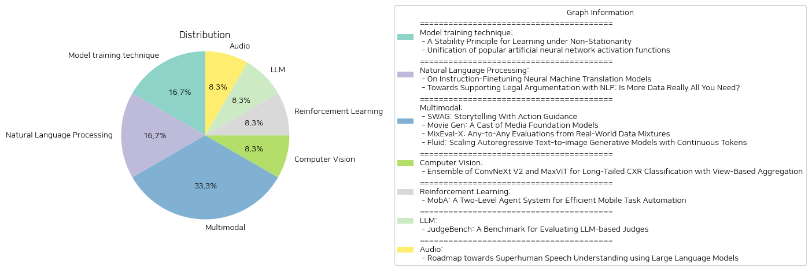

# Daily Artificial Intelligence Insights : Papers

## ☀️ Model training technique

**요약:**

보고서 요약:

1. 주요 주제 및 테마 추출:
   첫 번째 논문은 "비정상성을 고려한 학습의 안정성 원칙"에 초점을 맞추고 있다. 이 연구는 비정상적인 환경에서 통계적 학습의 프레임워크를 개발하여 각 시간대마다 과거 데이터를 최대한 활용하면서 누적 편향을 수용 가능한 범위로 유지한다. 두 번째 논문은 "인공 신경망 활성화 함수의 통합"을 다루며, 다양한 활성화 함수를 하나의 통합된 표현으로 제시하여 일반적인 훈련 문제를 해결하는 방법을 논의한다.

2. 공통 키워드, 트렌드 및 패턴 식별:
   두 논문 모두 기계 학습 및 데이터 활용의 최적화에 주목하고 있다. 첫 번째 논문은 비정상성의 문제를 해결하기 위해, 두 번째 논문은 활성화 함수의 문제를 극복하기 위한 새로운 방법론을 제시한다. 두 논문 모두 학습 과정에서의 적응성과 효율성을 강조하고 있다.

3. 주요 사건 및 중요 정보 요약:
   - 첫 번째 논문에서는 비정상 데이터 환경에서 유사성을 측정하고 데이터를 준정상 상태로 세분화하는 기법을 개발했다. 이를 통해 확률론적 오차와의 균형을 맞추면서 역사적 데이터의 효율적 활용을 가능하게 한다. 이 접근법은 강한 볼록성 또는 리프치츠 조건 하에서 최소화된 후회를 보장한다.
   - 두 번째 논문은 미타-레플러 함수와 분수 미적분을 통해 다양한 신경망 활성화 함수의 통합된 표현을 제안한다. 이는 데이터로부터 그 형상을 학습할 수 있는 적응형 활성화 함수의 범위를 확장한다. 이를 통해 네트워크 훈련의 일반적인 문제점을 완화하고, 다양한 복잡도의 신경망 훈련에서 일관된 성능을 보인다.

4. 이러한 사건들의 여러 부문에 대한 영향 분석:
   - 통계적 학습 및 데이터 분석 엔지니어링에서 예측 모델의 적응성과 정확도가 향상될 가능성이 있다. 비정상성을 효과적으로 관리함으로써 다양한 실세계 응용에서 더 나은 성능을 기대할 수 있다.
   - 인공신경망에서의 활성화 함수 문제 해결은 기계 학습 모델의 훈련 속도와 안정성을 개선할 수 있다. 이는 대규모 데이터 세트를 처리하는 데 있어 더 나은 효율성을 제공할 것이다.

5. 결론 및 잠재적 미래 개발:
   이 연구들은 비정상적인 환경과 다양한 활성화 함수 문제에서의 해결책을 제시하며, 이는 기계 학습 분야에서 중요한 진전을 의미한다. 앞으로 특정 응용 분야에 맞춘 비정상적 데이터 대응 전략과 유연한 활성화 함수를 개발함으로써, 더욱 발전된 기계 학습 모델의 출현이 기대된다. 이러한 추세가 지속된다면, 다양한 산업에서의 데이터 활용과 기계 학습 모델의 효율성 증대에 기여할 것으로 예상된다.

**출처:**

 - A Stability Principle for Learning under Non-Stationarity (https://deeplearn.org/arxiv/534502/a-stability-principle-for-learning-under-non-stationarity)
 - Unification of popular artificial neural network activation functions (https://deeplearn.org/arxiv/535529/unification-of-popular-artificial-neural-network-activation-functions)

## 💙 Natural Language Processing

**요약:**

보고서 요약:

1. **논문 1: 'Neural Machine Translation 모델의 지시 미세 조정에 관한 연구'**

   - **주요 주제 및 테마**: 이 논문은 신경 기계 번역(NMT) 모델의 지시 미세 조정을 소개하며, 명령어를 따르는 능력을 대형 언어 모델(LLM)에서 훨씬 작은 NMT 모델로 증류하는 방식을 설명합니다. 
   - **핵심 정보**: NMT 모델이 여러 지시를 동시에 따를 수 있으며, 제로샷 합성(composition)의 가능성을 보입니다. 전통적으로 상이한 작업들(예: 형식 제어 번역, 다중 도메인 적응, 다중 모드 번역)을 단일 지시 미세 조정된 NMT 모델로 통합하여 처리할 수 있음을 보여주며, 이는 GPT-3.5-Turbo와 같은 LLM에 필적하는 성능을 가지고 있습니다.
   - **영향**: 이 연구는 더 빠르고 저렴하며 효율적인 개인 맞춤형 번역 서비스를 가능하게 하여, 다양한 번역 필요성을 충족시키는 새로운 방법론을 제공합니다. 

2. **논문 2: '법적 논증 지원을 위한 NLP의 발전: 더 많은 데이터가 정말로 전부인가?'**

   - **주요 주제 및 테마**: 법적 추론 모델링과 논증은 항상 AI와 법률의 중심이었으나, 최근 법적 NLP의 발전은 텍스트로부터 법적 결론을 통계적으로 분류하는데 중점을 두고 있습니다.
   - **핵심 정보**: 현대적인 NLP 모델과 방법이 전문 지식을 통합하여 상징적 접근과 데이터 중심 접근 간의 균형을 맞출 수 있는 가능성을 강조합니다. 상징 vs 데이터 중심 접근 방식 간의 설명 가능성과 확장성의 균형을 맞추기 위한 도전을 식별합니다.
   - **영향**: 기존의 법적 AI 접근 방식과 현대적 NLP 방법론 간의 조화를 통해 법적 결정의 설명력을 높이고, 법률 시스템 내 정보 처리의 더 나은 의사 결정 지원이 가능할 것으로 보입니다.

**통합 요약 및 결론**:

두 논문은 AI 기술의 발전이 특정 분야에 어떠한 방식으로 적용될 수 있는지를 탐구합니다. NMT 시스템의 개선을 통해 번역 정확도와 효율성을 향상시키는 한편, 법률 분야에서는 더 깊이 있는 이해와 설명력이 결합된 AI 솔루션의 필요성을 제시합니다. 이 연구들은 다양한 분야에서 AI 기술이 더욱 맞춤화되고 더 나은 의사 결정 지원을 제공할 수 있음을 보여줍니다. 앞으로의 연구 방향으로는 이러한 모델들이 어떻게 더 포괄적으로 다양한 작업 영역에서 적용될 수 있을지, 그리고 각각의 도메인 요구사항에 맞춘 효율적인 AI 솔루션 개발이 주요한 발전 과제가 될 것입니다.

**출처:**

 - On Instruction-Finetuning Neural Machine Translation Models (https://deeplearn.org/arxiv/535484/on-instruction-finetuning-neural-machine-translation-models)
 - Towards Supporting Legal Argumentation with NLP: Is More Data Really All You Need? (https://deeplearn.org/arxiv/537100/towards-supporting-legal-argumentation-with-nlp:-is-more-data-really-all-you-need?)

## 🍊 Multimodal

**요약:**

1. 주요 주제 및 테마:
   - 'SWAG: Storytelling With Action Guidance'에서는 대형 언어 모델(LLMs)을 활용한 스토리 생성의 새로운 접근 방식을 소개하며, 이야기 흐름을 조정하기 위한 두 모델의 피드백 루프를 제안합니다. 이 방법은 이전의 스토리 생성 기술보다 우수한 결과를 보입니다.
   - 'Movie Gen: A Cast of Media Foundation Models'에서는 고화질 비디오 생성, 개인화된 비디오 제작 등 다양한 기능을 가진 미디어 생성 모델을 소개합니다. 다양한 기술 혁신을 통해 미디어 생성 모델의 발전을 가속화하고자 합니다.
   - 'MixEval-X: Any-to-Any Evaluations from Real-World Data Mixtures'에서는 AI 모델 평가의 표준화를 목표로 하며, 실제 세계의 데이터 혼합을 사용한 다중 모드 벤치마크를 제공합니다.
   - 'Fluid: Scaling Autoregressive Text-to-image Generative Models with Continuous Tokens'에서는 연속 토큰을 사용하는 자가 회귀 모델을 통해 고품질 텍스트-이미지 생성의 스케일링 문제를 탐구합니다.

2. 공통 키워드 및 트렌드:
   - 대형 언어 모델, 자가 회귀 모델, 비디오 및 이미지 생성, 고품질 콘텐츠 생성, 표준화된 평가, 다중 모드 데이터 처리 등이 공통적인 트렌드로 나타났습니다.

3. 주요 이벤트 및 정보 요약:
   - SWAG는 스토리 생성에서 두 모델의 피드백 루프를 통해 콘텐츠 생성 및 방향 설정을 개선하였습니다.
   - Movie Gen은 다양한 미디어 관련 작업에서 현 상태를 초월하는 기능을 통해 고품질 비디오 생성 모델을 소개합니다.
   - MixEval-X는 AI 평가의 불일치와 편향을 해결하고자 다중 모드 벤치마크를 제공하여 실세계 사용 사례에 맞춘 평가를 실현합니다.
   - Fluid 모델은 연속 토큰 사용과 무작위 생성 순서를 통해 텍스트-이미지 생성 성능을 향상시킵니다.

4. 이 이벤트들이 다양한 부문에 미치는 영향:
   - 콘텐츠 생성 및 비주얼 미디어에 새로운 기준을 제시하여 창의적 작업의 효율성을 높일 수 있습니다.
   - AI 평가의 표준화는 AI 모델의 개발과 채택을 가속화할 것입니다.
   - 학술 및 산업 연구 커뮤니티에서 미디어 생성의 기술 발전을 위한 새로운 길을 제시합니다.

5. 최종 요약 및 향후 개발 전망:
   - SWAG와 같은 새로운 스토리텔링 방법론은 창의적 콘텐츠 생성의 새로운 장을 열었습니다.
   - Movie Gen의 기술적 업그레이드는 고화질 비디오 제작의 새로운 가능성을 열고 있으며, 개인화된 콘텐츠 제작에 대한 수요 증가를 반영합니다.
   - MixEval-X의 평가 표준화는 AI 모델의 더 나은 비교와 개선을 가능하게 합니다.
   - Fluid의 발견은 텍스트-이미지 생성의 품질을 높이며, 시각-언어 모델 사이의 스케일링 격차를 줄이는 데 기여할 것입니다.

앞으로도 이러한 연구가 창의적 작업과 AI 모델 개발의 효율성을 높이는 방향으로 계속 발전할 것으로 기대됩니다.

**출처:**

 - SWAG: Storytelling With Action Guidance (https://deeplearn.org/arxiv/535495/swag:-storytelling-with-action-guidance)
 - Movie Gen: A Cast of Media Foundation Models (http://arxiv.org/abs/2410.13720v1)
 - MixEval-X: Any-to-Any Evaluations from Real-World Data Mixtures (http://arxiv.org/abs/2410.13754v2)
 - Fluid: Scaling Autoregressive Text-to-image Generative Models with Continuous Tokens (http://arxiv.org/abs/2410.13863v1)

## 🪸 Computer Vision

**요약:**

1. 주제 및 테마 추출:
   - 논문은 CXR(흉부 X-선) 이미지의 비대칭적인 분포(롱테일 분포)을 다루기 위한 이미지 분류 기법에 관한 것이다.
   - ConvNeXt V2와 MaxViT 모델을 사용한 기법을 활용하였다.
   - 흉부 X-레이에서의 분류 성능 향상을 위해 보기 기반 예측 집계를 사용하였다.

2. 공통 키워드, 동향 및 패턴:
   - 롱테일 분포
   - 이미지 분류 기법
   - 보기 기반 예측 집계
   - 비대칭 손실

3. 주요 사건 및 중요한 정보 요약:
   - MICCAI 2024 CXR-LT 챌린지에서 부문 2에서 4위, 부문 1에서 5위를 차지했다.
   - ConvNeXt V2와 MaxViT를 이용한 앙상블 모델을 통해 CXR 데이터의 롱테일 분포 문제를 해결함.
   - 클래스 불균형을 다루기 위해 비대칭 손실을 적용하고, 보기 기반 예측 집계를 통해 분류 정확도를 향상시켰다.
   - 코드는 GitHub에 공개되어 있다.

4. 이러한 사건이 다양한 분야에 미치는 영향 분석:
   - 의료 이미지 분석 분야에서 롱테일 데이터 분포 문제를 해결하기 위한 새로운 기법으로서 활용될 수 있다.
   - 클래스 불균형 문제를 다루기 위한 이미지 분류 기술 개선에 기여할 수 있다.

5. 최종 요약 및 결론:
   이 연구는 롱테일 분포를 다루기 위한 첨단 이미지 분류 기법을 통해 흉부 X-선 데이터의 분류 정확도를 높이는데 기여하였다. 특히, ConvNeXt V2와 MaxViT 모델의 앙상블과 비대칭 손실을 이용한 접근법은 클래스 불균형 문제를 효과적으로 해결할 수 있음을 보여주었다. 보기 기반 예측 집계를 통해서도 성능이 향상되었음을 확인하였다. 이러한 기법은 앞으로 의료 이미지 분석 분야에서 롱테일 데이터 문제 해결에 널리 응용될 가능성이 있으며, 관련 연구에 지속적인 발전이 기대된다.

**출처:**

 - Ensemble of ConvNeXt V2 and MaxViT for Long-Tailed CXR Classification with View-Based Aggregation (https://deeplearn.org/arxiv/536961/ensemble-of-convnext-v2-and-maxvit-for-long-tailed-cxr-classification-with-view-based-aggregation)

## 💚 Reinforcement Learning

**요약:**

**주제:** 'MobA: 효율적인 모바일 작업 자동화를 위한 이중 레벨 에이전트 시스템'

**발표 요약:**
현재의 모바일 어시스턴트는 시스템 API에 의존하거나 복잡한 사용자 지침과 다양한 인터페이스 작업에서 이해와 의사결정 능력의 한계로 어려움을 겪고 있습니다. 이를 해결하기 위해 MobA라는 새로운 모바일 전화 에이전트가 제안되었습니다. 이 에이전트는 멀티모달 대규모 언어 모델(MLLM)을 통해 이해 및 계획 능력을 향상시키는 고도화된 이중 레벨 에이전트 아키텍처를 가지고 있습니다. 상위 레벨의 글로벌 에이전트(GA)는 사용자 명령을 이해하고, 역사 기억을 추적하며, 작업을 계획합니다. 하위 레벨의 로컬 에이전트(LA)는 GA로부터 지시된 하부 작업 및 메모리에 따라 함수 호출 형태의 구체적인 행동을 예측합니다. 반사 모듈을 통합하여 효율적인 작업 완료를 가능하게 하고, 이전에 보지 못한 복잡한 작업을 처리할 수 있도록 합니다. 실제 평가에서 MobA는 작업 실행 효율성과 완료율에서 상당한 향상을 보여, MLLM을 활용한 모바일 어시스턴트의 잠재력을 강조하고 있습니다.

**결론 및 향후 개발 가능성:**
MobA는 스마트폰의 사용 효율성을 크게 향상시키며, 복잡한 작업을 처리할 수 있는 강화된 AI 모델 능력을 제공합니다. 미래에는 이러한 기술이 더욱 발전하여 개인화된 사용자 경험과 다양하고 복잡한 작업 환경에 폭넓은 적용이 기대됩니다. 또한, 다양한 분야의 모바일 응용 프로그램에서의 높은 체감 효능과 광범위한 적용 가능성을 제시하고 있습니다.

**출처:**

 - MobA: A Two-Level Agent System for Efficient Mobile Task Automation (http://arxiv.org/abs/2410.13757v1)

## 🪸 LLM

**요약:**

보고서 제목: 'JudgeBench를 통한 LLM 기반 판사의 평가'

1. 주요 주제 및 테마:
   - LLM(Large Language Models) 기반 판사의 확장성과 활용 증가
   - 기존의 평가 체계의 한계 및 새로운 평가 프레임워크의 필요성
   - JudgeBench의 개발 및 활용

2. 공통 키워드, 동향 및 패턴:
   - LLM의 향상과 진화하는 복잡성
   - 인간 선호도와의 정렬에 국한된 기존 평가 방법의 한계
   - 지식, 추론, 수학, 코딩과 같은 더 어려운 과제에서의 판사의 신뢰성 검증 필요

3. 주요 사건 및 중요한 정보 요약:
   - LLM 기반 판사의 신뢰성은 자주 검증되지 않으며, 이는 모델 평가에 있어 문제를 야기할 수 있음.
   - JudgeBench는 LLM 기반 판사의 평가를 위한 새로운 벤치마크로, 어려운 반응 쌍과 선호 레이블을 이용해 객관적 평가를 가능케 하는 프레임워크를 제안.
   - 여러 종류의 LLM 기반 판사 및 보상 모델을 대상으로 한 포괄적 평가 결과, JudgeBench가 이전의 벤치마크보다 상당한 도전을 제시함을 입증.
   - GPT-4o와 같은 강력한 모델도 제시된 난이도에서 단지 무작위 추측보다 약간 더 나은 수행을 보임.

4. 이러한 사건의 여러 분야에 대한 영향 분석:
   - LLM 기반 판사의 신뢰성 제고는 인공지능 모델의 전반적인 정확성과 응답의 일관성에 긍정적 영향을 미칠 수 있음.
   - 보다 정교한 모델 평가를 통해 모델 개발의 방향성과 전략에 중요한 기준을 제공할 수 있음.
   - 다양한 응용 분야(예: 머신러닝, 자연어 처리)에서 모델 평가 기준의 강화로 인한 향상된 결과 도출 기대 가능.

5. 종합 요약 및 결론:
   - LLM 기반 판사들은 인간 평가를 대체할 수 있는 잠재력을 지녔으나 신뢰성 확보가 과제임.
   - JudgeBench는 이러한 신뢰성 문제를 해결하고 LLM 기반 판사를 더욱 효과적으로 평가할 수 있는 중요 도구로써의 가능성을 보여줌.
   - 향후 JudgeBench를 활용한 더욱 심도 깊은 연구가 필요하며, 이는 현재 LLM 발전 속도와 맞물려 중요한 발전을 불러올 가능성이 있음.

**출처:**

 - JudgeBench: A Benchmark for Evaluating LLM-based Judges (http://arxiv.org/abs/2410.12784v1)

## 🎉 Audio

**요약:**

종합 보고서:

1. 핵심 주제 및 테마 추출:
   - 본 연구에서는 대형 언어 모델(LLMs)의 성공을 바탕으로 음성 및 오디오 데이터를 통합하려는 노력을 다룹니다.
   - GPT-4o 등의 최근 진보는 비구문적 정보 및 세계 지식을 보존하여 심층적인 음성 이해를 가능하게 하는 종단 간 음성 LLMs의 잠재력을 보여줍니다.
   - 연구는 음성 LLMs 개발을 위한 5단계 로드맵을 제시합니다.

2. 공통 키워드, 트렌드, 패턴 식별:
   - 언어 모델, 음성 및 오디오 데이터 통합, 비구문적 정보, 세계 지식, 자동 음성 인식(ASR), 생성적 AI(GPT-4o).

3. 각 논문의 주요 이벤트 및 중요한 정보 요약:
   - 비구문적 정보와 추상적 음향 지식을 통합한 고급 슈퍼휴먼 모델을 개발하기 위한 5단계 로드맵 제안.
   - 다양한 작업에서 표준화된 중요한 측면을 포함하는 'SAGI Benchmark'를 설계하여 평가 기준 설정.
   - 발화 내의 비언어적 단서와 추상적 음향 지식을 다루는 데 있어서의 현재 한계점 발견 및 향후 방향 제안.

4. 이러한 사건이 다양한 부문에 미치는 영향 분석:
   - 음성 인식 및 자연어 처리 분야에서의 응용 가능성을 넓히는데 기여할 수 있으며, 이를 통해 다양한 산업의 고객 상호 작용과 사용자 경험을 향상시킬 잠재력이 존재합니다.
   - 기계에 의한 심도 있는 음성 이해의 발전은 인간-기계 상호작용에서의 혁신을 촉진할 수 있습니다.

5. 결론 및 잠재적인 미래 발전:
   - 이 연구는 음성 LLMs가 보다 복잡한 작업을 처리하기 위해 필요한 발전 방향을 제시하며, 현재의 한계점을 밝히고 향후 연구의 방향을 설정합니다.
   - 향후 발전으로는 음성 인식 정확도를 높이기 위한 비구문적 정보의 보다 효과적인 처리, 음향 정보의 추상화 및 평가를 위한 표준을 설정하는 방향 등이 포함될 수 있습니다.

따라서 본 논문은 음성 이해의 새로운 패러다임을 탐구하며, 대형 언어 모델의 발전이 인간 수준을 넘어서는 음성 이해를 어떻게 가능하게 할 수 있는지를 탐색하고 있습니다. 이는 궁극적으로 여러 산업 분야에서 사용자 경험을 혁신할 수 있는 중요한 기여가 될 것입니다.

**출처:**

 - Roadmap towards Superhuman Speech Understanding using Large Language Models (http://arxiv.org/abs/2410.13268v1)

