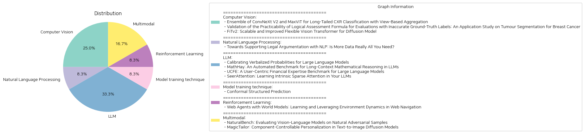

# Daily Artificial Intelligence Insights : Papers

## 🪐 Computer Vision

**요약:**

### 종합 요약 보고서

1. **주요 주제 및 테마 추출**
   - 첫 번째 논문('Ensemble of ConvNeXt V2 and MaxViT for Long-Tailed CXR Classification with View-Based Aggregation'): 흉부 X선 데이터셋의 불균형 분포를 처리하기 위한 이미지 분류 기술 적용
   - 두 번째 논문('Validation of the Practicability of Logical Assessment Formula for Evaluations with Inaccurate Ground-Truth Labels'): 부정확한 참값 레이블로 인해 평가의 실효성을 검증하는 논리 평가 공식(LAF)
   - 세 번째 논문('FiTv2: Scalable and Improved Flexible Vision Transformer for Diffusion Model'): 불규칙 해상도 및 다양한 해상도 생성에 강력한 가변 비전 변환기 (FiTv2)의 개발

2. **공통 키워드, 트렌드 및 패턴 식별**
   - AI 및 머신러닝 모델의 평가와 개선: 모든 논문은 인공지능을 기반으로 한 이미지 처리 또는 분석 모델의 성능 향상에 초점을 맞추고 있음.
   - 데이터 불균형 처리 및 해상도 유연성: 첫 번째 논문은 데이터 불균형 문제를, 세 번째 논문은 다양한 해상도 문제를 해결하려고 함.
   - 새로운 방법론 제안 및 검증: 두 번째 논문은 새로운 평가 공식을 제안하고 그 실효성을 검증하는 데 초점을 맞추고 있음.

3. **주요 사건 및 중요한 정보 요약**
   - 첫 번째 연구는 최신 이미지 분류 기법 및 비대칭 손실 함수를 사용하여 흉부 X선 데이터의 불균형 문제를 해결함으로써 MICCAI 2024 챌린지에서 성적을 높였음.
   - 두 번째 연구는 인공지능 평가에서 부정확한 참값 레이블과 관련 있는 새로운 방법론을 실제 데이터에 적용하여 검증함.
   - 세 번째 연구는 Diffusion Transformer 모델의 해상도 유연성을 확보하기 위한 새로운 아키텍처 FiTv2를 제안하고 이의 성능 향상 및 확장에 대한 실험 결과를 제시함.

4. **이벤트가 여러 분야에 미치는 영향 분석**
   - **의료 이미지 분석**: 첫 번째와 두 번째 논문의 연구는 의료 이미징 분야에서의 AI와 머신러닝 모델의 향상된 분석 정확도 및 평가의 실효성을 높이는 데 기여.
   - **이미지 생성 및 처리**: 세 번째 논문은 폭넓은 해상도와 비율을 처리할 수 있는 모델 개발을 통해 이미징 분야의 가능성을 확장하고 향후 연구에 새로운 관점을 제시함.
   
5. **최종 종합 요약 및 결론, 미래 발전 가능성**
   - 향후 AI 기술은 데이터의 불균형과 해상도의 다양성을 보다 효율적으로 처리하는 방향으로 발전할 가능성이 있음.
   - 논문들이 제안한 각각의 모델과 방법론은 AI 모델의 성능 및 실효성을 높이는 데 있어서 중요한 기초를 제공하며, 특히 의료 및 이미지 처리 분야의 다양한 문제 해결에 기여할 수 있음.
   - 기술의 발전과 함께 이러한 연구는 빠르게 변화하는 데이터 환경에서의 다양한 문제를 해결하는 데 있어 중요한 역할을 할 것이며, 계속해서 연구되고 발전될 필요가 있음.

**출처:**

 - Ensemble of ConvNeXt V2 and MaxViT for Long-Tailed CXR Classification with View-Based Aggregation (https://deeplearn.org/arxiv/536961/ensemble-of-convnext-v2-and-maxvit-for-long-tailed-cxr-classification-with-view-based-aggregation)
 - Validation of the Practicability of Logical Assessment Formula for Evaluations with Inaccurate Ground-Truth Labels: An Application Study on Tumour Segmentation for Breast Cancer (https://deeplearn.org/arxiv/535103/validation-of-the-practicability-of-logical-assessment-formula-for-evaluations-with-inaccurate-ground-truth-labels:-an-application-study-on-tumour-segmentation-for-breast-cancer)
 - FiTv2: Scalable and Improved Flexible Vision Transformer for Diffusion Model (http://arxiv.org/abs/2410.13925v1)

## 💚 Natural Language Processing

**요약:**

제목: 'NLP를 활용한 법률 논증 지원: 더 많은 데이터만이 답인가?'

보고서 요약:

1. 핵심 주제 및 테마:
   - AI 및 법률 분야에서 법적 추론 및 논증의 중요성
   - 법률 NLP에서 통계적 분류 방법의 증가와 그 한계
   - 전통적인 상징적 접근법과 현대적 법률 NLP의 융합 가능성

2. 공통 키워드, 트렌드 및 패턴 식별:
   - 법적 추론 및 결정의 정당화
   - 통계적 방법의 한계와 설명력 부족
   - 전문가의 지식을 포함한 현대 NLP 모델의 필요성

3. 주요 사건 및 중요 정보 요약:
   - 기존의 AI 및 법률의 상징적 접근법과 최근 법률 NLP 발전의 비교
   - 법적 개념과 연결된 사용 가능한 정당화의 중요성 강조
   - 데이터 중심 접근법과 scalable한 설명의 균형을 찾기 위한 통합 방법 모색

4. 이러한 사건이 다양한 분야에 미치는 영향 분석:
   - 법조계에서 법적 결정의 설명 요구 증가
   - 법률 교육 및 연구에서 신뢰도 있는 설명을 제공하기 위한 데이터 및 모델 통합의 필요성 강조
   - 법적 데이터 해석에 대한 AI 사용의 윤리적 및 실제적 고려 강화

5. 최종 요약 및 결론, 미래 발전 사항 관찰:
   - 단순한 데이터 양 증가보다 의미 있는 법적 설명과 결론 제공이 법률 NLP의 핵심 과제가 될 것임
   - 법적 영역에서 AI의 적용에 있어 전문가 지식의 통합은 더욱 중요한 역할을 할 것이며, 이에 대한 계속적인 연구와 발전이 필요함
   - 앞으로의 발전 사항으로는 현대 NLP 방법과 법적 전문 지식의 통합을 통한 설명력 향상과 데이터 학습의 효율성 증대 등을 주목해야 함.

**출처:**

 - Towards Supporting Legal Argumentation with NLP: Is More Data Really All You Need? (https://deeplearn.org/arxiv/537100/towards-supporting-legal-argumentation-with-nlp:-is-more-data-really-all-you-need?)

## 🎈 LLM

**요약:**

**종합 요약 보고서**

1. **주요 주제 및 테마 추출:**
   - 대형 언어 모델(LLM)의 확률 촬영 및 교정을 통한 성능 향상
   - 장기 문맥에서 수리적 추론을 자동 평가하는 벤치마크 제작
   - 금융 분야에서 LLM의 성능과 사용자 만족도를 평가하기 위한 사용자 중심 벤치마크
   - LLM에서 본질적인 희소 주의를 학습하여 효율성과 확장성을 개선

2. **공통 키워드, 트렌드 및 패턴 분석:**
   - LLM의 능력과 성능 향상: 여러 논문에서 LLM의 다양한 적용 가능성과 개선 방법에 중점을 두고 있음.
   - 평가 벤치마크 개발: 성능을 평가하기 위한 새로운 벤치마크 제작 및 활용의 중요성을 강조.
   - 희소성과 효율성: 높은 효율성을 위한 희소성 기반 접근법을 통한 성능 최적화를 논의.
   - 사용자 피드백 및 만족도: User-Centric 접목을 통해 실질적인 피드백을 성능 향상에 반영.

3. **주요 이벤트 및 중요 정보 요약:**
   - 'Calibrating Verbalized Probabilities'에서는 LLM의 확률 분포 생성과 교정 방법을 제안하며, 특히 invert softmax 기법의 유용성을 입증하였다.
   - 'MathHay'에서는 장기 문맥 내에서 수리적 추론 능력을 자동으로 평가하는 벤치마크를 제시, Gemini-1.5-Pro-002 모델이 평균 51.26%의 정확도를 기록하며 개선의 여지를 남기고 있음을 보여주었다.
   - 'UCFE'는 금융 분야에서의 LLM 성능 평가에 대해 설명하며, 사용자 중심의 데이터 집합과 평가 방법이 큰 상관관계를 가짐을 밝혀냈다.
   - 'SeerAttention'은 기존의 정적 또는 휴리스틱 기반 접근법을 능가하는 새로운 희소 주의 메커니즘을 소개하며, 특히 긴 문맥의 파인 튜닝에서 뛰어난 이점을 갖춘 것으로 나타났다.

4. **이들 이벤트가 각 분야에 미친 영향 분석:**
   - AI 및 데이터 과학: LLM의 성능 향상과 모델 교정 방법론 등이 AI 연구와 응용의 방향에 큰 영향을 미침.
   - 교육 및 평가: 신규 평가 벤치마크가 교육 및 학습 시스템에의 적용 가능성을 검토함.
   - 금융 기술: UCFE는 대형 언어 모델이 금융 시나리오를 효율적으로 처리할 가능성을 탐색하며, 평가 기준으로 활용될 수 있는 틀을 제공.
   - 기술 개선: SeerAttention의 희소성 기반 접근법은 LLM의 효율성 및 확장성을 크게 개선할 수 있는 가능성을 제시.

5. **최종 요약 및 향후 주목해야 할 개발사항:**
   - 다양한 분야에서 LLM의 성능을 개선하고 평가하기 위한 독창적인 접근 방식들이 제시되고 있으며, 이는 AI 연구와 실제 응용을 위한 가이드를 제공하고 있다.
   - 특히, 금융, 교육 및 기술 개발 분야에서 이러한 발전은 새로운 기회를 창출하고 있으며, 향후 실제 응용에 있어 중요한 발전을 기대할 수 있다.
   - 지속적인 모델 개선, 사용자 중심의 피드백 활용, 그리고 희소성 접근법의 추가 연구가 핵심 발전 요소로 남을 것이다.
   - 향후 연구 방향으로는 LLM의 수리적 추론 능력 개선, 더 나은 사용자 경험 제공, 그리고 효율성을 더욱 높이기 위한 혁신적인 기술 개발을 따라 지켜볼 필요가 있다.

**출처:**

 - Calibrating Verbalized Probabilities for Large Language Models (https://deeplearn.org/arxiv/534643/calibrating-verbalized-probabilities-for-large-language-models)
 - MathHay: An Automated Benchmark for Long-Context Mathematical Reasoning in LLMs (https://deeplearn.org/arxiv/533898/mathhay:-an-automated-benchmark-for-long-context-mathematical-reasoning-in-llms)
 - UCFE: A User-Centric Financial Expertise Benchmark for Large Language Models (http://arxiv.org/abs/2410.14059v1)
 - SeerAttention: Learning Intrinsic Sparse Attention in Your LLMs (http://arxiv.org/abs/2410.13276v2)

## 🪐 Model training technique

**요약:**

보고서 요약:

1. 주요 주제 및 테마 추출:
   - 논문의 제목과 요약에서 주요 주제는 '적합한 예측'과 '구조적 예측'이다.
   - 예측 모델의 불확실성을 정량화하는 '적합한 예측' 알고리즘의 발전이 논의되고 있다.
   - 이는 특히 텍스트 생성과 같은 복잡한 구조적 출력의 적합한 예측 을 다루고 있다.

2. 공통 키워드, 트렌드, 및 패턴 식별:
   - '적합한 예측', '구조적 출력', '포함 확률', '수준 집합', '방향성 있는 비순환 그래프'
   - 복잡한 구조적 예측 환경에서의 적용 가능성을 강조하며 다양한 도메인에서 사용할 수 있는 프레임워크 제안.

3. 주요 사건 및 중요 정보 요약:
   - 기존의 적합한 예측 알고리즘이 주로 분류와 회귀 설정을 목표로 했던 반면, 논문에서는 구조적 예측 환경에 맞춰 개선된 알고리즘을 제안하고 있다.
   - 제안된 프레임워크는 복잡한 출력에서 예측 집합을 보다 해석하기 쉽게 함으로써 사용자의 이해를 돕는다.

4. 이러한 사건이 다양한 분야에 미치는 영향 분석:
   - 적합한 예측 알고리즘의 확장된 적용은 이미지 분류와 같은 분야에서 계층적 라벨에 대한 예측의 정확성을 높일 수 있다.
   - 다양한 도메인에서 새로운 방법론을 활용함으로써 데이터 해석력과 예측 성능을 동시에 향상시킬 수 있다.

5. 최종 요약 및 결론, 주목할 만한 미래 발전:
   - 본 논문은 복잡한 구조적 예측을 위한 적합한 예측 알고리즘의 발전 가능성을 제시한다는 점에서 큰 기여를 한다.
   - 향후 연구에서는 이러한 프레임워크의 실용적인 응용과 최적화를 통해 다양한 산업 분야에서의 활용 가능성을 탐색할 필요가 있다.

**출처:**

 - Conformal Structured Prediction (https://deeplearn.org/arxiv/534962/conformal-structured-prediction)

## 🍋 Reinforcement Learning

**요약:**

요약 보고서:

1. 핵심 주제 및 테마: 
   - 웹 에이전트의 세계 모델: 웹 내비게이션 환경 동적학습.
   - 대형 언어 모델(LLM) 기반 에이전트의 한계 및 개선.
   - 의사결정에서의 세계 모델의 중요성.
   - 웹 환경에서 행동 결과 시뮬레이션을 통한 성능 향상.

2. 공통 키워드, 트렌드 및 패턴:
   - 대형 언어 모델(LLM)
   - 웹 에이전트
   - 세계 모델
   - 의사결정 개선
   - 비용 및 시간 효율성

3. 주요 사건 및 핵심 정보 요약:
   - 현재 LLM 기반 웹 에이전트는 긴 기간 작업에서 최적의 성능을 발휘하지 못하며, 예를 들어 비환불 항공권을 반복 구매하는 등의 오류를 발생시킬 수 있음.
   - 이 연구는 LLM에 세계 모델이 존재하지 않음을 분석하여 확인.
   - 세계 모델을 결합한(WMA) 웹 에이전트를 제안하여, 행동 결과를 시뮬레이션하고 더 나은 의사결정을 추구함.
   - HTML 입력의 길이 및 관찰 간 겹치는 요소 예측의 도전극복을 위해 전환 중심 관찰 추상화를 제안.
   - WebArena와 Mind2Web에서 실험을 통해 세계 모델이 에이전트의 정책 선택을 개선함을 증명.

4. 사건이 다양한 분야에 미치는 영향 분석:
   - 웹 에이전트의 효율성 및 의사결정 능력의 향상.
   - 자금 및 시간 절약 측면에서 실질적 개선 가능성.
   - LLM의 제한성을 극복하기 위한 새로운 접근법의 중요성.

5. 최종 통합 요약 및 결론:
   이 연구는 세계 모델을 통합한 웹 에이전트가 기존의 LLM 기반 에이전트보다 더욱 효율적이고 정확한 의사결정을 가능하게 함을 보여주었다. 특히 긴 작업 시간 동안의 성능이 크게 향상되었으며, 이는 다양한 산업에서 비용 절감과 더 나은 사용자 경험을 제공할 가능성을 나타낸다. 앞으로 세계 모델 기술의 발전과 더 많은 실험을 통해 인공지능 에이전트의 성능을 더욱 향상시킬 방법을 모색할 필요가 있다.

**출처:**

 - Web Agents with World Models: Learning and Leveraging Environment Dynamics in Web Navigation (http://arxiv.org/abs/2410.13232v1)

## 👽 Multimodal

**요약:**

## 종합 요약 보고서

### 주요 주제 및 테마 추출
1. **자연스러운 적대적 샘플 분석 및 평가 (Natural Adversarial Samples in VLMs)**: 자연스러운 이미지와 질문을 통한 비전-언어 모델(VLM)의 평가.
2. **텍스트-이미지 확산 모델에서의 개인화 및 부품 제어성 (Personalization and Component Control in T2I Models)**: 텍스트를 이미지로 변환하는 확산 모델에서의 부품 별 맞춤화 가능성.

### 공통 키워드, 경향 및 패턴 식별
- **비전-언어 모델(VLM)**와 **텍스트-이미지(T2I) 모델**의 한계 및 발전 가능성 탐구.
- **개인화**, **맞춤화** 및 **세밀한 제어**가 공통으로 강조됨.
- **성능 평가**와 **맞춤화 기법**의 발전을 위한 새로운 접근법 제안.

### 각 논문의 주요 이벤트 및 중요한 정보 요약
1. **NaturalBench 연구**:
   - VLM이 자연스러운 이미지와 질문들에 대해 여전히 잘 대처하지 못함을 밝혀냄.
   - 사람에 의해 검증된 10,000개의 샘플을 포함하는 새 벤치마크인 NaturalBench 개발.
   - 향상된 평가를 위해 각 질문에 대해 답이 다른 두 이미지를 조합하는 비전 중심 디자인 도입.
   - 풍부한 visio-linguistic 스킬과 심화된 분석을 요구하여 기존 벤치마크보다 도전적인 환경 조성.

2. **MagicTailor 연구**:
   - T2I 모델의 개인화에서 부품 제어성을 강조하며, 사용자가 시각적 개념의 특정 부품을 재구성할 수 있도록 지원.
   - 불필요한 시각 요소의 오염 방지 및 불균형 학습 문제 해결을 위한 새로운 프레임워크 MagicTailor 제안.
   - Dynamic Masked Degradation(DM-Deg)과 Dual-Stream Balancing(DS-Bal) 기법을 통해 시각적 개념의 세부적인 맞춤화 지원.

### 이러한 이벤트가 다양한 부문에 미치는 영향 분석
- **인공지능 및 머신러닝**: 더욱 정교하고 사람에 가까운 답변을 제공할 모델 개발에 기여, 새로운 벤치마크와 맞춤화 기술이 연구의 낙관적 전환점 제시.
- **산업적 활용**: 더 나은 이미지 생성 및 개인화 옵션 제공으로 광고, 게임, 영화와 같은 엔터테인먼트 산업에서 활용 가능성 증가.
- **언어 처리**: 다양한 언어 및 길이의 캡션에 대해 다루는 역량이 자연어 처리 연구 발전에 기여.

### 결론 및 미래 개발 가능성
- **미래 개발 동향**:
  - VLM과 T2I 모델에서의 개인화 및 정밀 제어 가능성에 대한 연구는 계속될 것으로 예상됨.
  - NaturalBench와 같은 벤치마크를 통해 VLM의 성능 개선과 편견 없는 모델 개발의 기회를 확대할 가능성이 높음.
  - MagicTailor의 프레임워크 발전이 다양한 시각적 개념의 맞춤화 및 개인화 응용 확대에 기여할 전망.

이번 보고서를 통해 비전-언어 모델과 텍스트-이미지 모델의 발전 방향성과 잠재적 응용 가능성을 심층적으로 탐구해 볼 수 있었으며, 미래의 연구 및 실질적 응용을 기대해 볼 수 있겠습니다.

**출처:**

 - NaturalBench: Evaluating Vision-Language Models on Natural Adversarial Samples (http://arxiv.org/abs/2410.14669v1)
 - MagicTailor: Component-Controllable Personalization in Text-to-Image Diffusion Models (http://arxiv.org/abs/2410.13370v1)

