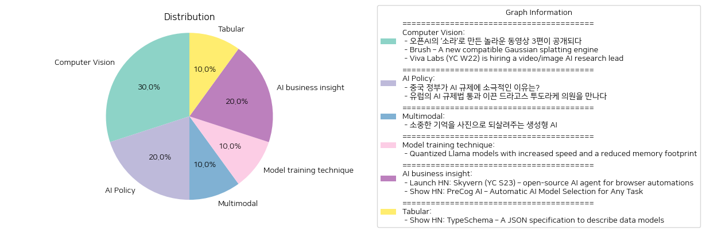

# Daily Artificial Intelligence Insights : News

## 🧸 Computer Vision

**요약:**

1. **주요 주제**:
   이 뉴스 기사들의 주요 주제는 인공지능(AI)의 발전과 응용, 동영상 생성과 3D 복원 기술, 그리고 AI 비전 연구의 인재 채용입니다. 공통된 키워드는 AI, 영상 생성, 3D 기술, 인재 채용으로 식별됩니다.

2. **주요 사건**:
   - 오픈AI는 새로운 동영상 생성 모델 '소라'로 제작한 세 편의 영상을 공개했습니다. 이는 영상 크리에이터들이 소라를 활용하여 창의적인 콘텐츠를 제작한 결과물로, 제작 과정에 대한 정보가 제공되었습니다.
   - 'Brush'는 WebGPU와 Burn 프레임워크를 사용하는 Gaussian splatting 기술을 통해 3D 복원을 실현하는 엔진으로, 휴대성과 유연성을 목표로 한 개념 증명 단계에 있습니다.
   - Viva Labs는 AI 기반의 영상 커뮤니케이션 도구를 개발하고 있으며, 영상 및 이미지 AI 연구 리드를 채용하고 있습니다. 이는 컴퓨터 비전 모델 구축에 관심이 있는 인재를 찾고 있습니다.

3. **영향 분석**:
   - 오픈AI의 '소라'는 동영상 생성의 혁신을 불러 일으키며, 콘텐츠 제작 분야에 새로운 가능성을 열었습니다. 이는 엔터테인먼트 산업에 큰 영향을 미칠 수 있습니다.
   - Brush의 개발은 3D 복원 기술의 발전을 도모하며, 가상 현실(VR) 및 증강 현실(AR) 분야에 긍정적인 영향을 미칠 수 있습니다.
   - Viva Labs의 채용 정책은 AI 산업 내에서의 인재 경쟁을 심화시키며, AI 기술 발전에 속도를 더할 수 있습니다.

4. **최종 요약**:
   최근 기술 트렌드는 AI를 중심으로 동영상 및 3D 기술의 혁신을 강조합니다. 오픈AI의 '소라'는 창의적 콘텐츠 생성의 가능성을 확장하였고, Brush는 3D 기술의 유연성과 확장성을 목표로 하고 있다. Viva Labs의 채용은 AI 연구와 개발의 인재 수요를 반영합니다. 앞으로 AI 및 크리에이티브 기술의 발전이 인프라를 바탕으로 더욱 촉진될 것으로 보입니다. AI 기술의 급속한 발전은 여러 산업에서의 변화를 이끌 것이며, 사회와 경제에 미칠 영향을 주시할 필요가 있습니다.

**출처:**

 - 오픈AI의 ‘소라’로 만든 놀라운 동영상 3편이 공개되다 (https://www.technologyreview.kr/%ec%98%81%ec%83%81-%ec%83%9d%ec%84%b1-%eb%aa%a8%eb%8d%b8-%ec%86%8c%eb%9d%bc%eb%a1%9c-%eb%a7%8c%eb%93%a0-%eb%86%80%eb%9d%bc%ec%9a%b4-%ec%98%81%ed%99%94-3%ed%8e%b8%ec%9d%b4-%ea%b3%b5%ea%b0%9c%eb%90%98/)
 - Brush – A new compatible Gaussian splatting engine (https://github.com/ArthurBrussee/brush)
 - Viva Labs (YC W22) is hiring a video/image AI research lead (https://www.ycombinator.com/companies/viva-labs/jobs/RwBJyRn-video-image-ai-research-lead)

## 🧸 AI Policy

**요약:**

1. **주요 주제**:
   - AI 규제: 중국과 유럽의 AI 규제 접근법 차이
   - AI 산업 성장: 국가별 규제가 AI 산업에 미치는 영향

2. **주요 사건**:
   - 중국 정부는 AI 기술 규제에 대해 의도적으로 느슨한 정책을 유지하고 있으며, 이는 자국의 AI 산업 성장을 도모하기 위한 전략으로 해석된다.
   - 유럽에서는 드라고스 투도라케 의원의 주도로 역사적인 AI 규제법이 통과되어 AI 산업 개선을 목표로 하고 있다.

3. **영향 분석**:
   - 중국: 정부의 느슨한 규제 접근은 AI 기술 혁신과 국내 산업 성장에 긍정적일 수 있으나, 글로벌 규제 공조에 어려움을 겪을 가능성이 있다.
   - 유럽: 엄격한 AI 규제법 통과는 기술 발전과 안전, 윤리적 측면을 강화할 수 있으나, 산업 발전 속도에 영향을 미쳐 기업의 부담이 될 수 있다.

4. **최종 요약**:
   최근 두 가지 주요 지역에서 AI 규제에 대한 상반된 접근이 주목된다. 중국은 느슨한 규제를 통해 AI 산업 성장에 중점을 두고 있는 반면, 유럽은 엄격한 규제를 통해 산업의 윤리성과 안정을 추구하고 있다. 이러한 움직임들은 각 지역의 경제 및 사회적 발전에 중대한 영향을 미칠 것으로 예상된다. 향후 중국의 AI 혁신과 유럽의 AI 안전성 간의 균형을 맞추는 글로벌 협력의 필요성이 제기될 수 있다.

**출처:**

 - 중국 정부가 AI 규제에 소극적인 이유는? (https://www.technologyreview.kr/%ec%a4%91%ea%b5%ad-%ec%a0%95%eb%b6%80%ea%b0%80-%ed%98%84%ec%9e%ac%eb%a1%9c%ec%84%9c%eb%8a%94-ai-%eb%b6%84%ec%95%bc%eb%a5%bc-%ea%b0%80%ed%98%b9%ed%95%98%ea%b2%8c-%ea%b7%9c%ec%a0%9c%ed%95%98%ec%a7%80/)
 - 유럽의 AI 규제법 통과 이끈 드라고스 투도라케 의원을 만나다 (https://www.technologyreview.kr/ai-%ea%b7%9c%ec%a0%9c%eb%b2%95-%ed%86%b5%ea%b3%bc-%ec%9d%b4%eb%81%88-%eb%93%9c%eb%9d%bc%ea%b3%a0%ec%8a%a4-%ed%88%ac%eb%8f%84%eb%9d%bc%ec%bc%80-%ec%9d%98%ec%9b%90%ec%9d%84-%eb%a7%8c%eb%82%98%eb%8b%a4/)

## ☀️ Multimodal

**요약:**

**요약 보고서**

1. **주요 주제**:
   이번 뉴스 기사는 '생성형 AI'와 '합성 기억' 프로젝트에 중점을 두고 있습니다. 세부적으로 보면, 기술의 발전을 통해 사람들이 잃어버린 혹은 기록할 수 없었던 기억을 시각적으로 되살릴 수 있는 방법에 대해 다루고 있습니다. 이는 AI가 개인의 사적이고 감정적인 경험의 일부로 자리잡을 가능성을 암시합니다.

2. **주요 사건**:
   - 생성형 AI를 활용하여 과거의 기억을 이미지로 만들어주는 '합성 기억' 프로젝트가 추진되고 있다.
   - 이는 다양한 국가와 문화의 가족들이 카메라에 담지 못했던 추억을 복원할 수 있게 돕고 있으며, 기술이 개인의 사적인 경험과 감정을 다루는 방식을 혁신하고 있습니다.

3. **영향 분석**:
   - **경제**: AI 기술의 발전으로 인해 새로운 시장과 산업이 생길 수 있으며, 특히 디지털 콘텐츠 제작 및 보관 분야에서 활발한 협업과 서비스 확대가 예상됩니다.
   - **사회**: 개인의 추억을 되살리려는 움직임은 가족 및 공동체 내의 정체성 강화로 이어질 가능성이 높습니다. 다만, 개인정보 보호와 같은 윤리적 문제에 대한 논의도 중요해질 것입니다.
   - **정치**: 이러한 기술 발전이 개인정보 보호법, AI 사용 규제 강화 등의 정책적 대응을 요구할 수 있습니다.

4. **최종 요약**:
   기사에서 다루고 있는 '합성 기억' 프로젝트는 기술의 영역을 감정적이고 개인적인 수준으로 확장하는 중요한 사례로 볼 수 있습니다. 이러한 발전은 개인과 사회의 기억을 다루는 방식에 혁신을 불러올 가능성이 있으며, 기술적 진보와 사회적, 윤리적 문제에 대한 균형 잡힌 논의가 필요합니다. 앞으로의 발전 방향으로는 AI 기술의 윤리적 사용, 개인정보 보호 강화, 그리고 디지털 추억 보관 서비스의 확대 등을 주목해야 할 것입니다.

**출처:**

 - 소중한 기억을 사진으로 되살려주는 생성형 AI (https://www.technologyreview.kr/%ec%83%9d%ec%84%b1%ed%98%95-ai%eb%a1%9c-%ea%b0%80%ec%9e%a5-%ec%86%8c%ec%a4%91%ed%95%9c-%ea%b8%b0%ec%96%b5%ec%9d%84-%ec%82%ac%ec%a7%84%ec%9c%bc%eb%a1%9c-%eb%a7%8c%eb%93%a0%eb%8b%a4/)

## 🎇 Model training technique

**요약:**

**요약 보고서**

1. **주요 주제**:
   - 본 기사에서는 양자화된 라마(Quantized Llama) 모델의 향상된 속도와 감소된 메모리 소비가 주요 주제로 다루어지고 있습니다. 이는 인공지능 및 기계 학습 분야에서의 기술 발전과 최적화에 대한 관심을 반영합니다.

2. **주요 사건**:
   - 기사는 라마 모델을 양자화하는 과정에서 발생한 문제를 해결하기 위한 노력을 강조하고 있습니다. 기술적 문제 해결 및 성능 개선을 통해 더 빠른 처리와 효율적 메모리 사용을 목표로 하고 있습니다.

3. **영향 분석**:
   - 경제적 측면에서, 이러한 기술 향상은 컴퓨팅 자원의 효율성을 높여 비용 절감과 기업의 생산성을 증가시킬 수 있습니다. 정치적으로는 국가 간 기술 경쟁력을 강화하고자 하는 움직임이 예상됩니다. 사회적 측면에서는 인공지능의 접근성을 높여 다양한 분야에서 활용 가능성을 확대할 수 있습니다.

4. **최종 요약**:
   - 양자화된 라마 모델의 개발 및 도입은 인공지능 기술의 발전을 지속적으로 촉진시키며, 메모리 효율성과 처리 속도의 측면에서 새로운 가능성을 제시합니다. 향후 기술적 문제 해결과 안정적인 도입이 관건이며, 경제적 생산성 향상과 사회 전반에 걸친 AI 활용도 증가가 기대됩니다. 이러한 기술 발전을 통해 다가올 미래에서 인공지능이 더욱 실질적인 역할을 할 수 있도록 지켜보아야 할 것입니다.

**출처:**

 - Quantized Llama models with increased speed and a reduced memory footprint (https://ai.meta.com/blog/meta-llama-quantized-lightweight-models/?_fb_noscript=1)

## 💚 AI business insight

**요약:**

1. **주요 테마**:
   - 모든 뉴스 기사에서 주요하게 다뤄진 주제는 인공지능과 자동화입니다. 특히, 웹사이트 자동화와 AI 모델 선택 최적화와 같은 인공지능의 활용이 두드러졌습니다. 이러한 주제는 기술 발전, 특히 인공지능 기술의 증가와 관련된 사업과 개발 동향을 반영하고 있습니다.

2. **주요 사건**:
   - 'Skyvern'은 웹사이트 상의 작업 흐름을 자동화하는 도구로, LLM과 컴퓨터 비전을 사용하여 다양한 웹사이트에서 수작업을 자동화할 수 있는 간단한 API 엔드포인트를 제공합니다.
   - 'PreCog AI'는 사용자가 수행하고자 하는 작업에 가장 적합한 AI 모델을 자동으로 선택해주는 스마트 AI 어시스턴트입니다. 코딩에서 창의적 글쓰기에 이르기까지 다양한 영역에서 작업 최적화를 지원합니다.

3. **영향 분석**:
   - 경제: AI와 자동화의 발전은 산업 전반에 걸쳐 생산성과 효율성을 높이며, 이는 장기적으로 기업 비용 절감과 시장 경쟁력 강화로 이어질 수 있습니다.
   - 사회: AI 도구의 발전은 일부 작업의 자동화를 통해 노동 시장의 구조 변화에 영향을 미칠 수 있으며, 이는 새로운 기술과 함께 직업 재교육의 필요성을 증가시킬 수 있습니다.
   - 기술: 이러한 AI 도구들은 기술 분야의 혁신과 발전을 지속적으로 촉진하여, 더 많은 개발자와 기업들이 AI를 활용한 새로운 솔루션을 개발하게 될 것입니다.

4. **최종 요약**:
   - 언급된 기술 발전은 AI와 자동화가 어떻게 다양한 산업 분야에서 역할을 확장하고 있는지를 보여줍니다. 특히, Skyvern과 PreCog AI는 작업의 효율성을 향상시키는 데 중요한 도구로 활용될 수 있습니다. 향후 AI 기술의 지속적인 발전과 그것이 경제 및 사회에 미치는 영향을 주목할 필요가 있으며, 이러한 발전은 작업 환경의 변화와 새로운 교육 요구로 이어질 가능성이 큽니다. AI와 자동화는 앞으로도 많은 기업과 산업에서 핵심적인 역할을 할 것이며, 이에 따른 변화와 기회를 관찰하는 것이 중요합니다.

**출처:**

 - Launch HN: Skyvern (YC S23) – open-source AI agent for browser automations (https://github.com/Skyvern-AI/Skyvern)
 - Show HN: PreCog AI – Automatic AI Model Selection for Any Task (https://precog.ubik.studio/)

## 🤩 Tabular

**요약:**

**종합 뉴스 요약 보고서**

1. **주요 주제**:
   - 이번 뉴스 타이틀에서 주된 주제는 데이터 모델을 묘사하는 JSON 사양, 즉 TypeSchema입니다. 이는 프로그래밍 언어에 독립적인 형식으로 데이터 모델을 설명하는 기술입니다. 이러한 기술 주제는 최근 소프트웨어 개발 트렌드와 함께 데이터 관리의 중요성과 기술 발전을 반영합니다.

2. **주요 사건**:
   - TypeSchema의 발표와 관련하여, JSON을 활용한 데이터 모델 설명이 주목받고 있습니다. 이는 특정 프로그래밍 언어에 구애받지 않고 다양한 환경에서 데이터 모델을 정의하고 활용할 수 있는 가능성을 열어주는 중요한 발표로 평가됩니다.

3. **영향 분석**:
   - **경제**: 개발자들이 프로그래밍 언어 독립적으로 데이터 모델을 정의할 수 있게 됨에 따라, 소프트웨어 개발의 효율성이 증가하고, 장기적으로 소프트웨어 개발 비용이 절감될 가능성이 있습니다. 이는 소프트웨어 솔루션이자 서비스(SaaS) 시장의 성장에 긍정적인 영향을 미칠 수 있습니다.
   - **사회**: 다양한 프로그래밍 언어와 환경을 고려할 필요 없이 데이터 모델을 정의할 수 있게 됨으로써, 소프트웨어 개발 과정의 접근성이 높아져 소프트웨어 개발 참여가 늘어날 수 있습니다.

4. **최종 요약**:
   - 전반적으로 TypeSchema는 데이터 모델링에 있어 새로운 패러다임을 제시하고 있으며, 프로그래밍 언어의 벽을 허물고 있다는 점에서 주목할 만합니다. 소프트웨어 개발 분야에서의 효율성을 높이고 접근성을 확대하면서, 향후 다양한 분야에서의 응용 및 발전 가능성을 관찰할 필요가 있습니다. TypeSchema의 발전 및 적용 사례의 확산이 예측되며, 관련된 기술적 업데이트와 실제 사용 사례 추이에 대한 관심이 필요합니다.

**출처:**

 - Show HN: TypeSchema – A JSON specification to describe data models (https://typeschema.org/)

