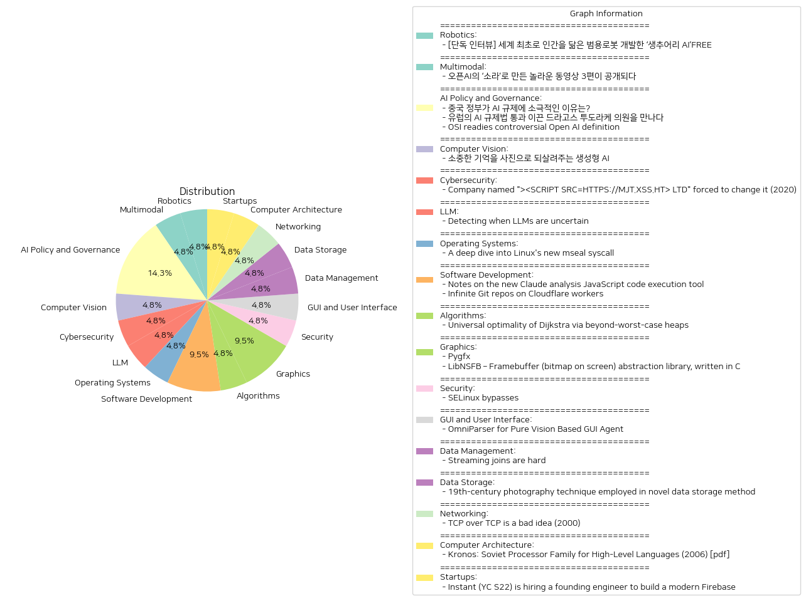

# Daily Artificial Intelligence Insights : News

## 🍋 Robotics

**요약:**

1. **주요 테마**:
   - 인간과 닮은 범용 로봇 개발
   - 인공지능(AI)을 활용한 로봇 기술 혁신
   - 복잡하고 변화하는 일상 상황에 대처하는 로봇의 역할
   - 캐나다의 로봇 전문기업 생추어리 AI의 연구와 개발

2. **주요 사건**:
   - 생추어리 AI는 세계 최초로 인간을 닮은 범용 로봇을 개발하고 있으며, 이는 AI를 통해 복합적이고 예측 불가능한 일상 상황에서 유연한 대응을 가능케 하려는 목표를 가지고 있다.
   - 조르디 로즈 CEO와의 인터뷰를 통해 미래 로봇의 발전 방향과 기술적 목표에 대해 구체적인 내용이 드러났다.

3. **영향 분석**:
   - **경제적 영향**: 범용 로봇의 개발은 다양한 산업 분야에서의 자동화와 효율성 증대로 이어질 수 있다. 특히 노동력 부족 문제를 해결하고 생산성을 증가시킬 수 있을 것으로 보인다.
   - **사회적 영향**: 인간을 닮은 로봇이 일상에 도입될 경우, 인간과 로봇의 상호작용 방식이 크게 변화할 것이라는 기대가 있다. 이로 인해 사회적 문화 및 윤리적 논의가 활발해질 가능성도 크다.
   - **기술적 영향**: AI 기술과 로봇 공학의 발달은 첨단 기술 분야의 혁신을 가속화하며, 글로벌 기술 패권 경쟁에 영향을 미칠 수 있다.

4. **최종 요약**:
   - 생추어리 AI의 인공지능 기반 범용 로봇 개발은 기술 혁신의 중요한 이정표로, 다양한 산업에 미칠 경제적, 사회적 영향이 클 것으로 예상된다. 이러한 기술이 실질적으로 일상에 도입되기 위해서는 기술적 완성도뿐만 아니라 윤리적, 사회적 고려 사항들이 충분히 논의되어야 한다. 앞으로 인간-로봇 상호작용의 새로운 표준과 이에 따른 사회적 변화에 주목할 필요가 있다. 미래의 로봇 기술 발전이 가져올 다양한 기회와 도전을 지속적으로 모니터링할 필요가 있다.

**출처:**

 - [단독 인터뷰] 세계 최초로 인간을 닮은 범용로봇 개발한 ‘생추어리 AI’FREE (https://www.technologyreview.kr/%ec%9d%b8%ed%84%b0%eb%b7%b0-%ec%83%9d%ec%b6%94%ec%96%b4%eb%a6%ac-ai%ea%b0%80-%ea%b7%b8%eb%a6%ac%eb%8a%94-%eb%af%b8%eb%9e%98%ec%9d%98-%eb%a1%9c%eb%b4%87%ec%9d%80-%ec%8b%a4%ec%b2%b4%ed%99%94/)

## ☀️ Multimodal

**요약:**

1. **주요 주제**:
   이 뉴스 기사에서 다루는 주요 테마는 기술 발전, 특히 인공지능(AI) 기술의 진보와 활용입니다. 오픈AI의 새로운 동영상 생성 모델인 '소라'가 강조되고 있으며, 이 혁신적인 기술이 영상 제작의 새로운 가능성을 제시하고 있다는 점이 부각되고 있습니다. 또한, 크리에이터들이 이러한 기술을 어떻게 활용하는지에 대한 관심도 포함되어 있습니다.

2. **주요 사건**:
   - 2월 중순에 오픈AI가 새로운 동영상 생성 모델 '소라'로 인해 대중의 주목을 받음.
   - 최근 이 모델을 활용하여 제작된 3편의 동영상이 공개됨.
   - 영상 제작자들과의 인터뷰를 통해 제작 목적 및 제작 기법에 대한 정보가 제공됨.

3. **영향 분석**:
   - **경제적 영향**: '소라'와 같은 혁신적인 AI 기술은 영상 제작 비용을 절감하고, 제작 시간을 단축시켜 효율성을 높일 수 있습니다. 이는 영상 제작 산업 전반에 걸쳐 경제적 가치를 창출할 가능성을 제시합니다.
   - **사회적 영향**: 이러한 기술은 크리에이터 및 일반 대중에게 새로운 형태의 콘텐츠 제작 기회를 제공합니다. 따라서, 이는 새로운 창작 방식의 발전을 촉진하고, 더 많은 사람들이 콘텐츠 제작에 참여할 수 있는 기반을 마련할 것입니다.
   - **심리적·문화적 영향**: 인공지능을 활용한 콘텐츠는 스토리텔링 방식의 변화를 가져올 수 있으며, 특히 시청자들의 몰입감을 증가시킬 수 있는 가능성을 제공합니다.

4. **최종 요약**:
   오픈AI의 '소라' 기술은 동영상 생성 분야에서 혁신적인 변화를 이끌어내고 있으며, 이로 인해 영상 제작의 방식에 새로운 혁신이 예상됩니다. 이는 경제적으로 제작 비용 절감과 효율성 증진을 가져오고, 사회적으로는 새로운 콘텐츠 생성의 문을 열어 줄 것입니다. 향후 '소라' 기술이 얼마나 널리 사용될 것인지, 그리고 이는 콘텐츠 산업에 어떤 장기적 영향을 미칠 것인지가 주목할 만한 발전 방향입니다.

**출처:**

 - 오픈AI의 ‘소라’로 만든 놀라운 동영상 3편이 공개되다 (https://www.technologyreview.kr/%ec%98%81%ec%83%81-%ec%83%9d%ec%84%b1-%eb%aa%a8%eb%8d%b8-%ec%86%8c%eb%9d%bc%eb%a1%9c-%eb%a7%8c%eb%93%a0-%eb%86%80%eb%9d%bc%ec%9a%b4-%ec%98%81%ed%99%94-3%ed%8e%b8%ec%9d%b4-%ea%b3%b5%ea%b0%9c%eb%90%98/)

## 🎠 AI Policy and Governance

**요약:**

**주요 주제**:
- 모든 뉴스 기사에서 AI(인공지능) 규제와 관련된 다양한 견해와 접근 방식이 주요 테마로 등장하고 있습니다.
- 중국 정부의 느슨한 AI 규제 방침, 유럽연합의 강경한 AI 규제 법안 통과, 그리고 개방형 AI 정의 제정에 대한 논란이 주요 주제입니다.

**주요 사건**:
- **중국**: 중국 정부는 AI 기술의 발전과 자국 산업 성장을 촉진하기 위해 AI 규제에 대해 비교적 느슨한 태도를 취하고 있다는 기사가 강조되었습니다. 이는 소비자 기술 플랫폼에 대한 강경한 규제와 대비됩니다.
- **유럽연합**: 드라고스 투도라케 의원이 주도하여 유럽의회에서 AI 규제법이 통과되었습니다. 그는 이 규제 법안이 AI 산업의 개선을 이끌어낼 것이라는 믿음을 표명했습니다.
- **오픈 소스 AI 논란**: Open Source Initiative(오픈 소스 이니셔티브)에서 정의한 'Open AI' 정의에 대해 논란이 일고 있습니다. 비평가들은 이 정의가 오픈 소스의 기본 원칙을 약화시키고, 투명성과 혁신을 제한한다고 주장합니다.

**영향 분석**:
- **경제**: 중국의 느슨한 AI 규제는 AI 산업의 급속한 발전을 가져올 것으로 기대되지만, 이는 다른 국가와의 산업 경쟁에서 불균형을 초래할 수 있습니다.
- **정치**: 유럽의 AI 규제법 통과는 AI 기술의 안전성과 윤리성에 대한 중요성을 높이는 정치적 움직임으로 평가되며, 다른 나라에도 영향을 미칠 것으로 보입니다.
- **사회적 측면**: 오픈 소스 AI 정의의 논란은 기술의 개발 및 투명성에 대한 사회적 논의와 함께, 오픈 소스 커뮤니티 내의 갈등을 야기할 수 있습니다.

**최종 요약**:
최근 뉴스에서는 AI 기술의 규제와 정의에 대한 다양한 국가적 및 국제적 접근법이 부각되고 있습니다. 중국은 산업 성장을 위한 느슨한 규제를 택했고, 유럽연합은 더욱 강력한 규제를 도입했으며, 오픈 소스 AI에 대한 정의를 둘러싼 논란이 지속되고 있습니다. 이는 AI 기술이 각국의 정치, 경제, 사회 전반에 걸쳐 어떠한 영향을 미칠 것인가에 대한 중요한 질문을 제기하고 있습니다. 미래에는 각국의 규제 조치가 국제 표준으로 자리잡을 것인지, 그리고 AI 기술 발전에 있어 공정성과 윤리가 어떻게 유지될 것인지에 대한 주의 깊은 관찰이 필요합니다.

**출처:**

 - 중국 정부가 AI 규제에 소극적인 이유는? (https://www.technologyreview.kr/%ec%a4%91%ea%b5%ad-%ec%a0%95%eb%b6%80%ea%b0%80-%ed%98%84%ec%9e%ac%eb%a1%9c%ec%84%9c%eb%8a%94-ai-%eb%b6%84%ec%95%bc%eb%a5%bc-%ea%b0%80%ed%98%b9%ed%95%98%ea%b2%8c-%ea%b7%9c%ec%a0%9c%ed%95%98%ec%a7%80/)
 - 유럽의 AI 규제법 통과 이끈 드라고스 투도라케 의원을 만나다 (https://www.technologyreview.kr/ai-%ea%b7%9c%ec%a0%9c%eb%b2%95-%ed%86%b5%ea%b3%bc-%ec%9d%b4%eb%81%88-%eb%93%9c%eb%9d%bc%ea%b3%a0%ec%8a%a4-%ed%88%ac%eb%8f%84%eb%9d%bc%ec%bc%80-%ec%9d%98%ec%9b%90%ec%9d%84-%eb%a7%8c%eb%82%98%eb%8b%a4/)
 - OSI readies controversial Open AI definition (https://lwn.net/SubscriberLink/995159/a37fb9817a00ebcb/)

## 💚 Computer Vision

**요약:**

1. **핵심 주제**:
   - 생성형 AI의 기술 발전 
   - 기술을 통한 소중한 기억의 복원
   - 가족과 과거의 추억 재현

2. **주요 사건**:
   - '합성 기억' 프로젝트의 추진: 생성형 AI를 활용하여 개인의 기억을 이미지로 변환하는 기술이 개발되고 있으며, 이로 인해 전 세계 다양한 가족들이 카메라로 담지 못했던 과거의 추억을 복원할 수 있는 프로젝트가 현재 진행 중이다.

3. **영향 분석**:
   - **사회적 영향**: 많은 사람들이 과거의 소중한 순간을 생생하게 되살릴 수 있어 그들의 정서적 만족감과 연결감을 강화할 수 있다. 이는 추억을 공유하고 재경험하는 새로운 방식을 제공함으로써 가족, 친지 간의 연대감을 높일 수 있다.
   - **기술적 영향**: 생성형 AI 기술의 발전과 활용이 더욱 확대되고 있으며, 이는 이미지 처리 분야뿐만 아니라 다양한 디지털 콘텐츠 생성에도 응용될 전망이다.
   - **경제적 영향**: 이와 같은 AI 기술의 발전은 사진, 미디어, 레저 서비스 등에 새로운 시장을 형성할 가능성이 있으며, 관련 산업의 경제적 성장에 기여할 수 있다.

4. **최종 요약**:
   - 생성형 AI를 이용하여 개인의 기억을 사진으로 되살려주는 '합성 기억' 프로젝트는 기술과 감정의 교차로에서 매우 흥미로운 발전을 보여준다. 이는 가족과 사회 전반에 긍정적인 영향을 미칠 수 있으며, 새로운 감성적 경험 제공을 통해 기술의 따뜻한 활용을 가능하게 한다. 또한, AI 기술의 진보가 계속됨에 따라 이는 다른 형태의 디지털 콘텐츠 생성이나 다양한 분야로의 확장이 기대된다. 앞으로 이러한 기술이 가져올 감정적, 경제적, 그리고 사회적 영향력을 지속적으로 모니터링할 필요가 있다.

**출처:**

 - 소중한 기억을 사진으로 되살려주는 생성형 AI (https://www.technologyreview.kr/%ec%83%9d%ec%84%b1%ed%98%95-ai%eb%a1%9c-%ea%b0%80%ec%9e%a5-%ec%86%8c%ec%a4%91%ed%95%9c-%ea%b8%b0%ec%96%b5%ec%9d%84-%ec%82%ac%ec%a7%84%ec%9c%bc%eb%a1%9c-%eb%a7%8c%eb%93%a0%eb%8b%a4/)

## 🪐 Cybersecurity

**요약:**

**1. 주요 테마**:
   - **보안 위협 및 규정 준수**: 기업의 이름이 해킹과 관련된 보안 위협을 야기하여 변경이 필요했던 사례는 사이버 보안의 중요성과 규정 준수의 필요성을 강조합니다.

**2. 주요 사건**:
   - 한 회사가 "<SCRIPT SRC=HTTPS://MJT.XSS.HT> LTD"라는 이름을 사용했으나, 이 이름이 크로스 사이트 스크립팅(XSS) 보안 위험을 초래하여 이름을 변경할 수밖에 없는 사건이 발생했습니다. 해당 이름은 HTML 스크립트 태그를 포함하여 악성 코드가 다른 웹사이트에서 실행될 수 있는 리스크가 있었습니다.

**3. 영향 분석**:
   - **경제적 영향**: 기업의 명칭 변경은 마케팅 및 브랜딩 전략의 수정이 필요하게 되어 추가적인 비용과 시간을 소비하게 만듭니다.
   - **사회적 영향**: 이러한 사건은 기업과 소비자에게 기존 및 새로운 디지털 보안 위협에 대한 경각심을 높이고 보안 교육의 필요성을 부각시켰습니다.
   - **기술적 영향**: 웹사이트 및 애플리케이션 보안 강화의 필요성을 다시금 확인시키며, 보안 방법론 및 기술 발전을 촉진할 수 있습니다.

**4. 최종 요약**:
   - 최근 발생한 기업명 변경 사건은 디지털 시대에서 보안의 중요성을 재조명하며, 사이버 보안 규정을 준수하지 않을 경우 예상치 못한 비용과 리스크를 맞이할 수 있음을 상기시킵니다. 보안 강화와 기술 발전은 앞으로도 지속적인 과제로 남을 것이며, 기업들은 이러한 사건을 교훈 삼아 보안 정책을 철저히 재점검하고 강화할 필요가 있습니다. 향후 유사한 보안 사건이 발생할 가능성에 대비하기 위한 규제와 정책 강화가 이루어질 가능성을 주시해야 합니다.

**출처:**

 - Company named "><SCRIPT SRC=HTTPS://MJT.XSS.HT> LTD" forced to change it (2020) (https://www.theguardian.com/uk-news/2020/nov/06/companies-house-forces-business-name-change-to-prevent-security-risk)

## 🐱 LLM

**요약:**

**1. 주요 주제:**
   - 'Detecting when LLMs are uncertain'기사에서 다룬 주요 주제는 인공지능 모델이 불확실성을 감지하는 방법입니다. 이를 위해 XJDR가 진행하는 프로젝트인 Entropix가 주목받고 있습니다. 이 프로젝트는 불확실한 상황에서 모델 추론을 개선하기 위해 엔트로피 및 변엔트로피와 같은 지표를 활용한 스마트 샘플링 방법을 사용합니다.

**2. 주요 사건:**
   - XJDR의 Entropix 프로젝트가 발표되었으며, 이는 인공지능 모델의 불확실성을 다루기 위한 새로운 접근 방식을 제시하고 있습니다. 이 프로젝트는 모델 추론을 정확하게 하려는 시도로서 엔트로피 관련 지표를 사용하여 보다 유효한 샘플링 방법을 연구하고 있습니다.

**3. 영향 분석:**
   - **경제적**: 인공지능 모델의 불확실성 감지는 다양한 산업 분야에서 더욱 정확하고 효율적인 예측을 가능하게 하여 비용 절감과 생산성 향상에 기여할 수 있습니다.
   - **정치적**: 이러한 기술은 정책 결정 과정에서 보다 정확한 데이터 분석을 가능하게 하여 정책 기획 및 결정의 신뢰성을 높일 수 있습니다.
   - **사회적**: 사회 전반에 걸쳐 인공지능에 대한 신뢰가 증가할 수 있으며, 이는 AI 기술의 대중화와 수용성에 긍정적인 영향을 미칠 것입니다.
   - **환경적**: AI 모델의 효율 향상은 환경 데이터 분석에 기여하여 지속 가능한 발전을 지원할 수 있습니다.

**4. 최종 요약:**
   - XJDR의 Entropix 프로젝트는 인공지능 모델의 불확실성 문제를 해결하기 위한 중요한 접근 방식을 제공하고 있습니다. 이는 다양한 산업 및 사회적 측면에 걸쳐 긍정적인 파급 효과를 가져올 수 있으며, AI 기술의 신뢰성과 효율성을 높일 잠재력을 가지고 있습니다. 앞으로 이러한 기술의 발전은 여러 분야에서의 혁신을 촉진할 것으로 예상되며, 관련 기술 개발 및 적용 방안을 주목할 필요가 있습니다.

**출처:**

 - Detecting when LLMs are uncertain (https://www.thariq.io/blog/entropix/)

## ✈️ Operating Systems

**요약:**

1. **주요 테마**:
   - 리눅스 커널의 새로운 시스템 호출 기능인 mseal의 보안 향상
   - 메모리 보호 및 악성 코드 방지 기술의 발전
   - 소프트웨어 보안 강화 및 익스플로잇 방지를 위한 새로운 기술

2. **주요 사건**:
   - mseal이라는 새로운 리눅스 커널 시스템 호출이 발표되었다. 이 시스템 호출은 메모리 씰링 보호를 제공하여 가상 메모리 주소 범위에 대한 악의적인 수정을 방지하고, 퍼미션 조작 및 '홀 펀칭' 등의 익스플로잇 시나리오를 차단한다. 이를 통해 기존의 NX 보호 방식을 보완할 수 있으며, 데이터 전용 익스플로잇 기법을 예방할 수 있다.

3. **영향 분석**:
   - **경제**: 리눅스 커널의 새로운 보안 기능은 IT 보안 업계의 기술 진보를 촉진할 것이며, 추가적인 보안 조치로 인해 보안 관련 서비스를 제공하는 기업들의 산업적 이익을 증대시킬 수 있다.
   - **정치**: 국가 차원의 사이버 보안 강화 정책에 mseal과 같은 기술의 도입이 긍정적인 영향을 줄 수 있다.
   - **사회**: 새로운 보안 기능은 일반 사용자와 기업 모두에게 데이터를 보호하는 이점을 제공하며, 사이버 범죄에 대한 범국가적 대응을 강화하는 데 도움을 줄 수 있다.

4. **최종 요약**:
   - mseal 시스템 호출의 도입은 리눅스 기반 시스템에서 메모리 보안을 강화하는 중요한 발전이다. 이는 기술적 진보를 통해 사이버 보안 위협을 줄이고 데이터 보호를 강화하며, IT 보안 산업의 새로운 기회를 창출할 수 있다. 앞으로 이러한 기술들이 각종 보안 솔루션에 통합되면서 다양한 추가적인 보안 대책이 발전할 것으로 보이며, 이는 사이버 범죄 예방이라는 관점에서 중요한 변화로 평가될 수 있다. 미래에 다른 운영 체제나 플랫폼에서도 유사한 보안 강화 기능의 개발을 주목할 필요가 있다.

**출처:**

 - A deep dive into Linux's new mseal syscall (https://blog.trailofbits.com/2024/10/25/a-deep-dive-into-linuxs-new-mseal-syscall/)

## 🌿 Software Development

**요약:**

1. **주요 테마**:
   두 뉴스 기사 모두 인공지능(AI)과 소프트웨어 개발 도구에 관련된 주제를 다루고 있습니다. AI 모델의 실행 및 협력적 개발 도구의 발전과 클라우드 기반 실행 환경이 주요한 트렌드로 나타납니다. 특히, JavaScript 실행 도구와 Webassembly Git 서버의 사용이 강조되고 있습니다.

2. **주요 사건**:
   첫 번째 기사에서는 Anthropic이 Claude.ai를 위한 새로운 분석 도구를 출시한 사건이 핵심입니다. 이 도구는 사용자들이 브라우저에서 JavaScript 코드를 작성하고 실행함으로써 대화형 프로세스를 이어갈 수 있도록 합니다. 두 번째 기사에서는 Cloudflare Workers에서 실행되는 Webassembly Git 서버를 활용한 Gitlip이라는 협업 개발 도구가 소개되어 AI 모델 적용을 간편하게 만듭니다.

3. **영향 분석**:
   - **경제**: 이러한 기술의 발전은 소프트웨어 개발 효율성을 높이고, 개발 비용 절감 및 생산성 향상에 기여할 수 있습니다.
   - **정치**: 소프트웨어가 국가 IT 정책에 중요한 역할을 하기 때문에 이러한 기술 발전은 AI 및 개발 정책의 초석이 될 수 있습니다.
   - **사회**: 협력적 개발 도구는 개발자 간의 소통과 협업을 촉진시켜 혁신적인 해결책을 도출하고, 다양한 문제를 해결하는데 기여할 것입니다.

4. **최종 요약**:
   이번 뉴스는 AI와 소프트웨어 개발 도구 분야에서의 혁신이 어떻게 이루어지고 있는지를 잘 보여줍니다. JavaScript 코드 실행 도구와 클라우드 기반 Git 서버는 개발자들이 더 효율적이고 협력적으로 작업할 수 있는 환경을 제공합니다. 이러한 발전은 장기적으로 소프트웨어 개발의 표준을 변화시킬 가능성이 있으며, AI 통합이 가속화될 것입니다. 미래에는 이러한 기술들이 다양한 분야로 확산되면서 더욱 혁신적인 AI 솔루션의 기반이 될 것으로 예상됩니다.

**출처:**

 - Notes on the new Claude analysis JavaScript code execution tool (https://simonwillison.net/2024/Oct/24/claude-analysis-tool/)
 - Infinite Git repos on Cloudflare workers (https://gitlip.com/blog/infinite-git-repos-on-cloudflare-workers)

## 🎇 Algorithms

**요약:**

1. **주요 주제**:
   - 다익스트라 알고리즘 최적성을 논의하는 새로운 데이터 구조의 도입
   - 성능 개선을 위한 '최악의 경우'를 넘는 데이터 처리 방식

2. **주요 사건**:
   - 다익스트라 알고리즘이 새로운 힙 데이터 구조를 사용하여 보편적으로 최적임을 증명
   - 새로운 데이터 구조가 작업의 지역성을 활용하여 최소 요소를 추출하는 성능을 개선함
   - 특히 다익스트라 알고리즘의 실행에 적합한 구조로 설계됨

3. **영향 분석**:
   - **경제**: 효율적인 알고리즘과 데이터 구조 도입으로 인해 컴퓨팅 자원의 보다 나은 활용이 가능해져 비용 절감 및 작업 속도 개선 효과 예상
   - **사회와 기술**: 알고리즘의 효율이 증가하면서 관련 데이터 처리 시스템 및 응용 소프트웨어의 성능이 향상될 가능성이 있음

4. **최종 요약**:
   다익스트라 알고리즘의 보편적 최적성을 확보할 수 있는 새로운 데이터 구조가 개발되어 알고리즘의 효율성을 크게 향상시킬 것으로 기대된다. 이러한 발전은 경제적 측면에서 컴퓨팅 자원의 활용을 극대화하고, 사회 및 기술적으로 관련 산업의 발전을 촉진할 잠재력을 가지고 있다. 앞으로 이 알고리즘이 다양한 분야에서 어떻게 활용될지에 대한 관심과 연구가 지속될 것으로 예상되며, 더욱 향상된 데이터 구조와 알고리즘이 계속해서 개발될 것으로 기대된다.

**출처:**

 - Universal optimality of Dijkstra via beyond-worst-case heaps (https://arxiv.org/abs/2311.11793)

## 🌞 Graphics

**요약:**

1. **주요 테마**:
   두 기사에서 공통적으로 나타나는 주요 테마는 소프트웨어 기술의 발전과 관련된 내용입니다. 특히, 시각화 및 그래픽 처리에 관련된 기술이 중심 주제로 다뤄지고 있습니다.

2. **주요 사건**:
   - 'Pygfx'는 파이썬에서 높은 성능으로 강력하고 신뢰할 수 있는 시각화를 제공하는 라이브러리입니다. wgpu를 기반으로 하여 다양한 애플리케이션에서의 간편함과 다재다능함을 특징으로 합니다.
   - 'LibNSFB'는 C 언어로 작성된 프레임 버퍼 추상화 라이브러리이며, 화면에 표시될 픽셀 배열에 대한 추상화를 제공합니다. 다양한 색 농도를 지원하며, 그리기 및 사각형 복사 루틴을 제공합니다.

3. **영향 분석**:
   - **경제적 영향**: 이러한 기술들은 개발자들에게 더 나은 도구와 기능을 제공함으로써 소프트웨어 산업의 생산성을 향상시킬 수 있습니다. 이는 궁극적으로 개발 시간과 비용을 절감할 수 있어 경제에 긍정적인 영향을 미칠 수 있습니다.
   - **사회적 영향**: 이러한 시각화 및 그래픽 라이브러리는 웹, 게임, 데이터 분석 등의 다양한 분야에서 사용될 수 있어, 일반 사용자들에게 보다 풍부하고 직관적인 정보를 제공함으로써 사용자 경험을 향상시킬 수 있습니다.

4. **최종 요약**:
   Pygfx와 LibNSFB는 각각 파이썬과 C 언어 환경에서 혁신적인 그래픽 처리 방법을 제공하여 소프트웨어 개발에서 중요한 발전을 이뤘습니다. 이러한 기술은 경제 및 사회 상의 다방면에서 긍정적인 영향을 미칠 가능성이 있습니다. 앞으로도 이러한 기술들이 더욱 발전하며 다양한 분야에서의 적용이 증가할 것으로 예상되며, 특히 데이터 시각화와 그래픽 인터페이스의 발전이 주목될 만한 주요 사항입니다.

**출처:**

 - Pygfx (https://docs.pygfx.org/stable/index.html)
 - LibNSFB – Framebuffer (bitmap on screen) abstraction library, written in C (https://www.netsurf-browser.org/projects/libnsfb/)

## 👽 Security

**요약:**

1. **주요 주제**:
   모든 기사에서 반복적으로 등장하는 주제는 IT 보안, 특히 SELinux의 취약점 및 보안 우회 방법입니다. SELinux는 리눅스 시스템의 중요한 보안 모듈로, 주요 테마는 보안 정책의 실행 및 허용 로직을 우회하는 방법과 이로 인해 발생할 수 있는 보안 위협을 다룹니다.

2. **주요 사건**:
   각 기사에서 다룬 중요한 사건은 SELinux의 보안 취약점에 대한 발견과 이로 인해 발생할 수 있는 시스템 보안의 우회 가능성입니다. 주요 방식으로는 SELinux를 허용 모드(permissive mode)로 설정, AVC 캐시의 덮어쓰기, 보안 후크 제거 등이 언급되었습니다.

3. **영향 분석**:
   이러한 보안 취약점은 주로 IT 보안 분야에 부정적인 영향을 미칠 수 있습니다. SELinux의 우회는 시스템의 완전한 제어를 타인의 손에 맡길 수 있는 심각한 문제로, 경제적으로 기업의 데이터 유출 등으로 이어져 큰 비용을 초래할 수 있으며, 정치적으로는 국가 중대 기관의 정보가 노출될 수 있어 국가 안보에 큰 위협이 됩니다. 사회적으로는 개인 정보 유출로 인한 사생활 침해 문제가 부각될 수 있습니다.

4. **최종 요약**:
   수집된 뉴스를 종합하면, SELinux의 취약점을 이용한 보안 우회 사례가 꾸준히 발견되고 있으며, 이는 IT 보안 분야에 상당한 위협으로 작용하고 있습니다. 개발자와 IT 보안 전문가들은 SELinux의 보안 패치를 신속하게 적용하고, 지속적인 모니터링과 점검을 통해 보안 수준을 유지하는 것이 중요합니다. 앞으로 이러한 취약점에 대한 보안 강화 노력이 더욱 필요하며, 보안 솔루션의 진화 및 개발을 주시할 필요성이 있습니다.

**출처:**

 - SELinux bypasses (https://klecko.github.io/posts/selinux-bypasses/)

## 💙 GUI and User Interface

**요약:**

1. **주요 주제들**:
   - 인간-컴퓨터 상호작용 향상: OMNIPARSER라는 기술 개발을 통해 사용자 인터페이스와의 상호작용을 강화하고자 했습니다.
   - 기술 발전과 인공지능: GPT-4V의 성능 향상을 목표로 하는 연구가 진행되고 있습니다.

2. **주요 사건**:
   - OMNIPARSER 개발: 연구자들은 스크린샷을 구조화된 요소로 변환하여 사용자 인터페이스와의 상호작용을 개선하는 OMNIPARSER를 개발했습니다. 이를 통해 GPT-4V가 상호 작용 가능한 아이콘을 더 정확하게 탐지하고, 그 의미를 이해하는 능력을 향상시켰습니다.

3. **영향 분석**:
   - 기술 및 사회의 변화: OMNIPARSER의 개발은 인공지능을 통한 사용자 경험 개선을 목표로 하며, 이는 인공지능 기술의 전반적인 발전과 인적 자원의 일상적인 컴퓨터 상호작용에 긍정적인 영향을 미칠 수 있습니다.
   - 경제적 영향: 이러한 기술 발전은 관련 산업 및 경제 영역에서 새로운 시장 기회를 창출할 수 있으며, 생산성 향상으로 이어질 수 있습니다.

4. **최종 요약**:
   OMNIPARSER의 개발은 인공지능 기술을 활용하여 인간-컴퓨터 상호작용을 보다 효율적으로 개선하는 중요한 단계입니다. GPT-4V와 같은 첨단 AI 시스템의 기능을 강화함으로써 사용자 경험을 혁신하는 것은 물론, 경제적·산업적으로도 긍정적인 변화를 불러올 가능성이 큽니다. 이러한 기술 발전은 앞으로 더 많은 혁신과 개발의 기회로 이어질 것으로 보이며, 관련 기술의 발전을 지속적으로 주목할 필요가 있습니다.

**출처:**

 - OmniParser for Pure Vision Based GUI Agent (https://microsoft.github.io/OmniParser/)

## 🪸 Data Management

**요약:**

## 요약 보고서

### 1. **핵심 주제**:
   - 주요 주제는 스트리밍 조인(streaming join)의 복잡성과 관련된 문제입니다. 
   - 지속적으로 변화하는 데이터 처리의 어려움과 이를 효과적으로 관리하기 위한 다양한 전략들이 논의되고 있습니다.

### 2. **주요 사건**:
   - 스트리밍 조인은 끝이 없는(unbounded) 데이터를 다루어야 하기에, 효율적인 상태 관리(state management)와 메모리 및 지연 시간에 대한 엄격한 제약이 필요합니다.
   - 이러한 도전 과제를 극복하기 위해 윈도잉(windowing), 상태 제한(state limiting), 외부 스토리지 시스템 활용 등의 전략이 사용되고 있으며, 이를 통해 스트리밍 조인을 보다 효율적으로 처리할 수 있습니다.

### 3. **영향 분석**:
   - **기술적 영향**: 데이터 처리 및 관리의 복잡성을 줄이는 데 도움을 주며, 특히 대규모 실시간 데이터 애플리케이션에서 효율성과 성능을 향상시킬 수 있습니다.
   - **경제적 영향**: 데이터 처리의 효율성을 높임으로써 기업의 운영 비용을 줄일 수 있으며, 이러한 기술 발전은 데이터 중심 비즈니스 모델의 성장 촉진으로 이어질 수 있습니다.

### 4. **최종 요약**:
   - 스트리밍 조인의 복잡성은 데이터 처리 시스템 설계에 있어 중요한 과제이며, 이를 극복하기 위한 다양한 기술적 전략이 필요합니다. 
   - 이러한 발전은 기술 산업 전반에 걸쳐 실시간 데이터 애플리케이션의 성능을 높이고, 결과적으로 경제적 효율성을 제공하게 될 것입니다.
   - 앞으로도 메모리 관리와 지연시간 최적화 기술이 지속적으로 발전할 것으로 예상되며, 이와 관련된 새로운 솔루션이나 기술적 혁신에 주목할 필요가 있습니다.

**출처:**

 - Streaming joins are hard (https://estuary.dev/streaming-joins-are-hard/)

## ⭐ Data Storage

**요약:**

1. **주요 테마**:
   - 고대의 사진 기술을 활용한 새로운 데이터 저장 방법 개발
   - 혁신적인 기술 적용 및 지속 가능성
   - 에너지 효율성과 장기 보존 가능성

2. **주요 사건**:
   - 94세의 전기 엔지니어 클락 존슨이 구식 사진 기술을 활용해 대용량 데이터를 저장하는 새로운 방법을 개발
   - "스탠딩 웨이브 스토리지"라 불리는 이 발명의 특징은 거의 에너지를 필요로 하지 않으며, 데이터를 수세기 동안 유지할 수 있다는 점

3. **영향 분석**:
   - **경제 부문**: 이러한 기술은 데이터 저장의 에너지 소비를 크게 줄임으로써 데이터 센터의 운영 비용 감소 가능
   - **사회 부문**: 장기 데이터 보존이 가능하여 개인 및 조직의 정보를 보다 안전하게 관리할 수 있음
   - **환경 부문**: 에너지가 거의 들지 않는 데이터 저장 방법은 환경 부담을 줄여 지속 가능한 발전에 기여할 수 있음

4. **최종 요약**:
   클락 존슨의 혁신적인 데이터 저장 방법은 고대 기술을 현대의 데이터 관리 문제 해결에 응용한 사례로 주목받고 있다. 이 발명은 에너지 소비를 줄이고 장기적으로 데이터를 보존할 수 있는 잠재력을 지니고 있으며, 경제적 효율성과 환경적 지속 가능성을 모두 고려하는 방향으로 발전될 가능성이 크다. 앞으로 관련 기술의 상업화와 폭넓은 적용이 기대된다.

**출처:**

 - 19th-century photography technique employed in novel data storage method (https://spectrum.ieee.org/clark-johnson-profile)

## 🪄 Networking

**요약:**

1. **주요 테마**:
   - TCP 프로토콜의 비효율성: 복잡한 네트워크 환경에서 TCP 프로토콜이 어떻게 비효율적으로 작용할 수 있는지에 대한 문제 제기.
   - 네트워크 계층 문제: 서로 다른 TCP 연결이 상호 작용하면서 발생하는 불필요한 전송과 지연 문제.

2. **주요 사건**:
   - 'TCP over TCP is a bad idea (2000)'라는 주제로, TCP 연결을 여러 계층으로 중첩했을 때 발생할 수 있는 기술적 문제점 및 그로 인한 네트워크 전송 지연과 연결 중단에 대한 심도 있는 분석이 이루어졌다.

3. **영향 분석**:
   - **경기**: 이와 같은 문제는 네트워크 인프라의 효율성을 저해하여 기업 운영 비용 증가로 이어질 수 있으며, 특히 온라인 서비스 및 클라우드 컴퓨팅을 기반으로 하는 기업에 직접적인 타격을 줄 수 있다.
   - **사회**: 네트워크 관련 이슈는 사용자 경험에 부정적인 영향을 미칠 수 있으며, 이로 인해 새로운 네트워크 기술에 대한 연구 및 개발의 필요성이 증가할 수 있다.

4. **최종 요약**:
   이번 분석을 통해 TCP 프로토콜의 복잡한 중첩 구조가 네트워크 성능에 부정적인 영향을 미칠 수 있다는 점이 부각되었다. 이는 네트워크 효율성 개선을 위한 프로토콜 설계 수정의 필요성을 시사하며, 차세대 네트워크 기술 혁신에 대한 촉매제가 될 수 있다. 앞으로는 이러한 문제를 해결하기 위한 연구와 TCP 대안 기술 개발이 주목할 것으로 예상된다.

**출처:**

 - TCP over TCP is a bad idea (2000) (https://web.archive.org/web/20230228035749/https://sites.inka.de/~W1011/devel/tcp-tcp.html)

## 🪐 Computer Architecture

**요약:**

1. **주요 주제**:
   - 소련의 프로세서 가족인 '크로노스'에 대한 과학 기술과 관련된 연구 주제
   - 고급 언어(Level Language)를 위한 독특한 프로세서 개발
   - 연구 문서의 공개 아카이브 및 연구 자료 확산

2. **주요 사건**:
   - '크로노스'는 소련에서 개발된 프로세서 가족으로, 고급 언어 처리 전용으로 설계되었음.
   - HAL 아카이브는 다양한 과학적 연구 문서를 수집 및 배포하는 목적으로 운영되며, 프랑스 및 해외 연구 기관에서 생성된 문서 포함.

3. **영향 분석**:
   - **경제**: 고급 언어 처리가 가능한 프로세서 개발은 컴퓨터 공학 분야의 발전 및 경쟁력 제고에 기여할 것으로 예상됨.
   - **정치**: 2006년 당시 소련의 기술 발전은 무역 및 국제 관계에서 전략적 중요성을 지닐 수 있었음.
   - **사회**: 연구 자료의 공개는 더 많은 과학적 발견과 협력을 장려, 지식 공유 촉진.

4. **최종 요약**:
   - '크로노스'와 같은 프로젝트는 기술적 혁신의 사례로서 역사적 중요성을 지님. 
   - HAL 아카이브의 개방형 접근성은 연구자들 간의 지식 교환을 가속화함으로써 사회 전반의 발전에 긍정적으로 기여할 가능성이 큼.
   - 미래 발전 감시 포인트: 데이터 아카이브의 성장과 확산은 향후 과학 공동체의 협업, 기술 개발 및 혁신에 중요한 역할을 할 것임. 또한, 발전된 데이터 처리 기술의 국제적 활용과 그에 따른 경제적 및 정치적 영향에 주의가 필요함.

**출처:**

 - Kronos: Soviet Processor Family for High-Level Languages (2006) [pdf] (https://inria.hal.science/hal-01568396v1/document)

## 💙 Startups

**요약:**

**종합 요약 보고서**

1. **핵심 주제**:
   - 기술 혁신: 클라이언트 사이드용 데이터베이스 개발과 관련된 기술 혁신이 주요 주제로 등장합니다.
   - 인재 고용: 핵심 엔지니어를 모집하여 팀을 구축하고 미래를 설계하려는 노력이 강조됩니다.

2. **주요 사건**:
   - InstantDB는 현대적인 Firebase를 구축하기 위한 클라이언트 사이드 데이터베이스를 개발 중이며, 이를 위해 설립 엔지니어를 채용 중에 있습니다. 이들은 앱 개발을 단순화하는 것을 목표로 하고 있습니다.

3. **영향 분석**:
   - 경제적 측면: 이러한 혁신 기술의 개발은 스타트업 생태계와 개발자 커뮤니티에 긍정적인 영향을 미칠 수 있으며, 새로운 일자리 창출 및 기술 산업 발전에 기여할 가능성이 큽니다.
   - 사회적 측면: 앱 개발의 단순화는 개발자들에게 더 많은 기회를 제공하고, 혁신적인 앱의 출현을 통해 사용자들에게 다양한 서비스 경험을 제공할 수 있습니다.

4. **최종 요약**:
   - 이번 뉴스에서 다뤄진 주요 내용은 InstantDB의 설립 엔지니어 모집 및 데이터베이스 기술 개발에 대한 것입니다. 이러한 발전은 기술 산업과 개발자 환경에서 중요한 변화를 가져올 수 있으며, 특히 클라이언트 사이드 데이터베이스 기술의 진화가 기대됩니다. 앞으로 이와 같은 경향이 지속된다면, 앱 개발의 효율성이 크게 향상될 것이며, 다양한 디지털 솔루션이 시장에 출시될 것으로 예상됩니다. 향후 관련 기술의 발전과 인재 채용의 진행 상황을 주목할 필요가 있습니다.

**출처:**

 - Instant (YC S22) is hiring a founding engineer to build a modern Firebase (https://www.instantdb.com/hiring)

