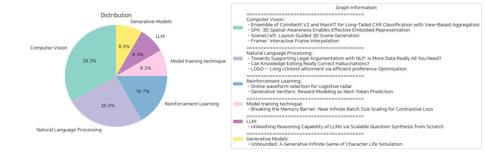

# Daily Artificial Intelligence Insights : Papers

## 🎈 Computer Vision

**요약:**

**종합 요약 보고서**

본 보고서는 제공된 4개의 논문 제목과 개요를 바탕으로 주요 주제, 트렌드, 그리고 이들 논문들이 다양한 분야에 미친 영향을 종합적으로 분석합니다.

**1. 주요 주제 및 테마 추출**

- **CXR 분류 및 비정상 데이터 분포 다루기**
  - 논문 'Ensemble of ConvNeXt V2 and MaxViT for Long-Tailed CXR Classification with View-Based Aggregation'는 긴 꼬리 분포를 가진 흉부 엑스레이(Chest X-Ray, CXR) 데이터를 효과적으로 분류하기 위한 최신 이미지 분류 기술을 다룹니다. 흉부 엑스레이 데이터에서 클래스 불균형을 처리하기 위해 비대칭 손실(asymmetric loss)과 뷰 기반 예측 상호작용을 활용하는 방안을 제안합니다.
  
- **3D 공간 인식 및 구현된 표현 학습**
  - 'SPA: 3D Spatial-Awareness Enables Effective Embodied Representation' 논문에서는 ViT(Vision Transformer)에 3D 공간적 이해를 부여하여 구현된 AI의 268개 작업을 평가, 기존 방법들보다 적은 데이터를 사용하여 더 나은 성능을 입증합니다.

- **텍스트 기반 3D 장면 생성**
  - 'SceneCraft: Layout-Guided 3D Scene Generation'에서는 사용자가 제공한 텍스트 설명 및 공간 레이아웃에 따라 복잡한 실내 장면을 생성하는 방법을 소개합니다. 이 방법은 3D 의미적 레이아웃을 다중 뷰 2D 프로시 맵으로 변환하여 NeRF(신경 방사 필드)로 학습합니다.

- **프레임 간 상호작용 보간**
  - 'Framer: Interactive Frame Interpolation'은 사용자의 창의성을 반영하여 두 이미지 간의 프레임을 부드럽게 전환시키는 방법을 제안합니다. 키포인트 기반 상호작용을 통해 보다 세밀한 움직임 제어를 가능하게 하며 자동 모드로 사용자 편의성을 제공합니다.

**2. 공통 키워드, 트렌드 및 패턴 식별**

- *딥러닝 및 AI*: 모든 논문은 딥러닝 및 인공 지능 기법을 활용하여 문제를 해결합니다.
- *3D 공간 및 시각적 이해*: 3D 공간적 인식 및 시각적 표현 생성은 중요한 트렌드로 나타납니다.
- *사용자 상호작용 및 커스터마이징*: 연구들은 사용자 상호작용을 통해 더 나은 결과를 제공하는 방법을 탐구합니다.

**3. 주요 사건 및 핵심 정보 요약**

- MICCAI 2024 CXR-LT 챌린지에서 4위와 5위를 차지한 CXR 분류 방법론
- 기존 방법보다 우수한 성능을 보이는 3D 공간 인식 기반 AI 학습
- 사용자 지정 가능 복잡한 실내 3D 장면 생성 기술
- 프레임 간 보간을 위한 인터랙티브 시스템 제안 및 다양한 응용에서 성공 사례

**4. 이러한 사건들이 다양한 분야에 미친 영향 분석**

- 의료 영상 분야에서 클래스 불균형 문제를 해결하여 더욱 정확한 판독 가능성 증가
- 3D 인식 강화로 로봇공학 및 증강현실 분야에서의 적용 기대
- 실내 디자인 및 게임 개발 등 3D 장면 생성에 대한 사용자 참여 증가
- 영상 및 미디어 편집 기술 발전에 기여하여 창의적인 콘텐츠 생성 가능성 확대

**5. 최종 통합 요약 및 미래 관찰 사항**

이 연구들은 딥러닝과 인공지능 기술을 바탕으로, 다양한 분야에서의 문제 해결 및 효율성 향상을 추구합니다. 앞으로는 더욱 다양한 응용 분야에서의 사용자 중심적 상호작용 기술과 3D 공간 인식의 발전이 주목받을 것으로 보입니다. 이러한 연구 결과들은 향후 의료, 로봇공학, 그리고 디지털 미디어에 걸친 다양한 분야에서의 혁신적인 발전을 위한 기초가 될 것으로 기대됩니다.

**출처:**

 - Ensemble of ConvNeXt V2 and MaxViT for Long-Tailed CXR Classification with View-Based Aggregation (https://deeplearn.org/arxiv/536961/ensemble-of-convnext-v2-and-maxvit-for-long-tailed-cxr-classification-with-view-based-aggregation)
 - SPA: 3D Spatial-Awareness Enables Effective Embodied Representation (https://deeplearn.org/arxiv/535708/spa:-3d-spatial-awareness-enables-effective-embodied-representation)
 - SceneCraft: Layout-Guided 3D Scene Generation (https://deeplearn.org/arxiv/535709/scenecraft:-layout-guided-3d-scene-generation)
 - Framer: Interactive Frame Interpolation (http://arxiv.org/abs/2410.18978v1)

## 💙 Natural Language Processing

**요약:**

**한국어 종합 요약 보고서**

1. **핵심 주제 및 테마 추출**:
   - 첫 번째 논문은 법적 추론 및 의사결정을 지원하는 법률 NLP(자연어 처리) 모델링을 중점적으로 다루고 있습니다. 법적 결론을 텍스트에서 통계적으로 분류하는 방식의 한계를 논의하며, 전문가의 지식을 통합하여 기계 학습과 전통적인 상징적 접근 방식 간의 균형을 찾는 것의 중요성을 강조합니다.
   - 두 번째 논문은 거대 언어 모델(LLMs)의 환각 문제를 해결하기 위한 지식 편집의 가능성을 탐구합니다. 이러한 문제를 해결하기 위한 효과적인 방법론의 개발 필요성과 한계를 분석하며, HalluEditBench라는 평가 벤치마크를 소개하여 평가의 효율성을 높이려고 합니다.
   - 세 번째 논문은 긴 문맥 처리 모델(LCMs)의 성능을 향상시키기 위한 LOGO(효율적인 선호 최적화를 통한 긴 문맥 정렬)라는 새로운 교육 전략을 제안합니다. 기존 방법들이 가졌던 효과성과 효율성의 문제를 해결하고, 모델의 문맥 창 크기를 확장하면서도 생성 성능을 향상시키는 방법을 탐구합니다.

2. **공통 키워드, 트렌드 및 패턴 식별**:
   - "NLP(자연어 처리)", "환각(hallucination)", "지식 편집(knowledge editing)", "모델 성능향상", "데이터 크기와 품질", "문맥 정렬" 등이 공통 키워드로 나타납니다.
   - 최근 AI 및 NLP 연구는 모델의 환각 현상을 줄이고, 더욱 효과적이고 효율적인 성능을 나타내도록 하는 방법론 개발에 집중하고 있습니다.

3. **각 논문의 주요 이벤트 및 중요한 정보 요약**:
   - 첫 번째 논문에서는 기존의 상징적 접근과 최근 데이터 기반 접근의 결합 가능성을 모색하며, 법적 AI 모델의 확장성과 설명 가능성의 개선을 목표로 하고 있습니다.
   - 두 번째 논문은 HalluEditBench라는 새로운 벤치마크를 소개하여 지식 편집 방법이 LLM의 환각 현상을 교정하는 데 어떤 효과가 있는지 평가할 방법론을 제시합니다.
   - 세 번째 논문에서는 LOGO라는 새로운 훈련 전략을 제안하여 문맥 처리 모델의 성능 향상을 도모하고, 데이터 크기 문제를 해결하기 위한 참조 없는 최적화 전략을 활용합니다.

4. **이벤트가 다양한 분야에 미친 영향 분석**:
   - 법률 AI 모델에서의 설명 가능성은 법조 분야에 신뢰도를 증대시킬 수 있으며, 이는 법적 판단의 투명성을 높이고 사용자에게 우수한 정보 제공으로 이어질 수 있습니다.
   - LLM의 환각 문제 교정은 다양한 AI 응용 분야에서 모델의 정보 정확성을 높여, 사용자 경험과 신뢰성을 향상시키는 데 기여할 것입니다.
   - 긴 문맥 처리 개선은 빅데이터 분석, 언어 모델링 등에서 보다 정확하고 효율적인 결과를 제공함으로써 다양한 산업에서의 데이터 활용성을 증대시킬 것입니다.

5. **최종 요약 및 결론**:
   - 현재 AI 및 NLP 분야는 모델의 환각 문제 해결과 설명 가능성을 개선하는 데 주목하고 있으며, 이것은 법률, 데이터 분석 및 기타 정보 처리에서의 활용성을 극대화시킬 수 있을 것입니다. 향후 지식 편집 및 문맥 정렬 전략의 발전은 다양한 혁신적 응용을 가능하게 할 중요 분야로 주목됩니다. 이에 따라 데이터 품질과 방법론의 개선을 통한 지속적인 연구가 요구됩니다.

**출처:**

 - Towards Supporting Legal Argumentation with NLP: Is More Data Really All You Need? (https://deeplearn.org/arxiv/537100/towards-supporting-legal-argumentation-with-nlp:-is-more-data-really-all-you-need?)
 - Can Knowledge Editing Really Correct Hallucinations? (http://arxiv.org/abs/2410.16251v1)
 - LOGO -- Long cOntext aliGnment via efficient preference Optimization (http://arxiv.org/abs/2410.18533v1)

## 👽 Reinforcement Learning

**요약:**

**종합 요약 보고서**

1. **주요 주제 및 테마 추출**
   - 첫 번째 논문은 **인지 레이더 시스템**의 실시간 파형 선택 기술에 중점을 두고 있으며, 특정 목표(예: 탄도 미사일 추적)를 위한 **적응 알고리즘**을 제안하고 있습니다. 
   - 두 번째 논문은 **생성 검증기**를 통한 **보상 모델링**에 대해 설명하며, 대규모 언어 모델(LLM)의 추론 성능을 향상시키기 위한 **다음 토큰 예측** 기법을 활용하고 있습니다.

2. **공통 키워드, 트렌드 및 패턴 식별**
   - 두 논문은 모두 **알고리즘의 적응 및 학습**을 중심으로 하고 있습니다. 
   - **인공 신경망의 활용**과 **성능 최적화**라는 공통된 관심사가 눈에 띕니다. 특히 실시간 데이터 피드백을 통한 자동화와 적응성이 강조되고 있습니다.

3. **주요 이벤트 및 중요 정보 요약**
   - 인지 레이더 논문은 **강화 학습 알고리즘**(대역폭 조정, Q-learning 등)을 사용하여 파형을 선택함으로써 목표 추적의 범위 오류를 최소화하고 타겟을 지속적으로 추적하는 데 성공했습니다.
   - 생성 검증기 논문은 **다음 토큰 예측**을 통해 LLM의 검증 성능을 극대화했으며, 베스트-오브-N 방법론의 성능을 16-40% 향상시켰습니다. 이는 수학적 문제와 알고리즘 추론 작업에서 상당한 개선을 불러일으켰습니다.

4. **이벤트가 각 분야에 미치는 영향 분석**
   - 인지 레이더의 발전은 **방위 산업** 및 **보안 분야**에 혁신적인 기술 발전을 제공할 수 있으며, 미사일 등의 고속 이동 물체를 보다 효율적으로 추적할 수 있게 만들 수 있습니다.
   - 생성 검증기의 개선은 **인공지능 및 데이터 과학 분야**에서의 발전을 의미하며, 특히 **자연어 처리 시스템**의 정확성과 응답성을 높이는 데 기여할 가능성이 큽니다.

5. **결론 및 향후 개발 가능성**
   - 인지 레이더 시스템은 지속적인 파형 선택 기법의 개선을 통해 **더 넓은 적용 범위**와 **더 높은 정확성**을 기대할 수 있습니다.
   - 생성 검증기는 AI 모델을 활용한 보다 정교한 **추론 및 검증 시스템** 구축에 기여할 것이며, 이는 AI 시스템의 **복잡한 문제 해결 능력**을 한층 향상시킬 것입니다.
   
결론적으로, 두 논문 모두 기술 발전 및 인공지능 응용의 미래에 중요한 이정표가 될 것으로 예상되며, 그에 따른 **실행 가능한 방향**과 **적용 가능성**을 지속적으로 모니터링할 필요가 있습니다.

**출처:**

 - Online waveform selection for cognitive radar (https://deeplearn.org/arxiv/536265/online-waveform-selection-for-cognitive-radar)
 - Generative Verifiers: Reward Modeling as Next-Token Prediction (https://deeplearn.org/arxiv/535710/generative-verifiers:-reward-modeling-as-next-token-prediction)

## 🎇 Model training technique

**요약:**

보고서 요약:

1. **주요 주제 및 테마 추출**:
   - 대조 손실(contrastive loss)
   - 배치 크기 확장(batch size scaling)
   - GPU 메모리 소비
   - 타일 기반 계산 전략(tile-based computation strategy)
   - 분산 시스템의 계층 구조(hierarchical structure of distributed systems)
   - CLIP-ViT-L/14 모델
   - 메모리 효율

2. **공통 키워드, 트렌드 및 패턴 식별**:
   - 대조 손실을 통한 표현 학습
   - 배치 크기 증가에 따른 성능 향상
   - GPU 메모리 소비 문제 및 해결책
   - 계층적 분산 시스템 활용
   - 메모리 효율성과 속도 비교

3. **중요 사건 및 핵심 정보 요약**:
   - 대조 손실은 더 많은 음성 샘플을 제공하여 유사한 데이터와 비유사 데이터를 구별하는 데 도움을 줌.
   - 하지만 GPU 메모리 소비가 이차적 성장의 한계가 되어, 대조 손실 계산의 효율성을 제한.
   - 제안된 타일 기반 계산 전략 및 멀티 레벨 타일링 전략은 이러한 메모리 문제를 극복.
   - 실험에서 CLIP-ViT-L/14 모델을 극히 큰 배치 사이즈로(4M 또는 12M) 훈련할 수 있음이 보여줌.

4. **이벤트가 다양한 부문에 미치는 영향 분석**:
   - 인공지능 훈련 효율성 향상: 대규모 모델 훈련이 메모리 효율적으로 가능해짐.
   - 분산 시스템 활용 증가: GPU 통신 최적화로 훈련 속도 및 효율성 증대.
   - 컴퓨팅 자원 최적화: 메모리 소비를 대폭 줄이면서도 성능을 유지하는 효율적 방법 소개.

5. **통합 요약 및 향후 개발 관찰**:
   - 본 연구는 대조 손실을 이용한 표현 학습에서 대규모 배치 사이즈의 장점을 극대화하면서 메모리 효율성을 크게 개선.
   - 이러한 방법은 대규모 인공지능 모델을 훈련하는 데 있어 새로운 가능성을 제시하며, 분산 시스템과 GPU 네트워크 활용에 있어 앞으로 더 많은 연구와 발전이 기대됨. 
   - 코드 공개로 인해 더 많은 연구자들과 산업계의 응용이 가능하며, 신속한 발전이 이어질 것으로 전망됨.

**출처:**

 - Breaking the Memory Barrier: Near Infinite Batch Size Scaling for Contrastive Loss (http://arxiv.org/abs/2410.17243v1)

## ☀️ LLM

**요약:**

1. 주제 추출:
   - 고품질 데이터의 중요성
   - LLM(대형 언어 모델)의 추론 능력 향상
   - 데이터 합성의 확장
   - ScaleQuest: 확장 가능한 새로운 데이터 합성 방법
   - 수학적 추론 데이터셋 구성

2. 공통 키워드 및 트렌드:
   - 고품질 데이터
   - 데이터 합성
   - 열린 소스 및 상업 소스 모델에 대한 성능 향상
   - 효율적인 문제-해결 데이터셋

3. 주요 사건 및 정보 요약:
   - 고품질 데이터의 영향을 통해 LLM의 추론 능력을 향상시키는 연구의 중요성이 강조됨.
   - 기존 방법은 시드 데이터나 지식 베이스를 활용하면서 효과를 나타냈으나, 개방형 소스 커뮤니티에는 여전히 대규모 고품질 데이터가 부족.
   - 대형 모델을 사용한 데이터 합성에서 데이터 크기의 증가가 성능에 기여할 수 있다고 확인됨.
   - ScaleQuest는 시드 데이터 없이 소규모 모델(예: 7B)을 사용하여 데이터 합성을 가능하게 하여 비용 효율성을 강화.
   - ScaleQuest를 통해 구성된 수학적 추론 데이터셋이 기존의 데이터셋보다 더 큰 효과를 발휘함.

4. 다양한 분야에 미치는 영향 분석:
   - 열린 소스 모델의 성능 향상으로 인해 연구 개발 비용 절감 가능.
   - ScaleQuest와 같은 방법론은 대규모 데이터 생성의 문턱을 낮추어 다양한 연구 분야의 진보를 촉진할 수 있음.
   - 이는 LLM의 상호운용성과 응답 정확도를 향상시켜 교육, 자동화, 연구 등 다양한 분야의 효율성을 높일 전망.

5. 최종 요약 및 결론:
   - 고품질 데이터의 중요성은 LLM의 발전에 있어 필수불가결하며, 이를 위한 효율적인 데이터 합성 방법이 계속 필요함.
   - ScaleQuest는 기존 데이터셋을 능가하는 성능을 보여주며, 열린 소스 및 상업용 모델의 발전에 기여 가능.
   - 향후 데이터 합성 방법론의 확장 및 적용 가능성은 다양한 산업과 연구 분야에 걸쳐 중요하게 다뤄질 전망. 
   - 또한, 데이터의 품질과 효율성을 동시에 확보할 수 있는 방법론 개발이 지속적으로 필요할 것이다.

**출처:**

 - Unleashing Reasoning Capability of LLMs via Scalable Question Synthesis from Scratch (http://arxiv.org/abs/2410.18693v1)

## 🚀 Generative Models

**요약:**

제목: '무한의 가능성: 캐릭터 생활 시뮬레이션을 위한 생성형 무한 게임'
요약: 이 논문은 생성형 무한 게임이라는 개념을 소개합니다. 이는 전통적인 유한, 하드코딩된 시스템의 경계를 넘어 생성형 모델을 활용하는 비디오 게임입니다. James P. Carse의 유한 및 무한 게임의 구분에서 영감을 받아, 생성형 AI의 최근 발전을 이용하여 캐릭터 생활 시뮬레이션 게임 'Unbounded'를 개발하였습니다. 이 게임은 모래상자 스타일의 생활 시뮬레이션에서 번득임을 얻어, 가상 세계에서 자율적인 가상 캐릭터와의 상호작용을 가능하게 합니다. 이를 위해 LLM에 의해 생성되는 개방형 기계적 요소와 일부 나타날 수 있는 예기치 않은 결과 등을 특징으로 합니다. Unbounded의 개발을 위해 LLM과 시각적 생성 영역에서 기술적 혁신을 제안하며, (1) 게임의 기계학습, 서사, 캐릭터 상호작용 등을 실시간으로 동적으로 생성하는 특수한 대형 언어 모델(LLM)과 (2) 다양한 환경에서 캐릭터의 일관되면서 유연한 시각적 생성을 보장하는 새로운 동적 지역 이미지 프롬프트 어댑터(IP-Adapter)를 소개합니다. 저자들은 정성적 및 정량적 분석을 통해, 전통적인 유사 접근법에 비해 캐릭터 생활 시뮬레이션, 사용자 명령 이행, 서사의 일관성, 캐릭터 및 환경의 시각적 일관성에서 상당한 개선을 보여주었습니다.

공통 키워드 및 트렌드: 생성형 모델, 무한 게임, 생활 시뮬레이션, 자율적 캐릭터, 대형 언어 모델, 시각적 생성, 게임 서사, 사용자 상호작용.

주요 사건 및 영향: Unbounded는 생성형 AI를 활용하여 전통적인 게임 시스템의 한계를 초월한 새로운 형식의 게임을 제시합니다. 캐릭터 생활의 디테일과 사용자 상호작용의 질을 개선함으로써 비디오 게임 산업에 혁신적인 변화를 가져올 가능성이 있습니다. 특히, 게임 내 몰입감 증가 및 기술적 진보가 산업 표준을 변화시킬 수 있습니다.

결론 및 미래 발전: 생성형 무한 게임의 등장은 게임 개발 방식의 새로운 패러다임을 열었습니다. Unbounded의 기술은 게임 산업뿐만 아니라 다른 창의적 산업에서도 응용 가능성이 크므로, 추후 발전 과정을 주목할 필요가 있습니다. 향후 발전 및 연구 방향으로는 더욱 정교한 AI 기술의 통합과 사용자 경험을 중시하는 인터페이스 개발이 있을 것입니다.

**출처:**

 - Unbounded: A Generative Infinite Game of Character Life Simulation (http://arxiv.org/abs/2410.18975v1)

