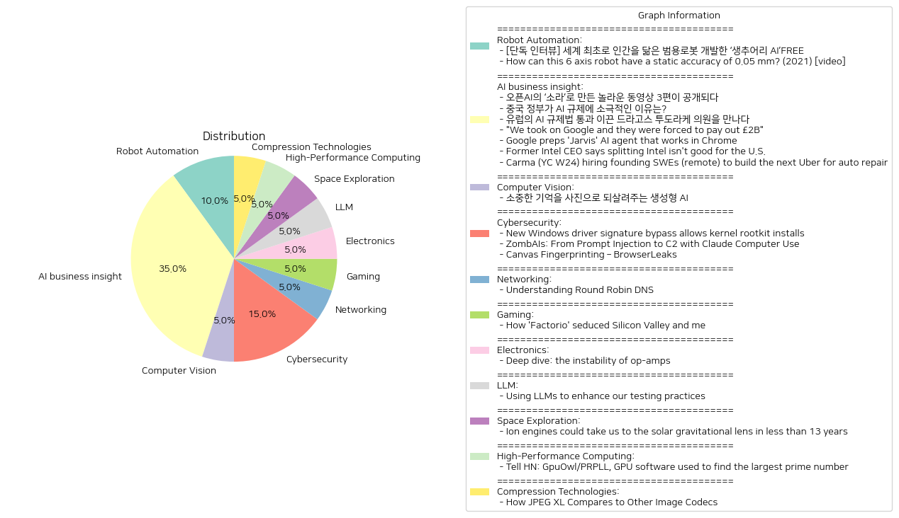

# Daily Artificial Intelligence Insights : News

## 🚀 Robot Automation

**요약:**

1. **주요 테마**:
   - 두 뉴스 기사 모두 로봇 기술과 관련된 주요 주제를 다루고 있습니다. 특히 범용 로봇, 정확성, AI와의 융합이 중요한 주제로 나타납니다.
   - 기술 발전을 통해 일상생활에서의 복합적인 문제를 해결할 수 있는 방법을 모색하는 경향이 나타납니다.

2. **주요 사건**:
   - 첫 번째 기사는 캐나다의 로봇 전문기업 생추어리 AI(Sanctuary AI)가 인간을 닮은 범용 로봇을 세계 최초로 개발한 주제를 다루고 있습니다. 이 로봇의 유연한 대응 능력이 특히 강조됩니다.
   - 두 번째 기사는 6축 로봇이 0.05 mm의 정적 정확도를 어떻게 유지하는지를 탐구하는 내용입니다.

3. **영향 분석**:
   - 경제적 측면에서, 이러한 로봇 기술의 발전은 자동화 및 인공지능(AI)의 진전을 통해 산업 전반에 효율성을 증대시킬 것으로 보입니다.
   - 사회적으로는 인간과 유사한 로봇 기술의 확산이 노동 시장과 인간의 역할에 대한 재정립을 요구할 수 있습니다. 특히 반복적이고 단순한 작업에 있어 로봇 대체가 가속화될 가능성이 있습니다.
   - 정치적, 법적 측면에서는 새로운 규제와 윤리적 문제 제기, 로봇 간의 상호작용 방안을 모색하는 논의가 활발해질 수 있습니다.

4. **최종 요약**:
   - 최근 로봇 기술의 발전은 AI와의 결합을 통해 더욱 복잡하고 변화무쌍한 환경에서도 유연하게 대응할 수 있는 능력을 보여주고 있습니다. 이는 다양한 산업에 긍정적인 영향을 미칠 것이며, 효율성을 크게 향상시킬 potential이 있습니다.
   - 그러나 이 동시에 사회적, 윤리적 과제를 해결해야 하는 상황이 발생할 수 있고, 이는 미래 기술 발전의 중요한 중점이 될 것입니다. 앞으로 계속해서 AI와 로봇의 융합에 따른 변화와 이를 둘러싼 논의, 규제 및 기술 발전 방향을 주목할 필요가 있습니다.

**출처:**

 - [단독 인터뷰] 세계 최초로 인간을 닮은 범용로봇 개발한 ‘생추어리 AI’FREE (https://www.technologyreview.kr/%ec%9d%b8%ed%84%b0%eb%b7%b0-%ec%83%9d%ec%b6%94%ec%96%b4%eb%a6%ac-ai%ea%b0%80-%ea%b7%b8%eb%a6%ac%eb%8a%94-%eb%af%b8%eb%9e%98%ec%9d%98-%eb%a1%9c%eb%b4%87%ec%9d%80-%ec%8b%a4%ec%b2%b4%ed%99%94/)
 - How can this 6 axis robot have a static accuracy of 0.05 mm? (2021) [video] (https://www.youtube.com/watch?v=SioCwvR_PYY)

## 🍋 AI business insight

**요약:**

1. **주요 테마**:
   여러 기사에서 반복적으로 등장하는 주요 테마는 AI 기술 발전 및 규제, IT 회사들의 산업 지배력 및 법적 분쟁, 그리고 새로운 기술 혁신을 위한 창의적인 시도입니다. AI 기술의 발전과 관련하여 오픈AI의 새로운 동영상 생성 모델 출시와 유럽 및 중국의 AI 규제 움직임이 주목받고 있으며, Google과 같은 대기업의 시장 지배력에 대한 법적 대응 사례도 중요한 이슈로 다루어지고 있습니다.

2. **주요 이벤트**:
   - OpenAI는 새로운 동영상 생성 모델 '소라'로 주목받고 있으며, 이를 활용한 3편의 동영상을 공개했습니다.
   - 중국 정부는 AI 규제에 대해 자국 산업 성장에 유리한 방향으로 느슨한 방침을 유지하고 있습니다.
   - 유럽의 드라고스 투도라케 의원은 AI 규제법 통과를 주도하여 AI 산업 개선을 목표로 하고 있습니다.
   - Google은 시장 지배력 남용으로 인해 약 2.4억 유로의 벌금을 부과받았으며, 'Jarvis'라는 새로운 AI 에이전트를 개발 중입니다.
   - Intel의 전 CEO는 Intel의 제조 분사화가 회사와 미국 경제에 부정적이라고 경고했습니다.
   - Carma는 상업 자동차 수리 분야에서 혁신을 목표로 새로운 엔지니어를 모집하고 있습니다.

3. **영향 분석**:
   - **경제적 영향**: AI 기술 발전과 관련된 규제 움직임은 산업 전반에 중대한 영향을 미칠 가능성이 있습니다. 특히, 중국과 유럽의 규제 접근법은 글로벌 경제에 대한 영향을 초래할 수 있으며, Intel의 제조 분사화 논의는 반도체 업계와 미국 경제에 중대한 영향을 미칠 수 있습니다.
   - **정치적 영향**: 유럽의 AI 규제법 통과는 전 세계적으로 AI 기술에 대한 정치적 논의를 촉발할 것입니다. 또한, Google과의 법적 분쟁은 대기업의 시장 지배력 남용에 대한 경각심을 불러일으킬 수 있습니다.
   - **사회적 영향**: OpenAI의 소라 모델은 창의적인 콘텐츠 제작자들에게 새로운 기회를 제공합니다. 또한, Carma의 혁신은 상업용 자동차 수리 분야에 긍정적인 변화를 가져올 수 있습니다.

4. **최종 요약**:
   이번 뉴스 기사들은 AI 기술 발전과 규제, 대기업 시장 지배력 및 혁신적인 사업 모델에 대한 주요 이슈를 다루고 있습니다. AI 규제는 산업에 큰 변화를 예고하며, 기술 발전과 규제 간의 균형을 찾는 것이 중요합니다. Google과의 법적 분쟁 사례는 시장 경쟁의 공정성 문제를 일깨우며, Intel의 경영 전략 변화와 Carma의 새롭고 혁신적인 시도는 각각 해당 산업에 중요한 영향을 줄 가능성이 큽니다. 향후 AI 기술 발전, 규제 정책 변화 및 IT 산업 전반의 움직임을 주시할 필요가 있습니다.

**출처:**

 - 오픈AI의 ‘소라’로 만든 놀라운 동영상 3편이 공개되다 (https://www.technologyreview.kr/%ec%98%81%ec%83%81-%ec%83%9d%ec%84%b1-%eb%aa%a8%eb%8d%b8-%ec%86%8c%eb%9d%bc%eb%a1%9c-%eb%a7%8c%eb%93%a0-%eb%86%80%eb%9d%bc%ec%9a%b4-%ec%98%81%ed%99%94-3%ed%8e%b8%ec%9d%b4-%ea%b3%b5%ea%b0%9c%eb%90%98/)
 - 중국 정부가 AI 규제에 소극적인 이유는? (https://www.technologyreview.kr/%ec%a4%91%ea%b5%ad-%ec%a0%95%eb%b6%80%ea%b0%80-%ed%98%84%ec%9e%ac%eb%a1%9c%ec%84%9c%eb%8a%94-ai-%eb%b6%84%ec%95%bc%eb%a5%bc-%ea%b0%80%ed%98%b9%ed%95%98%ea%b2%8c-%ea%b7%9c%ec%a0%9c%ed%95%98%ec%a7%80/)
 - 유럽의 AI 규제법 통과 이끈 드라고스 투도라케 의원을 만나다 (https://www.technologyreview.kr/ai-%ea%b7%9c%ec%a0%9c%eb%b2%95-%ed%86%b5%ea%b3%bc-%ec%9d%b4%eb%81%88-%eb%93%9c%eb%9d%bc%ea%b3%a0%ec%8a%a4-%ed%88%ac%eb%8f%84%eb%9d%bc%ec%bc%80-%ec%9d%98%ec%9b%90%ec%9d%84-%eb%a7%8c%eb%82%98%eb%8b%a4/)
 - "We took on Google and they were forced to pay out £2B" (https://www.bbc.com/news/articles/cjr431lr72jo)
 - Google preps 'Jarvis' AI agent that works in Chrome (https://9to5google.com/2024/10/26/google-jarvis-agent-chrome/)
 - Former Intel CEO says splitting Intel isn't good for the U.S. (https://www.tomshardware.com/tech-industry/former-intel-ceo-says-splitting-intel-isnt-good-for-the-u-s)
 - Carma (YC W24) hiring founding SWEs (remote) to build the next Uber for auto repair (https://news.ycombinator.com/item?id=41957685)

## 🪐 Computer Vision

**요약:**

1. **주요 주제**:
   - 생성형 AI 기술의 발전과 활용
   - 개인과 가족의 추억 보존 및 재현

2. **주요 사건**:
   - '합성 기억' 프로젝트의 추진: 생성형 AI를 활용하여 과거의 소중한 기억을 사진으로 재현하는 프로젝트가 진행 중이다. 이는 카메라에 담기지 못한 가족의 기억과 추억을 되살릴 수 있도록 돕고 있다.

3. **영향 분석**:
   - **사회적 영향**: '합성 기억' 프로젝트는 개인과 가족들에게 과거의 중요한 순간을 다시 경험할 수 있는 기회를 제공함으로써 긍정적인 사회적 영향을 미친다. 이는 기억 상실 또는 기록 부재로 인한 문화적 단절을 줄이는 데도 기여할 수 있다.
   - **기술적 영향**: 생성형 AI 기술이 개인화된 애플리케이션으로 구체화되고 있음이 드러났다. 이는 AI 기술의 일상 생활 응용과 접근성을 높이는 데 기여할 것으로 보인다.

4. **최종 요약**:
   - 생성형 AI를 이용한 '합성 기억' 프로젝트는 과거의 소중한 순간들을 시각적으로 재현함으로써 개인과 가족에게 강력한 정서적 가치를 제공하고 있다. 이는 AI 기술의 실질적이고 감성적인 활용 예를 보여주며, 사진 자료의 부족으로 인해 발생하는 문화적 소외를 해소할 잠재력을 가지고 있다. 향후 이러한 기술들이 더욱 다양한 방식으로 일상 생활에 적용될 가능성이 있으며, 특히 가정과 개인의 생활 속에서 더욱 확장될 것으로 예상된다. AI 기술의 정서적 가치 제고와 감성적 응용이 중요한 시사점으로 떠오른다.

**출처:**

 - 소중한 기억을 사진으로 되살려주는 생성형 AI (https://www.technologyreview.kr/%ec%83%9d%ec%84%b1%ed%98%95-ai%eb%a1%9c-%ea%b0%80%ec%9e%a5-%ec%86%8c%ec%a4%91%ed%95%9c-%ea%b8%b0%ec%96%b5%ec%9d%84-%ec%82%ac%ec%a7%84%ec%9c%bc%eb%a1%9c-%eb%a7%8c%eb%93%a0%eb%8b%a4/)

## 🎇 Cybersecurity

**요약:**

1. **주요 주제**:
   모든 뉴스 기사에서 보이는 주요 주제는 사이버 보안 취약점과 악성 소프트웨어 공격입니다. 봉쇄를 우회하는 공격 기법과 브라우저 핑거프린팅 등을 중심으로 IT 보안의 취약성을 다루고 있습니다.

2. **주요 사건**:
   - 첫 번째 기사는 신형 Windows 드라이버 서명 우회 방법을 통해 커널 루트킷 설치가 가능한 취약점을 다루고 있습니다. 공격자는 Windows 업데이트 프로세스를 악용하여 유효한 시스템에서도 오래된 소프트웨어 컴포넌트를 주입할 수 있습니다.
   - 두 번째 기사에서는 Anthropic의 Claude 컴퓨터 사용을 이용한 프롬프트 인젝션 공격을 설명하며, 악성 웹 페이지를 통해 C2(Command and Control) 인프라에 연결하는 방법을 시연하였습니다.
   - 세 번째 기사는 Canvas API를 활용한 브라우저 핑거프린팅 기법을 설명하면서, 이미지 렌더링의 차이를 이용해 독특한 핑거프린트를 생성하는 방법을 다루고 있습니다.

3. **영향 분석**:
   - **경제**: 이러한 사이버 보안 취약점은 기업의 IT 보안 투자 증가와 사이버 공격 예방을 위한 보안 소프트웨어 시장 성장에 영향을 미칠 수 있습니다.
   - **정치**: 국가 차원의 사이버 안보 강화 정책에 영향을 미쳐, 보다 강력한 규제와 보안을 요구할 가능성이 있습니다.
   - **사회**: 개인 정보 보호와 보안에 대한 인식이 높아지면서, 사용자 행동에서 보안 중요성이 더욱 강조될 것 입니다.

4. **최종 요약**:
   이러한 뉴스 기사는 사이버 보안의 취약점이 어떻게 다양한 방식으로 악용될 수 있는지를 보여주고 있으며, 이는 IT 업계와 소비자에게 중요한 경각심을 일깨워 줍니다. 미래에는 이러한 취약점을 막기 위한 기술적 개선과 기업 및 정부 차원에서의 정책적 대응이 더욱 활발히 진행될 필요가 있습니다. 사용자와 기업 모두가 보안 강화의 필요성을 깊이 인식하고 대비책을 마련해야 할 시점입니다.

**출처:**

 - New Windows driver signature bypass allows kernel rootkit installs (https://www.bleepingcomputer.com/news/security/new-windows-driver-signature-bypass-allows-kernel-rootkit-installs/)
 - ZombAIs: From Prompt Injection to C2 with Claude Computer Use (https://embracethered.com/blog/posts/2024/claude-computer-use-c2-the-zombais-are-coming/)
 - Canvas Fingerprinting – BrowserLeaks (https://browserleaks.com/canvas)

## 🎉 Networking

**요약:**

**1. 주요 테마**:
   - 'Understanding Round Robin DNS' 기사에서는 Round Robin DNS 기술에 대한 테스트와 그 결과 관찰에 관한 주제가 중요한 테마로 등장합니다. 특히 OpenFreeMap을 사용한 실험을 통해 특정 브라우저와 콘텐츠 전송 네트워크(CDN)가 서버를 선택하는 방법에 대해 중점적으로 다루고 있습니다.
   
**2. 주요 사건**:
   - 사용자가 Round Robin DNS를 OpenFreeMap과 함께 테스트하면서 브라우저와 CDN의 서버 선택 행동을 관찰하였습니다. 크롬과 사파리 같은 브라우저는 가장 가까운 서버를 선택하였으나, Cloudflare는 무작위로 선택한 서버를 계속 고수하는 모습을 보였습니다. 심지어 서버가 오프라인 상태여도 그대로 선택을 유지하는 것으로 나타났습니다.
   
**3. 영향 분석**:
   - 기술 업계에서는 이러한 DNS 서버 선택 방식이 사용자 경험과 서비스 신뢰성에 영향을 미칠 수 있습니다. 사용자가 기대하는 연결 안정성이나 데이터 전송 속도가 실제로는 사용된 브라우저나 CDN에 따라 다를 수 있기 때문에, 인터넷 서비스 제공자(ISP) 및 콘텐츠 제공자는 이러한 정보에 기반한 전략을 수립해야 할 필요성이 커집니다.
   - 특히 CDN의 무작위 선택 방식은 네트워크 부하 분산에 기여할 수 있지만, 서버 장애 시 신속한 전환이 이루어지지 않는 다는 점이 사용자 불편으로 작용할 수 있습니다.

**4. 최종 요약**:
   - 이번 사례를 통해 Round Robin DNS의 다양한 사용 방식과 그에 따라 달라질 수 있는 사용자 경험을 이해할 수 있습니다. 브라우저와 CDN 간의 차이가 사용자의 연결 경로와 서비스의 안정성에 미치는 영향을 고려한 추가 연구가 필요할 수 있으며, 이러한 연구는 보다 신뢰성 높은 네트워크 시스템을 구축하려는 시도에 기여할 것입니다. 앞으로의 개발 방향으로는 서버 장애 시의 대응 전략 및 브라우저와 CDN 간의 호환성 개선이 주요 관점이 될 수 있습니다.

**출처:**

 - Understanding Round Robin DNS (https://blog.hyperknot.com/p/understanding-round-robin-dns)

## 🌅 Gaming

**요약:**

입력에서 제공된 정보는 'Factorio'와 관련된 주제이고, 'FT 디지털 접근'과 관련된 비용 및 구독 정보가 혼재되어 있습니다. 이 정보를 바탕으로 요약 보고서를 작성하겠습니다.

1. **주요 테마**:
   - 게임 'Factorio'의 인기가 실리콘 밸리 등 특정 산업계에 미치는 영향.
   - 디지털 콘텐츠에 대한 섭스크립션 모델 및 구독 요금제의 경제적 측면.

2. **주요 사건**:
   - 'Factorio'는 단순한 게임 이상으로 실리콘 밸리 내에서 혁신적인 사고, 생산성 향상 전략 등에 영감을 줄 수 있는 도구로 인식되고 있음.
   - 'FT 디지털 접근'의 구독 모델은 장기 구독과 할인 혜택을 통해 더욱 경제적이고 유연한 디지털 미디어 소비를 가능하게 함.

3. **영향 분석**:
   - 경제: 'Factorio'의 인기는 생산성 향상 도구로서 신기술 도입과 관련된 논의를 촉진할 수 있으며, 구독 모델은 미디어 및 콘텐츠 산업에서 지속가능한 수익 창출 전략이 될 수 있음.
   - 사회: 복잡한 개념을 게임을 통해 접근하는 방식이 실리콘 밸리에서 인재 양성 및 창의력 증진의 도구로 사용된다면 긍정적인 사회적 변화를 이끌어낼 수 있음.

4. **최종 요약**:
   - 'Factorio'가 가진 영향력은 단순히 게임의 차원을 넘어서며, 산업계 전반에 걸쳐 창의력과 혁신을 촉발할 수 있는 잠재력이 큼.
   - 디지털 콘텐츠 구독 경제는 소비자에게 접근성을 높이는 한편, 기업에게는 새로운 수익 모델을 제공함. 앞으로의 발전 방향에 따라 더 다양한 형태의 구독 서비스가 확산될 가능성이 있음.
   
   이러한 요소들은 장기적으로 콘텐츠 소비 방식과 기술 혁신이 결합되면서 새로운 경제 및 사회적 패러다임을 형성할 가능성을 제시하고 있습니다. 향후 이와 관련된 변화 및 발전을 주목할 필요가 있습니다.

**출처:**

 - How 'Factorio' seduced Silicon Valley and me (https://www.ft.com/content/b9e419c6-acf1-420b-8ae6-908feb52c94e)

## 🧸 Electronics

**요약:**

1. **주요 주제**:
   - 연산 증폭기의 불안정성과 피드백 루프의 문제
   - 내부 위상 변화와 정전 용량에 의한 신호 왜곡 현상
   - 연산 증폭기 회로에서 불필요한 진동이나 신호 반사 문제

2. **주요 사건**:
   - 연산 증폭기(Op-amps)이 피드백 루프에서 불안정하게 작용할 수 있으며, 이는 내부 위상 변화와 정전 용량 때문에 발생할 수 있음.
   - 이로 인해 회로는 벨 형태의 왜곡(ringing) 또는 지속적인 진동(oscillation)을 일으킬 가능성이 존재함.
   - 이러한 문제를 완화하기 위한 방법으로 정전 용량 또는 대역폭을 줄이거나 신호 이득을 높이는 것이 제안됨.

3. **영향 분석**:
   - 경제적 영향: 전자기기 및 관련 산업에 있어 불안정성 문제 해결을 통한 품질 개선과 비용 절감 효과가 있을 수 있음.
   - 기술적 발전: 회로 설계 및 전자 부품 제조 분야에서 불안정성 문제 해결을 위한 연구 및 개선이 촉진될 것으로 예상됨.
   - 교육과학 분야: 전자 공학 및 회로 설계 교육에서 이러한 이슈를 다루는 커리큘럼 보강의 필요성이 제기될 수 있음.

4. **최종 요약**:
   - 연산 증폭기의 불안정성 문제는 전자 및 회로 설계에서 중요한 고려 사항으로, 이를 해결하기 위한 다양한 접근법이 논의되고 있음.
   - 이러한 이슈는 기술적 발전 촉진에 중요한 역할을 할 수 있으며, 일관된 신호 처리 개선 및 산업 표준 수립에 기여할 수 있음.
   - 미래에는 보다 안정적인 회로 설계 기법이 개발 및 표준화될 가능성이 있으며, 이는 관련 산업 전반에 긍정적인 영향을 미칠 것으로 전망됨.

**출처:**

 - Deep dive: the instability of op-amps (https://lcamtuf.substack.com/p/deep-dive-the-instability-of-op-amps)

## 🩵 LLM

**요약:**

1. **Key Themes**:
   - 대규모 언어 모델(LLM)의 활용
   - 테스트 자동화 및 개발 속도 향상
   - 소프트웨어 개발 효율성 증대

2. **Major Events**:
   - Assembled사는 대규모 언어 모델(LLMs)을 활용하여 수분만에 견고한 테스트를 생성하고 있다. 이는 수백 시간의 노력을 절약하며, 개발 속도를 높이는 데 기여하고 있다.
   - 엔지니어들은 생성된 테스트를 코드베이스와의 일관성 및 품질을 보장하기 위해 개선 작업을 수행한다.

3. **Impact Analysis**:
   - **경제**: 소프트웨어 개발 과정에서의 테스트 자동화는 기업의 생산성을 높여 개발 비용을 절감시킨다. 이는 시장 경쟁력 강화와 직접적으로 연결될 수 있다.
   - **사회**: 개발 속도의 증가는 빠른 피드백과 제품 출시를 가능하게 하여 사용자와의 상호작용을 가속화하고 더 나은 사용자 경험을 제공할 수 있다.
   - **기술**: LLMs의 활용은 AI 기술의 실용적 활용 사례로 자리 잡으며, 다른 분야에서의 혁신을 촉진시킬 수 있는 잠재력을 가진다.

4. **Final Summary**:
   - 대규모 언어 모델(LLMs)은 소프트웨어 개발 분야의 테스트 생성 과정에서 효율성을 크게 향상시키고 있다. 이는 개발 속도를 높이며, 기업의 비용 효율성을 높이는 긍정적인 영향을 미치고 있다. 미래에는 이러한 AI 기술이 더 다양한 산업 분야로 확장되어 자동화와 효율성을 증대시킬 수 있을 것으로 예상된다. 개발자와 기업은 이러한 기술을 적극적으로 검토하고 채택할 가능성이 크다. LLMs의 발전은 앞으로 더 많은 혁신적 변화를 불러일으킬 것으로 보인다.

**출처:**

 - Using LLMs to enhance our testing practices (https://www.assembled.com/blog/how-we-saved-hundreds-of-engineering-hours-by-writing-tests-with-llms)

## 🥳 Space Exploration

**요약:**

**종합 요약 보고서**

1. **주요 주제**:
   - 뉴스 기사는 주로 첨단 기술 발전, 특히 이온 엔진 개발과 그 가능성에 대해 다루고 있습니다. 이와 관련된 연구 및 기술적 요구사항이 강조됩니다. 이러한 발전은 우주 탐사에 있어 획기적인 전환점이 될 수 있습니다.

2. **주요 사건**:
   - 이온 엔진을 이용하여 태양 중력 렌즈에 13년 만에 도달할 수 있는 계획이 제안되었습니다. 이는 킬로그램당 1킬로와트의 전력, 97%의 효율성과 34,000~76,000초의 특정 충격을 가지는 이온 드라이브가 필요함을 시사합니다. 그러나 현재 기술력은 이러한 요구를 충족시키기에는 미흡하며, 발전소 문제를 해결하면 추가 개발이 가능할 수 있습니다.

3. **영향 분석**:
   - **경제**: 이온 엔진 개발에는 막대한 연구 비용이 들 수 있으며, 이를 달성할 경우 우주 탐사 산업에 경제적 성과가 클 것으로 예상됩니다.
   - **정치**: 주요 강대국 사이의 기술 경쟁이 심화될 수 있으며, 우주 탐사 주도권 쟁탈전이 펼쳐질 가능성이 있습니다.
   - **사회**: 새로운 기술 발전 소식은 대중들의 과학적 관심을 증폭시킬 수 있으며, 교육 및 STEM 분야에 긍정적인 영향을 미칠 수 있습니다.
   - **환경**: 우주 탐사가 더욱 활성화될 경우 생태환경에 미치는 영향과 우주 쓰레기 문제가 부각될 수 있습니다.

4. **최종 요약**:
   - 이온 엔진 개발의 제안은 우주 탐사에 있어 중요한 혁신을 예고하고 있으며, 현재 기술의 한계를 뛰어넘기 위한 연구와 발전이 필요합니다. 이러한 기술 발전은 경제적, 정치적 그리고 사회적 측면에서 큰 변화를 가져올 것으로 예상됩니다. 다음 단계는 발전소 문제 해결 등 기술적 도전과제를 극복하고, 지속 가능한 발전을 위한 국제적 협력이 필요할 것입니다. 앞으로 이온 엔진의 발전 상황과 그에 따른 시장 및 정치적 변화에 주목해야 합니다.

**출처:**

 - Ion engines could take us to the solar gravitational lens in less than 13 years (https://phys.org/news/2024-10-ion-solar-gravitational-lens-years.html)

## 🎇 High-Performance Computing

**요약:**

**요약 보고서 (내용: 주제, 주요 사건, 영향 분석, 최종 요약)**

1. **주요 주제**:
   - 최근 52번째 메르센 소수를 발견한 GpuOwl/PRPLL 소프트웨어와 관련된 기술적 혁신
   - 소프트웨어 최적화 및 GPU 효율적 활용

2. **주요 사건**:
   - Mihai Preda가 개발한 GpuOwl/PRPLL 소프트웨어를 활용하여 Luke Durant가 가장 큰 소수를 발견함.
   - 발견된 소수는 2^136279841 - 1로, 이는 52번째 메르센 소수로 기록됨.

3. **영향 분석**:
   - **과학기술 분야**: 이번 발견은 소수 및 수학 연구에 큰 영향을 미칠 것이며, 소수 이론에 대한 심화된 연구를 촉진할 것으로 예상됨.
   - **소프트웨어 개발**: GPU를 활용한 고성능 컴퓨팅의 필요성과 중요성을 다시 한번 강조하며, OpenCL 기반의 소프트웨어 최적화에 대한 관심이 증가할 것으로 보임.
   - **사회적 관심**: 대중 및 연구자들의 소수 발견에 대한 관심을 높이며, 과학기술에 대한 긍정적 인식을 확산할 수 있음.

4. **최종 요약**:
   이번 사건은 GpuOwl/PRPLL과 같은 기술 발전이 소수 이론의 진보에 기여할 수 있음을 보여줍니다. 특히, 대규모 계산을 가능하게 하는 GPU의 역할이 다시 한번 강조되었으며, 이를 통해 더 많은 수학적 발견이 이루어질 가능성이 열렸습니다. 미래에는 이와 같은 계산 효율화를 통한 다양한 수학적, 과학적 문제 해결이 더욱 기대됩니다. 추가적으로, 이러한 발견은 과학기술 분야에서의 협력 및 지속적인 개발의 필요성을 일깨워 주는 중요한 자극제가 되었습니다. 향후 수학과 컴퓨터 과학 분야에서의 이런 기술 적용 및 발전을 지속적으로 지켜볼 필요가 있습니다.

**출처:**

 - Tell HN: GpuOwl/PRPLL, GPU software used to find the largest prime number (https://news.ycombinator.com/item?id=41953063)

## 🥳 Compression Technologies

**요약:**

1. **주요 테마**:
   - 이미지 코덱의 발전: JPEG XL과 같은 차세대 이미지 코덱의 표준화.
   - 기술 혁신: Google PIK와 Cloudinary FUIF의 기술적 요소를 결합하여 향상된 성능을 구현.
   - 미디어 및 데이터 압축 기술의 진화: 대용량 이미지 데이터를 보다 효율적으로 처리하기 위한 기술 개발.

2. **주요 이벤트**:
   - JPEG XL 표준화 진행: JPEG 위원회를 통해 JPEG XL 이미지 코덱의 표준화가 진행 중이며, 기존 Google PIK와 Cloudinary FUIF의 핵심 기술들이 통합된 새로운 이미지 형식의 개발.
   - 이미지 기술 컨퍼런스에서의 업데이트: ImageCon 2019에서 관련 정보 공유 이후 JPEG XL의 상태와 발전 사항에 대한 업데이트 발표.

3. **영향 분석**:
   - 경제: 이미지 압축과 처리 속도 향상은 미디어, 출판 및 전자 상거래 등 다양한 산업에서 비용 절감과 생산성 향상에 기여할 수 있음.
   - 기술: JPEG XL의 개발은 데이터 저장 및 전송 효율성을 개선하여 네트워크 인프라에 긍정적인 영향을 미칠 수 있음.
   - 사회: 이미지 및 비디오 콘텐츠의 품질 개선을 통해 사용자 경험이 향상되고, 디지털 미디어 소비 패턴에 변화가 일어날 가능성.

4. **최종 요약**:
   - JPEG XL은 기존 이미지 코덱의 한계를 극복하고 더 나은 품질과 성능을 제공하는 것을 목표로 하고 있다. 이 코덱은 Google과 Cloudinary의 최신 기술이 통합된 결과물로, 이러한 기술적 진보는 데이터 관리 및 전송 효율성에서 큰 변화를 가져올 것으로 예상된다. 이에 따라 미디어 산업을 비롯한 다양한 분야에서 향후 JPEG XL의 채택과 관련하여 더 많은 발전을 지켜볼 필요가 있다. 향후 기술 표준화 과정이 순조롭게 진행되면 전 세계적으로 새로운 이미지 코덱의 도입이 가속화될 가능성이 높다.

**출처:**

 - How JPEG XL Compares to Other Image Codecs (https://cloudinary.com/blog/how_jpeg_xl_compares_to_other_image_codecs)

