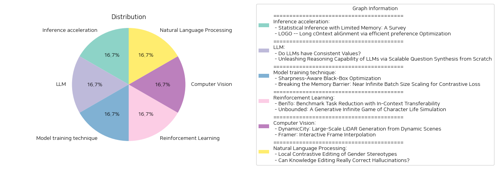

# Daily Artificial Intelligence Insights : Papers

## 💙 Inference acceleration

**요약:**

요약 보고서:

1. 주요 주제 및 테마 추출:
   - 첫 번째 논문은 "메모리 제한이 있는 통계적 추론"에 대해 다루고 있으며, 메모리 제약 조건에서의 통계적 추론의 최첨단 상태를 검토하고 있습니다. 핵심은 가설 검증, 매개변수 추정, 배포 속성 테스트/추정과 같은 여러 표준 문제에서 메모리 제한이 성능에 미치는 영향을 살펴보는 것입니다.
   - 두 번째 논문은 "긴 문맥 정렬을 위한 효율적 선호 최적화"라는 새로운 교육 전략 LOGO를 소개하고 있으며, 긴 문맥 모델이 문장의 길고 복잡한 데이터에 대한 처리 성능을 향상시키는 데 중점을 둡니다.

2. 공통 키워드, 경향, 패턴 식별:
   - 두 논문 모두 메모리 및 데이터 크기가 성능에 미치는 영향에 대해 다루고 있으며, 제한된 자원(즉, 메모리 또는 계산 능력)에서의 효율성 문제를 해결하는 방법을 탐구하고 있습니다.

3. 주요 사건 및 핵심 정보 요약:
   - 첫 번째 논문에서는 메모리 제약 조건에서의 통계적 추론 분야에서의 최근 발전 상황과 알고리즘 구조 및 하한 유도 방법에 대한 유용한 기술을 논의하고 있습니다.
   - 두 번째 논문에서는 긴 문맥 조정에서 생성 성능을 향상시키기 위한 새로운 교육 전략을 소개하며, LOGO라는 효율적인 선호 최적화 방법과 GPU 메모리 문제를 극복하기 위한 위치 합성 방법을 설명합니다.

4. 이러한 사건이 다양한 분야에 미친 영향 분석:
   - 메모리 및 계산 자원 제한 조건에서의 성능 향상은 데이터 인프라와 컴퓨팅 효율성을 중요시하는 다양한 공학 및 컴퓨터 과학 분야에 영향이 있을 것으로 예상됩니다. 또한, 긴 문맥 처리 모델의 성능 개선은 특히 자연어 처리 및 관련 인공지능 분야에 큰 영향을 미칠 것입니다.

5. 최종 통합 요약 및 미래 발전:
   - 두 논문은 각각 메모리 제한 및 긴 문맥 처리 문제를 다루며, 이를 통해 효율적인 데이터 및 자원 활용을 추구합니다. 이러한 발전은 AI, 컴퓨터 과학 및 공학 분야의 새로운 알고리즘과 모델 개선에 중요한 기초를 제공할 것이며, 향후에는 더 많은 데이터 처리 및 메모리 효율성 개선 기술이 등장할 것으로 보입니다.

**출처:**

 - Statistical Inference with Limited Memory: A Survey (https://deeplearn.org/arxiv/536823/statistical-inference-with-limited-memory:-a-survey)
 - LOGO -- Long cOntext aliGnment via efficient preference Optimization (http://arxiv.org/abs/2410.18533v1)

## 🐱 LLM

**요약:**

종합 보고서:

1. 주요 주제 및 테마 추출:
    - LLM의 일관된 가치 연구
    - 질문 합성을 통한 LLM의 추론 능력 향상

2. 공통 키워드, 트렌드 및 패턴 식별:
    - LLM의 대화 및 추론 능력
    - 데이터 품질과 규모의 중요성
    - 가치 구조와 데이터 합성 방법론

3. 각 논문의 주요 사건 및 핵심 정보 요약:
    - 'LLMs에서의 일관된 가치 여부': 이 논문에서는 LLM이 인간과 유사한 가치 구조를 나타내는지를 연구하였다. 특히, 'Value Anchoring'이라는 프롬프트 전략을 사용하여 LLM의 가치 구조가 인간 데이터와 얼마나 일관성이 있는지를 평가하였다. 이 분석을 통해, LLM이 어떻게 가치 구조를 구현하는지를 이해하는 데 기여하고 새롭게 일관성을 평가하는 방법론을 도입하였다.
    
    - '초기 질문 합성을 통한 LLM 추론 능력 발휘': 고품질 데이터의 확보가 LLM의 추론 능력 개선에 중요한 요소라고 밝히고 있다. ScaleQuest라는 새로운 데이터 합성 방법을 소개하며, 이로써 수학적 추론 데이터셋(문제-해답 쌍 100만 개)을 자동으로 구축하고, 이를 통해 주요 오픈 소스 모델의 성능을 대폭 향상시켰다. 특히, 특정 모델(Qwen2-Math-7B-Base)을 이 데이터셋으로 미세 조정하였을 때, 기존의 강력한 폐쇄 소스 데이터 기반 모델들을 초과하는 성과를 보였다.

4. 이러한 사건들이 다양한 분야에 미치는 영향 분석:
    - LLM에 대한 가치 이해는 AI의 윤리적 설계 및 신뢰성 향상에 기여할 수 있다.
    - 양질의 대규모 데이터 합성 방법론은 AI 모델의 추론 능력 개선 및 성능 향상에 중요한 촉매제가 될 수 있으며, 교육, 연구 및 기술 개발에 폭넓은 응용이 가능하다.

5. 최종 종합 요약 및 미래 개발의 잠재적 방향:
    - LLM의 가치 구조 연구는 AI의 윤리적 차원에서 중요한 발전을 의미하며, 향후 더욱 구체적인 가치 평가 및 구현 전략이 기대된다.
    - ScaleQuest 같은 데이터 합성 기술의 발전은 AI 모델 성능 최적화를 위한 새로운 기회를 제공하며, 다양한 도메인에서의 효율적인 모델 훈련에 기여할 수 있다.
    - 향후, 이러한 방법론이 더욱 다양한 분야에 적용되어 LLM 및 AI 기술의 전반적인 발전을 견인할 가능성이 크다.

**출처:**

 - Do LLMs have Consistent Values? (https://deeplearn.org/arxiv/537349/do-llms-have-consistent-values?)
 - Unleashing Reasoning Capability of LLMs via Scalable Question Synthesis from Scratch (http://arxiv.org/abs/2410.18693v1)

## 🩵 Model training technique

**요약:**

보고서 요약:

1. 주요 주제 및 테마 추출:
   - 첫 번째 논문 'Sharpness-Aware Black-Box Optimization'에서는 블랙 박스 최적화에 대한 새로운 접근법으로, 모델의 일반화 성능을 향상시키기 위해 샤프니스 인식(minimization strategy)을 채택한 새로운 알고리즘인 SABO를 제안합니다. 
   - 두 번째 논문 'Breaking the Memory Barrier: Near Infinite Batch Size Scaling for Contrastive Loss'는 대조 손실 학습에서 메모리 사용을 획기적으로 줄이면서 배치 크기를 확장할 수 있는 타일 기반 계산 전략을 소개합니다.

2. 공통 키워드, 트렌드 및 패턴 식별:
   - 두 논문 모두 머신러닝의 최적화 문제를 다루고 있으며, 각각의 방법론이 기존의 성능 제한 요소(일반화 성능 문제, GPU 메모리 한계 등)를 극복하는 방법을 제안하고 있습니다.
   - 최적화 및 학습 과정에서의 효율성 향상에 초점을 맞추고 있으며, 두 논문 모두 실험을 통해 제안된 방법의 우수성을 입증하고 있습니다.

3. 주요 사건 및 중요한 정보 요약:
   - 첫 번째 논문에서는 SABO 알고리즘이 일반화 성능을 높이기 위해 기대치를 중심으로 한 매개 변수화와 근사적인 확률적 기울기 업데이트를 사용한다는 점을 강조하고 있습니다. SACO의 수렴 속도와 일반화 경계가 이론적으로 증명되었습니다.
   - 두 번째 논문에서는 대조 학습에서 배치 크기를 크게 증가시키면서도 GPU 메모리 사용량을 크게 줄이는 새로운 타일 기반 및 다단계 타일링 전략을 개발했으며, 이를 통해 CLIP-ViT-L/14 모델과 같은 대형 모델의 학습이 가능함을 보여주었습니다.

4. 이벤트가 여러 부문에 미치는 영향 분석:
   - 첫 번째 논문의 SABO 알고리즘은 다양한 머신러닝 알고리즘의 일반화 성능 향상에 기여할 수 있을 것으로 예상됩니다.
   - 두 번째 논문의 방법론은 특히 대규모 데이터 셋을 다루는 분야에서 GPU 메모리 사용의 제약을 극복하고, 더 큰 모델의 학습을 용이하게 하며, 기존 학습 프로세스를 최적화할 수 있는 가능성을 제공합니다.

5. 결론 및 미래 발전:
   - 첫 번째 논문은 블랙 박스 최적화 문제 해결을 위한 새로운 방향을 제시하며, 향후 SABO 알고리즘의 다양한 적용 가능성을 추가 연구가 필요합니다.
   - 두 번째 논문은 메모리 효율적인 대조 손실 학습을 위한 새로운 기준을 제시했으며, 다단계 타일링 및 고성능 GPU 이용 전략의 범용적 확장 가능성에 대한 추가 연구의 필요성을 강조합니다. 

따라서, 이들 연구는 각각 머신러닝의 최적화와 처리 효율성을 향상시키는 데 중요한 기여를 하고 있으며, 이들의 발전 방향은 향후 더욱 주목받게 될 것으로 기대됩니다.

**출처:**

 - Sharpness-Aware Black-Box Optimization (https://deeplearn.org/arxiv/537722/sharpness-aware-black-box-optimization)
 - Breaking the Memory Barrier: Near Infinite Batch Size Scaling for Contrastive Loss (http://arxiv.org/abs/2410.17243v1)

## ☀️ Reinforcement Learning

**요약:**

### 종합 보고서

1. **핵심 주제 및 테마 추출**
   - 첫 번째 논문 'BenTo'는 대규모 언어 모델(LLMs)의 평가 효율성을 높이는 방법에 대해 다루고 있습니다. 주요 주제로는 작업 전이 가능성, 평가 품질, 효율적인 벤치마크 작업 축소 등이 포함됩니다.
   - 두 번째 논문 'Unbounded'는 제너레이티브 인피니트 게임이라는 새로운 개념과 이를 실현하기 위한 기술 혁신을 소개합니다. 주요 주제로는 제너레이티브 AI, 무한 게임, 캐릭터 라이프 시뮬레이션, 실시간 게임 메커닉 생성 등이 포함됩니다.

2. **공통 키워드, 트렌드 및 패턴 식별**
   - 두 논문은 모두 대규모 언어 모델(LLM)의 사용을 중심으로 하며, 이는 효율적인 분석이나 창의적 콘텐츠 생성을 위한 시스템 개발과 관련이 있습니다.
   - '효율성'과 '전이 가능성'은 첫 번째 논문에서 강조된 반면, '실시간 생성', '자율성', 그리고 '이머전트 메커닉'은 두 번째 논문의 중요한 키워드로 나타납니다.

3. **주요 이벤트 및 중요한 정보 요약**
   - 'BenTo'에서는 대규모 언어 모델의 평가 태스크를 5%로 줄이면서도 원래 벤치마크 대비 <4%의 평가 차이만 발생시키는 효율적인 방법을 제시합니다.
   - 'Unbounded'는 제너레이티브 모델을 활용하여 무한 게임의 가능성을 탐구하며, 게임 내 캐릭터와 환경을 동적으로 생성하고, 사용자 상호작용을 통해 캐릭터와 게임 환경의 서사적 일관성을 증진시킵니다.

4. **이러한 이벤트가 다양한 분야에 미치는 영향 분석**
   - 'BenTo'의 연구는 대규모 언어 모델의 효율성을 크게 향상시켜, 교육, 번역 및 데이터 분석 분야에서 비용 절감을 기대할 수 있습니다.
   - 'Unbounded'의 접근 방식은 게임 개발 산업에서 혁신을 가져올 수 있으며, 사용자가 더욱 몰입할 수 있는 대화형 미디어 콘텐츠의 가능성을 강화합니다.

5. **최종 종합 및 결론**
   - 두 논문은 LLM의 다양한 응용 가능성을 주제로 서로 다른 방향의 혁신을 제시합니다. 첫 번째 논문은 모델의 평가 효율성을 중점으로 하고, 두 번째 논문은 사용자 경험을 향상시키는 새로운 게임 메커닉의 가능성을 제시합니다.
   - 향후 주목할 발전으로는 더 많은 산업 분야에서의 대규모 언어 모델의 활용 가능성과, 게임 및 미디어 산업에서의 인공지능 기반 실시간 창작 콘텐츠 생성 기술의 성장이 있습니다.

**출처:**

 - BenTo: Benchmark Task Reduction with In-Context Transferability (https://deeplearn.org/arxiv/538614/bento:-benchmark-task-reduction-with-in-context-transferability)
 - Unbounded: A Generative Infinite Game of Character Life Simulation (http://arxiv.org/abs/2410.18975v1)

## 🪄 Computer Vision

**요약:**

### 종합 요약 보고서

1. **주요 주제 및 테마 추출**  
   - **DynamicCity:** 동적 환경에서의 대규모 LiDAR 장면 생성, 4D LiDAR 생성 프레임워크, HexPlane 표현, 확장 및 압축 전략, 효율적인 교육 및 복원 정확도, 다양한 4D 생성 응용 프로그램.  
   - **Framer:** 인터랙티브 프레임 보간, 사용자 창의성에 따른 매끄러운 프레임 전환, 인간 상호작용을 통한 세밀한 제어, 키포인트 기반 자동화 및 응용 프로그램.

2. **공통 키워드, 트렌드 및 패턴 확인**  
   - **혁신적인 모델 및 방법론:** 두 연구 모두 고유한 모델과 방법론을 통해 복잡한 작업을 해결하고 있으며, 이는 현재 트렌드인 데이터 효율성과 정확성 향상, 그리고 사용자 친화적인 설계와 상호작용 방식에 집중하고 있음을 나타냅니다.  
   - **자동화 및 확장성:** DynamicCity 및 Framer는 모두 자동화된 처리 및 확장 가능한 응용 프로그램을 제공하며, 이는 다양한 조건이나 사용 사례에서의 적응성을 높입니다.

3. **주요 이벤트 및 중요 정보 요약**  
   - **DynamicCity:** 동적 환경에서의 대규모 LiDAR 장면 생성을 가능하게 하며, 특히 HexPlane을 이용한 고품질 4D 재현을 통해 기존 방법들에 비해 월등히 높은 성능을 보유하고 있습니다.  
   - **Framer:** 사용자 정의 가능하며 매끄러운 프레임 전환을 위한 인터랙티브한 솔루션을 제공하며, 주요한 실험 결과들은 다양한 응용 분야에서 탁월한 성능을 증명합니다.

4. **이벤트가 다양한 분야에 미치는 영향 분석**  
   - **자동차 및 운송 산업:** DynamicCity의 4D LiDAR 생성 기술은 자율주행차 및 도시 계획 분야에서 동적 환경의 이해 및 재현에 기여할 수 있습니다.  
   - **미디어 및 엔터테인먼트 산업:** Framer의 프레임 보간 기술은 영화, 애니메이션, 그리고 다양한 영상 제작 분야에서 더 자연스러운 변환 및 다양한 효과 구현을 가능하게 할 수 있습니다.

5. **최종 요약 및 결론, 잠재적 향후 개발 방향**  
   DynamicCity와 Framer는 각각 자동차 운송 및 미디어 관련 분야에서 기술적 한계를 극복하고 새로운 기회를 제공하는 혁신적인 기술을 제안합니다. 특히, 두 기술 모두 자동화와 사용자 중심의 기능성을 강조하면서 성능을 극대화하는 데 초점을 맞추고 있습니다. 미래에는 이러한 기술들이 더 다양한 분야에 적용되고, 더욱 정교한 자동화 및 상호작용 기능을 갖추어 발전할 가능성이 큽니다. 이러한 트렌드를 주의 깊게 관찰하는 것이 중요하며, 새로운 기술적 진보가 가져올 변화를 준비해야 할 것입니다.

**출처:**

 - DynamicCity: Large-Scale LiDAR Generation from Dynamic Scenes (https://deeplearn.org/arxiv/540398/dynamiccity:-large-scale-lidar-generation-from-dynamic-scenes)
 - Framer: Interactive Frame Interpolation (http://arxiv.org/abs/2410.18978v1)

## 🩵 Natural Language Processing

**요약:**

**종합 요약 보고서**

**주제 및 내용 추출:**
각 논문에서 두드러지는 주요 주제와 테마는 다음과 같습니다.
1. 'Local Contrastive Editing of Gender Stereotypes' 논문에서는 언어 모델(LMs)에 내재된 성별 고정관념의 편향을 식별하고 수정하기 위한 방법을 소개합니다. 이 방법은 모델의 일부 가중치를 특정 참조 모델과 비교하여 식별 및 편집할 수 있는 지역 대비 편집(local contrastive editing)을 통해 가능하다고 강조합니다.
2. 'Can Knowledge Editing Really Correct Hallucinations?' 논문은 대형 언어 모델(LLMs)이 비사실적 정보를 생성하는 현상인 환각(hallucination)을 수정하는데 있어서 지식 편집 방법의 효과에 대한 평가와 한계를 논의합니다. 새로운 평가 기준인 HalluEditBench를 제안하여 다양한 지식 편집 방법의 실제 환각 수정 성능을 총체적으로 검증합니다.

**공통 키워드, 트렌드 및 패턴:**
두 논문 모두 언어 모델의 편향 및 오류를 식별하고 수정하려는 노력으로 공통됩니다. '가중치 수정'과 '지식 편집'이라는 방법론적 접근이 언어 모델의 성능을 개선하기 위한 도구로서 언급되며, 각각의 주제는 모델의 특정 부분의 수정 가능성 및 편향 교정을 목표로 합니다.

**중요한 사건과 정보 요약:**
- 'Local Contrastive Editing of Gender Stereotypes' 논문은 성별 고정관념이 어떻게 모델의 파라미터 공간에 나타나는지를 탐구하고, 이를 정확하게 수정할 수 있는 기술을 소개하여 모델 속성을 보다 효율적으로 제어할 수 있는 가능성을 제시합니다.
- 'Can Knowledge Editing Really Correct Hallucinations?' 논문은 HalluEditBench를 통해 다양한 지식 편집 기법의 효과성과 한계를 평가하며, 9개 도메인에서 6,000개 이상의 환각 사례를 포함하는 대규모 데이터 세트를 활용하여 실제 환각 수정의 성능을 다섯 가지 차원에서 검토합니다.

**이벤트의 영향 분석:**
1. 언어 모델에서 성별 편향을 수정하는 기술의 발전은 인공지능 기술에서의 윤리적 문제 해결에 기여할 수 있습니다.
2. 환각 오류를 수정하기 위한 지식 편집의 경우, 이를 효과적으로 적용함으로써 다양한 분야에서의 자동화된 언어 처리 성능을 향상시킬 수 있으며, 이는 특히 정보 정확성이 중요한 영역에서 큰 영향을 미칠 수 있습니다.

**최종 요약 및 미래 발전 가능성:**
이 두 논문은 언어 모델의 편향성과 오류 수정에 대한 새로운 접근 방법을 제공하며, 이러한 연구는 인공지능 기술의 신뢰성과 공정성을 높이는 데 기여할 것입니다. 특히, 성별 고정관념 및 환각 현상의 수정 방법론이 더욱 발전함에 따라 이는 모델의 정확성과 윤리적 사용 가능성을 동시에 개선할 수 있을 것으로 기대됩니다. 향후 이러한 기술들이 어떻게 발전하고 실제 응용 분야에서 어떤 변화를 가져올 것인지 주목할 필요가 있습니다.

**출처:**

 - Local Contrastive Editing of Gender Stereotypes (https://deeplearn.org/arxiv/540617/local-contrastive-editing-of-gender-stereotypes)
 - Can Knowledge Editing Really Correct Hallucinations? (http://arxiv.org/abs/2410.16251v1)

