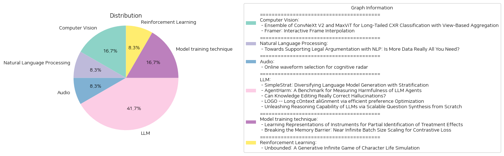

# Daily Artificial Intelligence Insights : Papers

## 🍋 Computer Vision

**요약:**

요약 보고서:

1. 주요 주제와 테마:
- 첫 번째 논문에서는 ConvNeXt V2와 MaxViT 모델을 활용하여 불균형한 데이터 분포 문제를 해결하는 것에 중점을 두고 있으며, 병원 컨퍼런스 MICCAI 2024의 CXR-LT 챌린지에서 좋은 성과를 거두었습니다. 이는 특히 장기후미 분포를 감안한 흉부 엑스레이 이미지 분류를 향상시키는 방법을 제안합니다.
- 두 번째 논문에서는 Framer라는 새로운 프레임 인터폴레이션 기법을 소개하고 있습니다. 사용자가 이미지 사이의 전환 프레임을 상호작용적으로 생성할 수 있도록 하며, 키포인트를 통한 사용자 입력을 기반으로 전환 과정을 맞춤화할 수 있는 기능을 제공합니다.

2. 키워드 및 트렌드: 
- 공통된 키워드는 '모델', '성능', '데이터 분포', '상호작용' 등을 포함합니다.
- 두 개의 연구 모두 최신 머신 러닝 및 딥러닝 기술을 반복적으로 활용하며, 성과 증가 및 사용자 경험 개선에 중점을 둡니다.

3. 논문의 주요 사건 및 핵심 정보:
- 첫 번째 논문에서는 다양한 최첨단 이미지 분류 기법, 비대칭 손실 함수, 그리고 뷰 기반 예측 합성을 통해 장기후미 분포를 효과적으로 처리하는 방법론을 소개합니다.
- 두 번째 논문은 사용자 상호작용을 통해 이미지 간 원활한 전환을 가능하게 하며, 키포인트를 활용한 정교한 지방 운동 제어를 제안합니다. '자동 조종' 모드는 사용의 용이성을 높이기 위해 키포인트를 자동으로 추정 및 개선하는 기능을 제공합니다.

4. 이 사건들의 다양한 섹터에 대한 영향 분석:
- 첫 번째 논문은 의료 영상 분석 분야에서 데이터의 불균형 문제를 해결할 수 있도록 도와줍니다. 이를 통해 더 나은 의료 진단 도구 개발에 기여할 수 있습니다.
- 두 번째 논문은 미디어 분야에서 이미지 및 영상 생성 및 변환 기술을 향상시켜 창의적인 콘텐츠 제작에 있어 더 많은 가능성을 제공합니다.

5. 결론 및 미래 개발 전망:
- 첫 번째 연구의 방법론은 향후 다양한 이미지 분류 문제에 바로 적용될 수 있으며, 특히 데이터의 클래스 불균형 문제가 존재하는 경우 효과적입니다.
- 두 번째 연구는 다양한 애플리케이션에서 적용 가능하며, 특히 사용자 맞춤형 콘텐츠 제작의 중요성이 증가하는 시대에 그 가치가 더욱 크게 평가될 것입니다. 
미래에는 이러한 기술들이 다양한 분야에서 통합되어 사용자 경험 및 효율성을 지속적으로 개선할 것입니다.

**출처:**

 - Ensemble of ConvNeXt V2 and MaxViT for Long-Tailed CXR Classification with View-Based Aggregation (https://deeplearn.org/arxiv/536961/ensemble-of-convnext-v2-and-maxvit-for-long-tailed-cxr-classification-with-view-based-aggregation)
 - Framer: Interactive Frame Interpolation (http://arxiv.org/abs/2410.18978v1)

## 🌞 Natural Language Processing

**요약:**

요약 보고서:

이 보고서는 법적 추론과 논증 지원을 위한 자연어 처리(NLP)의 발전에 대한 종합적인 분석을 제공합니다. 법적 AI와 법률에서 항상 중심적 역할을 해온 법적 추론을 모델링하는 문제는 최근 법률 NLP에서 텍스트로부터 법적 결론을 통계적으로 분류하는 것에 초점이 맞춰졌습니다. 이 접근 방식은 개념적으로 간단하나 적절한 법적 개념과의 연결을 제공하는 실용적인 정당성을 제시하는 데 부족한 경우가 많습니다.

전통적인 상징적 작업과 최근의 법적 NLP 발전을 검토하며, 전문가의 지식을 통합하여 상징적 접근과 데이터 주도적 접근 사이의 확장성과 설명 사이에 균형을 맞추는 가능성을 도출합니다. 개방형 도전 과제를 확인하고 현대 NLP 모델과 방법의 잠재력을 논의합니다.

여러 논문에서 공통적으로 나타나는 키워드는 '법적 추론', '자연어 처리', 'AI & Law', '법적 NLP', '데이터 주도적 접근' 등이며, 이러한 키워드들은 기술적 발전을 통해 법률 분야에서 AI 및 NLP의 향상된 적응력을 강조하고 있습니다.

이러한 발전은 법조계에서 법률 연구, 판례 분석, 법적 문서 자동화 등 다양한 영역에서 효율성을 증대시킬 수 있는 가능성을 제시합니다. 결론적으로, 법적 추론의 효과적인 지원을 위하여 데이터의 양이 아닌 의미 있는 정보 통합이 중요하며, 향후 법적 AI 발전의 핵심은 데이터 기반 접근법과 전문가 지식의 조화로운 통합에 있을 것입니다.

미래에는 이러한 NLP 모델이 더욱 개선되고 법적 업무에 통합될 수 있는 새로운 기회가 확대될 것으로 기대됩니다. 동시에, 모델의 설명 가능성과 적법성을 지속적으로 향상시키기 위한 연구가 필요할 것입니다.

**출처:**

 - Towards Supporting Legal Argumentation with NLP: Is More Data Really All You Need? (https://deeplearn.org/arxiv/537100/towards-supporting-legal-argumentation-with-nlp:-is-more-data-really-all-you-need?)

## ✈️ Audio

**요약:**

제목: '인지 레이더를 위한 온라인 파형 선택'

논문 요약:
인지 레이더 시스템을 설계하는 것은 특히 탄도 미사일의 전 비행 동안 추적할 수 있도록 파라미터를 적응시키는 데 있어 도전적인 과제입니다. 본 연구에서는 파형 파라미터를 온라인 방식으로 선택하는 적응적 알고리즘을 제안하는 것으로 중점을 두고 있습니다. 이 연구의 혁신성은 탄도 궤도의 특성에서 파생된 도메인 지식을 사용하여 학습 문제를 형성한 것에 있습니다. 우리는 세 가지 강화 학습 알고리즘인 대역폭 확장, Q-학습, 그리고 Q-학습 선조망을 제안합니다. 이 알고리즘들은 수신 피드백을 기반으로 각 전송을 위한 대역폭을 동적으로 선택합니다. 합성적으로 생성된 탄도 궤적에 대한 실험을 통해, 제안된 알고리즘이 사거리를 최소화하고 목표 대상을 놓치지 않고 지속적인 추적을 유지하는 이중 목표를 달성함을 입증하였습니다.

주요 주제 및 테마:
1. 인지 레이더 시스템 설계의 도전 과제
2. 탄도 미사일 추적을 위한 적응적 알고리즘 개발
3. 강화 학습 알고리즘 적용
4. 대역폭 선택과 피드백 기반 전송

트렌드 및 패턴:
1. 인공지능과 강화 학습 알고리즘이 방위 및 추적 시스템에 적용
2. 적응적 기술을 통한 실시간 데이터 처리 및 결정
3. 도메인 지식의 활용을 통한 학습 문제 개선

주요 사건 및 비판적 정보:
인지 레이더의 발전을 위한 실시간 파형 수정 필요성이 증가함에 따라 강화 학습 알고리즘이 실제 환경에서의 추적 성능을 향상시키기 위해 실험적으로 검증되었습니다. 각 전송의 대역폭을 동적으로 조정함으로써 목표 추적의 안정성과 정확도를 향상시킵니다.

이벤트 영향 분석:
무기 및 방위 산업은 더욱 강력한 레이더 추적 및 추적 시스템을 통해 보다 향상된 목표 탐지 및 제어 능력을 확보할 수 있습니다. 이는 국방 전략과 관련 기술 개발에 중대한 영향을 미칠 수 있습니다.

결론 및 잠재적 미래 개발:
강화 학습 기반의 인지 레이더 시스템은 실시간으로 적응 가능하며, 이는 특히 빠르게 이동하는 목표의 정확한 추적에 유리합니다. 향후 더 복잡한 시나리오와 다양한 환경에 적응할 수 있도록 알고리즘의 성능을 높이는 연구가 지속될 것으로 예상됩니다.

**출처:**

 - Online waveform selection for cognitive radar (https://deeplearn.org/arxiv/536265/online-waveform-selection-for-cognitive-radar)

## 🎉 LLM

**요약:**

**종합 보고서: 대형 언어 모델 연구 동향 및 미래 전망**

1. **핵심 주제 및 테마 추출**
   - 'SimpleStrat: 언어 모델 생성 다변화'
   - 'AgentHarm: LLM 에이전트의 위험성 측정 벤치마크'
   - '지식 편집을 통한 환각 수정 가능성'
   - 'LOGO: 긴 맥락 정렬 및 최적화'
   - 'Reasoning 능력 증진을 위한 질문 합성 기법'

2. **공통 키워드, 트렌드 및 패턴 식별**
   - 대형 언어 모델(LLMs)의 응용과 다변화
   - 에이전트 역할 수행 시의 안전성과 윤리적 문제
   - 데이터의 질과 양이 모델 성능에 미치는 영향
   - Scalability 및 성능 최적화를 위한 효율적 데이터 처리

3. **중요 사건 및 주요 정보 요약**
   - 'SimpleStrat'는 모델의 예측 다양성을 높이는 새로운 방법을 제안하며, 기존의 온도 증가 방식의 한계를 지적한다.
   - 'AgentHarm'은 LLM 에이전트의 악용 가능성을 측정하는 새로운 벤치마크로, 악의적인 작업에 대한 모델의 반응을 평가한다.
   - '지식 편집'은 대형 언어 모델의 환각 문제를 해결하기 위한 시도로, 기존의 방법론의 한계를 개선하고자 한다.
   - 'LOGO'는 긴 맥락에서의 문맥 정렬을 개선하기 위한 새로운 최적화 전략을 소개하며, GPU 메모리의 한계를 극복하는 방법을 제시한다.
   - 'ScaleQuest'는 스케일러블 질문 합성 기법을 통해 모델의 Reasoning 능력을 향상시키고, 대형 모델과의 성능 격차를 줄이는 데 기여한다.

4. **이벤트가 미치는 영향 분석**
   - 언어 생성 모델의 다양성 확장은 여러 응용 분야에서의 활용도를 높여줄 전망이다.
   - 에이전트의 안전성과 위험성은 특히 자동화 및 디지털화가 진행되는 현재 사회에서 매우 중요한 이슈로 대두된다.
   - 환각 문제의 해결은 모델의 신뢰성을 제고하고, 실제 응용에서의 효과성을 강화할 것이다.
   - 길어진 맥락 처리 능력은 복잡한 작업의 자동화를 가능하게 하며, 전반적인 업무 효율성을 증가시킬 수 있다.
   - 질 높은 데이터의 효율적인 생성은 시간 및 비용을 절감하며, 더 나은 학습 성능을 보장할 수 있다.

5. **최종 종합 요약 및 미래 개발 방향**
   - 대형 언어 모델 연구의 주류는 다양성과 성능 최적화를 중심으로 발전하고 있다. 이러한 방법론들은 모델의 실제 응용 가능성을 넓히며, 윤리적 문제 해결을 위한 대안적 접근 방식을 제시하고 있다.
   - 미래에는 다양한 분야에서 이러한 연구 성과를 통합하여 보다 안전하고 효율적인 인공지능 개발이 이루어질 것으로 기대된다. 특히, 데이터의 관리 및 활용에서 더 나은 방법론들이 계속하여 제안될 것으로 예상된다.

**출처:**

 - SimpleStrat: Diversifying Language Model Generation with Stratification (https://deeplearn.org/arxiv/535809/simplestrat:-diversifying-language-model-generation-with-stratification)
 - AgentHarm: A Benchmark for Measuring Harmfulness of LLM Agents (https://deeplearn.org/arxiv/535810/agentharm:-a-benchmark-for-measuring-harmfulness-of-llm-agents)
 - Can Knowledge Editing Really Correct Hallucinations? (http://arxiv.org/abs/2410.16251v1)
 - LOGO -- Long cOntext aliGnment via efficient preference Optimization (http://arxiv.org/abs/2410.18533v1)
 - Unleashing Reasoning Capability of LLMs via Scalable Question Synthesis from Scratch (http://arxiv.org/abs/2410.18693v1)

## 🌿 Model training technique

**요약:**

### 종합 요약 보고서

1. **핵심 주제 및 테마 추출**

   - **논문 1**: 'Learning Representations of Instruments for Partial Identification of Treatment Effects'
     - **핵심 주제**: 관찰 데이터로부터 치료 효과 추정, 원인적 추론에서 무교란성 가정 위반 문제, 고차원 도구 활용을 통한 조건부 평균 치료 효과(CATE) 경계 추정.
     - **기여점**: 
       1. 도구를 이산 표현 공간으로 매핑하여 CATE의 유효 경계를 제공.
       2. 잠재적 도구 공간을 분할하는 맞춤형 신경구조를 통한 두 단계 절차로 경계의 불안정성 문제 해결.
       3. 유효 경계를 제공하면서 추정 분산을 줄이는 절차 이론적으로 입증 및 다양한 상황에서의 효과성 실험으로 검증.

   - **논문 2**: 'Breaking the Memory Barrier: Near Infinite Batch Size Scaling for Contrastive Loss'
     - **핵심 주제**: 대조 손실을 통한 표현 학습, 배치 크기 확장, GPU 메모리 소비의 문제점 해결.
     - **기여점**:
       1. 대조 손실 계산을 작은 블록으로 분할하여 유사 행렬의 전체 구현을 피하는 타일 기반 계산 전략 제안.
       2. GPU 레벨에서 링 기반 통신과 CUDA 코어 레벨에서의 퓨전 커널 활용을 통해 동기화 최적화 및 I/O 오버헤드 감소.
       3. CLIP-ViT-L/14 모델의 대조 훈련을 높은 배치 크기로 수행 가능하게 하면서 메모리 사용량 두 배 감소.

2. **공통 키워드, 트렌드 및 패턴 식별**

   - 두 논문 모두 고차원 데이터 활용을 강조하며, AI 및 ML 도구의 효율성을 높이기 위해 새로운 접근 방식을 제안한다는 공통점을 가지고 있음.
   - 머신러닝 및 데이터 처리의 효율성 증대와 메모리 관리라는 트렌드를 중심으로 발전하고 있음.

3. **주요 사건 및 중요 정보 요약**

   - **첫 번째 논문**: 
     - 관찰 데이터에서 치료 효과를 신뢰성 있게 추정하기 위한 새로운 접근법.
     - 고차원 도구를 활용하여 조건부 평균 치료 효과의 경계를 제안.
     - 이론적 타당성과 다양한 실험적 설정에서의 효과성 검증.
   
   - **두 번째 논문**:
     - 대조 손실을 통한 학습에서 배치 크기의 한계를 극복하기 위한 새로운 전략.
     - 타일 기반 계산 방법을 사용하여 GPU 메모리 사용을 최적화.
     - CLIP-ViT-L/14 모델에서 메모리 사용량을 크게 줄이며 성능 유지.

4. **이 사건들이 다양한 부문에 미치는 영향 분석**

   - **의료 및 데이터 분석**: 첫 번째 논문의 접근법은 복잡한 관찰 데이터 환경에서 치료 효과 추정을 보다 신뢰성 있게 만들어 의료 분야의 결정 지원 시스템에 중요한 도구로 작용할 수 있음.
   - **컴퓨터 비전 및 대규모 데이터 처리**: 두 번째 논문은 대규모 데이터 처리를 효율적으로 수행함으로써, 컴퓨터 비전과 빅데이터 분석의 성능을 높이는 데 기여함.

5. **최종 종합 요약 및 결론, 미래 개발 경향**

   - 이 두 연구는 각기 다른 도메인에서의 머신러닝과 AI의 성능과 효율성을 크게 향상시킬 수 있는 혁신적인 방법들을 제안하고 있다. 관찰 데이터에서의 치료 효과 추정 및 대규모 배치 크기를 통한 대조적 학습에서의 메모리 최적화는 각각 의료 데이터 분석과 대규모 컴퓨터 비전 활용의 핵심 트렌드로 자리 잡을 것이다.
   - 미래에는 이러한 데이터 효율화 및 고차원 데이터 활용을 위한 보다 정교한 기법 개발이 지속될 것으로 예상되며, 이는 AI 애플리케이션의 적용 범위와 성능을 확대하는데 중요한 역할을 할 것이다.

**출처:**

 - Learning Representations of Instruments for Partial Identification of Treatment Effects (https://deeplearn.org/arxiv/535811/learning-representations-of-instruments-for-partial-identification-of-treatment-effects)
 - Breaking the Memory Barrier: Near Infinite Batch Size Scaling for Contrastive Loss (http://arxiv.org/abs/2410.17243v1)

## 🩵 Reinforcement Learning

**요약:**

보고서 요약:

논문 제목 'Unbounded: A Generative Infinite Game of Character Life Simulation'은 생성적 무한 게임이라는 새로운 비디오 게임 개념을 소개합니다. 이는 전통적인 유한하고 하드코딩된 시스템의 경계를 넘어 생성적 모델을 사용하는 게임으로 정의됩니다. 이러한 게임은 James P. Carse의 유한 게임과 무한 게임의 구분에서 영감을 받아 발전하였습니다. 최근 생성 AI의 발전을 토대로 개발된 'Unbounded'는 캐릭터의 삶을 시뮬레이션하는 게임으로, 전체가 생성적 모델에 의해 작동합니다. 이 게임은 샌드박스 생활 시뮬레이션에서 영감을 받아, 플레이어와 자율적인 가상 캐릭터가 가상 세계에서 상호작용하며 게임 내에서 먹이주기, 놀기, 안내 등의 열린 게임 메커니즘을 제공합니다. 이러한 메커니즘은 대형 언어 모델(LLM)에 의해 생성됩니다.

'Unbounded'의 개발에는 LLM과 시각적 생성 도메인에서의 기술적 혁신이 포함됩니다. 이 논문에서는 (1) 실시간으로 게임 메커니즘, 이야기, 캐릭터 상호작용을 동적으로 생성하는 전문화되고 정제된 대형 언어 모델과 (2) 다양한 환경에서 캐릭터의 일관적이지만 유연한 시각적 생성을 보장하는 새로운 동적 지역 이미지 프롬프트 어댑터(IP-Adapter)를 제안합니다.

논문에서는 시스템의 질적 및 양적 분석을 통해 전통적인 관련 접근법에 비해 캐릭터 생명 시뮬레이션, 사용자 지시 사항 준수, 이야기의 일관성, 그리고 캐릭터 및 환경의 시각적 일관성에서 상당한 개선이 있음을 보여줍니다.

향후 발전과 주목할 만한 부분으로는 생성적 모델의 지속적인 발전과 이를 활용한 무한 게임의 가능성, 그리고 이와 관련된 AI 및 시각적 기술의 발전이 언급될 수 있습니다. 이는 비디오 게임 산업뿐만 아니라 다양한 AI 응용 분야에서도 큰 영향을 미칠 것으로 예상됩니다.

**출처:**

 - Unbounded: A Generative Infinite Game of Character Life Simulation (http://arxiv.org/abs/2410.18975v1)

