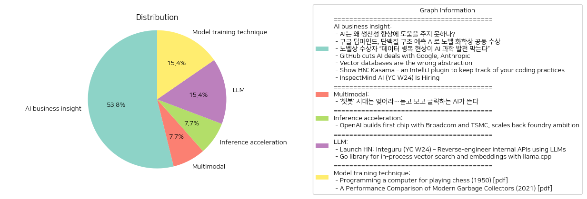

# Daily Artificial Intelligence Insights : News

## 🎠 AI business insight

**요약:**

1. **주요 테마**:
   이번 기사들에서 공통적으로 등장하는 주요 테마는 인공지능(AI)의 발전과 적용, AI 기술이 생산성에 미치는 영향, AI 분야의 데이터 중요성, 개발자 도구와 코딩 효율성을 높이기 위한 기술 혁신 등입니다. 또한, AI와 관련된 노벨상 수상 소식도 주요 테마로 다뤄지고 있습니다.

2. **주요 사건**:
   - "AI는 왜 생산성 향상에 도움을 주지 못하나?"에서는 AI가 경제 발전의 유력한 기술로 주목받고 있지만, 생산성 개선을 위한 구조적 변화가 필요함을 지적합니다.
   - 구글 딥마인드가 AI를 활용하여 단백질 구조 예측 문제를 해결한 공로로 노벨 화학상을 공동 수상했습니다. 이는 AI의 과학적 기여를 인정받은 중요한 사건입니다.
   - 노벨상 수상자가 AI 과학 발전에 고품질 데이터의 중요성을 강조하며 데이터 병목 현상이 문제임을 지적했습니다.
   - GitHub가 구글과 Anthropic의 AI 모델을 통합하여 코딩 어시스턴트 개선을 진행하고 있습니다.
   - 벡터 데이터베이스가 데이터를 불필요하게 복잡하게 만든다는 주제에서는 새로운 추상화 방안을 제시하여 데이터 관리의 효율성을 높입니다.
   - Kasama라는 IntelliJ 플러그인이 코딩 습관을 추적하여 코딩 효율성을 개선합니다.
   - InspectMind AI는 다중 모드 AI를 활용하여 건물 검사 자동화를 진행하고 있으며, 이를 위한 인력을 채용하고 있습니다.

3. **영향 분석**:
   - 경제: AI 기술의 발전은 향후 다양한 산업에서의 생산성 증대 및 혁신을 가져올 것으로 기대되지만, 데이터의 품질 및 관리가 여전히 과제로 남아 있습니다.
   - 과학 및 보건: 구글 딥마인드의 단백질 구조 예측 AI는 생명과학 연구의 새로운 가능성을 열었으며, 이는 제약 및 의학 연구에 큰 기여를 할 것으로 보입니다.
   - 사회: AI의 발전은 일자리 구조 변화 및 새로운 기술 요구로 이어질 것이며, 이를 위한 인력 개발이 필요합니다.

4. **종합 요약**:
   전반적으로 AI가 다양한 분야에서 혁신을 이끄는 주요 기술로 자리 잡고 있지만, 데이터 관리와 AI의 실질적 생산성 향상을 위한 개선이 지속적으로 요구되고 있습니다. 특히, 과학 연구에서의 AI 활용은 커다란 진전을 이루고 있으며, 관련 기술의 발전이 계속될 것으로 보입니다. 앞으로 데이터 병목 현상을 해결하고, AI 기술이 실제 경제적, 사회적 이익으로 이어질 수 있도록 체계적인 지원 및 연구가 필요할 것입니다.

**출처:**

 - AI는 왜 생산성 향상에 도움을 주지 못하나? (https://www.technologyreview.kr/ai%eb%8a%94-%ec%99%9c-%ec%83%9d%ec%82%b0%ec%84%b1-%ed%96%a5%ec%83%81%ec%97%90-%eb%8f%84%ec%9b%80%ec%9d%84-%ec%a3%bc%ec%a7%80-%eb%aa%bb%ed%95%98%eb%82%98/)
 - 구글 딥마인드, 단백질 구조 예측 AI로 노벨 화학상 공동 수상 (https://www.technologyreview.kr/%ea%b5%ac%ea%b8%80-%eb%94%a5%eb%a7%88%ec%9d%b8%eb%93%9c-%eb%8b%a8%eb%b0%b1%ec%a7%88-%ea%b5%ac%ec%a1%b0-%ec%98%88%ec%b8%a1-ai%eb%a1%9c-%eb%85%b8%eb%b2%a8-%ed%99%94%ed%95%99%ec%83%81-%ea%b3%b5%eb%8f%99/)
 - 노벨상 수상자 “데이터 병목 현상이 AI 과학 발전 막는다” (https://www.technologyreview.kr/%eb%85%b8%eb%b2%a8%ec%83%81-%ec%88%98%ec%83%81%ec%9e%90-%eb%8d%b0%ec%9d%b4%ed%84%b0-%eb%b3%91%eb%aa%a9-%ed%98%84%ec%83%81%ec%9d%b4-ai-%ea%b3%bc%ed%95%99-%eb%b0%9c%ec%a0%84-%eb%a7%89%eb%8a%94/)
 - GitHub cuts AI deals with Google, Anthropic (https://www.bloomberg.com/news/articles/2024-10-29/microsoft-s-github-unit-cuts-ai-deals-with-google-anthropic)
 - Vector databases are the wrong abstraction (https://www.timescale.com/blog/vector-databases-are-the-wrong-abstraction/)
 - Show HN: Kasama – an IntelliJ plugin to keep track of your coding practices (https://plugins.jetbrains.com/plugin/24683-kasama)
 - InspectMind AI (YC W24) Is Hiring (https://www.ycombinator.com/companies/inspectmind-ai/jobs/U0mh0Bf-software-engineer)

## ❄️ Multimodal

**요약:**

**1. 주요 테마:**

- **AI 기술의 진화:** 전통적인 텍스트 기반의 AI 챗봇 시대가 저물고 음성과 영상 생성 기능을 갖춘 AI가 새로운 주류로 떠오르고 있습니다. 이로 인해 AI 기술이 점점 더 인간의 다양한 감각과 상호작용할 수 있는 방향으로 발전하고 있습니다.

**2. 주요 이벤트:**

- **AI 혁신의 전개:** 기존의 챗봇에서 벗어나 음성과 영상 생성 기능을 갖춘 AI가 등장하여 다양한 산업 분야에서 활용되고 있습니다. 이러한 변화는 AI의 적용 범위와 방식에 근본적인 변화를 불러일으키고 있습니다.

**3. 영향 분석:**

- **경제적 영향:** AI 기술의 발전은 다양한 산업에서 자동화와 효율성을 높이며, 새로운 시장 기회를 창출하고 있습니다. 특히, 제조업 및 서비스업에서 인공지능을 통한 생산성 향상과 비용 절감 효과가 기대됩니다.
  
- **사회적 영향:** AI의 발전은 인식론적 변화와 함께 사회적 상호작용의 방식을 바꾸고 있습니다. 사람들이 AI와의 새로운 형태의 소통 방식을 경험하게 되면서, AI에 대한 사회적 수용과 신뢰가 시험대에 오르게 될 것입니다.

- **정치적 영향:** AI 기술은 개인정보 보호와 윤리적 고려사항을 둘러싼 새로운 규제와 정책의 필요성을 제기하고 있습니다. AI 정책과 규제는 각국의 기술 경쟁력과 산업 전략에 중요한 변수로 작용할 것입니다.

**4. 최종 요약:**

AI 기술은 현재 텍스트 기반의 한계를 넘어 음성과 영상 등 다차원적인 상호작용을 지원하는 방향으로 진화하고 있으며, 이는 경제, 사회, 정치 등 다양한 분야에 걸쳐 막대한 영향을 미치고 있습니다. 이러한 기술 발전은 산업의 패러다임을 변화시키고, 새로운 사회적 규범과 정책적 틀을 요구하고 있습니다. 앞으로 AI의 기술적 발전이 미칠 경제적 파급 효과와 윤리적, 사회적 도전을 지속적으로 모니터링하면서, AI가 인간과 어떻게 조화롭게 공존할 수 있을지에 대한 방안을 모색하는 것이 중요합니다.

**출처:**

 - ‘챗봇’ 시대는 잊어라…듣고 보고 클릭하는 AI가 뜬다 (https://www.technologyreview.kr/%ec%b1%97%eb%b4%87-%ec%8b%9c%eb%8c%80%eb%8a%94-%ec%9e%8a%ec%96%b4%eb%9d%bc-%eb%93%a3%ea%b3%a0-%eb%b3%b4%ea%b3%a0-%ed%81%b4%eb%a6%ad%ed%95%98%eb%8a%94-ai%ea%b0%80-%eb%9c%ac%eb%8b%a4/)

## 🚀 Inference acceleration

**요약:**

**최신 뉴스 요약 보고서**

1. **주요 테마**:
   - 반도체 개발: OpenAI의 칩 제작 발표와 함께 Broadcom과 TSMC의 협력은 반도체 산업에서의 주요 테마로 부각됩니다.
   - 전략 축소: OpenAI의 파운드리 야망 축소는 기술 회사들의 전략적 변화 및 조정이 계속되고 있음을 나타냅니다.
   - 기술 발전: 인공지능과 관련된 기술적 진보와 관련해 OpenAI의 움직임은 첨단 기술의 발전 방향을 나타냅니다.

2. **주요 사건**:
   - OpenAI가 Broadcom 및 TSMC와 협력하여 첫 칩을 제작하는 프로젝트를 발표하였습니다.
   - 이러한 협력은 OpenAI의 원래 기획했던 파운드리 사업 목표에서 일부 축소된 형태로 진행되고 있으며, 이는 특정 기술적, 전략적 이유가 있었을 것으로 추측됩니다.

3. **영향 분석**:
   - 경제적 영향: OpenAI의 새로운 조직 움직임은 반도체 산업과 인공지능 활용 분야에 큰 영향을 미칠 것으로 예상됩니다. TSMC와 Broadcom의 협력은 이들 기업의 생산력과 기술력에 긍정적인 영향을 줄 것입니다.
   - 정치적 영향: 반도체는 국제적 기술 경쟁의 핵심 요소로, 이러한 움직임은 미국의 기술적 독립성과 전략적 우위 확보에 기여할 것입니다.
   - 사회적 영향: AI 기술 발전은 산업 생산성과 관련된 많은 사회적 변화를 가져올 수 있으며, 이는 노동 시장 재편과 관련된 토론을 촉발할 수 있습니다.

4. **최종 요약**:
   OpenAI의 첫 칩 개발은 기술 산업에서 중요한 발전을 나타내며, Broadcom 및 TSMC와의 협력은 이러한 성장에 있어서 전략적 파트너십의 중요성을 강조합니다. 그러나 파운드리 야망의 일부분 축소는 프로젝트의 규모 조정 및 실질적 기술 구현에 초점을 맞추고 있음을 시사합니다. 앞으로 반도체 및 인공지능 기술의 사회적, 경제적 영향에 주의할 필요가 있으며, 이러한 변화가 이끌어낼 다양한 결과를 모니터링하는 것이 중요합니다. 또한, 기술 산업 내의 전략적 움직임들이 계속해서 어떤 방향으로 진화할 것인지에 대한 지속적인 관찰이 필요할 것입니다.

**출처:**

 - OpenAI builds first chip with Broadcom and TSMC, scales back foundry ambition (https://www.reuters.com/technology/artificial-intelligence/openai-builds-first-chip-with-broadcom-tsmc-scales-back-foundry-ambition-2024-10-29/)

## 🪐 LLM

**요약:**

1. **주요 주제**:
   두 기사에서 다루는 주요 주제는 기술 혁신, 특히 소프트웨어 개발 및 데이터 처리와 관련된 도구 개발입니다. 첫 번째 기사는 내부 API를 역설계하는 도구에 관한 것이며, 두 번째 기사는 임베딩 및 벡터 검색을 위한 Go 라이브러리에 관한 것입니다. 공통적으로, 이들 도구는 개발자에게 효율성을 제공하기 위해 설계된 솔루션을 제시하고 있습니다.

2. **주요 이벤트**:
   - 'Integuru': 이 도구는 브라우저의 네트워크 요청과 쿠키를 분석하여 실행 가능한 파이썬 코드를 생성합니다. 사용자는 그래프 생성 및 향후 코드 생성을 위한 변수를 입력할 수 있습니다.
   - 'Go library': 이 라이브러리는 임베딩 및 벡터 검색을 단순화하여 제공하며, 작은 규모 프로젝트에 적합합니다. BERT 모델을 지원하며 GPU 가속을 통해 성능을 강화하지만, 대형 데이터셋이나 복잡한 쿼리에서는 효율성 문제를 겪을 수 있습니다.

3. **영향 분석**:
   - 기술 분야에서는 개발자들의 작업의 편리성과 효율성을 증가시킴으로써 생산성을 높일 수 있습니다. Integuru는 코드 생성의 자동화를 통해 개발자들이 더 빠르게 작업을 수행할 수 있도록 지원하고, Go 라이브러리는 더 적은 리소스로 데이터 검색을 최적화할 수 있는 방법을 제공합니다.
   - 경제적으로 이러한 개발 도구는 소프트웨어 개발 산업의 생산성을 증가시킴으로써 간접적으로 긍정적인 영향을 미칠 수 있습니다.

4. **최종 요약**:
   최신 기술 도구의 개발과 혁신은 소프트웨어 개발과 데이터 처리를 보다 효율적으로 진행할 수 있게 합니다. Integuru와 같은 도구는 자동화된 코드 생성으로 개발 과정의 효율성을 향상시키며, Go 라이브러리는 적은 리소스로도 효과적인 데이터 검색 기능을 제공합니다. 이들 도구와 기술의 확산은 궁극적으로 기술 산업의 경쟁력을 강화할 것이며, 향후 이러한 기술들이 어떻게 발전하고 활용될지 주목할 만합니다. 지속적인 기술 혁신은 장기적으로 더욱 향상된 생산성과 경제적 이익을 가져올 가능성이 큽니다.

**출처:**

 - Launch HN: Integuru (YC W24) – Reverse-engineer internal APIs using LLMs (https://github.com/Integuru-AI/Integuru)
 - Go library for in-process vector search and embeddings with llama.cpp (https://github.com/kelindar/search)

## 🪐 Model training technique

**요약:**

1. **주요 주제**:
   - 두 기사의 주요 주제는 컴퓨터 과학과 기술 혁신입니다. 첫 번째 기사는 컴퓨터 프로그래밍을 통해 체스를 두는 문제를 다루고 있으며, 두 번째 기사는 현대의 가비지 컬렉터의 성능 비교를 다루고 있습니다. 

2. **주요 사건**:
   - 첫 번째 기사에서는 1950년대 컴퓨터가 체스를 두는 알고리즘의 개발과 관련된 연구가 소개되고 있습니다. 이 연구의 목적은 일반적인 컴퓨터가 체스를 잘 둔다고 할 수 있는 수준의 전략을 개발하는 것입니다.
   - 두 번째 기사에서는 2021년 현대 가비지 컬렉터의 성능 비교가 이루어졌습니다. 특히 G1 가비지 컬렉터가 자바 힙을 어떻게 나누는지를 설명하고, 새로운 참조가 저장될 때 발생하는 'write barrier'에 대해 설명하고 있습니다.

3. **영향 분석**:
   - 체스를 두기 위한 컴퓨터 프로그래밍 발전은 인공지능과 게임 이론 발전에 크게 기여했습니다. 이러한 발전은 나중에 다양한 분야에서 자동화 기술 발전에 기초가 되었습니다.
   - 가비지 컬렉터의 성능 개선은 소프트웨어 개발의 효율성을 증가시키며, 특히 자바와 같은 프로그래밍 언어의 애플리케이션에서 메모리 관리의 최적화를 통한 성능 향상을 가져왔습니다. 이는 IT 산업 전체의 생산성 향상에 기여할 것입니다.

4. **최종 요약**:
   - 두 기사는 각각의 시대에 컴퓨터 프로그래밍의 발전을 다루고 있으며, 이는 현대 기술의 발전에 중요한 역할을 해왔습니다. 체스 프로그래밍 연구는 AI 기술의 초기 발전을 상징하며, 현대 가비지 컬렉터의 성능 비교는 소프트웨어 최적화의 지속적인 중요성을 강조합니다. 앞으로도 AI와 메모리 관리 관련 기술은 더욱 발전할 것이며, 이는 여러 산업 분야에 걸쳐 큰 변화를 가져올 가능성이 큽니다. 이를 관찰하고 적응하는 것은 산업의 주요 과제가 될 것입니다.

**출처:**

 - Programming a computer for playing chess (1950) [pdf] (https://vision.unipv.it/IA1/ProgrammingaComputerforPlayingChess.pdf)
 - A Performance Comparison of Modern Garbage Collectors (2021) [pdf] (https://rodrigo-bruno.github.io/mentoring/77998-Carlos-Goncalves_dissertacao.pdf)

