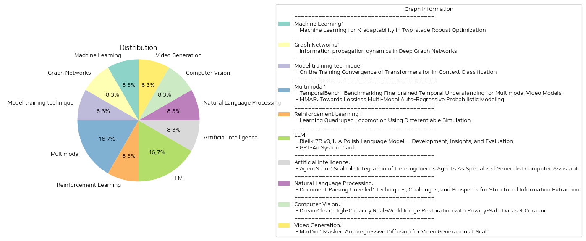

# Daily Artificial Intelligence Insights : Papers

## 🩵 Machine Learning

**요약:**

**요약 보고서:**

1. **핵심 주제 및 테마 추출:**
   - 논문: 'Two-stage Robust Optimization', 'K-adaptability', 'Machine Learning'
   - 주제: 강건 최적화, 시나리오 불확실성, 머신러닝을 활용한 최적화 전략

2. **공통 키워드, 동향 및 패턴 식별:**
   - K-적응성 (K-adaptability)은 불확실성을 가진 복잡한 이단계 강건 최적화 문제들을 해결하는 접근법이다.
   - 머신러닝을 활용하여 대규모 문제의 해를 가속화하며 성능 향상 가능성을 보여줌.
   - 학습 기반의 노드 선택 전략이 기존의 랜덤 선택 전략보다 더 나은 성과를 보임.

3. **주요 사건 및 중요 정보 요약:**
   - K-adaptability는 불확실성 세트를 K개의 하위 집합으로 최적 파티셔닝하여 각각의 결정들을 최적화한다.
   - 'Branch-and-bound' 알고리즘을 사용하지만, 해결하기 위해서는 기하급수적으로 증가하는 탐색 트리의 방법이 필요하다.
   - 본 연구는 머신러닝을 활용한 새로운 노드 선택 전략을 제안하여 성능을 개선함.

4. **이러한 사건이 다양한 부문에 미치는 영향 분석:**
   - 산업 내 복잡한 최적화 문제 해결에 기여할 수 있으며, 특히 불확실성이 큰 분야에서의 의사결정 효율성을 강화할 수 있음.
   - 머신러닝 기반 접근법은 전통적인 방법에 비해 문제 해결 시간을 단축하고 자원을 아낄 수 있는 잠재력을 가짐.

5. **종합 요약 및 잠재적 미래 발전:**
   - 머신러닝을 통한 최적화 전략은 다양한 규모와 유형의 문제에 광범위하게 적용 가능성을 시사한다.
   - 향후 연구는 다양한 K값과 문제 크기에 맞춰 학습된 노드 선택 전략의 일반화 가능성을 탐색할 필요가 있음.
   - 이러한 접근 방식은 더욱 복잡하고 다양한 형태의 최적화 문제에 적용될 수 있는 넓은 기회를 제공할 수 있음을 보여줌.

이 보고서는 K-적응성을 활용한 머신러닝 기반 접근법이 강건 최적화 문제에 기여할 수 있는 바를 살펴보았으며, 향후 연구 방향에 대한 중요성을 강조하였다.

**출처:**

 - Machine Learning for K-adaptability in Two-stage Robust Optimization (https://deeplearn.org/arxiv/537101/machine-learning-for-k-adaptability-in-two-stage-robust-optimization)

## 🎉 Graph Networks

**요약:**

요약 보고서:

1. 주요 주제 및 테마 추출:
    - 정보 전파 역학
    - 깊이 있는 그래프 네트워크(DGNs)
    - 그래프 및 관계 모델링
    - 정적 및 동적 그래프 학습
    - 그래프 표현 학습

2. 공통 키워드, 경향 및 패턴 식별:
    - 그래프 네트워크의 동적 시스템 설계
    - 정보 전파 패턴 학습의 중요성
    - 장기 종속성 보존 및 복잡한 시공간 패턴 학습
    - 희소한 샘플링을 통한 동적 그래프의 학습

3. 각 논문의 주요 이벤트 및 핵심 정보 요약:
   - 그래프는 몰리큘러 구조, 소셜 네트워크 및 교통 네트워크 등의 관계를 모델링하는 데 사용되는 표현이 풍부한 추상화로서 중요하다.
   - DGNs는 구조화된 정보를 효과적으로 처리하고 학습할 수 있는 심층 학습 모델로서 주목 받고 있다.
   - DGNs의 정보 전달 패턴 학습은 모델의 정적 및 동적 기능 모두에 큰 영향을 준다.
   - 제안된 아키텍처는 노드 간의 장기 종속성을 효과적으로 전파하고 보호하며 불규칙하고 희소하게 샘플링된 동적 그래프로부터 복잡한 시공간 패턴을 학습할 수 있음을 이론적, 경험적으로 증명했다.

4. 이러한 사건이 다양한 부문에 미치는 영향 분석:
   - 그래프 기반 학습 모델의 효과성과 다양성을 증진시키는 획기적인 연구로 평가된다.
   - 정적 및 동적 그래프의 정보 전파에 대한 이해를 심화하여, 다양한 분야에서 개선된 그래프 처리와 분석 가능성을 제시한다.
   - 새로운 그래프 표현 학습의 발전은 분자 모델링에서부터 교통 시스템 최적화에 이르기까지 다양한 응용 분야에 혁신적인 방법을 제공할 것이다.

5. 결론 및 미래 개발 전망:
   - 본 연구는 그래프, 심층 학습, 동적 시스템의 교차점을 포괄적으로 탐구하여 그래프 표현 학습 분야의 이해를 심화하고 있다.
   - 향후 연구에서는 더욱 효과적이고 다양한 그래프 기반 학습 모델을 위한 설계와 방법론 개발을 주시해야 할 필요가 있다.
   - 이러한 발전은 정보 과학, 생명과학, 사회과학 등 여러 분야에 있어 중요한 전환점을 마련할 가능성이 크다.

**출처:**

 - Information propagation dynamics in Deep Graph Networks (https://deeplearn.org/arxiv/537003/information-propagation-dynamics-in-deep-graph-networks)

## 💙 Model training technique

**요약:**

제목: 'On the Training Convergence of Transformers for In-Context Classification'

키 주제 및 테마:
- 트랜스포머의 인-컨텍스트 학습(ICL) 능력
- 트랜스포머의 학습 수렴 및 훈련 동력학
- 가우시안 혼합의 인-컨텍스트 분류

주요 이벤트 및 정보 요약:
이 연구는 트랜스포머의 인-컨텍스트 학습 역량을 이론적으로 분석하려는 시도입니다. 특정 가정을 통해 가우시안 혼합의 인-컨텍스트 분류에서 단일 레이어 트랜스포머가 기울기 하강법을 통해 선형 속도로 전역 최적 모델에 수렴함을 시연합니다. 또한, 훈련 및 테스트 시의 프롬프트 길이가 학습된 트랜스포머의 ICL 추론 오류에 미치는 영향을 정량화합니다. 충분히 긴 프롬프트 길이를 사용할 경우, 학습된 트랜스포머의 예측이 베이즈 최적 분류기에 접근함을 보여줍니다.

영향 분석:
이 연구는 트랜스포머의 효율적인 학습 수렴을 보다 명확히 이해할 수 있도록 하며, 인공지능 및 기계 학습 분야에서 인-컨텍스트 학습 메커니즘의 발전과 최적화를 지원할 수 있는 기반을 제공합니다.

최종 결론 및 향후 개발:
연구결과는 일관되게 트랜스포머가 주어진 조건 하에서 효과적으로 학습할 수 있음을 입증하며, 인-컨텍스트 학습의 이론적 기초를 더욱 강화합니다. 향후 연구는 더 복합적인 모델 및 분류 문제에 대해 트랜스포머의 학습 수렴을 자세히 탐구하며, 다양한 상황에서의 트랜스포머 유효성에 대한 검증을 수행할 가능성이 있으며, 이는 인공지능 적용 분야에서 중요한 발전을 가져올 것입니다.

**출처:**

 - On the Training Convergence of Transformers for In-Context Classification (https://deeplearn.org/arxiv/537066/on-the-training-convergence-of-transformers-for-in-context-classification)

## 🧸 Multimodal

**요약:**

보고서 요약:

1. 주요 주제와 테마 추출:
   - 첫 번째 논문 'TemporalBench: Benchmarking Fine-grained Temporal Understanding for Multimodal Video Models'는 멀티모달 비디오 모델의 세밀한 시간적 이해 평가를 위한 새로운 벤치마크인 TemporalBench에 대해 논의한다. 주요 주제는 시간적 역학, 행동 빈도, 동작 크기, 사건 순서 등이다.
   - 두 번째 논문 'MMAR: Towards Lossless Multi-Modal Auto-Regressive Probabilistic Modeling'은 정보 손실 없는 멀티모달 자동 회귀 확률 모델링을 목표로 하는 MMAR이라는 새로운 확률적 모델링 프레임워크를 소개한다. 주요 주제는 이미지 이해와 생성의 합동 확률 모델링, 이미지 토큰의 연속적 값 사용, 그리고 디퓨전 과정의 분리다.

2. 공통 키워드, 경향, 패턴 식별:
   - 두 논문 모두 멀티모달 모델링의 정밀성을 높이는 것에 중점을 두고 있으며, TemporalBench와 MMAR 모두 영상 이해의 개선을 위한 새로운 접근 방식을 연구한다는 공통점을 가진다.
   - 첨단 AI 모델의 성능 한계와 이를 극복하기 위한 신기술 도입이 반복적으로 등장한다.

3. 주요 사건 및 주요 정보 요약:
   - TemporalBench는 10,000개의 비디오 질의응답 쌍으로 구성되며, 사람의 섬세한 시간적 특성 주석을 바탕으로 AI 모델의 시간적 이해를 체계적으로 평가한다.
   - MMAR는 이미지 정보의 손실을 방지하기 위해 연속값 기반의 이미지 토큰과 경량의 디퓨전 헤드를 통해, 기존의 모델링 접근 방식의 한계를 극복하도록 설계되었다. 

4. 이러한 사건이 여러 분야에 미치는 영향 분석:
   - TemporalBench는 비디오 이해를 위한 AI 연구를 촉진하며, 신규 응용 프로그램과 더 정밀한 AI 모델 개발을 유도할 것으로 예상된다.
   - MMAR의 혁신은 이미지 이해와 생성에서의 성능 향상을 통해 멀티미디어 처리 및 시각적 AI 응용 분야에 큰 기여를 할 가능성이 있다.

5. 최종 요약 및 결론:
   - 두 논문은 모두 현재 AI 모델들의 시간적, 공간적 이해력과 생성 능력을 향상시키는 데 중점을 두고 있으며, 이는 비디오 및 이미지 기반의 AI 프로그램 개발에 중요한 변화를 가져올 것으로 전망된다.
   - 연구의 발전을 통해, AI 모델의 인간 비교 성능 차이를 줄이고 더욱 포괄적인 멀티모달 이해를 가능하게 할 것이며, 이는 향후 AI의 다양한 분야에서 혁신적인 발전을 예고한다. 

향후 개발 동향으로는, 더욱 통합적이고 정보 손실 없는 AI 모델의 발전이 기대되며, 이는 다양한 멀티모달 데이터의 공동 모델링 및 이해를 강화하는 데 일조할 것이다.

**출처:**

 - TemporalBench: Benchmarking Fine-grained Temporal Understanding for Multimodal Video Models (https://deeplearn.org/arxiv/536995/temporalbench:-benchmarking-fine-grained-temporal-understanding-for-multimodal-video-models)
 - MMAR: Towards Lossless Multi-Modal Auto-Regressive Probabilistic Modeling (https://deeplearn.org/arxiv/536997/mmar:-towards-lossless-multi-modal-auto-regressive-probabilistic-modeling)

## 🪐 Reinforcement Learning

**요약:**

1. 주요 주제 및 테마 추출:
   - 이 논문에서는 구족보행(네발보행) 로봇의 학습에 차별 가능한 시뮬레이션(differentiable simulation)을 활용하는 가능성을 탐구하고 있다.
   - 비연속적인 동력학 때문에 로봇 과제의 복잡한 최적화 문제가 발생한다.

2. 공통 키워드, 트렌드 및 패턴 식별:
   - 차별 가능한 시뮬레이션의 사용
   - 안정적인 학습과 빠른 수렴
   - 샘플 효율성 개선
   - 다양한 주행 환경에 대한 적응성

3. 각각의 논문에서 주요 사건과 중요한 정보 요약:
   - 이 연구는 고충실도의 비차별가능 시뮬레이터와 간소화된 대체 모델을 결합하는 새로운 차별 가능한 시뮬레이션 프레임워크를 제안한다.
   - 제안된 프레임워크는 정확성을 유지하면서도, GPU 병렬화로 극복하여 몇 분 안에 다양한 보행 기능을 학습할 수 있게 한다.
   - 이 방법은 전통적인 강화 학습 알고리즘(PPO)보다 샘플 효율성이 크게 개선됨을 보여주어, 차별 가능한 시뮬레이션이 실제 세계의 구족보행에 성공적으로 적용될 수 있음을 입증했다.

4. 이러한 사건이 다양한 부문에 미치는 영향 분석:
   - 로봇공학 분야에서 더 빠르고 효율적인 학습 방법론의 발전 가능성
   - 차별 가능한 시뮬레이션의 실제 적용 가능성의 확대
   - 현실적 환경에서 적용하기 위한 강화 학습 대안으로서의 가치 증명

5. 최종 통합 요약 및 결론:
   이 논문은 차별 가능한 시뮬레이션이 구족보행 로봇의 주행 학습에 있어 전통적인 강화 학습 방법보다 효율적이고 효과적인 대안이 될 수 있음을 보여주었다. 특히, 이 접근법은 고난도의 주행 환경에서 빠르게 적응할 수 있는 능력을 제공하며, 실제 세계 응용 분야에 가능성을 열어준다. 향후 발전 사항으로는 더 복잡하고 다양한 로봇 환경에서 이 방법을 테스트하여 실제 환경의 적용성을 검증하는 것이 중요할 것이다.

**출처:**

 - Learning Quadruped Locomotion Using Differentiable Simulation (https://deeplearn.org/arxiv/536996/learning-quadruped-locomotion-using-differentiable-simulation)

## ⭐ LLM

**요약:**

보고서 요약 (한국어)

1. 주요 주제 및 테마 추출
- 'Bielik 7B v0.1: A Polish Language Model -- Development, Insights, and Evaluation'
    - 폴란드어 처리용 7억 파라미터 생성 텍스트 모델
    - 가중 지시 교차 엔트로피 손실, 적응형 학습률 등의 혁신 기술 적용
    - Open PL LLM Leaderboard와 Polish MT-Bench 개발
    - RAG Reader 작업에서 평균 점수 9%p 향상
    - 폴란드 MT-Bench에서 Reasoning 및 Role-playing 카테고리에서 두각
  
- 'GPT-4o System Card'
    - 입력 텍스트, 음성, 이미지, 비디오의 모든 조합을 처리하는 자회귀형 모델
    - 모든 종류의 출력을 생성하는데 text, vision, audio를 포함한 end-to-end 학습
    - 영어 및 코드 텍스트에서 GPT-4 Turbo와 유사한 성능, 비영어 텍스트에서의 현저한 개선
    - 빠른 응답 시간 및 비용 효율성
    - 우리의 자발적 약속에 따라 안전한 AI 구축에 대한 준비 프레임워크 평가 포함
    - 스피치-투-스피치에 중점을 둔 여러 카테고리에서 안전성과 제한 사항 평가

2. 공통 키워드, 경향 및 패턴 식별
- 언어 모델에 대한 혁신적인 기술 및 성능 향상
- 언어, 비전, 오디오의 다중 모달 입력/출력 처리
- 다국어 처리 능력 강화와 효율성에 중점
- 기술의 사회적 영향과 안전성 평가 중요성 부각

3. 주요 이벤트 및 중요 정보 요약
- Bielik 7B는 폴란드어 NLP 작업에 새로운 기준을 세우며, 폴란드어 AI의 중대한 발전을 이뤘음.
- GPT-4o는 제한된 언어 능력을 더 많은 언어로 확장하고 비전 및 오디오 이해에서 두각을 나타내며, 빠른 응답 시간과 비용 절감을 성취함.

4. 이러한 이벤트의 다양한 분야에 미치는 영향 분석
- Bielik 7B의 발전은 폴란드어 관련 어플리케이션과 연구의 확장을 가능케 하며 언어 모델 기술에 새로운 길을 제시.
- GPT-4o의 기술 개선과 경제적 효율은 다국어 지원 및 멀티모달 AI 응용 분야에서의 경쟁력을 증대.

5. 결론 및 향후 주시할 개발 방향
- Bielik 7B와 같은 모델은 언어 특정 AI 기술의 발전 속도를 높이고, 다양한 언어의 AI 적용 가능성을 넓힐 것으로 예상됨.
- GPT-4o의 발전은 다른 모델의 멀티모달 처리 능력을 한 차원 높이며, AI 기술의 안전성과 사회적 책임에 대한 관심을 요구함.
- 잠재적인 다음 단계로 다양한 언어와 문화에 대한 AI의 적응성과 상호작용 능력의 강화, 그리고 지속적인 안전성 보장 노력 주목 필요.

**출처:**

 - Bielik 7B v0.1: A Polish Language Model -- Development, Insights, and Evaluation (http://arxiv.org/abs/2410.18565v1)
 - GPT-4o System Card (http://arxiv.org/abs/2410.21276v1)

## 🧸 Artificial Intelligence

**요약:**

보고서 요약:

1. 주요 주제 및 테마 추출:
   - 이 논문은 디지털 에이전트를 통해 복잡한 컴퓨터 작업을 자동화하는 기술의 개발에 관한 내용을 다루고 있습니다.
   - App store의 기능성을 본받아 다양한 이질적 에이전트를 통합하는 플랫폼인 AgentStore가 소개되었습니다.
   - MetaAgent 및 AgentToken 전략을 활용하여 특수화되고 일반화된 능력의 에이전트를 효과적으로 관리하는 시스템을 제안합니다.

2. 공통 키워드 및 패턴 식별:
   - 주요 키워드는 '디지털 에이전트', '자동화', '특수화', '일반화', 'AgentStore', 'MetaAgent', 'AgentToken' 등입니다.
   - 트렌드는 이질적인 에이전트를 통합하여 컴퓨터 작업을 자동화하고 사용자 경험을 개선하는 데 초점을 맞추고 있습니다.

3. 주요 사건 및 중요 정보 요약:
   - AgentStore는 이질적 에이전트를 동적으로 통합하여 컴퓨터 작업을 자동화하고 기존 시스템보다 개선된 성능을 제공합니다.
   - 특정 벤치마크에서 성능이 이전 시스템에 비해 두 배 이상 향상되었습니다.
   - 이 시스템은 도메인별 및 시스템 전체 작업에 대해 전문화되고 일반화된 능력을 발휘할 수 있습니다.

4. 이러한 사건의 다양한 부문에 대한 영향 분석:
   - 기술 부문에서는 인간-컴퓨터 상호작용을 크게 개선할 수 있는 잠재력을 제공합니다.
   - 소프트웨어 개발 및 운영 체제의 빠른 변화에 적응할 수 있는 능력이 향상됩니다.

5. 최종 통합 요약 및 결론:
   - AgentStore는 디지털 에이전트의 한계를 극복하고 보다 전문화되고 일반화된 컴퓨터 보조원을 개발하는 데 중요한 기초를 마련합니다.
   - 앞으로 다양한 분야와 운영 체제에서의 응용 가능성을 통해 더욱 발전할 전망이며, 코드는 공개될 예정입니다. 
   - 이러한 기술의 지속적인 발전은 사용자에게 더욱 원활하고 효율적인 컴퓨터 사용 경험을 제공할 것입니다.

**출처:**

 - AgentStore: Scalable Integration of Heterogeneous Agents As Specialized Generalist Computer Assistant (http://arxiv.org/abs/2410.18603v1)

## 🪸 Natural Language Processing

**요약:**

### 문서 요약 보고서

1. **핵심 주제 및 테마 추출:**
   - 문서 파싱 기술의 중요성 및 발전
   - 구조화 정보 추출을 위한 도전 과제 및 전망
   - 대규모 언어 모델의 기여와 영향
   - 모듈러 파이프라인 시스템과 비전-언어 모델

2. **공통 키워드, 트렌드 및 패턴 식별:**
   - 문서 파싱, 구조화 데이터, 대규모 언어 모델
   - 레이아웃 감지, 콘텐츠 추출, 멀티 모달 데이터 통합
   - 데이터셋 확장의 필요성 및 복잡한 레이아웃 처리의 도전 과제

3. **주요 사건 및 핵심 정보 요약:**
   - 문서 파싱은 계약서, 학술 논문, 송장 등 비구조화된 문서를 구조화된 기계 판독 가능 자료로 변환하는 데 필수적입니다.
   - 대규모 언어 모델의 발전으로 문서 파싱은 지식 기반 구축과 훈련 데이터 생성에 필수적인 역할을 하고 있습니다.
   - 모듈러 파이프라인 시스템과 비전-언어 모델 중심의 최신 접근방식이 소개되며, 주요 구성 요소(레이아웃 감지, 콘텐츠 추출 등)가 자세히 설명됩니다.
   - 복잡한 레이아웃 처리, 고밀도 텍스트 인식을 포함한 모듈 통합에서의 도전 과제가 논의됩니다.

4. **이벤트가 다양한 부문에 미치는 영향 분석:**
   - 문서 파싱의 효과적인 구현은 스마트 계약, 자동화된 법률 검토, 디지털 아카이빙과 같은 다양한 응용 분야에서의 효율성과 정확성을 향상시킵니다.
   - 대규모 언어 모델의 사용으로 인해 기존의 문서 분석 및 처리 공정이 혁신적으로 변화할 수 있는 가능성이 커짐.

5. **최종 종합 요약 및 미래 개발 방향:**
   - 현시점에서 문서 파싱의 중요성은 ICT 산업 전반에 걸쳐 지속적으로 증가할 것으로 보입니다.
   - 향후에는 더욱 커진 대규모 데이터셋을 활용한 연구와 복잡한 레이아웃의 효율적 처리 방법이 주된 연구 방향으로 부상할 것입니다.
   - 다양한 분야에서의 응용 확대가 예상되며, 특히 대규모 언어 모델의 지속적인 발전은 이 분야의 기술적 진보에 큰 영향을 미칠 것입니다.

**출처:**

 - Document Parsing Unveiled: Techniques, Challenges, and Prospects for Structured Information Extraction (http://arxiv.org/abs/2410.21169v2)

## ✈️ Computer Vision

**요약:**

1. 주요 주제 및 테마 추출:
   - 이미지 복원 (IR) 기술의 도전과 발전
   - GenIR 데이터 큐레이션 파이프라인
   - DreamClear 이미지 복원 모델
   - 데이터셋의 저작권 준수 및 프라이버시 보호
   - 적응형 학습 및 다양한 열화 상황에 대한 모델 조정

2. 공통 키워드, 트렌드 및 패턴:
   - 이미지 복원 
   - 데이터셋 구축
   - 저작권 및 프라이버시
   - 디퓨전 트랜스포머
   - 적응형 모듈
   
3. 주요 이벤트 및 중요 정보 요약:
   - 현실 세계의 이미지 복원 문제 해결을 위한 GenIR과 DreamClear의 도입.
   - GenIR은 이미지-텍스트 쌍 구성, 이중 프롬프트 기반 미세 조정, 데이터 생성 및 필터링의 3단계로 구성됨.
   - DreamClear는 T2I 디퓨전 모델과 멀티모달 대형 언어 모델(MLLM) 활용.
   - MoAM을 활용한 열화 상황에 대한 다양한 복원 전문가의 통합 및 적응성 강화.
   
4. 이러한 이벤트가 다양한 분야에 미치는 영향 분석:
   - 이미지 처리 및 인공지능 연구 분야에서 데이터셋 접근 및 관리의 발전.
   - 프라이버시와 저작권을 고려한 대량 데이터셋 구축 가능성.
   - 다양한 열화 상황에 대처할 수 있는 확장된 이미지 복원 적용 가능성.

5. 결론 및 미래 개발 가능성:
   - 제안된 GenIR과 DreamClear 전략은 대규모 데이터셋과 강력한 이미지 복원 기술을 통해 현실 세계의 문제를 해결하는 데 혁신적 접근을 제공함.
   - 이러한 기술들은 이미지 복원 산업에서 중요한 전환점을 마련할 수 있으며, 다양한 열화 상황에 적응할 수 있는 복원 전문가의 융합이 더 넓은 응용을 가능하게 할 것임.
   - 데이터 관리와 프라이버시 준수 측면에서 다른 분야에 적용될 가능성이 있으며, 향후 개발 및 연구에서 주목할 가치가 있음.

**출처:**

 - DreamClear: High-Capacity Real-World Image Restoration with Privacy-Safe Dataset Curation (http://arxiv.org/abs/2410.18666v2)

## 🐱 Video Generation

**요약:**

1. 주요 주제 및 테마 추출:
   - 영상 생성 모델
   - 마스크드 오토리그레시브 확산(MAR)
   - 고해상도 프레임 생성
   - 비디오 보간 및 비디오 확장

2. 공통 키워드, 트렌드 및 패턴 식별:
   - 비디오 생성에서의 마스크드 프레임
   - 계획 신호 생성 및 확산 디노이징 사용
   - 효율적인 계산 자원 배분

3. 주요 사건과 중요한 정보 요약:
   - MarDini는 마스크드 오토리그레시브 디퓨전(MAR)을 비디오 생성에 통합하여 확산 모델을 발전시킴.
   - MAR은 저해상도 입력을 사용하여 각 마스크드 프레임에 대한 계획 신호를 생성하고, 가벼운 생성 모델이 이러한 신호를 사용하여 확산 디노이징을 통해 고해상도 프레임을 생성함.
   - 이 모델은 비디오 보간, 이미지-비디오 생성, 비디오 확장과 같은 다양한 작업을 단일 모델로 처리 가능.
   - 대부분의 계산 자원이 저해상도 계획 모델에 배정되어, 스케일에서 중요한 시공간 주의(attention)을 가능하게 함.

4. 이러한 사건의 다양한 분야에 대한 영향 분석:
   - 비디오 생성 분야에서 마스크드 프레임을 활용한 효율적인 모델 설계는 비디오 편집 및 콘텐츠 생성 등에서 혁신적인 도구가 될 수 있음.
   - 자원 최적화와 고해상도 출력은 산업 체험 및 미디어 생산 과정에서 비용 및 처리 시간 절감에 기여할 수 있음.

5. 최종 종합 요약 및 앞으로 주의할 가능성 있는 발전:
   - MarDini는 비디오 생성의 새로운 최첨단 기술을 제공하며, 기존의 고비용 모델과 견줄 만한 효율성을 자랑함.
   - 이러한 기술 발전은 특수효과, 가상 현실 등 다양한 엔터테인먼트 분야에 광범위하게 응용될 가능성이 높음.
   - 향후 더 발전된 시공간 주의(attention) 기술과 훨씬 더 복잡한 비디오 편집 기능을 포함할 수 있는 마스크드 오토리그레시브 확산 모델의 발전을 주의 깊게 지켜볼 필요가 있음.

**출처:**

 - MarDini: Masked Autoregressive Diffusion for Video Generation at Scale (http://arxiv.org/abs/2410.20280v1)

