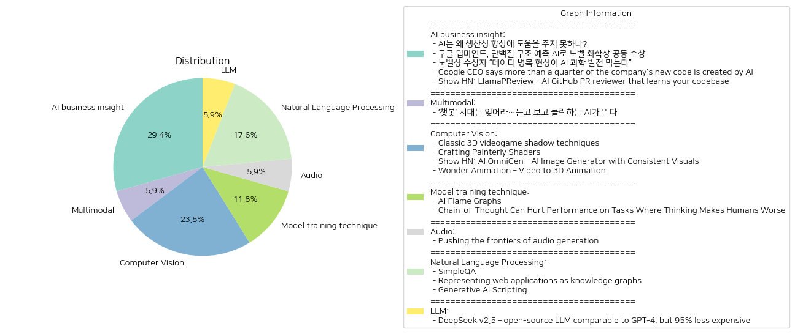

# Daily Artificial Intelligence Insights : News

## 🍊 AI business insight

**요약:**

**주요 테마**: 
뉴스 기사들을 종합해보면, 인공지능(AI)의 역할과 영향력이 주요 테마로 나타나고 있습니다. AI의 생산성 향상 기여도, AI와 노벨상의 관련성, 데이터의 중대함 그리고 AI를 활용한 새로운 기술 발전 등이 공통적으로 논의되고 있습니다.

**주요 이벤트**: 
1. 'AI는 왜 생산성 향상에 도움을 주지 못하나?': AI 기술이 기대에 부응하기 위해서는 몇 가지 개선이 필요하다는 점을 강조합니다.
2. '구글 딥마인드, 단백질 구조 예측 AI로 노벨 화학상 공동 수상': 구글 딥마인드의 데미스 허사비스와 존 점퍼가 단백질 접힘 예측에서 AI를 사용하여 노벨상을 공동 수상했습니다.
3. '노벨상 수상자 “데이터 병목 현상이 AI 과학 발전 막는다”': AI 연구의 큰 기반이 되는 고품질 데이터의 중요성이 강조되었습니다.
4. 'Google CEO says more than a quarter of the company's new code is created by AI': 구글의 새로운 코드의 4분의 1 이상이 AI에 의해 생성되어 생산성과 효율성이 증대되고 있다고 발표되었습니다.
5. 'Show HN: LlamaPReview – AI GitHub PR reviewer that learns your codebase': AI를 이용한 GitHub PR 리뷰어인 LlamaPReview가 다양한 기능을 제공하며 사용자의 생산성을 높입니다.

**영향 분석**:
- 경제: AI가 산업 전반에 걸쳐 생산성과 효율성을 향상시키고 있으나, 제대로 된 데이터 확보와 기술 개선이 이루어져야 궁극적인 경제 효과가 발현될 것입니다.
- 과학: AI 기반 연구가 노벨상 수상으로 이어져 AI의 과학적 도구 활용이 더욱 확대될 전망입니다.
- 사회: AI 관련 기술의 발전이 기업과 개인의 작업방식을 크게 변화시키고 있습니다.

**최종 요약**:
이 뉴스들을 통해 밝혀진 바는 AI가 다양한 분야에서 영향력을 넓히고 있으나, 생산성 측면에서의 실질적인 개선을 위해서는 데이터 확보와 기술 발전이 필수적입니다. 특히 AI가 만들어내는 경제적, 과학적, 그리고 업계 혁신의 가능성을 주목해야 하며, 앞으로의 AI 발전이 업무환경과 기술 발전 분야에 미치는 영향을 지속적으로 관찰하는 것이 필요합니다. 또한, AI를 활용한 기존 업무 프로세스 개선과 새로운 가능성이 열린다는 점은 다양한 분야에서 관심을 가질 만한 요소로 보입니다.

**출처:**

 - AI는 왜 생산성 향상에 도움을 주지 못하나? (https://www.technologyreview.kr/ai%eb%8a%94-%ec%99%9c-%ec%83%9d%ec%82%b0%ec%84%b1-%ed%96%a5%ec%83%81%ec%97%90-%eb%8f%84%ec%9b%80%ec%9d%84-%ec%a3%bc%ec%a7%80-%eb%aa%bb%ed%95%98%eb%82%98/)
 - 구글 딥마인드, 단백질 구조 예측 AI로 노벨 화학상 공동 수상 (https://www.technologyreview.kr/%ea%b5%ac%ea%b8%80-%eb%94%a5%eb%a7%88%ec%9d%b8%eb%93%9c-%eb%8b%a8%eb%b0%b1%ec%a7%88-%ea%b5%ac%ec%a1%b0-%ec%98%88%ec%b8%a1-ai%eb%a1%9c-%eb%85%b8%eb%b2%a8-%ed%99%94%ed%95%99%ec%83%81-%ea%b3%b5%eb%8f%99/)
 - 노벨상 수상자 “데이터 병목 현상이 AI 과학 발전 막는다” (https://www.technologyreview.kr/%eb%85%b8%eb%b2%a8%ec%83%81-%ec%88%98%ec%83%81%ec%9e%90-%eb%8d%b0%ec%9d%b4%ed%84%b0-%eb%b3%91%eb%aa%a9-%ed%98%84%ec%83%81%ec%9d%b4-ai-%ea%b3%bc%ed%95%99-%eb%b0%9c%ec%a0%84-%eb%a7%89%eb%8a%94/)
 - Google CEO says more than a quarter of the company's new code is created by AI (https://www.businessinsider.com/google-earnings-q3-2024-new-code-created-by-ai-2024-10)
 - Show HN: LlamaPReview – AI GitHub PR reviewer that learns your codebase (https://github.com/marketplace/llamapreview)

## 🍊 Multimodal

**요약:**

1. **주요 테마**:
   최근의 뉴스 기사에서는 인공지능(AI) 기술의 진화와 발전, 특히 음성과 영상 생성 기능의 AI가 새로운 트렌드로 부상하고 있는 점이 주요 주제로 다루어지고 있습니다. 이는 기존의 텍스트 기반 AI 챗봇의 한계를 넘어 점차 다양성과 기능성을 갖춘 AI로 발전하는 과정을 보여주고 있습니다.

2. **주요 사건**:
   기사에서는 텍스트 기반의 AI 챗봇 시대가 저물고, 음성 및 영상 기능을 갖춘 AI의 시대가 도래하고 있음을 강조하고 있습니다. 이는 기술 발전의 자연스러운 흐름으로, AI가 다양한 방식으로 사회에 융화되고 있음을 반영합니다.

3. **영향 분석**:
   - **경제적 측면**: 이러한 AI 기술의 발전은 다양한 산업 분야에서 혁신을 이끌고 있으며, 새로운 시장을 창출하거나 기존 시장을 재편성할 가능성을 가집니다. 기업들은 이러한 기술을 활용하여 생산성을 높이고, 신규 서비스를 제공할 수 있는 기회를 얻게 됩니다.
   - **사회적 측면**: AI의 발전은 사회 전반에 걸쳐 많은 변화를 가져올 수 있습니다. 특히, 사용자 경험을 향상시킬 수 있는 다양한 인터페이스의 발전으로, AI가 일상적으로 활용되는 범위가 넓어질 것입니다.

4. **최종 요약**:
   AI 기술의 진화는 단순한 텍스트 기반의 챗봇을 넘어, 보다 직관적이고 상호작용이 가능한 방향으로 나아가고 있습니다. 음성과 영상 생성 기능을 갖춘 AI의 부상은 기술과 사용자 경험의 발전을 상징하며, 다양한 산업에서의 새로운 기회를 제시합니다. 향후 이러한 AI 기술이 얼마나 빠르게 확산되고, 기존 비즈니스 모델에 어떤 변화를 가져올지 주목할 필요가 있으며, 윤리적 문제나 프라이버시 이슈에 대한 대비도 필요합니다.

**출처:**

 - ‘챗봇’ 시대는 잊어라…듣고 보고 클릭하는 AI가 뜬다 (https://www.technologyreview.kr/%ec%b1%97%eb%b4%87-%ec%8b%9c%eb%8c%80%eb%8a%94-%ec%9e%8a%ec%96%b4%eb%9d%bc-%eb%93%a3%ea%b3%a0-%eb%b3%b4%ea%b3%a0-%ed%81%b4%eb%a6%ad%ed%95%98%eb%8a%94-ai%ea%b0%80-%eb%9c%ac%eb%8b%a4/)

## ❄️ Computer Vision

**요약:**

**1. 주요 주제:**

- 여러 뉴스 기사에서 반복적으로 등장하는 주요 주제는 기술, 특히 3D 영상 기술과 AI 관련된 기술의 발전입니다.
- 3D 비디오 게임에서의 이미지 및 그림자 렌더링 기법, 회화적 셰이더의 구현, AI 기반 이미지 생성기 및 영상에서 3D 애니메이션으로 변환하는 기술 등이 강조되고 있습니다.

**2. 주요 사건:**

- 'Classic 3D videogame shadow techniques': 3D 비디오 게임에서 사용하는 그림자 렌더링 기술들에 대한 토론이 소개되었습니다. 그림자 매핑, 스텐실 그림자, 그리고 라이트맵과 같은 다양한 기법이 사용됩니다.
- 'Crafting Painterly Shaders': 쿠와하라 필터를 사용하여 회화적 셰이더를 구현하는 방법과 여러 포스트 프로세싱 효과를 추가하여 더욱 현실감 있는 출력물을 얻는 과정을 설명합니다.
- 'Show HN: AI OmniGen': AI를 활용한 일관된 시각적 결과를 제공하는 이미지 생성기 'AI OmniGen'의 소개(설명 부족).
- 'Wonder Animation – Video to 3D Animation': 라이브 액션 비디오를 3D 애니메이션으로 전환하는 AI 도구인 Wonder Animation의 베타 버전 출시가 발표되었습니다.

**3. 영향 분석:**

- **경제적 측면:** Wonder Animation과 같은 새로운 기술들은 영화 제작의 효율성을 높이고 비용 절감을 가능하게 하며, 더 많은 창작자가 고품질의 3D 콘텐츠를 생산할 수 있게 도울 것입니다.
- **사회적 측면:** AI와 3D 기술의 발전은 대중에게 새로운 형태의 디지털 예술 및 엔터테인먼트를 제공할 가능성이 있으며, 기술 중심의 창작 방식이 확산될 것으로 예상됩니다.
- **예술 및 디자인:** 기술이 진화하면서 셰이더 및 애니메이션 분야에 창의성과 기술이 융합된 새로운 작품들이 등장할 가능성이 높아지고 있습니다.

**4. 최종 요약:**

전체적으로 이러한 뉴스들은 새로운 기술 발전이 다양한 분야에 강력한 영향을 미치고 있음을 보여줍니다. 3D 기술과 AI 기반의 도구들은 콘텐츠 제작의 패러다임을 변화시키고 있으며, 효율적인 제작 환경과 창의적인 표현 가능성을 넓혀주고 있습니다. 앞으로는 이러한 기술의 상용화로 인해 제작 산업의 혁신과 더 나은 소비자 경험을 제공할 것으로 보입니다. 앞으로의 발전 상황과 함께 새로운 기술의 응용 사례 및 윤리적 문제에 대한 논의도 중요해질 것입니다.

**출처:**

 - Classic 3D videogame shadow techniques (https://30fps.net/pages/videogame-shadows/)
 - Crafting Painterly Shaders (https://blog.maximeheckel.com/posts/on-crafting-painterly-shaders/)
 - Show HN: AI OmniGen – AI Image Generator with Consistent Visuals (https://aiomnigen.com)
 - Wonder Animation – Video to 3D Animation (https://adsknews.autodesk.com/en/news/autodesk-launches-wonder-animation-video-to-3d-scene-technology/)

## ✈️ Model training technique

**요약:**

1. **주요 테마**:
   - 인공지능 기술 개발 및 최적화: 인텔 AI Flame Graphs는 AI 개발의 비용 절감 및 효율성 증대를 목적으로 하는 도구로 소개되고 있습니다.
   - 인간의 사고 프로세스와 인공지능의 상호작용: Chain-of-Thought 기법이 특정 과제에 대해서는 부정적인 영향을 미칠 수 있다는 연구가 진행되었습니다.
   
2. **주요 사건**:
   - 인텔은 AI Flame Graphs를 통해 AI 가속기나 GPU 하드웨어 프로파일과 전체 소프트웨어 스택을 시각화하여 AI 개발 비용을 절감하고 효율성을 높이고자 합니다. 이는 현재 Intel Tiber AI Cloud에서 미리보기로 제공되고 있습니다.
   - Chain-of-Thought 기법이 모든 인공지능 작업에서 긍정적인 결과를 가져오지는 않을 수 있다는 연구 결과가 나타났습니다. 이는 여전히 특정 과제에서는 역효과를 가져올 수 있음을 시사합니다.
   
3. **영향 분석**:
   - 경제적 측면: AI 개발의 비용 절감이 가능해짐에 따라 기업들은 더욱 혁신적인 AI 솔루션을 개발할 수 있는 여지를 마련할 수 있습니다. 이는 AI 시장의 성장과 확장을 이끌 가능성이 큽니다.
   - 사회적 측면: AI 도구의 효율성이 증가하면서 AI 기술의 접근성이 높아질 수 있으며, 이는 기술 격차 감소에 긍정적인 영향을 미칠 수 있습니다.
   - 연구 및 개발: Chain-of-Thought 연구는 인간의 사고 방식과 AI의 최적화 기법 간의 복합적인 관계에 대한 이해를 심화시키고, AI 시스템을 더욱 개선하기 위한 기초가 될 수 있습니다.
   
4. **최종 요약**:
   인텔의 AI Flame Graphs는 AI 기술의 비용 효율성을 높이고, 개발 과정의 최적화를 가능하게 함으로써 기술적 발전을 도모하고 있습니다. 이는 경제 및 사회 전반에 걸쳐 긍정적인 파급 효과를 기대할 수 있습니다. 동시에, Chain-of-Thought 연구 결과는 AI 기법이 모든 작업에서 항상 긍정적인 결과를 가져오지는 않음을 보여주며, AI 기술의 진화에 있어 보다 정교한 접근 방식이 필요함을 제시합니다. 앞으로 AI 기술이 어떻게 최적화되고 적용될지에 대한 진지한 논의와 지속적인 연구가 필요합니다.

**출처:**

 - AI Flame Graphs (https://www.brendangregg.com/blog//2024-10-29/ai-flame-graphs.html)
 - Chain-of-Thought Can Hurt Performance on Tasks Where Thinking Makes Humans Worse (https://arxiv.org/abs/2410.21333)

## 🐱 Audio

**요약:**

### 1. 주요 주제:
- 오디오 생성 기술: 자연스러운 대화형 디지털 비서 및 AI 도구 개발
- 텍스트 입력으로부터 자연스럽고 높은 품질의 음성을 생성
- Google 제품(예: Gemini Live 및 YouTube 자막 서비스)에 활용

### 2. 주요 사건:
- 구글은 음성 생성 기술을 통해 디지털 서비스의 대화형 능력을 개선함.
- Gemini Live 및 YouTube 자동 자막에서 자연스러운 음성 경험을 제공.

### 3. 영향 분석:
- **경제적 영향**: 음성 생성 기술의 발전은 AI 기반 제품과 서비스의 경쟁력을 강화하여 관련 기업의 수익성을 증대시킬 수 있음. 또한, AI를 활용한 콘텐츠 제작 분야의 고용 및 새로운 비즈니스 모델을 창출할 가능성이 큼.
- **사회적 영향**: 자연어 처리 기술의 발전은 사용자와의 상호 작용을 보다 직관적이고 효율적으로 만들어, 디지털 접근성을 향상시킬 수 있음. 이는 특히 시각 장애인이나 전통적인 디지털 기기 사용에 어려움을 겪는 사용자들에게 큰 혜택을 줄 수 있음.

### 4. 최종 요약:
이번 보도에서 주목할 만한 것은 구글의 음성 생성 기술 발전이다. 이 기술은 고급 AI 알고리즘을 통해 텍스트를 자연스러운 음성으로 변환하여 다양한 디지털 플랫폼에서 활용되고 있다. 특히, Gemini Live와 YouTube 자동 자막에서의 적용 사례는 이러한 기술이 실사용 되는 데에 중요한 의미를 가진다. 앞으로의 기술 발전을 통해 더욱 발전된 사용자 경험과 상호 작용의 가능성이 기대되며, 관련 산업에서의 경제적 성장과 사용자의 삶의 질 향상이 예상된다. 지속적인 기술 혁신을 주목하며, 사회적으로 포괄적인 디지털 환경 조성에 기여하는지를 지켜볼 필요가 있다.

**출처:**

 - Pushing the frontiers of audio generation (https://deepmind.google/discover/blog/pushing-the-frontiers-of-audio-generation/)

## 🧸 Natural Language Processing

**요약:**

1. **주요 테마**:
   - 기계 학습과 인공지능의 발전: 뉴스 기사들은 주로 기계 학습과 인공지능의 능력을 개선하려는 시도에 대해 다루고 있으며, 특히 AI의 정확성과 신뢰성을 높이기 위한 노력에 집중하고 있다. 
   - 웹 애플리케이션 처리의 진화: 전통적인 웹 크롤링 방법의 한계를 넘어서 웹 애플리케이션을 보다 정교하게 이해하고 분석하기 위한 지식 그래프 활용이 또 다른 주요 테마다.
   - 자동화 및 스크립팅 기술: AI와 DevOps를 활용한 자동화를 통해 코드 분석과 접근성을 향상시켜 효율성을 높이려는 흐름이 관찰된다.

2. **주요 이벤트**:
   - 'SimpleQA'에서는 AI 모델의 신뢰성을 평가하고 개선하기 위한 새로운 벤치마크 테스트가 소개되었다.
   - '웹 애플리케이션을 지식 그래프로 나타내기' 기사에서는 웹의 동적 행동을 보다 잘 이해하는 방식으로 웹 애플리케이션을 표현하는 방법론을 제안하였다.
   - 'Generative AI Scripting'에서 AI를 활용하여 다양한 DevOps 스킬 및 자동화 기술을 익히는 방법이 제시되었다.

3. **영향 분석**:
   - **경제**: AI의 신뢰성과 효율성을 높임으로써 서비스의 질과 고객의 신뢰도를 향상시켜 시장 경쟁력이 강화될 수 있다. 자동화 기술의 발전은 기업의 운영 효율성을 증진시켜 경제 전반에 긍정적인 영향을 미칠 수 있다.
   - **사회**: AI가 사실을 기반으로 더 정확하게 작동하면, 사회 전반에 걸쳐 정보 신뢰성이 향상될 수 있으며, 이는 정보의 투명성과 책임성을 강화하는 데 기여할 것이다. AI와 DevOps의 결합은 혁신을 촉진하고 직업 환경을 변화시킬 가능성을 내포한다.

4. **최종 요약**:
   - 이번 뉴스들은 인공지능과 웹 해석 기술의 진보가 다양한 분야에 걸쳐 미치는 영향력을 잘 보여주고 있다. 특히 AI의 사실 기반 질문 응답 능력 및 신뢰성 개선, 웹 애플리케이션을 보다 효과적으로 이해하는 방법, 자동화 기술을 통한 생산성 향상이 주목된다. 이러한 발전은 경제와 사회 양측 모두에게 주요한 변화를 일으킬 가능성이 있으며, 앞으로도 이러한 기술적 진보의 지속성을 모니터링할 필요가 있다. AI와 자동화 기술의 진보가 계속됨에 따라 관련 분야의 직업 구조 변화도 예상된다.

**출처:**

 - SimpleQA (https://openai.com/index/introducing-simpleqa/)
 - Representing web applications as knowledge graphs (https://arxiv.org/abs/2410.17258)
 - Generative AI Scripting (https://microsoft.github.io/genaiscript/)

## ☀️ LLM

**요약:**

1. **주요 주제**:
   - 인공지능 기술 발전: DeepSeek v2.5는 GPT-4와 비교할 만한 개방형 소스 대규모 언어 모델(LLM)로, 기술 발전의 중요성을 시사합니다.
   - 비용 효율성: 이러한 기술이 95% 저렴하다는 점은 인공지능 기술 사용에 있어 비용 문제를 크게 경감시킬 가능성을 제시합니다.
   - 자율 지능(AGI) 탐구: AGI(자율 지능)의 비밀을 푸는 호기심을 강조하며, 장기적인 관점에서 발전을 위해 질문을 던짐.

2. **주요 사건**:
   - DeepSeek v2.5의 발표: 이 모델은 고성능 언어 모델로, 시장에서 비용 효율적인 대안으로 주목받고 있습니다.
   - AGI와의 관계: 이 기술은 AGI의 실현 가능성에 대한 지속적인 탐구와 관련된 논의의 중심에 놓여 있습니다.

3. **영향 분석**:
   - 경제적 영향: 비용이 크게 절감된 기술은 더 많은 기업과 개인이 LLM을 활용할 수 있게 하여 시장 경쟁을 촉진할 가능성이 있습니다.
   - 사회적 영향: 인공지능이 더 널리 사용되면서 관련 교육, 인재 양성 및 윤리적 토론이 중요해질 것입니다.
   - 정치적 영향: 인공지능 규제 및 사용 정책에 대한 논의가 활성화될 수 있으며, 기술 패권 경쟁에 변화를 가져올 수도 있습니다.

4. **최종 요약**:
   DeepSeek v2.5는 비용 효율성과 높은 성능을 바탕으로 인공지능 기술의 접근성을 크게 높여줄 것으로 보입니다. 이로 인해 경제와 사회 전반에서 LLM의 활용이 증가하며 관련된 새로운 정책과 규제 필요성이 대두될 것입니다. AGI와 같은 장기적 목표에 대한 탐구가 이어질 것이며, 이러한 내용들이 다양한 분야에 걸쳐 영향을 미칠 것으로 예상됩니다. 앞으로는 기술 발전과 관련한 윤리적 문제와 기술의 공평한 접근 가능성에 대한 논의가 지속적으로 이루어져야 할 것입니다.

**출처:**

 - DeepSeek v2.5 – open-source LLM comparable to GPT-4, but 95% less expensive (https://www.deepseek.com/)

