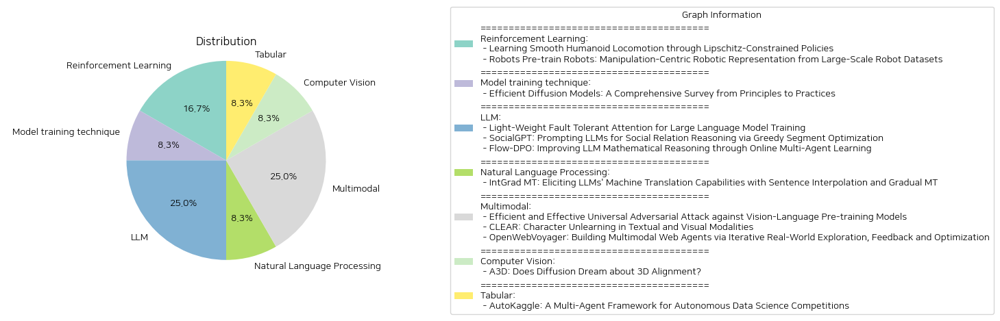

# Daily Artificial Intelligence Insights : Papers

## 🐱 Reinforcement Learning

**요약:**

**종합 요약 보고서**

1. **주요 주제 및 테마 추출**
   - 'Learning Smooth Humanoid Locomotion through Lipschitz-Constrained Policies': 강화 학습, 리프시츠 제약 정책, 휴머노이드 로봇, 부드러운 로봇 이동
   - 'Robots Pre-train Robots: Manipulation-Centric Robotic Representation from Large-Scale Robot Datasets': 사전 학습, 조작 중심 로봇 표현, 대규모 로봇 데이터셋, 다이내믹스 정보

2. **공통 키워드 및 패턴 식별**
   - 두 논문 모두 로봇의 학습 및 제어에 관한 연구로, 특히 로봇의 이동 및 조작 과제에 중심을 두고 있음.
   - 강화 학습 및 시뮬레이션을 통한 로봇 제어 기술의 향상과 이를 실제 환경에 적용하는 방법에 초점을 맞추고 있음.
   - 데이터 효율성 및 목표 과제의 성공률을 높이기 위한 효과적인 방법론을 제공하고자 함.

3. **주요 사건 및 중요 정보 요약**
   - 첫 번째 논문은 부드러운 이동을 위한 Lipschitz 제약을 도입하여, 로봇의 다양한 플랫폼에서의 조정이 불필요한 일반 기술을 제안하고 있음. 이 방법은 부드러운 보상이나 저역 통과 필터 없이 기존의 강화 학습 프레임워크에 쉽게 통합 가능함을 보이고 있음.
   - 두 번째 논문은 대규모 로봇 데이터셋을 활용하여 조작 중심의 시각적 표현을 사전 학습하는 방법론인 MCR을 제안, 이는 특히 조작 과제에서의 성공률을 높이며 데이터 효율성을 크게 개선함.

4. **이벤트의 영향 분석**
   - Lipschitz 제약 정책은 다양한 로봇 플랫폼에서의 강력한 이동 제어를 가능하게 하여 로봇 공학 분야에서의 실질적인 혁신을 이루어낼 수 있음.
   - MCR은 로봇 학습의 효율성을 크게 향상시켜, 실용적인 로봇 응용 프로그램에서의 성능을 극대화함으로써 산업 분야의 자동화 가능성을 높임.

5. **결론 및 향후 개발 동향**
   - 두 연구 모두 로봇 제어 및 학습의 개선에 중점을 두고 있으며, 각각의 기술이 로봇 공학 분야에 실용적인 기여를 할 것으로 예상됨.
   - Lipschitz 제약 정책(LCP)은 향후 휴머노이드 및 다양한 로봇의 부드럽고 안정적인 이동성을 향상시키는 중요한 기술로 자리 잡을 가능성이 큼.
   - MCR의 발전은 로봇의 인지 및 조작 능력을 대폭 향상시키며, 이는 궁극적으로 인간과 로봇의 상호작용 개선에 기여할 것으로 보임.

이러한 연구들은 로봇 공학의 발전을 통해 다양한 실제 문제 해결에 기여할 수 있으며, 향후 더욱 복잡하고 다양한 환경에서도 효과적으로 적용될 수 있는 가능성을 제시하고 있다.

**출처:**

 - Learning Smooth Humanoid Locomotion through Lipschitz-Constrained Policies (https://deeplearn.org/arxiv/537215/learning-smooth-humanoid-locomotion-through-lipschitz-constrained-policies)
 - Robots Pre-train Robots: Manipulation-Centric Robotic Representation from Large-Scale Robot Datasets (http://arxiv.org/abs/2410.22325v2)

## 🍋 Model training technique

**요약:**

### 요약 보고서: 효율적인 확산 모델에 대한 종합적 조사

최근 몇 년 간 가장 인기 있는 생성 모델 중 하나로, 확산 모델은 이미지 합성, 비디오 생성, 분자 설계, 3D 씬 렌더링 및 다중 모달 생성 등 다양한 생성 작업에 있어 뛰어난 장점을 지속적으로 보여주고 있습니다. 이 모델들은 밀집된 이론적 원칙과 신뢰할 수 있는 응용 실습을 바탕으로 하고 있으며, 이러한 최근의 노력의 성공은 주로 진보된 설계 원칙과 효율적인 아키텍처, 훈련, 추론 및 배포 방법론 덕분입니다. 하지만, 이러한 원칙과 실천을 요약하여 확산 모델의 빠른 이해와 적용을 돕는 종합적이고 심층적인 검토는 없었습니다. 이번 조사는 기존의 노력들에 대한 새로운 효율성 지향적 관점을 제공하며, 이는 주로 아키텍처 설계, 모델 훈련, 빠른 추론 및 신뢰할 수 있는 배포에서 깊은 원칙과 효율적인 실천에 중점을 두어 독자 친화적인 방식으로 새로운 시나리오에 대한 이론적 연구, 알고리즘 이식 및 모델 적용을 안내합니다.

#### 주요 주제와 테마
1. **확산 모델의 인기도**: 이미지 합성, 비디오 생성 등 다양한 분야에서의 활용.
2. **효율적인 아키텍처와 방법론**: 진보된 설계 원칙, 신뢰성 있는 배포.
3. **빠른 추론 및 훈련 기술**: 최적의 결과를 내기 위한 효과적인 방법론.

#### 주요 키워드, 트렌드, 패턴
- **생성 모델**: 최근 중요한 연구 분야의 주목 대상.
- **효율성**: 설계, 훈련, 배포 전반에 걸친 우수한 성능.
- **응용 실습**: 실제 시나리오에서의 신뢰성 있는 성과.

#### 주요 이벤트 및 정보
- 확산 모델의 탁월한 생성 능력 실증.
- 다양한 분야에 대한 효율적 접근 제공.
- 향후 연구와 응용 가능성 확대.

#### 영향 분석
- **기술 분야**: 인공지능 및 기계 학습의 발전 촉진.
- **산업 응용**: 다양한 산업에서 모델 활용 가능성 증가.
- **미래 연구 방향**: 이론적 연구와 알고리즘 개선을 통한 지속적 발전.

#### 종합 결론 및 미래 개발 관찰
효율적인 확산 모델의 설계와 실천은 현재 생성 모델 연구의 중심에 있으며, 지속적인 이론적 연구와 알고리즘 최적화가 필요합니다. 특히, 다양한 새로운 응용 시나리오에서의 활용을 위한 연구가 활발하게 이루어질 것으로 예상됩니다. 이러한 발전은 AI 기술의 포괄적 성능 향상과 다분야에 걸친 산업화에 기여할 것입니다.

**출처:**

 - Efficient Diffusion Models: A Comprehensive Survey from Principles to Practices (https://deeplearn.org/arxiv/537216/efficient-diffusion-models:-a-comprehensive-survey-from-principles-to-practices)

## ☀️ LLM

**요약:**

---

### 종합 요약 보고서

이번 보고서에서는 최신 논문들에서 다루어진 대형 언어 모델(LLM) 관련 연구 주제를 종합적으로 요약합니다. 논문은 주로 LLM의 학습 효율성, 사회 관계 추론, 수학적 추론 향상 등을 다루고 있으며, 각 연구의 핵심 내용과 그 영향력을 분석합니다.

#### 1. 핵심 주제 및 테마

- **대형 언어 모델 (LLM)**: 주로 자연어 처리에서 뛰어난 성능을 보이지만, 학습 과정에서의 결함 / 오류 문제 해결이 주요 과제로 제시된다.
- **사회 관계 추론**: 이미지로부터 친구, 동료 등의 관계를 파악하는 문제에서 LLM을 활용한 새로운 접근법이 제안된다.
- **수학적 추론**: LLM의 수학적 논리 추론 능력을 향상시키기 위한 새로운 형태의 온라인 학습 방법론이 개발된다.

#### 2. 공통 키워드 및 트렌드

- **오류 내성 및 최적화**: ATTNChecker의 경우, 경량 보호를 통해 LLM 학습 시 오류를 탐지하고 교정함으로써 오버헤드를 줄이는 방법이 강조됩니다.
- **프롬프트 최적화**: LLM의 텍스트 생성 능력을 극대화하기 위해 자동화된 프롬프트 최적화 방법이 요구됩니다. 특히, Greedy Segment Prompt Optimization(GSPO)을 통해 이와 관련된 성능 개선이 가능합니다.
- **집단 학습**: 여러 LLM 간 상호작용을 통해 수학적 reasoning traces를 생성하는 방법이 탐구됩니다.

#### 3. 주요 사건 및 정보 요약

- **ATTNChecker**: LLM 학습 중에 발생하는 코드 오류를 감소시켜 학습 과정의 안정성을 높이며, 기존의 체크포인트/복구 방법 대비 49배의 효율성을 보여줍니다.
- **SocialGPT**: VFMs와 LLMs를 결합한 모듈식 구조를 통해 사회적 관계 추론에서 새로운 기준점을 수립하였으며, 자동화된 프롬프트 최적화로 성능을 향상시킵니다.
- **Flow-DPO**: LLM 수학적 추론 향상에 있어 온라인 다중 에이전트 학습을 통해 reasoning traces 품질 개선 및 실시간 모델 갱신이 가능하다는 점을 입증합니다.

#### 4. 각 분야에 미치는 영향 분석

- **컴퓨터 과학 및 인공지능**: LLM의 학습 및 구체화에서의 효율성 증대는 AI 및 딥러닝 산업 전반의 경쟁력을 더합니다.
- **사회 과학 및 인류학**: LLM 기반의 사회관계 추론 모델의 발전은 사회관계 분석 분야에 있어 더 많은 해석 가능성을 제시합니다.
- **교육 및 연구**: 수학적 추론 능력의 발전은 교육적 목적으로 LLM을 활용하는 데 있어 중요한 기반을 제공합니다.

#### 5. 결론 및 향후 전망

이 연구들은 대형 언어 모델의 결함 내성과 최적화, 사회 및 수학적 추론 능력 향상에 기여하며, 인공지능 시스템의 안정성과 해석 가능성을 높입니다. 앞으로 자동화된 프롬프트 설계 기법과 집단적 LLM 학습을 통한 다중 기능 향상을 추적할 필요가 있습니다. LLM이 더 다양한 분야에 대한 이해와 적용을 가능케 할 것으로 기대됩니다.

---

**출처:**

 - Light-Weight Fault Tolerant Attention for Large Language Model Training (https://deeplearn.org/arxiv/537218/light-weight-fault-tolerant-attention-for-large-language-model-training)
 - SocialGPT: Prompting LLMs for Social Relation Reasoning via Greedy Segment Optimization (http://arxiv.org/abs/2410.21411v1)
 - Flow-DPO: Improving LLM Mathematical Reasoning through Online Multi-Agent Learning (http://arxiv.org/abs/2410.22304v1)

## ☀️ Natural Language Processing

**요약:**

보고서 요약:

1. 주요 주제 및 테마 추출:
   - 최신 대형 언어 모델(LLMs)의 번역 능력
   - 추가 병렬 코퍼스 없이 번역 수행의 한계 및 개선
   - 저자원 언어 쌍에서의 낮은 성능 문제
   - 소수의 예시 또는 외부 자원에 대한 의존도
   - IntGrad MT라는 새로운 방법 제안

2. 공통 키워드, 트렌드, 패턴 식별:
   - 번역 성능 향상
   - 문장 보간(Sentence Interpolation) 및 점진적 번역(Gradual MT) 기술
   - 자체 모델 번역을 활용한 번역 체인 구성
   - xCOMET 점수 증가
   - 저자원 언어에 대한 특별한 성과

3. 주요 사건 및 핵심 정보 요약:
   - IntGrad MT 방법은 대형 언어 모델의 고유 번역 능력을 최대한 활용
   - 간단한 문장에서 번역 난이도가 점차 증가하는 문장 순서 생성
   - 이전 문장의 번역을 다음 문장의 소수 예시로 사용하여 순차적으로 번역
   - 주요 언어 모델들에 대한 xCOMET 점수가 현저히 향상되었으며 특히 힌디어(8.26), 스와힐리(7.10), 벵골어(6.97), 마라티어(13.03)와 같은 저자원 언어에서 두드러짐

4. 이러한 사건의 다양한 부문에 대한 영향 분석:
   - 인공지능 언어 모델의 번역 능력 향상
   - 저자원 언어 사용자에 대한 더 나은 번역 지원 가능성
   - 외부 지원 없이 모델 자체의 번역 성능 극대화 가능성
   - 학술 연구 및 상업적 번역 응용 분야에서의 잠재력

5. 최종 종합 요약 및 결론, 주목할 만한 미래 발전 가능성:
   IntGrad MT는 추가적인 학습 없이 대형 언어 모델의 번역 성능을 크게 향상시키는 혁신적인 방법을 제시합니다. 특히 저자원 언어 번역에 있어서 실질적인 성과를 냈으며, 이는 언어 번역 기술 발전에 중요한 전환점이 될 수 있습니다. 향후 발전 가능성으로는 더 많은 언어에서의 성능 평가 및 상용화 응용에 대한 연구가 진행될 것으로 기대됩니다.

**출처:**

 - IntGrad MT: Eliciting LLMs' Machine Translation Capabilities with Sentence Interpolation and Gradual MT (https://deeplearn.org/arxiv/537219/intgrad-mt:-eliciting-llms'-machine-translation-capabilities-with-sentence-interpolation-and-gradual-mt)

## 🐱 Multimodal

**요약:**

**종합 요약 보고서**

1. **주요 주제 및 테마 추출**
   첫 번째 논문은 VLP(시각-언어 사전 훈련) 모델의 취약성과 이를 이용한 보편적 적대적 공격을 다루고 있습니다. 두 번째 논문은 텍스트와 시각 모드에서 머신 언러닝(MU)을 통해 개인 정보 보호와 보안을 개선하는 방법을 제시하였고, 주요 벤치마크로 CLEAR를 소개합니다. 세 번째 논문은 웹 탐색과 피드백 최적화를 통해 다중 모드 웹 에이전트를 구축하는 방법론을 제시합니다.

2. **공통 키워드 및 패턴 식별**
   - **다중 모드 모델**: 세 논문 모두 시각과 언어 혹은 텍스트와 이미지 등의 다중 모드 데이터를 사용해서 모델을 개선하고자 하는 공통의 목표를 갖고 있습니다.
   - **적대적 및 언러닝 전략**: 첫 번째 논문은 적대적 공격 기술을, 두 번째 논문은 언러닝 접근 방식을 통해 데이터의 기밀성을 유지하는 방법을 논의합니다.
   - **프레임워크 및 벤치마크 개발**: 세 번째 논문에서는 프레임워크 개발을, 두 번째 논문에서는 벤치마크 개발을 주된 방법론으로 채택하고 있습니다.

3. **주요 사건 및 중요 정보 요약**
   - DO-UAP는 적대적 공격에서 전통적인 방법에 비해 자원 소모를 23배 감소시키면서 높은 성과를 보여주었습니다.
   - CLEAR 벤치마크는 200명 허구적 인물에 대한 테스트 데이터와 10개의 MU 방법을 통합하여 다중 모드의 언러닝을 평가하는 데 기여하고 있습니다.
   - OpenWebVoyager는 웹 환경에서의 반복적 탐색, 피드백, 최적화를 통해 에이전트 성능을 향상시키도록 설계되었습니다.

4. **이벤트의 영향 분석**
   - **보안 및 프라이버시**: 첫 번째 논문의 DO-UAP 접근법은 VLP 모델의 보안성을 시험하며, 두 번째 논문의 CLEAR는 보안 학습을 강화합니다.
   - **모델 성능 향상**: OpenWebVoyager는 다중 모드의 능력을 통해 웹 에이전트의 성능을 지속적으로 개선시키고 있습니다.

5. **결론 및 미래 발전 방향**
   논문들에서 제시된 기술들은 공통적으로 보안, 프라이버시, 모델 성능 향상에 중점을 두고 있으며 이들 변화는 AI 기술의 발전과 실세계 적용에 중요한 이정표가 될 것입니다. 앞으로도 이와 같은 다중 모드 및 적대적 방어 전략의 개발이 가속화될 것으로 기대됩니다. 특히, 보안성을 높이고 모델을 보호할 수 있는 새로운 프레임워크와 벤치마크가 지속적으로 개발되어야 할 것입니다.

**출처:**

 - Efficient and Effective Universal Adversarial Attack against Vision-Language Pre-training Models (https://deeplearn.org/arxiv/537220/efficient-and-effective-universal-adversarial-attack-against-vision-language-pre-training-models)
 - CLEAR: Character Unlearning in Textual and Visual Modalities (http://arxiv.org/abs/2410.18057v1)
 - OpenWebVoyager: Building Multimodal Web Agents via Iterative Real-World Exploration, Feedback and Optimization (http://arxiv.org/abs/2410.19609v1)

## 💚 Computer Vision

**요약:**

1. 주요 주제 및 테마 추출:
   - 텍스트 기반 3D 생성
   - 기하학적 정렬
   - 점수 증류(Score Distillation)
   - 높은 품질의 3D 객체 표현
   - 공통 잠재 공간 임베딩

2. 공통 키워드, 트렌드 및 패턴 식별:
   - 3D 객체 생성과 정렬
   - 점수 증류를 통한 2D 모델의 3D 전환
   - 객체 간의 부드러운 전환 및 신뢰성 있는 중간 객체

3. 주요 사건 및 중요한 정보 요약:
   이 논문은 텍스트 기반 3D 생성에서 기하학적 정렬 문제를 해결하기 위해 개발된 방법론을 설명합니다. 점수 증류를 통해 2D 확산 모델의 지식을 3D 객체로 전환하는 데 성공했으며, 여러 텍스트 쿼리를 별도로 처리하여 생성된 객체는 자세와 구조에서 높은 변화를 보입니다. 본 연구에서는 생성된 객체 간의 정렬을 달성하기 위해, 객체를 공통의 잠재 공간에 임베딩하고 객체 간의 연속적인 전환을 최적화하는 방법을 제안합니다. 이러한 전환의 두 가지 속성인 연속성 및 중간 객체의 신뢰성을 강조합니다.

4. 이러한 사건이 여러 부문에 미치는 영향 분석:
   3D 자산 설계, 편집 및 하이브리드화와 같은 실용적인 시나리오에서 객체 간의 정렬이 필요한 경우, 본 연구의 방법론이 유용할 수 있습니다. 3D 그래픽 및 디자인 산업에서 특히 큰 영향을 미칠 수 있으며, 새로운 물체의 창작 및 수정이 보다 효율적이고 일관되게 이루어질 수 있습니다.

5. 최종 요약 및 결론 및 향후 주목할 발전 가능성:
   본 문서는 텍스트 기반 3D 객체 생성에서 정렬 문제에 대한 혁신적인 접근을 제공하며, 객체 간의 정렬된 전환이 가능함을 실험적으로 입증합니다. 이러한 기술은 3D 디자인의 효율성을 향상시키고, 다양한 산업에서 응용 가능성이 큽니다. 미래에는 더 정교한 3D 모델링, 학습된 2D에서 3D 전환의 정밀도가 높아질 것으로 기대됩니다.

**출처:**

 - A3D: Does Diffusion Dream about 3D Alignment? (https://deeplearn.org/arxiv/537221/a3d:-does-diffusion-dream-about-3d-alignment?)

## ✈️ Tabular

**요약:**

**종합 요약 보고서**

1. 핵심 주제 및 테마 추출:
   - 자동 데이터 과학 대회 프레임워크
   - 협업 기반의 다중 에이전트 시스템
   - 코드 실행, 디버깅, 단위 테스트 통한 반복적 개발
   - 사용자 맞춤형 및 자동화 지능 결합
   - 데이터 정제, 특징 공학, 모델링 등 범용 데이터 과학 도구 키트 제공

2. 공통 키워드, 경향 및 패턴:
   - '자동화', '협업', '프레임워크'
   - '데이터 파이프라인', '유효성 검증', '문제 해결'
   - '사용자 개입', '생산성 향상', '데이터 과학 태스크'

3. 주요 사건 및 중요 정보 요약:
   - AutoKaggle은 복잡한 탭형 데이터 과학 태스크를 해결하기 위해 제안된 사용자 중심 프레임워크로서, 다중 에이전트 시스템을 활용해 생산성을 크게 향상시킵니다.
   - 실시간 코드 실행, 디버깅 및 단위 테스트를 통해 코드의 정정성과 논리 일관성을 보장하며, 사용자가 각 단계에서 개입함으로써 자동화된 지능과 인간의 전문성을 결합합니다.
   - 8개의 Kaggle 대회를 선택하여 실제 시나리오에서 데이터 처리 워크플로우를 시뮬레이션하였으며, AutoKaggle이 복잡한 데이터 과학 태스크를 효과적으로 처리할 수 있음을 실험적으로 입증하였습니다.

4. 이러한 사건이 다양한 분야에 미치는 영향 분석:
   - 데이터 과학 분야에서의 생산성 및 효율성 증대를 통해 기업과 연구기관의 복잡한 데이터 분석 태스크 수행에 긍정적 영향을 미칠 가능성이 높습니다.
   - 데이터 과학 업무 자동화를 통해 팀들의 협력 작업이 개선되고, 인적 리소스를 보다 전략적 활동에 집중할 수 있게 됩니다.
   - 사용자 맞춤형 작업 가능성이 높아지며, 데이터 과학 커뮤니티의 전반적인 수준이 상승할 것으로 예상됩니다.

5. 결론 및 향후 관찰할 수 있는 발전 방향:
   - AutoKaggle의 성공적인 실험은 향후 더욱 정교한 자동화 시스템 개발에 영감을 줄 수 있으며, 적용 가능한 사용 사례의 폭이 넓어질 것입니다.
   - 인공지능과 인간 전문가의 협업을 보다 심화시켜 다양한 산업에서 데이터 기반 의사 결정에 기여할 수 있는 다양한 프레임워크 개발이 예상됩니다.
   - 향후 AutoKaggle과 비슷한 시스템들이 다양한 데이터 세트와 과제에 대응하여 확장될 가능성이 있으며, 이에 따른 데이터 과학 영역의 발전 추이를 지속적으로 관찰할 필요가 있습니다.

**출처:**

 - AutoKaggle: A Multi-Agent Framework for Autonomous Data Science Competitions (http://arxiv.org/abs/2410.20424v2)

