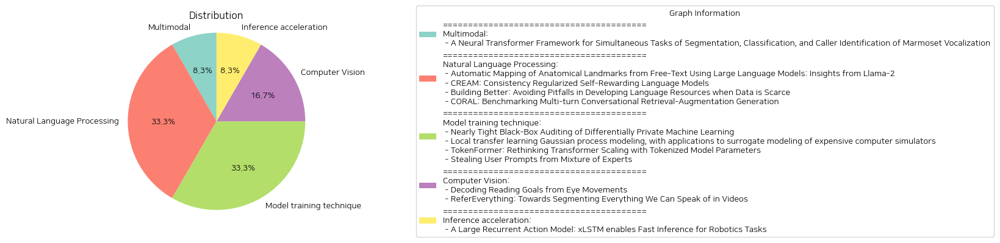

# Daily Artificial Intelligence Insights : Papers

## 🤩 Multimodal

**요약:**

보고서 요약:

1. 주요 주제와 테마 추출:
   - 마모셋 원숭이의 음성화 분석
   - 음성의 분할, 분류, 발신자 식별
   - 소셜 커뮤니케이션 행동 연구
   - 기존 CNN 모델의 한계
   - Transformer 아키텍처의 도입

2. 공통 키워드, 트렌드, 패턴 식별:
   - 마모셋 음성화
   - 음성 소셜 네트워크 분석
   - CNN과 Transformer의 비교
   - 자기 주의 메커니즘의 활용
   - 음성 데이터 글로벌 구조 포착

3. 주요 이벤트 및 핵심 정보 요약:
   - 마모셋 원숭이는 사회적 의사소통 행동 연구 모델로 사용됨.
   - CNN 기반의 기존 모델은 음성의 세그먼트화, 분류, 발신자 식별을 수행하였으나 장거리 음향 패턴 모델링에 한계.
   - Transformer 아키텍처는 장거리 정보 병렬 처리를 효율적으로 하여 CNN을 능가함.
   - 제안된 Transformer 모델은 음성의 분할, 분류, 발신자 식별을 동시에 수행함.

4. 이러한 이벤트의 다양한 분야에 대한 영향 분석:
   - 음성 소셜 네트워크 분석과 같은 다학제 연구의 촉진.
   - Transformer의 장점이 강조되며, 기존 머신러닝 접근 방식의 재평가 필요성 대두.
   - 나아가 사회적 의사소통 연구에서의 음성 분석 기술 발전 촉진.

5. 결론 및 잠재적 미래 발전:
   - Transformer의 음성 데이터 분석 효율성은 향후 다양한 분야에서 활용 가능성이 큼.
   - Transformer 모델의 효과성에 따라 음성 인식 및 분류 기술의 새로운 표준 설정 가능성.
   - 미래에는 통합적이며 다기능적인 분석 모델이 연구와 실용적인 응용에 점진적으로 더 많이 도입될 전망.

**출처:**

 - A Neural Transformer Framework for Simultaneous Tasks of Segmentation, Classification, and Caller Identification of Marmoset Vocalization (https://deeplearn.org/arxiv/542981/a-neural-transformer-framework-for-simultaneous-tasks-of-segmentation,-classification,-and-caller-identification-of-marmoset-vocalization)

## 👽 Natural Language Processing

**요약:**

1. 주요 주제 및 테마 추출:
- 'Automatic Mapping of Anatomical Landmarks from Free-Text Using Large Language Models: Insights from Llama-2'에서는 LLMs(Large Language Models)을 사용하여 해부학적 랜드마크를 자동으로 매핑하는 연구가 언급됨.
- 'CREAM: Consistency Regularized Self-Rewarding Language Models'는 자기보상 언어 모델에 일관성을 부여하여 정렬 성능을 향상시키는 접근법을 다룸.
- 'Building Better: Avoiding Pitfalls in Developing Language Resources when Data is Scarce'는 중저자원 언어에서의 데이터 수집과 주석의 윤리적 문제를 탐색하며, 더 나은 언어 자원 개발 방법을 제안함.
- 'CORAL: Benchmarking Multi-turn Conversational Retrieval-Augmentation Generation'는 다중턴 대화 검색-증강 생성(RAG)을 위한 벤치마크를 구축하여 실세계 대화의 복잡성을 다룸.

2. 공통 키워드, 트렌드, 패턴:
- LLMs의 활용: 많은 논문이 LLMs를 중심으로 혁신적인 방법론을 제안함.
- 자동화 및 효율성 향상: 해부학적 랜드마크 자동 매핑, 자기보상 모델, 다중턴 대화 등의 자동화된 접근법 강조.
- 데이터의 중요성: 데이터 품질, 윤리적 수집 방법 및 그 중요성에 대한 논의 강조.

3. 각 논문의 주요 이벤트 및 중요 정보 요약:
- Llama-2를 사용한 해부학적 랜드마크의 공간적 위치 매핑 연구는 의료 이미징 워크플로우의 효율성 및 정확성을 높이는 가능성을 보여줌.
- CREAM은 자기보상 과정에서의 일관성 유지방법을 도입하여 보상 일관성과 정렬 성능을 향상시킴.
- 중저자원 언어 개발에서 데이터 품질과 윤리적 주석 방법을 개선하기 위한 피드백을 수집하고 분석하여 구체적인 권고안을 제시함.
- CORAL은 다중턴 대화의 복잡성을 다루고, 기존 방법들의 개선 기회를 제시하는 대규모 벤치마크를 제공합니다.

4. 이러한 이벤트가 다양한 분야에 미치는 영향 분석:
- 의료: Llama-2 연구는 의료 이미지 분석의 정확도를 높임으로써 의료진의 진단 과정을 지원할 수 있음.
- NLP 기술: CREAM과 같은 방법론은 NLP 모델의 성능과 정렬을 개선하여 더 나은 사용자 경험을 제공할 수 있음.
- 언어 자원 개발: 적절한 데이터 수집과 주석 방식은 언어 기술 개발에 필수적이며, 특히 중저자원 언어의 기술 발전에 기여할 수 있음.
- 정보 검색 및 대화 시스템: CORAL은 다중턴 대화의 복잡성을 해결함으로써 지식 집약적 응용 프로그램의 성능을 향상시킬 수 있음.

5. 최종 요약 및 결론, 주목해야 할 미래 발전:
- LLMs는 다양한 분야에서 자동화된 시스템의 효율성과 정확성을 높이는 데 중요한 역할을 하고 있으며, 이를 더욱 발전시킬 수 있음.
- 데이터 품질 및 윤리적 수집 방법에 대한 관심이 증가하고 있으며, 이는 기술 개발의 지속 가능성과 신뢰성을 보장할 수 있는 핵심요소임.
- 다중턴 대화의 복잡성을 해결하는 새로운 벤치마크 및 접근법은 정보 검색 시스템의 질적 향상을 가져올 것으로 기대됨.
- 이러한 연구 개발은 미래의 NLP 기술의 발전 방향을 제시하며, 그중에서도 특히 의료, 언어 자원 개발, 대화 시스템 등의 분야에서 중대한 역할을 할 가능성을 보여줌.

**출처:**

 - Automatic Mapping of Anatomical Landmarks from Free-Text Using Large Language Models: Insights from Llama-2 (https://deeplearn.org/arxiv/537700/automatic-mapping-of-anatomical-landmarks-from-free-text-using-large-language-models:-insights-from-llama-2)
 - CREAM: Consistency Regularized Self-Rewarding Language Models (https://deeplearn.org/arxiv/537697/cream:-consistency-regularized-self-rewarding-language-models)
 - Building Better: Avoiding Pitfalls in Developing Language Resources when Data is Scarce (https://deeplearn.org/arxiv/537698/building-better:-avoiding-pitfalls-in-developing-language-resources-when-data-is-scarce)
 - CORAL: Benchmarking Multi-turn Conversational Retrieval-Augmentation Generation (http://arxiv.org/abs/2410.23090v1)

## 🎉 Model training technique

**요약:**

**요약 보고서**

1. **주요 주제 및 테마 추출**

   각 논문에서 다루고 있는 핵심 주제는 다음과 같습니다:
   - 차등 프라이버시 기계 학습의 블랙박스 감사를 위한 강화된 절차 제안
   - 고비용의 컴퓨터 시뮬레이터를 대체하는 서로게이트 모델링을 위한 지역 전이학습 기법
   - Transformer 모델의 스케일링 도전 과제를 해결하기 위한 TokenFormer를 통한 개선된 아키텍처
   - Mixture-of-Experts(MoE) 모델의 사용자를 위한 프롬프트 절도 공격 방법론

2. **공통 키워드, 트렌드 및 패턴 식별**

   이러한 논문들은 공통적으로 아래와 같은 키워드 및 테마를 다루고 있습니다:
   - 효율성 및 프라이버시 개선: 다양한 기계 학습 모델의 효율성과 데이터 프라이버시를 개선하는 방법론들이 제시되고 있습니다.
   - 전이 학습 및 서로게이트 모델링: 전이 학습 기법을 활용하여 모델의 성능을 개선하는 시도가 두드러집니다.
   - 모델의 스케일링 도전과 솔루션: 신규 아키텍처 개념을 통해 모델 스케일링의 비용 절감과 효율성을 높이려는 노력이 보입니다.
   - 보안 취약점 및 방어: 공격 벡터와 모델의 보안 취약점을 제시하며 해결책을 모색하는 경향이 있습니다.

3. **각 논문에서의 주요 이벤트 및 정보 요약**

   - **차등 프라이버시 감사를 위한 블랙 박스 절차**: DP-SGD 알고리즘에 대한 보다 엄격한 감사 절차를 제안, 실질적인 $\varepsilon$ 추정을 통해 프라이버시 분석을 개선할 수 있는 잠재력을 제공합니다.
   - **지역 전이학습 모델**: 유사한 시스템 간의 데이터 전환을 효율적으로 수행하여 서로게이트 모델의 성능을 향상시키는 LOL-GP 모델을 제안, '부정적 전이' 문제를 줄였습니다.
   - **TokenFormer 아키텍처**: 트랜스포머의 스케일링 문제를 해결하기 위한 새로운 토큰 기반 아키텍처를 소개, 추가적인 재교육 없이도 효과적인 성능을 제공합니다.
   - **MoE 사용자 프롬프트 절도 공격**: 특정 공격 방식으로 MoE 모델에서 사용자의 프롬프트를 추출할 수 있음을 입증, 관련 보안 취약점을 부각했습니다.

4. **이벤트의 다양한 부문에 대한 영향 분석**

   - **프라이버시 및 보안 부문**: 향상된 감사 및 보안 기법은 데이터 프라이버시와 모델 보호를 강화하여 신뢰성을 높일 수 있습니다.
   - **연구 및 개발 커뮤니티**: 새로운 전이 학습 및 스케일링 접근법은 연구 효율성을 높이고 새로운 AI 모델 개발을 가속화할 수 있습니다.
   - **산업 응용**: 이러한 기술들은 산업 전반에 걸쳐 보다 안전하고 효율적인 AI 솔루션을 개발하는 데 기여할 수 있습니다.

5. **최종 통합 요약 및 결론**

   본 보고서는 다양한 최첨단 기술과 개념이 새로운 연구 및 개발 분야에서 탄생하고 있으며, 이는 효율성, 비용 절감 및 보안 강화를 통해 AI 기술의 발전을 이끌고 있음을 보여줍니다. 앞으로의 개발 방향으로 강화된 프라이버시 보호, 효율적인 모델 스케일링, 및 보안 취약점 해결 방안들이 주목받을 것입니다. 이러한 발전은 다양한 부문에서 AI 기반 기술의 채택을 가속화하고 신뢰성을 높이는 데 중요한 역할을 할 것으로 예상됩니다.

**출처:**

 - Nearly Tight Black-Box Auditing of Differentially Private Machine Learning (https://deeplearn.org/arxiv/537696/nearly-tight-black-box-auditing-of-differentially-private-machine-learning)
 - Local transfer learning Gaussian process modeling, with applications to surrogate modeling of expensive computer simulators (https://deeplearn.org/arxiv/537699/local-transfer-learning-gaussian-process-modeling,-with-applications-to-surrogate-modeling-of-expensive-computer-simulators)
 - TokenFormer: Rethinking Transformer Scaling with Tokenized Model Parameters (http://arxiv.org/abs/2410.23168v1)
 - Stealing User Prompts from Mixture of Experts (http://arxiv.org/abs/2410.22884v1)

## 🎈 Computer Vision

**요약:**

요약 보고서:

1. 주요 주제 및 테마 추출:
   - 첫 번째 논문 ('Decoding Reading Goals from Eye Movements'): 독자의 읽기 목표를 안구 움직임 패턴을 통해 파악하는 방법에 대한 연구. 정보 탐색과 일반 독서라는 두 가지 읽기 목표를 중심으로, 대규모 안구 추적 데이터와 최신 모델을 사용하여 분석.
   - 두 번째 논문 ('ReferEverything: Towards Segmenting Everything We Can Speak of in Videos'): 자연어로 설명 가능한 개념들을 비디오에서 세분화하는 방법을 연구. 비디오 확산 모델을 이용하여 학습한 시각-언어 표현을 활용하며, 비디오 프로세스 세분화 및 일반 객체 인식에서 뛰어난 성능을 발휘.

2. 공통 키워드, 트렌드 및 패턴:
   - 두 논문 모두 첨단 기술과 대규모 데이터 활용에 초점을 맞추고 있으며, 데이터의 다양한 적용 및 일반화 가능성에 중점을 두고 있음.
   - 머신러닝 및 인공지능 모델에 대한 적용과 평가가 두드러짐.
   - 특정 목적에 맞춘 데이터 세트와 실제 응용에서의 일반화 능력 차이에 초점.

3. 주요 사건 및 핵심 정보:
   - 첫 번째 논문은 안구 움직임을 통해 독서 목표를 예측할 수 있는 가능성을 제시하며, 모델의 일반화 수준에 따라 새로운 텍스트 항목, 참가자에 대해 시스템을 평가.
   - 두 번째 논문은 비디오에서 언어로 설명되는 다양한 개념을 세분화하는 프레임워크 개발. 인터넷 규모의 사전 학습 데이터를 통해 드물고 보지 못한 개체도 정확히 세분화 및 추적 가능.

4. 이러한 사건이 여러 분야에 미치는 영향 분석:
   - 첫 번째 연구는 교육 및 독서 관련 기술 개발에 큰 기여를 할 가능성. 사용자의 읽기 동기를 더욱 잘 이해하고 분석할 수 있는 도구 제공.
   - 두 번째 연구는 미디어 분석, 보안, 광고 등 비디오 처리와 관련된 다양한 분야에 영향. 자연어 처리와 비디오 분석의 결합을 통해 혁신적인 도구 및 서비스 개발 가능성을 제시.

5. 결론 및 잠재적 미래 개발:
   - 첫 번째 논문은 안구 추적 데이터 분석의 새로운 가능성 및 미래 연구의 기초를 확립하며, 고급 안구 추적 기술과의 결합을 통한 더욱 정확한 독서 목표 파악 방법 개발 탐색.
   - 두 번째 논문은 시각-언어 모델의 발전이 비디오 분석의 중요성을 높이고, 더 나아가 자연어와 시각 자료 간의 통합을 통한 다양한 응용 분야에서의 발전을 예측. 향후 연구에서는 비디오 내용의 더 깊은 이해 및 상호 작용성 있는 비디오 분석 도구 개발을 기대할 수 있음.  

이번 요약은 두 연구가 제시한 혁신과 각각이 지닌 잠재적 중요성을 강조하고, 앞으로의 발전 방향을 제시하고 있습니다.

**출처:**

 - Decoding Reading Goals from Eye Movements (http://arxiv.org/abs/2410.20779v1)
 - ReferEverything: Towards Segmenting Everything We Can Speak of in Videos (http://arxiv.org/abs/2410.23287v1)

## 💚 Inference acceleration

**요약:**

**요약 보고서**

1. **주요 주제 및 테마 추출**:
   - 강화학습(RL) 분야의 최근 추세: 대규모 데이터 세트를 기반으로 오프라인으로 훈련된 대규모 액션 모델.
   - 변환기(Transformer) 아키텍처의 사용: 강력한 성능이지만 실시간 애플리케이션에는 비실용적.
   - 최신 순환 아키텍처의 등장: 예시로 xLSTM과 Mamba.
   - xLSTM의 이점: 학습 병렬화 및 빠른 추론을 제공.

2. **공통 키워드, 경향 및 패턴 식별**:
   - 대규모 액션 모델, 순환 아키텍처, 실시간 응용 프로그램, 강화학습, xLSTM, 빠른 추론.

3. **각 논문의 주요 이벤트 및 중요 정보 요약**:
   - xLSTM과 같은 현대 순환 아키텍처는, 학습 중 병렬화 이점을 강화하면서도 변환기 아키텍처와 비슷한 성능 및 속도 이점을 가지며, 더욱 빠른 추론 속도를 제공하는 것으로 보여진다.
   - "Large Recurrent Action Model (LRAM)"라는 새로운 모델 제안, 내부에 xLSTM을 장착하여 선형 시간 복잡성을 가짐.
   - 6개 분야의 432개 작업에서 LRAM이 성능과 속도 면에서 변환기보다 우수함을 입증.

4. **이벤트들이 다양한 분야에 미치는 영향 분석**:
   - 로봇 공학과 같은 실시간 애플리케이션에서의 효율성 및 적용 가능성 증가.
   - 강화학습 모델의 사용 범위 확장과 훈련 시간 단축.
   - 기술 발전에 따른 다양한 분야에서의 실시간 데이터 처리 및 응답 시간 개선.

5. **종합적인 요약과 결론, 주목할 미래 개발 사항**:
   - xLSTM 기반의 LRAM 모델은 대규모 액션 모델에서의 변환기 기반 시스템의 한계를 극복하기 위한 강력한 대안으로 등장하고 있다.
   - 이러한 발전이 로봇 공학 뿐만 아니라 다양한 실시간 시스템에 혁신을 가져올 가능성이 높다.
   - 향후 xLSTM 및 유사한 현대 순환 아키텍처가 여러 다른 분야에서 어떻게 적용되고 발전해 나갈지 주목할 필요가 있다.

**출처:**

 - A Large Recurrent Action Model: xLSTM enables Fast Inference for Robotics Tasks (http://arxiv.org/abs/2410.22391v1)

