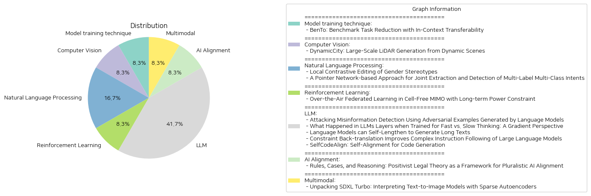

# Daily Artificial Intelligence Insights : Papers

## 🫧 Model training technique

**요약:**

보고서 요약:

1. 주제 추출:
   - 주요 연구 주제는 대형 언어 모델(LLMs)의 평가 작업량 감소와 관련이 있다.
   - 벤치마크 태스크의 가장 대표적인 하위 집합 식별을 위한 과제 전이성과 관련성의 중요성을 강조한다.
   - 인컨텍스트 학습(ICL)을 통해 태스크 간 전이성을 추정하는 효율적인 지표를 제안한다.

2. 공통 키워드 및 동향:
   - '대형 언어 모델', '태스크 전이성', '효율적인 평가', '인컨텍스트 학습', '훈련이 필요 없는 방식' 등의 키워드가 일관되게 등장한다.
   - 모델 평가의 효율성과 효과성을 개선하려는 지속적인 시도가 보인다.

3. 주요 사건 및 중요한 정보 요약:
   - LLM의 평가를 위한 대규모 벤치마크 태스크를 효율적으로 줄이는 방법을 제시한다.
   - 시설 위치 함수 최적화를 통해 태스크 전이성과 관련성을 고려하여 대표적 태스크를 식별한다.
   - 제안된 방법을 통해 최신 LLM 벤치마크에서 태스크 수를 5%로 줄이면서도 전체 벤치마크 대비 평가 차이를 4% 미만으로 유지할 수 있음을 실험적으로 입증했다.

4. 이벤트가 다양한 부문에 미치는 영향 분석:
   - 제안된 방법은 연구 및 산업 분야에서 모델 평가의 시간과 비용을 크게 절감할 수 있다.
   - LLM 개발 및 응용에 있어 효율적인 평가 프로세스를 제공함으로써 빠른 혁신 촉진이 예상된다.

5. 최종 요약 및 향후 개발 관찰:
   - 이 연구는 LLM의 평가 효율성을 크게 향상시킬 수 있는 가능성을 제공하며, 이는 더 복잡한 태스크나 환경에서의 모델 성능 평가에 대한 새로운 접근법의 문을 열 수 있다.
   - 향후, 이 방법이 다른 유형의 인공지능 모델이나 응용 프로그램에 어떻게 적용될 수 있는지에 대한 추가 연구가 기대된다.

**출처:**

 - BenTo: Benchmark Task Reduction with In-Context Transferability (https://deeplearn.org/arxiv/538614/bento:-benchmark-task-reduction-with-in-context-transferability)

## 🚀 Computer Vision

**요약:**

제목: 'DynamicCity: 동적 장면에서의 대규모 LiDAR 생성'

요약: 최근 LiDAR 장면 생성 기술이 빠르게 발전하고 있지만, 기존 방법들은 주로 정적이고 단일 프레임의 장면 생성에 집중하여, 실제 주행 환경의 본질적인 동적 특성을 간과하고 있다. 본 연구에서는 DynamicCity라는 새로운 4D LiDAR 생성 프레임워크를 소개하며, 이는 대규모의 고품질 LiDAR 장면을 생성하여 동적 환경의 시간적 변화를 포착할 수 있다. DynamicCity는 주로 두 가지 핵심 모델로 구성된다. 첫째, VAE 모델은 HexPlane이라는 압축된 4D 표현을 학습한다. 무작위의 평균화 작업 대신, DynamicCity는 새로운 Projection Module을 사용하여 4D LiDAR 특징을 효율적으로 여섯 개의 2D 특징 맵으로 압축하여 HexPlane을 구성, 이로 인해 HexPlane 적합 품질이 최대 12.56 mIoU 개선된다. 또한, Expansion & Squeeze 전략을 활용해 3D 특징 볼륨을 병렬로 재구성함으로써, 네트워크 훈련 효율성과 재구성 정확성을 각각 7.05 mIoU 개선, 훈련 속도 2.06배 증가, 70.84%의 메모리 감소를 달성한다. 둘째, DiT 기반 확산 모델은 HexPlane 생성에 사용된다. HexPlane를 DiT 생성에 적용 가능하도록 Padded Rollout Operation이 제안되어 여섯 개의 특징 평면을 정사각형 2D 특징 맵으로 재구성한다. 특히, 다양한 조건을 확산 또는 샘플링 과정에 도입하여 궤적 및 명령 기반 생성, 인페인팅, 레이아웃 조건부 생성 등 다용도의 4D 생성 응용을 지원한다. CarlaSC 및 Waymo 데이터셋에 대한 광범위한 실험을 통해 DynamicCity가 여러 지표에서 기존 최첨단 4D LiDAR 생성 방법을 현저히 능가한다는 것을 입증하였다. 추후 연구를 위한 코드가 공개될 예정이다.

주요 주제 및 테마: 동적 환경의 LiDAR 장면 생성, 4D LiDAR 프레임워크, VAE 모델, HexPlane 생성, 확산 모델, 네트워크 훈련 효율성, 동적 환경 시뮬레이션.

공통 키워드, 트렌드 및 패턴: LiDAR 기술 발전, 동적 환경 모델링, 4D 데이터 처리, 효율적인 데이터 압축 및 표현, 확산 모델의 활용, 자율주행 기술.

주요 이벤트 및 정보 요약: DynamicCity는 기존 LiDAR 생성 방법의 한계를 극복하고, 동적 환경의 시간적 변화까지 포착할 수 있는 새로운 접근 방식을 제시하였다. 이는 LiDAR 데이터의 4D 표현을 효과적으로 압축 및 생성함으로써 자율주행과 같은 다양한 응용 분야에 적용 가능성을 보여준다.

이벤트가 다양한 분야에 미치는 영향 분석: DynamicCity의 발전은 자율주행 차량 및 로봇 공학 분야에서 중요한 역할을 할 수 있으며, 동적 환경에서의 데이터 수집 및 분석 효율성을 높이는 데 기여할 수 있다. 이는 보다 안전하고 효율적인 자율주행 시스템 개발을 촉진하게 될 것이다.

최종 요약 및 결론: DynamicCity는 동적 환경 전반에 걸쳐 LiDAR 장면 생성 기술의 진보를 이루었으며, 향후 자율주행 및 동적 환경 연구에 있어 주요 시사점을 제공한다. 향후 개발을 주목해야 할 가능성으로는, 다양한 조건하의 LiDAR 시뮬레이션 및 실시간 데이터 처리 기술의 진화가 있을 것이다.

**출처:**

 - DynamicCity: Large-Scale LiDAR Generation from Dynamic Scenes (https://deeplearn.org/arxiv/540398/dynamiccity:-large-scale-lidar-generation-from-dynamic-scenes)

## 🎇 Natural Language Processing

**요약:**

보고서 요약:

1. **핵심 주제 및 테마 추출**:
   - 첫 번째 연구는 언어 모델(LM)에서 성 고정관념이 어떻게 매개변수에 나타나는지를 이해하고, 성별 고정관념과 연관된 가중치를 식별 및 수정하는 '지역 대비 편집' 방법을 소개합니다.
   - 두 번째 연구는 다중 라벨 다중 클래스 사용자의 의도를 효과적으로 검출 및 추출하기 위한 '포인터 네트워크 기반 접근법'을 제안하며, 복잡한 사용자 질의를 다루기 위한 멀티라벨 다중 클래스 의도 검출 데이터셋을 개발합니다.

2. **공통 키워드, 트렌드, 패턴 식별**:
   - 두 논문 모두 다국어 및 다양한 데이터 세트에서의 성능 및 편견 제어/검출을 중요시하며, 새로운 데이터셋의 중요성과 효율적인 모델 개선 방법론을 강조하고 있습니다.

3. **주요 사건 및 핵심 정보 요약**:
   - 첫 번째 연구는 성별 편견이 LM의 매개변수 공간에 어떻게 나타나는지 더 깊이 이해하게 하며, 특정 가중치의 편집을 통해 모델에 내재된 성 고정관념을 효과적으로 수정하는 방법론을 개발합니다.
   - 두 번째 연구는 복잡한 사용자 질의에 대해 다중 의도를 검출 및 추출할 수 있는 포인터 네트워크 기반의 새로운 아키텍처(MCMCID)를 제시하고, 멀티라벨 다중 의도 검출 데이터셋을 구성하여 다국어 의도 검출에서의 성능을 향상시킵니다.

4. **이벤트의 영향 분석**:
   - 첫 번째 연구는 언어 모델의 성능과 안전성에 잠재적으로 해를 기울일 수 있는 성 고정관념 편향을 효과적으로 제어하고자 합니다. 이를 통해 더욱 안전한 언어 기술 개발이 가능해질 것입니다.
   - 두 번째 연구는 사용자 질의 해석의 정확성을 강화하고 다국어 대화 시스템의 발전에 기여하여, 다양한 언어와 문화에서 더욱 효과적인 대화 시스템을 지원할 수 있는 기반을 마련합니다.

5. **최종 요약 및 미래 발전 가능성**:
   - 이 두 연구는 언어 모델과 대화 시스템의 사회적, 기술적 측면에서 중요한 진전을 가져왔고, 향후 다양한 데이터셋 및 시스템에서의 공정성과 정확성 향상을 의미합니다. '지역 대비 편집'과 '포인터 네트워크 기반 구조'는 미래의 AI 및 NLP 시스템의 편향 제어와 다중 의도 검출에 중요한 도구로 기능을 할 것입니다. 특히 다국어 및 다문화적 환경에서 더욱 발전하고 세분된 모델을 구축하는 방향으로 발전될 가능성이 큽니다.

**출처:**

 - Local Contrastive Editing of Gender Stereotypes (https://deeplearn.org/arxiv/540617/local-contrastive-editing-of-gender-stereotypes)
 - A Pointer Network-based Approach for Joint Extraction and Detection of Multi-Label Multi-Class Intents (http://arxiv.org/abs/2410.22476v1)

## 👽 Reinforcement Learning

**요약:**

1. 주요 주제 및 테마:
   - 제목에서 'Over-the-Air Federated Learning'과 'Cell-Free MIMO'의 접근 방식이 강조됨.
   - 무선 네트워크와 인공지능의 결합에서 연합 학습의 중요성을 언급.
   - 본문에서는 Over-the-Air Federated Learning과 같은 새로운 기술이 중장기 전력 제약하에서 효율적으로 작동하는 방법에 초점을 맞추고 있음.

2. 공통 키워드, 트렌드 및 패턴:
   - 'Over-the-Air Federated Learning', 'Cell-Free MIMO', '전력 제약', 'Lyapunov 최적화', '분산 컴퓨팅' 등이 주된 키워드로 나타남.
   - 인공지능과 무선 통신 기술의 결합을 통한 새로운 학습 및 최적화 방식에 대한 연구가 지속적으로 증가하는 추세.

3. 주요 사건 및 핵심 정보 요약:
   - 논문은 Cell-Free MIMO 시스템에서 Over-the-Air Federated Learning의 오류 한계를 계산하고 최적화를 위한 문제를 공식화.
   - 전력 제어 및 빔 형성을 통한 최적화로 최적화 격차를 최소화하는 MOP-LOFPC 알고리즘을 소개.
   - Lyapunov 최적화를 사용하여 오랜 시간에 걸친 제한을 분리하고, 인과 채널 상태 정보를 활용.

4. 각 분야에 미치는 영향 분석:
   - 무선 네트워크와 AI의 융합을 통해 데이터 전송 및 학습 모델의 효율이 크게 향상될 가능성이 큼.
   - 장기적인 전력 소비와 측정의 정확성 사이의 균형을 조절하여, 무선 통신 네트워크의 지속 가능성과 성능을 동시에 개선.

5. 최종 통합 요약 및 결론:
   - Over-the-Air Federated Learning과 같은 고도화된 통신 기술을 적용함으로써 AI 기반 네트워크의 효율성을 높일 수 있는 가능성을 제안.
   - MOP-LOFPC 알고리즘은 기존 방법에 비해 학습 모델의 손실과 전력 제약의 규정 준수 간의 유연성을 제공, 더욱 효율적인 학습 환경을 구축.
   - 미래 개발을 주시할 부분: 전력 효율성을 더욱 강화하고 인공지능 기반 크라우드 소싱 데이터 학습 모델의 안정성을 보장하는 기술의 계속된 발전.

**출처:**

 - Over-the-Air Federated Learning in Cell-Free MIMO with Long-term Power Constraint (https://deeplearn.org/arxiv/540628/over-the-air-federated-learning-in-cell-free-mimo-with-long-term-power-constraint)

## ✈️ LLM

**요약:**

1. 각 논문에서 추출된 주요 주제와 테마:
   - '언어 모델을 통한 적대적 예제 생성' 논문에서는 저신뢰성 콘텐츠 탐지 알고리즘을 테스트하기 위한 적대적 예제 생성의 중요성을 강조하며, 콘텐츠 모더레이션의 시나리오를 시뮬레이션하여 현실적인 쿼리 한계를 설정하는 방법을 탐구한다.
   - '빠른 사고 대 느린 사고 관점에서 LLM 계층' 논문은 LLM의 계층 내에서의 학습 패턴과 이에 대한 영향력을 조사하며 빠른 사고와 느린 사고가 계층별 그래디언트에 미치는 영향을 분석한다.
   - '자체적으로 긴 텍스트 생성하는 언어 모델' 논문에서는 스타일 전환 같은 방식을 활용하며, LLM의 장문 생성 능력을 개선하기 위한 새로운 학습 프레임워크를 제안한다.
   - '복잡한 지시문 수행을 개선하는 제약 역번역' 논문에서는 복잡한 형식과 제약을 따르는 데 어려움을 겪는 LLM에 대해 제약 역번역 기법을 소개하여 고품질의 복잡한 지시문-응답 데이터세트를 생성하는 방법을 설명한다.
   - '코드 생성용 자체 정렬' 논문에서는 SelfCodeAlign이라는 투명하고 허가된 방법을 도입하여 코드 생성 LLM의 성능을 개선하고 이를 통한 새로운 데이터세트 생성을 탐구한다.

2. 논문 간의 공통된 키워드, 트렌드 및 패턴 식별:
   - 언어 모델의 적응과 성능 향상에 집중하고 있으며, 특히 복잡한 작업에서의 처리능력을 높이는 방법에 강한 관심이 있다.
   - 데이터 세트의 품질 향상을 통한 학습 성과 증대를 중요시하며, 이를 위한 뉴럴 네트워크의 특정 조정 기법을 탐구한다.
   - 균형있는 장문의 생성과 지시문 수행 능력을 개선하는 새로운 학습 프레임워크의 필요성을 제기한다.

3. 주요 이벤트 및 중요한 정보 요약:
   - TREPAT은 적대적 예제 생성에서 성공적인 시나리오 구축을 통해 기존 분류기보다 우수한 성능을 발휘했다.
   - LLM의 계층 내 빠른 사고와 느린 사고의 차이를 통해 느린 사고가 더 안정적인 학습을 제공한다는 결과를 얻었다.
   - Self-Lengthen은 LLM의 성능을 장문 생성에 초점을 두어 효율적으로 개선하는 독창적인 프레임워크다.
   - 복잡한 지시문을 따르는 능력을 향상시키기 위해 제약 역번역을 통해 생성된 고품질 데이터세트인 CRAB가 소개되었다.
   - SelfCodeAlign은 코드 생성 LLM에서 투명한 방법으로 성능을 극대화하는 데 성공했다.

4. 다양한 분야에 대한 이러한 사건들의 영향 분석:
   - 언어 모델을 통한 저신뢰성 콘텐츠 탐지 정확성 향상은 디지털 플랫폼의 신뢰성을 향상시키고 뉴스 및 정보의 품질 개선에 기여할 수 있다.
   - 빠른 사고와 느린 사고의 이해를 통해 정보 처리 방식의 효율성을 높이고 인공지능 시스템 설계에 큰 영향을 미칠 수 있다.
   - 긴 텍스트를 생성할 수 있는 능력은 창의적 콘텐츠 생성과 교육 도구 개발 등 다양한 분야에서의 활용 가능성을 넓힌다.
   - 복잡한 지시문 수행 능력 향상은 AI의 적용 범위를 확대하고 더욱 복잡한 사용자 인터페이스를 관리할 능력을 제공한다.
   - 자체 정렬된 코드 생성 방법은 소프트웨어 개발 및 자동화를 더욱 효과적으로 지원할 수 있다.

5. 최종 요약 및 미래 발전 가능성:
   - 논문들은 언어 모델의 강화와 특화된 학습 방법을 통해 다양한 분야에서의 적용 범위를 확장하고, 성능을 지속적으로 개선하는 경향을 보여준다.
   - 이러한 연구와 성과는 인공지능의 안정성, 처리 효율성, 데이터 정확성 등의 주요 문제를 해결하는 데 중요한 이정표로 작용할 것이다.
   - 미래에는 다양한 환경에서의 실질적인 적용 가능성을 높이기 위해 이러한 모델의 확장성과 융통성에 대한 연구가 지속적으로 필요할 것으로 보인다.

**출처:**

 - Attacking Misinformation Detection Using Adversarial Examples Generated by Language Models (https://deeplearn.org/arxiv/541784/attacking-misinformation-detection-using-adversarial-examples-generated-by-language-models)
 - What Happened in LLMs Layers when Trained for Fast vs. Slow Thinking: A Gradient Perspective (http://arxiv.org/abs/2410.23743v1)
 - Language Models can Self-Lengthen to Generate Long Texts (http://arxiv.org/abs/2410.23933v1)
 - Constraint Back-translation Improves Complex Instruction Following of Large Language Models (http://arxiv.org/abs/2410.24175v1)
 - SelfCodeAlign: Self-Alignment for Code Generation (http://arxiv.org/abs/2410.24198v1)

## 🌞 AI Alignment

**요약:**

보고서 요약:

1. 주요 주제와 테마 추출:
   - 다원주의적 AI 정렬
   - 규칙과 사례의 상호작용
   - 법 이론과 AI의 융합
   - 불명확한 원칙의 구체화 (예: 유용성, 공정성)

2. 공통 키워드, 트렌드 및 패턴:
   - 다원주의, 사례 적용, 민주적 권위, 구체적 의미 합의
   - 가치의 불일치 허용

3. 주요 사건 및 중요 정보 요약:
   - 법 이론의 규칙과 사례의 상호작용이 AI 정렬 문제 해결에 도움이 될 수 있음.
   - 민주적 권위에 의해 제정된 일반 규칙이 구체적 적용을 통해 시간이 지남에 따라 구체화됨.
   - 규칙에 대한 사례 연구 및 적용이 보다 다원주의적인 AI 정렬을 촉진할 수 있음.

4. 이러한 사건이 다양한 부문에 미치는 영향 분석:
   - AI 연구 및 개발: 법률의 사례 적용 방식을 AI 정렬에 도입함으로써 보다 포괄적이고 다원주의적인 AI 시스템 개발 가능성.
   - 법률 및 규제 부문: 법 이론이 AI 윤리 및 규제 프레임워크에 기여할 수 있는 가능성.
   - 민주적 절차: 다양한 관점과 가치를 포함시켜 민주적 정렬 프로세스 개선.

5. 통합된 요약, 결론 및 미래의 발전 가능성:
   - 법 이론은 AI 정렬의 복잡한 문제를 해결하기 위한 유용한 방법론적 틀을 제공할 수 있음.
   - 미래에는 AI 정렬에서 더욱 민주적이고 포용적인 방법이 필요하며, 이는 다양한 가치와 관점을 존중하는 시스템을 목표로 삼아야 함.
   - 규칙과 사례의 상호작용을 촉진하는 기술 발전이 기대됨.

결론적으로, 법의 다원주의 적용 방식은 AI의 정렬 문제를 해결하는 데 중요한 통찰을 제공하며, 이는 다양한 분야에 혁신을 가져올 잠재력을 가지고 있다. 앞으로도 이러한 접근 방식을 통해 어떻게 AI가 사회의 다양한 필요를 보다 잘 충족할 수 있을 것인지 주시해야 할 것이다.

**출처:**

 - Rules, Cases, and Reasoning: Positivist Legal Theory as a Framework for Pluralistic AI Alignment (https://deeplearn.org/arxiv/541785/rules,-cases,-and-reasoning:-positivist-legal-theory-as-a-framework-for-pluralistic-ai-alignment)

## 🥳 Multimodal

**요약:**

1. 주요 주제 및 테마 추출:
   - 희소 자동인코더(SAE)의 활용
   - 역공학 및 텍스트에서 이미지로 변환하는 모델 분석
   - SDXL Turbo 모델의 내부 작동 이해

2. 공통 키워드, 트렌드 및 패턴:
   - 희소 표현, 해석 가능한 특징, 생성 과정의 인과적 영향
   - SDXL Turbo의 디퓨전 모델 
   - 트랜스포머 블록의 특수화 

3. 각 논문의 주요 사건 및 핵심 정보 요약:
   - 논문은 SDXL Turbo의 역공학을 통해 텍스트에서 이미지로의 변환 모델에 희소 자동인코더(SAE)를 적용하는 방법을 제안합니다.
   - 연구에서는 SAE가 학습한 특징들이 해석 가능하며, 이미지 생성 과정에 인과적으로 영향을 미치고 각 트랜스포머 블록의 특수화를 드러낼 수 있음을 발견했습니다.
   - 특히, 연구는 이미지 구성, 지역 세부사항, 색상 및 스타일을 처리하는 각기 다른 블록의 역할을 밝혔습니다.

4. 다양한 분야에 미치는 영향 분석:
   - SDXL Turbo와 같은 생성적 텍스트-이미지 모델에 대한 심층 이해 제공: 이는 보다 정교한 이미지 생성 및 이를 이용한 다양한 응용 분야에서의 활용을 통한 기술 혁신을 가능케 할 수 있습니다.
   - SAE의 해석 가능한 특징 학습은 비주얼 도메인뿐만 아니라 다른 대규모 언어 모델에도 적용 가능성을 제시합니다.

5. 최종 종합 요약 및 결론 및 잠재적 미래 개발:
   - SDXL Turbo의 내부 구조에 대한 심층 연구는 생성적 AI 모델의 투명성과 조작 가능성을 높여 활용 범위를 넓힐 수 있습니다.
   - 향후 연구는 비슷한 방법론을 다른 생성적 AI 모델 및 도메인에 확장 적용함으로써 기술 발전의 지평을 넓히는 데 집중할 수 있습니다.
   - SAE를 통한 해석 가능한 특징 학습은 AI 모델의 예측 가능성 및 안전성을 향상시키고, 이는 다양한 산업 분야에서의 활용 가능성을 증대시킬 것입니다.

**출처:**

 - Unpacking SDXL Turbo: Interpreting Text-to-Image Models with Sparse Autoencoders (http://arxiv.org/abs/2410.22366v1)

