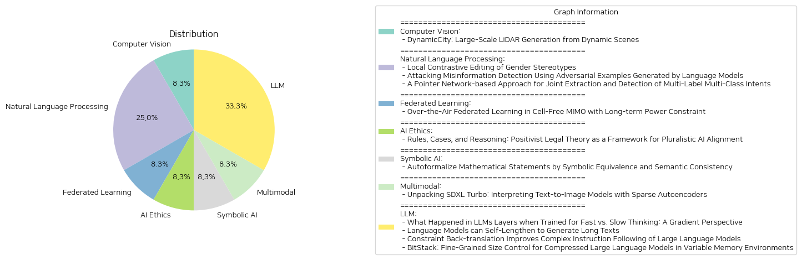

# Daily Artificial Intelligence Insights : Papers

## ✈️ Computer Vision

**요약:**

### 종합 요약 보고서

1. **주요 주제 및 테마 추출**

   **논문 제목: 'DynamicCity: Dynamic Scenes에서의 대규모 LiDAR 생성'**

   - 4D LiDAR 신장 생성
   - 동적 환경의 시간적 진화 포착
   - HexPlane과 DiT 기반의 생성 모델
   - 효율적 네트워크 학습과 재구성 정확도 향상

2. **공통 키워드, 트렌드 및 패턴 식별**

   - 동적 시나리오를 위한 LiDAR 생성
   - 4D 공간 표현 및 HexPlane 조작
   - 다양하고 다용도의 4D 생성 응용 프로그램
   - 효율성 및 성능 향상 (네트워크 학습 속도, 메모리 사용량 감소 등)

3. **주요 이벤트 및 핵심 정보 요약**

   이 연구는 동적 환경을 반영할 수 있는 고품질의 대규모 LiDAR 장면을 효과적으로 생성할 수 있는 새로운 4D LiDAR 생성 프레임워크인 'DynamicCity'를 도입합니다. DynamicCity는 정적인 단일 프레임 생성에 중점을 둔 기존 방법을 뛰어넘어, 두 가지 주요 모델을 활용하여 4D 표현을 획기적으로 개선하였습니다. 첫 번째는 VAE 모델로, HexPlane이라는 4D 표현을 학습하며 다양한 전략을 통해 메모리 사용량 감소와 네트워크 학습 속도 증가를 실현합니다. 두 번째는 DiT 기반 확산 모델로, 다양한 조건을 도입하여 다양한 4D 생성 응용 프로그램을 지원합니다.

4. **이벤트가 다양한 분야에 미치는 영향 분석**

   - **자동차 및 자율주행**: 동적 장면에서 정확하고 효율적인 LiDAR 데이터 생성을 통해 차량의 자율주행 성능이 크게 개선될 수 있습니다.
   - **디지털 트원**: 대규모 고품질 LiDAR 생성은 더 정교한 디지털 트웬 모델을 가능하게 합니다.
   - **공공 안전**: 교통 상황 모니터링 등 공공 안전 목적에 활용할 수 있는 환경 시뮬레이션에서도 유용할 것입니다.

5. **최종 종합 요약 및 미래 발전 가능성**

   DynamicCity는 동적 시나리오에서의 LiDAR 장면 생성에 있어 실질적인 진전을 일으켰음을 보여줍니다. 효율적인 데이터 처리와 다양한 상황을 반영할 수 있는 능력으로 인해, 이 기술은 향후 자율주행차, 스마트 시티 설계, 로봇 공학 등 다양한 분야에서 응용될 전망입니다. 특히, 동적이고 복잡한 환경에서도 높은 품질의 데이터를 생성할 수 있는 기술의 발전은 차세대 자율 시스템 발전의 중요한 요소로 자리 잡을 것으로 기대됩니다. 앞으로도 이 기술이 가져올 혁신적 발전을 지속적으로 주목할 필요가 있습니다.

**출처:**

 - DynamicCity: Large-Scale LiDAR Generation from Dynamic Scenes (https://deeplearn.org/arxiv/540398/dynamiccity:-large-scale-lidar-generation-from-dynamic-scenes)

## 🩵 Natural Language Processing

**요약:**

요약 보고서:

1. 핵심 주제 및 테마 추출:
    - 첫 번째 논문은 '성별 고정관념'을 다루고 있으며, 특히 언어 모델(LMs)에 내재된 성별 고정관념 편향을 수정하는 방법에 초점을 맞추고 있습니다.
    - 두 번째 논문은 '부정확한 정보 탐지'를 다루며, 특히 혐오 발언, 허위 주장, 루머 등의 콘텐츠를 분류하는 알고리즘의 내구성을 테스트하기 위한 적대적 예제를 생성하는 방법을 설명합니다.
    - 세 번째 논문은 '다중 레이블 다중 클래스 의도 탐지'를 다뤄, 복잡한 사용자 쿼리를 해석하고 여러 의도를 탐지하는 시스템을 개발하는 데 중점을 두고 있습니다.

2. 공통 키워드, 트렌드 및 패턴 식별:
    - 세 논문 모두 자연어 처리(NLP) 및 언어 모델에 대한 공통적인 관심을 보입니다.
    - 고정관념 편향과 부정확한 정보, 복잡한 사용자 쿼리 탐색을 위한 머신러닝 기반 접근방식이 강조됩니다.
    - 모든 연구는 모델의 내구성, 정확성 및 성능 향상을 위한 새로운 시스템이나 전략을 제안하고 있습니다.

3. 주요 사건과 중요한 정보 요약:
    - 첫 번째 논문에서는 로컬 대조 편집을 통해 특정 모델의 성별 고정관념 관련 가중치를 식별하고 수정하여 편향을 제어하는 방법을 제시합니다.
    - 두 번째 논문에서는 큰 언어 모델을 사용하여 의미를 보존하는 재구성 예제를 생성하고, 이를 통해 저신뢰 콘텐츠 탐지 시스템의 약점을 파악하는 방법을 설명합니다.
    - 세 번째 논문에서는 다중 자위성을 가진 쿼리로부터 의도 스팬을 추출하고 다중 언어 및 다중 레이블 의도를 탐지할 수 있는 새로운 시스템을 개발, 이를 위한 데이터셋도 제안합니다.

4. 이러한 사건이 다양한 분야에 미치는 영향 분석:
    - 성별 고정관념 및 편향 통제는 안전한 언어 기술을 발전시키는 데 기여할 수 있습니다.
    - 부정확한 정보 탐지 시스템의 강화는 콘텐츠 검열 및 사실 확인의 신뢰성을 높이는 데 도움을 줄 수 있습니다.
    - 다중 의도 탐지 연구는 고객 서비스, 대화형 AI 및 번역 기계 등 다양한 작업 중심 시스템의 효율성을 향상시킬 수 있습니다.

5. 최종 종합 요약 및 결론, 향후 주목할 발전:
    - 세 논문은 NLP 모델의 편향 및 내구성을 탐구하면서 상당히 혁신적인 방법을 제안하고 있습니다.
    - 향후 연구는 이들 방법의 실적용을 확대하고, 더욱 다양한 데이터와 환경에서의 테스트를 통해 모델의 한계점을 보완할 필요가 있습니다.
    - 특히 로컬 대조 편집 및 멀티랭기지 지원을 강화한 MLMCID 시스템은 NLP 분야의 이정표가 될 수도 있습니다.

**출처:**

 - Local Contrastive Editing of Gender Stereotypes (https://deeplearn.org/arxiv/540617/local-contrastive-editing-of-gender-stereotypes)
 - Attacking Misinformation Detection Using Adversarial Examples Generated by Language Models (https://deeplearn.org/arxiv/541784/attacking-misinformation-detection-using-adversarial-examples-generated-by-language-models)
 - A Pointer Network-based Approach for Joint Extraction and Detection of Multi-Label Multi-Class Intents (http://arxiv.org/abs/2410.22476v1)

## 💙 Federated Learning

**요약:**

제목: '장기 전력 제약을 가진 셀-프리 MIMO에서의 Over-the-Air 연합 학습'

요약: 인공지능을 지원하는 무선 네트워크는 독특한 전송 및 분산 컴퓨팅 특성으로 인해 Over-the-Air 연합 학습이 중요한 응용 프로그램으로 부상하면서 큰 주목을 받고 있습니다. 이 논문은 셀-프리 MIMO 시스템에서 Over-the-Air 연합 학습의 오류 경계를 도출하고, 전력 제어 및 빔포밍의 공동 최적화를 통해 최적 해법의 격차를 최소화하는 최적화 문제를 공식화합니다. 우리는 라운드를 초월하는 장기 제약을 분리하기 위해 Lyapunov 최적화를 사용하는 MOP-LOFPC 알고리즘을 소개하며, 이는 인과적 채널 상태 정보만을 필요로 합니다. 실험 결과, MOP-LOFPC가 기존의 기준선들과 비교해 모델 훈련 손실과 장기 전력 제약 준수 사이에서 더 나은, 그리고 더 유연한 타협을 이루는 것으로 나타났습니다.

중요 정보 및 영향 분석: 이 연구는 무선 네트워크와 인공지능 교차 분야에서 Over-the-Air 연합 학습의 성능을 향상시키기 위한 방안을 제시하며, 특히 전력 관리와 빔포밍 최적화에서의 혁신을 통해 장기적으로 보다 효율적인 시스템 운영을 가능하게 합니다. 이러한 접근은 통신 분야, 인공지능 모델 교육 효율 개선, 그리고 에너지 절약 측면에서 긍정적인 영향을 미칠 수 있습니다.

결론 및 미래 발전: MOP-LOFPC 알고리즘을 통한 장기 전력 제약 관리의 개선은 무선 네트워크의 효율성을 높이며, 연합 학습의 정확도를 유지하는데 기여합니다. 앞으로, 이러한 연구는 인공지능과 무선 네트워크의 결합이 변화하는 환경에서 어떻게 적응하고 발전할지를 이해하는 데 중요한 단계가 될 것입니다. 또한, 본 연구는 지속 가능한 에너지원 관리와 같은 다른 분야에서도 유사한 최적화 문제에 해결의 실마리를 제공할 수 있을 것으로 보입니다.

**출처:**

 - Over-the-Air Federated Learning in Cell-Free MIMO with Long-term Power Constraint (https://deeplearn.org/arxiv/540628/over-the-air-federated-learning-in-cell-free-mimo-with-long-term-power-constraint)

## 🌿 AI Ethics

**요약:**

1. 주요 주제 및 테마 추출:
   - 법 이론과 AI 정렬
   - 다양한 가치와 관점의 포용
   - 민주적 권위의 규칙과 사례 상호 작용

2. 공통 키워드, 트렌드, 패턴:
   - 정렬 문제: 다원주의, 명세화
   - 법 이론의 적용: 규칙과 사례 통한 해결
   - 민주적 프로세스와 AI 활용;

3. 주요 사건 및 핵심 정보 요약:
   - 법 이론은 다원주의 및 명세화 문제 해결을 위해 AI 정렬 연구에 적용될 수 있다.
   - 모호한 원칙들, 예를 들어 도움과 공정성 등의 가치를 구체적으로 명세화하고, 다양한 관점을 포용할 필요가 있다.
   - 법안의 일반 규칙이 구체적 적용을 통해 실질적 의미로 수렴되는 과정이 설명됐다.

4. 이러한 사건이 다양한 부문에 미치는 영향 분석:
   - AI 연구 및 개발 분야: 법 이론을 통한 AI 정렬 방식 개선 가능성 확대
   - 민주적 질서 확립 및 시민권 확보: 다양한 관점의 포용과 명확한 규칙 설정
   - 기술 윤리 및 사회적 이슈 대응: 가치 투명성 및 공정성 확보 가능성 증가

5. 최종 요약과 결론 및 향후 주목해야 할 발전 사항:
   - 법 이론은 AI의 구조적 모호성을 해결하고 민주적 절차의 정합성을 높이는 데 유용하다.
   - 다원주의적 정렬 방법론을 통해 사회적 합의를 강화할 수 있는 길이 열렸다.
   - 향후, AI 개발 과정에서 규칙과 사례를 결합해 민주적, 포괄적 접근을 지속적으로 연구 및 개선해 나갈 필요가 있다.

**출처:**

 - Rules, Cases, and Reasoning: Positivist Legal Theory as a Framework for Pluralistic AI Alignment (https://deeplearn.org/arxiv/541785/rules,-cases,-and-reasoning:-positivist-legal-theory-as-a-framework-for-pluralistic-ai-alignment)

## 👽 Symbolic AI

**요약:**

보고서 요약:

1. 주요 주제 및 테마 추출:
   - 자동 형식화(Autoformalization): 자연어로 된 수학적 설명을 형식 언어로 자동 변환하는 작업.
   - 대규모 언어 모델(LLMs)의 발전: 수학 문제를 형식화하는 데 있어 모델의 유망한 성능.
   - 심볼릭 동등성과 의미적 일관성을 통한 향상된 형식화 정확성.

2. 공통 키워드, 트렌드 및 패턴:
   - LLMs, 자동 형식화, 수학 문제, 정확성 개선, 심볼릭 동등성, 의미적 일관성, 자동 정리 증명기, 임베딩 유사성.
   - 자연어 처리와 형식 언어 변환 기술의 발전이 주요 흐름.

3. 주요 이벤트 및 중요 정보 요약:
   - 자동 형식화 과정에서 LLM이 생성한 형식화의 정확성 격차가 존재함.
   - 여러 후보 성과물 중에서 최고의 성과물을 선택하기 위한 새로운 프레임워크가 도입됨.
   - 심볼릭 동등성: 자동 정리 증명기를 사용하여 논리적 일관성을 평가.
   - 의미적 일관성: 원문의 의미 보존을 확인하기 위해 임베딩 유사성을 계산.
   - MATH와 miniF2F 데이터셋에 대한 실험을 통해 접근법의 효과가 입증됨.

4. 이들 사건의 다양한 분야에 대한 영향 분석:
   - 수학 분야: 복잡한 수학 문제의 자동 형식화 가능성 확대 및 문제 해결의 효율성 증대.
   - 컴퓨터 과학 및 인공지능 분야: 자연어 처리와 자동화 기술의 발전을 통한 새로운 알고리즘 및 방법론 개발 가능성.

5. 최종 통합 요약 및 향후 발전 가능성:
   - 자동 형식화는 수학 외에도 다른 전문 분야의 자동 변환 가능성을 증가시킬 잠재력을 가짐.
   - LLMs와 같은 기술이 교육, 연구 및 산업 응용에 큰 영향을 미칠 것으로 예상됨.
   - 향후, 이러한 기술의 정확성과 효율성을 더욱 강화하는 방법들이 연구될 것으로 전망됨. 

이 보고서는 자동 형식화 기술의 발전이 수학적 문제에 갖는 중요성과 다양한 기술 및 산업 분야에 미치는 잠재적 영향을 강조하며, 이 분야의 지속적인 연구와 혁신이 필요함을 시사합니다.

**출처:**

 - Autoformalize Mathematical Statements by Symbolic Equivalence and Semantic Consistency (https://deeplearn.org/arxiv/541786/autoformalize-mathematical-statements-by-symbolic-equivalence-and-semantic-consistency)

## 🎠 Multimodal

**요약:**

**종합 요약 보고서**

1. **주요 주제 및 테마 추출**:
   - SDXL Turbo와 같은 텍스트-이미지 변환 모델 해석
   - 희소 오토인코더(SAEs)를 활용한 중간 표현 해석
   - 변환자 블록이 SDXL Turbo의 디노이징 U-net에서 수행한 업데이트 분석
   
2. **공통 키워드, 경향 및 패턴 식별**:
   - 희소 오토인코더(SAE)
   - 텍스트-이미지 변환 모델
   - 중간 표현의 해석 가능성
   - 변환자의 블록별 전문성

3. **주요 사건 및 정보 요약**:
   - 연구는 희소 오토인코더를 통해 SDXL Turbo와 같은 텍스트-이미지 모델의 학습 가능한 해석적 특징을 탐색.
   - SAEs가 학습한 특징들은 이미지 생성 과정에 인과적으로 영향을 미치며, 블록 간의 전문화를 드러냄.
   - 특정 블록은 이미지 구성, 디테일 추가, 색상, 조명, 스타일 담당.

4. **이벤트가 여러 분야에 미치는 영향 분석**:
   - 텍스트-이미지 생성 모델 내부 이해 증진
   - 시각적 도메인에서 해석 가능한 특징 학습을 통한 잠재력 제시
   - 모델의 내부 메커니즘 개선을 통한 생성 AI 기술의 발전

5. **최종 종합 요약 및 결론**:
   이 연구는 SDXL Turbo와 같은 텍스트-이미지 변환 모델을 보다 잘 이해하기 위한 중요한 첫 단계로서, SAEs가 시각적 도메인에서 학습될 수 있는 특징의 잠재력을 보여준다. 특히, 이미지 생성 과정에서 블록들이 각각의 역할을 전문적으로 수행함을 밝혀내며, 이러한 분석 방법론은 향후 모델 설계와 AI의 해석 가능성을 개선할 수 있는 방향성을 제시한다. 앞으로 텍스트-이미지 변환에 대한 심층적이고 해석 가능한 연구가 더욱 중요하게 부각될 것으로 예상된다.

**출처:**

 - Unpacking SDXL Turbo: Interpreting Text-to-Image Models with Sparse Autoencoders (http://arxiv.org/abs/2410.22366v1)

## 🎇 LLM

**요약:**

종합 보고서:

1. 주요 주제 및 테마 추출:
   - 'What Happened in LLMs Layers when Trained for Fast vs. Slow Thinking: A Gradient Perspective': LLM(대규모 언어 모델) 훈련 시 빠른 사고와 느린 사고의 차이를 계층별 기울기 관점에서 분석. CoT(Chain of Thoughts)와 프로세스 혁신의 영향에 주목.
   - 'Language Models can Self-Lengthen to Generate Long Texts': LLM의 장문 생성 능력을 향상시키기 위한 Self-Lengthen이라는 혁신적이고 반복적인 훈련 프레임워크 제안.
   - 'Constraint Back-translation Improves Complex Instruction Following of Large Language Models': LLM이 복잡한 지시사항을 잘 따르기 위한 제한 조건 역번역 기법 제안.
   - 'BitStack: Fine-Grained Size Control for Compressed Large Language Models in Variable Memory Environments': LLM의 효율적 메모리 관리를 위한 훈련이 필요 없는 BitStack 툴 개발 소개.

2. 공통 키워드, 트렌드 및 패턴:
   각 논문은 LLM의 성능 향상을 목표로 하며, 효율성과 정확성을 높이는 다양한 접근법을 제안하고 있다. 주로 데이터 처리, 훈련 기법, 메모리 관리 등에서의 혁신적 방법들을 제시하고 있으며, 이를 통해 LLM의 실제 활용성을 높이고자 한다.

3. 중요 사건 및 핵심 정보 요약:
   - 빠른 사고와 느린 사고의 훈련에서는 느린 사고(세부 CoT)가 기울기의 안정성을 제공하여 학습의 일관성을 강화시킨다는 결과를 도출했다.
   - Self-Lengthen 프레임워크를 통해 LLM이 점진적으로 장문을 생성하도록 훈련되는 과정을 설명하고, 기존 방법보다 개선된 성과를 보였음을 검증하였다.
   - 제한 조건 역번역 기법을 통해 고품질의 복잡한 지시-응답 데이터셋(CRAB)을 생성하여 여러 LLM의 복잡한 지시 이행 능력을 향상시켰다.
   - BitStack은 메모리 사용과 모델 성능 간의 균형을 맞추기 위한 혁신적인 방법으로서 각종 환경에서의 LLM 배포에 유리함을 보였다.

4. 이러한 사건들의 다양한 부문에 미치는 영향 분석:
   연구들은 LLM을 활용한 응용 프로그램의 효율성을 극대화하고자 한다. 빠른 데이터 처리와 효율적인 자원 관리가 요구되는 다양한 분야에서 LLM의 적용 가능성이 증가하고 있으며, 특히 교육, 의료 및 자동화 산업에서 긍정적인 영향을 미칠 전망이다.

5. 결론 및 앞으로 주목할 만한 발전:
   종합적으로, LLM 훈련 및 활용의 최적화에 관한 연구들은 다양한 기술적 장벽을 극복하기 위해 새로운 접근법을 제시하고 있다. 이러한 연구들은 미래 개발자들이 LLM의 잠재력을 완전히 발휘할 수 있는 기반을 마련하며, 지속적인 발전을 통해 인공지능 분야의 혁신을 가속화할 것이다. 앞으로 특히 모델의 확장성 및 메모리 효율성을 높이는 방향으로 연구들이 더욱 활발히 진행될 것으로 예상된다.

**출처:**

 - What Happened in LLMs Layers when Trained for Fast vs. Slow Thinking: A Gradient Perspective (http://arxiv.org/abs/2410.23743v1)
 - Language Models can Self-Lengthen to Generate Long Texts (http://arxiv.org/abs/2410.23933v1)
 - Constraint Back-translation Improves Complex Instruction Following of Large Language Models (http://arxiv.org/abs/2410.24175v1)
 - BitStack: Fine-Grained Size Control for Compressed Large Language Models in Variable Memory Environments (http://arxiv.org/abs/2410.23918v1)

