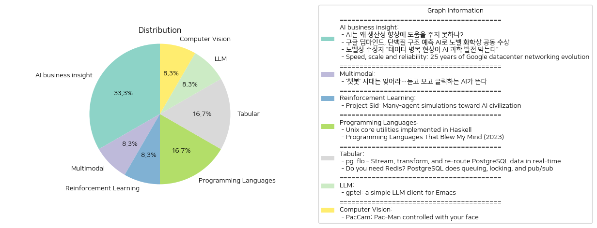

# Daily Artificial Intelligence Insights : News

## ☀️ AI business insight

**요약:**

1. **주요 테마**:
   - 인공지능(AI)의 발전과 현재 상태: AI 기술의 혁신이 기대되지만, 생산성 향상에 직접적인 기여를 하려면 개선이 필요함.
   - AI의 과학적 응용: 구글 딥마인드가 AI를 통해 단백질 구조 예측 문제를 해결하여 노벨 화학상을 수상함.
   - 데이터의 중요성: AI 발전에 있어 고품질 데이터의 필요성 및 데이터 병목 현상이 AI 과학 발전을 저해한다는 점.
   - 기술 인프라 발전: 구글의 데이터센터 네트워크 발전이 거대한 데이터와 AI 학습 인프라를 지원하는 역할.

2. **주요 사건**:
   - AI의 생산성 면에서의 한계와 필요한 개선 사항 논의.
   - 구글 딥마인드의 단백질 구조 예측을 통한 노벨 화학상 수상.
   - AI 과학 발전의 데이터 병목 현상에 대한 노벨상 수상자의 지적.
   - 구글의 네트워크 인프라 진화 및 높은 성능 지원.

3. **영향 분석**:
   - 경제: AI 기술의 발전은 생산성 향상 및 산업 혁신을 이끌 것으로 기대되지만, 그 효과를 극대화하기 위해서는 데이터와 알고리즘의 개선이 필요.
   - 과학: AI가 단백질 구조 예측 문제를 해결하는 데 유용하게 사용됨으로써 생명과학 분야의 획기적인 발전이 예상됨.
   - 기술 발전: 구글의 데이터센터 네트워크 발전이 다양한 서비스와 대규모 AI 모델 학습의 효율성을 크게 개선.
   - 사회: AI 및 데이터 기술의 발전이 사회 구조, 직업 시장 및 연구 방법론에 큰 영향을 미칠 수 있음.

4. **종합 요약**:
   - AI 기술의 혁신적인 발전과 그 응용은 지속적으로 화제를 모으고 있으며 노벨 화학상 수상을 통해 그 가치를 증명함.
   - 데이터 품질의 중요성과 데이터 병목 현상이 AI 발전을 저해할 수 있다는 경고는 고품질 데이터 확보와 관리의 필요성을 강조.
   - 구글의 네트워크 인프라 발전 사례는 대규모 데이터 처리와 AI 연구에 강력한 지원을 제공할 수 있음을 보여줌.
   - 미래에는 AI 기술 향상을 위한 데이터 전략 강화와 AI의 과학적 응용 확대가 주목될 필요가 있음.

**출처:**

 - AI는 왜 생산성 향상에 도움을 주지 못하나? (https://www.technologyreview.kr/ai%eb%8a%94-%ec%99%9c-%ec%83%9d%ec%82%b0%ec%84%b1-%ed%96%a5%ec%83%81%ec%97%90-%eb%8f%84%ec%9b%80%ec%9d%84-%ec%a3%bc%ec%a7%80-%eb%aa%bb%ed%95%98%eb%82%98/)
 - 구글 딥마인드, 단백질 구조 예측 AI로 노벨 화학상 공동 수상 (https://www.technologyreview.kr/%ea%b5%ac%ea%b8%80-%eb%94%a5%eb%a7%88%ec%9d%b8%eb%93%9c-%eb%8b%a8%eb%b0%b1%ec%a7%88-%ea%b5%ac%ec%a1%b0-%ec%98%88%ec%b8%a1-ai%eb%a1%9c-%eb%85%b8%eb%b2%a8-%ed%99%94%ed%95%99%ec%83%81-%ea%b3%b5%eb%8f%99/)
 - 노벨상 수상자 “데이터 병목 현상이 AI 과학 발전 막는다” (https://www.technologyreview.kr/%eb%85%b8%eb%b2%a8%ec%83%81-%ec%88%98%ec%83%81%ec%9e%90-%eb%8d%b0%ec%9d%b4%ed%84%b0-%eb%b3%91%eb%aa%a9-%ed%98%84%ec%83%81%ec%9d%b4-ai-%ea%b3%bc%ed%95%99-%eb%b0%9c%ec%a0%84-%eb%a7%89%eb%8a%94/)
 - Speed, scale and reliability: 25 years of Google datacenter networking evolution (https://cloud.google.com/blog/products/networking/speed-scale-reliability-25-years-of-data-center-networking)

## 🪸 Multimodal

**요약:**

1. **주요 테마**:
   최근 인공지능(AI)의 발전에 따른 기술 혁신이 두드러지고 있다. 특히, 기존의 텍스트 기반 챗봇에서 벗어나 음성과 영상을 활용한 AI 기술이 부상하는 추세가 주목된다. 이는 AI의 상호작용 방식을 다양화하며 보다 직관적이고 효율적인 인터페이스를 제공하려는 이니셔티브로 해석된다.

2. **주요 사건**:
   텍스트 중심의 AI 챗봇 시대가 끝나가고 있으며, 음성 생성 및 영상 생성 기술이 새롭게 도입되고 있다는 것이 핵심 사건이다. 이는 AI가 단순히 글로 된 커뮤니케이션을 넘어 듣기 및 시각적 요소까지 포함하여 사용자 경험을 확장하고 있다는 의미이다.

3. **영향 분석**:
   - **경제**: 다양한 분야에서 AI의 음성 및 영상 처리 능력이 강화됨에 따라, 관련 산업이 급격히 성장할 것으로 예상된다. 예를 들어, 미디어, 엔터테인먼트, 교육 분야에서 새로운 시장이 열릴 가능성이 높다.
   - **정치**: AI를 통한 정보 전달이 효율적으로 이뤄지면서, 정치 커뮤니케이션이나 캠페인에서도 더 많은 활용이 기대된다. 시각적 및 청각적 전달은 메시지의 파급력을 확대할 수 있다.
   - **사회**: 음성 및 영상 기반 AI는 인간과의 상호작용 방식을 변화시킬 수 있으며, 이에 따른 문화적 변화를 촉진할 수 있다. 이는 새로운 형태의 미디어 소비 패턴을 창출할 가능성이 있다.

4. **최종 요약**:
   AI 기술의 진화가 사용자 경험을 혁신적으로 변화시키고 있다. 특히 듣고 보고 클릭하는 상호작용 방식이 중심이 되면서 AI는 더 이상 단순한 텍스트 메시지 교환에 국한되지 않는다. 이러한 변화는 경제에서부터 정치, 사회에까지 광범위한 영향을 미치며, 이에 따라 산업 또는 시장 참여자들은 이 새로운 패러다임에 발맞춰 관련 기술을 반영하고 발전시켜 나가야 할 것이다. 향후 이와 같은 음성 및 영상 기반 AI 기술의 발전 추세를 주의 깊게 관찰할 필요가 있으며, 다양한 분야에서의 혁신적 응용 사례를 기대할 수 있다.

**출처:**

 - ‘챗봇’ 시대는 잊어라…듣고 보고 클릭하는 AI가 뜬다 (https://www.technologyreview.kr/%ec%b1%97%eb%b4%87-%ec%8b%9c%eb%8c%80%eb%8a%94-%ec%9e%8a%ec%96%b4%eb%9d%bc-%eb%93%a3%ea%b3%a0-%eb%b3%b4%ea%b3%a0-%ed%81%b4%eb%a6%ad%ed%95%98%eb%8a%94-ai%ea%b0%80-%eb%9c%ac%eb%8b%a4/)

## 🪸 Reinforcement Learning

**요약:**

1. **주요 테마**:
   - 인공지능(AI) 문명 발전: AI 에이전트들이 대규모 시뮬레이션을 통해 문명과 같은 복잡한 구조를 형성하는 과정이 주된 테마로 부각됩니다. 
   - PIANO 아키텍처: 인간과 AI 에이전트 간의 실시간 상호작용을 가능하게 하는 PIANO 아키텍처의 도입이 주요 관심사입니다.

2. **주요 사건**:
   - 연구자들은 마인크래프트 환경에서 다수의 AI 에이전트를 활용하여 특별한 역할과 집단 규칙을 개발하는 대규모 시뮬레이션을 진행하였습니다. 이는 AI 문명을 구축하기 위한 중요한 전환점으로 평가받고 있습니다.

3. **영향 분석**:
   - 경제: 이러한 AI 혁신은 장기적으로 생산성 향상과 관련 산업의 성장으로 이어질 가능성이 있습니다.
   - 사회: AI 에이전트와의 상호작용 증가는 사회적 상호작용과 일상생활에 혁신적인 변화를 가져올 수 있습니다.
   - 과학기술: PIANO 아키텍처의 성공은 AI 기술 발전에 있어 중요한 기술적 진보로, 인공지능 연구에 새로운 방향성을 제시할 것입니다.

4. **최종 요약**:
   - 이 연구는 AI 문명 구축의 가능성을 실험하며 인공지능과 인간 간의 상호작용을 진전시키는 중요한 이정표를 세웠습니다. 향후 AI의 발전은 경제적, 사회적 측면에서 광범위한 영향을 미칠 것이며, PIANO 아키텍처와 같은 기술은 AI가 더욱 복잡한 사회 시스템과 융합하는 데 필수적인 역할을 할 것입니다. 앞으로의 연구와 개발은 이러한 기술의 현실 세계 응용 가능성을 더욱 확장할 것으로 기대됩니다.

**출처:**

 - Project Sid: Many-agent simulations toward AI civilization (https://github.com/altera-al/project-sid)

## 🌅 Programming Languages

**요약:**

**주요 주제**:
- 프로그래밍 언어의 발전과 활용: 두 기사 모두 프로그래밍 언어에 대한 관심과 활용에 중점을 두고 있습니다. Haskell을 사용한 Unix 유틸리티 구현 및 프로그래머의 정신을 놀라게 한 프로그래밍 언어들에 대한 논의가 포함되어 있습니다.
- 혁신적 접근과 기술 탐색: 새로운 기술 및 언어들의 함수적 사용 및 탐색이 두 기사에 걸쳐 강조됩니다, 특히 Rust 같은 최신 언어와 양자 컴퓨팅 같은 미래지향적 분야가 언급됩니다.

**중요 사건 요약**:
- 'Haskell로 구현된 Unix 핵심 유틸리티': Haskell 프로그래밍 언어를 사용하여 단일 실행 파일로 Unix 핵심 유틸리티를 구현한 프로젝트가 소개됩니다. 이 프로젝트는 쉘 구현에 전념하지 않고 테스트 옵션을 제공하며 관례적이고 삐뚤어진 방법을 균형 있게 접목한 것입니다.
- '2023년에 나를 감동시킨 프로그래밍 언어들': 프로그래머가 과거에 학습한 다양한 프로그래밍 언어 중 OCaml, Prolog, Rust 등이 프로그램 관점과 접근법에 큰 영향을 미쳤으며 현재 Rust 사용과 양자 컴퓨팅 같은 새로운 분야에 도전하는 내용이 담겨 있습니다.

**영향 분석**:
- 경제: 새로운 프로그래밍 언어와 기술은 소프트웨어 개발 산업의 효율성을 높이고 사용자 맞춤형 솔루션을 제공할 수 있는 가능성을 증가시킵니다.
- 사회: 프로그래머와 기술자들이 더 혁신적이고 창의적인 방식으로 문제를 해결할 수 있도록 돕고, 교육 및 훈련 기회를 제공하여 미래의 기술 발전에 대비할 수 있습니다.

**최종 요약**:
이번 뉴스 아티클에서 프로그래밍 언어와 기술의 발전은 현대 소프트웨어 개발 환경에서 중요한 요소로 떠오르고 있음을 확인할 수 있습니다. 특히 Haskell과 같은 언어의 실용적인 구현 및 Rust와 같은 언어들이 프로그래머에게 미치는 영향을 통해 향후 소프트웨어 개발 분야의 창의성을 높이는 계기가 될 수 있습니다. 또한, 양자 컴퓨팅과 같은 혁신적 학습 분야를 탐구하는 경향은 기술이 사회와 경제에 미칠 수 있는 거대한 영향을 상기시킵니다. 미래에는 이러한 기술들이 더욱 발전하면서 다양한 산업에서 응용되고 확산되는 모습을 기대할 수 있습니다.

**출처:**

 - Unix core utilities implemented in Haskell (https://github.com/Gandalf-/coreutils)
 - Programming Languages That Blew My Mind (2023) (https://yoric.github.io/post/programming-languages-that-blew-my-mind/)

## 🥳 Tabular

**요약:**

1. **주요 주제**:
   - 두 기사에서 공통적으로 다루는 주제는 PostgreSQL과 데이터 관리입니다. PostgreSQL은 데이터의 실시간 스트리밍 및 변환을 지원하며, 데이터 프라이버시와 보안을 강화하기 위한 다양한 기능을 제공합니다.
   - 또한, PostgreSQL은 Redis를 대체할 수 있는 기능을 가지고 있어 작업 큐잉, 분산 잠금, 이벤트 푸시에 사용할 수 있으며, SKIP LOCKED 옵션과 자문 잠금 기능을 갖추고 있습니다.

2. **주요 사건**:
   - "pg_flo"는 PostgreSQL의 복제 시스템과 NATS 메시지 브로커를 활용하여 데이터의 실시간 스트리밍, 변환 및 안전한 경로 변경을 가능하게 하며 데이터 프라이버시와 보안을 강화합니다.
   - PostgreSQL은 Redis가 수행하는 작업의 일부를 대체할 수 있으며, 특히 작업 큐잉과 분산 잠금 기능에서 성능의 장단점이 있지만 Redis보다 적합할 수 있다는 연구가 소개되었습니다.

3. **영향 분석**:
   - 경제적 측면에서는 PostgreSQL의 이러한 기능 강화를 통해 데이터 관리 및 처리 시스템의 비용 효율성과 보안성을 높일 수 있습니다. 이는 데이터 중심의 기업들에게 긍정적인 영향을 미칠 수 있습니다.
   - 또한, 기술 분야에서는 PostgreSQL이 제안하는 대체 솔루션들이 시스템 통합 및 운영의 복잡성을 줄이는 데 기여할 수 있습니다.
   - 사회적으로는 데이터 프라이버시 강화가 개인 정보 보호의 중요성을 더욱 부각시키며, 안전한 데이터 관리의 중요성을 강조합니다.

4. **최종 요약**:
   - PostgreSQL은 데이터 관리 및 처리의 혁신적인 솔루션을 제시하며, 특히 실시간 데이터 변환과 보안을 중점으로 한 "pg_flo"를 통해 더 강력한 기능을 제공합니다. 
   - 아울러, Redis의 기능을 일부 대체할 수 있는 가능성을 보여주며, 데이터 시스템의 효율성과 비용 절감을 위한 대안으로 부상하고 있습니다.
   - 미래에는 이러한 기술 발전이 데이터 처리 방식의 변화를 이끄는 요인이 될 가능성이 있으며, 이를 통해 데이터 중심의 비즈니스 운영이 더욱 원활해질 것입니다. 이는 데이터 프라이버시와 보안 강화의 필요성을 더욱 강조하는 한편, 기업들이 새로운 기술 트렌드에 적응할 수 있는 기회를 제공합니다.

**출처:**

 - pg_flo – Stream, transform, and re-route PostgreSQL data in real-time (https://www.pgflo.io/)
 - Do you need Redis? PostgreSQL does queuing, locking, and pub/sub (https://spin.atomicobject.com/redis-postgresql/)

## ❄️ LLM

**요약:**

**1. 주요 주제:**
- **기술 및 소프트웨어 개발**: 이번 뉴스 기사에서 강조된 주제는 기술 발전과 소프트웨어 개발에 관련된 내용입니다. 특히, 대형 언어 모델(LLM)을 활용한 새로운 소프트웨어 개발이 중점적으로 다루어졌습니다.

**2. 주요 사건:**
- **gptel 클라이언트 출시**: Emacs에서 대형 언어 모델과의 상호작용을 가능하게 하는 gptel이라는 새로운 클라이언트가 소개되었습니다. 이 클라이언트는 다양한 모델과 백엔드를 지원하여 사용자들이 유연하고 자유로운 방식으로 LLM과 상호작용할 수 있도록 합니다.

**3. 영향 분석:**
- **경제적 영향**: 기술 발전은 일반적으로 산업의 효율성을 높이고 새로운 시장과 기회를 창출할 수 있습니다. gptel과 같은 소프트웨어의 출시는 개발자들 사이에서 LLM의 사용을 더욱 촉진시킬 수 있으며, 이는 관련 산업의 성장으로 이어질 가능성이 있습니다.
  
- **사회적 영향**: 기술 발전은 사회 전반에 걸쳐 긍정적 부정적 변화를 가져올 수 있습니다. gptel의 출시는 사용자의 작업 방식을 변화시켜 생산성을 증대시키고, 언어 모델을 활용한 다양한 창의적 작업을 가능케 할 것입니다.

**4. 최종 요약:**
이번 뉴스는 기술 혁신과 그에 따른 사회적, 경제적 영향을 조명합니다. 특히, gptel 클라이언트의 출시는 대형 언어 모델의 활용도를 높이고 Emacs 사용자들에게 새로운 가능성을 제공합니다. 앞으로 이러한 기술이 얼마나 빠르게 확산되어 더 큰 범위에서 활용될지 주목할 필요가 있습니다. 또한, LLM의 사용 확대가 가져올 수 있는 변화와 그에 따른 윤리적 및 사회적 논의에도 관심을 기울여야 할 것입니다.

**출처:**

 - gptel: a simple LLM client for Emacs (https://github.com/karthink/gptel)

## 🧸 Computer Vision

**요약:**

1. **주요 테마**:
   - 기술 발전: 얼굴로 조작 가능한 멀티플레이어 게임 'PacCam'의 개발.
   - 혁신적 사용자 경험: 얼굴 인식을 통한 직관적인 게임 조작 방식 도입.

2. **주요 사건**:
   - 'PacCam'은 플레이어의 얼굴 움직임을 통해 캐릭터를 조작하는 게임이며, 얼굴로 씹거나 방향을 바라보는 등의 동작을 이용하여 게임 내 캐릭터를 움직이도록 설계됨.
   - 이 새로운 형태의 게임은 기존의 게임 조작 방식에서 벗어나 신체 인식을 기반으로 한 혁신적인 인터페이스를 도입.

3. **영향 분석**:
   - 기술 및 경제적 측면: 이러한 기술은 게임 개발에서 새로운 차원의 인터랙션을 시도함으로써 더욱 몰입감 있는 사용자 경험을 제공할 가능성을 제시. 또한, 얼굴 인식 기술의 발전은 관련 하드웨어 및 소프트웨어 산업에 긍정적 파급효과를 줄 수 있음.
   - 사회적 측면: 사용자들에게 새로운 형태의 게임 경험을 제공함으로써, 사람들이 게임을 즐기는 방식에 변화가 예상됨. 이는 새로운 사용자 기반을 형성하고 기존 게임 시장에 도전할 수 있는 잠재력을 가짐.

4. **최종 요약**:
   - 'PacCam'의 출시는 기술 발전과 게임 인터페이스 혁신의 사례로, 얼굴 인식 기술을 활용한 새로운 게임 경험을 제공하며 주목받고 있음. 이는 게임 전략뿐만 아니라 사용자와의 상호작용 방식에도 큰 변화를 가져올 수 있는 잠재력을 지닌다. 이와 관련된 분야의 기술 발전을 지속적으로 지켜보고, 사용자의 피드백 및 시장 반응을 주목할 필요가 있다. 미래에는 더욱 다양하고 개인화된 게임 인터페이스가 개발될 가능성이 높으며, 이는 게임 산업 전반에 큰 영향을 미칠 것으로 보임.

**출처:**

 - PacCam: Pac-Man controlled with your face (https://eieio.games/paccam/)

