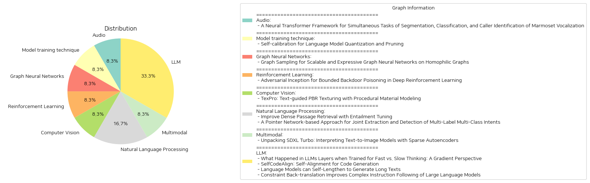

# Daily Artificial Intelligence Insights : Papers

## 🌅 Audio

**요약:**

제목: '비단원숭이 발성의 분할, 분류, 발신자 식별을 위한 신경망 트랜스포머 프레임워크'

요약: 
비단원숭이는 사회적-의사소통 행위와 그 기저 메커니즘을 연구하는 데에 인기 있는 동물 모델로 자리 잡고 있으며, 발화 소통 연구에서 발신자의 정체성, 발화 내용, 발성 교환을 아는 것이 매우 중요하다. 이전의 CNN 기반 연구는 비단원숭이 발성을 위한 발화 분할, 분류 및 발신자 식별을 위한 공동 모델을 구현하였지만, CNN은 긴 음향 패턴을 모델링하는 데 제한이 있다. 트랜스포머 아키텍처는 CNN보다 뛰어난 성능을 보였으며, 셀프 어텐션 메커니즘을 사용하여 장거리에서 정보를 효율적으로 병렬적으로 구분하고 비단원숭이 발성의 전반적인 구조를 포착한다. 우리는 트랜스포머를 이용하여 비단원숭이 발화를 공동으로 분할하고 분류하며, 각 발성에 대한 발신자를 식별하는 것을 제안한다.

보고서 요약:
이 연구는 비단원숭이, 특히 그들의 발성을 모델링하는데 있어서 신경망 트랜스포머 프레임워크의 중요성을 강조합니다. 이전의 CNN 모델에서는 장거리 음향 패턴을 모델링하는데 한계가 있었으나, 트랜스포머 구조는 정보 병렬 처리를 통해 전역적인 발성 구조를 포착함으로써 더 나은 성능을 제공합니다. 이 연구는 발성 분할, 분류, 발신자 식별의 동시 수행을 목표로 하고 있습니다. 이 연구는 동물 소통 연구, 특히 사회적-의사소통 메커니즘 해석의 진전으로 이어질 수 있습니다. 핵심 주제는 트랜스포머의 활용이며, 향후 이러한 접근 방식이 다른 동물 모델 연구로 확장될 가능성이 큽니다.

**출처:**

 - A Neural Transformer Framework for Simultaneous Tasks of Segmentation, Classification, and Caller Identification of Marmoset Vocalization (https://deeplearn.org/arxiv/542981/a-neural-transformer-framework-for-simultaneous-tasks-of-segmentation,-classification,-and-caller-identification-of-marmoset-vocalization)

## 🩵 Model training technique

**요약:**

보고서 요약:

1. 제목 및 주제:
   - "언어 모델 양자화 및 가지 치기를 위한 자가 보정"
   - 언어 모델의 압축을 위한 양자화와 가지 치기에 관한 연구

2. 공통 키워드 및 주요 테마:
   - 모델 압축, 양자화, 가지 치기, 자가 보정, 사전 훈련 데이터 분포, 모델 성능, 후처리, 칼리브레이션 데이터

3. 주요 이벤트 및 비판적 정보:
   - 모델 압축의 핵심 기법인 양자화와 가지 치기는 효율적인 언어 모델 추론을 가능하게 함.
   - 기존 방법에서는 웹 텍스트를 무작위로 샘플링하여 칼리브레이션 데이터를 수집하지만, 이는 모델 성능에 해를 끼칠 수 있는 대표성 부족 문제를 야기.
   - 조직들은 모델 훈련 데이터를 공개하기를 꺼리는 추세.
   - 새로운 자가 보정 접근법을 제안, 외부 데이터 없이 모델 자체를 이용해 합성 칼리브레이션 데이터 생성.
   - 다양한 모델과 압축 방법, 그리고 업무에 대해 성능 비교 실험 수행.
   - 자가 보정 방식이 실제 데이터 사용을 초과하는 성과를 보여줌.

4. 사건의 영향 분석:
   - 자가 보정 방법론은 데이터 접근성 제한이 있는 환경에서도 양자화 및 가지 치기의 효율성을 유지할 수 있도록 함.
   - 모델 성능 유지 및 개선을 위한 데이터 의존도를 줄이며, 산업 전반의 AI 모델 최적화 관행에 변화의 가능성 제공.
   - 훈련 데이터에 대한 보안 문제 및 데이터 프라이버시 문제에 대한 솔루션을 제공함.

5. 최종 결론 및 향후 개발 가능성:
   - 자가 보정 방식은 언어 모델의 양자화 및 가지 치기를 위한 중요한 혁신적 접근이 될 수 있음.
   - 데이터의 가용성 및 개인정보 보호 문제가 중요한 현재와 미래의 AI 환경에서 이 방법론의 중요성은 증가할 것으로 예상.
   - 다양한 모델과 관련 업무에서의 더 폭넓은 실험과 적용 연구가 장기적인 성과 향상을 위한 중요한 단계가 될 것임.

**출처:**

 - Self-calibration for Language Model Quantization and Pruning (https://deeplearn.org/arxiv/539909/self-calibration-for-language-model-quantization-and-pruning)

## 🪸 Graph Neural Networks

**요약:**

### 연구 논문 요약 보고서

1. **핵심 주제 및 테마 추출**
   - **그래프 신경망(GNN):** GNN은 그래프 기반 머신러닝 과제에서 뛰어난 성과를 보이나, 대규모 네트워크로 확장할 때 어려움을 겪는다.
   - **그래프 샘플링:** 전통적인 방법들은 랜덤 서브샘플링에 의존하여 불연속적인 서브그래프를 만들고, 모델의 표현력을 감소시킨다.
   - **특징 동질성:** 새롭게 제안된 그래프 샘플링 알고리즘은 그래프 구조를 보존하기 위해 특징 동질성을 활용한다.

2. **공통 키워드, 동향 및 패턴**
   - **재현성:** 그동안의 방법들이 불연속성을 초래하고 초기의 구조를 잘 지키지 못했기 때문에, 구조 보존이 중요한 연구 주제로 부상하고 있다.
   - **그래프 구조 및 복잡성:** 제안된 방법은 데이터 상관 행렬의 추적을 최소화하여 합리적 복잡성 수준에서 그래프 라플라시안의 랭크를 보존한다.

3. **주요 이벤트 및 핵심 정보 요약**
   - 제안된 알고리즘은 기존의 랜덤 샘플링과 비교하여 그래프 랭크를 더 잘 보존하며, 더 나아가 GNN의 전이 학습 성능을 향상시킨다.
   - 실험은 인용 네트워크를 통해 진행되었으며, 기존의 무작위 샘플링에 비해 더 나은 성능을 보였다.

4. **이러한 사건들의 영향 분석**
   - **기술 분야:** 본 연구는 대규모 그래프 데이터셋에서 GNN 모델의 확장성과 전이 성능을 향상시켜 인공지능 및 머신러닝 기술 발전에 기여할 수 있다.
   - **학술적 영향:** 새로운 방법론은 다른 구현 분야에서도 그래프 샘플링 전략의 수정 가능성을 열어줄 수 있다.

5. **최종 결론 및 잠재적 미래 발전 사항**
   - 미래에는 이 접근법이 다른 유형의 그래프 데이터에도 적용될 가능성이 크며, GNN의 효율성과 표현력을 더욱 확장시킬 수 있을 것으로 보인다.
   - 또한, 그래프 구조 보존의 중요성을 인식하면서, 이러한 접근 방식은 현존하는 복잡성을 줄이고 향상된 성능을 제공할 수 있는 새로운 방법론 연구에 영향을 미칠 것으로 기대된다. 

이 보고서는 그래프 신경망의 효율적 사용을 위한 새로운 그래프 샘플링 방법론을 제안하고 있으며, 이는 확장성과 전이 능력을 크게 향상시키는 데 기여할 수 있는 잠재력을 보이고 있다.

**출처:**

 - Graph Sampling for Scalable and Expressive Graph Neural Networks on Homophilic Graphs (https://deeplearn.org/arxiv/540257/graph-sampling-for-scalable-and-expressive-graph-neural-networks-on-homophilic-graphs)

## 🪐 Reinforcement Learning

**요약:**

보고서 요약:

이 논문은 'Deep Reinforcement Learning(깊은 강화학습)' 알고리즘의 훈련 시 발생할 수 있는 백도어 포이즈닝 공격에 대한 연구를 다루고 있습니다. 최근 연구들은 DRL 알고리즘이 이러한 백도어 포이즈닝 공격에 취약하다는 점을 입증하였습니다. 이러한 공격은 특정 트리거를 도입하여 에이전트가 배포 중에 미리 설정된 적대적 행동을 유도하면서, 훈련 중에는 의도된 과제를 해결할 수 있게 합니다. 이전의 공격들은 두 가지 목표를 달성하기 위해 에이전트의 보상에 임의로 큰 변화를 주어 탐지될 가능성이 컸습니다. 이에 따라, 본 연구에서는 보상을 최소로 변경하면서도 최고 성능을 달성하는 새로운 형태의 백도어 공격, 즉 "인셉션" 공격을 제안합니다. 이러한 공격은 훈련 중 환경에서 실행되는 실제 행동과 에이전트가 선택한 행동 사이의 불일치를 유도함으로써 타겟 적대적 행동과 높은 보상을 결합하여 에이전트를 훈련시킵니다. 우리는 이러한 공격을 정식으로 정의하고 두 가지 적대적 목표를 달성할 수 있음을 증명하였으며, 보상 제약 하에서도 이전 공격보다 월등한 성능을 나타내는 온라인 인셉션 공격을 고안하였습니다.

주제와 주요 내용:
1. 키워드: Deep Reinforcement Learning, 백도어 포이즈닝, 인셉션 공격, 적대적 행동, 보상.
2. 트렌드: 최근 DRL 알고리즘의 훈련 중 백도어 공격 취약성 증가.
3. 주요 이벤트: 최소 보상 변경으로 국가적 성능 달성하는 새로운 인셉션 공격 제안.
4. 영향: DRL 알고리즘의 보안성 강화 필요성 증가.
5. 결론: 새로운 인셉션 공격 방식이 DRL 알고리즘의 취약성을 공략하며, 향후 DRL 기술 발전에 있어 보안적 측면의 중요성이 강조될 것입니다. 향후 발전 방향으로는 DRL의 보안성을 보다 강력히 하기 위한 지속적 연구가 필요합니다.

**출처:**

 - Adversarial Inception for Bounded Backdoor Poisoning in Deep Reinforcement Learning (https://deeplearn.org/arxiv/538792/adversarial-inception-for-bounded-backdoor-poisoning-in-deep-reinforcement-learning)

## 🎉 Computer Vision

**요약:**

보고서 요약:

1. 주요 주제 및 테마 추출:
   - 'TexPro: Text-guided PBR Texturing with Procedural Material Modeling' 논문에서는 새로운 PBR 텍스처링 방법 TexPro를 소개합니다. 이 방법은 절차적 재질 모델링을 통해 텍스트 지시된 고충실도의 재질을 생성하는 방법입니다.

2. 공통 키워드, 트렌드, 패턴 식별:
   - 키워드: 텍스트-가이드, PBR 텍스처, 절차적 재질, 3D 메시, 물리 기반 렌더링, 재질 분류, 최적화
   - 트렌드: 텍스트를 활용한 3D 시각 생성, 절차적 모델링 적용 강화, 다양한 재질 맵 생성

3. 주요 이벤트 및 핵심 정보 요약:
   - TexPro는 텍스트 프롬프트를 기반으로 다중 시점 기준 이미지를 생성한 후, 절차적 재질을 활용한 렌더링-기반 최적화를 통해 텍스처 맵을 도출하는 방식을 사용합니다. 또한 절차적 재질의 기본 이점과 함께 재조명 및 다양한 텍스처 맵 생성을 가능케 합니다.
   - 생성된 다중 시점 이미지와 3D 메시 간의 불일치를 다루기 위한 여러 기법을 설계하였고, 부분 수준 이해 및 물체 인식 재질 분석을 통해 재질 분류 및 매칭을 향상시키는 새로운 재질 에이전트를 도입했습니다.

4. 이러한 이벤트의 다양한 부문에 대한 영향 분석:
   - 그래픽 및 게임 산업: 사실적인 재질 표현과 재조명 기능을 통해 그래픽의 현실감 상승.
   - 콘텐츠 제작: 텍스트 지시에 의한 손쉬운 고급 재질 생성으로 제작 효율성 향상. 
   - 인공지능 및 머신러닝: 텍스트-이미지 생성 모델의 발전과 이로 인한 다양한 응용 가능성이 크게 높아짐.

5. 결론 및 미래 발전 사항:
   TexPro는 기존의 방법들에 비해 확실한 성능 우위를 입증했으며, 텍스트 기반 재질 생성의 혁신을 보여줍니다. 앞으로 텍스트-기반 3D 그래픽 생성 기술의 발전과 강화를 기대할 수 있으며, 다양한 산업 분야에서 이 기술의 응용 및 확산 가능성이 클 것으로 전망됩니다. 특히 메타버스, VR/AR 환경 구축에서의 큰 역할이 예상됩니다.

**출처:**

 - TexPro: Text-guided PBR Texturing with Procedural Material Modeling (https://deeplearn.org/arxiv/538961/texpro:-text-guided-pbr-texturing-with-procedural-material-modeling)

## 🌿 Natural Language Processing

**요약:**

종합 요약 보고서:

1. 주요 주제 및 테마 추출:
   - 첫 번째 논문은 "밀집 통과 검색 개선을 위한 귀결 조정"이라는 주제로, 밀집 검색기에서의 의미 있는 내러티브를 사용하여 검색 성능을 향상시키는 방법에 대한 연구입니다. 특히 논리적 귀결(NLI) 작업에서의 귀결 개념과의 유사성을 발견하고 이를 활용하여 검색기 임베딩을 개선하는 방법이 제안되었습니다.
   - 두 번째 논문은 "다중 레이블 및 다중 클래스 의도의 조인트 추출 및 감지를 위한 포인터 네트워크 기반 접근법"에 관한 것으로, 복잡한 사용자 쿼리 내의 다중 의도 감지 및 의도 스팬 추출을 위한 체계를 개발하는 연구입니다. 특히 다국어 다중 레이블 의도 데이터셋을 구축하고 이에 기반한 포인터 네트워크 구축 방법론을 제시합니다.

2. 공통 키워드, 트렌드 및 패턴:
   - 두 논문 모두 자연어 처리(NLP) 시스템의 성능 개선에 중점을 두고 있으며, 복잡한 데이터를 처리하기 위한 새로운 방법론을 도입하고 있습니다.
   - 밀집 데이터 검색과 복합 및 다국어 의도 감지라는 주제를 통해, NLP 모델의 데이터 해석 및 성능의 정확성을 높이는 방향으로 발전하고 있음을 알 수 있습니다.

3. 주요 사건 및 중요한 정보 요약:
   - 첫 번째 논문에서는 검색 시스템의 모호한 의미 관계를 의미 명시적 내러티브로 보강하여 성능을 개선하는 방법으로, '귀결 조정'이라는 새로운 훈련 기법을 제안하였습니다. 이는 현재의 밀집 검색 체계에 효율적으로 통합될 수 있으며, 실험 결과에서 그 유효성을 입증하였습니다.
   - 두 번째 논문은 포인터 네트워크 구조를 사용하여 다중 의도 감지 문제를 해결하는 프레임워크를 제안하고 있으며, 이 방법은 여러 데이터셋에서 기존의 기준선 접근법보다 우수한 성능을 보여주었습니다.

4. 이러한 사건의 다양한 분야에 대한 영향 분석:
   - 첫 번째 연구는 정보 검색 및 데이터 처리 정확성 향상에 기여하여, 그 결과 더욱 정교하고 정확한 정보 검색 시스템 구축에 기여할 수 있습니다.
   - 두 번째 연구는 다국어 대화형 시스템의 복잡한 쿼리 처리 역량을 증대시킬 수 있어, 글로벌 사용자를 대상으로 한 멀티모달 대화형 시스템 개발을 지원합니다.

5. 최종 결론 및 향후 개발 관찰:
   - 두 논문은 NLP 분야에서의 데이터 정확성 및 처리 능력 향상에 대한 기술 발전을 보여줍니다. 향후, 이러한 방법론이 실무에 적용되면서, 보다 포괄적이고 효율적인 자연어 이해 시스템이 개발될 가능성이 높습니다.
   - 특히, 다중 언어 및 다중 의도 데이터를 처리하기 위한 고급 시스템의 개발이 가속화될 것으로 예상됩니다.

**출처:**

 - Improve Dense Passage Retrieval with Entailment Tuning (https://deeplearn.org/arxiv/539014/improve-dense-passage-retrieval-with-entailment-tuning)
 - A Pointer Network-based Approach for Joint Extraction and Detection of Multi-Label Multi-Class Intents (http://arxiv.org/abs/2410.22476v1)

## 🎉 Multimodal

**요약:**

**종합 요약 보고서**

1. **핵심 주제 및 테마 추출:**
   - 텍스트-이미지 모델 해석
   - 희소 자동인코더(Sparse Autoencoders, SAEs)의 활용
   - 중간 표현의 해석 가능성
   - SDXL Turbo 모델의 특정 기능 학습

2. **공통 키워드, 트렌드 및 패턴 식별:**
   - 희소 자동인코더
   - 확산 모델
   - 해석 가능한 피쳐
   - 텍스트-이미지 변환
   - SDXL Turbo
   - 트랜스포머 블록 분석

3. **각 논문의 주요 사건 및 핵심 정보 요약:**
   - 희소 자동인코더는 대형 언어 모델(LLMs) 분석에서 중요한 역할을 하여, 해석이 어려운 중간 표현을 해석 가능한 피쳐의 희소한 합으로 분해한다.
   - 텍스트-이미지 모델에서 이와 같은 분석이 부족했다.
   - SDXL Turbo와 같은 텍스트-이미지 확산 모델에서 SAEs를 사용해 해석 가능한 피쳐를 학습할 가능성을 조사하였다.
   - 트랜스포머 블록 내 업데이트를 SAEs로 훈련했을 때, 학습된 피쳐가 해석 가능하고 세대 과정을 인과적으로 영향을 미침을 발견하였다.
   - 특정 트랜스포머 블록은 이미지 구성, 세부 사항 추가, 색상, 조명, 스타일 등을 위한 전문화를 나타냄을 확인하였다.

4. **이벤트의 다양한 부문에 대한 영향 분석:**
   - 이러한 연구는 텍스트-이미지 생성 모델의 내부 작동 방식을 이해하는 데 기여하며, 시각적 도메인에서 SAEs를 통해 학습된 피쳐의 가능성을 보여준다.
   - 생산성을 높이고, 더 나은 모델 해석 및 제어로 이어질 수 있는 기회를 제공한다.

5. **최종 통합 요약 및 미래 발전 가능성:**
   - 이 연구는 텍스트-이미지 모델의 해석 가능성 및 제어에 중요한 기초를 다졌으며, 이는 시각적 인공지능의 발전에 도움이 될 것이다.
   - 앞으로, 이러한 분석 방법론이 발전하여 더욱 다양한 모델 및 응용 분야에 적용될 가능성이 크다. 
   - 특히, 학습된 피쳐의 특성을 바탕으로 여러 블록 간의 협력을 최적화하여 생성 결과의 질을 개선할 방법을 모색할 수 있다. 

이는 향후 연구 및 개발의 방향성을 제시하는 중요한 인사이트를 제공한다.

**출처:**

 - Unpacking SDXL Turbo: Interpreting Text-to-Image Models with Sparse Autoencoders (http://arxiv.org/abs/2410.22366v1)

## 🎈 LLM

**요약:**

요약 보고서

1. 주요 주제 및 테마 추출:

각 논문에서 다루고 있는 주요 주제와 테마를 살펴보면, '대형 언어 모델(LLMs)'의 훈련 방법 및 효율성, 코드 생성 및 길이 확장, 복잡한 지시문 따라가기 등의 주제를 확인할 수 있습니다. 특히, 효율적인 훈련 기술과 안정성, 성능 향상에 주목하고 있습니다.

2. 공통 키워드, 트렌드, 패턴 식별:

- '대형 언어 모델(LLMs)'
- '훈련 안정성 및 효율성'
- '지시문 조정'
- '길이 확장'
- '복잡한 지시문 처리 능력'

이 키워드들은 논문 전반에 걸쳐 반복적으로 나타나며, LLMs의 성능 최적화를 위한 다양한 접근과 개선이 이뤄지고 있음을 보여줍니다.

3. 주요 이벤트 및 중요한 정보 요약:

- LLMs의 훈련에서 '빠른 사고'와 '느린 사고'의 차이에 따른 층별 그래디언트 변화의 분석은 LLMs의 안정성과 효율성에 대한 새로운 관점을 제공합니다.
- SelfCodeAlign은 사람의 주석 없이도 자체 코드 정렬이 가능한 새로운 파이프라인을 제시하여, 다양한 LLMs의 성능을 크게 향상시키고 있습니다.
- Self-Lengthen 프레임워크는 LLMs가 본래의 지식과 기술만으로 긴 텍스트를 생성하도록 반복 학습을 하는 혁신적인 방법을 제공하여 이 부문에서 우수한 성과를 보이고 있습니다.
- Constraint Back-translation은 복잡한 지시문을 잘 따르도록 하는 새로운 데이터 생성 기술로, LLMs의 복잡한 지시문 처리 능력을 향상시키는 효과를 보였습니다.

4. 이벤트의 각 부문에 대한 영향 분석:

이들 기술과 연구는 LLMs의 자연어 처리 및 코드 생성 능력을 강화하며, 특히 복잡한 작업을 수행할 수 있는 능력을 크게 향상시키고 있습니다. 이는 AI 기반의 코드 개발, 텍스트 생성, 및 지시문 처리 등 다양한 산업에서 혁신적인 발전을 이끌 것입니다. 특히, 모델의 효율적인 훈련 및 튜닝 방법의 발전은 비용 절감과 성능 향상의 기회를 제공합니다.

5. 통합 요약 및 결론:

이 연구들은 LLMs의 훈련 및 성능 최적화를 위한 다양한 혁신 전략을 제시하고 있습니다. 빠른 사고와 느린 사고의 비교, 자체 코드 정렬, 텍스트 길이 확장, 복잡한 지시문 처리 개선 등 다양한 기술을 통해 LLMs의 활용 범위를 넓히고 있습니다. 미래에는 이러한 기술이 더욱 발전하여 다양한 분야에서의 적용 가능성을 넓히고, LLMs의 성능을 극대화할 것으로 기대됩니다. 앞으로 주목할 만한 발전은 더욱 향상된 훈련 안정성, 중복 작업의 효율적 처리, 컴퓨팅 비용 절감, 그리고 AI 시스템의 일반화 능력의 향상입니다.

**출처:**

 - What Happened in LLMs Layers when Trained for Fast vs. Slow Thinking: A Gradient Perspective (http://arxiv.org/abs/2410.23743v1)
 - SelfCodeAlign: Self-Alignment for Code Generation (http://arxiv.org/abs/2410.24198v1)
 - Language Models can Self-Lengthen to Generate Long Texts (http://arxiv.org/abs/2410.23933v1)
 - Constraint Back-translation Improves Complex Instruction Following of Large Language Models (http://arxiv.org/abs/2410.24175v1)

