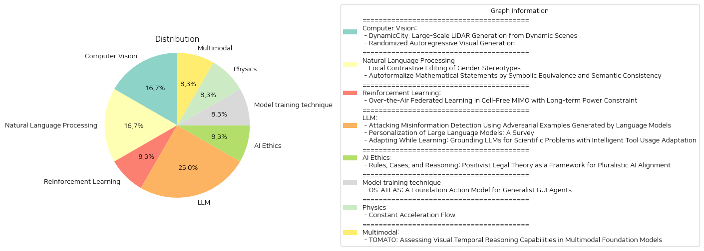

# Daily Artificial Intelligence Insights : Papers

## ⭐ Computer Vision

**요약:**

## 종합 요약 보고서

### 주요 주제 및 테마 추출

1. **동적 환경에서의 LiDAR 생성**:
   - DynamicCity는 동적인 4D LiDAR 장면 생성을 위한 독창적인 프레임워크입니다. 
   - 이 시스템은 실세계 주행 환경의 시간적 변화를 포착할 수 있는 역량을 가지고 있습니다.
   - HexPlane을 4D 표현으로 사용하며, VAE 및 DiT 기반의 두 가지 주요 모델로 구성됩니다.

2. **랜덤화된 자귀회귀 시각 생성**:
   - RAR은 이미지 생성 성능을 새로운 수준으로 끌어올리며, 언어 모델링 프레임워크와 완전한 호환성을 유지합니다.
   - 이 모델은 FID 점수 1.48로 ImageNet-256 benchmark에서 기존 최첨단 모델보다 뛰어난 성과를 보였습니다.
   - 모델의 양방향 컨텍스트 모델링 능력을 향상시키는 단순하면서도 효과적인 훈련 전략을 사용합니다.

### 공통 키워드, 트렌드 및 패턴

- **친환경 개발**: 두 논문 모두 고급 기술을 통해 기존 방법론을 개선하고자 하였으며, 이는 보다 참신하고 효율적인 환경 창조에 기여합니다.
- **효율성 향상**: DynamicCity는 리소스 사용을 최적화하고, RAR는 훈련 전략을 통하여 모델의 성능을 극대화합니다.
- **기술 통합**: RAR의 경우, 언어 모델링과의 호환성을 유지하면서 이미지 생성의 성능을 극대화하였습니다.

### 주요 사건 및 핵심 정보 요약

- **DynamicCity**: 기존의 정적 장면 생성 한계를 극복하면서 새로운 4D LiDAR 장면 생성 방식을 소개하는 DynamicCity는 VAE와 DiT 기반 모델을 통해 크게 향상된 정확도와 성능을 보여줍니다.
- **RAR 모델**: 랜덤화된 학습 과정으로 자귀회귀 모델의 성능을 획기적으로 개선하여 다른 이미지 생성 기술을 우월하게 능가하는 성과를 이뤄냈습니다.

### 이벤트가 여러 부문에 미치는 영향 분석

- **자동차 및 교통 관리**: DynamicCity의 LiDAR 기술은 자율주행차 및 미래 교통 관리 시스템에서의 효율성과 안전성을 크게 향상시킬 수 있습니다.
- **이미지 및 콘텐츠 생성 산업**: RAR의 개선된 이미지 생성 기술은 영화, 게임, 가상현실과 같은 시각적 콘텐츠 산업에서 새로운 가능성을 열어줍니다.

### 결론 및 미래 개발 가능성

- **결론**: DynamicCity와 RAR 모델은 각각 LiDAR 생성 및 이미지 생성 분야에서 혁신적인 도약을 나타내며, 기술의 정확성과 효율성을 향상시키는 동시에 새로운 연구 기회를 제공합니다.
- **미래 발전**: 향후 연구는 보다 다양한 조건에서의 테스트 및 다른 분야와의 기술 융합에 초점을 맞출 필요가 있습니다. 이를 통해 더욱 효과적이고 광범위한 응용이 가능해질 것입니다.

**출처:**

 - DynamicCity: Large-Scale LiDAR Generation from Dynamic Scenes (https://deeplearn.org/arxiv/540398/dynamiccity:-large-scale-lidar-generation-from-dynamic-scenes)
 - Randomized Autoregressive Visual Generation (http://arxiv.org/abs/2411.00776v1)

## 💙 Natural Language Processing

**요약:**

1. 주요 주제 및 테마 추출:
   - 첫 번째 논문에서는 언어 모델(LM) 내의 성별 고정관념 편견과 이를 조정하기 위한 로컬 대비 편집 방식을 소개하고 있습니다.
   - 두 번째 논문에서는 자연어를 형식 언어로 자동 번역하는 오토포멀라이제이션에 대한 도전 과제와 이를 개선하기 위한 상징적 동등성 및 의미 일관성 접근법을 다루고 있습니다.

2. 공통 키워드, 경향 및 패턴 식별:
   - 양립 논문 모두 언어 모델의 성능 개선 및 편견과 오류 완화를 목표로 하고 있습니다.
   - 모델의 성능 조정 및 정확도 향상을 위한 구체적인 기술이나 방법론을 제시하고 있다는 점에서 공통된 관심사를 가지고 있습니다.

3. 각 논문의 주요 사건 및 중요한 정보 요약:
   - 'Local Contrastive Editing of Gender Stereotypes' 논문은 언어 모델의 매개변수에서 성별 고정관념 편견을 식별하고 수정하기 위한 로컬 대비 편집 방법을 제안합니다. 글로벌 대비 편집이 아닌 특정 매개변수 하위 집합에 집중하여 보다 효율적인 편견 통제가 가능합니다.
   - 'Autoformalize Mathematical Statements by Symbolic Equivalence and Semantic Consistency' 논문은 자연어 수학 문제를 형식 언어로 전환하는 자동화 작업의 정확성을 향상시키기 위해 상징적 동등성과 의미 일관성을 활용한 프레임워크를 도입하였습니다. 이로 인해 자동화된 형식화 정확도가 크게 향상되었습니다.

4. 이러한 사건들이 다양한 부문에 미치는 영향 분석:
   - 첫 번째 논문의 경우, 언어 모델에서의 정밀한 편견 통제는 인공지능 기반의 자연어 처리 애플리케이션에서의 안전성과 공정성을 증진시킬 수 있습니다.
   - 두 번째 논문의 경우, 수학 분야에서의 오토포멀라이제이션 정확도 향상은 교육 및 연구에서 인간의 작업량을 줄이고 효율성을 높이는데 기여할 수 있습니다.

5. 최종 종합 요약과 앞으로 주목할 발전 사항:
   - 두 논문 모두 언어 모델의 정확성과 공정성을 증진시키기 위한 혁신적인 방법론을 제시하고 있으며, 이는 다양한 분야에서 인공지능의 활용도를 높이는 데 기여하고 있습니다.
   - 로컬 대비 편집 방법의 발전은 성별을 포함한 다양한 편견류의 자동적인 통제 가능성을 높입니다.
   - 오토포멀라이제이션의 정확도 개선은 수학 외의 다른 복잡한 도메인에서도 적용 가능할 수 있습니다. 앞으로 이러한 방법들이 다른 학문 분야와 실생활 문제 해결에 어떻게 확장되는지를 주목해야 할 것입니다.

**출처:**

 - Local Contrastive Editing of Gender Stereotypes (https://deeplearn.org/arxiv/540617/local-contrastive-editing-of-gender-stereotypes)
 - Autoformalize Mathematical Statements by Symbolic Equivalence and Semantic Consistency (https://deeplearn.org/arxiv/541786/autoformalize-mathematical-statements-by-symbolic-equivalence-and-semantic-consistency)

## 🎈 Reinforcement Learning

**요약:**

보고서 요약:

최근 무선 네트워크는 인공지능을 지원하는 기술로써 큰 주목을 받고 있으며, 그 중에서도 Over-the-Air Federated Learning(OTA-FL)은 독특한 전송 및 분산 컴퓨팅 특성으로 인해 주요 응용으로 부상하고 있습니다. 이번 연구에서는 셀-프리 MIMO 시스템에서 OTA-FL의 오류 한계를 도출하고, 파워 제어와 빔 포밍의 공동 최적화를 통해 최적성 간극을 최소화하는 최적화 문제를 구체화했습니다. 특히 MOP-LOFPC 알고리즘을 소개하여, 라야포노프(Lyapunov) 최적화를 사용하여 라운드 간 장기 제약 조건을 분리하면서도 인과 채널 상태 정보만을 요구하는 특징을 가지고 있습니다. 실험 결과, MOP-LOFPC는 기존 기준과 비교할 때 모델의 훈련 손실과 장기 전력 제약 조건의 준수 사이에서 더 나은 유연한 균형을 달성함을 보여주었습니다.

1. 주요 주제: 무선 네트워크의 인공지능 지원, OTA-FL의 응용, 셀-프리 MIMO 시스템, 전력 제어 및 빔포밍 최적화.

2. 공통 키워드 및 패턴: 무선 네트워크, 인공지능, OTA-FL, 셀-프리 MIMO, 최적화 문제, 장기 전력 제약 조건, 훈련 손실.

3. 주요 이벤트 및 중요한 정보: OTA-FL의 오류 한계 도출, MOP-LOFPC 알고리즘 도입, 라야포노프 최적화를 통한 장기 제약의 분리.

4. 이러한 이벤트의 영향 분석: 다양한 무선 네트워크 기반 인공지능 시스템에서 OTA-FL이 보다 효율적으로 구현될 수 있는 가능성을 제시하며, 이는 장기 전력 제약 조건을 따르면서도 성능을 극대화 할 수 있는 방향성을 제시합니다.

5. 최종 요약 및 미래 발전 가능성: 본 연구는 차세대 무선 네트워크에서 인공지능 기반 기술의 효율성을 높이는 데 중요한 기초를 마련하며, 앞으로 이 분야에서 다양한 최적화 알고리즘 개발과 실증 연구가 이루어질 것으로 예상됩니다. 특히, 실제 네트워크 조건에서의 성능 개선과 더불어 실시간 응용 가능성의 확대가 주요 관심사로 부상할 것입니다.

**출처:**

 - Over-the-Air Federated Learning in Cell-Free MIMO with Long-term Power Constraint (https://deeplearn.org/arxiv/540628/over-the-air-federated-learning-in-cell-free-mimo-with-long-term-power-constraint)

## 🩵 LLM

**요약:**

### 종합 요약 보고서

#### 1. 주요 주제 및 테마 추출:
각 논문의 제목과 요약을 통해 다음과 같은 주요 주제와 테마를 확인할 수 있습니다.
- 허위 정보 탐지 및 언어 모델의 적대적 예제 생성
- 대형 언어 모델(LLMs)의 개인화 및 관련 응용
- 과학 문제 해결을 위한 LLMs의 적응과 도구 사용

#### 2. 공통 키워드 및 트렌드 식별:
논문들 간의 공통적인 키워드로는 '대형 언어 모델(LLMs)', '개인화', '적응', '도구 사용', '정확성 개선' 등이 있습니다. 특히, LLM 사용의 개인화와 문제 해결 능력 강화가 주요한 연구 트렌드로 나타났습니다.

#### 3. 주요 사건 및 중요 정보 요약:
- **첫 번째 논문**은 허위 정보 탐지 모델의 견고성을 테스트하기 위해 적대적 예제를 생성하는 데 중점을 둔 연구를 다룹니다. TREPAT라는 솔루션을 통해 대형 언어 모델을 활용하여 초기 변형을 생성하고, 이를 작은 변경 사항으로 분해하여 피해자 분류기가 결정을 번복할 때까지 빔 서치 절차를 적용합니다. 특히, 긴 입력 텍스트에 대한 우월성을 확인했습니다.
  
- **두 번째 논문**에서는 LLM의 개인화 관련 연구를 포괄적으로 조사하여 LLM 사용의 개인화 방법과 응용을 위한 체계적 분류 체계를 제안합니다. 개인화의 여러 측면과 사용 시나리오를 통합하고, 아직 해결되지 않은 과제들을 강조합니다.

- **세 번째 논문**은 과학 문제를 해결하기 위한 지능적 도구 사용 적응을 포함한 두 가지 구성 요소로 구성된 새로운 학습 방법을 제안합니다. 도메인 지식을 내재화하고, 간단한 문제에 대해서는 기본적 추론을 유지하면서 복잡한 문제에는 도구 사용으로 전환하도록 학습합니다. 이는 기존 주요 모델들을 능가하는 정확성 향상을 보였습니다.

#### 4. 이러한 사건이 다양한 분야에 미치는 영향 분석:
- 이렇게 발전된 허위 정보 탐지 기법은 뉴미디어와 저널리즘 분야에서 신뢰도 향상에 기여할 수 있습니다.
- LLM의 개인화는 다양한 산업에서 고객 경험 및 개인 맞춤형 서비스 향상을 가능하게 합니다.
- 과학 문제 해결에서의 LLM 적응은 연구 및 개발 분야에서 인간 전문가의 보조 도구로서의 역할을 강화하고, 복잡한 문제 해결에 있어 중요한 돌파구가 될 수 있습니다.

#### 5. 종합 결론 및 미래 개발 가능성:
현재 연구들은 허위 정보 탐지, 개인화된 LLM 활용, 과학 문제 해결 능력 향상을 위한 효율적인 도구 사용 적응과 관련된 중요한 진전을 나타내고 있습니다. 이러한 기술적 발전은 앞으로 더 많은 분야에서 적용될 수 있으며, 보다 전문화되고 정교한 AI 솔루션 개발의 기초가 될 가능성이 큽니다. 특히, 개인화된 AI 모델의 개발과 그 응용은 다양한 산업에서의 사용자 경험을 근본적으로 변화시킬 전망입니다. 앞으로는 이와 관련된 지속적인 연구와, 더욱 복잡한 문제에 대한 해결책 제시가 중요할 것입니다.

**출처:**

 - Attacking Misinformation Detection Using Adversarial Examples Generated by Language Models (https://deeplearn.org/arxiv/541784/attacking-misinformation-detection-using-adversarial-examples-generated-by-language-models)
 - Personalization of Large Language Models: A Survey (http://arxiv.org/abs/2411.00027v1)
 - Adapting While Learning: Grounding LLMs for Scientific Problems with Intelligent Tool Usage Adaptation (http://arxiv.org/abs/2411.00412v1)

## 🩵 AI Ethics

**요약:**

1. **핵심 주제 및 테마**
   - 법적 이론과 AI 정렬
   - 다원주의와 사양화의 문제 해결
   - 규칙과 사례를 통한 일반 원칙의 구체화

2. **공통 키워드, 동향 및 패턴**
   - 법적 이론
   - 정렬과 다원주의
   - 규칙의 구체적 함의와 적용

3. **주요 사건 및 중요 정보 요약**
   - 법적 이론은 AI 정렬의 두 가지 주요 문제인 다원주의와 사양화를 해결하는 데 도움이 될 수 있음.
   - 법은 규칙과 사례의 상호작용을 통해 일반적인 규칙이 구체적 내용을 가지게 하는 방식으로 문제를 해결함.
   - AI를 활용하여 규칙에 내용을 부여하는 사례를 생성해 민주적 정렬 과정을 개선할 가능성을 탐색하고 있음.

4. **이 사건들의 다양한 부문에 대한 영향 분석**
   - 법적 이론의 AI 통합은 기술 개발을 넘어 정치적, 사회적 가치의 다원적 인식을 촉진할 수 있음.
   - 민주적 정렬 과정에서 다원적 관점을 보장하는 데 있어 AI의 적용 가능성을 제시함.

5. **최종 요약 및 향후 발전 가능성**
   - 법적 이론과 AI 기술을 결합하여 불명확한 원칙의 실제 의미를 명확히 하고 다원주의적 관점의 보호를 가능하게 하는 방법을 제안함.
   - 앞으로 법과 AI의 상호작용을 통해 보다 포괄적이고 민주적인 가치 정렬 방법이 개발될 것으로 예상됨. 
   - 이러한 접근법은 더욱 다양한 관점이 고려될 수 있는 AI 정렬의 새로운 패러다임을 마련할 수 있음.

**출처:**

 - Rules, Cases, and Reasoning: Positivist Legal Theory as a Framework for Pluralistic AI Alignment (https://deeplearn.org/arxiv/541785/rules,-cases,-and-reasoning:-positivist-legal-theory-as-a-framework-for-pluralistic-ai-alignment)

## 💙 Model training technique

**요약:**

보고서 요약:

1. 주요 주제 및 테마 추출:
   - GUI 에이전트에 대한 연구 및 개발
   - 상업용 비전-언어 모델(VLM)의 활용
   - 공개 소스 VLM의 성능 문제
   - OS-Atlas: GUI 행동 모델 소개
   - GUI 접지 및 배포하지 않은 시나리오에서의 에이전트 작업 수행

2. 공통 키워드, 트렌드 및 패턴:
   - GUI 에이전트, OS-Atlas, VLM, 공개 소스, GUI 접지, 데이터 셋
   - 여러 플랫폼을 위한 툴킷 개발
   - 크로스 플랫폼 GUI 접지 코퍼스 제공
   - 모델 훈련 및 성능 개선

3. 주요 사건 및 중요 정보 요약:
   OS-Atlas는 상업용 VLM의 성능에 접근할 수 없었던 과거의 공개 소스 VLM들과 달리, GUI 접지 및 OOD 에이전트 작업에서 우수한 성능을 보입니다. 이를 위해 대규모 공개 소스 크로스 플랫폼 GUI 접지 코퍼스를 개발하고 1,300만 개 이상의 GUI 요소를 포함한 데이터셋을 제공하였습니다. 이 데이터셋을 토대로 OS-Atlas는 보지 못한 인터페이스에 대한 일반화 역량을 강화하였으며, 모바일, 데스크탑, 웹 등 세 가지 플랫폼을 아우르는 6개 벤치마크를 통해 과거의 최첨단 모델들을 능가하는 성과를 시연하였습니다.

4. 이러한 사건이 다양한 부문에 미치는 영향 분석:
   OS-Atlas의 개발은 공개 소스 VLM에 대한 연구 및 사용을 촉진하며, GUI 에이전트의 성능을 상업용 모델에 가깝게 개선할 잠재력을 가지고 있습니다. 이는 다양한 플랫폼에서의 GUI 작업 효율성을 증가시키고, 많은 연구자들이 공개 소스 도구들을 더욱 활용하게 함으로써 산업계에도 긍정적 영향을 미칠 것으로 예상됩니다.

5. 결론 및 주목할 만한 미래 개발:
   OS-Atlas의 성과는 공개 소스 VLM의 지속적인 발전 가능성을 시사하며, 이를 통해 GUI 에이전트가 더욱 다양한 환경에서 효과적으로 기능할 수 있도록 도울 것입니다. 앞으로 다른 플랫폼과의 통합과 확장을 통한 발전 상황을 주시하는 것이 중요할 것입니다. 공개 소스 VLM의 강화된 에이전트 기능은 개발자와 연구자에게 보다 많은 기회를 제공할 것이며, 지속적인 개선과 확장 가능성이 높은 분야로 남아 있을 것으로 보입니다.

**출처:**

 - OS-ATLAS: A Foundation Action Model for Generalist GUI Agents (http://arxiv.org/abs/2410.23218v1)

## 🧸 Physics

**요약:**

### Summary Report in Korean

**주요 주제 및 테마 추출:**
1. 일정 속도로 진행되는 미분방정식(ODE) 흐름의 직선화.
2. 상수 가속도를 도입한 새로운 모델링 접근법인 "Constant Acceleration Flow (CAF)"의 제안.
3. 이미지와 노이즈 쌍 사이의 경로 추정을 개선하기 위한 학습 가능 변수로서의 가속도 도입.
4. CAF의 성능 평가 및 기존의 Rectified flow와의 성능 비교.

**주요 키워드 및 패턴:**
- 상수 속도(Constant Velocity)
- 상수 가속도(Constant Acceleration)
- Couplings (이미지와 노이즈 쌍)
- 즉각적인 생성(one-step generation)
- 결합 유지 및 반전
- 초기 속도 조건화와 재흐름(reflow) 과정

**주요 사건 및 정보 요약:**
- 기존의 Rectified flow 방식을 보완하기 위해 "Constant Acceleration Flow (CAF)" 프레임워크를 제안하였다.
- CAF는 가속도라는 새로운 변수를 도입함으로써 ODE 흐름의 추정 정확도를 높이는 효과가 있다.
- 초기 속도에 대한 조건화 및 초기 속도를 위한 재흐름 방법을 제안하여 더욱 정확한 경로 추정을 가능케 했다.
- 실험 결과, CAF는 CIFAR-10과 ImageNet 64x64를 포함한 데이터 세트에서 최첨단 기법들보다 더 나은 성능을 보여주었다.
- 짧은 단계에서의 결합 보존 및 반전을 기존 방식보다 현저하게 개선하였다.

**이벤트의 영향 분석:**
- 학습과정에서의 가속도의 도입은 더욱 정교한 이미지-노이즈 경로 추측을 가능하게 하여, 빠른 이미지 생성 분야에서 새로운 기준점을 제공할 수 있다.
- 최첨단 기법을 넘어선 성능 향상은 인공지능과 컴퓨터 비전 분야에서 중요한 발전을 의미한다.

**결론 및 미래 발전 방향 예측:**
- Constant Acceleration Flow (CAF)는 인공지능 모델의 효율성과 정확성을 크게 개선할 가능성을 보여주었다.
- 향후 연구는 CAF의 적용 범위를 다른 데이터 세트와 더 복잡한 시스템으로 확장하여 새로운 가능성을 탐색할 필요가 있다.
- CAF의 개발 및 확장은 실시간 이미지 생성의 성능을 더욱 최적화할 수 있는 잠재력을 품고 있으며, 이는 다양한 산업 분야에 혁신적인 솔루션을 제공할 수 있는 기반이 될 수 있다.

**출처:**

 - Constant Acceleration Flow (http://arxiv.org/abs/2411.00322v1)

## 🌅 Multimodal

**요약:**

보고서 요약:

1. 주제 및 테마 추출:
   본 연구는 최신 다중 모달 기반 모델(Multimodal Foundation Models, MFMs)의 영상 이해에 필요한 시각적 시간 추론 능력을 평가합니다. 이 연구는 기존의 벤치마크에서 MFMs가 시간적 문맥을 활용하여 뛰어난 성과를 보이는 것이 종종 과대평가된다는 것을 제시합니다.

2. 공통 키워드, 트렌드 및 패턴 식별:
   - 시각적 시간 추론
   - 다중 프레임 활용
   - 프레임 순서 민감성
   - 프레임 정보 불일치
   - 인간-모델 성능 격차

3. 주요 이벤트 및 중요 정보 요약:
   연구에서는 "TOMATO"라는 새로운 벤치마크를 제안하여 MFMs의 비디오 이해 능력을 철저히 평가합니다. TOMATO는 1,484개의 인공지능 질문으로 구성되며, 이는 1,417개 비디오에 적용됩니다. 여기에는 인간 중심의 실제 시나리오 및 시뮬레이션된 시나리오가 포함됩니다.

4. 이벤트의 영향 분석:
   연구 결과는 최상의 모델에서도 인간-모델 성능 격차가 57.3%에 이른다는 것을 보여줍니다. 이는 현재 MFMs이 개별 프레임에서 이벤트를 인식할 수 있지만, 연속적인 시퀀스로 해석할 수 없는 제한점을 드러냅니다.

5. 결론 및 잠재적인 미래 발전:
   TOMATO는 차세대 MFMs를 평가하기 위한 중요한 테스트베드로 활용되며, 이를 통해 비디오 매개변수를 통해 인간 세계의 역동성을 이해할 수 있는 AI 시스템의 개발을 위한 촉구로 사용되기를 바랍니다. 향후 연구는 이 격차를 줄이고 보다 진보된 시각적 시간 추론 기술을 발전시키는 데 집중할 필요가 있습니다.

**출처:**

 - TOMATO: Assessing Visual Temporal Reasoning Capabilities in Multimodal Foundation Models (http://arxiv.org/abs/2410.23266v1)

