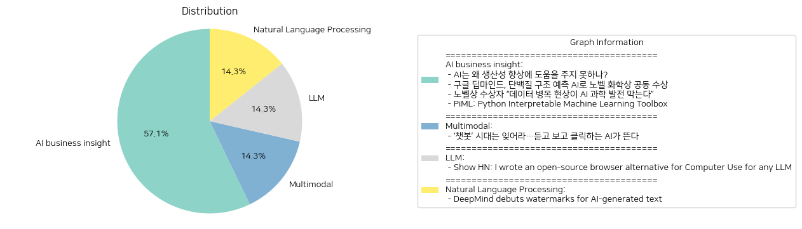

# Daily Artificial Intelligence Insights : News

## 🧸 AI business insight

**요약:**

**주요 주제**:
- 인공지능(AI)의 역할과 발전 가능성
- AI와 과학 발전의 상관관계
- AI 기술의 한계 및 개선 필요성
- 해석 가능한 머신 러닝 도구 개발

**주요 사건**:
1. **생산성 향상 관련 AI의 한계**: 인공지능이 경제 발전의 촉매제로 주목받고 있지만, 실제로 생산성을 향상시키기 위해서는 여러 가지 개선이 필요하다는 문제 제기.
2. **구글 딥마인드의 노벨 화학상 수상**: 구글 딥마인드의 데미스 허사비스와 존 점퍼가 AI를 이용해 단백질 구조 예측 문제를 해결하면서 노벨 화학상을 공동 수상한 것. 이는 AI가 과학적 발견에 기여할 수 있음을 보이는 사례.
3. **데이터의 중요성 언급**: 노벨상 수상자로서 데이터 병목 현상이 AI 발전을 가로막고 있으며, 이를 해결하기 위해 고품질 데이터가 필요하다는 주장.
4. **PiML 도구 개발**: 해석 가능한 머신 러닝 모델 개발을 돕는 Python 도구 PiML의 출시. 이는 머신 러닝의 성능뿐만 아니라 해석 가능성을 강조하는 방향으로의 진전을 보여준다.

**영향 분석**:
- **경제**: AI 기술이 여전히 경제적 생산성을 높이는 데 제한적인 기여를 하고 있으며, 이는 기술적으로 커다란 개선이 필요하다는 것을 시사한다.
- **과학 및 산업**: 구글 딥마인드의 노벨상 수상은 AI가 혁신적인 방법으로 과학 연구에 기여할 수 있음을 보여줌으로써 관련 업계의 연구개발에 대한 관심을 촉진할 것으로 보인다.
- **AI 기술 발전**: 데이터 품질의 중요성을 강조함으로써, AI 연구와 적용에서 데이터의 수집과 관리가 더욱 중요해 질 것으로 예상된다.
- **기술 개발 및 교육**: PiML의 출시는 해석 가능성을 갖춘 새로운 기술 개발로, 교육과 연구 환경에서의 활용도를 높일 수 있다.

**최종 요약**:
최근 뉴스 기사들은 AI 기술이 경제적 및 과학적 분야에서 받는 기대와 실제적 도전 과제를 함께 보여준다. AI가 노벨상 수상을 통해 그 가능성을 확인받았으나, 여전히 생산성 향상에는 한계가 있어 개선이 필요하다. 데이터 품질 또한 AI 기술 발전의 핵심 요소로 부각되고 있다. 해석 가능한 머신 러닝 도구의 개발은 AI의 활용을 보다 이해하기 쉽게 만들어 줄 것으로 기대된다. 향후 AI 기술이 더욱 폭넓게 활용되기 위해서는 데이터의 질 향상과 기술적 도약이 필요할 것으로 보인다.

**출처:**

 - AI는 왜 생산성 향상에 도움을 주지 못하나? (https://www.technologyreview.kr/ai%eb%8a%94-%ec%99%9c-%ec%83%9d%ec%82%b0%ec%84%b1-%ed%96%a5%ec%83%81%ec%97%90-%eb%8f%84%ec%9b%80%ec%9d%84-%ec%a3%bc%ec%a7%80-%eb%aa%bb%ed%95%98%eb%82%98/)
 - 구글 딥마인드, 단백질 구조 예측 AI로 노벨 화학상 공동 수상 (https://www.technologyreview.kr/%ea%b5%ac%ea%b8%80-%eb%94%a5%eb%a7%88%ec%9d%b8%eb%93%9c-%eb%8b%a8%eb%b0%b1%ec%a7%88-%ea%b5%ac%ec%a1%b0-%ec%98%88%ec%b8%a1-ai%eb%a1%9c-%eb%85%b8%eb%b2%a8-%ed%99%94%ed%95%99%ec%83%81-%ea%b3%b5%eb%8f%99/)
 - 노벨상 수상자 “데이터 병목 현상이 AI 과학 발전 막는다” (https://www.technologyreview.kr/%eb%85%b8%eb%b2%a8%ec%83%81-%ec%88%98%ec%83%81%ec%9e%90-%eb%8d%b0%ec%9d%b4%ed%84%b0-%eb%b3%91%eb%aa%a9-%ed%98%84%ec%83%81%ec%9d%b4-ai-%ea%b3%bc%ed%95%99-%eb%b0%9c%ec%a0%84-%eb%a7%89%eb%8a%94/)
 - PiML: Python Interpretable Machine Learning Toolbox (https://github.com/SelfExplainML/PiML-Toolbox)

## 🍋 Multimodal

**요약:**

**종합 요약 보고서**

1. **주요 테마**:
   - AI 기술의 진화: AI 기술이 텍스트 기반에서 음성 및 영상 생성 기능을 갖춘 형태로 진화하고 있으며, 이는 사용자 경험을 더욱 현실적이고 직관적으로 만들고 있다는 점이 반복 제기되고 있다.
   - AI 활용의 다변화: 새로운 AI 기술의 등장으로 다양한 분야에 적용될 가능성 및 새로운 서비스의 창출에 대한 기대가 증가하고 있다.

2. **주요 이벤트**:
   - 텍스트 기반 AI 챗봇의 시대에서 음성 및 영상 생성 기능을 갖춘 AI 시대의 도래: 이는 AI 기술이 보다 인간에게 친숙한 방식으로 발전하였음을 의미하고, 기존의 챗봇 기술이 음성과 영상으로까지 확장되었다는 혁신을 보여준다.

3. **영향 분석**:
   - 경제: 이러한 AI기술의 발전은 기업들이 고객과의 상호작용을 개선하고 새로운 콘텐츠 제작을 용이하게 하여, 결국 수익 증대와 업무 효율성을 높이는 데 긍정적 영향을 미칠 것으로 예상된다.
   - 사회: 더욱 몰입적이고 현실적인 AI 소통 방식은 사용자 경험을 풍부하게 하여 일반 대중의 AI 수용도를 높이는 데 기여할 수 있다.
   - 정치 및 규제: AI 기술의 진화와 보편화는 데이터 사용과 개인정보 보호 관련 규제를 강화해야 할 필요성을 제기할 것이다.

4. **최종 요약**:
   - 총체적으로 AI 기술은 텍스트 기반에서 음성과 영상 생성까지 확장됨으로써 사용자와의 상호작용 방식을 획기적으로 변모시키고 있다. 이러한 변화가 기업의 비즈니스 모델 혁신과 사용자 경험 개선에 미칠 긍정적인 영향을 주목할 필요가 있다. 또한, 이러한 진화 과정에서 발생할 수 있는 개인정보 보호 및 윤리적 문제 역시 주의 깊게 살펴야 한다. 앞으로 AI 기술이 어떻게 다양한 산업에 영향을 미칠지, 그리고 이에 따른 사회적 변화와 규제의 강화 여부를 지속적으로 주시해야 할 것이다.

**출처:**

 - ‘챗봇’ 시대는 잊어라…듣고 보고 클릭하는 AI가 뜬다 (https://www.technologyreview.kr/%ec%b1%97%eb%b4%87-%ec%8b%9c%eb%8c%80%eb%8a%94-%ec%9e%8a%ec%96%b4%eb%9d%bc-%eb%93%a3%ea%b3%a0-%eb%b3%b4%ea%b3%a0-%ed%81%b4%eb%a6%ad%ed%95%98%eb%8a%94-ai%ea%b0%80-%eb%9c%ac%eb%8b%a4/)

## 🚀 LLM

**요약:**

1. **주요 테마**:
   이 기사에서 다루어지는 주요 테마는 오픈 소스 소프트웨어, 인공지능, 그리고 웹 브라우저 대안의 개발입니다. 특히, LLM(대규모 언어 모델)을 활용하여 컴퓨터 사용을 개선시키려는 시도와 관련된 내용을 다루고 있습니다.

2. **주요 사건**:
   해당 기사에서 가장 중요한 사건은 LangChain을 이용하여 오픈 소스 브라우저 대안을 만든 개발자의 이야기입니다. 이 브라우저 대안은 가장 저렴한 항공편을 찾거나 웹사이트를 여는 등의 작업을 수행할 수 있게 해줍니다. 이를 위해 OpenAI의 GPT-4와 Anthropic의 Claude-3-sonnet 모델을 사용하여 언어 처리를 수행합니다.

3. **영향 분석**:
   이번 개발은 정보 검색의 효율성을 높이고, 웹 상호작용의 새로운 방법을 제시함으로써 경제와 사회에 긍정적인 영향을 미칠 수 있습니다. 특히 여행 산업에서 예약 시스템 최적화의 가능성을 열어줄 수 있으며, 일반 사용자들에게는 웹 탐색 및 작업 수행에 있어서 혁신적인 경험을 제공할 수 있습니다. 그러나 이러한 기술 발전의 과정에서 데이터 프라이버시 및 보안에 대한 논의의 필요성이 증가할 가능성도 있습니다.

4. **최종 요약**:
   현재의 기술 발전은 LLM 활용을 통해 더 스마트하고 효율적인 웹 상호작용 도구 개발로 이어지고 있습니다. 이것은 웹 경험을 향상시키고, 경제적으로는 비용 절감 효과를 가져올 수 있습니다. 앞으로 주목해야 할 사항은 이러한 기술이 사용자 데이터 보호와 어떻게 조화롭게 발전할 것인지에 대한 부분입니다. 또한, 인공지능 기술의 발전이 다양한 산업에 걸쳐 어떤 혁신을 가져올지 지켜보아야 합니다.

**출처:**

 - Show HN: I wrote an open-source browser alternative for Computer Use for any LLM (https://github.com/gregpr07/browser-use)

## ❄️ Natural Language Processing

**요약:**

1. **주요 테마**:
   - AI 기술 발전: 최근 AI 기술의 발전과 관련된 새로운 시스템 개발.
   - 콘텐츠 감지 기술: AI가 생성한 콘텐츠를 식별하기 위한 기술적 노력.

2. **주요 이벤트**:
   - 구글의 자회사 DeepMind가 AI가 생성한 텍스트를 식별하기 위한 워터마크 시스템 'SynthID-Text'를 개발했다. 이 시스템은 생성된 텍스트에 통계적 서명을 추가하여 그 품질이나 정확성을 저해하지 않으면서도 AI 생성 콘텐츠를 식별할 수 있도록 한다.

3. **영향 분석**:
   - 경제: AI 기술 발전은 콘텐츠 검출 및 데이터 분석 등 다양한 분야에서 효율성을 높이는 데 기여할 수 있다. 이로 인해 관련 산업의 성장이 기대된다.
   - 사회: AI가 생성한 콘텐츠의 진위 여부를 식별하는 기술은 온라인상에서의 정보의 신뢰성을 높이고 가짜 뉴스의 확산을 방지하는 데 중요한 역할을 할 수 있다. 이는 궁극적으로 개인과 사회의 정보 소비를 더 안전하게 만들 수 있다.

4. **최종 요약**:
   DeepMind가 발표한 AI 생성 콘텐츠 식별 시스템 'SynthID-Text'는 AI로 생성된 텍스트의 식별을 가능하게 하며, 정보의 신뢰성을 높이는 데 기여할 것으로 보인다. 이는 AI 기술 발전의 또 다른 이정표로 평가되며, 향후 AI의 활용과 관련된 여러 문제를 해결하는 데 중요한 역할을 할 것이다. 가짜 뉴스나 허위 정보의 유포를 방지하려는 기술적 노력의 연장선상에서 사회적 신뢰를 강화하고, 각종 산업 내 AI 활용 방안을 개선하는 데 기여할 수 있다. 이러한 기술 개발의 지속적인 동향을 주의 깊게 살펴보는 것이 중요할 것이다.

**출처:**

 - DeepMind debuts watermarks for AI-generated text (https://spectrum.ieee.org/watermark)

