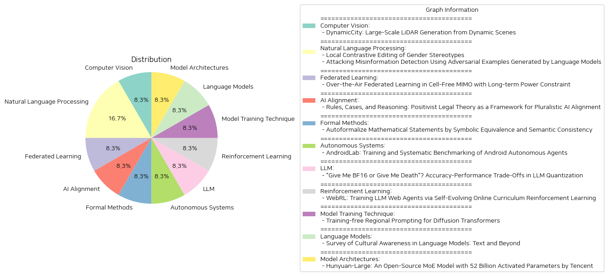

# Daily Artificial Intelligence Insights : Papers

## 🪐 Computer Vision

**요약:**

보고서 요약:

1. 주요 주제 및 테마: 
   - LiDAR 장면 생성의 발전
   - 동적 환경에서 대규모 LiDAR 생성의 필요성
   - DynamicCity라는 새로운 4D LiDAR 생성 프레임워크 소개

2. 공통 키워드, 트렌드 및 패턴:
   - 대규모, 고품질 LiDAR 장면 생성
   - 4D 표현의 중요성과 HexPlane 사용
   - VAE 모델과 DiT 기반 확산 모델의 적용
   - 효율적인 네트워크 학습 및 재구성 정확도 개선
   - 다양한 조건에서의 4D 생성 응용

3. 주요 이벤트 및 핵심 정보 요약:
   - DynamicCity는 기존의 정적, 단일 프레임 장면 생성 방식의 한계를 넘어, 동적 환경에서의 변화를 포착하는 4D LiDAR 장면을 생성할 수 있다.
   - 두 가지 주요 모델이 사용된다: HexPlane 학습을 위한 VAE 모델과 HexPlane 생성을 위한 DiT 기반 확산 모델.
   - HexPlane 구조를 개선하기 위한 Projection Module과 3D 기능 볼륨 재구성을 위한 Expansion & Squeeze 전략이 포함되어 있다.
   - Padded Rollout Operation을 통해 HexPlane을 제곱 형태의 2D 기능 맵으로 재구성하여 다용도 4D 생성에 유연성을 제공한다.
   - CarlaSC 및 Waymo 데이터셋에 대한 실험 결과, DynamicCity가 기존 최첨단 4D LiDAR 생성 방법을 여러 지표에서 크게 능가한다는 것을 보여준다.

4. 이러한 사건들의 영향 분석:
   - DynamicCity는 자동차 산업 및 자율주행 기술에 중요한 영향을 미칠 수 있다.
   - LiDAR 데이터의 정밀한 처리와 분석이 가능해지면서 더 안전하고 효율적인 운행 환경을 제공할 수 있다.
   - 인프라 모니터링 및 스마트 시티 개발에서의 활용 가능성이 증가한다.

5. 결론 및 미래 발전 가능성:
   - DynamicCity의 발전은 LiDAR 기술의 새로운 가능성을 열어주며, 향후 다양한 응용 분야에서의 연구와 개발을 촉진할 것이다.
   - 공개 코드를 통해 이 분야에 관심 있는 연구자들이 추가적인 연구를 진행할 수 있는 동기 부여가 될 것으로 기대된다. 
   - 지속적인 데이터셋 보강과 알고리즘 최적화를 통해 더욱 발전된 결과를 예상할 수 있다.

**출처:**

 - DynamicCity: Large-Scale LiDAR Generation from Dynamic Scenes (https://deeplearn.org/arxiv/540398/dynamiccity:-large-scale-lidar-generation-from-dynamic-scenes)

## ❄️ Natural Language Processing

**요약:**

1. 핵심 주제 및 테마 추출:
   - 첫 번째 논문은 언어 모델(LM)의 매개변수에 내재된 성 고정관념과 같은 편향을 국소 대조 편집(local contrastive editing)을 통해 식별하고 수정하는 방법을 제안합니다.
   - 두 번째 논문은 텍스트 분류 알고리즘의 강건성을 시험하기 위해 언어 모델에 의해 생성된 적대적 예제를 사용하여 가짜 정보 탐지를 공격하는 방법을 조사합니다.

2. 공통 키워드, 트렌드 및 패턴 식별:
   - "언어 모델", "편향", "매개변수", "적대적 예제", "텍스트 분류" 등 공통적으로 등장하는 키워드들이 두 논문에서 나타납니다.
   - 두 논문 모두 언어 모델의 구조적 측면과 적용 방법에 집중하여 모델의 한계 또는 오류를 이해하고 개선하려는 경향이 있습니다.

3. 주요 사건 및 중요한 정보 요약:
   - 첫 번째 논문은 성 고정관념과 같은 편향이 언어 모델의 일부 가중치에서 어떻게 발현되는지를 분석하고, 국소 대조 편집을 통해 이러한 편향적 가중치를 정확하게 식별 및 제어할 수 있음을 실험을 통해 입증했습니다.
   - 두 번째 논문은 언어 모델을 사용하여 적대적 예제를 생성함으로써 가짜 정보 탐지를 방해하는 시나리오를 제시하고, 이를 위해 현실적인 질의를 설정하여 대안을 마련했습니다. TREPAT 솔루션이 긴 뉴스 기사와 같은 긴 텍스트에서 효과적으로 작동함을 입증했습니다.

4. 이러한 사건들이 다양한 부문에 미치는 영향 분석:
   - 첫 번째 논문의 접근 방식은 언어 모델의 공정성을 개선하고 편향을 줄이는 데 있어 중요한 발전을 제공하며, 이는 궁극적으로 인공지능 기술의 안전성과 신뢰성을 증진시킬 수 있습니다.
   - 두 번째 논문의 연구는 가짜 정보 탐지 시스템의 취약성을 드러내 언론 및 정보기술 부문에서 신뢰할 수 있는 콘텐츠 관리를 위해 더욱 강력한 알고리즘 개발의 필요성을 강조합니다.

5. 최종 요약 및 결론:
   - 첫 번째 논문은 언어 모델에서 편향을 인식하고 수정하는 구체적인 방법론을 제시하며, 이는 향후 편향 조정 전략 개발에 기여할 수 있습니다.
   - 두 번째 논문은 적대적 예제를 통해 가짜 정보 탐지 메커니즘의 허점을 노출함으로써, 이러한 알고리즘의 개선 필요성을 재차 강조하고 있습니다.
   - 미래에는 이러한 반대적인 알고리즘과 연구들이 교차하여 더욱 안정적이고 안전한 언어 모델과 정보 탐지 시스템이 나올 가능성이 높습니다.

**출처:**

 - Local Contrastive Editing of Gender Stereotypes (https://deeplearn.org/arxiv/540617/local-contrastive-editing-of-gender-stereotypes)
 - Attacking Misinformation Detection Using Adversarial Examples Generated by Language Models (https://deeplearn.org/arxiv/541784/attacking-misinformation-detection-using-adversarial-examples-generated-by-language-models)

## 👽 Federated Learning

**요약:**

**종합 요약 보고서**

1. **핵심 주제 및 테마 추출**
   - 인공지능을 지원하는 무선 네트워크
   - Over-the-Air Federated Learning (OTA FL)
   - Cell-free MIMO 시스템에서의 전송 및 분산 컴퓨팅
   - 최적화 문제: 전력 제어와 빔포밍의 공동 최적화
   - MOP-LOFPC 알고리즘: 리아프노프 최적화를 통한 제약 해소

2. **공통 키워드 및 패턴 식별**
   - 무선 네트워크
   - 인공지능
   - OTA FL
   - 셀프리 MIMO
   - 전력 제어 및 빔포밍
   - 모델 학습 손실
   - 장기 전력 제약
   - 최적성 간극

3. **주요 이벤트 및 핵심 정보 요약**
   - 무선 네트워크 내 OTA FL의 중요성이 증가하고 있음.
   - 셀프리 MIMO 시스템에서 OTA FL 적용 시, 전력 제약 하에서의 성능 향상을 위한 최적화 문제 제시.
   - MOP-LOFPC 알고리즘 개발 및 구현: 리아프노프 최적화 이용, 인과적 채널 상태 정보를 바탕으로 한 장기 제약 해소.
   - 실험 결과, 기존 기준보다 학습 손실과 전력 제약 간의 더 나은 균형성을 달성.

4. **이벤트가 다양한 분야에 미치는 영향 분석**
   - **통신 분야**: OTA FL 적용으로 인한 무선 네트워크의 효율성 증대 가능성.
   - **인공지능**: 분산 컴퓨팅의 새로운 패러다임을 통한 AI 모델 학습의 향상.
   - **에너지 관리**: 장기 전력 제약을 준수하면서도 최적의 성능을 제공하는 기술 개발.
   
5. **최종 결론 및 미래 개발 잠재력**
   - OTA FL은 무선 네트워크 및 인공지능 시스템 내에서 점점 중요한 역할을 차지할 것으로 보이며, 특히 셀프리 MIMO 시스템에서의 적용 가능성이 주목됨.
   - MOP-LOFPC와 같은 새로운 알고리즘을 통해 장기적인 전력 관리 문제를 해결하면서도 모델 성능을 최적화할 수 있는 방안이 제시됨.
   - 향후 OTA FL 및 관련 기술의 발전을 주시해야 하며, 다른 시스템 및 환경과의 통합 가능성이 높음.

이 보고서는 관련 분야 연구자 및 실무자들이 해당 기술을 이해하고 향후 연구 방향성을 설정하는데 도움을 제공할 것입니다.

**출처:**

 - Over-the-Air Federated Learning in Cell-Free MIMO with Long-term Power Constraint (https://deeplearn.org/arxiv/540628/over-the-air-federated-learning-in-cell-free-mimo-with-long-term-power-constraint)

## 🚀 AI Alignment

**요약:**

요약 보고서:

1. **주요 주제 및 테마 추출:**
   - 법 이론과 AI 정렬: 법 이론은 다원주의와 명세화라는 두 가지 주요 정렬 문제를 해결할 수 있는 틀을 제공합니다. 연구자들은 명확하지 않은 원칙들(예: 도움, 공정성)을 어떻게 구체화할지 결정해야 하며, 다양한 관점이 배제되지 않도록 해야 합니다.

2. **공통 키워드 및 패턴 식별:**
   - 다원주의, 명세화, 규칙과 사례의 상호작용, 민주주의적 권위, AI 케이스 생성.

3. **주요 사건 및 중요한 정보 요약:**
   - 법은 민주적 권위에 의해 공표된 일반 규칙이 시간이 지남에 따라 구체적으로 적용됨으로써 문제를 해결합니다.
   - 법의 이론들은 규칙에 내용물을 부여하는 사례를 만드는 AI를 사용하여 기존 민주적 정렬 프로세스를 개선할 수 있는 방법을 제공합니다.

4. **이러한 사건이 다양한 부문에 미치는 영향 분석:**
   - 법 이론을 AI 정렬에 적용함으로써 기술이 다양한 가치관을 포용할 수 있도록 함.
   - 민주적 과정의 개선으로 다원적 사회에서의 법 적용이 더욱 강화될 수 있음.

5. **최종 통합 요약 및 결론:**
   이 보고서는 법 이론이 AI의 다원적 정렬 문제를 해결할 수 있는 강력한 틀임을 강조합니다. 규칙과 사례의 상호작용이 어떻게 민주적 프로세스를 개선할 수 있는지 제시합니다. 향후 발전을 위해서는 AI가 다양한 관점과 가치를 포용할 수 있도록 지속적인 연구와 개선이 필요합니다. AI 기술이 다원주의적 사회의 가치를 어떻게 효과적으로 반영할 수 있을지 기대됩니다.

**출처:**

 - Rules, Cases, and Reasoning: Positivist Legal Theory as a Framework for Pluralistic AI Alignment (https://deeplearn.org/arxiv/541785/rules,-cases,-and-reasoning:-positivist-legal-theory-as-a-framework-for-pluralistic-ai-alignment)

## 🎠 Formal Methods

**요약:**

보고서 요약:

1. 주요 주제 및 테마 추출:
   - 주요 주제: 자동 정식화(Autoformalization), 대형 언어 모델(LLM), 수학 문제의 공식 언어 변환, 기호적 동등성 및 의미적 일관성.
   - 테마: 자연어를 공식 언어로 변환하는 자동화, 자동 정식화의 정확성 검증.

2. 공통 키워드, 트렌드 및 패턴 식별:
   - 공통 키워드: 자동 정식화, 대형 언어 모델, 기호적 동등성, 의미적 일관성, 자동 정리 증명기.
   - 트렌드: 대형 언어 모델을 통해 수학 문제의 자동 정식화가 가능해짐, 자동 정식화의 정확성 격차 해소를 위한 새로운 프레임워크 제안.

3. 각 논문에서의 주요 사건 및 핵심 정보 요약:
   - 이 논문에서는 수학에서 자연어 기술을 공식 언어로 자동 변환하는 자동 정식화 작업의 어려움을 다룬다. 대형 언어 모델의 발전으로 경쟁 수준의 수학 문제도 공식화하는 데 유망한 능력을 보이지만, 자동 정식화의 초기 정확성과 후속 정확성의 큰 격차가 존재한다는 점을 강조한다. 이를 해결하기 위한 새로운 프레임워크로, '기호적 동등성'과 '의미적 일관성'이라는 두 가지 보완적 방법을 사용해 k개의 자동화 정식화 후보 중 가장 적합한 결과를 선택한다.

4. 이러한 사건이 다양한 분야에 미치는 영향 분석:
   - 이 연구는 수학뿐만 아니라 여러 도메인에서의 자연어 기술에 대한 자동 정식화의 정확성을 개선함으로써, 교육, 연구 개발, 인공지능 시스템 구축 등 다양한 분야에 기여할 수 있다. 특히, 정확한 자동 정식화는 수학 교육에서 중요한 역할을 할 수 있으며, 시스템의 정확성을 보장하여 AI 기술 발전에 큰 도움을 줄 수 있다.

5. 최종 통합 요약 및 결론, 잠재적 미래 발전:
   - 결론적으로, 이 논문은 대형 언어 모델 및 새로운 기법들을 통해 자연어 문제를 공식적으로 더 정확하게 변환하는 방법을 제시하고 있어 그 중요성을 가진다. 이러한 발전은 특히 수학 분야의 자동화 도구 개발과 수학적 문제 해결의 효율성 증대에 중요한 기여를 할 것이다. 앞으로 자동 정식화의 정확성을 더욱 높이기 위해 기계 학습 모델의 정교화와 데이터셋의 확장 등이 필요할 것이다. 이러한 기술 발전은 자연어 처리와 그 외 다양한 AI 응용 분야에 중요한 영향을 미칠 것으로 예상된다.

**출처:**

 - Autoformalize Mathematical Statements by Symbolic Equivalence and Semantic Consistency (https://deeplearn.org/arxiv/541786/autoformalize-mathematical-statements-by-symbolic-equivalence-and-semantic-consistency)

## 🌞 Autonomous Systems

**요약:**

1. **주요 주제 및 테마 추출**: 이 논문은 'AndroidLab'이라는 체계적인 안드로이드 에이전트 프레임워크를 소개하고, 자율 에이전트의 중요성과 안드로이드 에이전트의 최근 트렌드를 다룬다. 

2. **공통 키워드, 트렌드, 패턴 식별**: 안드로이드 에이전트, 오픈소스 모델, 닫힌 소스 모델, 체계적 벤치마킹, 대형 언어 모델(LLMs), 멀티모달 모델(LMMs), 성공률 향상, 오픈소스화 등이 반복적으로 언급된다.

3. **주요 사건 및 중요한 정보 요약**: 이 연구는 안드로이드 에이전트를 위한 새로운 프레임워크인 'AndroidLab'을 제안하며, 다양하고 재현 가능한 벤치마크를 제공한다. 또한 9개의 앱에 걸쳐 138개의 과제를 포괄하는 안드로이드 가상 디바이스를 활용하여, LLM 및 LMM의 성공률을 각각 21.50%와 13.28%까지 향상시켰다. 

4. **이러한 사건이 다양한 분야에 미치는 영향 분석**: AndroidLab의 출시는 안드로이드 에이전트의 개발과 평가를 용이하게 만들어, 다양한 상용 및 연구용 애플리케이션 개발에 있어 큰 영향을 미칠 것으로 보인다. 이는 특히 자동화된 시스템이 실제 환경과 상호작용하는 능력을 향상시켜 줄 것으로 기대된다.

5. **최종 통합 요약 및 향후 개발 주목**: 결론적으로 AndroidLab은 안드로이드 에이전트 연구의 속도와 정확성을 크게 높일 수 있는 혁신적인 플랫폼이다. 앞으로도 이러한 시스템을 이용한 다양한 애플리케이션 개발의 가속화가 예상되며, 특히 학습된 모델의 적용 범위가 확장될 가능성이 높다. 이러한 발전은 자율 에이전트가 실생활에서 더 넓게 활용되게끔 할 중요한 계기가 될 것이다.

**출처:**

 - AndroidLab: Training and Systematic Benchmarking of Android Autonomous Agents (http://arxiv.org/abs/2410.24024v2)

## 🍋 LLM

**요약:**

보고서 요약:

1. 주요 주제 및 테마:
   - 대형 언어 모델(LLM)의 양자화 및 성능 향상.
   - 다양한 양자화 형식의 정확성과 성능 간의 트레이드오프 분석.
   - FP8, INT8, INT4 같은 인기 있는 양자화 형식의 비교 연구.

2. 공통 키워드, 트렌드, 패턴:
   - 양자화 정확성 및 성능.
   - 모델 성능 복구 및 향상 기술.
   - 다양한 GPU 아키텍처에서의 추론 성능 분석.
   - 고급 GPU에서의 비동기 연속 배치 배포 기술.

3. 주요 이벤트 및 핵심 정보:
   - 전체 Llama-3.1 모델 가족을 대상으로 한 양자화 정확성 평가.
   - FP8 및 INT8 형식이 적절히 조정될 경우 손실이 거의 없는 정확성 유지.
   - INT4 가중치 전용 양자화는 8비트 정수 가중치 및 활성화 양자화와 경쟁력이 있음.
   - W4A16 형식은 동기 배포에서 비용 효율적이고, 중급 GPU에서 비동기 배포에서 탁월함.

4. 이러한 이벤트의 영향을 통해 보고된 부문의 분석:
   - 양자화 기술의 발전이 LLM의 추론 속도와 정확성을 어떻게 향상시키는가.
   - 적절한 양자화 형식 선택이 얼마나 배포 환경과 관련된 성능에 영향을 미치는가.
   - 업데이트된 가이드라인을 통해 다양한 모델 규모에서의 양자화된 LLM 배포가 간소화됨.

5. 최종 요약, 결론 및 미래 발전 가능성:
   본 연구는 대형 언어 모델의 양자화 기술 발전과 정확성-성능 트레이드오프 이해에 중요한 기여를 하였으며, 다양한 양자화 형식을 통해 특정 배포 환경에 맞춰 최적화할 수 있는 방법을 제공한다. 앞으로는 더 고급화된 GPU와 다양한 신경망 구조에 맞춘 더욱 정교한 양자화 형식 연구가 이루어질 것이며, 이는 LLM의 효율적인 실시간 응답성 및 배포 최적화로 이어질 것이다.

**출처:**

 - "Give Me BF16 or Give Me Death"? Accuracy-Performance Trade-Offs in LLM Quantization (http://arxiv.org/abs/2411.02355v1)

## 💙 Reinforcement Learning

**요약:**

1. 주요 주제 및 테마 추출:
   - 대형 언어 모델(LLMs)의 웹 기반 자율 에이전트로서의 잠재력
   - 고유 LLM API의 의존성 문제
   - 개방형 LLM의 의사 결정 능력 부족
   - WebRL을 통한 자가 진화 온라인 커리큘럼 강화 학습 프레임워크

2. 공통 키워드, 트렌드 및 패턴:
   - 자율 에이전트
   - 웹 기반 작업
   - 개방형 LLM
   - 강화 학습
   - 정책 분포 드리프트
   - 성과 지향형 보상 모델

3. 주요 이벤트 및 중요 정보 요약:
   - WebRL이 소개한 자가 진화 커리큘럼은 실패한 시도로부터 새로운 작업을 생성
   - 강력한 성과 감시 보상 모델(ORM) 및 적응형 강화 학습 전략 활용
   - WebRL을 통해 열린 Llama-3.1 및 GLM-4 모델을 효과적인 웹 에이전트로 변환

4. 이러한 이벤트의 다양한 부문에 대한 영향 분석:
   - 웹 기반 자율 시스템 개발 가능성 확대
   - 개방형 LLM의 활용 가치 상승
   - 고비용의 독점 LLM API 의존도 감소 가능성
   - 자율 웹 상호작용 시스템 접근성 증가

5. 최종 요약 및 결론과 잠재적 미래 개발:
   WebRL은 개방형 LLM과 독점 LLM 기반 웹 에이전트 사이의 격차를 효과적으로 해소하여, 더 강력하고 접근 가능한 자율 웹 상호작용 시스템의 발전 가능성을 제시합니다. 이를 통해 웹 기반 자율 시스템의 성능을 대폭 향상시키며, Llama-3.1 및 GLM-4 모델을 성공적으로 돋보이게 만들어 향후 이러한 기술의 발전과 적용범위 확장을 기대할 수 있습니다.

**출처:**

 - WebRL: Training LLM Web Agents via Self-Evolving Online Curriculum Reinforcement Learning (http://arxiv.org/abs/2411.02337v1)

## 🫧 Model Training Technique

**요약:**

보고서 요약:

1. **주요 주제와 테마**:
   - 딥러닝 기반의 확산 모델과 텍스트-이미지 생성에서의 성능.
   - 대형 언어 모델(T5, Llama)과의 결합으로 인해 향상된 의미 이해 능력.
   - 긴 복잡한 텍스트 프롬프트의 처리 한계.
   - 기존 UNet 기반 모델(SD1.5, SDXL)의 지역적 프롬프트 방식.
   - 새로운 확산 변환기(DiT) 아키텍처(SD3, FLUX.1)를 위한 지역적 프롬프트 방법 제안.

2. **공통 키워드, 트렌드 및 패턴**:
   - 확산 모델, 텍스트-이미지 생성, 대형 언어 모델, 지역적 프롬프트, DiT 아키텍처.

3. **주요 이벤트 및 중요한 정보**:
   - 프롬프트를 통해 복합적이고 다양한 텍스트를 다루는 확산 모델의 능력 증대.
   - UNet 기반 모델의 지역적 프롬프트 방법이 제안되었으나 DiT 아키텍처를 위한 구현 부족.
   - FLUX.1에서의 지역 프롬프트 방법 구현을 통해 주의력 조작을 기반으로 DiT의 세밀한 구성적 텍스트-이미지 생성 능력 강화.
   - 코드가 공개되어 있어 더 많은 연구와 응용 가능성 존재.

4. **이벤트의 각 분야에 미치는 영향**:
   - 텍스트-이미지 생성 분야에서의 정확도 및 다양성 향상 기대.
   - 인공지능 기반 콘텐츠 생성 및 자동화 분야에서의 새로운 기술적 도구로의 활용 증가.
   - 대형 언어 모델과의 통합을 통해 보다 복잡한 텍스트 이해 및 처리 가능성 증가.

5. **최종 종합 요약 및 향후 개발 방향**:
   - 이 연구는 특히 DiT 아키텍처를 위한 새로운 지역적 프롬프트 방법의 필요성을 충족시키며, 훈련 없이 고도로 복잡한 텍스트를 처리할 수 있는 혁신적 방법을 제시한다.
   - 향후 연구에서는 제안된 방법의 다양한 적용 분야 탐색 및 다른 확산 모델과의 통합 연구가 기대된다.
   - 텍스트-이미지 생성의 정확성 및 복합성 처리 능력 향상은 다양한 산업 분야에 긍정적인 영향을 미칠 것으로 보이며, 관련 기술의 지속적 발전이 중요할 것이다.

**출처:**

 - Training-free Regional Prompting for Diffusion Transformers (http://arxiv.org/abs/2411.02395v1)

## 🪄 Language Models

**요약:**

제목: '언어 모델에서의 문화적 인식 조사: 텍스트와 그 너머'

1. 주요 주제 및 테마 추출:
   - 대규모 언어 모델(LLM)의 문화적 민감성
   - 심리학 및 인류학에 기반한 문화 연구
   - 텍스트 기반 및 다중 모달 언어 모델에서의 문화적 인식
   - 문화적 인식 벤치마킹과 데이터셋 생성
   - 문화적 정렬의 윤리적 함의 및 인간-컴퓨터 상호작용(HCI)

2. 키워드 및 트렌드 식별:
   - 문화적 민감성, 문화적 포용성
   - 다중언어성, 심리학, 인류학, 문화적 정렬
   - 데이터셋, 다운스트림 작업, 벤치마크, 윤리적 함의

3. 주요 사건 및 중요 정보 요약:
   이 논문에서는 대규모 언어 모델이 다양한 애플리케이션에 걸쳐 문화적으로 민감할 수 있도록 하는 노력을 조사합니다. 텍스트 기반 및 다중 모달 언어 모델에서 문화적 인식을 통합하는 방법론을 탐구하고, 문화적 인식을 벤치마킹하는 방법론을 살펴봅니다. 또한 문화적 정렬의 윤리적 함의와 인류학 및 심리학 연구 결과를 어떻게 적용할 수 있는지를 논의합니다.

4. 사건의 영향 분석:
   이러한 연구는 언어 모델의 포용성 증진 뿐만 아니라, 사용자의 다양한 문화적 배경을 이해하고 반영하는 데 기여할 수 있습니다. 이는 특히 챗봇, 가상 비서 등과 같은 애플리케이션에서 사용자 경험을 향상시킵니다. 또한, 사회과학 연구에서의 문화 정렬의 역할을 강화하고 문화적 포용성을 촉진하는 데 기여할 수 있습니다.

5. 최종 요약 및 미래 개발:
   본 논문은 언어 모델에서 문화적 인식을 증진하기 위한 연구의 현황을 검토하고 기존의 문헌에서의 공백을 채우기 위한 미래 연구 방향을 제시합니다. 문화적 차원의 통합은 다가오는 연구에서 계속적으로 주목받을 주제이며, 이는 다양한 문화적 배경의 사용자를 보다 효과적으로 포용할 수 있는 방법들을 탐구하는 데 중요한 기초가 될 것입니다.

**출처:**

 - Survey of Cultural Awareness in Language Models: Text and Beyond (http://arxiv.org/abs/2411.00860v1)

## 🎇 Model Architectures

**요약:**

보고서: 최근 텐센트에서 공개한 'Hunyuan-Large: 52 Billion Activated Parameters를 가진 오픈소스 MoE 모델'

1. 주요 주제 및 테마 추출:
   - Hunyuan-Large는 최대 3890억 개의 파라미터를 가진 오픈소스 트랜스포머 기반 전문가 혼합(MoE) 모델입니다.
   - 이 모델은 최대 256K 토큰을 처리할 수 있으며, 다양한 벤치마크에서 뛰어난 성능을 보이는 것으로 평가되었습니다.

2. 공통 키워드, 트렌드 및 패턴 식별:
   - 대규모 합성 데이터 사용
   - 전문가별 학습률 전략
   - 혼합 전문가 라우팅 전략
   - 키-값 캐시 압축 기법

3. 주요 사건 및 핵심 정보 요약:
   - Hunyuan-Large는 언어 이해 및 생성, 논리적 추론, 수학 문제 해결, 코딩, 긴 문맥 처리 및 집계 작업에서 LLama3.1-70B보다 우수한 성능을 보여주며, LLama3.1-405B와 비교할 때도 유사한 성능을 나타냈습니다.
   - 모델 스케일링 법칙 및 MoE 모델의 학습률 일정에 대한 연구를 통해 모델 개발과 최적화에 대한 통찰을 제공했습니다.
   - Hunyuan-Large의 코드와 체크포인트가 공개되어 미래의 혁신과 응용을 촉진합니다.

4. 이러한 사건이 여러 분야에 미치는 영향 분석:
   - AI 모델의 대규모 데이터 처리 능력 향상으로 다양한 분야의 문제 해결 가능성 증가
   - 고급 데이터 처리 기술 및 전략 개발을 통해 기존 모델의 한계 극복
   - 오픈 소스 배포를 통한 연구 및 산업 간 협력 증대

5. 최종 종합 요약 및 결론:
   Hunyuan-Large는 오픈 소스 커뮤니티에 강력한 트랜스포머 MoE 모델을 제공하여 AI 연구와 개발에 새로운 기준을 세웠습니다. 이 모델의 혁신적 전략과 공개된 자료는 연구원과 개발자들에게 귀중한 리소스로 작용할 것입니다. 앞으로 더 큰 규모와 복잡한 문제를 해결하기 위한 모델 최적화 및 새로운 데이터 처리 기술의 발전을 기대할 수 있습니다.

**출처:**

 - Hunyuan-Large: An Open-Source MoE Model with 52 Billion Activated Parameters by Tencent (http://arxiv.org/abs/2411.02265v1)

