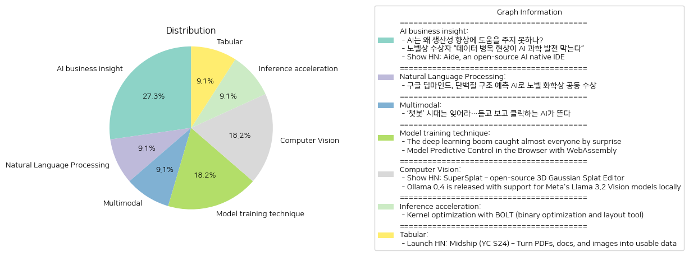

# Daily Artificial Intelligence Insights : News

## ⭐ AI business insight

**요약:**

**1. 주요 주제**:
   세 뉴스 기사에서 공통적으로 나타나는 주제는 인공지능(AI) 기술의 한계와 발전 가능성입니다. AI는 생산성을 향상시키고 과학적 발견을 보조하며 개발자들의 코딩 작업을 개선하는 데 사용되고 있습니다. 하지만 이러한 목적을 달성하기 위해서는 몇 가지 중요한 개선과 고품질 데이터의 확보가 필요합니다.

**2. 주요 사건**:
   - 첫 번째 기사에서는 AI가 생산성을 향상시키는 데 왜 충분한 성과를 내지 못하고 있는지를 분석합니다. 이는 중대한 기술적 개선이 요구되기 때문입니다.
   - 두 번째 기사에서는 노벨상 수상자가 고품질 데이터의 부재로 인해 AI 기술이 과학 발전을 저해하고 있음을 지적하고 있습니다.
   - 세 번째 기사는 개발자들이 Aide라는 오픈 소스 AI 네이티브 IDE를 사용하여 코드 변경을 용이하게 하고, linter 오류를 수정하는 데 AI의 도움을 받을 수 있음을 보여줍니다.

**3. 영향 분석**:
   - **경제**: AI의 성공적인 통합은 경제적 생산성을 크게 향상시킬 잠재력을 가지고 있습니다. 그러나 현재로서는 실질적인 경제적 이익을 보기 위해서는 기술 개선이 필요합니다.
   - **과학**: AI가 과학적 발견을 지원하기 위해 중요한 역할을 할 수 있지만, 데이터 품질의 문제가 이 발전을 방해하고 있습니다.
   - **기술 개발**: Aide와 같은 도구는 개발자들에게 AI를 활용한 일상적인 작업 개선의 가능성을 제시하며, 궁극적으로 프로그래밍 환경을 혁신할 수 있습니다.

**4. 최종 요약**:
   최근 뉴스 기사들은 AI가 여러 분야에서 영향력을 발휘할 수 있음을 보여주지만, 이러한 기술이 진정한 가치를 발휘하기 위해서는 해결해야 할 과제가 많다는 것이 분명합니다. 생산성 향상과 과학적 발견에서의 활용을 극대화하려면 고품질 데이터 확보와 기술적 개선이 필수적입니다. 나아가, 개발 도구의 혁신은 AI의 일상적 사용을 용이하게 할 수 있습니다. 앞으로 이러한 문제들이 어떻게 해결될지 주목할 필요가 있으며, AI의 잠재력이 얼마나 현실화될지를 지켜보는 것이 중요합니다.

**출처:**

 - AI는 왜 생산성 향상에 도움을 주지 못하나? (https://www.technologyreview.kr/ai%eb%8a%94-%ec%99%9c-%ec%83%9d%ec%82%b0%ec%84%b1-%ed%96%a5%ec%83%81%ec%97%90-%eb%8f%84%ec%9b%80%ec%9d%84-%ec%a3%bc%ec%a7%80-%eb%aa%bb%ed%95%98%eb%82%98/)
 - 노벨상 수상자 “데이터 병목 현상이 AI 과학 발전 막는다” (https://www.technologyreview.kr/%eb%85%b8%eb%b2%a8%ec%83%81-%ec%88%98%ec%83%81%ec%9e%90-%eb%8d%b0%ec%9d%b4%ed%84%b0-%eb%b3%91%eb%aa%a9-%ed%98%84%ec%83%81%ec%9d%b4-ai-%ea%b3%bc%ed%95%99-%eb%b0%9c%ec%a0%84-%eb%a7%89%eb%8a%94/)
 - Show HN: Aide, an open-source AI native IDE (https://aide.dev/)

## 🚀 Natural Language Processing

**요약:**

1. **주요 테마**:
   - 인공지능(AI) 기술의 발전: AI를 활용한 과학적 진보가 주요 테마로 나타나고 있습니다.
   - 단백질 구조 예측: 구글 딥마인드의 AI 기술이 생화학 분야에 미친 영향 강조.
   - 과학 및 혁신의 결합: 과학과 혁신을 통해 새로운 방법론과 발견들이 이루어지고 있다는 것이 두드러집니다.

2. **주요 사건**:
   - 노벨 화학상 수상: 구글 딥마인드의 데미스 허사비스와 존 점퍼는 AI를 활용하여 단백질 접힘 문제를 해결해 노벨 화학상의 절반을 수상했습니다. 나머지 절반은 새로운 단백질을 창출한 데이비드 베이커에게 돌아갔습니다.

3. **영향 분석**:
   - **경제적 영향**: AI 기술의 발전이 과학 연구의 효율성을 높이고 새로운 산업 기회를 창출할 수 있는 잠재력을 가집니다. 특히, 신약 개발 과정을 단축시켜 생명과학 분야에서 큰 경제적 이익을 창출할 수 있습니다.
   - **사회적 영향**: 이러한 기술 발전은 질병 치료의 혁신을 가속화할 것이며, 의료 분야의 발전을 통해 인류 복지에 기여할 것으로 보입니다.
   - **정치적 영향**: AI 기술의 국제적 경쟁 심화로 인한 기술 리더십 확보 경쟁이 심화될 가능성이 있습니다.

4. **최종 요약**:
   이번 수상은 인공지능이 화학 및 생물학 분야에서 어떤 방식으로 혁신을 주도할 수 있는지를 보여주는 중요한 사례입니다. 이번 발견은 과학계에 큰 진전을 가져왔으며, 향후 AI를 통한 연구와 개발의 가속화가 예상됩니다. 특히, 의료 및 생명공학 분야에서의 응용 가능성이 높아짐에 따라 관련 기술의 지속적인 발전과 이에 따른 사회적, 경제적 변화가 주목할 필요가 있습니다. 이러한 맥락에서 AI 기술에 대한 윤리적 고려 및 글로벌 정책 조율이 필요할 것으로 예상됩니다.

**출처:**

 - 구글 딥마인드, 단백질 구조 예측 AI로 노벨 화학상 공동 수상 (https://www.technologyreview.kr/%ea%b5%ac%ea%b8%80-%eb%94%a5%eb%a7%88%ec%9d%b8%eb%93%9c-%eb%8b%a8%eb%b0%b1%ec%a7%88-%ea%b5%ac%ec%a1%b0-%ec%98%88%ec%b8%a1-ai%eb%a1%9c-%eb%85%b8%eb%b2%a8-%ed%99%94%ed%95%99%ec%83%81-%ea%b3%b5%eb%8f%99/)

## 🚀 Multimodal

**요약:**

1. **주요 주제**:
   - AI 기술의 진화: 텍스트 기반 AI 챗봇에서 음성과 영상 생성 기능을 갖춘 AI로의 전환
   - 기술 발전에 따른 변화: 새로운 AI 기능들이 기존 패턴을 바꾸고 있음
   - 인공지능의 응용 분야 확장: 음성과 영상의 통합 활용 가능성

2. **주요 사건**:
   - 텍스트 기반의 AI 챗봇 시대의 종말과 음성 및 영상 생성 AI 기술의 부상
   - 새로운 AI 기능들이 시장에 제공되고 있음

3. **영향 분석**:
   - 경제: AI의 발전이 관련 산업의 경쟁력을 강화하고 다양한 신규 서비스와 제품 출시에 영향을 미칠 수 있음
   - 사회: 사람들의 일상생활에 AI 기술이 더욱 깊이 관여할 가능성이 있으며, 새로운 소통 방식의 출현이 예상됨
   - 기술: AI 연구와 개발의 진척이 지속적으로 이뤄지며, 관련 기술의 채택과 활용도가 높아질 것으로 전망됨

4. **최종 요약**:
   - AI 기술의 급속한 발전이 텍스트 기반 챗봇 시대를 뒤로하고, 음성 및 영상 생성 AI 기술을 중심으로 하는 새로운 시대가 열리고 있다. 이러한 전환은 경제 전반에 걸쳐 혁신을 촉진할 것이며, 특히 인공지능 응용 분야의 다변화를 통해 다양한 산업 영역에서의 기술 활용이 늘어날 것이다. 앞으로 AI 기술이 어떻게 사회와 산업 전반에 영향을 미칠지 주목해야 하며, 관련된 정책과 규제의 개발 또한 필요할 것으로 보인다.

**출처:**

 - ‘챗봇’ 시대는 잊어라…듣고 보고 클릭하는 AI가 뜬다 (https://www.technologyreview.kr/%ec%b1%97%eb%b4%87-%ec%8b%9c%eb%8c%80%eb%8a%94-%ec%9e%8a%ec%96%b4%eb%9d%bc-%eb%93%a3%ea%b3%a0-%eb%b3%b4%ea%b3%a0-%ed%81%b4%eb%a6%ad%ed%95%98%eb%8a%94-ai%ea%b0%80-%eb%9c%ac%eb%8b%a4/)

## 🚀 Model training technique

**요약:**

**주요 주제**:
두 뉴스 기사에서 공통적으로 드러나는 주제는 기술 발전입니다. 첫 번째 기사에서는 딥러닝의 부활과 관련 기술의 발달을 다루고 있으며, 두 번째 기사에서는 현대 웹 기술을 활용한 예측 제어 시스템을 소개하고 있습니다. 인공지능과 웹 기술의 발전이 두 기사의 기본 주제입니다.

**주요 사건**:
1. **딥러닝의 대두**: Fei-Fei Li의 ImageNet 데이터셋과 Nvidia의 CUDA 플랫폼, Geoffrey Hinton의 역전파 알고리즘 등 딥러닝 기술의 주요 요소들이 결합되어, AlexNet과 같은 모델들이 탁월한 성능을 보이며 인공지능 연구의 방향성을 크게 변화시켰습니다.
   
2. **웹 기반 예측 제어**: 웹어셈블리(WebAssembly)를 이용하여 모델 예측 제어(Model Predictive Control)를 웹 환경에서 실행 가능하도록 구성한 사례입니다. 카트-폴 시스템을 통해 사용자들은 웹 애플리케이션을 통해 제어 행위를 예측하고 조작할 수 있습니다.

**영향 분석**:
- **경제적 영향**: 딥러닝의 발전은 자동화 및 데이터 처리의 효율성을 높이며, 다양한 산업에 걸쳐 경제적 기회를 창출하고 있습니다. 또한, 웹기반 기술의 발전은 새로운 비즈니스 모델을 창출하며 스타트업과 IT 기업들에게 혁신의 장을 제공합니다.
   
- **사회의 변화**: 이러한 기술 발전은 교육, 헬스케어 등 다양한 분야에 파급효과를 미치며 사람들의 일상과 사고방식에 변화를 유도합니다. 특히, 딥러닝과 같은 AI 기술은 사회적 인프라와 서비스의 혁신을 가능하게 합니다.

**최종 요약**:
이번 뉴스들은 기술 발전이 인공지능 분야와 웹기술을 중심으로 빠르게 이루어지고 있음을 보여줍니다. 딥러닝 기술의 부상과 웹어셈블리를 통한 예측 제어 시스템 개발은 앞으로 더욱 진화할 것으로 예상됩니다. 이러한 기술들이 다양한 산업에 미치는 영향력은 지속적으로 모니터링할 필요가 있으며, 특히 새로운 혁신의 기회와 사회적 변화의 가능성을 염두에 두어야 합니다. 다가오는 장래에서는 이러한 기술들이 경제와 사회를 어떻게 재편할지 주목할 필요가 있습니다.

**출처:**

 - The deep learning boom caught almost everyone by surprise (https://www.understandingai.org/p/why-the-deep-learning-boom-caught)
 - Model Predictive Control in the Browser with WebAssembly (https://garethx.com/posts/cart-pole-mpc/)

## ⭐ Computer Vision

**요약:**

1. **주요 테마**:
   - 뉴스 기사들에서 나타나는 주요 테마는 기술 발전과 오픈 소스의 강화입니다. 기계 학습과 3D 그래픽스가 중심 주제로 떠오르고 있으며, 이들 기술의 융합이 돋보입니다.
   - 또한, 새로운 소프트웨어의 출시와 이를 통한 사용자 인터페이스의 개선이 주목받고 있습니다.

2. **주요 사건**:
   - 첫 번째 기사는 'SuperSplat'이라는 고급 브라우저 기반의 3D Gaussian Splats 편집기를 소개하고 있습니다. 이 편집기는 오픈 소스로, 엔진에 구애받지 않는 것이 특징입니다.
   - 두 번째 기사는 Ollama 0.4의 소식을 전하며, 이 버전은 Meta의 Llama 3.2 Vision 모델을 로컬에서 지원하게 되었다고 설명하고 있습니다. 이미지 추가 기능이 강화되었으며, 각각의 모델 사용을 위한 VRAM 요구사항이 명시되어 있습니다.

3. **영향 분석**:
   - 기술 발전의 측면에서, 특별히 그래픽 및 AI 분야에서의 오픈 소스 발전은 많은 개발자와 기업에 긍정적인 영향을 끼칠 것입니다. 이는 사용자들이 다양한 플랫폼에서 더욱 많은 기능과 성능을 활용할 수 있도록 하며, 자원의 소비 효율성을 높입니다.
   - Ollama와 Llama 모델의 발전은 기계 학습과 비전 기술의 사용성을 높이고, 그래픽스 관련 기술들이 엔터프라이즈 및 연구 분야에서 더욱 폭넓게 활용될 가능성을 시사합니다.

4. **최종 요약**:
   - 이번 뉴스들은 오픈 소스의 중요성과 기술 발전의 방향성을 잘 보여주고 있으며, 다양한 분야에서의 기술 접근성을 확대할 가능성을 내포하고 있습니다. 이러한 기술 발전은 더 많은 사용자가 첨단 기술을 접할 수 있는 기회를 제공하며, 특히 개발자와 연구자 사이에서 큰 관심을 끌 것으로 보입니다. 향후, 이에 따라 AI, 그래픽스 등의 분야에서 지속적인 혁신을 기대할 수 있을 것입니다. 기술적 요구사항을 충족하기 위한 하드웨어 발전 역시 필수적일 것으로 예상됩니다.

**출처:**

 - Show HN: SuperSplat – open-source 3D Gaussian Splat Editor (https://playcanvas.com/supersplat/editor?load=https://raw.githubusercontent.com/willeastcott/assets/main/toy-cat.ply&camera.overlay=false&show.bound=false)
 - Ollama 0.4 is released with support for Meta's Llama 3.2 Vision models locally (https://ollama.com/blog/llama3.2-vision)

## 🎠 Inference acceleration

**요약:**

**Key Themes**:
- 커널 성능 최적화
- 바이너리 최적화 도구 BOLT의 활용
- 코드 지역성 개선을 통한 성능 향상
- 대형 IT 기업들의 채택 (페이스북, 구글)
- 다양한 아키텍처 지원 및 LLVM 프로젝트 통합

**Major Events**:
BOLT라는 바이너리 최적화 및 레이아웃 도구가 커널 성능을 최적화하기 위해 사용되고 있으며, 이를 통해 코드 지역성을 개선하고 성능을 크게 향상시키고 있다. BOLT는 GCC나 Clang과 함께 사용 가능하며, 페이스북과 구글과 같은 대형 IT 기업들이 이를 사용하여 상당한 성능 향상을 경험하였다. 또한, BOLT는 다양한 아키텍처를 지원하며 LLVM 프로젝트에 통합되었다는 점에서 중요성을 가진다.

**Impact Analysis**:
경제 면에서는 BOLT의 활용을 통해 IT 산업 전반의 효율성과 성능이 향상될 가능성이 높아지고, 이는 IT 회사들의 운영 비용 절감을 포함한 여러 장점을 제공하게 될 것이다. 사회적으로는 사용자들에게 더 빠르고 효율적인 기술 서비스를 제공함으로써 전반적인 사용자 경험을 향상시킬 수 있다. 기술적으로 BOLT의 발전 및 강력한 지원으로 더 많은 회사들이 이 도구를 도입하여 최적화된 솔루션을 개발하게 될 것이다.

**Final Summary**:
BOLT는 커널 성능 최적화를 위한 효과적인 도구로 자리 잡고 있으며, 대규모 기업들의 채택 사례에서 알 수 있듯이 중요한 성능 개선을 가능하게 하고 있다. 컴파일러와의 결합부터 다양한 아키텍처 지원까지 다양한 장점을 제공하며, 이는 IT 산업 전반에 걸친 효율성 향상으로 이어질 수 있다. 앞으로 BOLT의 기능이 더욱 확장되고 개선된다면, 더 많은 기업들이 이를 채택하여 경쟁력을 강화하고 산업 발전에 기여할 가능성이 높다. 주의 깊게 관찰해야 할 미래 발전 사항에는 BOLT의 추가 최적화 기능과 다양한 산업군의 적용 사례 확장이 포함되며, 이를 통해 더욱 포괄적인 기술향상을 기대할 수 있다.

**출처:**

 - Kernel optimization with BOLT (binary optimization and layout tool) (https://lwn.net/SubscriberLink/993828/eb9b437bf7604da3/)

## 🐱 Tabular

**요약:**

**1. 주요 테마:**

최근 뉴스 기사에서 주목할 주요 테마는 데이터 추출 및 분석 기술의 발전입니다. Midship를 포함한 여러 기업이 비정형 문서로부터 정보를 추출하여 사용 가능한 데이터로 변환하는 솔루션을 개발하고 있습니다. 이 기술은 점점 더 많은 분야에서 데이터 활용의 필요성이 증가하면서 주목받고 있습니다.

**2. 주요 사건:**

- **Midship의 도구 개발:** Max, Kieran, 그리고 Aahel 팀이 이끄는 Midship은 OCR(Optical Character Recognition, 광학 문자 인식) 및 언어 모델을 활용하여 PDF 및 이미지 같은 비정형 문서로부터 구조화된 데이터를 제공하는 도구를 개발하였습니다. 이 도구는 비기술 사용자와 개발자를 대상으로 하는 두 가지 사용자 유형을 지원합니다.

**3. 영향 분석:**

- **경제적 관점:** 데이터 추출 기술의 발달은 정보 처리 시간을 단축시키고, 비즈니스 의사 결정을 위한 데이터를 신속하게 제공함으로써 다양한 산업의 운영 효율성을 높일 것으로 기대됩니다. 특히 금융, 의료, 법률 분야에서 문서 처리 자동화가 경제적인 이점으로 작용할 수 있습니다.

- **사회적 관점:** 기술의 확산으로 인해 데이터 활용에 대한 이해가 넓어질 수 있으며, 이는 정보 격차를 줄이고 보다 평등한 기회를 제공하는 데 기여할 수 있습니다. 또한 비기술 사용자들조차 복잡한 데이터 분석이 가능해짐에 따라 사회 전반의 데이터 활용 역량이 향상될 것입니다.

**4. 최종 요약:**

Midship과 같은 기업들의 데이터 추출 기술 발전은 모든 산업 분야에 걸쳐 효율성을 높이고, 데이터 기반 의사 결정의 중요성을 부각시키고 있습니다. 향후 이러한 기술은 더욱 정교하고 빠르게 발전할 것이며, 이는 다양한 산업 영역에서 필수적인 도구로 자리 잡을 것입니다. 기업들은 지속적인 기술 발전을 통해 데이터를 통해 경쟁력을 강화하고, 이를 통해 발생할 수 있는 사회적 변화에 주목할 필요가 있습니다. 앞으로도 OCR 및 자연어 처리 기술의 발전과 그 활용 사례를 눈여겨볼 필요가 있습니다.

**출처:**

 - Launch HN: Midship (YC S24) – Turn PDFs, docs, and images into usable data (https://news.ycombinator.com/item?id=42066500)

