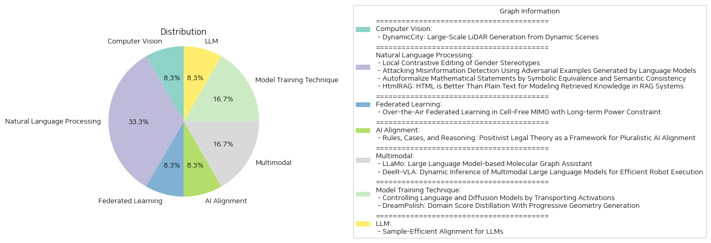

# Daily Artificial Intelligence Insights : Papers

## ☀️ Computer Vision

**요약:**

1. 주요 주제 및 테마 추출: 이 논문은 "DynamicCity"라는 프레임워크를 통해 동적 환경에서의 4D LiDAR 장면 생성 방식을 소개하고 있습니다. 이 연구는 고품질의 대규모 LiDAR 장면을 동적 환경의 시간적 진화를 포착하는 방법에 중점을 두고 있으며, 특히 HexPlane 및 다양한 Diffusion 모델을 활용합니다.

2. 공통 키워드, 트렌드 및 패턴 식별: 주요 키워드로는 'LiDAR', '4D 생성', 'HexPlane', 'VAE 모델', 'Diffusion 모델', 'CarlaSC 데이터셋', 'Waymo 데이터셋' 등이 있습니다. 최근 연구에서는 LiDAR 생성의 동적인 측면을 강조하고 있으며, 효율적인 데이터 처리 및 재구성을 위한 새로운 알고리즘이 개발되고 있는 추세입니다.

3. 주요 이벤트 및 핵심 정보 요약: DynamicCity는 기존의 정적 및 단일 프레임 장면 생성에서 벗어나, 실제 주행 환경의 동적 특성을 포착할 수 있는 4D LiDAR 장면 생성 프레임워크를 제시합니다. 이 시스템은 HexPlane의 4D 표현을 학습하는 VAE 모델과 Padded Rollout Operation을 활용해 HexPlane을 생성하는 DiT 기반의 확산 모델로 구성됩니다. 이 알고리즘은 다양한 조건을 통해 4D 생성 응용 프로그램을 지원하며, CarlaSC 및 Waymo 데이터셋을 활용한 실험을 통해 현재의 최첨단 4D LiDAR 생성 방법보다 뛰어남을 입증했습니다.

4. 이벤트가 다양한 분야에 미치는 영향 분석: DynamicCity는 자율 주행 차량 및 로보틱스 분야에서 LiDAR 데이터를 더 정확하고 효율적으로 생성·처리하는 데 중요한 기여를 할 수 있습니다. 특히, 이 기술은 지도 제작, 환경 인식, 장애물 회피와 같은 응용 프로그램에서의 정확성을 크게 향상시킬 수 있습니다.

5. 최종 종합 요약 및 결론: DynamicCity는 4D LiDAR 생성 기술의 새로운 차원을 제시하며, HexPlane과 같은 효율적인 데이터 구조와 확산 모델을 활용하여 기존의 방법들보다 뛰어난 성능을 보였습니다. 향후 이러한 기술은 더욱 복잡하고 다양한 동적 환경에서의 적용을 통해 자율 주행 및 로보틱스 연구에 획기적인 발전을 가져올 것으로 기대됩니다. 시간이 지남에 따라 이러한 기술들이 어떻게 진화하고 산업 전반에 미치는 영향을 관찰하는 것이 중요할 것입니다.

**출처:**

 - DynamicCity: Large-Scale LiDAR Generation from Dynamic Scenes (https://deeplearn.org/arxiv/540398/dynamiccity:-large-scale-lidar-generation-from-dynamic-scenes)

## ✈️ Natural Language Processing

**요약:**

1. **주요 주제 및 테마 추출**
   - 첫 번째 논문에서는 언어 모델(LM)에서 성 고정관념과 같은 편견을 발견하고 수정하기 위한 로컬 대조 편집 기술을 다루고 있습니다.
   - 두 번째 논문은 적대적 예제를 생성하여 허위 정보 탐지의 강인성을 시험하는 내용을 다루고 있습니다.
   - 세 번째 논문에서는 자연어를 수학적 형태로 자동 변환하는 자동 형식화의 발전을 다루고 있으며, 특히 의미적 일관성과 기호적 동등성을 통한 정확성을 향상시키는 방법에 중점을 두고 있습니다.
   - 네 번째 논문은 정보 생성 및 검색 시스템에서 HTML 형식이 일반 텍스트보다 더 효율적임을 주장하며, HTML의 구조적, 의미적 정보를 유지하는 방법을 제안하고 있습니다.

2. **공통 키워드, 트렌드 및 패턴 식별**
   - `언어 모델`, `편견`, `적대적 예제`, `자동 형식화`, `대조적 수정`, `HTML`, `허위 정보`, `구조 및 의미적 유지`와 같은 키워드와 테마가 주로 반복해서 나타납니다.
   - 기술의 발전을 통한 모델의 정확성 및 효율성 향상이 각 논문의 공통 트렌드로 관찰됩니다.

3. **주요 이벤트 및 중요한 정보 요약**
   - 언어 모델의 성 고정관념 등 편견을 찾고 수정을 시도하는 새로운 기술적 방법이 개발되었습니다.
   - 적대적 예제를 생성하여 허위정보 탐지 시스템의 강인성을 시험하는 절차가 확립되었습니다.
   - 수학적 명제를 자동으로 형식화하는 기술이 기호적 동등성과 의미적 일관성을 이용하여 개선되었습니다.
   - HTML 형식의 정보를 유지하면서 RAG 시스템의 효율성을 향상시키는 방법이 제안되었습니다.

4. **이벤트의 부문별 영향 분석**
   - **언어 기술**: 언어 모델에서 발견되는 편견을 체계적으로 교정함으로써 보다 공정하고 안전한 모델 구현의 가능성을 제시합니다.
   - **정보 검증**: 허위 정보 탐지 시스템의 강인성이 강화되어 더 정확한 정보 검증이 가능하게 됩니다.
   - **자동 형식화**: 교육 및 연구 분야에서 수학적 문제의 자동 형식화의 정확성이 향상되어 보다 효율적인 교육 도구로 활용될 수 있습니다.
   - **지식 생성 및 검색**: HTML 기반 접근법을 통해 보다 구조적이고 의미적으로 풍부한 정보를 생성해 내는 시스템들이 개선됩니다.

5. **최종 종합 요약 및 결론**
   - 최근 연구들은 언어 모델에서의 편견 수정, 자동 형식화의 개선, 허위 정보 탐지의 강화, 그리고 HTML 기반 정보 검색 시스템의 개선과 같은 다양한 분야에서의 기술 발전을 보여줍니다. 이러한 발전은 각각의 기술이 가지고 있는 문제점을 해결하고, 관련 산업과 연구 분야에 걸쳐 긍정적인 영향을 미칠 것으로 기대됩니다. 향후 상호 관련성을 가진 이 기술들이 어떻게 더욱 융합되어 더욱 복합적이고 혁신적인 해결책을 제시할 수 있을지 주목할 필요가 있습니다.

**출처:**

 - Local Contrastive Editing of Gender Stereotypes (https://deeplearn.org/arxiv/540617/local-contrastive-editing-of-gender-stereotypes)
 - Attacking Misinformation Detection Using Adversarial Examples Generated by Language Models (https://deeplearn.org/arxiv/541784/attacking-misinformation-detection-using-adversarial-examples-generated-by-language-models)
 - Autoformalize Mathematical Statements by Symbolic Equivalence and Semantic Consistency (https://deeplearn.org/arxiv/541786/autoformalize-mathematical-statements-by-symbolic-equivalence-and-semantic-consistency)
 - HtmlRAG: HTML is Better Than Plain Text for Modeling Retrieved Knowledge in RAG Systems (http://arxiv.org/abs/2411.02959v1)

## 🚀 Federated Learning

**요약:**

보고서 요약:

1. 주요 주제 및 테마:
   - 논문에서는 '공중 연합 학습(Over-the-Air Federated Learning)'이라는 주제를 중심으로 하고 있다. 이는 인공지능을 지원하는 무선 네트워크에서 중요한 응용 프로그램으로, 다양한 송신과 분산 컴퓨팅 특성 때문에 주목받고 있다.
   - '셀-프리 MIMO 시스템'에서의 공중 연합 학습을 다루며, 장기 전력 제약 조건을 고려한 최적화 문제를 공식화하고 있다.
   - 'MOP-LOFPC 알고리즘'이란 새로운 알고리즘을 소개하여, 라퓨노프 최적화를 활용해 장기 제약 조건을 각 라운드로 분리하면서 사례 기반 채널 상태 정보를 사용하도록 한다.

2. 공통 키워드, 트렌드 및 패턴:
   - 무선 네트워크, 인공지능, 공중 연합 학습, 셀-프리 MIMO, 최적화 문제, 전력 제약 조건, 알고리즘, 라퓨노프 최적화.

3. 주요 이벤트 및 핵심 정보 요약:
   - 이 논문은 셀-프리 MIMO 시스템에서의 공중 연합 학습에 대한 오류 한계를 도출하고, 전력 제어와 빔포밍의 공동 최적화를 통해 최적의 갭을 최소화하고자 하는 최적화 문제를 제시한다.
   - 새로운 알고리즘인 MOP-LOFPC를 도입하여 장기 전력 제약 조건과 모델의 교육 손실 간의 더 나은 균형을 달성하고, 기존의 기준선과 비교하여 더 유연한 접근을 제안한다.

4. 이러한 이벤트가 다양한 분야에 미치는 영향 분석:
   - 이 연구는 인공지능을 활용하는 무선 통신 분야에서의 효율성 및 성능 개선에 기여할 수 있다. 셀-프리 MIMO 시스템에서 더 나은 전력 효율성을 추구함으로써 통신 인프라의 운영 비용 절감과 더 나은 성능을 기대할 수 있다.

5. 최종 통합 요약 및 결론 및 미래 발전 가능성:
   - 이 논문은 셀-프리 MIMO 환경에서 효과적으로 학습을 수행하기 위한 새로운 알고리즘의 가능성을 제시하며, 공중 연합 학습과 관련한 장기 전력 제약 문제를 해결할 수 있는 잠재적 솔루션을 제공한다.
   - 앞으로 보다 효율적인 전력 관리 및 모델 최적화를 위한 연구가 지속될 것이며, 다양한 통신 환경에서의 적용 가능성 또한 탐색될 것으로 보인다. 이는 장기적으로 무선 네트워크 및 인공지능 분야의 혁신적인 발전을 촉진할 수 있을 것이다.

**출처:**

 - Over-the-Air Federated Learning in Cell-Free MIMO with Long-term Power Constraint (https://deeplearn.org/arxiv/540628/over-the-air-federated-learning-in-cell-free-mimo-with-long-term-power-constraint)

## ☀️ AI Alignment

**요약:**

### 종합 요약 보고서

#### 주요 주제 및 테마 추출

- 법 이론
- AI 정렬
- 다원주의와 명확화
- 법적 사례와 규칙의 상호작용

#### 공통 키워드, 추세, 패턴

- 법: 법 이론은 다원성과 명확화 문제 해결에 도움을 줄 수 있음
- 규칙과 사례: 법은 규칙의 구체적 적용을 통해 실질적 의미를 도출
- 민주적 정렬 과정: AI를 사용하여 규칙에 내용을 부여하여 더 다원주의적인 정렬을 추구

#### 주요 사건 및 중요한 정보 요약

1. **법 이론과 AI 정렬 문제 해결:**
   - 법 이론은 AI 정렬의 주요 문제인 다원주의와 명확화에 대한 해결책을 제시할 수 있다.
   - 법에서처럼 AI 정렬에서도 민주적 권위에 의해 제정된 일반 규칙들을 시간이 지남에 따라 구체적인 사례를 통해 적용해야 한다.

2. **규칙과 사례의 상호작용:**
   - 법은 규칙과 사례가 상호작용하여 구체적이고 실질적인 의미를 도출하면서도 다양한 가치에 대한 의견 불일치를 허용한다.
   - 이는 AI 정렬 프로세스 개선에 대한 통찰을 제공하여 더 다원주의적인 정렬 방법론 개발에 기여할 수 있다.

#### 사건의 영향 분석

- **법적 프레임워크의 AI 적용:**
  - 법의 원칙을 AI 정렬에 적용하면 더 명확하고 다원적인 시스템을 만들 수 있다.
  - 이를 통해 AI 기술은 다양한 삶과 가치를 반영하는 보다 포괄적인 접근 방식을 채택할 수 있을 것이다.

#### 결론 및 미래에 주목할 발전

- 법 이론의 규칙 및 사례 기반 접근 방식은 AI 정렬에 실질적 개선책을 제공한다.
- 이러한 접근 방식을 통해 AI는 민주적 프로세스를 강화하고 다양한 가치가 반영된 사회적 조율을 지원할 것이다.
- 향후 발전 방향은 법적 원칙을 AI 기술에 통합하여 보다 포괄적이고 균형 잡힌 AI 시스템을 구축할 수 있는 방법을 모색하는 데 있다.

**출처:**

 - Rules, Cases, and Reasoning: Positivist Legal Theory as a Framework for Pluralistic AI Alignment (https://deeplearn.org/arxiv/541785/rules,-cases,-and-reasoning:-positivist-legal-theory-as-a-framework-for-pluralistic-ai-alignment)

## 🎈 Multimodal

**요약:**

### 요약 보고서

1. **주요 주제 및 테마 추출:**
   - 두 논문 모두 대형 언어 모델(LLM) 및 멀티모달 대형 언어 모델(MLLM)의 응용에 중점을 둔 연구이다.
   - 첫 번째 논문은 분자 그래프에 대한 LLM의 응용을 다루며, 두 번째 논문은 로봇 실행을 위한 MLLM의 동적 추론을 다룬다.

2. **공통 키워드, 트렌드 및 패턴:**
   - **대형 언어 모델(LLM):** 두 논문 모두 LLM의 가능성을 다른 도메인(분자 구조, 로봇)으로 확장하는 데 중점을 두고 있다.
   - **효율성 및 성능 개선:** 두 연구 모두 효율성과 성능을 향상시키기 위한 방법론적 개선을 강조한다.
   - **자원 제약 하의 운영:** 둘 다 자원 제약(계산 능력, 메모리 사용) 하에서도 모델의 효과적인 운영을 목표로 한다.

3. **주요 사건 및 중요 정보 요약:**
   - **LLaMo**: 대형 언어 모델을 분자 그래프 구조로 확장, 그래프 표현을 언어 토큰으로 변환하여 다양한 분자 관련 작업에서 탁월한 성능을 발휘한다.
   - **DeeR-VLA**: 자원이 제한적인 로봇에게 적합한 동적 멀티모달 대형 언어 모델을 개발, 특정 상황에 적합한 모델 크기를 자동으로 활성화하여 불필요한 계산을 줄이고 효율적인 로봇 실행을 지원한다.

4. **이들 사건의 다양한 분야에 대한 영향 분석:**
   - **과학 및 화학**: LLaMo는 분자 구조의 자동화된 설명 생성, 성질 예측 등에서 활용될 수 있으며, 이는 연구 및 산업적 활용도를 높일 수 있다.
   - **로봇 공학**: DeeR-VLA는 제한된 컴퓨팅 자원을 가진 로봇에서도 고성능의 언어-비전 통합 모델을 구현할 수 있는 가능성을 제시하며, 특히 현장작업 자동화에 기여할 수 있다.

5. **최종 요약 및 향후 발전 가능성:**
   - LLM과 MLLM을 다양한 도메인에 맞춰 확장하여 효율성을 높이는 연구가 활발히 진행 중이다.
   - 이러한 모델들은 과학 연구 및 실생활 응용에 큰 영향을 미칠 수 있으며, 향후 더 많은 연구를 통해 더욱 정교하고 강력한 해결책이 제시될 것으로 기대된다.
   - LLaMo와 DeeR-VLA의 발전은 분자 및 로봇 산업에서 자동화 및 효율성 개선의 새로운 방향성을 제시하며, 이를 통한 혁신적인 성과가 기대된다.

**출처:**

 - LLaMo: Large Language Model-based Molecular Graph Assistant (http://arxiv.org/abs/2411.00871v1)
 - DeeR-VLA: Dynamic Inference of Multimodal Large Language Models for Efficient Robot Execution (http://arxiv.org/abs/2411.02359v1)

## 🧸 Model Training Technique

**요약:**

보고서 요약:

두 논문은 각각 모델 생성 제어와 3D 생성 모델에 관한 중요한 연구를 다루고 있습니다. 각 논문의 핵심 주제와 주요 내용을 종합하여 다음과 같이 요약합니다.

1. 논문의 주요 주제 및 내용:
   - 'Controlling Language and Diffusion Models by Transporting Activations'는 대규모 생성 모델의 신뢰성, 안전성 및 오용 가능성을 해결하기 위한 방법론인 Activation Transport (AcT)를 소개합니다. AcT는 최적 운송 이론을 통해 모델 활성화를 제어하여 생성된 출력에서 특정 개념이나 행동의 출현을 유도하거나 방지할 수 있도록 도와줍니다. 이는 큰 언어 모델과 텍스트-이미지 변환 모델에서 효과적으로 독성 완화, 임의 개념 유도, 스타일 제어 및 개념 부정에 기여합니다.

   - 'DreamPolish: Domain Score Distillation With Progressive Geometry Generation'는 고품질 3D 텍스처와 정제된 기하를 생성하는 텍스트-3D 생성 모델인 DreamPolish를 제안합니다. 이 모델은 여러 신경 표현을 사용하여 안정적인 합성 과정을 강화하며, 표면 세부 사항을 개선하기 위한 추가적인 노멀 추정자를 통해 기하 세부 사항을 정제합니다. 텍스처 생성 단계에서는 새로운 점수 증류 목적을 도입하여 고퀄리티의 3D 자산을 생성합니다.

2. 공통 키워드 및 패턴:
   - 두 논문 모두 생성 모델의 향상을 위한 제어 및 정제 기술에 중점을 둡니다.
   - 생성 과정의 세부 조정과 최적화, 고품질 결과물 생성이라는 주제를 공통으로 다룹니다.

3. 각 논문의 주요 사건 및 정보 요약:
   - AcT는 활성화를 최적화하여 모델링 능력을 유지하면서 모델 출력을 세밀하게 제어할 수 있으며, 이를 통해 독성을 완화하고, 충실성을 높일 수 있습니다.
   - DreamPolish는 신경 표현의 안정성과 텍스처 품질을 극대화하기 위해 기하 생성 단계의 다양한 관점에서 세부적인 정제를 수행합니다.

4. 이러한 사건의 다양한 분야에 미치는 영향 분석:
   - AcT를 통한 제어 기술은 언어 모델과 이미지 생성 모델에서 윤리와 안정성을 높이는 데 기여할 수 있습니다.
   - DreamPolish는 3D 콘텐츠 제작의 품질 향상 및 새로운 디자인 방식을 제시함으로써 그래픽 디자인과 게임 산업에서 중요한 역할을 할 수 있습니다.

5. 최종 요약 및 결론:
   두 논문은 생성 모델의 제어 및 정제 기술을 통해 모델의 성능과 결과물을 개선할 수 있는 방법을 제시합니다. AcT는 언어 및 영상 모델에서 제어 능력을, DreamPolish는 3D 모델의 기하와 텍스처 품질을 향상시키는데 중심을 두고 있습니다. 앞으로 이러한 기술은 더욱 넓은 분야에서 활용될 가능성이 여전히 존재하며, 윤리적 기준 및 사용자 정의 옵션에 대한 요구가 증가할 것으로 기대됩니다.

**출처:**

 - Controlling Language and Diffusion Models by Transporting Activations (http://arxiv.org/abs/2410.23054v1)
 - DreamPolish: Domain Score Distillation With Progressive Geometry Generation (http://arxiv.org/abs/2411.01602v1)

## 🪸 LLM

**요약:**

제목: '대형 언어 모델(LLM)들의 샘플 효율적인 정렬'

요약: 본 논문은 제한된 온라인 피드백을 바탕으로 대형 언어 모델(LLM)을 인간의 선호에 맞추기 위한 샘플 효율적인 방법을 연구합니다. 우리는 LLM 정렬 문제를 문맥적 결투 밴딧 상황으로 구성하여, 여기에는 온라인 RLHF와 온라인 DPO와 같은 최근 패러다임을 포함하고 있습니다. 이러한 구성은 온라인 능동 탐사를 통합하는 샘플 효율적인 알고리즘을 요구합니다. 밴딧 이론의 통찰력을 활용하여 톰슨 샘플링에 기반한 통합 알고리즘을 소개하고, 두 가지 LLM 정렬 시나리오에서의 응용을 강조합니다. 효과적으로 이 알고리즘을 구현하는 실용적인 에이전트인 SEA(Sample-Efficient Alignment)가 세 가지 모델 크기(1B, 2.8B, 6.9B)와 세 가지 선호 학습 알고리즘(DPO, IPO, SLiC)에 걸친 광범위한 실험을 통해 실증적으로 검증되었습니다. 결과는 SEA가 오라클의 선호를 기준으로 한 샘플 효율적인 정렬을 달성하며, 최근의 LLM에 대한 능동 탐사 방법을 능가함을 보여줍니다. 추가로, 우리는 LLM의 온라인 정렬을 위한 고효율 코드베이스와 함께 SEA의 구현을 공개하여 이 분야의 미래 연구를 가속화할 목적입니다.

주요 주제 및 테마: 대형 언어 모델 정렬, 샘플 효율성, 문맥적 결투 밴딧, 온라인 능동 탐사, 톰슨 샘플링, 선호 학습 알고리즘

경향 및 패턴: 본 연구는 대형 언어 모델의 정렬 문제를 해결하기 위해 효율적인 알고리즘 개발에 중점을 두며, 샘플 효율성과 온라인 탐사의 접목을 강조합니다.

주요 사건 및 정보: SEA 알고리즘의 개발 및 검증, DPO 등 선호 학습 알고리즘과의 비교 실험

영향 분석: LLM의 샘플 효율적인 정렬은 언어 모델의 사용 용이성과 정확성을 높이며, 인공지능 분야 연구자들에게 새로운 접근 방식을 제공합니다.

추론 및 미래 발전: 미래 연구는 개선된 정렬 알고리즘 개발을 통해 LLM의 인간 선호 적합성을 더욱 높일 수 있을 것으로 예측됩니다. SEA의 코드베이스 공개는 관련 연구의 확산 및 발전을 촉진할 것입니다.

**출처:**

 - Sample-Efficient Alignment for LLMs (http://arxiv.org/abs/2411.01493v1)

