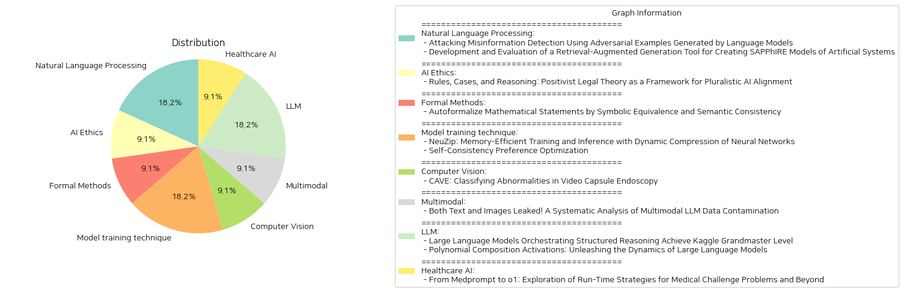

# Daily Artificial Intelligence Insights : Papers

## 🐱 Natural Language Processing

**요약:**

보고서 요약:

1. 주요 주제 및 테마 추출:
   - 첫 번째 논문은 '언어 모델을 사용하여 생성한 적대적 예제를 통한 허위 정보 탐지 공격'에 대해 다루고 있습니다. 주된 초점은 거짓 정보, 선전, 루머 및 편향된 뉴스와 같은 낮은 신뢰도의 콘텐츠를 탐지하는 텍스트 분류 알고리즘의 강건성을 테스트하기 위한 적대적 예제 생성을 다룬다는 것입니다.
   - 두 번째 논문은 '인공 시스템의 SAPPhIRE 모델 생성 및 평가를 위한 검색 보강 생성 도구의 개발'에 관한 것입니다. 여기서는 SAPPhIRE 인과 모델이 디자인을 유추하는 데 어떻게 유용한지를 설명하고, 대형 언어 모델을 활용하여 SAPPhIRE 모델을 구조적으로 설명하는 방법을 조사합니다.

2. 공통 키워드, 트렌드, 패턴 식별:
   - 두 논문 모두 대형 언어 모델(Large Language Models, LLMs)의 활용을 중심으로 논의됩니다.
   - 도구의 개발 및 평가를 통해 신뢰성과 정확성을 검토하고 있다는 공통된 주제가 발견됩니다.

3. 주요 이벤트 및 중요 정보 요약:
   - 첫 번째 논문에서는 적대적 예제를 생성하여 텍스트 분류기의 판단을 바꾸는 과정을 설명합니다. 특히, 장문의 기사에서 포괄적인 검색이 불가능한 상태에서 이 방법의 우수성을 확인했습니다.
   - 두 번째 논문에서는 SAPPhIRE 모델을 기반으로 한 인공 시스템의 구조화된 설명 생성을 위한 도구 개발이 이루어졌습니다. 이는 초기 평가 결과에서 도구의 사실적 정확성과 신뢰성을 확인하는 데 초점을 맞췄습니다.

4. 이러한 사건들의 다양한 분야에 대한 영향 분석:
   - 대형 언어 모델을 사용하는 방법론들은 정보 탐지 및 시스템 설계 분야에서 혁신적인 변화를 가져올 가능성이 있습니다. 허위 정보의 탐지는 정보 신뢰성의 개선에 기여할 수 있으며, 인공 시스템 설계는 효율성과 창의성을 증진시킬 수 있습니다.

5. 결론 및 향후 발전 가능성:
   - 두 연구 모두 대형 언어 모델의 잠재력을 활용함으로써 정보 기술과 시스템 설계에서 중요한 진전을 기대할 수 있습니다. 앞으로의 발전은 더욱 효율적이고 정확한 정보 처리 및 시스템 설계 도구의 개발로 이어질 가능성이 있으며, 이는 다양한 산업 분야에서의 적용 가능성을 넓힐 것입니다.

**출처:**

 - Attacking Misinformation Detection Using Adversarial Examples Generated by Language Models (https://deeplearn.org/arxiv/541784/attacking-misinformation-detection-using-adversarial-examples-generated-by-language-models)
 - Development and Evaluation of a Retrieval-Augmented Generation Tool for Creating SAPPhIRE Models of Artificial Systems (https://deeplearn.org/arxiv/542108/development-and-evaluation-of-a-retrieval-augmented-generation-tool-for-creating-sapphire-models-of-artificial-systems)

## ⭐ AI Ethics

**요약:**

**종합 요약 보고서:**

1. **주요 주제 및 테마 추출:**
   - '규칙, 사례, 그리고 추론: 다원주의적 AI 정렬을 위한 실증주의 법 이론'
   - 정렬(alignment)의 문제인 다원주의와 구체화(specification)를 해결하는 법 이론의 역할.

2. **공통 키워드, 경향 및 패턴 식별:**
   - 다원주의, 구체화, 법 이론, 민주적 권위, 규칙 및 사례의 상호작용, 가치의 다양성.

3. **주요 사건 및 핵심 정보 요약:**
   - 법 이론은 정렬 문제에서 중요한 두 가지, 즉 다원주의와 구체화 문제에 기여할 수 있음을 강조.
   - 모호한 원칙(예: 도움과 공정성)을 구체적으로 정의하고, 삶과 가치에 대한 다양한 관점을 배제하지 않는 방법을 찾는 것이 중요.
   - 민주적 권위에 의해 선포된 일반 규칙이 구체적 사례의 축적으로 구체화됨으로써, 가치에 관해 논쟁할 수 있는 여지를 보장하며, 실질적 의미의 수렴을 가능하게 함.
   - 이러한 접근법은 AI를 사용하여 사례를 생성하고 규칙에 구체적인 내용을 부여하여, 보다 다원적인 정렬을 개발할 수 있도록 민주적 정렬 과정의 개선을 시사.

4. **사건들이 다양한 분야에 미친 영향 분석:**
   - AI 및 데이터 과학: 법 이론을 이용해 AI 모델이 보다 공정하고 포용적인 방식으로 작동하는 새로운 방법론 개발에 기여.
   - 법률 및 규제: 법률에서의 규칙과 사례의 상호작용이 AI의 윤리적 정렬에 어떻게 응용될 수 있는지 탐색함으로써 법률 및 규제 체계에 영향을 미침.
   - 사회적 가치 및 윤리: 다양한 사회적 가치가 기술의 발전에서 어떻게 유지될 수 있는지를 다루며, 사회적 수용성 향상에 기여.

5. **최종 종합 요약 및 결론, 주목할 만한 향후 발전 가능성:**
   - 법 이론을 AI 정렬 분야에 적용함으로써 정렬 문제를 해결하려는 연구가 진전되고 있음.
   - 향후 AI 개발 및 윤리적 정렬 과정에서 법적인 사고방식을 도입하여 다양한 가치와 관점을 통합하는 모델의 발전이 예상됨.
   - 특히 민주적 권위 및 합의 과정이 AI 기술의 윤리적 사용에 중요한 역할을 할 것이며, 이러한 발전이 정책 및 규제 영역에서 중요한 논의가 될 전망. 

이러한 결론들은 AI 개발이 사회적 가치와 윤리를 통합하는 방향으로 나아가야 함을 시사합니다. 앞으로 더 많은 연구와 시도가 필요할 것입니다.

**출처:**

 - Rules, Cases, and Reasoning: Positivist Legal Theory as a Framework for Pluralistic AI Alignment (https://deeplearn.org/arxiv/541785/rules,-cases,-and-reasoning:-positivist-legal-theory-as-a-framework-for-pluralistic-ai-alignment)

## 🧸 Formal Methods

**요약:**

보고서 요약:

1. 주제 및 테마:
   - 본 연구는 자연어로 기술된 수학 명제를 공식 언어로 자동 번역하는 과정인 자동 형식화(autoformalization)와 관련한 최신 진전을 다룹니다. 특히 대규모 언어 모델(LLM)이 제공하는 경쟁 수준의 수학 문제 공식화에 대한 가능성을 조명합니다.

2. 공통 키워드, 트렌드 및 패턴:
   - 자동 형식화, 대규모 언어 모델(LLM), 상징적 동등성, 의미론적 일관성, 논리적 균일성, 오토 형식화 정확성 개선 등이 반복적으로 강조됩니다.

3. 주요 이벤트 및 중요 정보 요약:
   - 연구에서는 pass@1과 pass@k 정확도 사이의 불일치를 해결하기 위해 새로운 프레임워크를 도입합니다. 이 프레임워크는 k개의 자동 형식화 후보 중 최선의 결과를 선택하기 위해 두 가지 보완적인 자기 일관성 방법인 상징적 동등성과 의미론적 일관성을 활용합니다.
   - 상징적 동등성은 자동 정리 증명기를 이용하여 오토 형식화 후보 간의 논리적 동질성을 식별하며, 의미론적 일관성은 비공식화된 텍스트의 임베딩 유사성을 통해 원본 의미의 보존 여부를 평가합니다.
   - MATH 및 miniF2F 데이터 세트를 이용한 광범위한 실험에서 본 접근법은 다양한 LLM과 기준 방법 전반에 걸쳐 최대 0.22-1.35배의 상대적 개선을 이루었습니다.

4. 이러한 사건의 다양한 부문에 대한 영향 분석:
   - 본 연구는 수학 공식화뿐만 아니라 다른 도메인에서의 자연어 처리 작업에도 중요한 영향을 미칠 수 있습니다. 특히, 정확하고 일관된 자동 형식화는 교육 및 연구 분야에서 널리 활용될 수 있으며, 수학 문제를 보다 효율적으로 해결할 수 있게 합니다.

5. 결론 및 미래 발전 가능성:
   - 제안된 프레임워크는 대규모 언어 모델이 가진 잠재력을 극대화하면서도 자동 형식화의 정확성을 크게 향상시키는 데 기여했습니다. 향후 연구에서는 더욱 복잡한 수학 문제에 대한 자동 형식화에 도전하고, 제안된 방법이 다른 분야의 형식화 작업에서 어떠한 성과를 보일 수 있는지를 탐구할 필요가 있습니다. 지속적으로 발전하는 LLM의 능력을 탐색하면서 이러한 접근법을 확장할 여지가 다분히 존재합니다.

**출처:**

 - Autoformalize Mathematical Statements by Symbolic Equivalence and Semantic Consistency (https://deeplearn.org/arxiv/541786/autoformalize-mathematical-statements-by-symbolic-equivalence-and-semantic-consistency)

## 🎈 Model training technique

**요약:**

### 종합 요약 보고서

#### 주요 주제 및 테마

1. **NeuZip: 기억 공간 효율적 훈련 및 추론**
   - 신경망의 성능은 파라미터 수의 증가에 영향을 받지만, 훈련 및 추론 시 이용 가능한 메모리의 제약을 받음.
   - NeuZip은 신경망의 부동소수점 수의 엔트로피에 기반한 새로운 가중치 압축 기법으로, 성능 저하 없이 메모리 효율성을 제공.
   - 특히, Llama-3 8B 모델의 훈련 시 메모리 요구량을 31GB에서 16GB 이하로 줄이며, 훈련 동력은 변함없이 유지.
   - 추론 시 메모리 사용량을 절반 이상 줄이면서 성능 손실을 최소화.

2. **Self-Consistency Preference Optimization (ScPO)**
   - '자체 정렬'은 인간의 주석 없이 모델이 스스로 개선하는 연구 분야로 부상 중.
   - 복잡한 추론 작업에서 기존 기법이 실패하는 이유는 정확한 보상을 할당하는 데 어려움이 있음.
   - 자가 일관성(self-consistency)은 여러 샘플링을 통해 가장 일관된 답을 도출, 추론 시 적용되는 방법.
   - ScPO는 훈련 시 일관된 답을 불일치한 것보다 선호하도록 반복적으로 훈련하는 기법.
   - 기존 보상 모델 훈련 방법에 비해 GSM8K 및 MATH와 같은 추론 작업에서 큰 개선 효과를 보이며, 감독 훈련과의 격차를 좁힘.
   - ScPO는 Llama-3 8B 모델을 Llama-3 70B, Gemma-2 27B 및 Claude-3 Haiku보다 우수하게 튜닝.

#### 주요 키워드, 트렌드 및 패턴

- **메모리 효율 및 압축 기술**: NeuZip을 통해 개선된 메모리 사용 최적화 방법론 및 해당 기술의 추론 및 훈련 중 이점.
- **Self-Consistency**: ScPO를 통한 자가 일관성 및 자가 개선 기법의 중요성과 향후 발전 가능성.

#### 각 논문의 주요 이벤트 및 중요한 정보

- **NeuZip** 논문에서는 메모리 제약을 극복하기 위한 새로운 압축 방법론을 제시하며, 실질적인 성능 개선을 입증.
- **ScPO** 논문에서는 자가 일관성 방법론을 기반으로 스스로 효율적으로 학습하게끔 설계된 기법을 통해 성과를 향상시킴.

#### 이러한 이벤트가 다양한 분야에 미친 영향

- **기계 학습 및 AI 분야**: 더 작은 메모리 공간에서 동일하거나 더 나은 성능을 제공하는 방향으로의 발전이 다른 기계 학습 모델의 설계 및 적용에 영향을 미침.
- **데이터 처리 및 저장 기술**: 압축 및 최적화 기술의 발전으로 보다 효율적인 데이터 처리 및 자원 활용 가능성 제고.

#### 결론 및 향후 주목할 발전 사항

- **NeuZip**을 통한 메모리 효율성 개선과 **ScPO**를 통한 자가 일관성 기반의 학습능력 향상은 향후 AI 및 머신러닝 모델의 설계에 큰 영향을 미칠 것이라 예상됨.
- 이러한 기술의 발전은 특히 제한된 자원 환경에서의 모바일 및 임베디드 시스템 애플리케이션에 큰 영향을 미칠 가능성이 큼.
- 향후 연구에서는 이러한 기술들이 대규모 데이터와 복잡한 작업에서도 동일한 성능 향상을 유지할 수 있는지에 대한 실험적 검증이 요구됨.

**출처:**

 - NeuZip: Memory-Efficient Training and Inference with Dynamic Compression of Neural Networks (https://deeplearn.org/arxiv/541978/neuzip:-memory-efficient-training-and-inference-with-dynamic-compression-of-neural-networks)
 - Self-Consistency Preference Optimization (http://arxiv.org/abs/2411.04109v1)

## 🤩 Computer Vision

**요약:**

1. 주요 주제 및 테마 추출:
   - 비디오 캡슐 내시경의 이상 분류
   - 복합 이미지 데이터셋에서의 분류 정확도 개선 방법
   - 이상탐지를 위한 앙상블 기반 접근

2. 공통 키워드, 트렌드 및 패턴:
   - Convolutional Block Attention Module (CBAM)과 Deep Neural Network (DNN)
   - 랜덤 포레스트, XGBoost, 서포트 벡터 머신 (SVM), K-최근접 이웃 (KNN) 활용
   - 실험적 평가 및 기능 추출 최적화

3. 주요 사건 및 중요한 정보 요약:
   - 제안된 앙상블 접근법은 각 모델의 고유한 기능 추출 능력을 활용하여 분류 정확도를 향상.
   - 랜덤 포레스트, XGBoost, SVM, KNN 모델을 사용한 예측력 다양화.
   - 실험 결과, 어려운 클래스에서도 향상된 정확도와 강력함을 입증.

4. 이러한 사건이 다양한 분야에 미치는 영향 분석:
   - 컴퓨터 비전 작업에 대한 응용에서 잠재적 효율성 향상.
   - 의료 분야의 비디오 캡슐 내시경 영상 분석에서 신뢰성 있는 진단 가능성 증대.

5. 결론 및 향후 주목할 발전 가능성:
   - 제안된 앙상블 접근 방식은 비디오 및 이미지 분석 작업에서 크게 효과적일 것으로 예상되며, 이는 확장된 응용 분야 탐색과 진보의 기회를 제공함.
   - 향후 CBAM과 DNN의 결합 효과를 추가 연구하여 다양한 분야에서의 활용 폭을 넓혀야 함.
   - 다른 복잡한 이미지 데이터셋에도 이 방법이 효과적으로 적용될 수 있을지에 대한 추가 검증 필요.

**출처:**

 - CAVE: Classifying Abnormalities in Video Capsule Endoscopy (https://deeplearn.org/arxiv/542258/cave:-classifying-abnormalities-in-video-capsule-endoscopy)

## 🎠 Multimodal

**요약:**

요약 보고서:

제목: '텍스트와 이미지 모두 유출! 멀티모달 LLM 데이터 오염에 대한 체계적인 분석'

논문 요약:

이 연구는 멀티모달 대형 언어 모델(MMLM)의 급속한 발전과 성능 평가 중 데이터 오염 문제에 집중합니다. 기존 대형 언어 모델(LLM)의 데이터셋 오염을 탐지하는 방법은 많지만, 멀티모달성과 여러 학습 단계 때문에 MMLM에서는 효과가 덜합니다. 본 연구에서는 MMLM을 위한 멀티모달 데이터 오염 탐지 프레임워크인 MM-Detect를 소개하고, 실험 결과 MM-Detect가 다양한 오염 정도에 민감하게 반응하며, 멀티모달 벤치마크의 훈련 세트 유출로 인한 성능 향상을 강조할 수 있음을 보여줍니다. 또한, LLM의 사전 학습 단계와 MMLM의 미세 조정 단계에서 오염이 발생할 수 있는 가능성을 탐구하여 오염이 발생할 수 있는 시점에 대한 새로운 통찰을 제공합니다.

종합 요약:

이 논문은 멀티모달 대형 언어 모델(MMLM) 분야에서 데이터 오염 문제가 성능 평가와 비교에 중대한 영향을 미친다는 주제를 다루고 있습니다. 텍스트와 이미지와 같은 다양한 모드의 데이터가 학습 과정에서 어떻게 오염될 수 있는지를 체계적으로 분석하며, 이를 해결하기 위한 탐지 프레임워크인 MM-Detect를 제안합니다. MM-Detect는 오염 탐지에 효과적이며, 특히 멀티모달 벤치마크에서 훈련 세트 유출로 인한 성능 향상까지도 밝힐 수 있습니다. 이 연구는 LLM 및 MMLM의 각 학습 단계에서 오염이 발생할 수 있다는 가능성을 제시하며, 향후 데이터 무결성과 성능 평가의 중요성을 더욱 부각시킵니다.

결론 및 미래 발전:

MMLM 분야의 데이터 오염 문제 해결이 중요하며, MM-Detect 같은 탐지 도구의 발전이 필수적입니다. 이러한 연구는 LLM 및 MMLM의 유지 및 개선에 있어 데이터 무결성을 보장하는 데 중요한 역할을 할 것입니다. 또한, 앞으로의 연구는 각 학습 단계에서의 잠재적인 오염 경로를 더욱 심층적으로 분석하고, 이를 방지하기 위한 제도적 및 기술적 해결책을 제안할 필요가 있습니다.

**출처:**

 - Both Text and Images Leaked! A Systematic Analysis of Multimodal LLM Data Contamination (http://arxiv.org/abs/2411.03823v1)

## 🪄 LLM

**요약:**

종합 보고서:

1. 주요 주제 및 테마:
   - 첫 번째 논문에서는 데이터 과학 에이전트인 'Agent K v1.0'의 개발 및 성능에 대해 다루고 있습니다. 이는 전체 데이터를 최적화하여 다양한 데이터 과학 작업을 자동화하고 일반화하는 자율 데이터 과학 에이전트입니다. 
   - 두 번째 논문에서는 '변환기'(Transformers) 모델의 활성화 함수에 초점을 맞추고 있으며, 'Polynomial Composition Activations' (PolyCom)이라는 새로운 활성화 함수를 제안하여 변환기의 동적 성능을 최적화하고자 합니다.

2. 공통 키워드, 트렌드 및 패턴:
   - 두 논문 모두 인공지능 및 머신러닝 분야에서의 최신 발전과 그 응용을 강조하고 있습니다.
   - 자동화된 데이터 처리, 효율적 메모리 관리, 활성화 함수의 개선 등 성능 최적화 및 정확성 향상을 목표로 하고 있다는 점에서 유사한 트렌드를 보입니다.

3. 주요 이벤트 및 중요한 정보:
   - 'Agent K v1.0'은 카글(Kaggle) 대회에 참여하여 데이터 과학 작업을 효율적으로 수행할 수 있는 능력을 입증했습니다. 이러한 시스템은 92.5%의 성공률을 기록하며, 금, 은, 동 메달을 획득해 카글 그랜드마스터 수준의 성과를 이루었습니다.
   - 'PolyCom' 활성화 함수는 대형 언어 모델의 훈련에서 더 높은 정확성과 수렴 속도를 보여주며, 기존의 활성화 함수보다 뛰어난 성능을 발휘함을 실험적으로 입증하였습니다.

4. 이러한 이벤트가 각 부문에 미친 영향:
   - 데이터 과학 분야에서는 자동화 기술이 더욱 발전하여 인간 경쟁자를 대체할 가능성을 제시하고 있습니다. 이는 데이터 처리의 효율성을 크게 향상시킬 수 있습니다.
   - 자연어 처리 및 인공지능 연구 분야에서는 활성화 함수의 개선이 모델의 정확도 및 효율성을 크게 높일 수 있음을 보여줍니다.

5. 결론 및 향후 개발:
   - 자동화된 시스템의 발전은 데이터 과학 및 AI 분야에서 큰 변화를 가져올 것이며, 이는 인간의 역할을 최적화하는 방향으로 발전할 수 있습니다.
   - 새로운 활성화 함수의 개발은 머신러닝 모델의 성능을 한층 더 발전시킬 수 있는 잠재력을 가지고 있으며, 이를 통해 더 복잡한 데이터 패턴을 이해하고 처리하는 능력이 강화될 전망입니다. 
   - 앞으로도 이와 같은 기술 발전이 지속적으로 이루어질 경우, 다양한 산업 분야에서 활용도가 높아질 것으로 기대됩니다.

**출처:**

 - Large Language Models Orchestrating Structured Reasoning Achieve Kaggle Grandmaster Level (http://arxiv.org/abs/2411.03562v1)
 - Polynomial Composition Activations: Unleashing the Dynamics of Large Language Models (http://arxiv.org/abs/2411.03884v1)

## 🎈 Healthcare AI

**요약:**

제목: 'Medprompt에서 o1까지: 의료 도전 문제와 그 외의 런타임 전략 탐색'

이 논문에서는 대형 언어 모델(LLMs)을 의료와 같은 전문 분야에서 최고 성능을 발휘하도록 유도하는 런타임 안내 전략의 가치를 강조합니다. 'Medprompt'는 프롬프트를 사용하여 연쇄적 사고 추론과 앙상블링을 포함한 런타임 전략을 활성화함으로써 일반적인 LLM이 특수 영역에 최고 성능을 발휘할 수 있음을 보여주었습니다. 새로운 패러다임을 제안한 OpenAI의 'o1-preview' 모델은 응답을 생성하기 전에 런타임 추론을 수행하도록 설계되었습니다. 연구는 'Medprompt'를 사용한 GPT-4 연구에 이어 다양한 의료 문제 벤치마크에서 'o1-preview' 모델의 행동을 이해하고자 합니다. 예상외로 'o1-preview' 모델은 프롬프트 기술 없이도 Medprompt를 사용한 GPT-4 시리즈를 대부분 능가했습니다.

우리는 새로운 추론 모델 패러다임 하에서 'Medprompt'와 같은 전통적인 프롬프트 엔지니어링 전략의 효과를 체계적으로 연구했습니다. 소수 샷 프로프팅이 'o1' 성능에 장애가 된다는 것을 발견했습니다. 이는 상황 내 학습이 더 이상 추론 네이티브 모델을 안내하는 효과적인 접근이 아님을 시사합니다. 앙상블링은 여전히 유효하지만, 자원 집약적이며 비용 성능 최적화가 필요합니다. 비용과 정확성 분석은 GPT-4o가 더 경제적인 옵션을 대표하는 반면, 'o1-preview'는 높은 비용에서도 최첨단 성능을 달성하는 것을 보여주고 있습니다.

'o1-preview'는 최고 성능을 제공하지만, 'Medprompt'와 같은 스티어링 전략을 사용하는 GPT-4o는 특정 문맥에서 여전히 가치가 있습니다. 더불어, 'o1-preview' 모델이 많은 기존 의료 벤치마크에서 거의 포화 상태에 도달했음을 지적하며, 새로운 도전적인 벤치마크의 필요성을 강조합니다. 마지막으로, 연구는 LLM을 통한 추론 시간 계산을 위한 일반적인 방향성에 대한 반성을 제시합니다.

이 논문은 LLM의 의료 분야에의 적용에서의 새로운 전략과 기존 모델의 한계를 제시하며, 의료 분야 외의 다른 전문 분야에서도 적용 가능성을 탐구하고 있습니다. 미래에는 더욱 다양한 도전적 벤치마크의 개발과, 이를 통한 모델 성능의 향상에 대한 연구가 필요할 것으로 보입니다.

**출처:**

 - From Medprompt to o1: Exploration of Run-Time Strategies for Medical Challenge Problems and Beyond (http://arxiv.org/abs/2411.03590v1)

