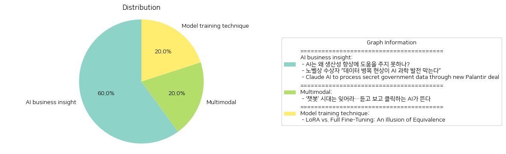

# Daily Artificial Intelligence Insights : News

## 🩵 AI business insight

**요약:**

1. **주요 주제**:
   - 인공지능(AI)의 발전과 그에 대한 기대 및 한계
   - AI 기술 발전을 가로막는 요소들, 특히 데이터의 중요성
   - AI의 보안과 윤리적 측면에 대한 우려
   
2. **주요 사건**:
   - 'AI는 왜 생산성 향상에 도움을 주지 못하나?' 기사에서는 AI가 경제 발전에 기여하기 위해서는 몇 가지 주요한 개선이 필요하다는 문제를 제기하고 있음.
   - '노벨상 수상자 “데이터 병목 현상이 AI 과학 발전 막는다”' 기사에서는 AI의 과학적 발견 도구로서의 잠재력을 제대로 발휘하려면 고품질 데이터의 필요성을 강조.
   - 'Claude AI to process secret government data through new Palantir deal' 기사에서는 Claude AI가 미국 정보 및 방위 기관의 데이터 처리에 참여하게 되어, 이에 대한 데이터 보안과 AI의 윤리적 사용에 대한 우려가 제기됨.
   
3. **영향 분석**:
   - **경제**: AI가 생산성 향상에 기여하지 못한다면, 그것이 경제 발전의 지연 요인으로 작용할 수 있으며, 고품질 데이터의 부족은 경제적 효율성을 저해할 수 있음.
   - **정치/사회**: Claude AI의 군사 및 정보기관과의 협력은 AI 사용에 대한 안전성과 윤리적 우려를 높이며, 이에 대한 사회적 논의가 필요함.
   - **과학기술**: 데이터의 질이 AI 발전의 큰 걸림돌로 작용하고 있으며, 이를 해결하는 것이 기술 발전의 핵심 과제가 될 것임.
   
4. **최종 요약**:
   - 전반적으로 인공지능은 경제적으로나 과학적으로 큰 잠재력을 갖고 있지만, 데이터 품질의 결여 및 윤리적 문제를 해결하는 것이 필요함.
   - AI를 안전하고 효과적으로 활용하기 위해서는 고품질 데이터의 확보와 AI의 윤리적 사용에 대한 정책 마련이 필요함.
   - 앞으로 AI의 발전이 우리 사회에 어떤 영향을 미칠지 지속적인 감시와 논의가 요구되며, 특히 보안과 윤리적인 측면에서의 규제가 중요할 것으로 보임.

**출처:**

 - AI는 왜 생산성 향상에 도움을 주지 못하나? (https://www.technologyreview.kr/ai%eb%8a%94-%ec%99%9c-%ec%83%9d%ec%82%b0%ec%84%b1-%ed%96%a5%ec%83%81%ec%97%90-%eb%8f%84%ec%9b%80%ec%9d%84-%ec%a3%bc%ec%a7%80-%eb%aa%bb%ed%95%98%eb%82%98/)
 - 노벨상 수상자 “데이터 병목 현상이 AI 과학 발전 막는다” (https://www.technologyreview.kr/%eb%85%b8%eb%b2%a8%ec%83%81-%ec%88%98%ec%83%81%ec%9e%90-%eb%8d%b0%ec%9d%b4%ed%84%b0-%eb%b3%91%eb%aa%a9-%ed%98%84%ec%83%81%ec%9d%b4-ai-%ea%b3%bc%ed%95%99-%eb%b0%9c%ec%a0%84-%eb%a7%89%eb%8a%94/)
 - Claude AI to process secret government data through new Palantir deal (https://arstechnica.com/ai/2024/11/safe-ai-champ-anthropic-teams-up-with-defense-giant-palantir-in-new-deal/)

## 🌞 Multimodal

**요약:**

**1. 주요 주제:**

- 인공지능(AI)의 새로운 진화: 기존의 텍스트 기반 AI 챗봇 시대의 종말과 함께, 음성과 영상 생성 기능을 갖춘 보다 발전된 AI의 부상이 주요 주제로 부각되고 있다. 이러한 변화는 더욱 직관적이고 사용자 친화적인 방식으로 AI가 활용될 수 있음을 의미한다.

**2. 주요 사건:**

- AI 기술의 진화: 기존 텍스트 기반의 챗봇에서 벗어나, AI가 음성과 영상 영역으로 확장하여 더 복합적인 기능을 제공하기 시작했다는 점이 주목된다. 이는 기술 발전을 의미하는 중요한 사건이다.

**3. 영향 분석:**

- 경제: AI의 발전은 다양한 산업 분야에서 활용 범위가 넓어질 것으로 예상되며, 생산성과 효율성을 증가시켜 경제 전반에 긍정적인 영향을 미칠 수 있다. 특히, 더 많은 기업이 AI 기술을 도입하여 경쟁력을 강화할 수 있다.
  
- 사회: AI의 음성과 영상 기능 확대는 개인의 일상생활에도 변화와 편리함을 가져올 것이다. 사용자 경험이 향상됨에 따라 AI가 더 널리 채택될 가능성이 높아진다.

**4. 최종 요약:**

최근 AI 기술의 발전은 텍스트 기반 챗봇의 한계를 넘어 음성과 영상 생성 기능을 갖춘 새로운 형태의 AI 시대로 진입하고 있음을 보여준다. 이는 경제적 측면에서 여러 산업의 경쟁력을 강화하고, 사회적으로는 사용자들이 더 직관적이고 접근하기 쉬운 기술을 경험할 수 있는 계기가 될 것이다. 앞으로의 발전 방향으로는 이러한 AI의 확장성 및 보급 확대가 주목되며, 더욱 다각화된 응용 사례가 등장할 가능성이 크다. 기업과 사회는 이러한 AI 기술 발전에 발맞추어 변화에 적응하고, 이를 통해 새로운 기회를 창출할 필요가 있다.

**출처:**

 - ‘챗봇’ 시대는 잊어라…듣고 보고 클릭하는 AI가 뜬다 (https://www.technologyreview.kr/%ec%b1%97%eb%b4%87-%ec%8b%9c%eb%8c%80%eb%8a%94-%ec%9e%8a%ec%96%b4%eb%9d%bc-%eb%93%a3%ea%b3%a0-%eb%b3%b4%ea%b3%a0-%ed%81%b4%eb%a6%ad%ed%95%98%eb%8a%94-ai%ea%b0%80-%eb%9c%ac%eb%8b%a4/)

## 🤩 Model training technique

**요약:**

**1. 주요 주제:**
   - 인공지능 모델의 미세 조정 기법 비교.
   - LoRA 모델과 완전 미세 조정 모델의 구조적 차이와 일반화 행동 비교.
   - 새로운 단일 벡터, '침입자 차원'의 도입과 그 영향.

**2. 주요 사건:**
   - 연구자들은 LoRA 모델과 완전 미세 조정 모델을 비교 연구했다.
   - LoRA 모델은 독특한 가중치 구조와 일반화 방식이 있으며, 완전 미세 조정 모델과 유사한 성능을 보이지만 새로운 작업에 대한 적응력이 덜 robust하다는 점이 강조되었다. 

**3. 영향 분석:**
   - 경제: 인공지능 모델의 성능과 효율성은 경제 부문에 영향을 미칠 수 있으며, 특정 AI 응용 프로그램의 개발 방향에 대한 투자가 변화할 수 있다.
   - 기술: LoRA 모델의 구조적 차이가 인공지능 연구, 특히 신경망 제어 분야에서 새로운 연구 방향을 제시할 가능성이 있다.
   - 교육: 이러한 연구 결과는 AI 및 ML 모델 교육 방법론의 개선에 영향을 미칠 수 있다.

**4. 최종 요약:**
   - 이 연구는 미세 조정 기법의 차이와 그로 인한 성능 변화를 밝힘으로써 인공지능 모델의 최적화 전략을 개발하는 데 중요한 기여를 했다. 특히, LoRA 모델의 '침입자 차원'이 새로운 작업에 대한 적응력에 미치는 영향을 고려해야 한다는 점을 부각했다. 앞으로의 연구는 이러한 새로운 차원이 다양한 과제에 어떻게 적용될 수 있는지를 탐구하는 것이 중요하며, 이는 AI 생태계에서 혁신을 촉진할 수 있는 잠재력을 지닐 것이다.

**출처:**

 - LoRA vs. Full Fine-Tuning: An Illusion of Equivalence (https://arxiv.org/abs/2410.21228)

