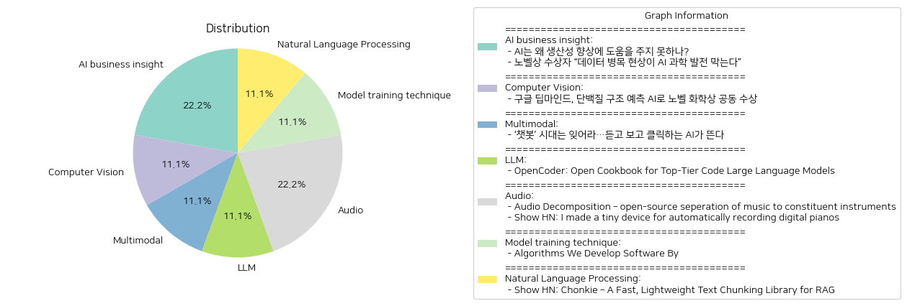

# Daily Artificial Intelligence Insights : News

## 🪸 AI business insight

**요약:**

1. **주요 주제**:
   - 두 기사 모두 인공지능(AI)에 초점을 맞추고 있으며, AI가 경제 발전과 과학적 발견에 있어 중요한 역할을 할 수 있다는 기대를 반영하고 있습니다. 
   - AI의 생산성 개선과 과학 발전을 저해하는 요소로 중대한 개선 필요와 데이터 병목 현상이 강조되고 있습니다.

2. **주요 사건**:
   - 첫 번째 기사에서는 AI가 경제적 잠재력을 실현하기 위해 수행해야 할 몇 가지 중대한 개선 사항이 필요하다는 점을 언급하고 있습니다.
   - 두 번째 기사에서는 노벨상 수상자가 데이터의 질이 AI의 과학 발전을 저해할 수 있는 병목 현상을 만들어 과학적 발견 도구로 사용되기 위해서는 고품질 데이터가 필수적이라고 강조하고 있습니다.

3. **영향 분석**:
   - **경제**: AI는 경제 발전의 중요한 기술로서 주목받고 있지만, 생산성 향상을 위한 구체적 개선이 필요하여 단기적인 경제적 성과는 제한적일 수 있습니다.
   - **사회**: AI 기술에 대한 기대감이 크지만, 데이터 질에 기반한 AI 발전의 한계가 사회적 기대와 실제 성과 간의 격차를 줄이는 데 중요할 수 있습니다.
   - **과학 및 기술**: AI 기반 과학 발전은 데이터의 중요성이 강조되며, 적절한 데이터 인프라스트럭처 개선이 필요합니다.

4. **최종 요약**:
   - 두 뉴스 기사에서는 AI의 잠재적 가치를 확인하면서도, 그 진전을 막는 주요 장애 요소로 중대한 개선 필요성(생산성 향상)과 데이터 병목 현상을 지목하고 있습니다.
   - AI가 생산성과 과학적 발견에 미치는 긍정적 영향을 극대화하기 위해서는 데이터 품질 향상 및 특정 기술적 개선이 필수적입니다.
   - 앞으로 AI 발전을 위해서는 기술적 진보 외에도 데이터 인프라와 관련 정책 지원이 중요하며, 이러한 요소들은 AI의 실질적 경제 기여도를 결정할 가능성이 높습니다.

**출처:**

 - AI는 왜 생산성 향상에 도움을 주지 못하나? (https://www.technologyreview.kr/ai%eb%8a%94-%ec%99%9c-%ec%83%9d%ec%82%b0%ec%84%b1-%ed%96%a5%ec%83%81%ec%97%90-%eb%8f%84%ec%9b%80%ec%9d%84-%ec%a3%bc%ec%a7%80-%eb%aa%bb%ed%95%98%eb%82%98/)
 - 노벨상 수상자 “데이터 병목 현상이 AI 과학 발전 막는다” (https://www.technologyreview.kr/%eb%85%b8%eb%b2%a8%ec%83%81-%ec%88%98%ec%83%81%ec%9e%90-%eb%8d%b0%ec%9d%b4%ed%84%b0-%eb%b3%91%eb%aa%a9-%ed%98%84%ec%83%81%ec%9d%b4-ai-%ea%b3%bc%ed%95%99-%eb%b0%9c%ec%a0%84-%eb%a7%89%eb%8a%94/)

## 🚀 Computer Vision

**요약:**

1. **주요 주제**:
   주요 주제는 인공지능(AI) 기술의 발전과 응용입니다. 구체적으로는 단백질 구조 예측 문제 해결에 AI가 사용되었으며, 이는 과학적 발견을 가속화하고 혁신적인 접근 방식을 통해 중요한 문제를 해결하는 데 있어 AI의 잠재력을 강조합니다. 다른 주제는 노벨상 수상과 혁신적 연구에 대한 인식입니다.

2. **주요 사건**:
   가장 중요한 사건은 노벨 화학상 수상으로, 인공지능을 활용하여 단백질 접힘 예측 문제를 해결한 구글 딥마인드의 데미스 허사비스와 존 점퍼가 노벨 화학상의 절반을 수상했고, 새로운 단백질을 만든 데이비드 베이커가 나머지 절반을 수상했다는 점입니다. 이 연구는 생명 과학 분야에서 중요한 돌파구로 평가됩니다.

3. **영향 분석**:
   이 사건들은 주로 생명 과학 및 신약 개발 부문에 긍정적인 영향을 미칠 수 있습니다. AI 활용으로 정확하고 효율적인 연구가 가능해지고, 신약 개발 과정에서 시간과 비용을 크게 절감할 수 있을 것입니다. 이는 경제적으로는 신약 출시에 따른 시장 경쟁력 향상으로 이어질 수 있으며, 정치적으로는 이런 혁신기술에 대한 정책 지원 및 투자 확대 요구를 가져올 수 있습니다. 사회적으로는 더 많은 질병 치료 옵션을 제공하여 공공 건강 증진에 기여할 수 있습니다.

4. **최종 요약**:
   이번 노벨 화학상 수상은 AI 기술이 생명 과학 연구의 중요한 도구로 자리매김하고 있음을 보여줍니다. 이러한 기술 발전은 신약 개발 및 질병 치료에 혁신을 가져올 것으로 기대되며, 이는 장기적으로 인간의 삶의 질을 향상시키는 데 기여할 수 있습니다. 앞으로, AI 기술의 다양한 분야에의 응용 확대와 이에 따른 윤리적, 사회적 논의가 중요할 것으로 보입니다. 추가적으로 기술 발전에 맞춘 규제 및 법적 장치 마련도 중요한 과제가 될 것입니다.

**출처:**

 - 구글 딥마인드, 단백질 구조 예측 AI로 노벨 화학상 공동 수상 (https://www.technologyreview.kr/%ea%b5%ac%ea%b8%80-%eb%94%a5%eb%a7%88%ec%9d%b8%eb%93%9c-%eb%8b%a8%eb%b0%b1%ec%a7%88-%ea%b5%ac%ec%a1%b0-%ec%98%88%ec%b8%a1-ai%eb%a1%9c-%eb%85%b8%eb%b2%a8-%ed%99%94%ed%95%99%ec%83%81-%ea%b3%b5%eb%8f%99/)

## 🍋 Multimodal

**요약:**

1. **주요 주제**:
   이 기사에서는 AI 기술의 발전과 변화가 주요 주제로 다루어지고 있습니다. 특히, 텍스트 기반 AI 챗봇 시대에서 한층 더 발전된 음성과 영상 생성 기능을 갖춘 AI가 새롭게 주목받고 있다는 점이 강조됩니다. 

2. **주요 사건**:
   텍스트 기반 AI 챗봇 시대의 종말과 함께, 음성과 영상 생성 기능을 더욱 강화한 AI 기술이 부상하고 있다는 소식이 중요한 사건으로 제시됩니다. 이는 AI 기술의 진화가 사용자 경험을 향상시키고 새로운 가능성을 제시한다는 점에서 주목할 만합니다.

3. **영향 분석**:
   이러한 AI 기술의 발전은 경제적으로는 AI 관련 산업의 성장과 혁신을 초래할 수 있으며, 더 나아가 기술력을 바탕으로 새로운 시장을 창출할 가능성이 있습니다. 사회적으로는 AI가 사람들과의 상호작용 방식을 변화시키고, 사용자들 사이에서 정보 전달 및 이해의 방식을 혁신할 수 있습니다. 또한, 정치적으로는 AI를 활용한 정책 방향 및 기술 규제가 중요한 이슈로 부각될 가능성이 있습니다.

4. **최종 요약**:
   이번 뉴스 기사에서 강조된 AI의 발전은 단순한 기술 변화 이상의 의미를 가지며, 사용자와의 상호작용을 재정의하는 단계에 와 있는 것을 보여줍니다. 음성과 영상 인식 기능을 갖춘 AI의 부상은 새로운 기술적 가능성을 제공하며, 이는 경제, 사회 전반에 걸쳐 다양한 영향을 미칠 것으로 보입니다. 앞으로의 AI 기술의 발전 방향, 특히 음성과 영상 기반 AI의 응용 사례와 이에 대한 시장의 반응을 주의 깊게 살펴보는 것이 필요합니다.

**출처:**

 - ‘챗봇’ 시대는 잊어라…듣고 보고 클릭하는 AI가 뜬다 (https://www.technologyreview.kr/%ec%b1%97%eb%b4%87-%ec%8b%9c%eb%8c%80%eb%8a%94-%ec%9e%8a%ec%96%b4%eb%9d%bc-%eb%93%a3%ea%b3%a0-%eb%b3%b4%ea%b3%a0-%ed%81%b4%eb%a6%ad%ed%95%98%eb%8a%94-ai%ea%b0%80-%eb%9c%ac%eb%8b%a4/)

## 🎠 LLM

**요약:**

1. **주요 주제**:
   이번 뉴스에서 다루는 주요 주제는 대규모 코드 언어 모델(LLM)의 발전 및 그 영향력입니다. 특히, 오픈코더(OpenCoder)와 같은 오픈소스 코드 LLM의 개발 및 연구 기여에 집중하고 있으며, 번식 가능한 데이터와 훈련 프로토콜 등의 중요성을 강조하고 있습니다.

2. **주요 사건**:
   오픈소스 코드 LLM인 오픈코더의 출시와 1.5B 및 8B 모델의 개발이 주요 사건으로 부각됩니다. 약 2.5조 개의 토큰을 학습하여 최상급 성능을 목표로 하고 있으며, 이 모델은 코드 AI 발전에 새로운 이정표를 제시하고 있습니다.

3. **영향 분석**:
   이 같은 발전은 기술 산업에 막대한 영향을 미치고 있습니다. 코드 LLM의 발전은 소프트웨어 개발의 효율성을 높이며, 더 나아가 인공지능 연구 및 개발에 새로운 방향을 제시합니다. 경제적으로는 AI를 활용한 자동화가 증가할 것으로 예상되며, 이는 생산성 향상과 관련한 긍정적인 효과뿐만 아니라 기존 산업의 변화 및 일자리 구조 변화와 같은 사회적 영향을 미칠 수 있습니다.

4. **최종 요약**:
   오픈코더의 출시는 코드 LLM 발전의 중요한 전진으로 간주됩니다. 이 모델들의 개발은 AI 및 코드 연구의 투명성과 발전을 촉진하며, 소프트웨어 개발 산업 전체에 긍정적인 변화를 예상할 수 있습니다. 앞으로 이러한 기술의 도입은 더욱 광범위하게 확산될 가능성이 있으며, 관련 분야의 지속적 모니터링과 신기술의 수용이 중요할 것입니다. 이는 궁극적으로 경제와 사회 구조에 중대한 변화를 가져올 것으로 예상되며, 이에 따른 준비와 적응이 필요합니다.

**출처:**

 - OpenCoder: Open Cookbook for Top-Tier Code Large Language Models (https://opencoder-llm.github.io/)

## 🪐 Audio

**요약:**

**주요 주제**:
최근 뉴스 기사에서는 음악과 기술의 결합이 두드러지는 테마로 나타나고 있습니다. 이는 특히 음향 분석, 음원 분리, 디지털 기기의 자동 녹음 기능 등에서 기술 발전이 두드러지게 나타나며, 음악과 관련된 기술적 혁신이 주된 흐름으로 파악됩니다.

**주요 사건**:
첫 번째 기사에서는 오픈 소스 프로그램을 통해 음악을 구성하는 각각의 악기로 분리하는 기술을 소개하고 있습니다. 이 프로그램은 푸리에 변환과 엔벨로프 기술을 활용하여 악기와 음을 식별하며, 다양한 악기와 주파수를 효율적으로 처리할 수 있다는 점이 강조됩니다.

두 번째 기사에서는 디지털 피아노를 자동으로 녹음할 수 있는 작은 장치를 소개하고 있습니다. 이 장치는 사용자로 하여금 연주에 집중할 수 있게 하며, 오래된 녹음을 수동으로 삭제하는 기능을 포함하고 있습니다. 이는 자동 녹음, 음계 추적, 재생 내역 등의 기능을 통해 기존의 스마트폰 녹음 기능을 한 단계 업그레이드하는 기술로 주목받고 있습니다.

**영향 분석**:
이러한 음악 기술 발전은 음악 교육 분야와 녹음 및 제작 산업에 긍정적 영향을 미칠 가능성이 큽니다. 음향 분석 및 녹음 기술의 발전은 음악 교육의 질을 향상시킬 수 있고, 예술가나 제작자들이 더 나은 품질의 음원을 제작하는 데 도움을 줄 것입니다. 또한, 오디오 분리 기술의 발전은 라이브 퍼포먼스나 믹싱 등에 새로운 기술적 가능성을 제시할 수 있습니다.

**최종 요약**:
음악과 기술의 융합은 지속적인 발전을 거듭하며, 다양한 분야에 걸친 혁신을 예고하고 있습니다. 이러한 기술들은 음악 산업 전반에 걸쳐 긍정적인 변화를 가져올 가능성이 있으며, 특히 교육 및 제작 분야에서의 활용도가 높습니다. 앞으로도 이와 같은 혁신적인 기술 발전이 다양한 분야로 확장되어 나갈 가능성이 크며, 그 진화를 지켜볼 필요가 있습니다.

**출처:**

 - Audio Decomposition – open-source seperation of music to constituent instruments (https://matthew-bird.com/blogs/Audio-Decomposition.html)
 - Show HN: I made a tiny device for automatically recording digital pianos (https://jamcorder.com/)

## 🎠 Model training technique

**요약:**

**1. 주요 주제**:
- 소프트웨어 개발 방법론: 기사에서는 기술 CEO와 엔지니어가 공유한 두 가지 소프트웨어 개발 방법론에 대해 논의하고 있습니다. 첫 번째는 매일 기능을 새로 시작하고 완료되지 않았을 경우 삭제하는 방법이고, 두 번째는 코드 품질을 향상시키기 위해 두 번 작성하는 방법입니다.
- 개발 혁신과 품질 관리: 개발 프로세스를 혁신적으로 접근하여 최종 소프트웨어 품질을 높이는 방법들이 주요 주제로 다뤄지고 있습니다. 

**2. 주요 사건**:
- 기술 업계의 트렌드 변화: 기존의 소프트웨어 개발 방식에서 벗어나 매일 초기화하거나 이중으로 코드를 작성하는 새로운 개발 트렌드가 소개되었습니다.

**3. 영향 분석**:
- 경제적 측면: 이러한 개발 방법론은 소프트웨어 산업에서 생산성과 품질을 동시에 추구할 수 있는 가능성을 제시하며, 이는 향후 기술 기업들의 경쟁력 강화로 이어질 수 있습니다.
- 사회적 측면: 소비자 입장에서는 고품질의 소프트웨어 제품을 경험할 수 있는 기회가 늘어나며, 사용자 경험이 개선될 가능성이 큽니다.

**4. 최종 요약**:
최근 기술 산업에서는 소프트웨어 개발 방법론의 혁신에 대한 논의가 활발히 진행되고 있습니다. 새로운 방법론들은 특히 매일 초기화하거나 코드 품질을 높이기 위해 이중 작성하는 방식으로, 개발 과정의 효율성과 최종 제품의 품질을 극대화하려는 시도를 보여줍니다. 이러한 변화는 기술 기업의 생산성과 경쟁력을 높이는 데 기여할 수 있으며 사회적으로는 사용자에게 더 나은 소프트웨어 제품을 제공하는 데 긍정적인 영향을 미칠 것입니다. 앞으로도 이러한 방법론들이 실제 개발 환경에 어떻게 적용되고 발전해 나가는지를 지켜보아야 할 것입니다.

**출처:**

 - Algorithms We Develop Software By (https://grantslatton.com/software-pathfinding#algorithms-we-develop-software-by)

## 🌿 Natural Language Processing

**요약:**

**종합 뉴스 요약 보고서**

1. **주요 주제**:
   - 기술 발전: 기술적인 도구와 라이브러리의 개발 및 향상.
   - 생산성 및 효율성: 개발 도구와 라이브러리는 사용자가 보다 효율적으로 작업을 수행할 수 있도록 도와줌.
   
2. **주요 사건**:
   - 새로운 텍스트 청킹 라이브러리 'Chonkie'의 소개: RAG(bot 개발)에서 텍스트 청킹을 간소화하기 위한 경량 라이브러리 개발.
   - Chonkie는 기존의 부피가 크거나 기능이 부족한 옵션들에 대한 대안으로, 최소한의 기본 설치를 제공하며 개발자들 사이에서 주목받고 있음.

3. **영향 분석**:
   - 경제적 영향: 소프트웨어 개발에서 효율성을 높임으로써 개발 시간과 비용을 절감할 수 있음. 이는 스타트업 및 기술 기업에서 특히 유용할 수 있음.
   - 사회적 영향: 개발자들이 보다 효과적으로 작업을 수행할 수 있어, 인적 자원의 활용도를 증가시킬 수 있음.
   - 기술적 영향: RAG 개발에서의 효율성을 높임으로써, 인공지능 기반 애플리케이션 개발에 기여할 수 있음.

4. **최종 요약**:
   - 'Chonkie'의 출시는 개발자의 생산성을 향상시키면서 RAG 개발에서의 병목 현상을 줄이는 데 의미 있는 기여를 할 것으로 보임. 이 기술적 발전은 소프트웨어 개발 분야에 긍정적인 영향을 미치며, 향후 더욱 간편하고 효율적인 도구들이 지속적으로 개발될 가능성이 큼. 이러한 발전은 특히 인공지능과 관련된 애플리케이션 개발에서 주요한 전환점을 가져올 수 있으므로 주목할 만함. 향후 추가적인 기능 개선 및 사용자 피드백에 기반한 발전이 예상됨.

**출처:**

 - Show HN: Chonkie – A Fast, Lightweight Text Chunking Library for RAG (https://github.com/bhavnicksm/chonkie)

