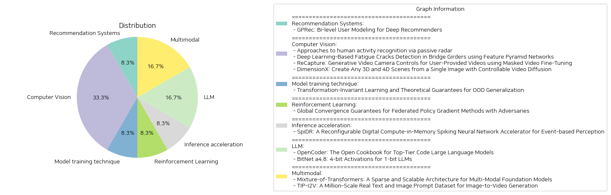

# Daily Artificial Intelligence Insights : Papers

## 🪄 Recommendation Systems

**요약:**

요약 보고서:

1. 주요 주제 및 테마 추출:
   - 유저를 그룹으로 분류하는 새로운 접근 방식
   - 긍정적 및 부정적 패턴을 대비하여 그룹 선호도를 제공
   - ID-유사 특징에서 개인 선호도를 파악하여 그룹 수준의 모델링을 보완

2. 공통 키워드, 트렌드, 패턴 식별:
   - 사용자 모델링
   - 추천 시스템 강화
   - 그룹과 개인 선호도

3. 주요 이벤트 및 핵심 정보 요약:
   - GPRec은 사용자를 학습 가능한 방식으로 그룹화하여 대응하는 그룹 임베딩과 정렬함.
   - 그룹 임베딩 공간을 이중으로 설계하여 그룹 선호도를 다각도로 제공.
   - 개인 수준에서 ID-유사 특징을 통해 개인 선호도를 파악하고 이를 그룹 임베딩과 독립적으로 정제.
   - 다양한 DRS 모델에 GPRec의 유연한 통합 전략을 제시하여 사용 용이성 증대.
   - 세 개의 공개 데이터셋에서 GPRec의 엄격한 테스트 결과, 추천 품질에서 상당한 개선이 있음.

4. 이러한 사건이 다양한 부문에 미친 영향 분석:
   - 추천 시스템의 품질 개선으로 인해 사용자 경험 향상
   - 개인화된 추천 제공을 통한 콘텐츠 소비 증가 및 사용자 만족도 상승
   - 기업의 데이터 기반 전략 강화 가능성

5. 최종 종합 요약 및 향후 발전 가능성:
   GPRec은 사용자 그룹화 및 개별화된 접근 방식을 통해 기존 추천 시스템의 한계를 극복하고 상당한 성능 향상을 이뤘다. 추천 품질의 높은 개선은 사용자 맞춤형 경험을 제공하며, 기업의 장기적인 데이터 활용 전략에도 긍정적인 영향을 미칠 수 있다. 앞으로도 개인화 및 그룹화를 동시에 고려하는 모델의 개발이 지속될 것으로 예상되며, 이는 더욱 세분화된 사용자 경험 제공을 가능하게 할 것이다.

**출처:**

 - GPRec: Bi-level User Modeling for Deep Recommenders (https://deeplearn.org/arxiv/541926/gprec:-bi-level-user-modeling-for-deep-recommenders)

## ⭐ Computer Vision

**요약:**

### 종합 요약 보고서

#### 주요 주제 및 테마 추출
1. **인간 활동 인식(Human Activity Recognition, HAR)**
   - 비침습적인 방법으로 수동 레이더와 Wi-Fi 채널 상태 정보(CSI)를 활용하여 인간 활동을 인식.
   - 가시 신경망(Spiking Neural Networks, SNNs)과 심볼릭 추론 프레임워크(DeepProbLog)를 결합하여 높은 정확성과 저전력 소비를 구현.

2. **구조적 건강 모니터링 및 균열 감지**
   - 교량의 강철 박스 거더의 균열을 감지하기 위해 'Feature Pyramid Networks'를 활용한 자동 균열 감지 프레임워크.
   - 고해상도 이미지를 통한 자동 균열 세그먼테이션과 정확도 향상을 위한 이미지 크기 조정 및 분할 방법론 적용.

3. **비디오 재생성 및 사용자 제공 비디오의 카메라 제어**
   - 사용자 제공 비디오에서 새로운 카메라 궤적을 생성하기 위한 'ReCapture' 방법론.
   - 마스크된 비디오 파인튜닝 기법을 사용하여 비디오 재생성과 장면의 새로운 각도 제공.

4. **사진 실사적인 3D 및 4D 장면 생성**
   - 단일 이미지에서 제어 가능한 비디오 확산을 통해 3D 및 4D 장면 생성 가능.
   - DimensionX 프레임워크로 공간적 구조와 시간적 진화를 분리하여 세밀한 조작과 장면 재구성 가능.

#### 핵심 용어 및 트렌드 식별
- **비침습적 방법**: 개인정보 보호 문제를 해결하기 위한 접근법.
- **신경망 및 기계 학습**: 다양한 연구에서 신경망(특히 SNN)과 심층 학습 모델(FPN, DimensionX 등)을 활용.
- **고해상도 이미지 처리**: 균열 검출 및 비디오 생성에서 중요한 역할.
- **공간 및 시간 제어**: 다차원 장면 및 비디오 생성에서 핵심 요소.

#### 주요 이벤트 및 정보 요약
- 수동 레이더와 CSI를 이용한 비침습적 인간 활동 인식 방법론이 실험적으로 높은 정확도를 보임.
- 고해상도 이미지를 활용한 자동 균열 감지 기술이 FPN을 통해 계산 효율성을 높이며 정확도 보장.
- 사용자 제공 비디오의 새로운 시점과 카메라 궤적을 재생성할 수 있는 'ReCapture' 기술 개발.
- 단일 이미지에서 3D 및 4D 장면을 생성하는 'DimensionX' 프레임워크로 뛰어난 비디오 생성 결과 도출.

#### 이벤트의 영향 분석
- **프라이버시 보호**: 인간 활동 인식에서 비침습적 기술의 적용으로 프라이버시 문제가 해결됨.
- **구조적 안전**: 교량 등의 구조물 건강 모니터링에서 균열 감지의 자동화로 유지보수가 용이해짐.
- **멀티미디어 콘텐츠 생성**: 사용자 제공 비디오의 다양한 시점에서의 재생성은 콘텐츠 제작의 새로운 가능성을 열어줌.
- **3D/4D 시각화 기술**: 단일 이미지로부터 복잡한 장면을 생성할 수 있어 다양한 산업 분야에 적용 가능성이 있음.

#### 결론 및 미래 개발 방향
현재 연구들은 비침습적 방법을 통한 인식 기술과 고해상도 이미지 처리 및 제어 가능한 비디오 생성 방식에서 혁신적인 접근 방법을 제시하고 있다. 이러한 기술들은 프라이버시 보호, 안전 모니터링, 시각화 및 콘텐츠 생성 분야에서 새로운 기회를 창출한다. 앞으로의 발전 가능성으로는 더 나은 모델의 성능 향상, 실시간 처리 기술, 그리고 다차원 데이터의 통합 활용이 기대된다.

**출처:**

 - Approaches to human activity recognition via passive radar (https://deeplearn.org/arxiv/543512/approaches-to-human-activity-recognition-via-passive-radar)
 - Deep Learning-Based Fatigue Cracks Detection in Bridge Girders using Feature Pyramid Networks (https://deeplearn.org/arxiv/541641/deep-learning-based-fatigue-cracks-detection-in-bridge-girders-using-feature-pyramid-networks)
 - ReCapture: Generative Video Camera Controls for User-Provided Videos using Masked Video Fine-Tuning (http://arxiv.org/abs/2411.05003v1)
 - DimensionX: Create Any 3D and 4D Scenes from a Single Image with Controllable Video Diffusion (http://arxiv.org/abs/2411.04928v1)

## 🎈 Model training technique

**요약:**

보고서 요약:

1. 주제 및 테마:
   - 논문은 동일한 훈련 및 테스트 분포에 대한 학습보다는, 분포 이동(information distribution shift) 상황에서의 학습을 주요 주제로 삼고 있다. 특히, 데이터 변환 맵을 통해 훈련 및 테스트 분포가 연결될 수 있는 설정에 주목한다. 

2. 공통 키워드, 동향 및 패턴:
   - 분포 이동, 변환 맵, 경험적 위험 최소화(ERM), VC 차원, 학습 규칙, 이론적 보장, 표본 복잡도 등이 논문에서 주로 다루어지는 키워드로 나타난다.

3. 주요 이벤트 및 중요한 정보 요약:
   - 분포 이동 학습 프레임워크에 대해 이론적 연구를 시작하여, 변환 클래스가 알려졌거나 알려지지 않았을 때의 학습 시나리오를 조사한다.
   - 경험적 위험 최소화(ERM)로의 알고리즘적 축소 및 학습 규칙을 확립하고, 여러 경우에 표본 복잡도의 상한을 제공한다. 이는 변환과 관련된 예측기의 VC 차원이 예측기 클래스의 VC 차원보다 크게 증가하지 않는다는 것을 보여준다.
   - 학습 규칙은 분포 이동에 대한 게임 이론적 관점을 제공하며, 학습자는 예측기를 찾고 적대자는 변환 맵을 찾으면서 각각 최악의 손실을 최소화하고 최대화하려 한다.

4. 이러한 이벤트가 다양한 부문에 미치는 영향 분석:
   - 이 연구의 결과는 머신러닝에서의 분포 이동 관리를 위한 새로운 방법론을 제시해 실무에서 데이터의 변동을 더 잘 이해하고 대응할 수 있도록 돕는다.
   - 특히, 변환맵과 관련된 이러한 프레임워크는 강력한 예측 모형 개발에 기여할 수 있으며, 다양한 분야에서의 예측 정확도를 높일 수 있다.

5. 최종 요약 및 미래 개발 가능성:
   - 논문은 분포 이동 시나리오에서의 학습에 대한 이론적 기반을 공고히 함으로써 학습자들이 새로운 환경에 보다 효과적으로 적응할 수 있는 방법을 제시하였다.
   - 향후 연구에서는 알려지지 않은 변환맵 및 좀 더 복잡한 분포 이동 시나리오에 대응하는 보다 고도화된 학습 알고리즘 개발이 기대된다.

**출처:**

 - Transformation-Invariant Learning and Theoretical Guarantees for OOD Generalization (https://deeplearn.org/arxiv/544058/transformation-invariant-learning-and-theoretical-guarantees-for-ood-generalization)

## 🚀 Reinforcement Learning

**요약:**

보고서 요약:

1. 주요 주제 및 테마 추출:
    - 연합 강화 학습(Federated Reinforcement Learning, FRL)
    - 정책 경사법(Policy Gradient Methods)
    - 적대적 행위자(adversarial agents)
    - 전역 수렴 보장(Global Convergence Guarantees)

2. 공통 키워드 및 패턴:
    - 적대적 행위자에 대한 강인성
    - 샘플 복잡도
    - 협력적 의사 결정 정책 구축
    - 일반 매개변수화

3. 주요 사건 및 중요한 정보 요약:
    - 연합 강화 학습은 여러 에이전트가 원시 경로를 공유하지 않고도 협력하여 의사 결정 정책을 구축할 수 있도록 한다.
    - 적대적 행위자가 일부 포함될 경우, 이는 심각한 결과를 초래할 수 있다.
    - 연구는 적대적 에이전트에 강인한 정책 경사 기반 접근법을 제안하며, 이는 적대적 행위자가 서버로 임의의 값을 보내는 상황에서도 전역 수렴을 보장한다.
    - 이러한 결과는 적대적 상황에서도 저항성을 보여주며, $N$개의 에이전트와 $f<N/2$개의 적대적 에이전트 범위에서 $\tilde{\mathcal{O}}\left( \frac{1}{N\epsilon^2} \left( 1+\frac{f^2}{N}\right)\right)$의 최적 샘플 복잡도를 달성한다.

4. 사건이 다양한 분야에 미치는 영향 분석:
    - 연합 학습 기법을 통해 개인 데이터의 노출 없이도 강력한 AI 시스템을 구축할 수 있는 가능성을 제시한다.
    - 적대적 행위자가 포함된 환경에서도 견고한 AI 모델 구축이 가능하여 보안 및 신뢰성 증대에 기여할 수 있다.
    
5. 최종 요약 및 결론:
    - 본 연구는 적대적 환경에서도 강인한 연합 강화 학습을 가능하게 하는 방법론적 발전을 이룩하였으며, 향후 AI 시스템의 보안과 효율성을 개선하는 데 중요한 역할을 할 수 있을 것으로 보인다.
    - 미래 개발 방향으로는 보다 다양한 환경에서의 적대적 행위자에 대한 대응책의 확장 및 실질적 응용 분야에서의 실험적 검증이 요구된다.

**출처:**

 - Global Convergence Guarantees for Federated Policy Gradient Methods with Adversaries (https://deeplearn.org/arxiv/545735/global-convergence-guarantees-for-federated-policy-gradient-methods-with-adversaries)

## ❄️ Inference acceleration

**요약:**

**Summary Report in Korean:**

1. **주요 주제 및 테마 추출:**
   - 이 논문은 스파이킹 뉴럴 네트워크(SNN)와 이벤트 기반 인식에 적합한 디지털 컴퓨트 인 메모리(CIM) 엑셀러레이터인 SpiDR를 소개하고 있습니다.
   - 이벤트 기반 비전 애플리케이션에 효율적인 비유동 데이터를 처리하는 SNN의 가능성을 강조하고 있습니다.

2. **공통 키워드, 트렌드 및 패턴 식별:**
   - SNN, Dynamic Vision Sensors(DVS), 이벤트 기반 처리, 재구성 가능성, 컴퓨트 인 메모리(CIM), 비동기식 핸드셰이킹, 에너지 효율성, 메모리 내 연산 등의 키워드가 도출됩니다.
   - 적응성, 에너지 절약, 다양한 뉴런 모델 지원 등 여러 특징을 통한 최적화 경향이 보입니다.

3. **주요 사건 및 핵심 정보 요약:**
   - 많은 기존 SNN 가속기들의 한계를 극복하기 위해 SpiDR라는 재구성 가능한 디지털 CIM 가속기가 소개되었습니다.
   - SpiDR는 다양한 워크로드에 적응하고 데이터 이동을 최소화하기 위한 메모리 내 연산을 사용하며, 다양한 가중치 및 Vmem 비트 정밀도를 지원합니다. 
   - 희소 입력 처리를 위한 제로-스키핑 메커니즘과 다양한 연산 단위의 가변 실행 시간을 위한 비동기 핸드셰이킹 메커니즘을 특징으로 합니다.
   - TSMC의 65nm 저전력 기술로 제작된 이 기술은 다른 디지털 SNN 가속기와 경쟁력 있는 성능을 보여줍니다.

4. **이러한 사건들이 다양한 분야에 미치는 영향 분석:**
   - IoT 및 자율 주행 등 이벤트 기반 비전 시스템이 활용되는 분야에서 더욱 빠르고 에너지 효율적인 데이터 처리가 가능해질 것입니다.
   - 이 기술은 데이터 센터 및 엣지 디바이스에서 발생하는 높은 전력 소비 문제를 해결하는데 기여할 수 있습니다.

5. **최종 요약 및 미래 발전 방향:**
   - SpiDR의 설계는 다양한 뉴런 모델과 비트 정밀도를 지원하여 널리 사용될 수 있는 가능성을 열었습니다.
   - 앞으로도 더 높은 수준의 에너지 효율성과 적응력을 갖춘 SNN 가속기 개발이 가속화될 것으로 예상됩니다.
   - 이러한 기술들은 궁극적으로 AI 연구 및 개발의 새로운 패러다임을 제공할 것으로 기대됩니다. 이는 특히 환경 친화적이고 지속 가능한 컴퓨팅 솔루션으로의 발전을 이루는 데 크게 기여할 수 있습니다.

**출처:**

 - SpiDR: A Reconfigurable Digital Compute-in-Memory Spiking Neural Network Accelerator for Event-based Perception (https://deeplearn.org/arxiv/545756/spidr:-a-reconfigurable-digital-compute-in-memory-spiking-neural-network-accelerator-for-event-based-perception)

## 👽 LLM

**요약:**

보고서 요약:

1. 주요 주제 및 테마 추출:
   - OpenCoder: 대규모 언어 모델(LLMs)의 코드 생성 분야에서의 중요성과 프리미엄 코드 LLM이 학문적 연구에 어떻게 기여할 수 있는지를 강조.
   - BitNet a4.8: 1비트 LLM의 성능을 유지하면서 추론 비용을 줄이는 방향으로 나아가는 것이며, 4비트 활성화를 도입하여 성능 향상.

2. 공통 키워드, 트렌드, 패턴 식별:
   - 고급 코드 및 언어 모델: LLMs의 성능 향상, 각종 최적화 전략, 학문 및 과학 연구로의 개방.
   - 효율성과 최적화: 낮은 비트 활성화를 통한 모델의 효율성 강화 및 비용 절감.

3. 주요 사건 및 중요한 정보 요약:
   - OpenCoder는 고급 코드 LLM의 성능을 프리미엄 모델 수준으로 끌어올리고, 과학적 연구를 위한 개방형 접근 방식을 제공. 데이터 처리 파이프라인, 체계적 실험 결과 및 훈련 프로토콜의 투명성 제공.
   - BitNet a4.8은 하이브리드 양자화 및 희소화 전략을 사용하여 1비트 LLM의 추론 비용을 줄이며, 성능을 유지 및 향상. 4비트 활성화 및 3비트 KV 캐시를 도입하여 효율성을 증대.

4. 이러한 사건들의 영향 분석:
   - OpenCoder는 코드 AI 분야에서 접근성 확대 및 재현 가능한 발전 가능성을 열어, 연구자 및 개발자들이 더욱 체계적인 연구를 수행할 수 있는 기반을 제공.
   - BitNet a4.8은 대규모 LLM의 대량 배포 및 추론을 보다 효율적으로 구현할 수 있는 방법을 제시, LLM 사용의 범위와 경제성을 확대.

5. 최종 통합 요약 및 결론:
   - OpenCoder와 BitNet a4.8은 각각 과학 연구 및 추론 최적화라는 측면에서 대규모 언어 모델의 발전에 기여. OpenCoder는 연구에 초점을 맞춘 포괄적인 개방성을, BitNet a4.8은 새로운 양자화 전략을 통한 비용 효율성을 제시.
   - 향후 개발을 기대할 부분은 LLM의 더 큰 개방성과 효율화 기술의 발전이 매우 중요하며, 이는 궁극적으로 다양한 영역에서 LLM의 채택을 촉진하고 혁신을 도모할 수 있을 것으로 예상됨.

**출처:**

 - OpenCoder: The Open Cookbook for Top-Tier Code Large Language Models (http://arxiv.org/abs/2411.04905v1)
 - BitNet a4.8: 4-bit Activations for 1-bit LLMs (http://arxiv.org/abs/2411.04965v1)

## 🩵 Multimodal

**요약:**

보고서 요약:

1. 주요 주제 및 테마 추출:
   - 'Mixture-of-Transformers'는 대규모 다중 모달 언어 모델을 위한 스파스한 아키텍처로, 텍스트, 이미지, 음성 데이터를 처리할 수 있는 유연한 시스템에 관한 내용입니다.
   - 'TIP-I2V'는 이미지에서 비디오 생성으로의 전환에 중점을 두고 있으며, 대규모 실제 텍스트 및 이미지 프롬프트 데이터셋을 활용하여 콘텐츠 생성 모델의 발전을 도모합니다.

2. 공통 키워드, 트렌드 및 패턴 식별:
   - 다중 모달 아키텍처, 데이터셋 규모, 연산 자원의 효율성 개선, 텍스트 및 이미지 프롬프트, 사용자 제공 데이터, 모델 학습 및 안전성, 콘텐츠 생성의 발전.

3. 주요 사건 및 핵심 정보 요약:
   - 'Mixture-of-Transformers'는 사전 훈련 계산 비용을 줄이는 혁신적인 모델로, 여러 모드시스템을 통해 병목 현상을 해소하고 처리 효율성을 높였습니다. 이 모델은 달성하고자 하는 성능을 유지하면서도 계산 자원을 크게 절감합니다.
   - 'TIP-I2V'는 170만 개가 넘는 텍스트 및 이미지 프롬프트를 포함한 대규모 데이터셋으로, 이미지에서 비디오로 전환하는 콘텐츠 생성 모델의 연구를 가속화하고 그들의 성능을 다각적으로 평가할 수 있는 기회를 제공합니다.

4. 사건의 다양한 부문에 미치는 영향 분석:
   - 'Mixture-of-Transformers'는 효율적인 자원 사용을 통하여 AI 산업 내 모델 비용 절감과 확장의 가능성을 제시합니다.
   - 'TIP-I2V'는 콘텐츠 생성 분야에서 프롬프트 데이터셋의 중요성을 강조함으로써 연구자의 사용 및 안전성 개선에 기여할 자료를 제공합니다. 

5. 최종 종합 요약 및 미래 발전 가능성:
   - 'Mixture-of-Transformers'와 'TIP-I2V'는 모두 데이터 처리 및 콘텐츠 생성 기술의 발전을 보여주며, 다양한 모드와 조합을 활용하는 AI 모델이 앞으로 효율성과 다양성을 확대할 수 있는 비전을 제시합니다. 미래의 기술 발전은 이러한 모델의 다중 모드 통합, 사용자 맞춤형 모델 안전성 강화, 그리고 데이터셋의 질과 규모 증가에 의해 가속될 것으로 전망됩니다.

**출처:**

 - Mixture-of-Transformers: A Sparse and Scalable Architecture for Multi-Modal Foundation Models (http://arxiv.org/abs/2411.04996v1)
 - TIP-I2V: A Million-Scale Real Text and Image Prompt Dataset for Image-to-Video Generation (http://arxiv.org/abs/2411.04709v1)

