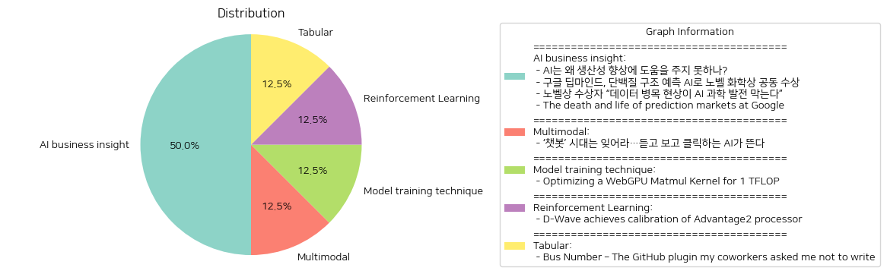

# Daily Artificial Intelligence Insights : News

## ❄️ AI business insight

**요약:**

1. **주요 주제**:
   - 인공지능(AI)의 발전과 그것의 다양한 활용
   - 노벨상과의 연관성, 특히 과학 및 기술 분야에서의 기여
   - 데이터의 중요성과 데이터 병목 현상이 AI 연구에 미치는 영향
   - 내부 예측시장과 같은 시스템의 실행 및 어려움

2. **주요 사건**:
   - 'AI는 왜 생산성 향상에 도움을 주지 못하나?': AI의 기대와 달리 생산성 개선 측면에서 중대한 개선이 필요하다는 논의.
   - '구글 딥마인드, 단백질 구조 예측 AI로 노벨 화학상 공동 수상': 구글 딥마인드의 AI 기술이 단백질 접힘 예측 문제를 해결하여 노벨 화학상을 수상.
   - '노벨상 수상자 “데이터 병목 현상이 AI 과학 발전 막는다”': AI를 과학적으로 더 효과적으로 활용하기 위해서는 고품질의 데이터 확보가 중요하다는 점을 강조.
   - '구글의 예측 시장의 죽음과 삶': 구글의 내부 예측 시장이 규제 문제와 실행상의 어려움으로 인하여 성공을 거두지 못한 사례.

3. **영향 분석**:
   - 경제: AI가 생산성 향상에 기여하지 못하고 있기에, 경제적 성과를 위해서는 더 많은 연구와 개선이 필요함.
   - 과학 및 기술: 구글 딥마인드의 성과는 AI가 과학적 발견을 촉진하는데 큰 잠재력을 가지고 있음을 보여줌.
   - 사회적 영향: 데이터 품질의 중요성을 깨닫고 데이터 수집 및 관리에 대한 사회적 인식이 높아질 가능성.
   - 기술적 변화: 내부 예측 시장의 사례는 혁신을 위한 적절한 실행과 고객 이해의 필수성을 보여줌.

4. **최종 요약**:
   전반적으로, AI 기술이 과학 및 기술 혁신에서 두각을 나타내며 큰 영향을 미치고 있지만, 생산성 향상에는 아직 실질적인 어려움이 존재한다. 특히 데이터 품질 개선과 AI 기술의 실제 문제 해결 적용이 더 필요함을 보여준다. 구글 사례는 혁신적인 기업에서도 실행상의 어려움과 시장의 이해 부족으로 인해 실패할 수 있음을 시사한다. 앞으로는 AI 발전을 지원하는 데이터 인프라 구축 및 다양한 분야에서의 AI 적용 가능성을 주시해야 한다. AI와 데이터 관리의 중요성이 강조되며, 향후 이러한 요소들이 어떻게 진화할지 주목할 필요가 있다.

**출처:**

 - AI는 왜 생산성 향상에 도움을 주지 못하나? (https://www.technologyreview.kr/ai%eb%8a%94-%ec%99%9c-%ec%83%9d%ec%82%b0%ec%84%b1-%ed%96%a5%ec%83%81%ec%97%90-%eb%8f%84%ec%9b%80%ec%9d%84-%ec%a3%bc%ec%a7%80-%eb%aa%bb%ed%95%98%eb%82%98/)
 - 구글 딥마인드, 단백질 구조 예측 AI로 노벨 화학상 공동 수상 (https://www.technologyreview.kr/%ea%b5%ac%ea%b8%80-%eb%94%a5%eb%a7%88%ec%9d%b8%eb%93%9c-%eb%8b%a8%eb%b0%b1%ec%a7%88-%ea%b5%ac%ec%a1%b0-%ec%98%88%ec%b8%a1-ai%eb%a1%9c-%eb%85%b8%eb%b2%a8-%ed%99%94%ed%95%99%ec%83%81-%ea%b3%b5%eb%8f%99/)
 - 노벨상 수상자 “데이터 병목 현상이 AI 과학 발전 막는다” (https://www.technologyreview.kr/%eb%85%b8%eb%b2%a8%ec%83%81-%ec%88%98%ec%83%81%ec%9e%90-%eb%8d%b0%ec%9d%b4%ed%84%b0-%eb%b3%91%eb%aa%a9-%ed%98%84%ec%83%81%ec%9d%b4-ai-%ea%b3%bc%ed%95%99-%eb%b0%9c%ec%a0%84-%eb%a7%89%eb%8a%94/)
 - The death and life of prediction markets at Google (https://asteriskmag.com/issues/08/the-death-and-life-of-prediction-markets-at-google)

## 🎇 Multimodal

**요약:**

1. **주요 테마**:
   - AI 기술의 진화: 텍스트 기반 챗봇에서 음성과 영상 생성을 지원하는 AI로의 발전
   - 새로운 AI 시대의 도래: 첨단 기술의 등장 및 그에 따른 변화와 혁신

2. **주요 사건**:
   - 텍스트 기반 AI 챗봇의 시대는 저물고 더 진보된 음성과 영상 기능을 갖춘 AI 시대가 열린다는 점이 부각되고 있습니다.
   - 이 새로운 AI 기술은 더 폭넓은 분야에서 활발히 사용될 것으로 기대됩니다.

3. **영향 분석**:
   - 경제적 영향: 최신 AI 기술의 등장은 다양한 산업에서 자동화와 효율성을 증가시킬 수 있으며, 새로운 비즈니스 기회를 창출할 수 있습니다.
   - 사회적 영향: 의사소통 방식의 변화와 새로운 기술에 대한 적응력이 요구됩니다. 이는 개인과 조직 모두에게 새로운 학습과 변화의 필요성을 강조합니다.
   - 기술적 발전: AI 기술의 발전은 연구와 개발의 새로운 방향을 제시하며, IT 산업 전반에 큰 영향을 미칠 것입니다.

4. **최종 요약**:
   - 요약하면, AI 기술의 진보는 텍스트 기반의 한계를 넘어 음성과 영상 생성을 포함하는 차세대 AI로의 진화를 이루고 있습니다. 이러한 변화는 경제와 사회 전반에 걸쳐 폭넓은 영향을 미치고 있으며, 새로운 기술적 도전과 가능성을 열어주고 있습니다. 앞으로도 이러한 AI 기술의 발전을 주의 깊게 관찰하고, 이에 따른 변화와 혁신을 준비할 필요가 있습니다.

**출처:**

 - ‘챗봇’ 시대는 잊어라…듣고 보고 클릭하는 AI가 뜬다 (https://www.technologyreview.kr/%ec%b1%97%eb%b4%87-%ec%8b%9c%eb%8c%80%eb%8a%94-%ec%9e%8a%ec%96%b4%eb%9d%bc-%eb%93%a3%ea%b3%a0-%eb%b3%b4%ea%b3%a0-%ed%81%b4%eb%a6%ad%ed%95%98%eb%8a%94-ai%ea%b0%80-%eb%9c%ac%eb%8b%a4/)

## 🎈 Model training technique

**요약:**

**Key Themes**:
뉴스 기사에서 주된 주제는 기술 최적화 및 성능 향상입니다. 특히, 컴퓨팅 성능을 극대화하기 위한 코드 최적화와 같은 기술적 기법과 그에 따른 성능 개선이 반복적으로 등장합니다.

**Major Events**:
뉴스 기사에서는 WebGPU 매트릭스 곱셈(매트멀) 커널을 최적화하여 1TFLOPS 이상의 연산 강도를 달성한 사건이 중요하게 다뤄졌습니다. 이 최적화 과정에서는 워크그룹 당 스레드 수를 증가시키고 2D 타일링을 이용하여 1000배의 가속 효율을 달성했으며, 애플 M2 Pro의 이론적 최대치에 근접했다는 점이 강조되었습니다. 추가적으로 서브그룹 등의 기능을 활용해 더 높은 성능 개선 가능성이 제기되었습니다.

**Impact Analysis**:
이러한 기술적 향상은 컴퓨팅 산업 전반에 걸쳐 큰 파급 효과를 미칠 수 있습니다. 경제적 측면에서는 컴퓨팅 작업의 효율 증가로 인해 비용 절감이 가능하고, 이는 다양한 IT 기업에서의 혁신을 촉발할 수 있습니다. 또한, 이러한 기술 발전은 고성능 컴퓨팅이 필요한 산업, 예를 들면 데이터 과학, AI 연구, 그래픽스 처리 등에서 큰 도움이 될 것으로 기대됩니다. 사회적으로는 사용자들의 응용 프로그램 경험이 보다 빠르고 매끄러워질 가능성이 큽니다.

**Final Summary**:
이 뉴스 기사는 WebGPU 매트릭스 곱셈 커널의 최적화와 성능 향상을 중심으로 진행된 기술 개선의 사례를 보여줍니다. 앞으로도 이러한 최적화 기술은 컴퓨팅 성능을 더욱 혁신적으로 바꿀 수 있는 잠재력을 지니며, 새로운 기술 개발과 코드 최적화를 통해 계속해서 발전할 것입니다. 특히 고성능 컴퓨팅과 관련된 분야에서 더욱 주목해야 할 것이며, 향후 추가적인 최적화와 새로운 기능 활용을 통해 기술 한계의 극복이 가능할 것입니다.

**출처:**

 - Optimizing a WebGPU Matmul Kernel for 1 TFLOP (https://zanussbaum.substack.com/p/optimizing-a-webgpu-matmul-kernel)

## 🌿 Reinforcement Learning

**요약:**

**1. 주요 주제:**

   - 양자 컴퓨팅: D-Wave의 고급 양자 프로세서 개발
   - 기술 혁신: 고성능 및 효율성을 바탕으로 문제 해결 능력 향상
   - R&D(연구개발)의 진보: 획기적인 기술 향상을 통한 비즈니스 및 과학적 응용

**2. 주요 사건:**

   - D-Wave Quantum Inc은 4,400+ 큐비트 Advantage2 프로세서의 칼리브레이션을 완료하였으며, 이로 인해 프로세서의 결합 강도 및 에너지 스케일이 각각 두 배와 40% 증가.
   - 이 새로운 프로세서는 복잡한 문제 해결에서 기존 기술 대비 25,000배 빠른 결과를 제공하며, 솔루션의 질도 5배 향상되었다는 발표. 

**3. 영향 분석:**

   - 경제적 측면: 이 프로세서의 개발은 양자 컴퓨팅 시장 내 경쟁을 심화시키며 관련 비즈니스 및 스타트업의 투자 가속화를 유도할 가능성이 있음.
   - 기술적 진보: 컴퓨터 과학 및 인공지능, 최적화 분야 등 다방면에서 양자 컴퓨팅의 응용 확장을 촉진하며, 향후 고도화된 문제 해결을 위한 다양한 기술 혁신을 포용할 것임.
   - 사회적 영향: 특히 연구기관 및 산업계에서 복잡한 문제에 대한 더욱 효율적이고 신속한 해결책을 제공함으로써 일반 대중에게 간접적 혜택이 발생할 수 있음.

**4. 최종 요약:**

   D-Wave Quantum Inc의 Advantage2 프로세서의 발전은 양자 컴퓨팅의 첨단 기술력을 입증하는 중요한 이정표로 평가된다. 이 기술은 속도와 효율성을 크게 향상시켜 경제와 과학 전반에 걸쳐 기술 혁신을 촉진할 것이다. 양자 컴퓨팅의 상용화가 가속화되면서 관련 산업 및 연구 분야의 성장 가능성이 높아지고 있으며, 이는 향후 기술 발전과 함께 특히 데이터 처리 및 분석의 혁신을 선두할 가능성이 크다. 앞으로 이러한 기술적 진보를 어떻게 실용적으로 활용할 수 있을지를 관망하는 것이 중요할 것으로 보인다.

**출처:**

 - D-Wave achieves calibration of Advantage2 processor (https://www.dwavesys.com/company/newsroom/press-release/d-wave-achieves-significant-milestone-with-calibration-of-4-400-qubit-advantage2-processor/)

## 🐱 Tabular

**요약:**

**1. 주요 테마:**
   - 소프트웨어 개발 및 협력: GitHub 플러그인과 트럭 팩터를 통해 프로젝트의 유지 가능성과 팀 구성원의 중요성을 강조합니다.
   - 오픈 소스 커뮤니티의 지속 가능성: Linux 커널과 같은 대형 오픈 소스 프로젝트의 생존 가능성에 대한 분석이 포함됩니다.

**2. 주요 사건 요약:**
   - 저자와 mclare는 Truck Factor 연구 논문을 재현하여 프로젝트가 멈추기 전에 얼마나 많은 팀원이 떠나야 하는지를 계산했습니다.
   - 원래 코드의 문제점을 발견하고, Linux 커널의 트럭 팩터를 원래의 80보다 훨씬 낮은 8로 측정했습니다.

**3. 영향 분석:**
   - **경제적 영향:** 오픈 소스 프로젝트의 생존 가능성은 특히 기업 환경에서 소프트웨어 의존도를 고려할 때 경제적 영향을 미칠 수 있습니다.
   - **정치적 영향:** 오픈 소스 소프트웨어의 안정성은 국가의 디지털 인프라에 중대한 역할을 할 수 있으며, 정책 결정에 영향을 줄 수 있습니다.
   - **사회적 영향:** 개발자 커뮤니티의 협력과 참여는 커뮤니티의 지속 가능성에 중요한 역할을 하며, 소프트웨어의 사용자가 증가할수록 사회적 영향도 커집니다.

**4. 최종 요약:**
   이번 연구는 대형 오픈 소스 프로젝트의 유지 가능성을 새롭게 조명하며, 대규모 협업 프로젝트의 의존도와 안정성에 대한 인식을 높였습니다. 특히 Linux와 같은 핵심 소프트웨어의 트럭 팩터를 낮추는 것은 개발자 간의 협력과 모든 팀원이 중요하다는 것을 의미합니다. 앞으로도 오픈 소스 커뮤니티 내 구성원의 중요성과 함께 소프트웨어 유지 가능성을 지속적으로 모니터링해야 합니다. 이 연구는 오픈 소스 프로젝트가 어떻게 진화하고 운영되는지를 이해하는 데 중요한 참고가 될 수 있습니다.

**출처:**

 - Bus Number – The GitHub plugin my coworkers asked me not to write (https://www.scannedinavian.com/the-github-plugin-my-coworkers-asked-me-not-to-write.html)

