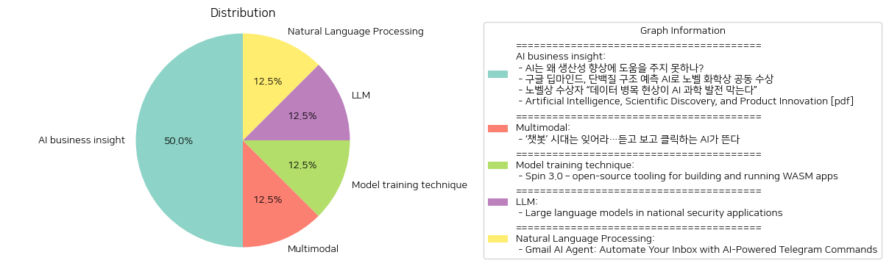

# Daily Artificial Intelligence Insights : News

## 👽 AI business insight

**요약:**

1. **주요 주제**:
   - 인공지능(AI)과 생산성의 상관관계
   - AI의 과학적 발견 및 혁신에 미치는 영향
   - 데이터 품질과 AI의 발전의 관계
   - AI의 응용성과 성과가 상이한 연구자들 간의 불균형

2. **주요 사건**:
   - **AI와 생산성 향상**: AI가 경제 발전에 기여할 수 있는 잠재적인 기술로 인정받고 있지만, 생산성 향상을 위해서는 몇 가지 개선이 필요하다는 지적이 있다.
   - **구글 딥마인드와 노벨 화학상**: 구글 딥마인드의 데미스 허사비스와 존 점퍼가 AI를 활용한 단백질 구조 예측 기술로 노벨 화학상을 수상하였다. 이는 AI가 과학적 문제 해결에 유용한 도구로서의 가능성을 보여준다.
   - **데이터 품질의 중요성**: AI 과학 발전을 저해하는 주요 요인으로 데이터 병목 현상이 지목되었으며, 고품질 데이터의 중요성이 강조되었다.
   - **과학적 발견 및 혁신**: AI를 활용한 연구자들이 새로운 재료를 44% 더 많이 발견하고, 특허 신청이 39% 증가하는 등 제품 혁신이 17% 상승한 것으로 나타났다. 그러나 이 효과는 연구자들 간 생산성의 불평등을 심화시킬 수 있다.

3. **영향 분석**:
   - **경제적 영향**: AI의 발전은 과학적 발견을 촉진하고, 신기술 및 제품 혁신을 가속화함으로써 경제 성장에 직접적으로 기여할 수 있다. 그러나 데이터 병목 현상은 이러한 발전을 저해할 수도 있다.
   - **사회적 영향**: AI의 발전은 연구자들 간의 불균형을 초래할 수 있으며, 이는 사회적 불평등으로 이어질 가능성이 있다.
   - **정치적 영향**: AI와 관련된 연구 개발에 대한 지원 정책이 강화될 가능성이 있으며, 이는 경제 성장 전략의 일환으로 고려될 것이다.

4. **최종 요약**:
   AI는 과학적 발견과 경제 발전에 기여할 수 있는 잠재력 있는 기술로 평가받고 있다. 구글 딥마인드의 노벨상 수상은 AI가 실질적인 문제 해결에 기여할 수 있음을 입증하였다. 그러나, 데이터 품질과 생산성 향상 등의 과제는 여전히 해결해야 할 문제이다. AI 발전의 이점은 연구자들 간 불균형을 확대할 수 있으며, 이는 정책적인 지원과 개선이 필요하다. 이러한 발전의 흐름은 경제 및 사회적 구조에도 영향을 미칠 가능성이 높기에 지속적인 관심과 연구가 요구된다.

**출처:**

 - AI는 왜 생산성 향상에 도움을 주지 못하나? (https://www.technologyreview.kr/ai%eb%8a%94-%ec%99%9c-%ec%83%9d%ec%82%b0%ec%84%b1-%ed%96%a5%ec%83%81%ec%97%90-%eb%8f%84%ec%9b%80%ec%9d%84-%ec%a3%bc%ec%a7%80-%eb%aa%bb%ed%95%98%eb%82%98/)
 - 구글 딥마인드, 단백질 구조 예측 AI로 노벨 화학상 공동 수상 (https://www.technologyreview.kr/%ea%b5%ac%ea%b8%80-%eb%94%a5%eb%a7%88%ec%9d%b8%eb%93%9c-%eb%8b%a8%eb%b0%b1%ec%a7%88-%ea%b5%ac%ec%a1%b0-%ec%98%88%ec%b8%a1-ai%eb%a1%9c-%eb%85%b8%eb%b2%a8-%ed%99%94%ed%95%99%ec%83%81-%ea%b3%b5%eb%8f%99/)
 - 노벨상 수상자 “데이터 병목 현상이 AI 과학 발전 막는다” (https://www.technologyreview.kr/%eb%85%b8%eb%b2%a8%ec%83%81-%ec%88%98%ec%83%81%ec%9e%90-%eb%8d%b0%ec%9d%b4%ed%84%b0-%eb%b3%91%eb%aa%a9-%ed%98%84%ec%83%81%ec%9d%b4-ai-%ea%b3%bc%ed%95%99-%eb%b0%9c%ec%a0%84-%eb%a7%89%eb%8a%94/)
 - Artificial Intelligence, Scientific Discovery, and Product Innovation [pdf] (https://aidantr.github.io/files/AI_innovation.pdf)

## 🪄 Multimodal

**요약:**

**1. 주요 주제:**
- AI 기술의 발전: 텍스트 기반 AI 챗봇에서 벗어나 음성과 영상 생성 기능을 갖춘 새로운 형태의 AI가 부상하고 있으며, 이는 AI 기술의 진화와 발전을 나타냅니다.

**2. 주요 사건:**
- 기존의 텍스트 중심 AI 챗봇이 쇠퇴하고 있으며, 음성 및 영상 생성 기술을 포함한 차세대 AI가 주목받고 있습니다. 이는 AI 기술 분야에서의 주요 전환점을 의미합니다.

**3. 영향 분석:**
- **경제:** 새로운 AI 기술의 등장은 다양한 산업에서 혁신을 주도하며, 생산성 향상 및 새로운 비즈니스 모델 창출을 가능하게 할 것입니다. AI 기술에 대한 투자와 연구개발(R&D)이 증가할 것으로 예상됩니다.
- **사회:** 사용자의 경험을 크게 향상시킬 수 있는 새로운 AI 기술로 인해 사용자 인터페이스 및 상호작용 방식이 혁신될 것입니다. 이는 교육, 의료 등 다양한 분야에서 AI 활용의 확장을 불러올 수 있습니다.
- **기술:** AI 기술의 발전은 더욱 복잡한 문제 해결과 데이터 분석을 가능하게 하며, 이는 기술 발전을 가속화시킬 것입니다.

**4. 최종 요약:**
- 결론적으로, 진화된 AI 시대의 도래는 경제적 이익과 사회적 변화를 동반할 것으로 보입니다. 기업들은 이 새로운 AI 기술을 활용하여 사업 운영을 혁신할 가능성이 높으며, 이는 전체적인 산업 생태계에도 변화를 가져올 것입니다. 또한, 이러한 변화에는 새로운 규제 및 윤리적 고려사항이 필요할 것입니다. 앞으로 AI 기술의 발전과 그에 따른 사회적, 경제적 변화에 주목할 필요가 있습니다.

**출처:**

 - ‘챗봇’ 시대는 잊어라…듣고 보고 클릭하는 AI가 뜬다 (https://www.technologyreview.kr/%ec%b1%97%eb%b4%87-%ec%8b%9c%eb%8c%80%eb%8a%94-%ec%9e%8a%ec%96%b4%eb%9d%bc-%eb%93%a3%ea%b3%a0-%eb%b3%b4%ea%b3%a0-%ed%81%b4%eb%a6%ad%ed%95%98%eb%8a%94-ai%ea%b0%80-%eb%9c%ac%eb%8b%a4/)

## 🎈 Model training technique

**요약:**

**1. 주요 테마**:
   - 기술 혁신: Spin 3.0의 출시는 서버리스 WebAssembly 애플리케이션 개발에 새로운 가능성을 열어 줌으로써 개발자에게 더 많은 도구와 옵션을 제공하고 있습니다.
   - 오픈 소스의 발전: Spin 3.0은 오픈 소스 개발자 도구로서 여러 프로그래밍 언어 간의 상호 운용성을 높이고 있으며, 이는 기술 커뮤니티 내 협업 및 발전을 촉진합니다.

**2. 주요 사건**:
   - Spin 3.0의 출시: Spin의 새로운 버전은 컴포넌트 개발을 위한 워크플로우를 도입하였으며, 이는 개발자가 한 언어로 라이브러리를 작성하고 다른 언어에서 사용할 수 있게 합니다.

**3. 영향 분석**:
   - 경제: 새로운 기능들이 포함된 Spin 3.0의 출시는 소프트웨어 개발 효율성을 향상시킬 수 있으며, 이는 개발 비용 절감과 더불어 스타트업 및 중소기업에게 기회를 제공할 수 있습니다.
   - 사회: 다양한 언어 지원과 더불어 오픈 소스 생태계의 확장으로 인해 개발자 커뮤니티 간의 협업과 혁신이 강화될 것으로 보입니다.

**4. 종합 요약**:
   Spin 3.0의 출시는 서버리스 WebAssembly 애플리케이션 개발을 위한 강력한 도구를 제공하며, 오픈 소스 소프트웨어의 상호 운용성을 한층 높이고 있습니다. 이는 개발자들이 다양한 언어와 플랫폼을 활용하여 더 많은 가능성을 탐구할 수 있도록 하여, 기술 혁신과 협업 기회를 확대합니다. 향후 Spin의 발전 방향과 그로 인한 산업 전체의 변화를 주목할 필요가 있으며, 이러한 발전이 가져올 경제적 및 사회적 변화를 기대할 수 있습니다.

**출처:**

 - Spin 3.0 – open-source tooling for building and running WASM apps (https://www.fermyon.com/blog/introducing-spin-v3)

## ☀️ LLM

**요약:**

1. **주요 주제**:
   대형 언어 모델(LLM)의 국가 안보 응용 관련 뉴스에서 주요 주제를 도출할 수 있는 것은 LLM의 이점과 리스크입니다. 자동화된 작업 처리 및 데이터 분석 강화 측면에서의 혜택과, 환각 및 데이터 프라이버시 우려와 같은 위험성이 반복적으로 언급됩니다. 또한 의사 결정 이론 원칙을 적용하여 의사 결정 과정을 개선할 수 있는 잠재력도 주요 주제로 드러납니다.

2. **주요 사건**:
   기사에서 가장 중요한 사건은 국가 안보 분야에서 대형 언어 모델의 적용 확대입니다. 여기에는 의사 결정 과정의 개선을 포함하여 자동화된 작업 및 데이터 분석을 통해 업무 효율성을 증대시키는 사례가 포함됩니다. 그러나 이러한 모델에는 정확성과 신뢰성을 확보하기 위한 엄격한 안전장치가 필요하다는 점이 강조됩니다.

3. **영향 분석**:
   이러한 기술 발전은 국가 안보 분야에 긍정적인 영향을 미칠 수 있으며, 특히 보다 효율적인 의사 결정과 빠른 데이터 처리 능력 향상으로 이어질 것으로 예상됩니다. 그러나 동시에, 이러한 기술의 오용 가능성과 데이터 프라이버시에 대한 우려는 정치 및 사회적 논의를 불러일으키며 규제 프레임워크 및 정책에 영향을 미칠 것입니다.

4. **최종 요약**:
   대형 언어 모델의 국가 안보 응용은 기술적인 혁신과 함께 중요하지만, 이와 동시에 예상치 못한 위험 요소도 수반합니다. LLM의 이점은 큰 가능성을 지니고 있지만, 정확성과 안전성을 담보하기 위한 적절한 대처와 규제가 필요합니다. 앞으로는 이러한 모델을 안전하게 활용하기 위한 정책 및 규제의 발전을 주목해야 할 것입니다. 이는 기술이 제공하는 혜택을 누리면서도 그로 인한 부작용을 최소화하는 방향으로 나아가야 함을 시사합니다.

**출처:**

 - Large language models in national security applications (https://arxiv.org/abs/2407.03453)

## 🎠 Natural Language Processing

**요약:**

1. **주요 주제**:
   이 뉴스 기사는 AI 기반의 이메일 관리 시스템에 대해 다루고 있습니다. 주제는 이메일 작업의 자동화, AI를 통한 업무 효율성 증대, 맞춤형 설정을 통한 사용자 컨트롤 강화로 요약할 수 있습니다. 이러한 테마는 기술의 발전이 어떻게 우리의 일상적인 업무 방식을 변화시키고 있는지 보여주고 있습니다.

2. **주요 사건**:
   기사에서는 Gmail AI 에이전트가 AI 기술을 이용하여 이메일 처리를 자동화하는 방법을 소개하고 있습니다. 이메일 분석과 자동화된 알림 및 작업 제안, 텔레그램을 통한 사용자 제어 기능이 포함되어 있습니다. 사용자는 텔레그램을 통해 이메일을 더 효율적으로 관리할 수 있습니다.

3. **영향 분석**:
   이러한 AI 기반 이메일 관리 시스템은 경제와 사회에 다양한 영향을 미칠 수 있습니다. 경제적으로는 이메일 처리 자동화를 통해 업무 효율성을 높여 기업의 생산성을 향상시킬 수 있습니다. 또한, AI 기술의 확산은 새로운 비즈니스 기회를 창출하고 고용 시장에도 변화를 가져올 수 있습니다. 사회적으로는 개인 사용자의 시간과 노력을 절감하여 더 중요한 작업에 집중할 수 있는 환경을 제공할 수 있습니다.

4. **최종 요약**:
   전반적으로, AI를 활용한 이메일 자동화 기술은 업무 관리의 효율성을 극대화하며 사용자 경험을 혁신하고 있습니다. 기술의 발전이 일상적인 업무에서 더 큰 영향력을 발휘하게 될 것이며, 앞으로 이러한 기술의 발전과 확산을 주목할 필요가 있습니다. 특히, AI 및 자동화 기술은 경제와 사회에 큰 변화를 가져올 가능성이 높으며, 이에 따른 기회와 도전에 대한 준비가 필요할 것입니다.

**출처:**

 - Gmail AI Agent: Automate Your Inbox with AI-Powered Telegram Commands (https://github.com/olivierloverde/gmail-agent)

