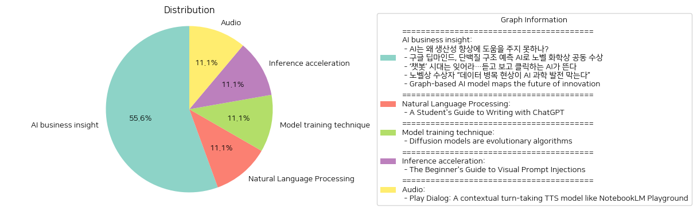

# Daily Artificial Intelligence Insights : News

## 🪄 AI business insight

**요약:**

1. **주요 테마**:
   - 인공지능(AI)의 발전과 그에 따른 잠재적 영향
   - AI를 활용한 과학적 발견 및 기술 혁신
   - 데이터의 중요성과 AI 발전에 대한 요구
   - 새로운 AI 기술 및 진화 방향

2. **주요 사건**:
   - AI가 생산성 향상에 기여하지 못한다는 이슈가 제기되면서 몇 가지 중대한 개선 필요성이 논의됨.
   - 구글 딥마인드가 AI를 사용하여 단백질 구조 예측에 성공, 노벨 화학상을 공동으로 수상함.
   - 텍스트 기반 챗봇을 넘어 음성 및 영상 생성 기능을 갖춘 AI 기술이 부상하고 있음.
   - 노벨상 수상자가 AI 과학 발전의 장애로 데이터 병목 현상을 지적하면서 고품질 데이터의 필요성을 강조.
   - 그래프 기반 AI 모델로 새로운 혁신의 길을 제시함으로써 과학과 예술 사이의 숨겨진 연결 고리를 찾는 연구가 진행됨.

3. **영향 분석**:
   - **경제**: AI의 생산성 향상에 대한 논의는 경제 발전에 중요한 파급 효과를 미칠 수 있으며, 효과적인 AI 도입이 경제 성장을 촉진할 수 있음.
   - **과학·기술**: AI를 통한 단백질 구조 예측은 생명과학 연구와 의약품 개발에 큰 혁신을 불러올 수 있으며, 그래프 기반 AI 연구는 신소재 개발과 창의성 증진에 기여할 가능성이 큼.
   - **사회**: 고품질 데이터의 필요성은 데이터 관리 및 수집방식 개선의 중요성을 강조하며, 다양한 AI 기술의 부상은 일상생활의 변화를 예고함.

4. **최종 요약**:
   최근 AI 기술의 발전은 과학적 발견과 기술 혁신을 가속화하고 있으며, 이는 노벨상 수상업체들과 같이 실질적인 성과로 나타나고 있다. 그러나, AI가 생산성을 향상시키기 위해서는 데이터 관리 및 품질 향상이 필수적이며, 기존 텍스트 기반 챗봇을 넘어 다양한 방식의 AI 기술이 부상하고 있다. 이러한 트렌드와 이슈를 기반으로 미래에는 AI의 경제적, 과학적 기여도가 점차 증가할 것으로 예상되며, 데이터 품질 및 AI의 윤리적 사용에 대한 지속적인 관심과 노력이 필요하다.

**출처:**

 - AI는 왜 생산성 향상에 도움을 주지 못하나? (https://www.technologyreview.kr/ai%eb%8a%94-%ec%99%9c-%ec%83%9d%ec%82%b0%ec%84%b1-%ed%96%a5%ec%83%81%ec%97%90-%eb%8f%84%ec%9b%80%ec%9d%84-%ec%a3%bc%ec%a7%80-%eb%aa%bb%ed%95%98%eb%82%98/)
 - 구글 딥마인드, 단백질 구조 예측 AI로 노벨 화학상 공동 수상 (https://www.technologyreview.kr/%ea%b5%ac%ea%b8%80-%eb%94%a5%eb%a7%88%ec%9d%b8%eb%93%9c-%eb%8b%a8%eb%b0%b1%ec%a7%88-%ea%b5%ac%ec%a1%b0-%ec%98%88%ec%b8%a1-ai%eb%a1%9c-%eb%85%b8%eb%b2%a8-%ed%99%94%ed%95%99%ec%83%81-%ea%b3%b5%eb%8f%99/)
 - ‘챗봇’ 시대는 잊어라…듣고 보고 클릭하는 AI가 뜬다 (https://www.technologyreview.kr/%ec%b1%97%eb%b4%87-%ec%8b%9c%eb%8c%80%eb%8a%94-%ec%9e%8a%ec%96%b4%eb%9d%bc-%eb%93%a3%ea%b3%a0-%eb%b3%b4%ea%b3%a0-%ed%81%b4%eb%a6%ad%ed%95%98%eb%8a%94-ai%ea%b0%80-%eb%9c%ac%eb%8b%a4/)
 - 노벨상 수상자 “데이터 병목 현상이 AI 과학 발전 막는다” (https://www.technologyreview.kr/%eb%85%b8%eb%b2%a8%ec%83%81-%ec%88%98%ec%83%81%ec%9e%90-%eb%8d%b0%ec%9d%b4%ed%84%b0-%eb%b3%91%eb%aa%a9-%ed%98%84%ec%83%81%ec%9d%b4-ai-%ea%b3%bc%ed%95%99-%eb%b0%9c%ec%a0%84-%eb%a7%89%eb%8a%94/)
 - Graph-based AI model maps the future of innovation (https://news.mit.edu/2024/graph-based-ai-model-maps-future-innovation-1112)

## 🪄 Natural Language Processing

**요약:**

**요약 보고서**

1. **주요 주제**:
   모든 뉴스 기사에서 반복되는 주요 주제는 기술 발전을 교육과 접목하여 학생들이 효과적으로 학습할 수 있는 방법들을 탐구하는 내용입니다. 특히, ChatGPT와 같은 인공지능 도구가 학생들의 학문적 성장을 지원할 방법에 대한 논의가 다루어집니다.

2. **주요 사건**:
   이 기사에서는 ChatGPT가 학생들의 사고력과 글쓰기 능력을 향상시키는 도구로 활용될 수 있다는 점을 강조합니다. ChatGPT는 반복적인 작업을 자동화하고, 자료를 제안하며, 초안에 대한 피드백을 제공함으로써 학생들의 학습 효율성을 높이는 역할을 할 수 있습니다. 다만, 사용자는 항상 이러한 도구를 투명하고 책임감 있게 사용해야 한다고 언급하며, 적절한 인용과 교수들과의 개방적인 소통을 통해 학문적 진실성을 유지하는 것이 중요하다고 강조합니다.

3. **영향 분석**:
   이러한 기술의 도입은 교육 분야에 상당한 영향을 미칠 것으로 보입니다. ChatGPT의 활용은 학생들의 연구 및 글쓰기 과정에서 반복적인 작업의 부담을 줄여줄 수 있으며, 이로 인해 학생들은 더 깊이 있는 사고와 창의적 활동에 집중할 수 있을 것으로 기대됩니다. 그러나 이러한 기술의 남용이나 부적절한 사용은 학문적 진실성에 문제를 초래할 수도 있으므로, 학생들과 교육자 모두 의식적으로 올바른 사용법을 익힐 필요가 있습니다.

4. **최종 요약**:
   전반적으로, 인공지능과 같은 첨단 기술이 교육 분야에 도입됨으로써 학생들의 학습 방법과 효율성이 혁신적으로 변화할 잠재력이 있습니다. 앞으로 ChatGPT와 유사한 도구가 교육 과정에서 어떠한 역할을 맡을지, 그리고 그것이 학습자와 교육자의 관계에 어떤 변화를 가져올지 계속 지켜볼 필요가 있습니다. 또한, 이를 통해 발생할 수 있는 윤리적 문제나 기술 남용 문제를 방지하기 위한 명확한 가이드라인과 적절한 교육이 병행되어야 할 것입니다.

**출처:**

 - A Student's Guide to Writing with ChatGPT (https://openai.com/chatgpt/use-cases/student-writing-guide/)

## 🚀 Model training technique

**요약:**

**요약 보고서**

1. **주요 주제**:
   - 이번 기사에서는 "확산 모델이 진화 알고리즘"이라는 주제를 중심으로 연구 논문이 발표되었습니다. 이는 확산 모델을 자연선택, 돌연변이, 생식 격리의 진화 과정을 통해 이해할 수 있다는 점을 강조하고 있습니다.

2. **주요 사건**:
   - 마이클 레빈의 논문은 확산 모델을 진화 알고리즘으로 간주할 수 있다는 내용을 담고 있습니다. 이러한 접근은 컴퓨터 과학 및 인공지능 분야에서 모델을 이해하고 발전시키는 새로운 관점을 제시합니다.

3. **영향 분석**:
   - 산업과 연구: 인공지능 연구와 컴퓨터 모델링 분야에서 새로운 패러다임을 제시하면서, 연구자들에게 기존의 모델링 접근 방식을 재평가하는 계기를 마련할 것입니다.
   - 사회적 측면: 인공지능의 발전 양상에 대한 새로운 이해 가능성을 제공하여, 관련 교육 및 윤리적 논의를 확장시킬 수 있습니다.

4. **최종 요약**:
   - 이번 연구는 확산 모델을 새로운 시각으로 이해할 수 있는 가능성을 열어주었습니다. 이는 인공지능 알고리즘의 발전과 해석 방법에 큰 변화를 가져올 수 있으며, 연구자들이 기존의 패러다임을 재검토하고 새로운 알고리즘 개발에 영감을 얻을 수 있는 기회를 제공합니다. 앞으로 이 논문이 확산 모델과 인공지능 연구에 어떤 영향을 미칠지, 그리고 어떻게 받아들여질지를 주목할 필요가 있습니다.

**출처:**

 - Diffusion models are evolutionary algorithms (https://gonzoml.substack.com/p/diffusion-models-are-evolutionary)

## 🌞 Inference acceleration

**요약:**

**뉴스 요약 보고서**

1. **주요 주제**:
   최근 뉴스 기사에서 드러난 주요 주제는 대형 언어 모델의 개인 데이터 유출 우려와 시각적 프롬프트 인젝션에 대한 보안 취약점입니다. 이 두 가지 주제는 인공지능 및 데이터 보안과 관련하여 뜨거운 논의가 되고 있습니다. 

2. **주요 사건**:
   한 해커톤에서 시각적 프롬프트 인젝션이 모델의 방어를 우회할 수 있음을 보여 주었습니다. 이로 인해 사용자들은 대형 언어 모델이 프롬프트 인젝션으로 인해 개인 데이터를 보호하는 데 실패할 수 있다는 걱정을 하고 있습니다.

3. **영향 분석**:
   * 경제: 기업들은 인공지능 모델의 보안을 강화하기 위해 추가적인 투자와 연구개발이 필요하게 되었습니다. 이는 기술 보안 업계의 발전을 촉진할 수 있습니다.
   * 정치: 대형 언어 모델의 보안 취약성 이슈로 인해 데이터 보호에 관한 규제가 더 강화될 가능성이 큽니다.
   * 사회: 개인정보 유출 우려로 인해 사용자들이 기술에 대한 신뢰를 잃을 수 있습니다. 이는 인공지능 기술의 활용도를 저하시킬 수 있습니다.

4. **최종 요약**:
   이 뉴스는 대형 언어 모델이 아직도 몇몇 보안 취약성을 가지고 있으며, 특히 시각적 프롬프트 인젝션과 같은 새로운 공격 벡터에 의해서도 위험해질 수 있음을 보여줍니다. 향후 대형 기술 기업 및 연구 기관은 이러한 보안 취약성을 해결하기 위한 해결책을 모색할 것이고, 이 과정에서 관련 분야의 기술이 더욱 발전할 것으로 예상됩니다. 정책적 측면에서는 개인정보 보호 규제가 강화될 가능성이 높습니다. 향후 주목해야 할 것은 이러한 기술 발전 및 규제 변화가 사용자들의 신뢰 회복에 어떠한 영향을 미칠지입니다.

**출처:**

 - The Beginner's Guide to Visual Prompt Injections (https://www.lakera.ai/blog/visual-prompt-injections)

## 🎠 Audio

**요약:**

**주요 테마**:
최근 뉴스 기사에서 주요 테마로는 인공지능 기술의 발전과 이를 활용한 새로운 애플리케이션의 개발이 포함되었습니다. 특히, 텍스트-음성 변환(TTS) 모델과 같은 대화형 AI 모델의 향상이 두드러졌습니다. 이러한 인공지능 기술은 실시간으로 인간과 유사한 음성 대화를 생성하는 기능을 제공함으로써 더욱 자연스러운 커뮤니케이션을 가능하게 하고 있습니다.

**주요 사건**:
기사에서는 PlayAI의 새로운 음성 생성 API를 소개하며, 이 기술이 빠른 속도로 실시간 대화 환경을 구축할 수 있음을 강조합니다. Play Dialog와 같은 모델들이 이러한 발전의 중심에 있으며, 특히 인간과 유사한 대화를 생성할 수 있는 능력에 중점을 두고 있습니다.

**영향 분석**:
이러한 기술 발전은 여러 부문에서 영향을 미칠 것으로 보입니다. 경제적으로, 음성 기반 AI 기술은 고객 서비스, 교육, 의료 분야 등에서 효율성을 높이고 비용을 절감할 수 있는 기회를 제공할 수 있습니다. 사회적으로는 기술의 접근성이 증가함에 따라 AI를 활용한 커뮤니케이션이 더 많은 사람들에게 개방될 수 있으며, 이는 새로운 형태의 소셜 인터랙션을 창출할 가능성을 제공합니다.

**최종 요약**:
최근의 뉴스는 인공지능 기술의 급속한 발전과 응용을 중심으로, 특히 AI를 활용한 대화형 모델들의 진보를 다루고 있습니다. 이러한 기술은 경제적 효율성을 높이고 사회적 상호작용을 변화시킬 잠재력을 가지고 있습니다. 앞으로 이러한 기술이 더 많은 분야에 어떻게 적용되고, 어떤 형태의 발전을 이루게 될지 주목할 필요가 있습니다. 개발 속도와 함께 윤리적인 측면 및 기술 남용 가능성에 대한 모니터링도 중요할 것입니다.

**출처:**

 - Play Dialog: A contextual turn-taking TTS model like NotebookLM Playground (https://play.ai/playground)

