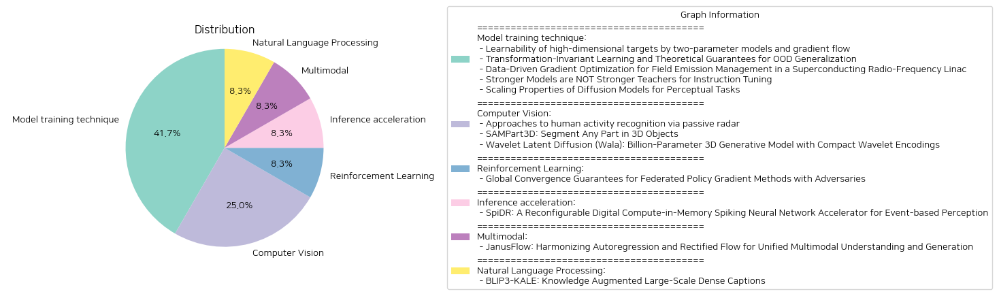

# Daily Artificial Intelligence Insights : Papers

## 🌅 Model training technique

**요약:**

1. **핵심 주제 및 테마 추출:**
   - 고차원 목표 학습 및 매개변수 모델 활용
   - 분포 변동이 있는 학습과 외부 데이터 일반화
   - 초전도 라디오 주파수 선형 가속기에서 필드 방출 관리
   - 명령 조정에서의 강력한 모델 역할 및 최적화
   - 확산 모델의 시각적 인식 작업에서의 확장 속성

2. **공통 키워드, 트렌드, 패턴 식별:**
   - 학습과 최적화: 다양한 모델 접근법과 그 효과성
   - 데이터 분포 및 변동의 영향: 학습에서 분포 변동의 중요성과 적응 능력
   - 확산 모델과 시각적 퍼셉션: 퍼셉션 작업에서 확산 모델의 역할
   - 알고리즘의 개선 및 평가 메트릭 개발: 학습의 효과성 평가를 위한 새로운 기준 및 접근법 도입

3. **주요 사건과 핵심 정보 요약:**
   - 두 매개변수 모델과 그래디언트 흐름을 통한 고차원 목표 학습 가능성 조사, 비학습 가능 목표 존재
   - 분포 변동과 클래스 변환 맵을 통한 통계적 학습에 대한 이론적 연구 시작
   - 초전도 라디오 주파수 가속기에서 머신러닝을 통한 방사선 수준 예측 및 필드 방출 감소
   - 명령 조정에서 큰 모델들이 항상 더 나은 교사 역할을 하지 못한다는 결론과 새로운 효과성 평가 메트릭(CAR) 개발
   - 확산 모델을 통한 시각적 인식 작업에서의 데이터 및 계산 감소와 성능 향상

4. **이 사건들이 다양한 분야에 미친 영향 분석:**
   - 인공지능 및 머신러닝: 모델 학습과 최적화 기법의 혁신적 접근, 데이터와 계산 자원의 효율적 사용을 통한 학습 성능 개선
   - 교육 및 연구: 명령 조정과 모델 호환성 개선을 통한 교육 자료 개발의 변화
   - 산업 및 기술: 초전도 라디오 주파수 가속기 성능 개선을 통한 방사선 관리 혁신

5. **결론 및 주목할 만한 미래 발전:**
   - 고차원 목표를 학습하는 데 있어 적은 매개변수를 가진 모델의 가능성과 한계 파악
   - 분포 변동 상황에서의 학습 효율성 향상을 위한 규칙 및 보장 마련
   - 명령 조정과 관련한 모델 호환성 연구의 중요성과 초점 두기
   - 시각적 인식 작업에서 확산 모델의 잠재적 활용 증가, 향후 연구 개발의 주목 필요
   - 향후 데이터 분포의 변동과 그에 따른 학습 방법의 적응 및 최적화 전략이 주요 집중 분야로 부상할 것으로 예측됨

**출처:**

 - Learnability of high-dimensional targets by two-parameter models and gradient flow (https://deeplearn.org/arxiv/547085/learnability-of-high-dimensional-targets-by-two-parameter-models-and-gradient-flow)
 - Transformation-Invariant Learning and Theoretical Guarantees for OOD Generalization (https://deeplearn.org/arxiv/544058/transformation-invariant-learning-and-theoretical-guarantees-for-ood-generalization)
 - Data-Driven Gradient Optimization for Field Emission Management in a Superconducting Radio-Frequency Linac (https://deeplearn.org/arxiv/547416/data-driven-gradient-optimization-for-field-emission-management-in-a-superconducting-radio-frequency-linac)
 - Stronger Models are NOT Stronger Teachers for Instruction Tuning (http://arxiv.org/abs/2411.07133v2)
 - Scaling Properties of Diffusion Models for Perceptual Tasks (http://arxiv.org/abs/2411.08034v1)

## 🪄 Computer Vision

**요약:**

**종합 요약 보고서**

1. **핵심 주제 및 테마 추출**
    - **인간 활동 인식 (HAR)**: 비침습적인 Wi-Fi 채널 상태 정보(CSI)를 활용하여 인간 활동을 알아내는 방법.
    - **3D 부품 세분화**: 각종 3D 객체를 다양한 의미적 부품으로 나누는 SAMPart3D 시스템.
    - **3D 생성 모델**: WaLa라는 웨이브릿 기반의 압축 인코딩을 통한 3D 생성 모델 최적화.

2. **공통 키워드, 트렌드 및 패턴**
    - **비침습적 기술과 프라이버시**: HAR 연구에서는 프라이버시 문제를 해결하기 위해 비침습적 데이터를 선호.
    - **대규모 데이터셋과 확장성**: SAMPart3D와 WaLa 모두 대규모 데이터셋을 다루기 위한 확장 가능성에 중점.
    - **고효율 시각 모델**: 상대적으로 낮은 시스템 자원을 사용하면서도 높은 성능을 구현.

3. **주요 사건 및 주요 정보 요약**
    - HAR 연구에서는 스파이킹 신경 네트워크(SNN)와 DeepProbLog를 통합하여 높은 정확도의 비침습적 활동 인식 시스템을 개발.
    - SAMPart3D는 기존 방법의 제약인 텍스트 프롬프트의 한계를 극복하여 대규모 3D 데이터셋 Objaverse에서의 3D 부품 세분화 능력을 시연.
    - WaLa는 3D 형상 인코딩 효율을 높여 대규모 생성기 네트워크를 효과적으로 훈련할 수 있게 하며, 약 10억 개의 파라미터를 갖춘 대규모 모델로 높은 해상도의 3D 형상을 생성.

4. **이벤트가 다양한 분야에 미친 영향 분석**
    - **정보 보안 및 프라이버시 보호**: HAR의 비침습적 접근 방식은 프라이버시 보안을 강화시키며 다양한 산업에서 채택 가능성을 높임.
    - **로봇 공학 및 3D 편집**: SAMPart3D의 성공적인 세분화는 로봇 공학 및 3D 편집 분야의 발전에 기여하며, 상호작용적 부분 편집을 촉진.
    - **컴퓨터 레지나 기술**: WaLa는 3D 생성 모델의 효율성을 강화하여 AI 기반 3D 설계, 애니메이션 제작 등 다양한 컴퓨터 레지나 기술 발전에 기여.

5. **결론 및 향후 발전 동향**
    - **진보된 데이터 활용 및 AI 통합**: 미래에는 비침습적 데이터 및 고도화된 AI 네트워크의 통합으로 다양한 분야에서의 응용이 증가할 것으로 전망.
    - **대규모 데이터셋의 활용 가능성**: 확장 가능한 기술 개발로 인해 연구와 개발 분야에서 대규모 데이터셋의 사용이 더욱 일반화될 것.
    - **효율적인 자원 관리 및 그린 컴퓨팅**: 대규모 모델을 구현함에 있어 자원 효율성을 극대화하기 위한 웨이브릿 및 기타 압축 기술의 채택이 계속 증가할 것임.

이러한 동향과 기술의 발전은 여러 산업에 주요한 변화를 가져올 가능성이 있으며, 지속적인 연구 및 발전이 중요하다.

**출처:**

 - Approaches to human activity recognition via passive radar (https://deeplearn.org/arxiv/543512/approaches-to-human-activity-recognition-via-passive-radar)
 - SAMPart3D: Segment Any Part in 3D Objects (http://arxiv.org/abs/2411.07184v1)
 - Wavelet Latent Diffusion (Wala): Billion-Parameter 3D Generative Model with Compact Wavelet Encodings (http://arxiv.org/abs/2411.08017v1)

## 🥳 Reinforcement Learning

**요약:**

제목: '적대적 환경에서의 연합 정책 기울기 방법에 대한 글로벌 수렴 보장'

요약: 연합 강화 학습(FRL)은 여러 에이전트가 원시 경로를 공유하지 않고 의사결정 정책을 공동으로 구축할 수 있게 합니다. 그러나 이러한 에이전트 중 소규모가 적대적이면 파국적인 결과를 초래할 수 있습니다. 본 논문은 서버에게 임의의 값을 전송할 수 있는 적대적 에이전트에 대해 강인한 정책 기울기 기반 접근법을 제안합니다. 이 설정 하에서, 우리의 결과는 일반 매개변수화로 첫 번째 글로벌 수렴 보장을 형성합니다. 이러한 결과는 적대적인 환경에서의 회복력을 입증하며, $N$이 총 에이전트 수이고 $f<N/2$가 적대적 에이전트 수일 때, 순서 $\tilde{\mathcal{O}}\left( \frac{1}{N\epsilon^2} \left( 1+\frac{f^2}{N}\right)\right)$의 최적 샘플 복잡도를 달성합니다.

주요 주제 및 테마: 본 논문은 연합 강화 학습에서의 정책 기울기 방법에 관한 연구로, 적대적 환경 속에서도 글로벌 수렴을 보장하는 강인한 접근법을 제시합니다.

공통 키워드, 트렌드 및 패턴:
- 연합 강화 학습(FRL)
- 정책 기울기 방법
- 적대적 에이전트의 영향
- 글로벌 수렴 보장
- 최적 샘플 복잡도

주요 이벤트 및 중요 정보:
이 논문은 연합 강화 학습의 맥락에서 적대적 에이전트가 참여할 경우 발생할 수 있는 문제점을 다루며, 이러한 문제에 대처하기 위한 정책 기울기 기반의 강인한 접근법을 제시합니다. 이를 통해, 적대적 요소를 포함한 환경에서도 글로벌 수렴을 보장할 수 있음을 보여줍니다. 또한, 이 접근법은 샘플 복잡도를 최적화하여 효과적인 학습을 가능하게 합니다.

이벤트의 영향 분석:
이 연구는 연합 강화 학습에 있어서의 신뢰성과 효율성을 높이는 데 크게 기여할 수 있으며, 적대적인 요인에 대한 강인한 대처 방안을 제공함으로써 관련 응용 분야에 긍정적인 영향을 미칠 것으로 예상됩니다. 이는 특히 보안 및 안정성이 중요한 분야에서의 적용 가능성을 시사합니다.

결론 및 향후 발전 방향:
본 연구는 연합 강화 학습에 있어 적대적 요인에도 불구하고 신뢰성 있는 글로벌 수렴을 보장하는 첫 번째 방식으로 기여했습니다. 향후 연구에서는 이 방법의 확장 및 다양한 응용 영역에서의 효과 검증, 그리고 실질적인 네트워크 환경에서의 테스트 등이 이루어질 필요가 있습니다.

**출처:**

 - Global Convergence Guarantees for Federated Policy Gradient Methods with Adversaries (https://deeplearn.org/arxiv/545735/global-convergence-guarantees-for-federated-policy-gradient-methods-with-adversaries)

## 🪐 Inference acceleration

**요약:**

보고서 요약:

1. 주요 주제 및 테마:
   - 스파이킹 뉴럴 네트워크(SNN)와 이벤트 기반 인식
   - 비동기적 시간 데이터 처리 및 동적 비전 센서를 사용하는 스파이킹 뉴럴 네트워크의 잠재력
   - 다중 비트 정밀도, 다양한 뉴런 모델 및 네트워크 크기에 대한 적응성 문제
   - 막전위(Vmem) 처리의 비효율성과 제한된 희소성 최적화

2. 공통 키워드, 트렌드 및 패턴:
   - 컴퓨팅 인 메모리(compute-in-memory) 가속기
   - 가변 작업 부하에 적응하기 위한 재구성 가능 모드
   - 입력 희소성을 활용한 에너지 효율성
   - 비동기적 핸드셰이킹 방식의 장점

3. 주요 사건 및 중요한 정보:
   - SpiDR로 명명된 고도로 확장 가능하고 재구성 가능한 디지털 컴퓨팅 인 메모리 SNN 가속기 설계
   - 데이터 이동 최소화를 통해 효율적인 처리를 지원하는 인 메모리 컴퓨테이션 사용
   - 다중 가중치/막전위(Vmem) 비트 정밀도로 정확성 및 에너지 효율성 간 트레이드오프 가능
   - 희소한 입력을 위한 제로-스키핑 메커니즘을 통한 에너지 절감
   - 다양한 연산 단위의 가변 실행 시간을 위해 파이프라인의 계산 효율성을 유지하는 비동기적 핸드셰이킹 메커니즘

4. 이러한 사건이 다양한 부문에 미치는 영향:
   - SNN 가속기의 성능 향상과 에너지 효율성 증가
   - 다양한 애플리케이션 요구에 대한 적응성 증가 및 산업별 솔루션에 적용 가능성
   - 반도체 제조 산업에서의 기술 혁신과 새로운 설계 방법론 지원

5. 최종 결론 및 미래 발전 가능성:
   - 본 연구는 스파이킹 뉴럴 네트워크의 가속기 설계에 있어 첨단의 재구성 가능성과 에너지 효율성을 달성하는 데 기여하였다.
   - 향후 더 많은 응용 분야에서 본 연구의 결과가 활용될 수 있으며, 특히 이벤트 기반의 감각 데이터 처리와 관련하여 중요한 발전을 보일 수 있다.
   - 지속적인 연구와 발전이 다양한 산업의 수요에 맞춘 맞춤형 솔루션을 제공할 수 있을 것으로 기대된다.

**출처:**

 - SpiDR: A Reconfigurable Digital Compute-in-Memory Spiking Neural Network Accelerator for Event-based Perception (https://deeplearn.org/arxiv/545756/spidr:-a-reconfigurable-digital-compute-in-memory-spiking-neural-network-accelerator-for-event-based-perception)

## ❄️ Multimodal

**요약:**

제목: 'JanusFlow: 자귀회귀와 고정된 흐름을 조화롭게 통합한 다중 모달 이해 및 생성'

1. 핵심 주제 및 테마 추출:
   - 이미지 이해 및 생성 통합 모델
   - 최소주의적 아키텍처
   - 자귀회귀 언어 모델과 고정된 흐름 통합
   - 복잡한 아키텍처 수정을 피하고 대형 언어 모델에 고정된 흐름을 쉽게 훈련
   - 이해와 생성 인코더 분리, 통합 훈련 중 표현 정렬

2. 공통 키워드, 트렌드, 패턴 식별:
   - 자귀회귀, 고정된 흐름
   - 통합 모델, 최소 아키텍처
   - 비교 평가에서 전문 모델 및 기존 통합 접근법보다 우수한 성능

3. 주요 사건 및 중요한 정보 요약:
   - JanusFlow는 이미지 이해와 생성을 하나의 모델로 통합하는 혁신적인 프레임워크를 제시
   - 최소주의적 아키텍처에 의해 자귀회귀 언어 모델과 첨단 생성 모델링 방법인 고정된 흐름을 결합
   - 이해 및 생성 인코더의 분리와 두 표현의 정렬을 통해 성능 향상
   - 실험에서 JanusFlow는 각 세부 도메인에서 전문 모델과 유사하거나 그 이상의 성능을 보여주었으며, 기존 통합 접근법보다 표준 벤치마크에서 훨씬 뛰어난 성능을 보여줌

4. 이러한 사건들이 다양한 부문에 미친 영향 분석:
   - 다중 모달 이해 및 생성에서 모델 통합의 효율성을 높임
   - 대형 언어 모델 프레임워크 내의 고정된 흐름 훈련이 가능해져 복잡한 구조 변경이 필요 없음
   - 이미지 기반 응용 프로그램에서 전문 모델 및 기존의 통합 전략을 원활히 대체할 수 있는 가능성을 제공

5. 최종 통합 요약 및 결론 및 잠재적인 미래 발전:

JanusFlow는 이미지 이해와 생성을 단일 프레임워크로 통합하여 효율적이고 다재다능한 비전-언어 모델로 자리 잡고 있습니다. 이 연구는 자귀회귀 언어 모델과 고정된 흐름의 조화를 통해 복잡한 아키텍처 변경 없이도 강력한 통합 모델이 가능하다는 것을 보여줍니다. JanusFlow는 최소 아키텍처를 통해 이해와 생성 기능을 통합하여 전문 모델 이상의 성능을 발휘하며, 통합 모델의 미래 가능성을 모색하는 데 기여하고 있습니다. 향후에는 더욱 다양한 데이터 도메인 및 응용 프로그램에 JanusFlow와 같은 접근법이 적용될 가능성이 높아 보입니다.

**출처:**

 - JanusFlow: Harmonizing Autoregression and Rectified Flow for Unified Multimodal Understanding and Generation (http://arxiv.org/abs/2411.07975v1)

## 🎠 Natural Language Processing

**요약:**

제목: 'BLIP3-KALE: 지식 증강 대규모 밀집 캡션'

1. 주요 주제 및 테마 추출:
   - BLIP3-KALE 데이터셋 소개
   - 이미지-텍스트 쌍 및 사실 기반 웹 규모 대체 텍스트 간의 간극 연결
   - 지식 증강 이미지 캡션 생성

2. 공통 키워드 및 트렌드:
   - 대규모 데이터셋
   - 비전-언어 모델
   - 지식 증강
   - 멀티모달 모델

3. 중요 사건 및 정보 요약:
   - BLIP3-KALE는 218백만 개의 이미지-텍스트 쌍을 포함하는 데이터셋으로, 설명적 합성 캡션과 사실적 웹 규모의 대체 텍스트를 연결하여 사실에 기반한 이미지 캡션을 생성한다.
   - 이 데이터셋은 두 단계 접근방식(대규모 비전-언어 모델과 언어 모델 적용)을 활용하여 지식 증강된 캡션을 생성하고, 이를 사용하여 특별한 비전-언어 모델(VLM)을 학습하여 데이터셋을 확장한다.
   - KALE 데이터셋을 활용한 비전-언어 모델 학습을 통해 더 유능하고 지식적인 멀티모달 모델의 발전이 실험적으로 입증되었다.

4. 사건의 다양한 분야에 미치는 영향 분석:
   - 인공지능 연구: 대규모 멀티모달 데이터셋을 통한 모델 학습의 질적 향상.
   - 이미지-텍스트 분석: 보다 정확하고 사실에 기반한 이미지 캡션 생성 가능.
   - 기술 응용 분야: 다양한 비전-언어 작업에서의 성능 개선.

5. 최종 요약 및 앞으로 주목할 발전:
   BLIP3-KALE는 대규모의 이미지-텍스트 쌍을 활용하여 합성 캡션과 사실적 대체 텍스트를 효과적으로 조합함으로써, 지식 증강 기반의 캡션을 생성하는 데 성공하였다. 결과적으로, 이 데이터셋은 비전-언어 모델의 발전을 촉진하여 멀티모달 이해 및 처리 능력을 강화하는 데 기여하고 있다. 앞으로 KALE 데이터셋을 활용한 다양한 응용 분야에서의 가능성을 지켜봐야 하며, 이러한 발전이 멀티모달 인공지능 분야에 어떤 방식으로 더욱 혁신적인 변화를 가져올 수 있을지 주목할 필요가 있다.

**출처:**

 - BLIP3-KALE: Knowledge Augmented Large-Scale Dense Captions (http://arxiv.org/abs/2411.07461v1)

