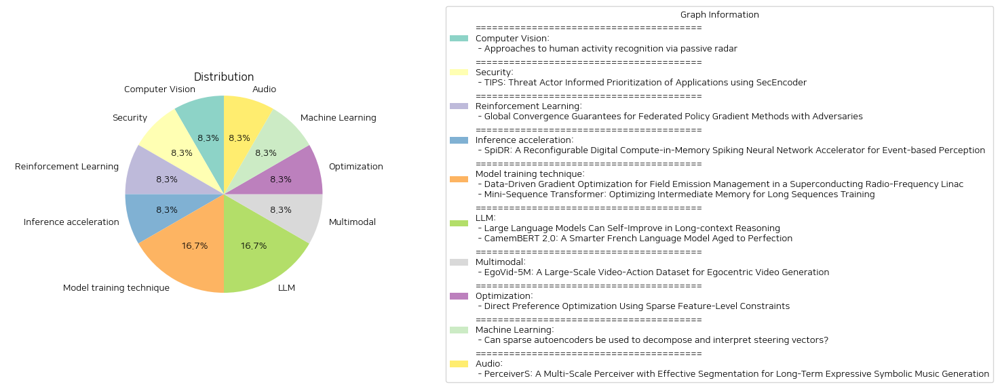

# Daily Artificial Intelligence Insights : Papers

## 🎠 Computer Vision

**요약:**

제목: '수동 레이더를 통한 인간 활동 인식 접근법'

요약 보고서:
이 논문은 수동 레이더를 활용한 인간 활동 인식(HAR)의 새로운 방법을 탐구합니다. 특히 비침습적인 Wi-Fi 채널 상태 정보(CSI) 데이터를 중심으로 연구합니다. 기존의 HAR 접근법은 카메라나 웨어러블과 같은 침습적인 센서를 자주 사용하여 프라이버시 문제를 야기할 수 있습니다. 본 연구는 CSI의 비침습적 특성을 활용하여 인간의 움직임에 의해 발생하는 신호 변화를 해석하기 위해 스파이킹 신경망(SNN)을 사용합니다. 이러한 네트워크는 DeepProbLog와 같은 상징적 추론 프레임워크와 통합되어 HAR 시스템의 적응성과 해석 가능성을 향상시킵니다. SNN은 전력 소모가 적어 프라이버시가 중요한 응용에 이상적이며, 실험 결과 SNN 기반 뉴로심볼릭 모델이 높은 정확도를 달성하여 다양한 분야에서 HAR을 위한 유망한 대안임을 보여줍니다.

주요 주제 및 경향:
1. 비침습적 데이터 수집 기술(CSI)의 중요성 증가.
2. 신경망(SNN)과 상징적 추론 프레임워크의 통합을 통한 시스템의 적응성과 해석 가능성 향상.
3. 프라이버시에 민감한 응용을 위한 전력 소비 최적화.

주요 사건과 핵심 정보:
- HAR 시스템의 주요 문제점 중 하나인 프라이버시 문제를 해결하고자 비침습적 접근법 채택.
- SNN과 같은 신경망을 사용하여 높은 정확도를 달성.
- DeepProbLog와의 통합을 통해 프레임워크의 해석 가능성을 향상시키고 HAR 시스템의 적응성 증가.

영향 분석:
- 프라이버시 문제를 해결하기 위한 다양한 산업에서 HAR 접근법의 활용 가능성 증가.
- 인공지능 및 데이터 처리 분야의 전력소모 최적화 연구에 기여.
- 비침습적 데이터 처리 기술의 필요성과 그에 따른 연구 증가.

최종 결론 및 미래 개발 방향:
본 연구는 기존의 침습적 HAR 방법론의 대안으로 프라이버시와 정확도를 동시에 확보할 수 있는 비침습적 접근법의 중요성을 강조합니다. 또한, SNN과 같은 신경망의 에너 효율성이 강조되며, 추후 다양한 분야에서의 HAR 시스템의 확대 가능성을 시사합니다. 앞으로 비침습적 데이터 처리 기술의 발전과 신경망의 해석 가능성 향상에 대한 연구가 계속될 것으로 예상됩니다.

**출처:**

 - Approaches to human activity recognition via passive radar (https://deeplearn.org/arxiv/543512/approaches-to-human-activity-recognition-via-passive-radar)

## 🐱 Security

**요약:**

제목: "TIPS: 위협 행위자 정보를 활용한 SecEncoder 기반 애플리케이션 우선순위화"
요약: 이 논문은 보안 모델인 TIPS(위협 행위자 정보 기반 우선순위화)를 소개합니다. TIPS는 인코더와 디코더 언어 모델의 장점을 결합하여 손상된 애플리케이션을 탐지하고 우선순위를 지정합니다. 위협 행위자 정보를 통합함으로써 TIPS는 탐지의 정확성과 관련성을 향상시킵니다. 실제 애플리케이션 벤치마크 데이터셋을 사용한 광범위한 실험 결과, 악성 애플리케이션을 식별할 때 F-1 점수 0.90을 달성하여 높은 효율성을 입증하였습니다. 또한, 실제 현장에서 TIPS는 보안 분석가의 조사 대기열을 87%까지 줄여 위협 대응 과정을 원활하게 하고 전반적인 보안 태세를 개선합니다.

핵심 주제와 트렌드:
1. 위협 행위자 정보 활용: 위협 인텔리전스를 통합하여 보안 탐지의 정확성을 높임.
2. 인공지능 기반 보안: 인코더와 디코더 모델을 활용한 AI 보안 기술.
3. 효율적인 위협 대응: 조사 대기열 감소와 보안 업무 간소화.

주요 사건 및 정보:
- TIPS 모델의 도입과 실험 결과: 실험을 통해 악성 애플리케이션 탐지 시 높은 F-1 점수(0.90)를 기록.
- 보안 분석가의 효율성 향상: 조사 대기열이 87% 감소하여 분석가의 업무 부담을 크게 줄임.

영향 분석:
- 보안 기술 분야에서 TIPS 모델의 도입은 탐지 정확성을 높이고 보안 운영의 효율성을 크게 향상시킬 수 있습니다. 이를 통해 기업의 전반적인 보안 상태가 개선될 수 있으며, 위협에 대한 보다 신속한 대응이 가능해집니다.

결론 및 미래 발전 가능성:
TIPS는 보안 분야에서 AI 기반 탐지와 위협 인텔리전스의 결합이 미래 보안 대응의 새로운 기준이 될 수 있음을 보여줍니다. 앞으로도 이와 같은 통합 접근 방식이 더욱 발전할 것으로 예상되며, 다양한 보안 시나리오에 적용되어 보안 태세를 지속적으로 강화할 수 있을 것입니다.

**출처:**

 - TIPS: Threat Actor Informed Prioritization of Applications using SecEncoder (https://deeplearn.org/arxiv/548075/tips:-threat-actor-informed-prioritization-of-applications-using-secencoder)

## 🌞 Reinforcement Learning

**요약:**

보고서 요약:

논문 "Global Convergence Guarantees for Federated Policy Gradient Methods with Adversaries"은 분산 강화 학습(FRL)에서의 도전 과제와 그 해결책을 다룹니다. 이 접근법은 여러 에이전트가 공동으로 의사 결정 정책을 구축할 수 있게 하며, 원시 경로를 공유하지 않습니다. 그러나, 소수의 에이전트가 적대적으로 행동할 경우, 재앙적인 결과를 초래할 수 있습니다. 이에 대한 해결책으로, 적대적 에이전트가 서버에 임의의 값을 보낼 수 있는 상황에서도 견고한 정책 경사 기반 접근법을 제안합니다. 이 연구에서는 일반적인 매개변수화 하에서 첫 번째로 전역 수렴성을 보장하는 결과를 보여주며, 적대적인 에이전트가 있는 경우에도 강건성을 유지하면서 샘플 복잡성의 최적화를 달성합니다. 여기서 $N$은 총 에이전트 수이며, $f<N/2$는 적대적 에이전트의 수를 나타냅니다.

주요 주제와 테마로는 분산 학습의 안전성 문제와, 적대적 환경에서도 높은 성능과 안전성을 유지하는 알고리즘의 개발에 초점이 맞추어져 있습니다. 전반적으로, 강화 학습에서의 협력과 안정성 증대를 위한 새로운 방법론을 제안하고 있습니다.

이 논문의 결과들은 여러 분야에서 영향을 미칠 수 있습니다. 예를 들면, 자율주행 차량 네트워크나 IoT 기기의 협력적 학습 시나리오에서, 적대적 공격에 대한 강건성을 보장하면서 분산 협력 시스템의 신뢰성을 높이는 데 기여할 수 있습니다.

미래의 발전을 위해서는 적대적 환경 하에서의 학습 효율성을 더 높이는 방법, 그리고 다양한 분산 학습 환경에서의 적용 가능성에 대한 연구가 필요할 것입니다.

**출처:**

 - Global Convergence Guarantees for Federated Policy Gradient Methods with Adversaries (https://deeplearn.org/arxiv/545735/global-convergence-guarantees-for-federated-policy-gradient-methods-with-adversaries)

## 🐱 Inference acceleration

**요약:**

제목 및 요약에 기반한 종합 보고서:

1. 주요 주제 및 테마 추출:
   - 이 논문은 Spiking Neural Networks (SNNs)와 그 응용에 대해 다루고 있습니다. 특히, Dynamic Vision Sensors (DVS)에서 생성된 비동기적 시계열 데이터를 처리하는 방법으로 SNN의 효율성을 강조합니다. 논문은 현재 SNN 가속기가 다양한 뉴런 모델, 비트 정밀도 및 네트워크 크기에 적응하기 어렵다는 문제를 제기하고 있으며, 막전위 관리의 비효율성과 희소 최적화의 제한을 언급합니다.

2. 공통 키워드 및 트렌드:
   - SNN 가속기의 한계와 적응성 문제
   - 데이터를 이동하지 않고 처리하는 메모리 내 계산
   - 다양한 작업 부하에 적응하기 위한 재구성 가능성
   - 희소 입력의 에너지 사용 감소를 위한 제로-스킵 메커니즘
   - 비동기적 핸드셰이킹 메커니즘을 통한 효율적인 계산 파이프라인 유지

3. 주요 사건 및 중요 정보 요약:
   - 이 연구는 스케일 가능하고 재구성 가능한 디지털 계산-인-메모리 SNN 가속기인 SpiDR를 제안합니다.
   - SpiDR는 다양한 작업 부하에서 데이터 이동을 최소화하고, 정확도와 에너지 효율성 간의 균형을 맞추기 위해 다양한 무게/막전위 비트 정밀도를 지원합니다.
   - 희소 입력에 대한 제로-스킵 메커니즘으로 에너지 사용을 크게 줄이며, 비동기적 핸드셰이킹 메커니즘으로 다양한 계산 단위의 실행 시간을 효과적으로 관리합니다.
   - TSMC 65nm 저전력 기술로 제작된 SpiDR는 최근 문헌에 제안된 다른 디지털 SNN 가속기와 비교하여 경쟁력 있는 성능을 보이며 고급 재구성 가능성을 지원합니다.

4. 이러한 사건이 다양한 부문에 미치는 영향 분석:
   - 이 기술은 이벤트 기반 시각 응용 분야에서 데이터 처리 효율을 크게 향상시킬 수 있습니다.
   - 낮은 에너지 소비와 높은 정밀도를 통해 인공지능 하드웨어의 발전을 이끕니다.
   - 재구성 가능한 특성은 다양한 응용 환경에 대한 적응성을 높입니다.

5. 최종 종합 요약 및 결론:
   - SpiDR는 기존 SNN 가속기의 한계를 극복하고 에너지 효율성과 적응성을 개선하는 혁신적인 접근법을 제공합니다.
   - 이러한 기술 발전은 이벤트 기반 인공지능 시스템에서 중요한 역할을 하며, 미래의 다양한 응용 분야에 적응할 수 있는 가능성을 제시합니다.
   - 지속적인 연구와 개발을 통해 SNN 가속기의 재구성 가능성, 에너지 효율성 및 성능을 더욱 향상시키는 방향으로 발전할 수 있습니다.

**출처:**

 - SpiDR: A Reconfigurable Digital Compute-in-Memory Spiking Neural Network Accelerator for Event-based Perception (https://deeplearn.org/arxiv/545756/spidr:-a-reconfigurable-digital-compute-in-memory-spiking-neural-network-accelerator-for-event-based-perception)

## 🎉 Model training technique

**요약:**

요약 보고서:

1. 주요 주제 및 테마 추출:
   - 데이터 기반 그라디언트 최적화
   - 필드 방출 관리
   - 머신러닝 및 불확실성 정량화
   - 미니 시퀀스 트랜스포머
   - 장기간의 시퀀스 훈련 최적화

2. 공통 키워드 및 패턴 식별:
   - 최적화
   - 메모리 효율성 및 관리
   - 방사선 수준 예측
   - 머신러닝 통합
   - 훈련 효율성 개선 

3. 주요 사건 및 중요 정보 요약:
   - 첫 번째 논문에서는 초전도 라디오 주파수 선형 가속기에서의 필드 방출 관리 문제를 다루며, 기계 학습과 불확실성 정량화를 사용하여 가속기 내 다양한 위치의 방사선 수준을 예측하고, 궁극적으로 캐비티 그라디언트를 최적화하여 필드 방출로 인한 방사선을 줄이면서 실험 물리 프로그램에 필요한 총 에너지 이득을 유지하는 방법을 연구한다. 최적화된 솔루션은 중성자 및 감마 방사선 수준을 40% 이상 감소시켰다.
   - 두 번째 논문은 Mini-Sequence Transformer(MsT)를 소개하며, 이는 초장시퀀스 훈련에서 중간 메모리 사용을 줄여 효율성과 정확성을 높이는 방법론이다. MsT는 입력 시퀀스를 파티셔닝하고 미니 시퀀스를 반복 처리하여 메모리 사용량을 현저히 줄인다. Llama3-8B 모델 실험에서는 MsT를 통해 표준 구현보다 최대 12배 더 긴 시퀀스를 처리하면서도 처리량이나 수렴도가 저하되지 않았다.

4. 사건의 다양한 부문에 대한 영향 분석:
   - 필드 방출 및 방사선 예측에 적용된 머신러닝 기술은 실험 물리학 분야에서의 가속기 운영 효율성을 크게 향상시킬 수 있다.
   - MsT를 통한 메모리 관리 최적화는 대규모 언어 모델(LLM) 훈련의 비용과 자원 소모를 줄일 수 있어 인공 지능 및 빅 데이터 분석 분야에 긍정적인 영향을 미칠 것으로 예상된다.

5. 결론 및 주목할 미래 발전:
   - 최적화된 방사선 관리 및 메모리 효율화를 위한 AI 기술은 장기적으로 실험 물리학 및 AI 훈련 부문에서 비용 절감과 성능 향상을 가져올 것이다.
   - 앞으로의 연구에서는 이러한 기술이 더 넓은 영역에서 어떻게 응용될 수 있는지, 그리고 다른 종류의 머신러닝 모델 및 물리 시스템에 어떻게 통합될 수 있는지를 계속해서 모니터링할 필요가 있다.

**출처:**

 - Data-Driven Gradient Optimization for Field Emission Management in a Superconducting Radio-Frequency Linac (https://deeplearn.org/arxiv/547416/data-driven-gradient-optimization-for-field-emission-management-in-a-superconducting-radio-frequency-linac)
 - Mini-Sequence Transformer: Optimizing Intermediate Memory for Long Sequences Training (https://deeplearn.org/arxiv/543550/mini-sequence-transformer:-optimizing-intermediate-memory-for-long-sequences-training)

## 🚀 LLM

**요약:**

요약 보고서:

1. 주요 주제 및 테마 추출:
   - 대형 언어 모델(LLM)의 장기 문맥 추론 향상 기술
   - 프랑스어 언어 모델 CamemBERT의 업데이트 및 개선

2. 공통 키워드, 트렌드 및 패턴:
   - LLM의 자기 개선을 통한 성능 향상
   - 언어 모델의 최신 데이터 반영 필요성
   - 자연어 처리(NLP)에서의 다양한 적용 가능성

3. 각 논문에서의 주요 이벤트 및 주요 정보 요약:
   - 'Large Language Models Can Self-Improve in Long-context Reasoning': 
     대형 언어 모델들이 긴 문맥을 처리하는 데 발전을 이룬 반면, 긴 문맥 추론에는 여전히 한계를 보임. 기존의 방식은 인공 데이터를 사용하여 미세 조정하는 방식이나, 이는 인간 전문가의 주석이나 GPT-4와 같은 고급 모델에 의존하여 추가 발전을 제한하는 문제점이 있음. 이를 해결하기 위해, 장기 문맥 추론에서 LLM들이 스스로 개선할 수 있는 가능성을 연구하고, 자신의 성능을 향상시키는 \ours 접근법을 제안. 이 접근법은 각 질문에 대해 여러 출력물을 샘플링하고, 최소 베이즈 위험을 통해 평가한 후, 이 출력물에 기초하여 감독된 미세 조정 또는 선호 최적화를 적용하는 단순한 방식으로 구성됨. 실험 결과, Llama-3.1-8B-Instruct 모델에서 절대적으로 4.2점 이상의 개선을 이루었으며, 기존 방식보다 우수한 성능을 보임.

   - 'CamemBERT 2.0: A Smarter French Language Model Aged to Perfection': 
     프랑스어 언어 모델 CamemBERT는 NLP 작업에서 널리 채택되었으나, 오래된 훈련 데이터로 인한 시대적 개념 이동과 새로운 주제 및 용어에 대한 성능 저하의 문제를 직면함. 이 문제는 최신 언어적 트렌드를 반영하는 모델의 필요성을 강조함. 이런 문제를 해결하기 위해 CamemBERT 기반 모델의 두 가지 새 버전인 CamemBERTav2와 CamemBERTv2를 소개. CamemBERTav2는 DeBERTaV3 구조를 기반으로 하고, CamemBERTv2는 RoBERTa를 기반으로 함. 두 모델 모두 더 긴 문맥 길이와 최신 토크나이저를 사용하여 향상된 프랑스어 토크나이징 성능으로 더 크고 최근의 데이터셋을 훈련. 일반적 도메인 NLP 작업과 전문 도메인 응용(예: 의료 분야) 모두에서 평가된 이 모델들은 선행 모델보다 월등한 성능을 보여줌.

4. 이벤트의 다양한 분야에 대한 영향 분석:
   - LLM의 자기 개선 기술은 AI 분야의 지속적인 발전에 기여할 것으로 예상되며, 특히 복잡한 문맥을 다루는 응용 분야에서의 활용 가능성을 높임.
   - 최신 데이터를 반영한 언어 모델은 NLP 범위에서 기본적인 성능 향상 및 새로운 도메인 적용의 유연성을 제공함.

5. 최종 통합 요약 및 미래 개발 방향 결론:
   두 가지 연구는 독립적으로 긴 문맥 처리 및 시대적 변화에 대응하는 언어 모델의 중요성을 부각하며, 현재의 데이터와 기술으로 돋보적인 성능 향상을 보여줌. 향후 연구는 성능 최적화와 최신 데이터를 지속적으로 반영하는 기술에 중점을 두어야 하며, 이러한 모델들이 다양한 NLP 작업에서의 적용을 넓힐 수 있도록 개발을 지속해야 할 것임.

**출처:**

 - Large Language Models Can Self-Improve in Long-context Reasoning (http://arxiv.org/abs/2411.08147v1)
 - CamemBERT 2.0: A Smarter French Language Model Aged to Perfection (http://arxiv.org/abs/2411.08868v1)

## 🌿 Multimodal

**요약:**

1. 주요 주제 및 테마: 
   - 자아 중심적 비디오 생성
   - 세계 시뮬레이션을 위한 비디오 생성 기술
   - 가상 현실, 증강 현실, 게임에서의 응용 가능성
   - 복잡한 행동의 다양성과 장면의 다양성을 다루는 도전 과제
   - EgoVid-5M 데이터셋: 5백만 개의 자아 중심 비디오 클립 및 정교한 행동 주석
   - EgoDreamer: 행동 설명과 운동 제어 신호에 의해 구동되는 자아 중심 비디오 생성

2. 공통 키워드, 트렌드 및 패턴:
   - 자아 중심적 관점
   - 분석된 데이터셋의 필요성 및 데이터 품질 관리
   - 행동 주석 및 운동 제어

3. 주요 사건 요약:
   - 기존 데이터셋의 한계를 해결하기 위해 EgoVid-5M 데이터셋이 개발되었음
   - 이 데이터셋은 정밀한 행동 주석과 높은 수준의 텍스트 설명을 포함하며, 프레임 일관성, 행동 일관성, 모션 부드러움을 유지하기 위한 데이터 정리 파이프라인이 구현됨
   - EgoDreamer는 자아 중심 비디오 생성 기능을 통해 연구 발전을 도모함

4. 사건들의 영향 분석:
   - 가상 현실, 증강 현실, 게임과 같은 분야에서의 애플리케이션 혁신
   - 비디오 생성 기술의 발전을 통한 시뮬레이션 분야의 전환
   - 데이터셋을 통한 연구자들의 연구 촉진 및 기술 발전 기회 제공

5. 최종 요약 및 잠재적 미래 발전 전망:
   EgoVid-5M 데이터셋의 개발은 자아 중심 비디오 생성 분야의 중요한 전환점을 마련합니다. 이 데이터셋은 가상 현실 및 증강 현실의 응용 분야에서 새로운 가능성을 열며, 복잡한 행동 묘사 및 장면 다양성을 탐구하는 데 중점을 둡니다. EgoDreamer의 기능은 이 데이터셋을 통해 enhanced 연구 활동을 가능하게 하며, 이러한 노력이 비디오 생성 연구 전반에 걸쳐 혁신을 촉진할 것입니다. 향후 연구는 이 데이터셋을 발전시키고, 더욱 정교한 시뮬레이션 환경을 구현할 방법을 모색하는 방향으로 진행될 것입니다.

**출처:**

 - EgoVid-5M: A Large-Scale Video-Action Dataset for Egocentric Video Generation (http://arxiv.org/abs/2411.08380v1)

## 🌞 Optimization

**요약:**

1. 주요 주제와 테마 추출:
   - 대형 언어 모델(LLMs)의 인간 선호도와의 정렬
   - 기존의 후처리 기법: 사람 피드백을 통한 강화학습(RLHF), 직접 선호 최적화(DPO)
   - 계산 효율성 부족 및 학습 불안정성
   - 새로운 방법 소개: 특성 수준 제약 선호 최적화(FPO)
   - 희소 오토인코더(SAEs) 및 특성 수준 제약 활용

2. 공통 키워드, 트렌드 및 패턴 식별:
   - 효율적인 정렬 방법, 계산 비용 절감
   - 희소성 강화를 통한 효율성 및 온라인 참조

3. 각 논문에서의 주요 이벤트와 중요한 정보 요약:
   - 기존의 RLHF 및 DPO 방법론은 계산상 비효율적이고 학습의 안정성을 떨어뜨리는 경향이 있음.
   - FPO는 사전 훈련된 희소 오토인코더를 활용하여 특성 수준에서 제약을 가하여 정렬의 안정성을 보장하면서 과정을 단순화함.
   - 특정 벤치마크 데이터 셋을 바탕으로 FPO가 최신 기법에 비해 5.08%의 절대적인 승률 개선을 나타냄.

4. 이러한 이벤트가 다양한 분야에 미치는 영향 분석:
   - FPO는 대형 언어 모델과 인간 선호도 정렬의 효율성을 크게 개선함으로써 AI 개발 및 활용 분야에 긍정적인 영향을 미칠 수 있음.
   - 계산 비용과 학습 시간 감소는 대규모 데이터 처리 및 AI 솔루션 개발 과정에서 중요한 경제적 이점을 제공할 수 있음.

5. 최종 요약 및 향후 주목할 만한 발전:
   - 희소 오토인코더와 특성 수준 제약을 통한 FPO는 대형 언어 모델의 인간 선호도 정렬 과정을 효과적으로 단순화하고 안정적으로 만듦으로써 AI 개발의 중요한 차원으로 부상할 가능성이 있음.
   - 향후 FPO의 발전과 다양하게 적용될 수 있는 가능성을 주목할 필요가 있음. 장기적으로는 다양한 응용 분야에서 더 뛰어난 성능을 보이는 AI 모델 개발이 가속화될 것으로 기대됨.

**출처:**

 - Direct Preference Optimization Using Sparse Feature-Level Constraints (http://arxiv.org/abs/2411.07618v1)

## 💚 Machine Learning

**요약:**

보고서 요약:

1. 주요 주제 및 테마:
   - 제목에서 "드라이빙 벡터" 및 "희소 오토인코더(SAE)"가 중심 주제로 강조되고 있습니다.
   - 요약은 대형 언어 모델의 행동 제어를 위한 드라이빙 벡터의 해석과 관련된 문제를 다루고 있습니다.

2. 공통 키워드, 트렌드 및 패턴:
   - 드라이빙 벡터: 대형 언어 모델을 제어하기 위한 유망한 접근법이지만, 그 기저 메커니즘은 충분히 이해되지 않음.
   - 희소 오토인코더(SAE): 드라이빙 벡터를 해석하기 위한 잠재적인 방법으로 평가됨.
   - 드라이빙 벡터의 해석적 한계: 드라이빙 벡터가 SAE의 입력 분포 밖에 있어 오해를 일으킬 수 있음. 또한 부정적인 특징 방향으로의 투영 포함.

3. 주요 사건 및 핵심 정보 요약:
   - 드라이빙 벡터를 직접적으로 희소 오토인코더에 적용하면 잘못된 해석이 발생할 수 있다는 주장을 소개하고 있으며, 두 가지 이유를 제시하고 있습니다.
   - 드라이빙 벡터가 SAE가 설계된 입력 분포 바깥에 위치하고, 부정적 투영을 가질 수 있다는 점에서 SAE를 통한 드라이빙 벡터 해석이 불완전할 수 있다고 검토했습니다.

4. 이러한 사건들의 각 부문에 대한 영향 분석:
   - 대형 언어 모델의 행동 제어 연구: 드라이빙 벡터의 메커니즘을 더욱 명확히 할 필요성 부각.
   - 인공신경망 및 머신러닝 기법: SAE를 이용한 모델 해석 시 드라이빙 벡터의 한계에 대한 고려 필요성 강조.

5. 최종 종합 요약 및 결론:
   - 드라이빙 벡터의 해석적 활용을 위한 새로운 접근법 탐색이 필요합니다. SAE를 통한 접근은 한계가 있으며, 특히 드라이빙 벡터의 부정적 특성을 고려한 방법론 개발이 필요합니다.
   - 앞으로 드라이빙 벡터의 의미 있는 구조를 해석하기 위한 새로운 계산 기법의 등장 가능성을 주목할 필요가 있습니다.
   - 이러한 연구는 대형 언어 모델의 기능적 해석에 중대한 기여를 할 수 있을 것으로 예상됩니다.

**출처:**

 - Can sparse autoencoders be used to decompose and interpret steering vectors? (http://arxiv.org/abs/2411.08790v1)

## 👽 Audio

**요약:**

**종합 보고서: 다수의 논문 제목과 개요를 기반으로 한 요약 보고서**

1. **핵심 주제 및 테마 추출**
   - 논문 주요 주제는 "음악 생성 기술"로, 특히 "상징적 음악 생성"에 중점을 두고 있습니다. 기존에는 주로 오디오 생성에 중점이 있었으나, 본 논문은 구조적 일관성과 표현력 있는 상징적 음악을 생성하는 데 어려움이 있다고 기술하고 있습니다.

2. **공통 키워드, 트렌드, 패턴 식별**
   - 주요 키워드는 "상징적 음악 생성", "효과적 분할", "다중 스케일 주의 메커니즘", "장기 구조 의존성", "단기 표현 세부사항"입니다.
   - 최신 트렌드는 음악 생성의 정밀도와 표현력을 높이기 위한 복합적인 주의 메커니즘의 적용입니다.

3. **주요 사건 및 중요 정보 요약**
   - 본 연구에서는 새로운 아키텍처인 PerceiverS를 제안하며, 음악 생성에서 장기 구조와 단기의 표현적 디테일을 동시에 배우는 접근 방법을 제시합니다.
   - PerceiverS는 교차 주의와 자기 주의를 다중 스케일 설정에서 결합하여, 장거리 음악 구조를 포착하면서 연주 세부사항을 보존하는 방법을 사용합니다.
   - 실험은 Maestro 등의 데이터셋에서 이루어졌으며, 구조적 일관성과 표현적 다변화를 갖춘 일관된 음악 생성에 있어 개선을 보여주었습니다.

4. **이벤트의 다양한 분야에 대한 영향 분석**
   - 음악 생성 분야에서는 PerceiverS 모델의 도입이 차세대 상징적 음악 생성 시스템의 기초를 마련할 수 있을 것으로 기대됩니다.
   - 음악 교육, 창작 도구 개발, 자동화된 작곡 소프트웨어 등 여러 분야에서 응용 가능성이 기대되며, 향후 연구개발에 큰 영향을 미칠 수 있습니다.

5. **최종 종합 요약결론**
   - 종합적으로, PerceiverS 모델은 상징적 음악 생성의 새로운 가능성을 제시하며, 장기 구조와 단기 표현을 균형 있게 결합한 혁신적인 방법론을 도입한 것이 돋보입니다.
   - 향후 예술적 창작과 교육 분야에 큰 변화를 가져올 잠재성이 있으며, 이러한 기술 발전은 음악 산업의 변화를 가속화할 것입니다.
   - 미래 개발 점으로는 더욱 다양한 음악 장르에 대한 적용 가능성을 검토하고, 사용자 경험을 개선하기 위한 인터페이스 개발 등이 필요합니다.

**출처:**

 - PerceiverS: A Multi-Scale Perceiver with Effective Segmentation for Long-Term Expressive Symbolic Music Generation (http://arxiv.org/abs/2411.08307v1)

