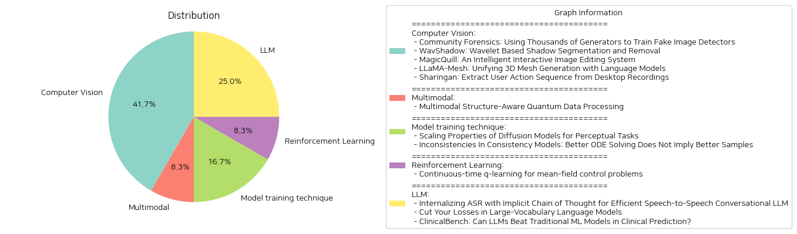

# Daily Artificial Intelligence Insights : Papers

## 🪄 Computer Vision

**요약:**

### 종합 요약 보고서

이번 보고서는 다양한 기술 분야의 논문들에서 중요한 주제와 경향을 추출하여 그 영향을 분석하고 미래 발전 가능성을 도출하고자 한다.

#### 주요 주제 및 경향

1. **AI 이미지 및 텍스트 모델**
   - 'Community Forensics' 논문은 다양하고 많은 이미지 생성 모델 데이터를 이용하여 인공지능 생성 이미지를 탐지하는 기법을 탐구한다. 모델의 다양성이 증가할수록 탐지 성능이 개선되고 있다는 결과를 보여준다.
   - 'MagicQuill'은 다언어 모델(MLLM) 사용으로 사용자의 편의를 극대화한 이미지를 실시간으로 편집하는 시스템을 논의한다.

2. **그림자 및 이미지 처리**
   - 'WavShadow'는 그림자 제거 및 분할의 효율성을 향상시키기 위해 새로운 논리를 제시하며, 특히 마스크드 오토인코더와 프리어트 컨볼루션을 사용한다.

3. **3D 메쉬 생성 통합**
   - 'LLaMA-Mesh' 논문은 대용량 언어 모델을 이용해 3D 메쉬 생성을 다루며, 언어와 3D 공간 데이터를 통합하는 방법론을 개발했다. 이는 특히 3D 튜토리얼에서 얻은 공간적 지식을 장점으로 삼는다.

4. **사용자 행동 시퀀스 추출**
   - 'Sharingan'은 데스크톱 녹화를 통해 사용자 행동 시퀀스를 추출하는 방법론을 제시하며, 비전-언어 모델(VLM)을 활용한 새로운 시도를 보여준다.

#### 주요 이벤트 및 정보

- 대규모 데이터셋과 다양한 생성 모델을 활용한 연구에서 탐지 성능의 향상 가능성을 보여준다.
- 그림자 처리에서는 새로운 방법론이 도입되어 기존 한계를 극복하고, 데이터세트에서 성능 향상을 이루었다.
- 3D 메쉬 생성에서는 언어 데이터와의 통합을 시도하였으며, 이는 언어와 공간 데이터를 연결하는 새로운 패러다임을 제시한다.
- 사용자 행동 추출에서는 DF 접근법을 통해 상당한 정확성을 보였고, 이는 자동화에 기여하는 데이터를 생성하였다.

#### 영향 분석 및 미래 발전 가능성

- **AI 및 데이터 처리 분야**: 다양한 데이터셋과 모델을 활용한 연구는 AI의 탐지 능력과 이해도를 높이는데 중요한 기여를 할 것이다.
- **이미지 및 3D 처리**: 새로운 알고리즘 및 통합 접근법은 이미지 처리 및 3D 메쉬 생성의 가능성을 확장할 것이며, 이는 가상 현실 및 디지털 콘텐츠 제작에 영향을 미칠 것이다.
- **자동화 및 사용자 분석**: 행동 추출 기술은 로봇 프로세스 자동화와 사용자 경험 개선에 활용될 수 있으며, 향후 더 많은 데이터 및 정확도를 바탕으로 발전할 가능성이 크다.

#### 결론

이번 보고서는 여러 현대적 연구들이 기술 통합과 다중 데이터셋 활용을 통해 미래의 기술적 진보를 촉진할 수 있음을 보여준다. AI는 점점 더 복잡한 작업을 수행하며, 이에 따른 데이터 다양성과 방법론의 통합이 중요한 역할을 하고 있다. 앞으로 이러한 신기술을 다양한 분야에 적용함으로써 새로운 상업적 및 과학적 발전이 예상된다.

**출처:**

 - Community Forensics: Using Thousands of Generators to Train Fake Image Detectors (https://deeplearn.org/arxiv/546034/community-forensics:-using-thousands-of-generators-to-train-fake-image-detectors)
 - WavShadow: Wavelet Based Shadow Segmentation and Removal (https://deeplearn.org/arxiv/546999/wavshadow:-wavelet-based-shadow-segmentation-and-removal)
 - MagicQuill: An Intelligent Interactive Image Editing System (http://arxiv.org/abs/2411.09703v1)
 - LLaMA-Mesh: Unifying 3D Mesh Generation with Language Models (http://arxiv.org/abs/2411.09595v1)
 - Sharingan: Extract User Action Sequence from Desktop Recordings (http://arxiv.org/abs/2411.08768v1)

## 🌿 Multimodal

**요약:**

### 종합 보고서

#### 1. 주요 주제 및 테마 추출
- 양자 데이터 처리
- 다중 모드 구조 인식
- 자연어 처리 (NLP)와 대형 언어 모델 (LLMs)
- 높은 차원 텐서를 이용한 구조적 접근
- 양자 컴퓨터를 활용한 텍스트 변환
- 텍스트와 이미지 데이터를 활용한 다중 모드 데이터 처리

#### 2. 공통 키워드 및 트렌드
- "블랙 박스" 문제: 대형 언어 모델의 결정 과정 불투명성
- 양자 컴퓨터 활용: 고차원 텐서의 양자 시스템 적용
- 이미지와 텍스트의 통합된 데이터 처리
- 구조적 관계: 언어의 구문 및 문법적 관계와 이미지의 계층적 구성 요소

#### 3. 주요 이벤트 및 중요한 정보 요약
이 논문에서는 MultiQ-NLP라는 프레임워크를 개발하여 구조 인식 데이터 처리에 접근했다. 특히, 이는 다중 모드 데이터인 텍스트와 이미지를 대상으로 한다. 이 접근법은 문장의 구문 및 문법적 관계는 물론 이미지의 계층적인 구성 요소까지 포괄하는 새로운 타입의 변환을 포함한다. 고차원 텐서를 이용하여 이러한 구조적 관계를 모델링하고, 이는 양자 컴퓨터에서 훈련하여 텍스트를 변형된 양자 회로로 변환할 수 있게 함으로써 고속 처리 문제를 해결했다.

#### 4. 여러 분야에 대한 영향 분석
- **자연어 처리(NLP)**: 양자 컴퓨터를 활용한 데이터 처리 기술이 LLMs의 효율성을 높일 수 있다.
- **이미지 처리 및 인식**: 이미지와 텍스트 통합 처리를 통해 새로운 데이터 모델링 방법을 제공한다.
- **양자 컴퓨팅 분야**: 양자 컴퓨팅의 실제 응용 사례를 강화하며 AI와의 통합 가능성을 탐색한다.

#### 5. 최종 요약 및 미래 발전 방향
이 연구는 양자 컴퓨팅을 데이터 처리에 활용하여 LLM의 '블랙 박스' 문제를 해결하는 데 기여하였다. MultiQ-NLP 프레임워크는 언어와 이미지 데이터를 통합적으로 처리할 수 있는 가능성을 제시하며, 향후 구조적 텍스트와 이미지의 통합 데이터 처리에 대한 발전을 기대할 수 있다. 양자 컴퓨터의 적용 가능성이 확대됨에 따라, 다양한 구조화된 데이터에 대한 모델링과 해석의 정확성이 더 높아질 수 있을 것으로 보인다. 앞으로는 다양한 언어 및 이미지 데이터 처리를 통해 실질적인 응용 확대에 주목할 필요가 있다.

**출처:**

 - Multimodal Structure-Aware Quantum Data Processing (https://deeplearn.org/arxiv/547000/multimodal-structure-aware-quantum-data-processing)

## 🍋 Model training technique

**요약:**

### Summary Report in Korean

#### 1. 주요 주제 및 테마 추출

첫 번째 논문에서는 '확산 모델의 확장 특성'에 대해 논의하며, 시각 인식 작업에 대한 강력한 패러다임을 제공한다고 주장합니다. 깊이 추정, 광학 흐름, 세그먼테이션 등의 작업을 이미지 변환의 프레임워크 내에서 통합하고, 이러한 작업에 확산 모델을 사용하는 것이 훈련 및 테스트 시간 계산에 이점이 된다고 설명합니다.

두 번째 논문은 '일관성 모델의 불일치'를 탐구하며, 일관성 모델(CM)이 확산 모델의 샘플링 비용을 줄어줄 수 있으나, 오히려 수치적으로 낮은 에러에도 불구하고 샘플 품질이 저하될 수 있다는 점을 발견합니다.

#### 2. 공통 키워드, 트렌드, 패턴

- **확산 모델**: 두 논문 모두 확산 모델의 특성과 성능에 주목하고 있습니다. 확산 모델의 계산 효율성과 샘플링 품질이 주요 주제입니다.
- **최적화**: 첫 번째 논문에서는 확산 모델을 훈련 및 추론에 있어서 최적화하는 방법을 제시하고 있으며, 두 번째 논문에서는 일관성 모델을 통한 ODE 해결의 최적화를 탐구합니다.
- **시각 인식 과제**: 두 논문 모두 시각 인식 작업에 대한 모델 성능을 개선하고 정밀도를 높이는 방법을 제안합니다.

#### 3. 주요 사건 및 중요한 정보 요약

- **첫 번째 논문**: 시각 인식 작업에 대한 확산 모델의 효용성과 이를 최적화하는 방법을 제시했습니다. 이로써 더 적은 데이터와 계산으로도 뛰어난 성능을 달성하였습니다.
- **두 번째 논문**: 일관성 모델이 확산 모델의 샘플링 비용을 줄인다는 점을 소개하고, Direct CMs이 ODE 해결에서 에러를 줄였음에도 품질 저하가 발생하는 불일치를 조사합니다.

#### 4. 이러한 사건의 부문별 영향 분석

- **컴퓨터 비전**: 두 논문은 모두 컴퓨터 비전 과제에서 확산 모델의 활용 가능성을 넓혔습니다. 각각의 연구는 적은 데이터와 계산 비용으로 높은 성능을 유지할 수 있는 가능성을 보여주고 있어, 관련 산업에 효율적인 기술 개발을 가능하게 할 것입니다.
- **연구 및 개발**: 모델 최적화에 대한 새로운 인사이트를 제공하며, 연구자들이 향후 더 나은 최적화 기술을 개발하는 데 기여할 것입니다.

#### 5. 결론 및 잠재적 향후 개발

이 두 논문은 확산 모델의 시각 인식 작업에서의 활용 가능성을 크게 증대시켰음을 보여줍니다. 첫 번째 논문은 실제 태스크에 효율적인 모델 학습 방법을 제시했고, 두 번째 논문은 이론과 실제 사이의 불일치를 식별함으로써 연구 내 중요한 토대를 마련했습니다. 앞으로의 연구는 이러한 기술적 불일치를 해결하고, 모델 성능을 더욱 향상시키는 방향으로 나아갈 것으로 예상됩니다.

**출처:**

 - Scaling Properties of Diffusion Models for Perceptual Tasks (https://deeplearn.org/arxiv/548172/scaling-properties-of-diffusion-models-for-perceptual-tasks)
 - Inconsistencies In Consistency Models: Better ODE Solving Does Not Imply Better Samples (http://arxiv.org/abs/2411.08954v1)

## 🧸 Reinforcement Learning

**요약:**

1. **핵심 주제 및 테마 추출**:
   - 지속 시간 q-학습
   - 평균장 제어 문제
   - 엔트로피 정규화 강화 학습
   - 에이전트의 평균장 상호작용
   - 통합 q-함수 및 본질적 q-함수
   - 정책 개선 반복

2. **공통 키워드, 트렌드 및 패턴 식별**:
   - Q-learning, q-학습
   - 지속 시간, 연속 시간
   - 평균장 (Mean-field) 상호작용
   - 강화 학습, 엔트로피 정규화
   - 마팅게일 조건
   - 정책 정책 탐색 및 개선, 모델 프리 학습 알고리즘
   - LQ 제어 프레임워크
     
3. **주요 사건 및 중요 정보 요약**:
   이 연구는 연속 시간 Q-learning의 평균장 제어 문제에 대한 연구로, 특히 엔트로피 정규화의 설정에서 다룹니다. 에이전트의 평균장 상호작용은 q-함수 정의를 미묘하게 만들어, 두 가지 q-함수가 자연스럽게 등장하게 됩니다: 
   - **통합 q-함수(q)**: Gu, Guo, Wei 및 Xu(2023)이 도입한 통합 Q-함수의 일차 근사치로서 학습할 수 있습니다.
   - **본질적 q-함수(q_e)**: 정책 개선 반복에서 사용되는 함수입니다.
   두 q-함수는 모든 테스트 정책 하에 적분 표현을 통해 관련됩니다. 이러한 연구에는 특정 테스트 정책을 활용한 약한 마팅게일 조건에 기반한 모델 프리 학습 알고리즘이 포함됩니다. 그리고 LQ 제어 프레임워크와 그 외의 예제들에서 최적 값 함수와 q-함수의 정확한 매개변수화를 도출하고, 알고리즘을 시뮬레이션 실험을 통해 설명합니다.

4. **이벤트의 영향 분석**:
   평균장 제어는 여러 에이전트가 상호작용하는 복잡한 시스템에서 중요한 역할을 하며, 이러한 시스템에서의 최적 제어 문제를 해결하기 위한 새로운 방법론을 제공합니다. 지속 시간 q-학습을 통해 더 복잡한 제어 문제에서도 효과적인 정책을 찾을 수 있는 가능성을 열어주며, 이는 금융, 로봇 공학, 네트워크 시스템 등 다양한 분야에 응용될 수 있습니다.

5. **최종 요약 및 결론 및 향후 발전 가능성**:
   본 연구는 연속 시간에서의 강화 학습을 평균장 제어 문제에서 탐구하며, 통합 및 본질적 q-함수 개념을 도입하여 시스템의 복잡성을 해결하는 방향을 제시합니다. 이는 특히 다중 에이전트 시스템에서 정책 평가와 개선을 통해 최적 제어를 구현하는 데 기여할 수 있을 것입니다. 이러한 연구는 앞으로도 다양한 응용 및 확장 가능성이 있으며, 특히 강화 학습 알고리즘의 세분화와 이를 통한 실용적 구현이 주목할 만한 발전으로 예상됩니다.

**출처:**

 - Continuous-time q-learning for mean-field control problems (https://deeplearn.org/arxiv/544232/continuous-time-q-learning-for-mean-field-control-problems)

## 💙 LLM

**요약:**

**종합 요약 보고서**

1. **주요 주제와 테마**

- 'Internalizing ASR with Implicit Chain of Thought for Efficient Speech-to-Speech Conversational LLM'는 현재 음성 기반 대규모 언어 모델(LLM)의 직접적인 음성 대화 처리의 한계를 극복하고자 합니다. 기존의 ASR(자동 음성 인식)에서 TTS(텍스트 음성 변환)로의 변환 과정에서 발생하는 지연과 오디오 특징 손실 문제를 개선하고자 내재화된 ASR 사고 체인 방식을 제안하였습니다.

- 'Cut Your Losses in Large-Vocabulary Language Models'는 대규모 어휘를 가진 언어 모델의 학습 시, 불균형적으로 큰 메모리 사용량을 줄이기 위해 제안된 Cut Cross-Entropy(CCE) 방식을 소개합니다. 이 방법은 전체 메모리 사용을 실질적으로 줄이며, 성능의 손실 없이 빠른 처리 속도를 유지할 수 있습니다.

- 'ClinicalBench: Can LLMs Beat Traditional ML Models in Clinical Prediction?'는 임상 예측에서 대규모 언어 모델(LLM)과 전통적인 머신러닝 모델의 성능을 비교 연구합니다. 결과적으로, LLM이 현재 임상 예측에서 전통적인 모델을 능가하지 못한다는 결과가 나와, 임상적 추론 및 의사결정에서의 LLM의 잠재적 결함을 확인하게 되었습니다.

2. **주요 용어, 동향, 패턴 식별**

- 'ASR'와 'TTS', 음성-음성 대화, 메모리 소비 절감, 임상 예측에서 LLM과 전통적 ML 모델 비교 등은 각 논문에서 반복적으로 등장하는 핵심 용어 및 테마입니다.
- 성능 향상과 메모리 사용 최적화는 공통된 연구 목표로 나타납니다.

3. **주요 사건 및 정보**

- 음성-음성 대화에서의 처리 효율성을 높이기 위한 ASR 체인의 내재화 방안 제시.
- 대규모 언어 모델 학습 시 메모리 사용량의 급증 문제를 해결하기 위한 새로운 손실 계산 방법(Cut Cross-Entropy) 제안.
- LLM과 전통적인 머신러닝 모델의 임상 예측 성능 비교를 통해 LLM의 현 주소와 한계점을 확인.

4. **이벤트의 영향 분석**

- ASR 체인의 내재화를 통한 음성-음성 대화의 효율성 증가는 실시간 오디오 상호작용의 자연스러움과 성능을 크게 향상시킬 것으로 기대됩니다.
- 대규모 언어 모델에서 메모리 사용을 획기적으로 줄이는 기술은 더욱 복잡하고 큰 데이터 세트를 다루는 데 필수적이며, 연구 및 상용화 응용에서 비용 효율성을 개선할 것입니다.
- LLM의 임상 예측 한계를 확인한 연구는 자신 있지 않은 분야에서의 무분별한 LLM 사용 경계를 시사하며, 이를 보완하기 위해 LLM과 전통적인 ML 모델의 역할 분담 및 협업이 필요할 것으로 보입니다.

5. **최종 결론 및 앞으로의 개발 동향**

향후 연구 개발은 음성 기반 LLM의 성능 개선과 메모리 효율성 극대화를 위한 방법론 개발에 촛점이 맞춰질 것으로 보입니다. 특히, LLM과 전통적인 ML 모델의 협업을 통해 임상 분야에서의 활용에 대한 새로운 시도가 이루어질 가능성이 높습니다. 이는 기술의 실용성과 통합을 달성하는 데 중요한 관점으로 작용할 것입니다.

**출처:**

 - Internalizing ASR with Implicit Chain of Thought for Efficient Speech-to-Speech Conversational LLM (https://deeplearn.org/arxiv/544674/internalizing-asr-with-implicit-chain-of-thought-for-efficient-speech-to-speech-conversational-llm)
 - Cut Your Losses in Large-Vocabulary Language Models (http://arxiv.org/abs/2411.09009v1)
 - ClinicalBench: Can LLMs Beat Traditional ML Models in Clinical Prediction? (http://arxiv.org/abs/2411.06469v1)

