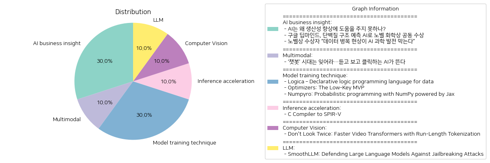

# Daily Artificial Intelligence Insights : News

## ❄️ AI business insight

**요약:**

**주요 주제**:
- 인공지능(AI)의 현재와 미래 발전 방향에 대한 논의가 중심 주제로 나타납니다. 
- AI 기술이 가지는 잠재력과 그것을 실현하기 위한 조건들, 특히 데이터의 중요성이 반복적으로 강조됩니다.
- AI가 과학 발전, 특히 생물학적 탐구(단백질 구조 예측)에서의 실질적 성과를 가져왔다는 긍정적인 소식도 포함됩니다.

**주요 사건**:
1. 'AI는 왜 생산성 향상에 도움을 주지 못하나?'에서는 AI 기술이 경제 발전과 생산성 개선에 기여하기 위해서는 중요한 개선이 필요하다는 점이 부각됩니다.
2. '구글 딥마인드, 단백질 구조 예측 AI로 노벨 화학상 공동 수상'에서는 구글 딥마인드의 AI가 단백질 접힘 예측을 통해 노벨상을 수상한 사건이 주목됩니다.
3. '노벨상 수상자 “데이터 병목 현상이 AI 과학 발전 막는다”'에서는 AI 기술의 발전에 필요한 핵심적 요소로 고품질 데이터의 부족이 지적됩니다.

**영향 분석**:
- 경제적 측면에서 AI가 생산성 향상에 미치는 효과는 아직 미미하지만, 이에 대한 기대와 필요성은 여전히 큽니다. 새로운 발전의 방향을 모색할 필요가 있습니다.
- 과학적인 측면에서는 AI 기술이 생명공학 분야에서 중요한 학문적 성과를 거두고 있어 긍정적 영향을 미치고 있습니다. 이는 AI를 통해 복잡한 생물학적 문제를 해결할 수 있는 가능성을 시사합니다.
- AI 발전을 위한 필수 동력으로 고품질 데이터의 필요성이 강조되며, 데이터 제공 및 관리는 지속적으로 해결해야 할 주요 과제로 떠오르고 있습니다.

**최종 요약**:
이번 뉴스들은 AI 기술이 다양한 분야에서 어떻게 적용되고 있는지를 조명합니다. 특히, 과학적인 발견을 도와주는 방향으로의 AI 활용 사례는 성과가 나오는 긍정적인 사례로 보입니다. 그러나 경제적 측면에서는 실제 생산성 향상에 필요한 추가적인 개선이 요구됩니다. AI 발전을 위한 주요 장애물 중 하나로 데이터 품질 문제가 지적되는 만큼, 향후 데이터 관리와 활용 분야에서의 발전이 중요한 관건으로 작용할 것입니다. 이와 관련된 기술 개선과 데이터 인프라 발전 등이 다음 과제로 보입니다.

**출처:**

 - AI는 왜 생산성 향상에 도움을 주지 못하나? (https://www.technologyreview.kr/ai%eb%8a%94-%ec%99%9c-%ec%83%9d%ec%82%b0%ec%84%b1-%ed%96%a5%ec%83%81%ec%97%90-%eb%8f%84%ec%9b%80%ec%9d%84-%ec%a3%bc%ec%a7%80-%eb%aa%bb%ed%95%98%eb%82%98/)
 - 구글 딥마인드, 단백질 구조 예측 AI로 노벨 화학상 공동 수상 (https://www.technologyreview.kr/%ea%b5%ac%ea%b8%80-%eb%94%a5%eb%a7%88%ec%9d%b8%eb%93%9c-%eb%8b%a8%eb%b0%b1%ec%a7%88-%ea%b5%ac%ec%a1%b0-%ec%98%88%ec%b8%a1-ai%eb%a1%9c-%eb%85%b8%eb%b2%a8-%ed%99%94%ed%95%99%ec%83%81-%ea%b3%b5%eb%8f%99/)
 - 노벨상 수상자 “데이터 병목 현상이 AI 과학 발전 막는다” (https://www.technologyreview.kr/%eb%85%b8%eb%b2%a8%ec%83%81-%ec%88%98%ec%83%81%ec%9e%90-%eb%8d%b0%ec%9d%b4%ed%84%b0-%eb%b3%91%eb%aa%a9-%ed%98%84%ec%83%81%ec%9d%b4-ai-%ea%b3%bc%ed%95%99-%eb%b0%9c%ec%a0%84-%eb%a7%89%eb%8a%94/)

## 🧸 Multimodal

**요약:**

1. **주요 주제**:
   - AI 기술의 진화: 텍스트 기반 AI 챗봇에서 음성 및 영상 생성 기능을 갖춘 더욱 진화된 AI로의 전환.
   - 변화와 혁신: AI의 발전이 다양한 기술의 혁신을 촉진하고 있는 점.

2. **주요 사건**:
   - 텍스트 기반의 AI 챗봇 기술이 새로운 단계로 진화하고 있음을 강조하는 뉴스.
   - 음성과 영상 생성 기능을 통한 AI의 능력이 더욱 강력해지고 있음을 언급.

3. **영향 분석**:
   - 경제: AI 기술의 진화로 인해 관련 산업의 성장이 예상되며, 특히 IT 및 기술 산업에서 새로운 비즈니스 기회가 창출될 가능성이 높음.
   - 사회: AI가 일상생활에 더 깊숙이 침투함에 따라 개인 정보 보호 및 윤리적 문제에 대한 논의가 증가할 수 있음.
   - 기술 혁신: 새로운 AI 기술의 발전은 다른 연관 기술의 발전과 혁신을 촉진할 것으로 예상됨.

4. **최종 요약**:
   AI 기술의 진화는 기존 텍스트 기반 서비스에서 벗어나 음성 및 영상 기능을 통합하여 더 나은 사용자 경험을 제공하게 될 것으로 보입니다. 이러한 변화는 기술 산업의 성장을 촉발할 것이며, 경제적 기회를 확대할 것입니다. 그러나 이로 인해 사회 및 윤리적 문제에 대한 심도 있는 논의도 필요할 것입니다. 앞으로 기술 발전의 방향과 그에 따른 사회적 영향에 주목해야 할 것입니다.

**출처:**

 - ‘챗봇’ 시대는 잊어라…듣고 보고 클릭하는 AI가 뜬다 (https://www.technologyreview.kr/%ec%b1%97%eb%b4%87-%ec%8b%9c%eb%8c%80%eb%8a%94-%ec%9e%8a%ec%96%b4%eb%9d%bc-%eb%93%a3%ea%b3%a0-%eb%b3%b4%ea%b3%a0-%ed%81%b4%eb%a6%ad%ed%95%98%eb%8a%94-ai%ea%b0%80-%eb%9c%ac%eb%8b%a4/)

## 👽 Model training technique

**요약:**

1. **주요 테마**:
   - 데이터 조작 및 프로그래밍 언어: Logic과 NumPyro 모두 데이터 조작 및 프로그래밍에 대한 내용을 다루고 있음. Logica는 SQL 컴파일러로 활용되어 효율적인 데이터 조작을 가능케 하고, NumPyro는 확률적 프로그래밍을 제공하며 자동 미분 및 GPU/CPU 컴파일을 지원함.
   - 최적화 및 성능 향상: Optimizers 기사에서는 데이터베이스 성능 최적화의 중요성과 자동 최적화 툴의 효율성을 강조하고 있음.

2. **주요 사건**:
   - Logica: SQL로 컴파일 되는 선언적 논리 프로그래밍 언어로, 수학적 구문을 활용하여 복잡한 데이터 조작을 효과적으로 처리함.
   - Optimizers: 데이터베이스 쿼리 최적화기가 데이터 처리 성능을 크게 개선하며, 특히 DuckDB의 경우 최대 100배까지 성능 개선을 이끌 수 있음.
   - NumPyro: Jax의 자동 미분 및 JIT 컴파일을 활용한 NumPy 기반 확률적 프로그래밍 라이브러리로, 다양한 추론 알고리즘을 지원함.

3. **영향 분석**:
   - Logica의 SQL 컴파일 능력은 데이터베이스 관리 및 처리의 효율성을 높여 기업의 데이터 분석 능력을 강화할 가능성이 큼.
   - 쿼리 최적화기의 발전은 데이터베이스 운영의 효율성을 크게 향상시키며, 데이터 증가에 대응하는 유연성을 제공함으로써 경제 전반에 긍정적인 영향을 미칠 수 있음.
   - NumPyro의 확률적 프로그래밍 기능은 연구 및 개발 분야에서 복잡한 데이터 분석 및 모델링 능력을 향상시킬 수 있음.

4. **종합 요약**:
   최근 보도된 뉴스에서는 데이터 조작 및 프로그래밍의 효율성 향상을 위한 다양한 기술 발전이 강조됨. Logica와 NumPyro는 각각의 특화된 기능으로 데이터 분석 및 모형화에 기여하고 있으며, 데이터베이스 최적화기 발전은 성능과 효율성을 극대화하고 있음. 이러한 기술 발전은 데이터 중심의 경제와 사회 전반에 긍정적인 충격을 줄 것으로 예상되며, 앞으로 데이터 처리 기술의 발전 및 최적화 방안에 대한 주의 깊은 관찰이 필요할 것임.

**출처:**

 - Logica – Declarative logic programming language for data (https://logica.dev/)
 - Optimizers: The Low-Key MVP (https://duckdb.org/2024/11/14/optimizers.html)
 - Numpyro: Probabilistic programming with NumPy powered by Jax (https://github.com/pyro-ppl/numpyro)

## 💚 Inference acceleration

**요약:**

1. **주요 테마**:
   - 'C Compiler to SPIR-V' 관련 뉴스의 주요 테마는 컴퓨터 프로그래밍, GPU 사용, 코드 공유 기술, 그리고 특히 Vulkan과 SPIR-V와 관련된 개발 과정입니다. 코드를 CPU와 GPU 간에 공유하는 C 컴파일러의 개발이 중점적으로 다루어졌습니다.

2. **주요 사건**:
   - 해당 기사에서 가장 주목할 만한 사건은 HCC라는 C 컴파일러가 Vulkan을 위한 새로운 기술로 개발되었다는 것입니다. 이 컴파일러는 초기 알파 버전 상태로, 현재 5개의 샘플과 하나의 샘플 애플리케이션을 포함하고 있습니다.

3. **영향 분석**:
   - 기술 분야: 이 새로운 C 컴파일러의 등장은 컴퓨터 그래픽 및 게임 개발자들에게 큰 영향을 미칠 수 있습니다. GPU와 CPU 간의 코드 공유가 가능해짐에 따라 개발 효율성이 증가할 가능성이 높습니다.
   - 경제적 측면: Vulkan과 같은 고성능 그래픽 API를 활용하는 게임 및 애플리케이션의 성능 개선은 관련 산업의 성장을 촉진할 수 있습니다.
   - 사회적 측면: 새로운 개발 도구의 출시는 개발자 커뮤니티에서의 연구와 협업을 더욱 활성화시킬 수 있습니다.

4. **최종 요약**:
   - HCC C 컴파일러의 등장은 Vulkan을 활용한 기술 개발에 새로운 가능성을 열어 주고 있습니다. 이로 인해 개발자들은 GPU와 CPU 간에 더욱 효율적으로 코드를 공유할 수 있으며, 이는 최종 사용자 경험의 향상으로 이어질 수 있습니다. 향후 이 컴파일러의 발전과 안정화가 이루어지면서 관련 분야에서의 기술 혁신과 산업 발전을 예의주시할 필요가 있습니다. 개발 단계에서 초기 이슈나 호환성 문제 등이 발생할 수 있으며, 이를 해결하는 과정에서 추가적인 발전이 기대됩니다.

**출처:**

 - C Compiler to SPIR-V (https://github.com/heroseh/hcc)

## ⭐ Computer Vision

**요약:**

1. **주요 주제**:
   이번 기사에서는 비디오 변환기(VT)에서의 효율성 증대 및 처리 시간 감소가 주요 주제로 다뤄집니다. 구체적으로, 'Run-Length Tokenization (RLT)'을 통해 비디오 변환기에서 중복 토큰을 제거하여 성능을 향상시키는 기술이 소개되고 있습니다.

2. **주요 사건**:
   기사에서 가장 중요한 내용은 RLT 기술 도입으로 인해 비디오 변환기의 처리량이 40% 증가하고 학습 시간이 40% 이상 감소했다는 것입니다. 이는 모델의 정확성을 거의 떨어뜨리지 않으면서도 성능을 크게 향상시킨다는 점에서 큰 의의를 가집니다.

3. **영향 분석**:
   이러한 기술적 발전은 주로 경제 및 기술 분야에 긍정적인 영향을 미칠 것으로 보입니다. 비디오 콘텐츠 관련 산업에서는 비용 효율성을 높이고 새로운 비즈니스 모델을 창출할 수 있는 가능성을 제공합니다. 또한, 더 빠른 데이터 처리와 비용 절감은 인공지능 및 머신러닝 연구의 가속화를 촉진할 것입니다. 

4. **최종 요약**:
   기사에서 소개한 RLT 기술은 비디오 변환기에서의 비효율성을 해결함으로써 관련 분야의 혁신을 촉발할 수 있는 잠재력을 가지고 있습니다. 이는 기술 발전이 비용 절감과 처리 효율성 측면에서 비디오 처리 시장 전반에 긍정적인 영향을 미칠 것입니다. 앞으로는 이 기술의 적용 범위가 넓어지면서 다양한 산업에서의 활용 가능성 및 시장 변화 추이에 주목할 필요가 있습니다.

**출처:**

 - Don't Look Twice: Faster Video Transformers with Run-Length Tokenization (https://rccchoudhury.github.io/rlt/)

## 🥳 LLM

**요약:**

1. **핵심 주제**:
   - 대형 언어 모델(LLMs)의 보안 강화
   - 인공지능 모델의 취약성 공격(일명 '탈옥 공격') 방어
   - 새로운 알고리즘을 통한 모델 보호 방법 개발

2. **주요 사건**:
   - 대형 언어 모델은 인간의 의도에 맞춰 사용될 것을 목표로 삼고 있음에도 불구하고 여전히 취약점이 존재하여, 악성 공격자가 의도치 않은 콘텐츠를 생성하게 만들 수 있는 위험이 큼.
   - 이러한 문제를 해결하기 위해 SmoothLLM이라는 새로운 알고리즘이 제안됨.
   - 이 알고리즘은 대형 언어 모델이 탈옥 공격에 대항하여 방어할 수 있도록 설계된 최초의 알고리즘임.

3. **영향 분석**:
   - **경제적 영향**: 새로운 알고리즘 개발로 인해 인공지능 보안 관련 시장의 활성화가 예상됨. LLM 사용 기업들 및 관련 기술 시장에서 보안 솔루션에 대한 수요가 증가할 가능성이 있음.
   - **사회적 영향**: 탈옥 공격이 방어됨으로써 LLM 기반 시스템과 응용 프로그램의 도덕적, 윤리적 사용에 대한 신뢰성이 향상될 수 있음. 이는 인공지능을 활용한 다양한 서비스와 응용 프로그램의 확산을 촉진할 수 있음.
   - **기술적 영향**: 알고리즘 개발을 통한 인공지능 모델의 취약점 개선은 향후 인공지능 기술 전반에 걸쳐 보안 표준 및 방어 체계의 진화를 이끌어낼 수 있음.

4. **최종 요약**:
   - 대형 언어 모델의 보안 문제는 현재의 기술적 도전 과제이며, 이를 해결하기 위해 SmoothLLM이라는 알고리즘이 개발되었다. 이 알고리즘은 인공지능 모델의 안정성을 높이고, 탈옥 공격으로부터 모델을 방어하는 데 초점이 맞춰져 있다. 이는 인공지능 보안의 새로운 패러다임을 제시하며, 이에 따른 시장의 확장, 사회적 신뢰도 향상, 기술 발전을 촉진할 것으로 예상된다. 앞으로 이에 관한 보안 기술의 발전과 실제 응용 사례들을 주시할 필요가 있다.

**출처:**

 - SmoothLLM: Defending Large Language Models Against Jailbreaking Attacks (https://arxiv.org/abs/2310.03684)

